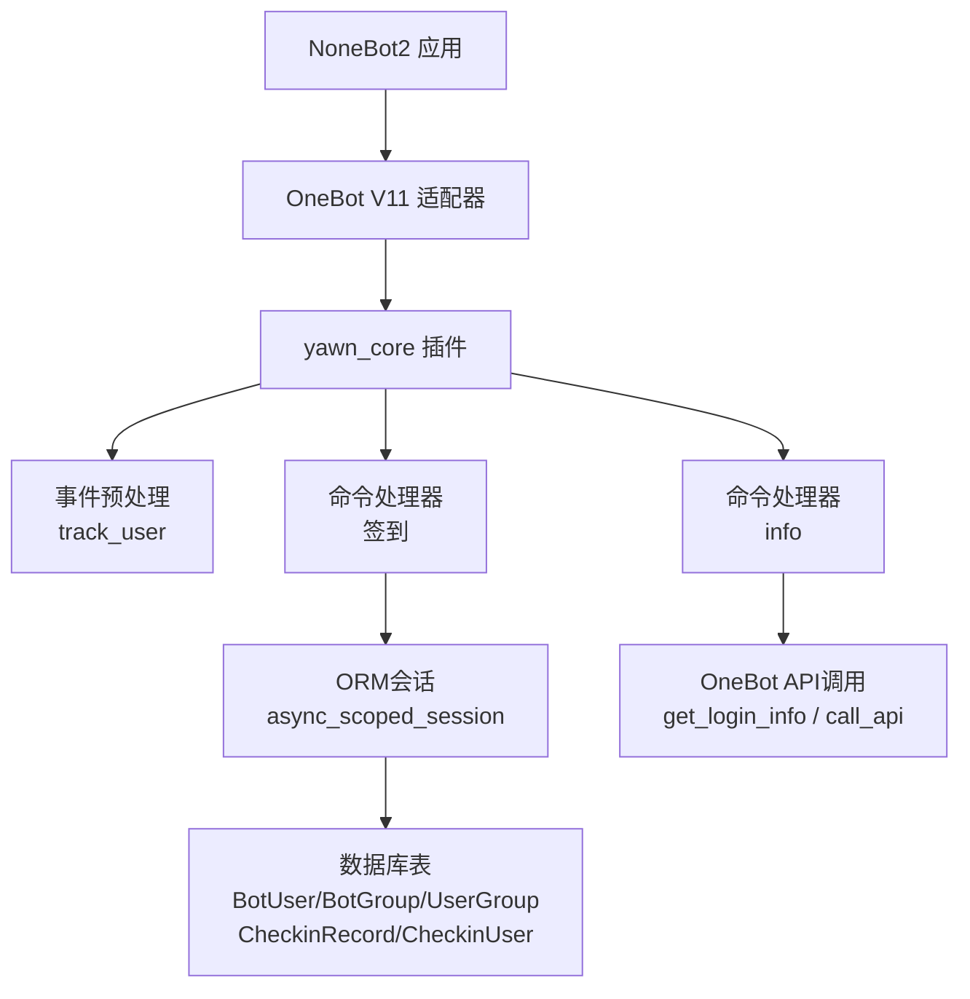
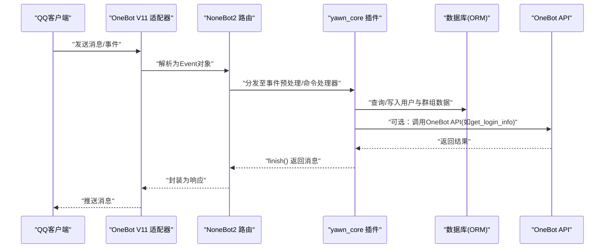
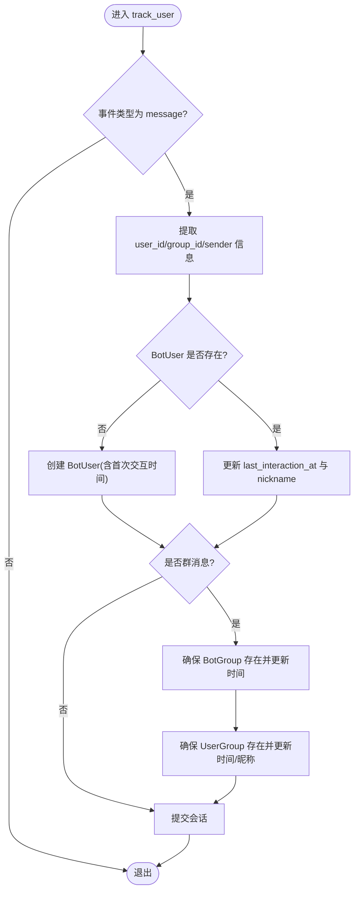
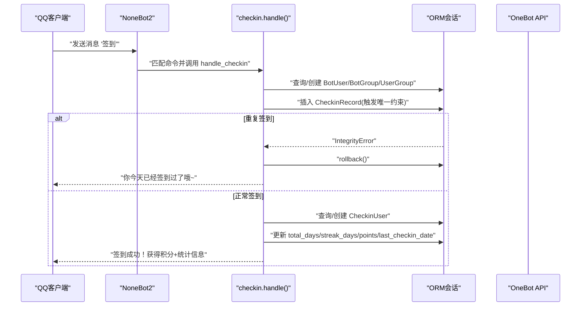
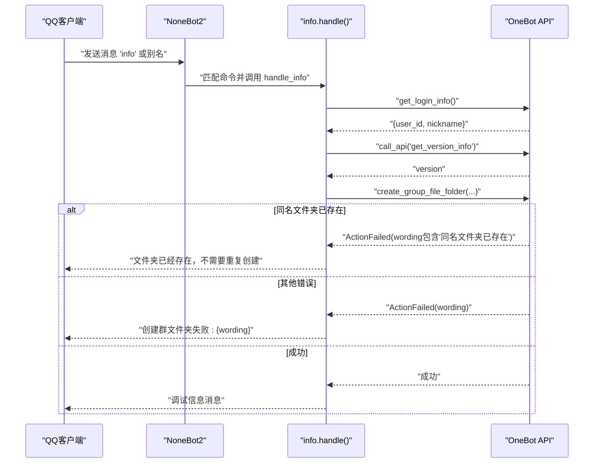
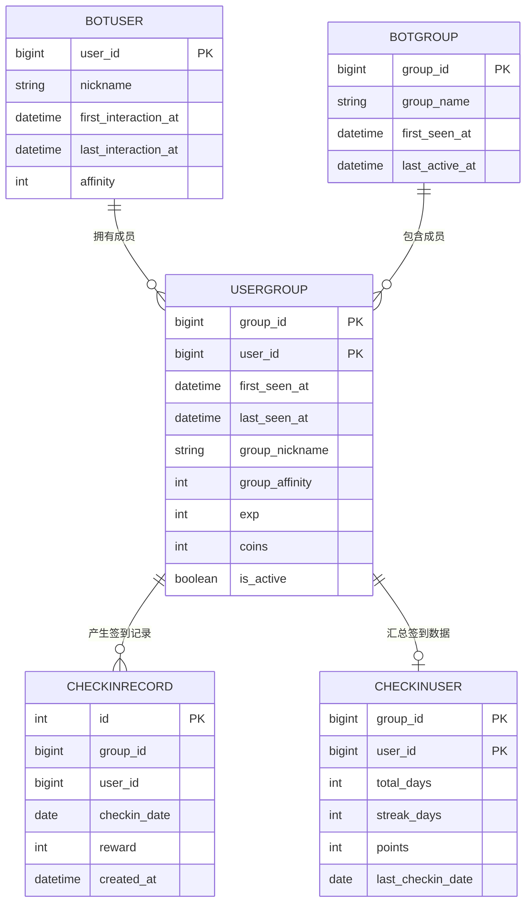
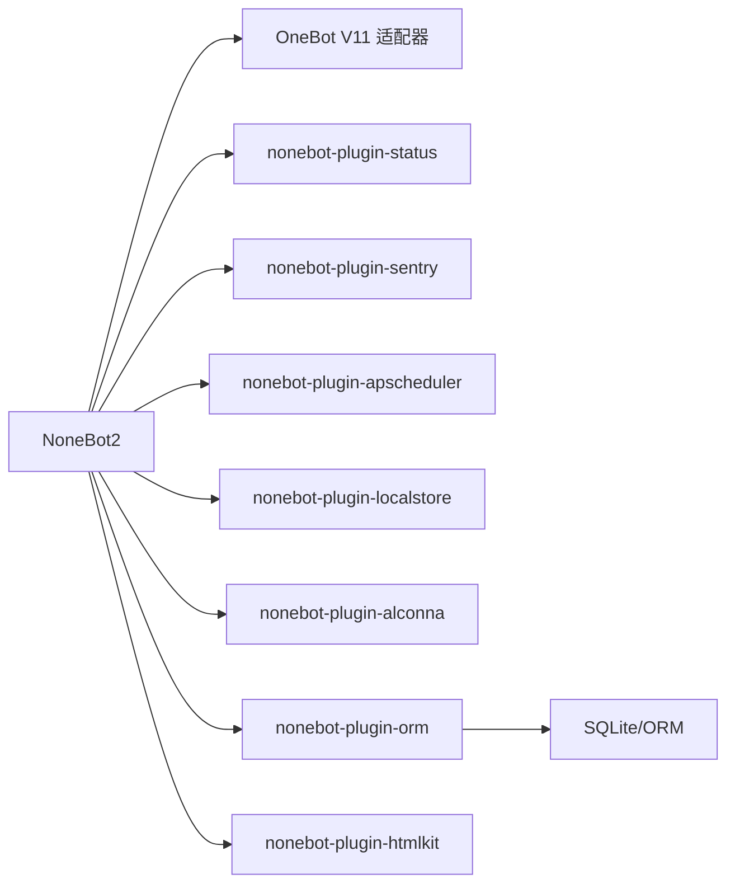

# API参考文档

<cite>
**本文引用的文件**   
- [README.md](file://README.md)
- [pyproject.toml](file://pyproject.toml)
- [src/plugins/yawn_core/__init__.py](file://src/plugins/yawn_core/__init__.py)
- [src/plugins/yawn_core/checkin.py](file://src/plugins/yawn_core/checkin.py)
- [src/plugins/yawn_core/info.py](file://src/plugins/yawn_core/info.py)
- [src/plugins/yawn_core/data_models/bot_user.py](file://src/plugins/yawn_core/data_models/bot_user.py)
- [src/plugins/yawn_core/data_models/bot_group.py](file://src/plugins/yawn_core/data_models/bot_group.py)
- [src/plugins/yawn_core/data_models/user_group.py](file://src/plugins/yawn_core/data_models/user_group.py)
- [src/plugins/yawn_core/data_models/checkin_record.py](file://src/plugins/yawn_core/data_models/checkin_record.py)
- [src/plugins/yawn_core/data_models/checkin_user.py](file://src/plugins/yawn_core/data_models/checkin_user.py)
- [data/nonebot_plugin_orm/migrations/yawn_core/b15555e176e4_add_checkin_tables.py](file://data/nonebot_plugin_orm/migrations/yawn_core/b15555e176e4_add_checkin_tables.py)
</cite>

## 目录
1. [简介](#简介)
2. [项目结构](#项目结构)
3. [核心组件](#核心组件)
4. [架构总览](#架构总览)
5. [详细组件分析](#详细组件分析)
6. [依赖关系分析](#依赖关系分析)
7. [性能与速率限制](#性能与速率限制)
8. [故障排查指南](#故障排查指南)
9. [结论](#结论)
10. [附录：OneBot V11协议要点与调试](#附录onebot-v11协议要点与调试)

## 简介
本文件为 YawnBot 的API参考文档，聚焦于基于 OneBot V11 协议的QQ消息接口使用方式、命令处理器与事件处理器的实现说明。文档涵盖以下能力：
- QQ消息接口的使用方法（基于 NoneBot2 + OneBot V11）
- 命令处理器接口：签到、info（个人信息/版本信息）
- 事件处理器接口：用户首次对话与群内发言追踪
- OneBot V11 的消息格式、事件类型与实时交互模式
- 错误处理策略、安全考虑、速率限制建议与版本信息
- 常见用例、客户端实现指南、性能优化技巧
- 协议特定的调试工具与监控方法

YawnBot 基于 NoneBot2 框架，通过 OneBot V11 适配器接入QQ平台，插件位于 src/plugins 下，当前包含 yawn_core 插件，提供签到与信息查询功能。

**章节来源**
- [README.md:1-13](file://README.md#L1-L13)
- [pyproject.toml:1-44](file://pyproject.toml#L1-L44)

## 项目结构
YawnBot 采用插件化架构，核心代码位于 src/plugins/yawn_core 目录，数据模型定义在 data_models 子目录中，数据库迁移脚本位于 data/nonebot_plugin_orm/migrations/yawn_core。

**图表来源**
- [src/plugins/yawn_core/__init__.py:16-80](file://src/plugins/yawn_core/__init__.py#L16-L80)
- [src/plugins/yawn_core/checkin.py:22-26](file://src/plugins/yawn_core/checkin.py#L22-L26)
- [src/plugins/yawn_core/info.py:6-6](file://src/plugins/yawn_core/info.py#L6-L6)
- [data/nonebot_plugin_orm/migrations/yawn_core/b15555e176e4_add_checkin_tables.py:26-57](file://data/nonebot_plugin_orm/migrations/yawn_core/b15555e176e4_add_checkin_tables.py#L26-L57)

**章节来源**
- [pyproject.toml:25-44](file://pyproject.toml#L25-L44)
- [src/plugins/yawn_core/__init__.py:1-13](file://src/plugins/yawn_core/__init__.py#L1-L13)

## 核心组件
- 事件预处理：track_user
  - 作用：拦截所有 message 类型事件，自动创建或更新 BotUser、BotGroup、UserGroup 记录，并维护首次交互时间、最后活跃时间等字段。
  - 触发时机：任何 message 事件进入时。
  - 关键行为：根据 sender.card 或 sender.nickname 更新昵称；群消息则确保群与用户-群关系存在。

- 命令处理器：签到
  - 命令名：签到
  - 优先级：5，阻塞模式
  - 功能：为用户生成随机积分奖励，写入签到记录，更新累计天数、连续天数与总积分，返回格式化消息。
  - 防重：通过数据库唯一约束保证每人每天仅一次签到。

- 命令处理器：info
  - 命令名：info，别名包括“个人信息”、“我的信息”、“用户信息”
  - 功能：获取机器人登录信息与版本信息，构造调试消息；尝试创建名为“调试信息”的群文件夹，失败时按错误信息给出提示。

**章节来源**
- [src/plugins/yawn_core/__init__.py:16-80](file://src/plugins/yawn_core/__init__.py#L16-L80)
- [src/plugins/yawn_core/checkin.py:22-26](file://src/plugins/yawn_core/checkin.py#L22-L26)
- [src/plugins/yawn_core/info.py:6-6](file://src/plugins/yawn_core/info.py#L6-L6)

## 架构总览
YawnBot 的整体交互流程如下：
- 客户端通过 OneBot V11 向适配器发送消息或事件
- NoneBot2 路由到对应插件的命令或事件处理器
- 插件通过 ORM 会话读写数据库，必要时调用 OneBot API 完成外部动作
- 处理器返回响应消息给客户端

**图表来源**
- [src/plugins/yawn_core/__init__.py:16-80](file://src/plugins/yawn_core/__init__.py#L16-L80)
- [src/plugins/yawn_core/checkin.py:41-147](file://src/plugins/yawn_core/checkin.py#L41-L147)
- [src/plugins/yawn_core/info.py:10-39](file://src/plugins/yawn_core/info.py#L10-L39)

## 详细组件分析

### 事件处理器：track_user（用户与群组追踪）
- 触发条件：event.get_type() == "message"
- 主要逻辑：
  - 提取 user_id、group_id（若存在）、sender.card/nickname
  - 确保 BotUser 存在，首次交互记录 first_interaction_at，更新 last_interaction_at
  - 若是群消息，确保 BotGroup 与 UserGroup 存在，记录首次出现时间与最后出现时间
  - 提交会话

**图表来源**
- [src/plugins/yawn_core/__init__.py:16-80](file://src/plugins/yawn_core/__init__.py#L16-L80)

**章节来源**
- [src/plugins/yawn_core/__init__.py:16-80](file://src/plugins/yawn_core/__init__.py#L16-L80)

### 命令处理器：签到
- 命令注册：on_command("签到", priority=5, block=True)
- 处理流程：
  - 计算当前日期（中国时区），生成随机奖励积分（5~15）
  - 确保 BotUser、BotGroup、UserGroup 存在并更新活跃时间
  - 插入 CheckinRecord，并通过 flush 触发唯一约束检查，防止重复签到
  - 更新或创建 CheckinUser，累计 total_days、streak_days、points，记录 last_checkin_date
  - 返回包含 @用户、奖励积分、累计与连续天数、当前积分的消息

**图表来源**
- [src/plugins/yawn_core/checkin.py:22-26](file://src/plugins/yawn_core/checkin.py#L22-L26)
- [src/plugins/yawn_core/checkin.py:41-147](file://src/plugins/yawn_core/checkin.py#L41-L147)

**章节来源**
- [src/plugins/yawn_core/checkin.py:22-26](file://src/plugins/yawn_core/checkin.py#L22-L26)
- [src/plugins/yawn_core/checkin.py:41-147](file://src/plugins/yawn_core/checkin.py#L41-L147)

### 命令处理器：info（个人信息/版本信息）
- 命令注册：on_command("info", aliases={"个人信息","我的信息","用户信息"}, priority=5, block=True)
- 处理流程：
  - 获取机器人登录信息（user_id、nickname）
  - 调用 get_version_info 获取版本信息
  - 构造包含调试信息的消息
  - 尝试创建群文件夹“调试信息”，捕获 ActionFailed 异常并按 wording 内容返回友好提示

**图表来源**
- [src/plugins/yawn_core/info.py:6-6](file://src/plugins/yawn_core/info.py#L6-L6)
- [src/plugins/yawn_core/info.py:10-39](file://src/plugins/yawn_core/info.py#L10-L39)

**章节来源**
- [src/plugins/yawn_core/info.py:6-6](file://src/plugins/yawn_core/info.py#L6-L6)
- [src/plugins/yawn_core/info.py:10-39](file://src/plugins/yawn_core/info.py#L10-L39)

### 数据模型与数据库结构
- BotUser：全局用户实体，包含 user_id、nickname、first_interaction_at、last_interaction_at、affinity
- BotGroup：群组实体，包含 group_id、group_name、first_seen_at、last_active_at
- UserGroup：用户与群组的关系实体，包含 group_id、user_id、first_seen_at、last_seen_at、group_nickname、group_affinity、exp、coins、is_active
- CheckinRecord：签到历史记录，包含 group_id、user_id、checkin_date、reward、created_at，具有唯一约束（group_id,user_id,checkin_date）
- CheckinUser：用户在群的签到汇总，包含 group_id、user_id、total_days、streak_days、points、last_checkin_date

**图表来源**
- [src/plugins/yawn_core/data_models/bot_user.py:12-32](file://src/plugins/yawn_core/data_models/bot_user.py#L12-L32)
- [src/plugins/yawn_core/data_models/bot_group.py:12-29](file://src/plugins/yawn_core/data_models/bot_group.py#L12-L29)
- [src/plugins/yawn_core/data_models/user_group.py:15-61](file://src/plugins/yawn_core/data_models/user_group.py#L15-L61)
- [src/plugins/yawn_core/data_models/checkin_record.py:12-53](file://src/plugins/yawn_core/data_models/checkin_record.py#L12-L53)
- [src/plugins/yawn_core/data_models/checkin_user.py:12-47](file://src/plugins/yawn_core/data_models/checkin_user.py#L12-L47)
- [data/nonebot_plugin_orm/migrations/yawn_core/b15555e176e4_add_checkin_tables.py:26-57](file://data/nonebot_plugin_orm/migrations/yawn_core/b15555e176e4_add_checkin_tables.py#L26-L57)

**章节来源**
- [src/plugins/yawn_core/data_models/bot_user.py:12-32](file://src/plugins/yawn_core/data_models/bot_user.py#L12-L32)
- [src/plugins/yawn_core/data_models/bot_group.py:12-29](file://src/plugins/yawn_core/data_models/bot_group.py#L12-L29)
- [src/plugins/yawn_core/data_models/user_group.py:15-61](file://src/plugins/yawn_core/data_models/user_group.py#L15-L61)
- [src/plugins/yawn_core/data_models/checkin_record.py:12-53](file://src/plugins/yawn_core/data_models/checkin_record.py#L12-L53)
- [src/plugins/yawn_core/data_models/checkin_user.py:12-47](file://src/plugins/yawn_core/data_models/checkin_user.py#L12-L47)
- [data/nonebot_plugin_orm/migrations/yawn_core/b15555e176e4_add_checkin_tables.py:26-57](file://data/nonebot_plugin_orm/migrations/yawn_core/b15555e176e4_add_checkin_tables.py#L26-L57)

## 依赖关系分析
- 运行时依赖：
  - nonebot2[fastapi]>=2.5.0
  - nonebot-adapter-onebot>=2.4.6
  - nonebot-plugin-status>=0.9.0
  - nonebot-plugin-sentry>=2.0.0
  - nonebot-plugin-apscheduler>=0.5.0
  - nonebot-plugin-localstore>=0.7.4
  - nonebot-plugin-alconna>=0.62.1
  - nonebot-plugin-orm[sqlite]>=0.8.3
  - nonebot-plugin-htmlkit>=0.1.0rc5
- 插件加载配置：
  - plugin_dirs = ["src/plugins"]
  - builtin_plugins = ["echo"]
  - adapters.nonebot-adapter-onebot 配置了 OneBot V11 模块路径

**图表来源**
- [pyproject.toml:7-17](file://pyproject.toml#L7-L17)
- [pyproject.toml:25-44](file://pyproject.toml#L25-L44)

**章节来源**
- [pyproject.toml:7-17](file://pyproject.toml#L7-L17)
- [pyproject.toml:25-44](file://pyproject.toml#L25-L44)

## 性能与速率限制
- 数据库层防重：
  - CheckinRecord 的唯一约束（group_id,user_id,checkin_date）确保每人每天仅一次签到，避免业务层重复判断开销。
- ORM会话管理：
  - 使用 async_scoped_session 进行异步事务管理，减少连接开销。
- 日志与监控：
  - 集成 sentry 插件用于错误上报与监控。
- 速率限制建议：
  - 对高频命令（如签到）建议在网关层或中间件层增加限流策略，避免滥用。
  - OneBot API 调用（如 create_group_file_folder）应捕获异常并降级处理，避免阻塞主流程。

**章节来源**
- [src/plugins/yawn_core/checkin.py:109-114](file://src/plugins/yawn_core/checkin.py#L109-L114)
- [pyproject.toml:38-38](file://pyproject.toml#L38-L38)

## 故障排查指南
- 重复签到问题：
  - 现象：同一用户在同一群同一天多次签到
  - 原因：数据库唯一约束触发 IntegrityError
  - 处理：捕获异常后回滚会话并返回友好提示
- 群文件夹创建失败：
  - 现象：ActionFailed 异常抛出
  - 原因：同名文件夹已存在或其他权限问题
  - 处理：解析 e.info.wording，区分不同错误并返回相应提示
- 用户/群组信息缺失：
  - 现象：新用户首次对话未记录
  - 原因：事件预处理未触发或会话未提交
  - 处理：确认 event_preprocessor 生效，检查 session.commit()

**章节来源**
- [src/plugins/yawn_core/checkin.py:109-114](file://src/plugins/yawn_core/checkin.py#L109-L114)
- [src/plugins/yawn_core/info.py:32-39](file://src/plugins/yawn_core/info.py#L32-L39)
- [src/plugins/yawn_core/__init__.py:79-80](file://src/plugins/yawn_core/__init__.py#L79-L80)

## 结论
YawnBot 通过 NoneBot2 与 OneBot V11 实现了稳定的QQ消息处理能力，yawn_core 插件提供了签到与信息查询两大核心功能。事件预处理机制确保了用户与群组数据的完整性与一致性，数据库唯一约束有效防止了重复签到。结合 sentry 与 ORM 插件，系统具备良好的可观测性与扩展性。建议在生产环境中补充速率限制与更完善的错误处理策略，以提升稳定性与用户体验。

## 附录：OneBot V11协议要点与调试
- 消息格式：
  - 使用 MessageSegment 构建文本、@用户等片段，组合成最终消息
- 事件类型：
  - message：用户消息事件，包含 sender、group_id 等字段
- 实时交互模式：
  - 通过 on_command 注册命令处理器，使用 finish() 返回响应
- 常用API：
  - get_login_info：获取机器人登录信息
  - call_api：通用API调用入口，如 get_version_info、create_group_file_folder
- 调试工具：
  - 使用 nb run --reload 启动开发服务器，支持热重载
  - 查看日志输出定位问题
  - 利用 sentry 插件上报错误与性能指标

**章节来源**
- [src/plugins/yawn_core/info.py:10-39](file://src/plugins/yawn_core/info.py#L10-L39)
- [README.md:3-8](file://README.md#L3-L8)