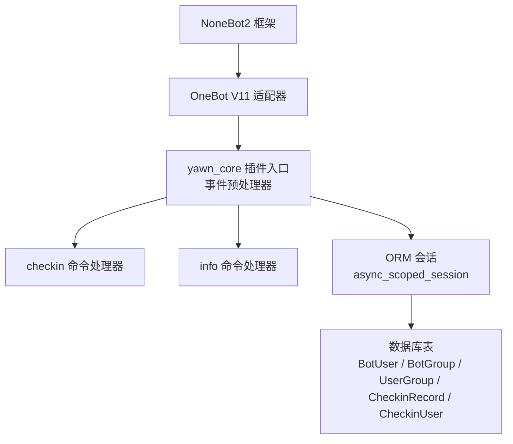
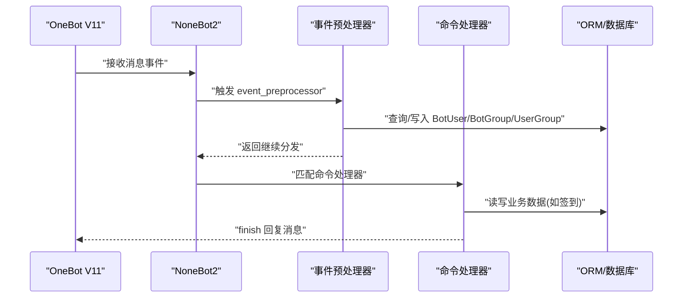
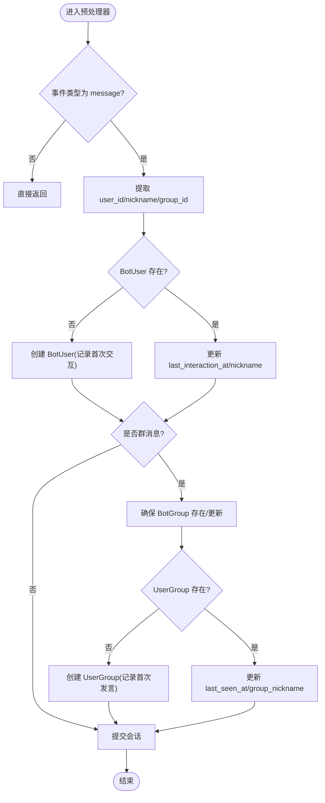
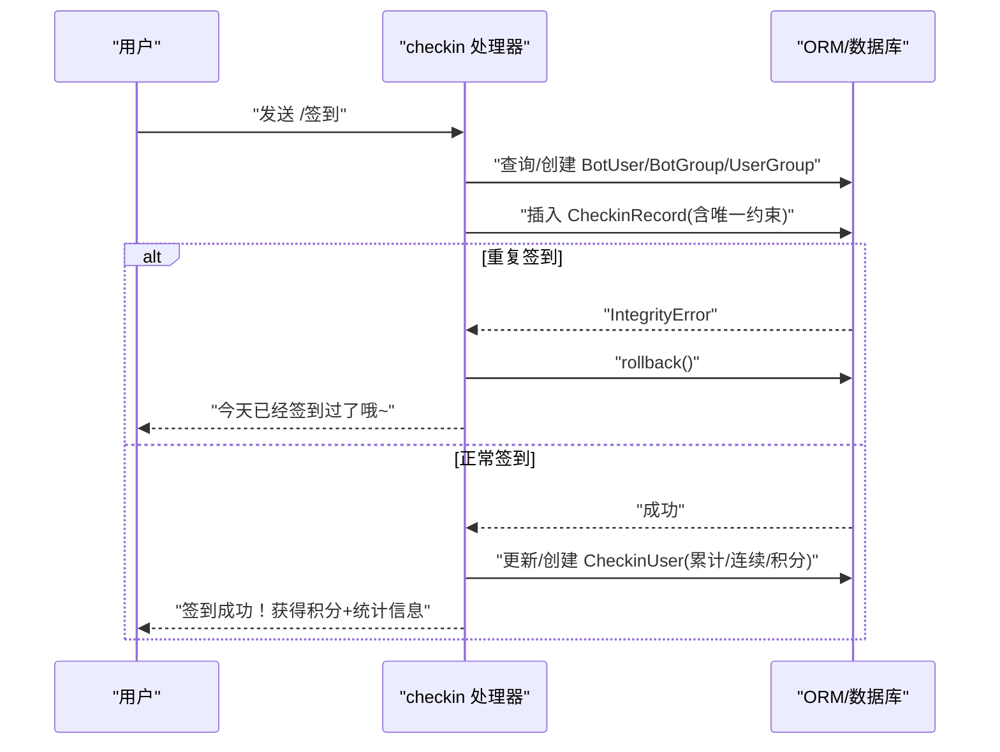
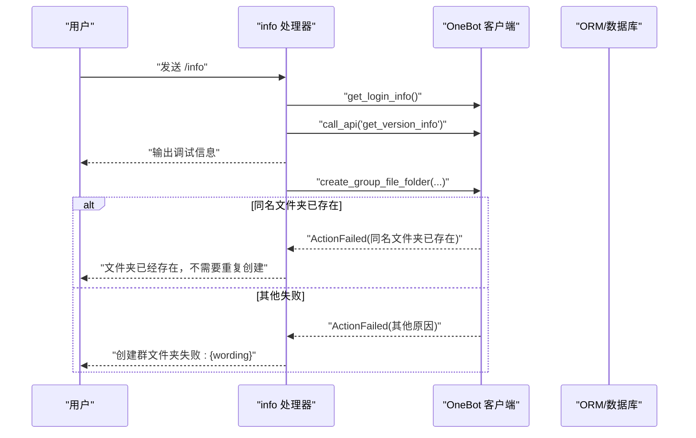
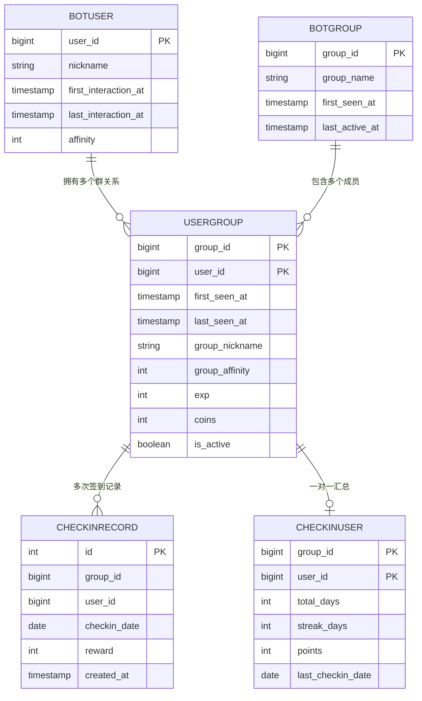
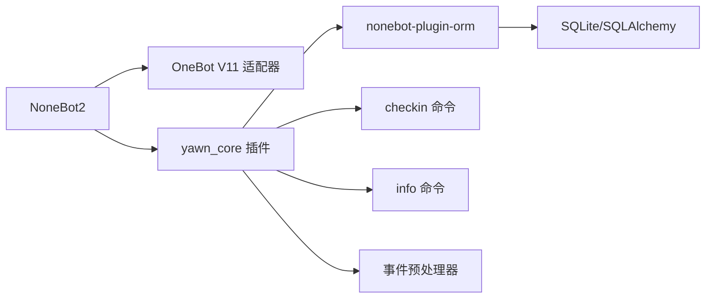

# 事件处理器

<cite>
**本文引用的文件**   
- [README.md](file://README.md)
- [pyproject.toml](file://pyproject.toml)
- [__init__.py](file://src/plugins/yawn_core/__init__.py)
- [checkin.py](file://src/plugins/yawn_core/checkin.py)
- [info.py](file://src/plugins/yawn_core/info.py)
- [bot_user.py](file://src/plugins/yawn_core/data_models/bot_user.py)
- [bot_group.py](file://src/plugins/yawn_core/data_models/bot_group.py)
- [user_group.py](file://src/plugins/yawn_core/data_models/user_group.py)
- [checkin_record.py](file://src/plugins/yawn_core/data_models/checkin_record.py)
- [checkin_user.py](file://src/plugins/yawn_core/data_models/checkin_user.py)
</cite>

## 目录
1. [简介](#简介)
2. [项目结构](#项目结构)
3. [核心组件](#核心组件)
4. [架构总览](#架构总览)
5. [详细组件分析](#详细组件分析)
6. [依赖关系分析](#依赖关系分析)
7. [性能考量](#性能考量)
8. [故障排查指南](#故障排查指南)
9. [结论](#结论)
10. [附录：事件监听器开发指南](#附录事件监听器开发指南)

## 简介
本文件为 YawnBot 的事件处理器 API 文档，面向使用 OneBot V11 协议的 NoneBot2 插件开发者。内容涵盖：
- OneBot V11 消息事件类型与结构说明
- 事件预处理器的实现原理（用户行为追踪、群组信息更新、自动注册）
- 事件的异步处理模式、会话管理与错误恢复策略
- 事件监听器的开发指南（事件过滤、条件判断、自定义处理逻辑）

YawnBot 基于 NoneBot2 + OneBot V11 适配器构建，采用 ORM 持久化用户与群组数据，并通过命令处理器提供签到与信息查询等功能。

## 项目结构
YawnBot 的插件位于 src/plugins/yawn_core 下，包含：
- 事件预处理器与模块入口 __init__.py
- 功能命令处理器 checkin.py（签到）、info.py（调试信息）
- 数据模型 data_models/ 下的 ORM 实体定义

图表来源
- [pyproject.toml:25-43](file://pyproject.toml#L25-L43)
- [__init__.py:16-79](file://src/plugins/yawn_core/__init__.py#L16-L79)
- [checkin.py:22-26](file://src/plugins/yawn_core/checkin.py#L22-L26)
- [info.py:6](file://src/plugins/yawn_core/info.py#L6)

章节来源
- [README.md:1-13](file://README.md#L1-L13)
- [pyproject.toml:1-47](file://pyproject.toml#L1-L47)

## 核心组件
- 事件预处理器：在消息事件进入业务处理器前，统一进行用户与群组的“首次出现”检测与活跃时间更新，确保数据一致性。
- 命令处理器：
  - 签到：校验重复签到、累计积分与连续天数、记录签到历史。
  - 调试信息：获取机器人登录信息与版本信息，并尝试创建群文件夹。
- 数据模型：通过 SQLAlchemy ORM 定义用户、群组、用户-群组关系、签到记录与汇总等实体。

章节来源
- [__init__.py:16-79](file://src/plugins/yawn_core/__init__.py#L16-L79)
- [checkin.py:22-146](file://src/plugins/yawn_core/checkin.py#L22-L146)
- [info.py:6-39](file://src/plugins/yawn_core/info.py#L6-L39)
- [bot_user.py:12-32](file://src/plugins/yawn_core/data_models/bot_user.py#L12-L32)
- [bot_group.py:12-29](file://src/plugins/yawn_core/data_models/bot_group.py#L12-L29)
- [user_group.py:15-61](file://src/plugins/yawn_core/data_models/user_group.py#L15-L61)
- [checkin_record.py:12-53](file://src/plugins/yawn_core/data_models/checkin_record.py#L12-L53)
- [checkin_user.py:12-47](file://src/plugins/yawn_core/data_models/checkin_user.py#L12-L47)

## 架构总览
事件从 OneBot V11 适配器进入 NoneBot2 框架后，先经过 yawn_core 的事件预处理器完成基础数据维护，再路由到具体命令处理器执行业务逻辑，最终通过 ORM 会话提交变更。

图表来源
- [__init__.py:16-79](file://src/plugins/yawn_core/__init__.py#L16-L79)
- [checkin.py:41-146](file://src/plugins/yawn_core/checkin.py#L41-L146)
- [info.py:10-39](file://src/plugins/yawn_core/info.py#L10-L39)

## 详细组件分析

### 事件预处理器（track_user）
职责
- 仅对 message 类型事件生效
- 提取用户 ID、昵称（优先群名片 card，其次 QQ 昵称 nickname）
- 自动注册或更新 BotUser（首次对话记录时间、最后交互时间、昵称）
- 若为群消息，自动注册或更新 BotGroup 与 UserGroup（首次发言记录、最后活跃时间、群昵称）
- 提交会话，保证事务一致性

关键流程

图表来源
- [__init__.py:16-79](file://src/plugins/yawn_core/__init__.py#L16-L79)

章节来源
- [__init__.py:16-79](file://src/plugins/yawn_core/__init__.py#L16-L79)

### 签到命令处理器（checkin）
职责
- 解析群内用户当前昵称
- 确保用户、群组、用户-群组关系存在并更新活跃状态
- 生成随机奖励积分（5~15）
- 插入签到记录，利用数据库唯一约束防止同一天重复签到
- 更新或初始化 CheckinUser 统计（累计天数、连续天数、总积分、最近签到日期）
- 返回友好提示消息

异常处理
- 捕获 IntegrityError 回滚会话并提示“今日已签到”

图表来源
- [checkin.py:41-146](file://src/plugins/yawn_core/checkin.py#L41-L146)
- [checkin_record.py:15-29](file://src/plugins/yawn_core/data_models/checkin_record.py#L15-L29)

章节来源
- [checkin.py:22-146](file://src/plugins/yawn_core/checkin.py#L22-L146)
- [checkin_record.py:12-53](file://src/plugins/yawn_core/data_models/checkin_record.py#L12-L53)
- [checkin_user.py:12-47](file://src/plugins/yawn_core/data_models/checkin_user.py#L12-L47)

### 调试信息命令处理器（info）
职责
- 获取机器人登录信息与版本信息
- 构造消息并输出调试信息
- 尝试创建名为“调试信息”的群文件夹，处理同名冲突与失败情况

图表来源
- [info.py:10-39](file://src/plugins/yawn_core/info.py#L10-L39)

章节来源
- [info.py:6-39](file://src/plugins/yawn_core/info.py#L6-L39)

### 数据模型与关系

图表来源
- [bot_user.py:12-32](file://src/plugins/yawn_core/data_models/bot_user.py#L12-L32)
- [bot_group.py:12-29](file://src/plugins/yawn_core/data_models/bot_group.py#L12-L29)
- [user_group.py:15-61](file://src/plugins/yawn_core/data_models/user_group.py#L15-L61)
- [checkin_record.py:12-53](file://src/plugins/yawn_core/data_models/checkin_record.py#L12-L53)
- [checkin_user.py:12-47](file://src/plugins/yawn_core/data_models/checkin_user.py#L12-L47)

## 依赖关系分析
- NoneBot2 框架与 OneBot V11 适配器负责事件接入与分发
- yawn_core 插件通过 on_command 注册命令处理器，通过 @event_preprocessor 注册事件预处理器
- nonebot-plugin-orm 提供 async_scoped_session 用于异步事务管理
- 数据库层通过 UniqueConstraint 与 ForeignKeyConstraint 保障数据一致性与完整性

图表来源
- [pyproject.toml:25-43](file://pyproject.toml#L25-L43)
- [__init__.py:16-79](file://src/plugins/yawn_core/__init__.py#L16-L79)
- [checkin.py:22-26](file://src/plugins/yawn_core/checkin.py#L22-L26)
- [info.py:6](file://src/plugins/yawn_core/info.py#L6)

章节来源
- [pyproject.toml:25-43](file://pyproject.toml#L25-L43)

## 性能考量
- 事件预处理器仅在 message 类型事件上执行，避免不必要的开销
- 使用 async_scoped_session 保证每次请求的事务隔离与并发安全
- 数据库层面通过唯一约束避免重复签到，减少应用层竞争条件
- 签到流程中先 flush 以尽早触发唯一约束检查，快速失败并回滚

[本节为通用性能建议，不直接分析具体文件]

## 故障排查指南
常见问题与定位方法
- 重复签到报错：检查 CheckinRecord 的唯一约束与 IntegrityError 捕获逻辑
- 群文件夹创建失败：查看 ActionFailed 的 wording 字段，区分“同名文件夹已存在”与其他错误
- 用户/群组未更新：确认事件预处理器是否正确识别 message 类型与 group_id
- 会话未提交：检查 session.commit() 调用位置与异常分支中的 rollback()

章节来源
- [checkin.py:109-114](file://src/plugins/yawn_core/checkin.py#L109-L114)
- [info.py:32-39](file://src/plugins/yawn_core/info.py#L32-L39)
- [__init__.py:16-79](file://src/plugins/yawn_core/__init__.py#L16-L79)

## 结论
YawnBot 的事件处理器通过 NoneBot2 与 OneBot V11 适配器实现了稳定的事件接入与分发。事件预处理器保障了用户与群组数据的自动注册与活跃更新；命令处理器提供了签到与调试信息等核心功能。借助 ORM 与数据库约束，系统在并发与一致性方面具备良好表现。后续可扩展更多事件监听器与业务逻辑，遵循统一的异步会话与错误处理规范。

[本节为总结性内容，不直接分析具体文件]

## 附录：事件监听器开发指南

### OneBot V11 消息事件类型与结构
- 常见事件类型
  - message：私聊/群聊消息事件
  - message_sent：消息发送上报（可选）
  - group_member_*：群成员变动事件（加群/退群/禁言等）
  - friend_add/friend_remove：好友关系变动
  - meta_event：平台元事件（心跳、生命周期等）
- 典型字段（message）
  - user_id：发送者 QQ 号
  - group_id：群号（群消息时存在）
  - sender.card：群名片（优先作为群昵称）
  - sender.nickname：QQ 昵称
  - raw_message/message：原始消息文本或分段

注意：以上字段来源于 OneBot V11 协议与适配器封装，实际可用字段以运行时事件对象为准。

### 事件结构与处理流程
- 事件进入 NoneBot2 后，先经过所有注册的 event_preprocessor
- 预处理器可读取/写入 ORM 会话，完成用户与群组的基础维护
- 随后根据事件类型与命令匹配，路由至对应的 on_command 处理器
- 处理器通过 finish() 返回响应，或通过 send_msg()/reply() 发送消息

章节来源
- [__init__.py:16-79](file://src/plugins/yawn_core/__init__.py#L16-L79)
- [checkin.py:41-146](file://src/plugins/yawn_core/checkin.py#L41-L146)
- [info.py:10-39](file://src/plugins/yawn_core/info.py#L10-L39)

### 事件预处理器的实现原理
- 用户行为追踪
  - 首次对话：创建 BotUser 并记录 first_interaction_at
  - 后续交互：更新 last_interaction_at 与 nickname
- 群组信息更新
  - 首次群消息：创建 BotGroup 与 UserGroup，记录 first_seen_at
  - 后续消息：更新 last_active_at/last_seen_at 与 group_nickname
- 自动注册机制
  - 通过预处理器在消息到达时自动补齐缺失的用户/群组关系，降低业务代码复杂度

章节来源
- [__init__.py:16-79](file://src/plugins/yawn_core/__init__.py#L16-L79)

### 异步处理模式、会话管理与错误恢复
- 异步模式
  - 使用 async def 定义处理器与预处理器
  - 通过 await 调用 ORM 会话与 OneBot API
- 会话管理
  - 使用 async_scoped_session 注入，每个事件独立事务
  - 在需要时调用 flush() 提前触发约束检查，commit() 提交变更
- 错误恢复
  - 捕获 IntegrityError 进行回滚并给出友好提示
  - 捕获 ActionFailed 处理 OneBot API 调用失败（如文件夹已存在）

章节来源
- [checkin.py:109-114](file://src/plugins/yawn_core/checkin.py#L109-L114)
- [info.py:32-39](file://src/plugins/yawn_core/info.py#L32-L39)
- [__init__.py:79](file://src/plugins/yawn_core/__init__.py#L79)

### 事件监听器开发指南
- 事件过滤
  - 在预处理器中通过 event.get_type() 过滤非 message 事件
  - 在命令处理器中通过 on_command 指定命令名与别名
- 条件判断
  - 判断是否为群消息（group_id 是否存在）
  - 判断用户/群组是否已存在，决定创建或更新
- 自定义处理逻辑
  - 使用 async_scoped_session 进行数据读写
  - 使用 finish() 返回响应，结合 MessageSegment 构建富文本
  - 使用 logger 记录关键操作日志

示例参考路径
- 事件过滤与基础维护：[__init__.py:16-79](file://src/plugins/yawn_core/__init__.py#L16-L79)
- 命令注册与处理：[checkin.py:22-26](file://src/plugins/yawn_core/checkin.py#L22-L26)、[info.py:6](file://src/plugins/yawn_core/info.py#L6)
- 会话与异常处理：[checkin.py:109-114](file://src/plugins/yawn_core/checkin.py#L109-L114)、[info.py:32-39](file://src/plugins/yawn_core/info.py#L32-L39)