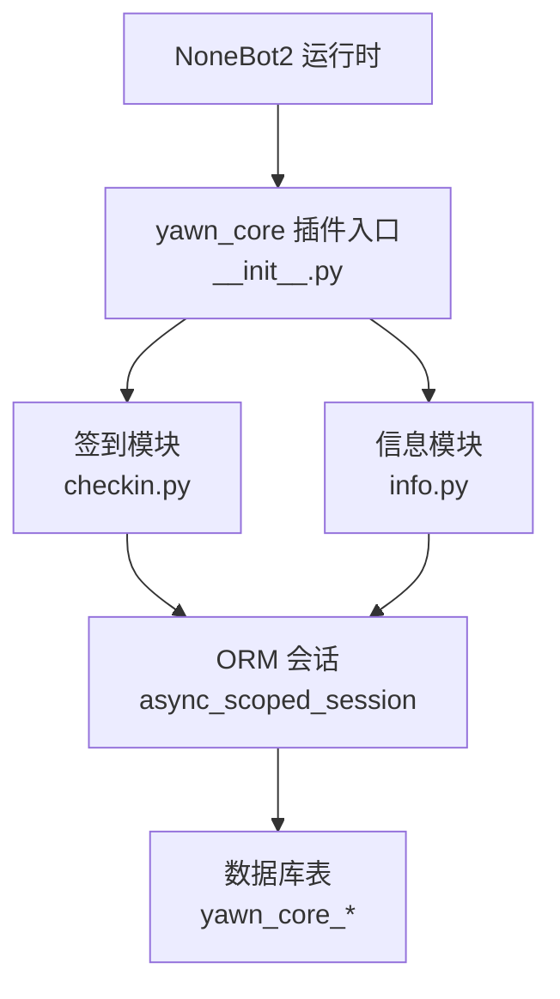
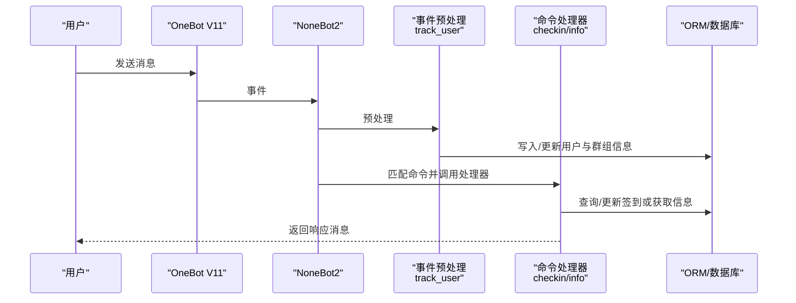
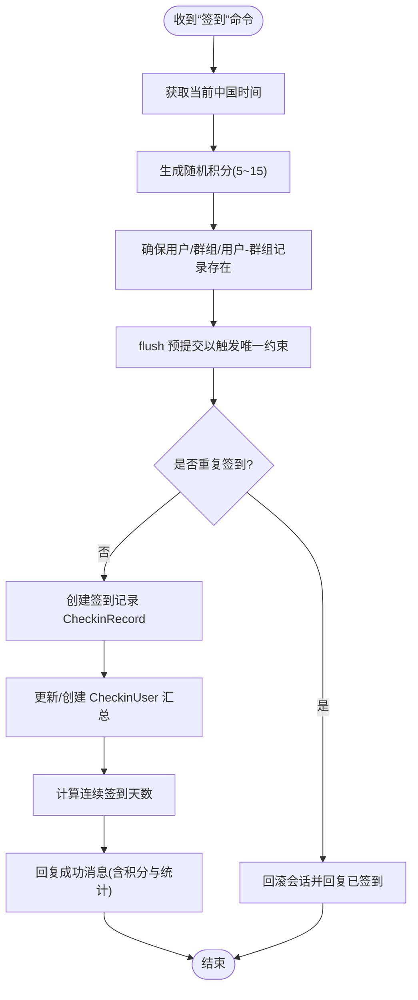
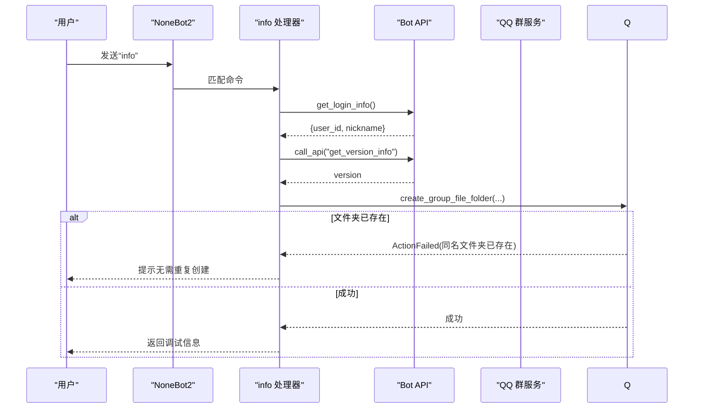
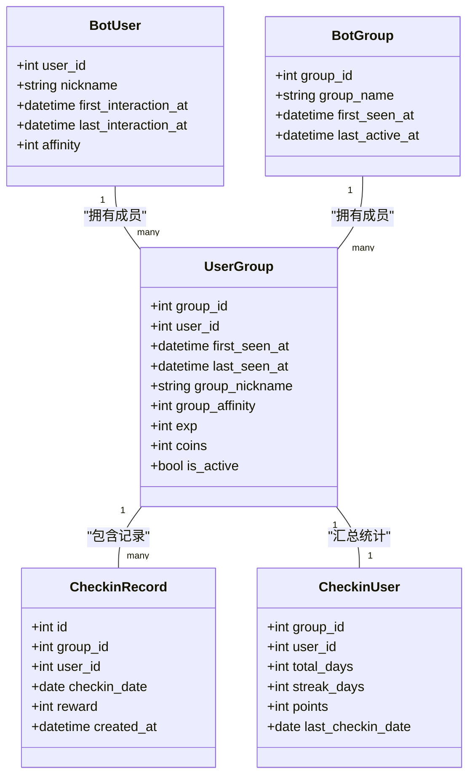

# 命令接口

<cite>
**本文引用的文件**   
- [README.md](file://README.md)
- [pyproject.toml](file://pyproject.toml)
- [__init__.py](file://src/plugins/yawn_core/__init__.py)
- [checkin.py](file://src/plugins/yawn_core/checkin.py)
- [info.py](file://src/plugins/yawn_core/info.py)
- [bot_user.py](file://src/plugins/yawn_core/data_models/bot_user.py)
- [bot_group.py](file://src/plugins/yawn_core/data_models/bot_group.py)
- [user_group.py](file://src/plugins/yawn_core/data_models/user_group.py)
- [checkin_record.py](file://src/plugins/yawn_core/data_models/checkin_record.py)
- [checkin_user.py](file://src/plugins/yawn_core/data_models/checkin_user.py)
- [b15555e176e4_add_checkin_tables.py](file://data/nonebot_plugin_orm/migrations/yawn_core/b15555e176e4_add_checkin_tables.py)
- [c70afa832d5b_add_checkin_tables.py](file://data/nonebot_plugin_orm/migrations/yawn_core/c70afa832d5b_add_checkin_tables.py)
</cite>

## 目录
1. [简介](#简介)
2. [项目结构](#项目结构)
3. [核心组件](#核心组件)
4. [架构总览](#架构总览)
5. [详细组件分析](#详细组件分析)
6. [依赖关系分析](#依赖关系分析)
7. [性能与并发特性](#性能与并发特性)
8. [故障排查指南](#故障排查指南)
9. [结论](#结论)
10. [附录：命令速查表](#附录命令速查表)

## 简介
本文件为 YawnBot 的命令接口文档，聚焦于两个可用命令：“签到”和“info”。内容涵盖触发方式、参数格式、响应模式、处理逻辑、业务规则、返回值格式、优先级与阻塞配置、错误处理机制、权限控制、频率限制与安全注意事项，并提供具体使用示例。

## 项目结构
YawnBot 基于 NoneBot2 框架，插件位于 src/plugins/yawn_core。核心包含：
- 事件预处理与用户/群组追踪（__init__.py）
- 签到命令实现（checkin.py）
- 信息命令实现（info.py）
- 数据模型定义（data_models/*）
- 数据库迁移脚本（data/nonebot_plugin_orm/migrations/yawn_core/*）

图表来源
- [__init__.py:16-79](file://src/plugins/yawn_core/__init__.py#L16-L79)
- [checkin.py:22-26](file://src/plugins/yawn_core/checkin.py#L22-L26)
- [info.py:6](file://src/plugins/yawn_core/info.py#L6)

章节来源
- [README.md:1-13](file://README.md#L1-L13)
- [pyproject.toml:25-43](file://pyproject.toml#L25-L43)

## 核心组件
- 事件预处理 track_user：在每条消息到达时自动维护 BotUser、BotGroup、UserGroup 的活跃信息与昵称，确保后续命令可正确识别用户与群组上下文。
- 签到命令 checkin：支持每日签到，随机奖励积分，统计累计天数、连续天数与总积分，并保证每人每天仅一次。
- 信息命令 info：返回机器人版本、昵称、ID 等调试信息，并在群内创建“调试信息”文件夹用于存放相关文件。

章节来源
- [__init__.py:16-79](file://src/plugins/yawn_core/__init__.py#L16-L79)
- [checkin.py:22-146](file://src/plugins/yawn_core/checkin.py#L22-L146)
- [info.py:6-39](file://src/plugins/yawn_core/info.py#L6-L39)

## 架构总览
命令执行流程概览：
- NoneBot2 接收 OneBot V11 消息事件
- 事件预处理 track_user 更新用户/群组基础信息
- 命令匹配器 on_command 根据命令名与别名进行匹配
- 处理器 handle_* 执行业务逻辑，读写 ORM 会话，返回响应

图表来源
- [__init__.py:16-79](file://src/plugins/yawn_core/__init__.py#L16-L79)
- [checkin.py:41-146](file://src/plugins/yawn_core/checkin.py#L41-L146)
- [info.py:10-39](file://src/plugins/yawn_core/info.py#L10-L39)

## 详细组件分析

### 命令：签到
- 触发方式
  - 命令名：签到
  - 适用场景：群消息（GroupMessageEvent）
  - 参数：无
- 优先级与阻塞
  - 优先级：5
  - 阻塞：是（block=True），命中后不再被其他命令处理器处理
- 处理逻辑与业务规则
  - 时间基准：中国时区 Asia/Shanghai
  - 每次签到随机获得 5~15 积分
  - 自动维护 BotUser、BotGroup、UserGroup 的活跃时间与昵称
  - 记录签到历史 CheckinRecord，并通过唯一约束保证每人每天仅一次
  - 更新 CheckinUser 汇总：累计天数 total_days、连续天数 streak_days、总积分 points、最近签到日期 last_checkin_date
- 返回值格式
  - 文本消息，包含 @用户、本次积分、累计签到天数、连续签到天数、当前积分
- 错误处理
  - 重复签到：捕获 IntegrityError 回滚会话并回复“你今天已经签到过了哦~”
  - 其他异常：未显式捕获，将按 NoneBot2 默认策略处理（建议在生产环境增加统一异常处理）
- 权限控制
  - 未设置额外权限校验；默认对群成员开放
- 频率限制
  - 通过数据库唯一约束实现“每人每天一次”的限制
- 安全考虑
  - 输入来自 OneBot 事件，已做必要字段存在性检查；建议在扩展时增加敏感词过滤与速率限制

图表来源
- [checkin.py:41-146](file://src/plugins/yawn_core/checkin.py#L41-L146)
- [checkin_record.py:15-29](file://src/plugins/yawn_core/data_models/checkin_record.py#L15-L29)
- [checkin_user.py:24-41](file://src/plugins/yawn_core/data_models/checkin_user.py#L24-L41)

章节来源
- [checkin.py:22-146](file://src/plugins/yawn_core/checkin.py#L22-L146)
- [checkin_record.py:12-53](file://src/plugins/yawn_core/data_models/checkin_record.py#L12-L53)
- [checkin_user.py:12-47](file://src/plugins/yawn_core/data_models/checkin_user.py#L12-L47)
- [b15555e176e4_add_checkin_tables.py:58-78](file://data/nonebot_plugin_orm/migrations/yawn_core/b15555e176e4_add_checkin_tables.py#L58-L78)
- [c70afa832d5b_add_checkin_tables.py:26-46](file://data/nonebot_plugin_orm/migrations/yawn_core/c70afa832d5b_add_checkin_tables.py#L26-L46)

### 命令：info
- 触发方式
  - 命令名：info
  - 别名：个人信息、我的信息、用户信息
  - 适用场景：群消息（GroupMessageEvent）
  - 参数：无
- 优先级与阻塞
  - 优先级：5
  - 阻塞：是（block=True）
- 处理逻辑与业务规则
  - 获取机器人登录信息与版本信息
  - 构造调试信息文本（Bot Version、Nickname、ID）
  - 尝试在群内创建名为“调试信息”的文件夹；若同名文件夹已存在则提示无需重复创建
- 返回值格式
  - 文本消息：包含调试信息
  - 若创建文件夹失败：返回失败原因
- 错误处理
  - ActionFailed：当同名文件夹已存在时，返回友好提示；其他失败返回错误详情
- 权限控制
  - 未设置额外权限校验；默认对群成员开放
- 频率限制
  - 未实现频率限制；如需限频可在上层中间件或命令层添加
- 安全考虑
  - 对外暴露机器人版本与 ID 等调试信息，建议仅在受信任群或管理员可见

图表来源
- [info.py:6-39](file://src/plugins/yawn_core/info.py#L6-L39)

章节来源
- [info.py:6-39](file://src/plugins/yawn_core/info.py#L6-L39)

### 事件预处理：track_user
- 功能
  - 首次对话用户：创建 BotUser，记录首次交互时间
  - 群消息：确保 BotGroup 与 UserGroup 存在，更新活跃时间与昵称
- 影响范围
  - 所有 message 类型事件均会触发，确保后续命令能正确识别用户与群组上下文
- 错误处理
  - 会话提交 commit，如出现异常由上层处理

章节来源
- [__init__.py:16-79](file://src/plugins/yawn_core/__init__.py#L16-L79)

## 依赖关系分析
- 外部依赖
  - nonebot2、nonebot-adapter-onebot、nonebot-plugin-orm 等
- 内部依赖
  - checkin.py 与 info.py 依赖 ORM 会话与数据模型
  - 数据模型之间通过外键与关系映射关联

图表来源
- [bot_user.py:12-32](file://src/plugins/yawn_core/data_models/bot_user.py#L12-L32)
- [bot_group.py:12-29](file://src/plugins/yawn_core/data_models/bot_group.py#L12-L29)
- [user_group.py:15-61](file://src/plugins/yawn_core/data_models/user_group.py#L15-L61)
- [checkin_record.py:12-53](file://src/plugins/yawn_core/data_models/checkin_record.py#L12-L53)
- [checkin_user.py:12-47](file://src/plugins/yawn_core/data_models/checkin_user.py#L12-L47)

章节来源
- [pyproject.toml:7-17](file://pyproject.toml#L7-L17)
- [__init__.py:1-12](file://src/plugins/yawn_core/__init__.py#L1-L12)

## 性能与并发特性
- 异步 I/O：基于 NoneBot2 的异步事件驱动，适合高并发消息处理
- 数据库访问：使用 async_scoped_session 提供会话隔离，减少锁竞争
- 唯一约束：通过数据库层唯一约束避免重复签到，降低应用层冲突概率
- 日志：关键路径记录日志便于定位问题

[本节为通用指导，不直接分析具体文件]

## 故障排查指南
- 重复签到提示
  - 现象：回复“你今天已经签到过了哦~”
  - 原因：同一用户在当天已在该群签到，触发唯一约束
  - 解决：等待次日再试；检查是否存在并发写入导致重复插入
- 创建文件夹失败
  - 现象：返回“同名文件夹已存在”或失败详情
  - 原因：同名文件夹已存在或权限不足
  - 解决：确认群权限；忽略重复创建提示
- 新用户/新群未生效
  - 现象：用户或群组信息缺失
  - 原因：事件预处理未触发或未提交会话
  - 解决：确认消息类型为 message；检查会话提交逻辑

章节来源
- [checkin.py:109-114](file://src/plugins/yawn_core/checkin.py#L109-L114)
- [info.py:32-39](file://src/plugins/yawn_core/info.py#L32-L39)
- [__init__.py:79-80](file://src/plugins/yawn_core/__init__.py#L79-L80)

## 结论
YawnBot 的命令接口设计简洁清晰，签到与信息两大命令覆盖日常互动与调试需求。通过事件预处理保障用户与群组上下文一致性，结合 ORM 与数据库约束实现稳健的业务逻辑。生产部署建议补充统一的异常处理、频率限制与权限控制，以提升安全性与稳定性。

[本节为总结，不直接分析具体文件]

## 附录：命令速查表
- 签到
  - 触发：发送“签到”
  - 参数：无
  - 响应：@用户 + 本次积分 + 累计/连续天数 + 当前积分
  - 优先级：5；阻塞：是
  - 限制：每人每天一次（数据库唯一约束）
  - 错误：重复签到提示
- info
  - 触发：发送“info”或别名“个人信息”“我的信息”“用户信息”
  - 参数：无
  - 响应：调试信息（版本、昵称、ID）；必要时提示文件夹状态
  - 优先级：5；阻塞：是
  - 限制：无内置限频
  - 错误：ActionFailed（同名文件夹已存在或其他失败）

章节来源
- [checkin.py:22-26](file://src/plugins/yawn_core/checkin.py#L22-L26)
- [info.py:6](file://src/plugins/yawn_core/info.py#L6)