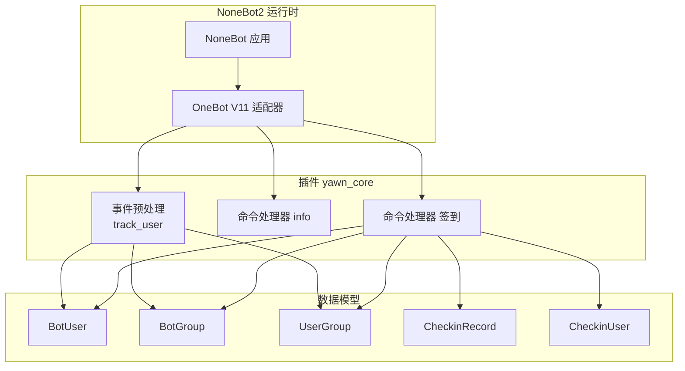
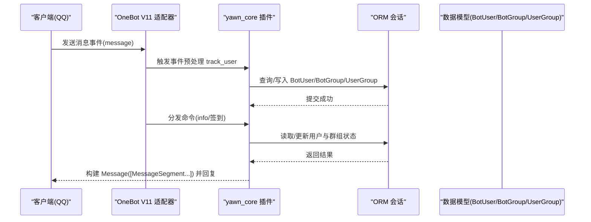
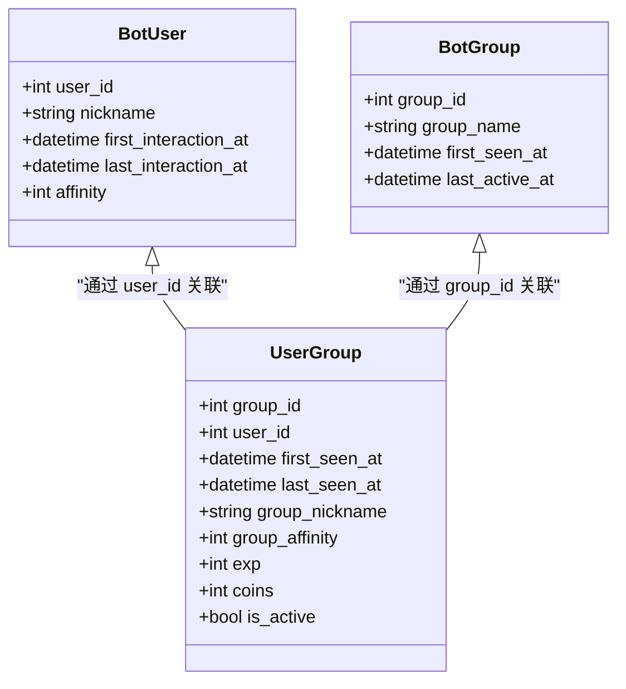
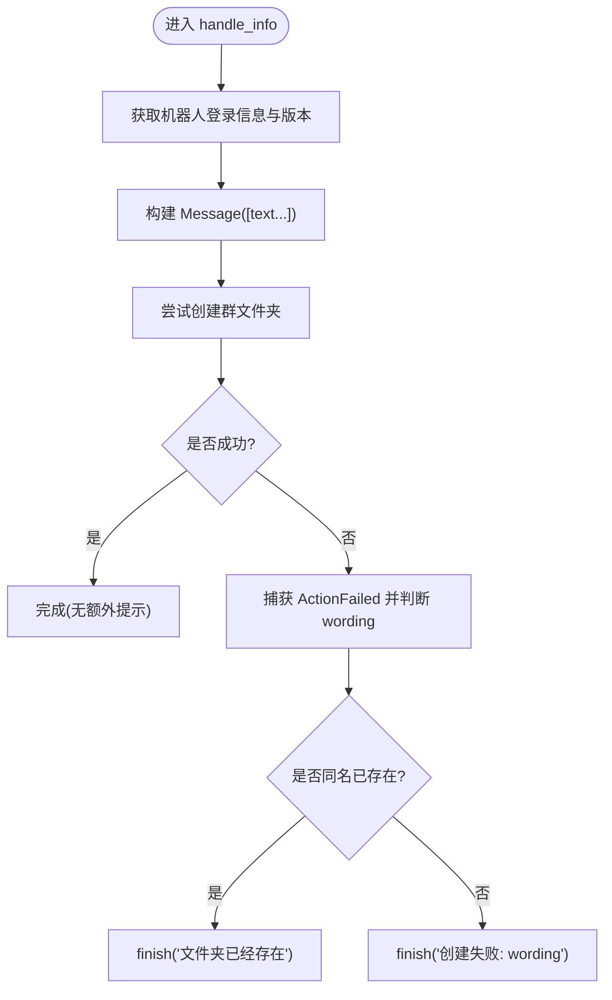
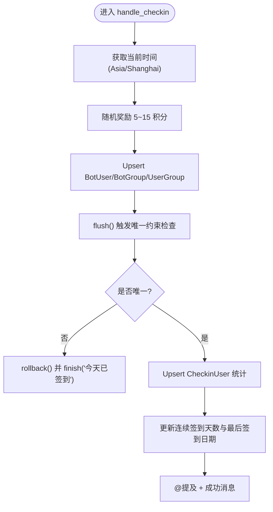
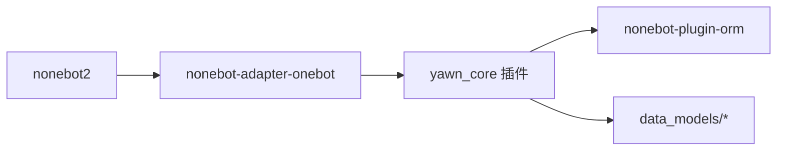

# 消息格式规范

<cite>
**本文引用的文件**   
- [README.md](file://README.md)
- [pyproject.toml](file://pyproject.toml)
- [__init__.py](file://src/plugins/yawn_core/__init__.py)
- [info.py](file://src/plugins/yawn_core/info.py)
- [checkin.py](file://src/plugins/yawn_core/checkin.py)
- [bot_user.py](file://src/plugins/yawn_core/data_models/bot_user.py)
- [bot_group.py](file://src/plugins/yawn_core/data_models/bot_group.py)
- [user_group.py](file://src/plugins/yawn_core/data_models/user_group.py)
- [checkin_record.py](file://src/plugins/yawn_core/data_models/checkin_record.py)
- [checkin_user.py](file://src/plugins/yawn_core/data_models/checkin_user.py)
</cite>

## 目录
1. [简介](#简介)
2. [项目结构](#项目结构)
3. [核心组件](#核心组件)
4. [架构总览](#架构总览)
5. [详细组件分析](#详细组件分析)
6. [依赖关系分析](#依赖关系分析)
7. [性能与兼容性考虑](#性能与兼容性考虑)
8. [故障排查指南](#故障排查指南)
9. [结论](#结论)
10. [附录：OneBot V11 消息段与编码规范](#附录onebot-v11-消息段与编码规范)

## 简介
本规范面向 YawnBot 的 OneBot V11 消息格式，聚焦于消息段（MessageSegment）的使用、群聊消息结构与用户/群组信息字段定义、编码与字符集支持、特殊字符处理，以及消息构建的最佳实践。文档基于仓库内实际代码实现进行归纳，并提供可追溯的文件来源与图示，帮助开发者快速理解并正确构建与解析消息。

## 项目结构
YawnBot 使用 NoneBot2 框架与 OneBot V11 适配器，插件位于 src/plugins/yawn_core。核心逻辑包括事件预处理、命令处理器（如“签到”“info”），以及与数据库模型交互的用户/群组状态维护。

图表来源
- [__init__.py:16-79](file://src/plugins/yawn_core/__init__.py#L16-L79)
- [info.py:10-39](file://src/plugins/yawn_core/info.py#L10-L39)
- [checkin.py:41-146](file://src/plugins/yawn_core/checkin.py#L41-L146)
- [bot_user.py:12-32](file://src/plugins/yawn_core/data_models/bot_user.py#L12-L32)
- [bot_group.py:12-29](file://src/plugins/yawn_core/data_models/bot_group.py#L12-L29)
- [user_group.py:15-61](file://src/plugins/yawn_core/data_models/user_group.py#L15-L61)
- [checkin_record.py:12-53](file://src/plugins/yawn_core/data_models/checkin_record.py#L12-L53)
- [checkin_user.py:12-47](file://src/plugins/yawn_core/data_models/checkin_user.py#L12-L47)

章节来源
- [README.md:1-13](file://README.md#L1-L13)
- [pyproject.toml:25-43](file://pyproject.toml#L25-L43)

## 核心组件
- 事件预处理 track_user：在收到 message 类型事件时，自动创建或更新 BotUser、BotGroup、UserGroup 记录，并同步昵称（优先群名片 card，其次 QQ 昵称 nickname）。
- 命令处理器 info：构造调试信息消息，调用 OneBot API 获取版本信息，并在群内创建文件夹（失败时给出友好提示）。
- 命令处理器 签到：根据中国时区计算日期，随机奖励积分，写入签到记录与汇总，返回包含 @提及 的成功消息。

章节来源
- [__init__.py:16-79](file://src/plugins/yawn_core/__init__.py#L16-L79)
- [info.py:10-39](file://src/plugins/yawn_core/info.py#L10-L39)
- [checkin.py:41-146](file://src/plugins/yawn_core/checkin.py#L41-L146)

## 架构总览
下图展示了从 OneBot 事件到消息构建与回复的关键流程，以及涉及的数据模型。

图表来源
- [__init__.py:16-79](file://src/plugins/yawn_core/__init__.py#L16-L79)
- [info.py:10-39](file://src/plugins/yawn_core/info.py#L10-L39)
- [checkin.py:41-146](file://src/plugins/yawn_core/checkin.py#L41-L146)

## 详细组件分析

### 事件预处理 track_user
- 功能要点
  - 仅处理 message 类型事件。
  - 从 event.sender 提取昵称：优先 card（群名片），其次 nickname（QQ 昵称）。
  - 首次对话或首次群内发言时创建对应记录，并更新时间戳。
- 关键数据结构
  - BotUser：全局用户标识 user_id、昵称、首次/最后交互时间、好感度等。
  - BotGroup：群标识 group_id、群名、首次出现/最后活跃时间。
  - UserGroup：用户与群的关联，含群内昵称、活跃度、经验/金币等扩展字段。

图表来源
- [bot_user.py:12-32](file://src/plugins/yawn_core/data_models/bot_user.py#L12-L32)
- [bot_group.py:12-29](file://src/plugins/yawn_core/data_models/bot_group.py#L12-L29)
- [user_group.py:15-61](file://src/plugins/yawn_core/data_models/user_group.py#L15-L61)

章节来源
- [__init__.py:16-79](file://src/plugins/yawn_core/__init__.py#L16-L79)
- [bot_user.py:12-32](file://src/plugins/yawn_core/data_models/bot_user.py#L12-L32)
- [bot_group.py:12-29](file://src/plugins/yawn_core/data_models/bot_group.py#L12-L29)
- [user_group.py:15-61](file://src/plugins/yawn_core/data_models/user_group.py#L15-L61)

### 命令处理器 info
- 功能要点
  - 获取机器人登录信息与版本信息。
  - 使用 Message 与 MessageSegment.text 构建多行文本消息。
  - 尝试创建群文件夹，捕获 ActionFailed 异常并给出明确提示。
- 消息构建模式
  - 使用 Message([...]) 聚合多个 MessageSegment.text。
  - 适合纯文本信息的结构化输出。

图表来源
- [info.py:10-39](file://src/plugins/yawn_core/info.py#L10-L39)

章节来源
- [info.py:10-39](file://src/plugins/yawn_core/info.py#L10-L39)

### 命令处理器 签到
- 功能要点
  - 按 Asia/Shanghai 时区计算日期，避免跨日边界问题。
  - 每次签到随机奖励 5~15 积分。
  - 写入 CheckinRecord（唯一约束保证每天一次），更新 CheckinUser 累计天数、连续天数与积分。
  - 使用 MessageSegment.at(user_id) 生成 @提及，拼接成功消息。
- 错误处理
  - 捕获 IntegrityError 表示重复签到，回滚事务并返回友好提示。

图表来源
- [checkin.py:41-146](file://src/plugins/yawn_core/checkin.py#L41-L146)
- [checkin_record.py:12-53](file://src/plugins/yawn_core/data_models/checkin_record.py#L12-L53)
- [checkin_user.py:12-47](file://src/plugins/yawn_core/data_models/checkin_user.py#L12-L47)

章节来源
- [checkin.py:41-146](file://src/plugins/yawn_core/checkin.py#L41-L146)
- [checkin_record.py:12-53](file://src/plugins/yawn_core/data_models/checkin_record.py#L12-L53)
- [checkin_user.py:12-47](file://src/plugins/yawn_core/data_models/checkin_user.py#L12-L47)

## 依赖关系分析
- 框架与适配器
  - NoneBot2 作为应用框架，OneBot V11 适配器提供事件与消息对象。
- 插件内部依赖
  - __init__.py 引入 data_models 中的实体类，用于事件预处理。
  - checkin.py 与 info.py 分别依赖 ORM 会话与 OneBot API。
- 外部依赖
  - nonebot-plugin-orm 提供异步 ORM 能力。
  - nonebot-adapter-onebot 提供 OneBot V11 的消息段与事件类型。

图表来源
- [pyproject.toml:25-43](file://pyproject.toml#L25-L43)
- [__init__.py:1-12](file://src/plugins/yawn_core/__init__.py#L1-L12)

章节来源
- [pyproject.toml:25-43](file://pyproject.toml#L25-L43)
- [__init__.py:1-12](file://src/plugins/yawn_core/__init__.py#L1-L12)

## 性能与兼容性考虑
- 性能
  - 事件预处理仅在 message 类型事件上执行，减少不必要开销。
  - 使用 async_scoped_session 确保会话生命周期与请求一致，避免连接泄漏。
  - 签到流程中先 flush 再捕获唯一约束异常，降低无效写入成本。
- 兼容性
  - 昵称获取兼容 card 与 nickname，适配不同平台/场景。
  - 群文件夹创建失败时区分“同名已存在”与其他错误，提升用户体验。
  - 时区固定为 Asia/Shanghai，避免跨时区导致的签到日期不一致。

[本节为通用指导，不直接分析具体文件]

## 故障排查指南
- 常见问题
  - 重复签到：IntegrityError 被捕获后回滚并提示“今天已签到”。
  - 群文件夹创建失败：ActionFailed 异常中 wording 包含原因，需据此分支处理。
- 定位建议
  - 查看日志输出（logger.info）确认用户/群组初始化与签到结果。
  - 检查 OneBot API 调用返回值与异常信息。

章节来源
- [checkin.py:109-114](file://src/plugins/yawn_core/checkin.py#L109-L114)
- [info.py:32-39](file://src/plugins/yawn_core/info.py#L32-L39)

## 结论
YawnBot 的消息构建严格遵循 OneBot V11 的 MessageSegment 接口，采用 Message([...]) 聚合多段内容，结合 ORM 持久化用户与群组状态。通过事件预处理与命令处理器，实现了稳定的消息收发与业务逻辑闭环。建议在后续扩展中继续遵循本规范，保持消息格式一致性与健壮性。

[本节为总结，不直接分析具体文件]

## 附录：OneBot V11 消息段与编码规范

### 消息段（MessageSegment）使用方法
- 文本
  - 使用 MessageSegment.text(...) 构建纯文本段落，适合多行信息拼接。
  - 示例路径参考：[info.py:22-28](file://src/plugins/yawn_core/info.py#L22-L28)
- @提及
  - 使用 MessageSegment.at(user_id) 生成对指定用户的 @提及。
  - 示例路径参考：[checkin.py:140-146](file://src/plugins/yawn_core/checkin.py#L140-L146)
- 图片
  - 本项目未直接使用图片消息段；如需扩展，建议使用 MessageSegment.image(url_or_path)。
  - 注意：图片 URL 需可访问且符合平台限制。
- 其他常见段
  - 链接、表情、AT 全体等可根据需要添加，保持与 OneBot V11 规范一致。

章节来源
- [info.py:22-28](file://src/plugins/yawn_core/info.py#L22-L28)
- [checkin.py:140-146](file://src/plugins/yawn_core/checkin.py#L140-L146)

### 群聊消息结构与用户/群组信息字段
- 事件来源
  - GroupMessageEvent：来自 OneBot V11 的群消息事件。
- 用户信息
  - sender.card：群名片（优先使用）。
  - sender.nickname：QQ 昵称（备选）。
  - 示例路径参考：[__init__.py:24-28](file://src/plugins/yawn_core/__init__.py#L24-L28)、[checkin.py:32-38](file://src/plugins/yawn_core/checkin.py#L32-L38)
- 群组信息
  - group_id：群号（整数）。
  - 示例路径参考：[__init__.py:48-50](file://src/plugins/yawn_core/__init__.py#L48-L50)

章节来源
- [__init__.py:24-50](file://src/plugins/yawn_core/__init__.py#L24-L50)
- [checkin.py:32-38](file://src/plugins/yawn_core/checkin.py#L32-L38)

### 编码格式、字符集支持与特殊字符处理
- 编码
  - Python 源码默认 UTF-8，字符串以 Unicode 处理，无需显式转码。
- 字符集支持
  - 中文标点与全角字符在 Ruff 配置中被允许，避免误报。
  - 示例路径参考：[pyproject.toml:107](file://pyproject.toml#L107)
- 特殊字符
  - 换行符 \n 可用于多行文本展示。
  - 避免在文本中混入不可见控制字符，必要时进行清洗。

章节来源
- [pyproject.toml:107](file://pyproject.toml#L107)

### 消息构建最佳实践
- 格式化输出
  - 将长文本拆分为多个 MessageSegment.text，便于阅读与维护。
  - 示例路径参考：[info.py:22-28](file://src/plugins/yawn_core/info.py#L22-L28)
- 错误处理
  - 对 OneBot API 调用进行 try/except，区分业务错误与系统错误。
  - 示例路径参考：[info.py:32-39](file://src/plugins/yawn_core/info.py#L32-L39)
- 兼容性
  - 昵称获取兼容 card/nickname，适应不同平台差异。
  - 示例路径参考：[__init__.py:24-28](file://src/plugins/yawn_core/__init__.py#L24-L28)

章节来源
- [info.py:22-39](file://src/plugins/yawn_core/info.py#L22-L39)
- [__init__.py:24-28](file://src/plugins/yawn_core/__init__.py#L24-L28)

### 实际消息示例与解析思路
- 示例一：调试信息（纯文本）
  - 由多个 MessageSegment.text 组成，包含版本、昵称、ID 等信息。
  - 示例路径参考：[info.py:22-28](file://src/plugins/yawn_core/info.py#L22-L28)
- 示例二：签到成功（@提及 + 文本）
  - 使用 MessageSegment.at(user_id) 拼接用户 @，随后附加文本说明。
  - 示例路径参考：[checkin.py:140-146](file://src/plugins/yawn_core/checkin.py#L140-L146)
- 解析思路
  - 接收到的消息为 Message 对象，可通过遍历 segments 获取各段类型与参数。
  - 对于 text 段，直接读取内容；对于 at 段，提取 user_id 进行业务处理。

[本节为概念性说明，不直接分析具体文件]