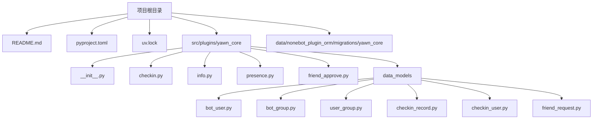
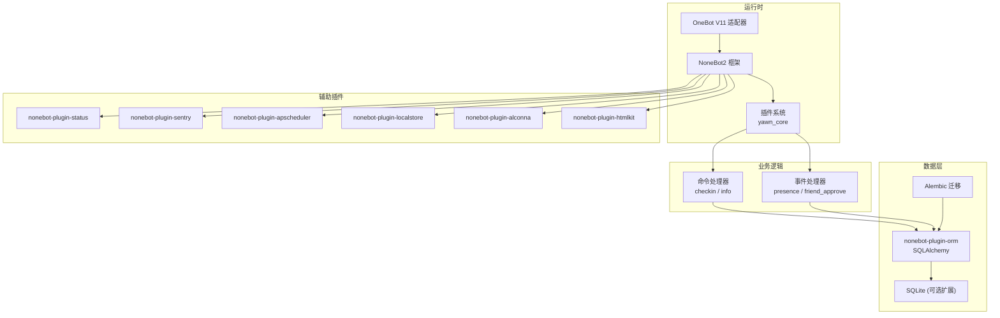
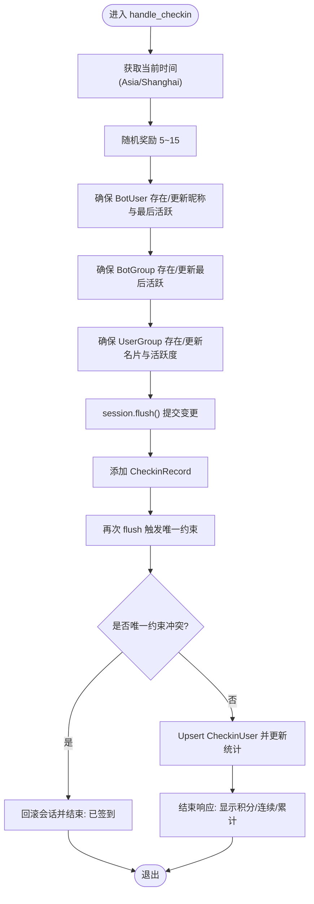
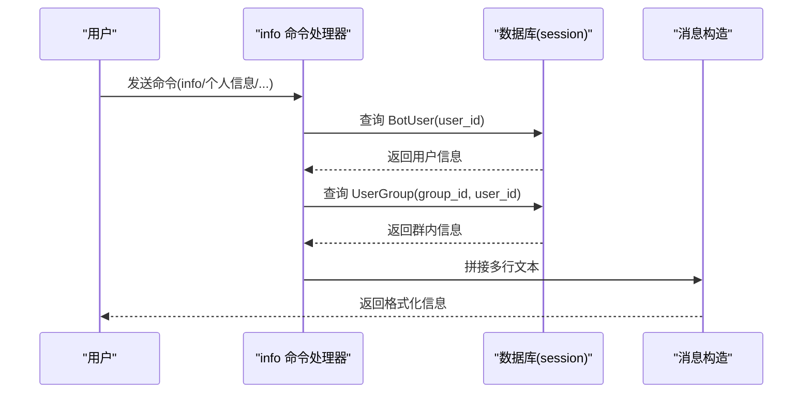
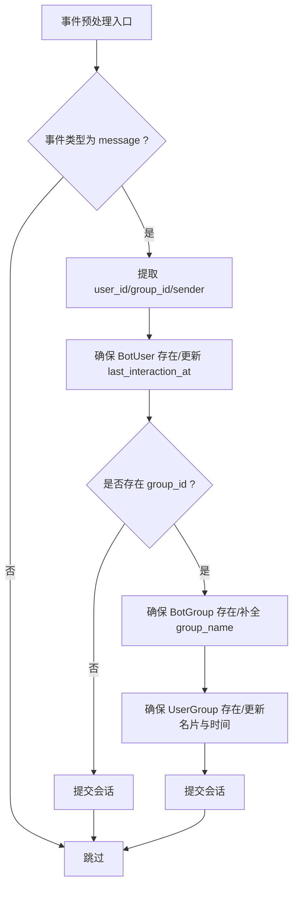
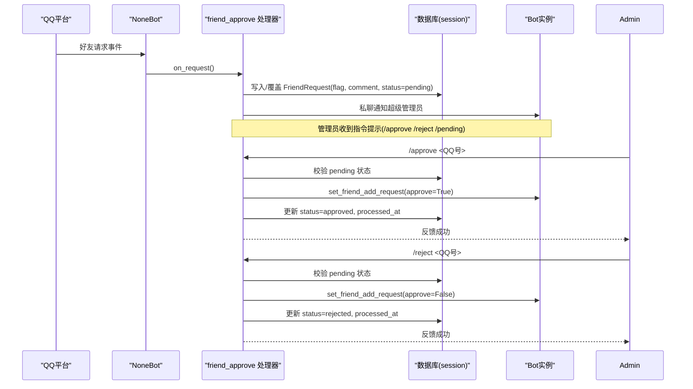
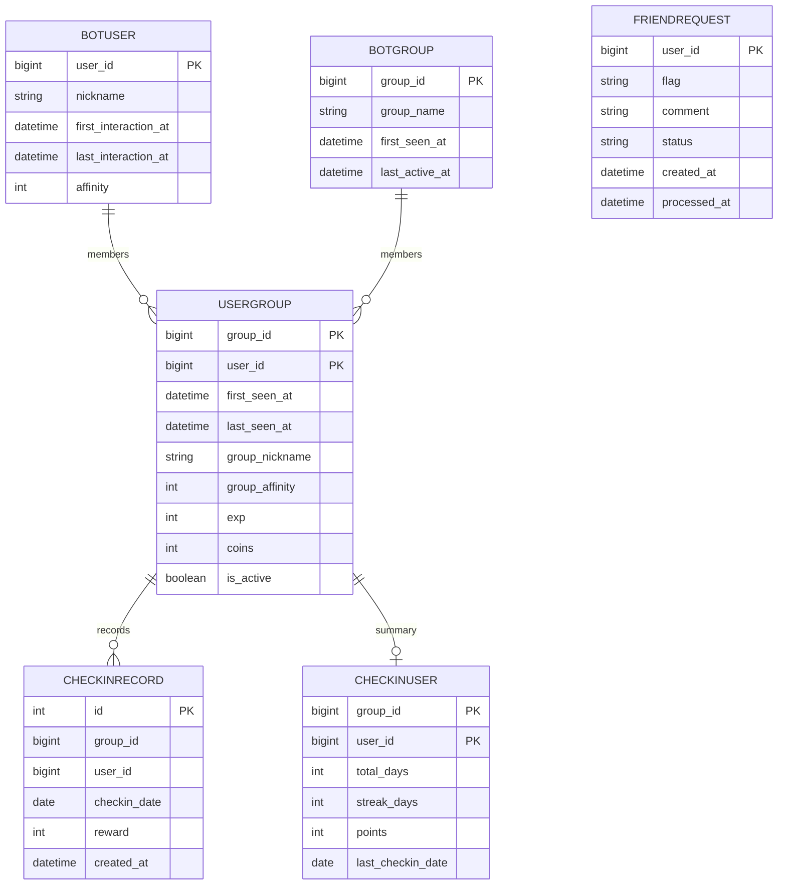
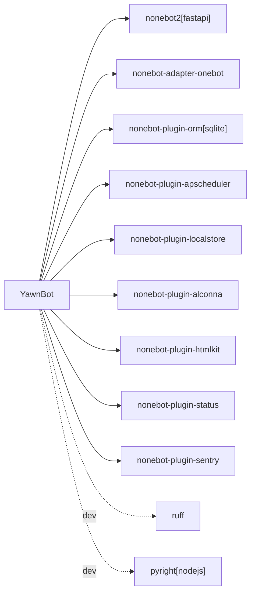

# 开发指南

<cite>
**本文引用的文件**   
- [README.md](file://README.md)
- [pyproject.toml](file://pyproject.toml)
- [uv.lock](file://uv.lock)
- [src/plugins/yawn_core/__init__.py](file://src/plugins/yawn_core/__init__.py)
- [src/plugins/yawn_core/checkin.py](file://src/plugins/yawn_core/checkin.py)
- [src/plugins/yawn_core/info.py](file://src/plugins/yawn_core/info.py)
- [src/plugins/yawn_core/presence.py](file://src/plugins/yawn_core/presence.py)
- [src/plugins/yawn_core/friend_approve.py](file://src/plugins/yawn_core/friend_approve.py)
- [src/plugins/yawn_core/data_models/__init__.py](file://src/plugins/yawn_core/data_models/__init__.py)
- [src/plugins/yawn_core/data_models/bot_user.py](file://src/plugins/yawn_core/data_models/bot_user.py)
- [src/plugins/yawn_core/data_models/bot_group.py](file://src/plugins/yawn_core/data_models/bot_group.py)
- [src/plugins/yawn_core/data_models/user_group.py](file://src/plugins/yawn_core/data_models/user_group.py)
- [src/plugins/yawn_core/data_models/checkin_record.py](file://src/plugins/yawn_core/data_models/checkin_record.py)
- [src/plugins/yawn_core/data_models/checkin_user.py](file://src/plugins/yawn_core/data_models/checkin_user.py)
- [src/plugins/yawn_core/data_models/friend_request.py](file://src/plugins/yawn_core/data_models/friend_request.py)
- [data/nonebot_plugin_orm/migrations/yawn_core/1e7945d46845_add_checkin_tables.py](file://data/nonebot_plugin_orm/migrations/yawn_core/1e7945d46845_add_checkin_tables.py)
</cite>

## 目录
1. [简介](#简介)
2. [项目结构](#项目结构)
3. [核心组件](#核心组件)
4. [架构总览](#架构总览)
5. [详细组件分析](#详细组件分析)
6. [依赖分析](#依赖分析)
7. [性能考虑](#性能考虑)
8. [故障排查指南](#故障排查指南)
9. [结论](#结论)
10. [附录](#附录)

## 简介
本指南面向YawnBot的新加入开发者，提供从环境搭建、插件开发规范、代码风格与最佳实践，到命令开发、事件处理器编写、第三方集成、测试调试与代码质量检查、Git协作流程的完整入门指导。项目基于NoneBot2框架，使用OneBot适配器接入QQ生态，采用ORM进行数据持久化，并集成了状态监控、定时任务、本地存储、HTML渲染等常用能力。

## 项目结构
- 根目录包含项目配置与说明：
  - README.md：快速启动说明与文档链接
  - pyproject.toml：Python版本、依赖、插件注册、Ruff与Pyright配置
  - uv.lock：锁定依赖版本（由包管理器生成）
- src/plugins/yawn_core：核心插件目录
  - __init__.py：插件入口，统一导入子模块
  - checkin.py：签到命令实现
  - info.py：个人信息查询命令
  - presence.py：消息预处理，记录用户/群活跃信息
  - friend_approve.py：好友申请审批流程
  - data_models：SQLAlchemy模型定义
  - migrations：数据库迁移脚本（Alembic）

**图表来源** 
- [README.md:1-13](file://README.md#L1-L13)
- [pyproject.toml:1-49](file://pyproject.toml#L1-L49)
- [src/plugins/yawn_core/__init__.py:1-5](file://src/plugins/yawn_core/__init__.py#L1-L5)

**章节来源**
- [README.md:1-13](file://README.md#L1-L13)
- [pyproject.toml:1-49](file://pyproject.toml#L1-L49)

## 核心组件
- 插件入口与组织
  - 插件入口通过__init__.py统一导入各功能模块，便于NoneBot自动发现与加载
- 命令处理器
  - checkin.py：实现“签到”命令，处理积分、连续签到、唯一约束冲突
  - info.py：实现“info/个人信息/我的信息/用户信息”命令，展示用户与群内属性
- 事件处理器
  - presence.py：事件预处理器，记录首次对话、最后活跃时间、群名补全
  - friend_approve.py：监听好友请求，维护待审批列表，支持同意/拒绝命令
- 数据模型
  - BotUser/BotGroup/UserGroup：用户、群、用户-群关系
  - CheckinRecord/CheckinUser：签到记录与汇总
  - FriendRequest：好友申请记录

**章节来源**
- [src/plugins/yawn_core/__init__.py:1-5](file://src/plugins/yawn_core/__init__.py#L1-L5)
- [src/plugins/yawn_core/checkin.py:1-147](file://src/plugins/yawn_core/checkin.py#L1-L147)
- [src/plugins/yawn_core/info.py:1-40](file://src/plugins/yawn_core/info.py#L1-L40)
- [src/plugins/yawn_core/presence.py:1-103](file://src/plugins/yawn_core/presence.py#L1-L103)
- [src/plugins/yawn_core/friend_approve.py:1-152](file://src/plugins/yawn_core/friend_approve.py#L1-L152)
- [src/plugins/yawn_core/data_models/__init__.py:1-22](file://src/plugins/yawn_core/data_models/__init__.py#L1-L22)

## 架构总览
YawnBot基于NoneBot2的事件驱动架构，插件通过on_command/on_request/event_preprocessor注册处理器；数据层通过nonebot-plugin-orm与SQLAlchemy交互；适配器为OneBot V11；辅助插件包括状态、Sentry、APScheduler、LocalStore、Alconna、HTMLKit等。

**图表来源** 
- [pyproject.toml:25-43](file://pyproject.toml#L25-L43)
- [src/plugins/yawn_core/checkin.py:1-147](file://src/plugins/yawn_core/checkin.py#L1-L147)
- [src/plugins/yawn_core/info.py:1-40](file://src/plugins/yawn_core/info.py#L1-L40)
- [src/plugins/yawn_core/presence.py:1-103](file://src/plugins/yawn_core/presence.py#L1-L103)
- [src/plugins/yawn_core/friend_approve.py:1-152](file://src/plugins/yawn_core/friend_approve.py#L1-L152)

## 详细组件分析

### 签到模块（checkin.py）
- 功能要点
  - 命令注册：on_command("签到")
  - 时区：中国时区计算日期
  - 随机奖励：每次签到获得5~15积分
  - 数据一致性：使用flush触发唯一约束，捕获IntegrityError回滚并提示已签到
  - 累计统计：更新CheckinUser的total_days、streak_days、points、last_checkin_date
- 关键流程
  - 获取或创建BotUser、BotGroup、UserGroup
  - 插入CheckinRecord并flush校验唯一性
  - 更新CheckinUser统计并返回结果

**图表来源** 
- [src/plugins/yawn_core/checkin.py:22-147](file://src/plugins/yawn_core/checkin.py#L22-L147)

**章节来源**
- [src/plugins/yawn_core/checkin.py:1-147](file://src/plugins/yawn_core/checkin.py#L1-L147)

### 个人信息查询（info.py）
- 功能要点
  - 命令别名：info/个人信息/我的信息/用户信息
  - 数据来源：BotUser与UserGroup
  - 输出格式：拼接多行文本，包含昵称、好感度、首次/最后交互时间、群名片、经验金币等

**图表来源** 
- [src/plugins/yawn_core/info.py:8-40](file://src/plugins/yawn_core/info.py#L8-L40)

**章节来源**
- [src/plugins/yawn_core/info.py:1-40](file://src/plugins/yawn_core/info.py#L1-L40)

### 消息预处理（presence.py）
- 功能要点
  - 事件预处理器：对所有message类型事件生效
  - 首次对话：创建BotUser并记录first_interaction_at
  - 群聊信息：确保BotGroup与UserGroup存在，必要时调用API补全group_name
  - 活跃追踪：更新last_interaction_at、last_seen_at、group_nickname

**图表来源** 
- [src/plugins/yawn_core/presence.py:16-103](file://src/plugins/yawn_core/presence.py#L16-L103)

**章节来源**
- [src/plugins/yawn_core/presence.py:1-103](file://src/plugins/yawn_core/presence.py#L1-L103)

### 好友申请审批（friend_approve.py）
- 功能要点
  - 监听好友请求：保存flag/comment/status，推送给超级管理员私聊
  - 管理命令：/pending列出待审批；/approve与/reject执行审批动作
  - 权限控制：仅允许superusers执行管理命令
  - 状态流转：pending → approved/rejected，记录processed_at

**图表来源** 
- [src/plugins/yawn_core/friend_approve.py:23-152](file://src/plugins/yawn_core/friend_approve.py#L23-L152)

**章节来源**
- [src/plugins/yawn_core/friend_approve.py:1-152](file://src/plugins/yawn_core/friend_approve.py#L1-L152)

### 数据模型与关系
- 实体关系概览
  - BotUser：全局用户，关联UserGroup集合
  - BotGroup：群，关联UserGroup集合
  - UserGroup：用户与群的关联，含群内扩展字段
  - CheckinRecord：签到明细，唯一约束(group_id,user_id,checkin_date)
  - CheckinUser：签到汇总(group_id,user_id)
  - FriendRequest：好友申请(user_id主键)

**图表来源** 
- [src/plugins/yawn_core/data_models/bot_user.py:12-32](file://src/plugins/yawn_core/data_models/bot_user.py#L12-L32)
- [src/plugins/yawn_core/data_models/bot_group.py:12-29](file://src/plugins/yawn_core/data_models/bot_group.py#L12-L29)
- [src/plugins/yawn_core/data_models/user_group.py:15-61](file://src/plugins/yawn_core/data_models/user_group.py#L15-L61)
- [src/plugins/yawn_core/data_models/checkin_record.py:12-53](file://src/plugins/yawn_core/data_models/checkin_record.py#L12-L53)
- [src/plugins/yawn_core/data_models/checkin_user.py:12-47](file://src/plugins/yawn_core/data_models/checkin_user.py#L12-L47)
- [src/plugins/yawn_core/data_models/friend_request.py:9-36](file://src/plugins/yawn_core/data_models/friend_request.py#L9-L36)

**章节来源**
- [src/plugins/yawn_core/data_models/__init__.py:1-22](file://src/plugins/yawn_core/data_models/__init__.py#L1-L22)
- [src/plugins/yawn_core/data_models/bot_user.py:1-32](file://src/plugins/yawn_core/data_models/bot_user.py#L1-L32)
- [src/plugins/yawn_core/data_models/bot_group.py:1-29](file://src/plugins/yawn_core/data_models/bot_group.py#L1-L29)
- [src/plugins/yawn_core/data_models/user_group.py:1-61](file://src/plugins/yawn_core/data_models/user_group.py#L1-L61)
- [src/plugins/yawn_core/data_models/checkin_record.py:1-53](file://src/plugins/yawn_core/data_models/checkin_record.py#L1-L53)
- [src/plugins/yawn_core/data_models/checkin_user.py:1-47](file://src/plugins/yawn_core/data_models/checkin_user.py#L1-L47)
- [src/plugins/yawn_core/data_models/friend_request.py:1-36](file://src/plugins/yawn_core/data_models/friend_request.py#L1-L36)

## 依赖分析
- Python版本要求：>=3.10,<4.0
- 核心依赖
  - nonebot2[fastapi]：框架与Web服务
  - nonebot-adapter-onebot：OneBot V11适配器
  - nonebot-plugin-orm[sqlite]：ORM与迁移
  - nonebot-plugin-apscheduler：定时任务
  - nonebot-plugin-localstore：本地存储
  - nonebot-plugin-alconna：命令解析增强
  - nonebot-plugin-htmlkit：HTML渲染
  - nonebot-plugin-status：状态监控
  - nonebot-plugin-sentry：错误上报
- 开发工具
  - ruff：代码风格检查与格式化
  - pyright：类型检查

**图表来源** 
- [pyproject.toml:1-23](file://pyproject.toml#L1-L23)
- [pyproject.toml:25-43](file://pyproject.toml#L25-L43)
- [pyproject.toml:44-107](file://pyproject.toml#L44-L107)
- [uv.lock:731-921](file://uv.lock#L731-L921)

**章节来源**
- [pyproject.toml:1-123](file://pyproject.toml#L1-L123)
- [uv.lock:731-921](file://uv.lock#L731-L921)

## 性能考虑
- 数据库操作
  - 使用session.flush提前触发唯一约束，避免重复插入带来的异常开销
  - 合理设计联合主键与外键约束，减少应用层校验成本
- 事件处理
  - presence作为预处理器，尽量轻量，避免阻塞消息链路
  - 对API调用（如get_group_info）增加异常捕获与降级策略
- 插件加载
  - 将模块导入集中在插件入口，减少重复import开销
- 日志与监控
  - 合理使用logger记录关键路径，结合sentry定位问题

[本节为通用建议，不直接分析具体文件]

## 故障排查指南
- 常见问题
  - 重复签到：捕获IntegrityError并回滚，提示“今天已经签到过了”
  - 群名缺失：在首次出现或旧记录中调用API补全，失败则忽略并继续
  - 权限不足：管理命令需superusers，非授权用户直接返回
- 调试技巧
  - 使用nb run --reload热重载快速迭代
  - 开启ruff与pyright进行静态检查与类型检查
  - 查看日志输出定位异常堆栈
- 数据库迁移
  - 使用Alembic迁移脚本管理表结构变更
  - 新增模型后生成迁移并应用到数据库

**章节来源**
- [src/plugins/yawn_core/checkin.py:109-114](file://src/plugins/yawn_core/checkin.py#L109-L114)
- [src/plugins/yawn_core/presence.py:54-84](file://src/plugins/yawn_core/presence.py#L54-L84)
- [src/plugins/yawn_core/friend_approve.py:71-73](file://src/plugins/yawn_core/friend_approve.py#L71-L73)
- [data/nonebot_plugin_orm/migrations/yawn_core/1e7945d46845_add_checkin_tables.py:22-46](file://data/nonebot_plugin_orm/migrations/yawn_core/1e7945d46845_add_checkin_tables.py#L22-L46)

## 结论
YawnBot以NoneBot2为核心，结合ORM与丰富的插件生态，提供了签到、信息查询、消息追踪、好友审批等实用功能。遵循本文的开发规范与最佳实践，可高效扩展新插件、保证代码质量与稳定性，并为团队协作提供清晰的流程指引。

[本节为总结，不直接分析具体文件]

## 附录

### 开发环境搭建步骤
- 环境准备
  - 安装Python（>=3.10,<4.0）
  - 安装包管理器（推荐uv）
- 初始化项目
  - 使用nb create生成项目骨架
  - 使用nb plugin create创建插件
- 依赖安装
  - 根据pyproject.toml中的dependencies安装依赖
  - 开发依赖（ruff、pyright）按需安装
- 运行与热重载
  - 使用nb run --reload启动，便于开发调试

**章节来源**
- [README.md:3-8](file://README.md#L3-L8)
- [pyproject.toml:1-23](file://pyproject.toml#L1-L23)

### NoneBot2插件开发规范与代码风格
- 插件入口
  - 在插件__init__.py中统一导入子模块，确保NoneBot自动发现
- 命令与事件
  - 使用on_command注册命令，on_request监听请求事件，event_preprocessor处理消息预处理
- 数据访问
  - 使用async_scoped_session进行异步数据库操作
- 代码风格
  - 使用ruff进行格式化与规则检查（line-length=88，target-version=py39）
  - 使用pyright进行类型检查（typeCheckingMode=standard）

**章节来源**
- [src/plugins/yawn_core/__init__.py:1-5](file://src/plugins/yawn_core/__init__.py#L1-L5)
- [pyproject.toml:44-107](file://pyproject.toml#L44-L107)
- [pyproject.toml:112-117](file://pyproject.toml#L112-L117)

### 自定义命令开发教程
- 步骤
  - 新建命令处理器文件（参考info.py）
  - 使用on_command注册命令与别名
  - 在handle函数中注入session参数进行数据访问
  - 使用finish返回消息
- 示例路径
  - [src/plugins/yawn_core/info.py:8-10](file://src/plugins/yawn_core/info.py#L8-L10)

**章节来源**
- [src/plugins/yawn_core/info.py:8-40](file://src/plugins/yawn_core/info.py#L8-L40)

### 事件处理器编写方法
- 消息预处理
  - 使用@event_preprocessor装饰器，优先执行轻量逻辑
- 请求处理
  - 使用on_request监听好友请求，维护状态并通知管理员
- 示例路径
  - [src/plugins/yawn_core/presence.py:16-20](file://src/plugins/yawn_core/presence.py#L16-L20)
  - [src/plugins/yawn_core/friend_approve.py:23-24](file://src/plugins/yawn_core/friend_approve.py#L23-L24)

**章节来源**
- [src/plugins/yawn_core/presence.py:16-103](file://src/plugins/yawn_core/presence.py#L16-L103)
- [src/plugins/yawn_core/friend_approve.py:23-64](file://src/plugins/yawn_core/friend_approve.py#L23-L64)

### 第三方集成指南
- OneBot适配器
  - 在pyproject.toml中注册适配器模块
- ORM与迁移
  - 使用nonebot-plugin-orm与Alembic管理数据库
- 其他插件
  - 状态、Sentry、APScheduler、LocalStore、Alconna、HTMLKit按需在pyproject.toml中启用

**章节来源**
- [pyproject.toml:29-43](file://pyproject.toml#L29-L43)
- [data/nonebot_plugin_orm/migrations/yawn_core/1e7945d46845_add_checkin_tables.py:22-46](file://data/nonebot_plugin_orm/migrations/yawn_core/1e7945d46845_add_checkin_tables.py#L22-L46)

### 测试策略与调试技巧
- 单元测试
  - 针对命令处理器与数据模型编写用例，模拟session与事件对象
- 集成测试
  - 使用nb run --reload配合本地OneBot模拟器验证端到端流程
- 调试
  - 使用logger输出关键路径与异常信息
  - 借助pyright与ruff提前发现问题

[本节为通用建议，不直接分析具体文件]

### 代码质量检查
- Ruff
  - 规则集涵盖F/W/E/I/C90/N/PL/UP/YTT/ANN/ASYNC/BLE/FBT/B/A/COM/C4/DTZ/T10/ICN/PIE/T20/PYI/Q/RSE/RET/SIM/SLOT/TID/TC/ARG/PTH/FAST/PERF/PGH/FURB/TRY/RUF
  - 忽略部分规则以适应NoneBot2特性
- Pyright
  - 标准类型检查模式，目标Python版本3.9

**章节来源**
- [pyproject.toml:44-107](file://pyproject.toml#L44-L107)
- [pyproject.toml:112-117](file://pyproject.toml#L112-L117)

### Git工作流程与协作规范
- 分支策略
  - 主分支保护，功能分支开发，合并前进行代码审查
- 提交规范
  - 清晰描述变更内容，关联Issue或需求编号
- 版本控制
  - 使用语义化版本号，发布前完成迁移与依赖锁定

[本节为通用建议，不直接分析具体文件]