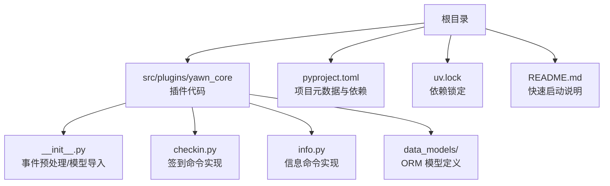
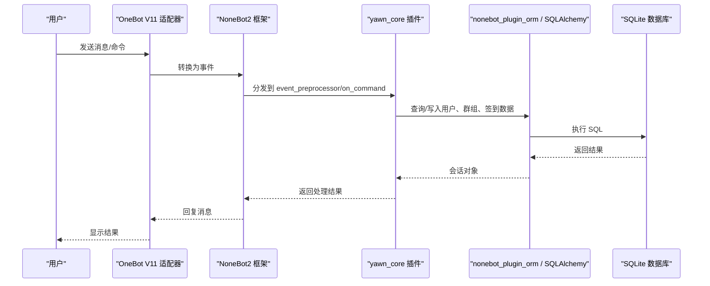
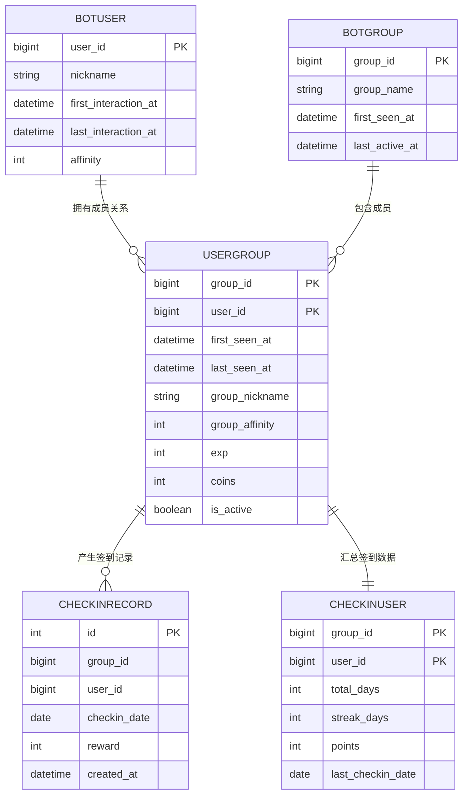
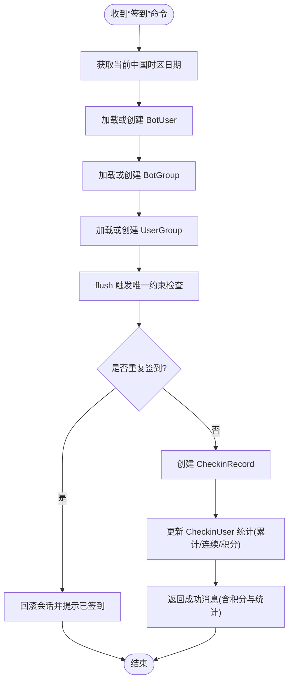
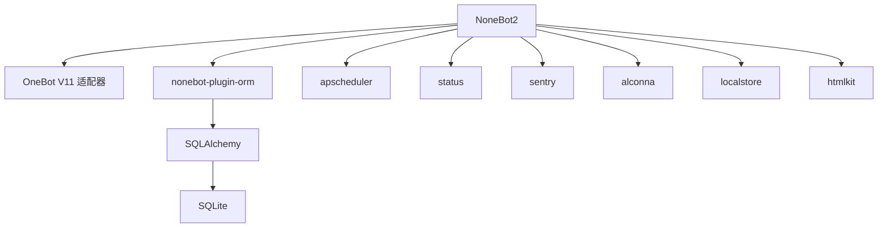

# 快速开始

<cite>
**本文引用的文件**   
- [README.md](file://README.md)
- [pyproject.toml](file://pyproject.toml)
- [uv.lock](file://uv.lock)
- [src/plugins/yawn_core/__init__.py](file://src/plugins/yawn_core/__init__.py)
- [src/plugins/yawn_core/checkin.py](file://src/plugins/yawn_core/checkin.py)
- [src/plugins/yawn_core/info.py](file://src/plugins/yawn_core/info.py)
- [src/plugins/yawn_core/data_models/bot_user.py](file://src/plugins/yawn_core/data_models/bot_user.py)
- [src/plugins/yawn_core/data_models/bot_group.py](file://src/plugins/yawn_core/data_models/bot_group.py)
- [src/plugins/yawn_core/data_models/user_group.py](file://src/plugins/yawn_core/data_models/user_group.py)
- [src/plugins/yawn_core/data_models/checkin_record.py](file://src/plugins/yawn_core/data_models/checkin_record.py)
- [src/plugins/yawn_core/data_models/checkin_user.py](file://src/plugins/yawn_core/data_models/checkin_user.py)
</cite>

## 目录
1. [简介](#简介)
2. [项目结构](#项目结构)
3. [核心组件](#核心组件)
4. [架构总览](#架构总览)
5. [详细组件分析](#详细组件分析)
6. [依赖分析](#依赖分析)
7. [性能考虑](#性能考虑)
8. [故障排除指南](#故障排除指南)
9. [结论](#结论)
10. [附录](#附录)

## 简介
本指南面向首次接触 YawnBot 的新手，目标是帮助你快速搭建开发环境、完成项目初始化与配置、创建并运行第一个插件。YawnBot 基于 NoneBot2 构建，使用 OneBot V11 适配器接入 QQ 机器人生态，内置 ORM、定时任务、状态监控等常用插件，开箱即用。

## 项目结构
仓库采用“插件化”组织方式：业务逻辑以插件形式位于 src/plugins 下，当前包含 yawn_core 插件（签到、用户信息追踪、基础命令等）。依赖管理通过 pyproject.toml 声明，锁定版本由 uv.lock 维护。

图表来源 
- [README.md:1-13](file://README.md#L1-L13)
- [pyproject.toml:1-44](file://pyproject.toml#L1-L44)
- [uv.lock:1-10](file://uv.lock#L1-L10)

章节来源
- [README.md:1-13](file://README.md#L1-L13)
- [pyproject.toml:1-44](file://pyproject.toml#L1-L44)

## 核心组件
- 事件预处理与用户追踪：在插件入口对消息事件进行预处理，自动记录用户与群的首次交互、昵称更新与活跃时间。
- 签到命令：提供“签到”指令，支持每日唯一签到、随机积分奖励、连续签到统计与累计天数计算。
- 信息命令：返回机器人基本信息与调试输出，便于本地验证与排错。
- ORM 数据模型：定义了 BotUser、BotGroup、UserGroup、CheckinRecord、CheckinUser 等实体，支撑用户、群组与签到数据的持久化。

章节来源
- [src/plugins/yawn_core/__init__.py:16-74](file://src/plugins/yawn_core/__init__.py#L16-L74)
- [src/plugins/yawn_core/checkin.py:22-147](file://src/plugins/yawn_core/checkin.py#L22-L147)
- [src/plugins/yawn_core/info.py:1-39](file://src/plugins/yawn_core/info.py#L1-L39)
- [src/plugins/yawn_core/data_models/bot_user.py:12-32](file://src/plugins/yawn_core/data_models/bot_user.py#L12-L32)
- [src/plugins/yawn_core/data_models/bot_group.py:12-29](file://src/plugins/yawn_core/data_models/bot_group.py#L12-L29)
- [src/plugins/yawn_core/data_models/user_group.py:15-61](file://src/plugins/yawn_core/data_models/user_group.py#L15-L61)
- [src/plugins/yawn_core/data_models/checkin_record.py:12-53](file://src/plugins/yawn_core/data_models/checkin_record.py#L12-L53)
- [src/plugins/yawn_core/data_models/checkin_user.py:12-47](file://src/plugins/yawn_core/data_models/checkin_user.py#L12-L47)

## 架构总览
YawnBot 的运行时流程如下：NoneBot2 加载插件与适配器，OneBot V11 适配器接收消息后触发事件；插件中的 on_command 处理器响应命令，event_preprocessor 在消息到达时进行预处理；ORM 层通过 nonebot_plugin_orm 与 SQLAlchemy 协作，读写 SQLite 数据库。

图表来源 
- [src/plugins/yawn_core/__init__.py:16-74](file://src/plugins/yawn_core/__init__.py#L16-L74)
- [src/plugins/yawn_core/checkin.py:22-147](file://src/plugins/yawn_core/checkin.py#L22-L147)
- [pyproject.toml:25-43](file://pyproject.toml#L25-L43)

## 详细组件分析

### 环境要求与安装
- Python 版本：>=3.10, <4.0
- 包管理器：推荐使用 uv（根据 uv.lock 锁定依赖）
- 依赖项：nonebot2[fastapi]、nonebot-adapter-onebot、nonebot-plugin-orm[sqlite] 等

安装步骤
- 确保已安装 Python 3.10+ 与 uv
- 在项目根目录执行依赖安装（例如：uv sync）
- 确认 pyproject.toml 中 plugin_dirs 指向 src/plugins

章节来源
- [pyproject.toml:1-17](file://pyproject.toml#L1-L17)
- [uv.lock:1-3](file://uv.lock#L1-L3)
- [pyproject.toml:25-27](file://pyproject.toml#L25-L27)

### 项目初始化与配置
- 使用 nb create 生成项目骨架
- 使用 nb plugin create 创建新插件
- 将插件放入 src/plugins 目录
- 运行机器人：nb run --reload

配置文件要点
- tool.nonebot.plugin_dirs 指定插件目录
- tool.nonebot.adapters 注册 OneBot V11 适配器
- tool.nonebot.plugins 启用 ORM、APScheduler、Status、Sentry、Alconna、LocalStore、HTMLKit 等插件

章节来源
- [README.md:3-8](file://README.md#L3-L8)
- [pyproject.toml:25-43](file://pyproject.toml#L25-L43)

### 运行机器人
- 开发模式：nb run --reload（热重载，修改代码即时生效）
- 生产模式：按部署规范运行（建议使用进程管理器与反向代理）

章节来源
- [README.md:8](file://README.md#L8)

### 创建与管理插件
- 新建插件：nb plugin create <插件名>
- 插件位置：src/plugins/<插件名>/
- 插件入口：通常包含 __init__.py，用于注册命令、事件处理器与依赖注入
- 示例插件：yawn_core 展示了事件预处理与命令处理的组合用法

章节来源
- [README.md:5-7](file://README.md#L5-L7)
- [src/plugins/yawn_core/__init__.py:1-13](file://src/plugins/yawn_core/__init__.py#L1-L13)

### 基本运行说明（从空项目到第一个插件）
- 使用 nb create 初始化项目
- 使用 nb plugin create 创建你的第一个插件
- 在插件中编写 on_command 处理器（参考 yawn_core 的 checkin.py）
- 运行 nb run --reload，在 QQ 群内发送“签到”测试命令

章节来源
- [README.md:3-8](file://README.md#L3-L8)
- [src/plugins/yawn_core/checkin.py:22-26](file://src/plugins/yawn_core/checkin.py#L22-L26)

### 数据模型与关系

图表来源 
- [src/plugins/yawn_core/data_models/bot_user.py:12-32](file://src/plugins/yawn_core/data_models/bot_user.py#L12-L32)
- [src/plugins/yawn_core/data_models/bot_group.py:12-29](file://src/plugins/yawn_core/data_models/bot_group.py#L12-L29)
- [src/plugins/yawn_core/data_models/user_group.py:15-61](file://src/plugins/yawn_core/data_models/user_group.py#L15-L61)
- [src/plugins/yawn_core/data_models/checkin_record.py:12-53](file://src/plugins/yawn_core/data_models/checkin_record.py#L12-L53)
- [src/plugins/yawn_core/data_models/checkin_user.py:12-47](file://src/plugins/yawn_core/data_models/checkin_user.py#L12-L47)

### 签到命令处理流程

图表来源 
- [src/plugins/yawn_core/checkin.py:41-147](file://src/plugins/yawn_core/checkin.py#L41-L147)

### 事件预处理与用户追踪
- 所有 message 类型事件进入预处理函数
- 自动创建或更新 BotUser、BotGroup、UserGroup
- 记录首次交互时间、最后活跃时间与昵称变化
- 提交会话保证数据落库

章节来源
- [src/plugins/yawn_core/__init__.py:16-74](file://src/plugins/yawn_core/__init__.py#L16-L74)

### 信息命令
- 获取机器人登录信息与版本信息
- 尝试创建群文件夹“调试信息”，失败时给出友好提示
- 适合本地调试与连通性验证

章节来源
- [src/plugins/yawn_core/info.py:1-39](file://src/plugins/yawn_core/info.py#L1-L39)

## 依赖分析
- NoneBot2 作为核心框架，FastAPI 后端
- OneBot V11 适配器负责与 QQ 平台通信
- ORM 插件基于 SQLAlchemy，默认使用 SQLite
- APScheduler 提供定时任务能力
- Status/Sentry/Alconna/LocalStore/HTMLKit 增强可观测性与功能扩展

图表来源 
- [pyproject.toml:7-17](file://pyproject.toml#L7-L17)
- [pyproject.toml:25-43](file://pyproject.toml#L25-L43)

章节来源
- [pyproject.toml:7-17](file://pyproject.toml#L7-L17)
- [pyproject.toml:25-43](file://pyproject.toml#L25-L43)

## 性能考虑
- 使用 async_scoped_session 进行异步数据库访问，避免阻塞事件循环
- 合理设置 flush/commit 时机，减少不必要的 I/O 开销
- 签到唯一约束在数据库层保障一致性，避免应用层重复判断带来的竞争条件
- 日志仅记录关键路径，避免高频打印影响性能

章节来源
- [src/plugins/yawn_core/__init__.py:16-74](file://src/plugins/yawn_core/__init__.py#L16-L74)
- [src/plugins/yawn_core/checkin.py:99-114](file://src/plugins/yawn_core/checkin.py#L99-L114)
- [src/plugins/yawn_core/data_models/checkin_record.py:15-29](file://src/plugins/yawn_core/data_models/checkin_record.py#L15-L29)

## 故障排除指南
常见问题与解决思路
- 无法连接 OneBot 服务
  - 检查适配器配置与端口、鉴权参数是否正确
  - 查看日志输出，确认适配器是否成功加载
- 命令无响应
  - 确认插件已被加载（plugin_dirs 配置正确）
  - 检查 on_command 的命令名与别名是否匹配
- 签到重复或异常
  - 检查数据库唯一约束是否生效
  - 观察 IntegrityError 分支是否被捕获并回滚
- 群文件夹创建失败
  - 若同名文件夹已存在，会返回友好提示；否则检查权限与 API 返回信息

章节来源
- [src/plugins/yawn_core/checkin.py:109-114](file://src/plugins/yawn_core/checkin.py#L109-L114)
- [src/plugins/yawn_core/info.py:32-39](file://src/plugins/yawn_core/info.py#L32-L39)

## 结论
通过本指南，你应能完成 YawnBot 的环境准备、项目初始化、插件开发与运行。建议先从 yawn_core 的签到与信息命令入手，理解事件预处理与 ORM 的使用方式，再逐步扩展自己的插件功能。

## 附录
- 官方文档：参见 README 中的链接
- 推荐实践
  - 每个插件独立命名空间，避免冲突
  - 使用统一的日志格式与级别
  - 对敏感配置使用环境变量管理
  - 定期备份 SQLite 数据库文件

章节来源
- [README.md:10-13](file://README.md#L10-L13)