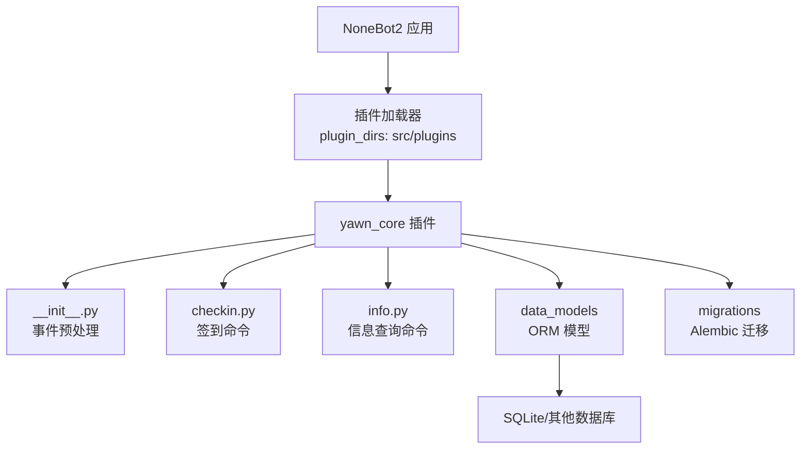
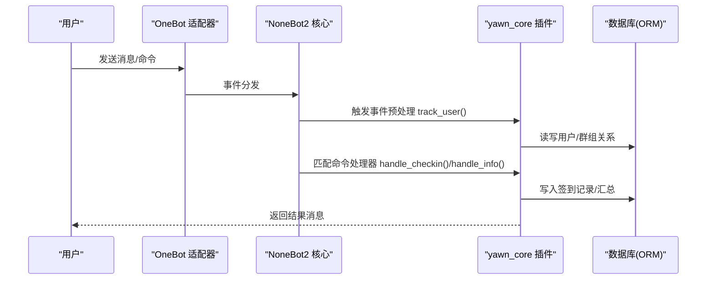
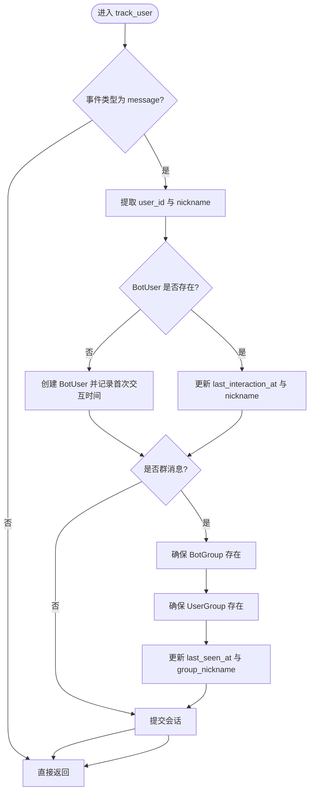
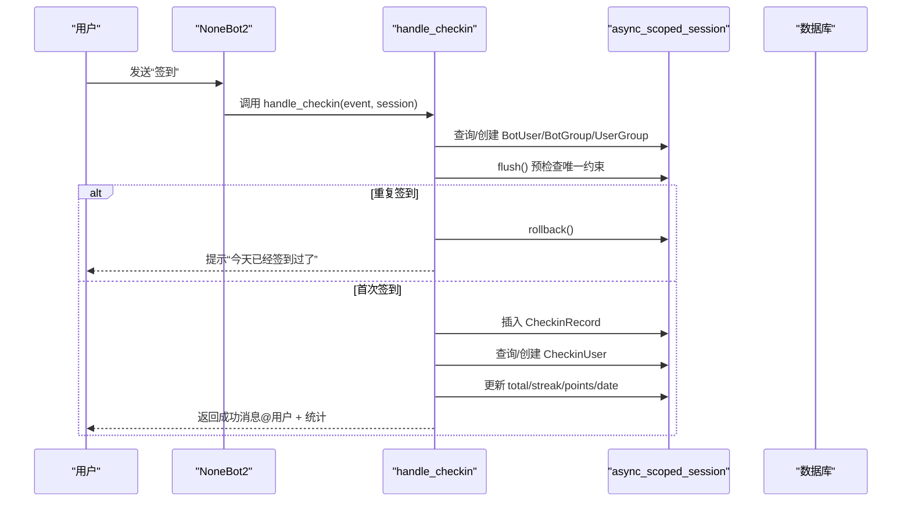
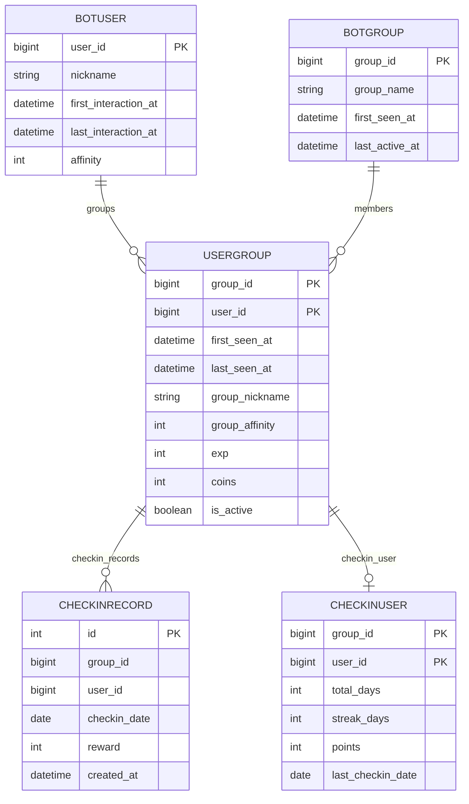
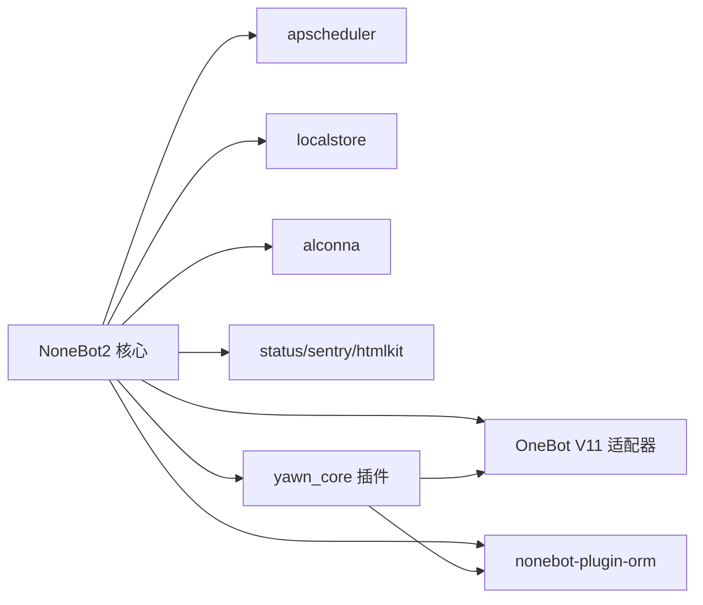

# 插件开发指南

<cite>
**本文引用的文件**   
- [README.md](file://README.md)
- [pyproject.toml](file://pyproject.toml)
- [src/plugins/yawn_core/__init__.py](file://src/plugins/yawn_core/__init__.py)
- [src/plugins/yawn_core/checkin.py](file://src/plugins/yawn_core/checkin.py)
- [src/plugins/yawn_core/info.py](file://src/plugins/yawn_core/info.py)
- [src/plugins/yawn_core/data_models/__init__.py](file://src/plugins/yawn_core/data_models/__init__.py)
- [src/plugins/yawn_core/data_models/bot_user.py](file://src/plugins/yawn_core/data_models/bot_user.py)
- [src/plugins/yawn_core/data_models/bot_group.py](file://src/plugins/yawn_core/data_models/bot_group.py)
- [src/plugins/yawn_core/data_models/user_group.py](file://src/plugins/yawn_core/data_models/user_group.py)
- [src/plugins/yawn_core/data_models/checkin_record.py](file://src/plugins/yawn_core/data_models/checkin_record.py)
- [src/plugins/yawn_core/data_models/checkin_user.py](file://src/plugins/yawn_core/data_models/checkin_user.py)
- [data/nonebot_plugin_orm/migrations/yawn_core/b15555e176e4_add_checkin_tables.py](file://data/nonebot_plugin_orm/migrations/yawn_core/b15555e176e4_add_checkin_tables.py)
</cite>

## 目录
1. [简介](#简介)
2. [项目结构](#项目结构)
3. [核心组件](#核心组件)
4. [架构总览](#架构总览)
5. [详细组件分析](#详细组件分析)
6. [依赖分析](#依赖分析)
7. [性能考虑](#性能考虑)
8. [故障排查指南](#故障排查指南)
9. [结论](#结论)
10. [附录：从零到一开发一个插件](#附录从零到一开发一个插件)

## 简介
本指南面向使用 NoneBot2 的 YawnBot 插件开发者，系统讲解插件架构、目录结构与命名约定、环境搭建与依赖管理、配置选项、最佳实践与代码规范、调试技巧，以及从简单消息处理器到复杂业务逻辑的完整示例。文档以仓库中的 yawn_core 插件为蓝本，涵盖事件预处理、命令注册、异步数据库操作、唯一约束处理、对外 API 调用等关键能力。

## 项目结构
YawnBot 采用标准 NoneBot2 插件布局，插件位于 src/plugins 下，每个插件为一个独立子包。yawn_core 插件包含：
- 插件入口 __init__.py：定义事件预处理，自动维护用户与群组信息。
- checkin.py：实现“签到”命令，含积分、连续签到统计与去重。
- info.py：实现“info”命令，展示机器人信息与调试数据。
- data_models：基于 nonebot-plugin-orm 的 SQLAlchemy 模型定义。
- migrations：Alembic 迁移脚本，用于数据库表结构的演进。

图表来源
- [pyproject.toml:25-43](file://pyproject.toml#L25-L43)
- [src/plugins/yawn_core/__init__.py:1-80](file://src/plugins/yawn_core/__init__.py#L1-L80)

章节来源
- [README.md:1-13](file://README.md#L1-L13)
- [pyproject.toml:1-43](file://pyproject.toml#L1-L43)

## 核心组件
- 事件预处理（track_user）：拦截 message 类型事件，自动创建或更新 BotUser、BotGroup、UserGroup 记录，保证后续业务可稳定查询。
- 签到命令（checkin）：基于 OneBot V11 群消息触发，计算随机奖励、更新累计/连续签到天数与积分，并通过唯一约束防止重复签到。
- 信息查询命令（info）：获取机器人登录信息与版本信息，并尝试创建群文件夹用于调试输出。

章节来源
- [src/plugins/yawn_core/__init__.py:16-80](file://src/plugins/yawn_core/__init__.py#L16-L80)
- [src/plugins/yawn_core/checkin.py:22-147](file://src/plugins/yawn_core/checkin.py#L22-L147)
- [src/plugins/yawn_core/info.py:1-39](file://src/plugins/yawn_core/info.py#L1-L39)

## 架构总览
YawnBot 插件运行在 NoneBot2 之上，通过适配器 OneBot V11 接收消息，使用 nonebot-plugin-orm 进行异步 ORM 访问，结合 Alembic 完成数据库迁移。插件内部通过 on_command 注册命令处理器，event_preprocessor 注入全局行为。

图表来源
- [src/plugins/yawn_core/__init__.py:16-80](file://src/plugins/yawn_core/__init__.py#L16-L80)
- [src/plugins/yawn_core/checkin.py:41-147](file://src/plugins/yawn_core/checkin.py#L41-L147)
- [src/plugins/yawn_core/info.py:10-39](file://src/plugins/yawn_core/info.py#L10-L39)

## 详细组件分析

### 事件预处理：track_user
- 功能要点
  - 仅处理 message 类型事件。
  - 首次对话时创建 BotUser，并记录首次交互时间；后续更新最后交互时间与昵称。
  - 群消息场景下，确保 BotGroup 与 UserGroup 存在，并维护首次出现时间与最后出现时间。
  - 统一提交会话，避免部分写入导致状态不一致。
- 关键点
  - 使用 async_scoped_session 提供线程安全的异步会话。
  - 通过 event.get_user_id() 与 sender.card/nickname 提取用户标识与昵称。
  - group_id 存在时才进入群相关逻辑。

图表来源
- [src/plugins/yawn_core/__init__.py:16-80](file://src/plugins/yawn_core/__init__.py#L16-L80)

章节来源
- [src/plugins/yawn_core/__init__.py:16-80](file://src/plugins/yawn_core/__init__.py#L16-L80)

### 签到命令：checkin
- 功能要点
  - 使用 on_command("签到") 注册命令处理器。
  - 基于中国时区计算日期，每次签到随机获得 5~15 积分。
  - 确保用户、群组、用户-群组关系存在并更新活跃时间。
  - 插入 CheckinRecord 前 flush 以触发唯一约束，若重复则回滚并提示已签到。
  - 更新 CheckinUser 的 total_days、streak_days、points、last_checkin_date。
- 关键点
  - IntegrityError 捕获用于幂等控制，避免重复签到。
  - MessageSegment.at 用于 @用户 回复。
  - ZoneInfo 指定时区，保证跨服务器一致性。

图表来源
- [src/plugins/yawn_core/checkin.py:22-147](file://src/plugins/yawn_core/checkin.py#L22-L147)

章节来源
- [src/plugins/yawn_core/checkin.py:22-147](file://src/plugins/yawn_core/checkin.py#L22-L147)

### 信息查询命令：info
- 功能要点
  - 使用 on_command("info", aliases=...) 注册命令处理器。
  - 获取机器人登录信息与版本信息，组装消息返回。
  - 尝试创建名为“调试信息”的群文件夹，失败时根据错误信息友好提示。
- 关键点
  - 使用 get_bot() 获取当前机器人实例。
  - call_api 调用 OneBot 扩展接口，注意 ActionFailed 异常分支。

章节来源
- [src/plugins/yawn_core/info.py:1-39](file://src/plugins/yawn_core/info.py#L1-L39)

### 数据模型与关系
- 模型概览
  - BotUser：全局用户实体，记录昵称、首次/最后交互时间、全局好感度。
  - BotGroup：全局群组实体，记录群名、首次出现与最后活跃时间。
  - UserGroup：用户与群组的关系表，记录群内昵称、活跃度、经验、金币、是否活跃等。
  - CheckinRecord：签到历史记录，含唯一约束（群+用户+日期）。
  - CheckinUser：群内用户的签到汇总，含累计天数、连续天数、总积分、最后签到日期。
- 关系图

图表来源
- [src/plugins/yawn_core/data_models/bot_user.py:12-32](file://src/plugins/yawn_core/data_models/bot_user.py#L12-L32)
- [src/plugins/yawn_core/data_models/bot_group.py:12-29](file://src/plugins/yawn_core/data_models/bot_group.py#L12-L29)
- [src/plugins/yawn_core/data_models/user_group.py:15-61](file://src/plugins/yawn_core/data_models/user_group.py#L15-L61)
- [src/plugins/yawn_core/data_models/checkin_record.py:12-53](file://src/plugins/yawn_core/data_models/checkin_record.py#L12-L53)
- [src/plugins/yawn_core/data_models/checkin_user.py:12-47](file://src/plugins/yawn_core/data_models/checkin_user.py#L12-L47)

章节来源
- [src/plugins/yawn_core/data_models/__init__.py:1-14](file://src/plugins/yawn_core/data_models/__init__.py#L1-L14)
- [src/plugins/yawn_core/data_models/bot_user.py:12-32](file://src/plugins/yawn_core/data_models/bot_user.py#L12-L32)
- [src/plugins/yawn_core/data_models/bot_group.py:12-29](file://src/plugins/yawn_core/data_models/bot_group.py#L12-L29)
- [src/plugins/yawn_core/data_models/user_group.py:15-61](file://src/plugins/yawn_core/data_models/user_group.py#L15-L61)
- [src/plugins/yawn_core/data_models/checkin_record.py:12-53](file://src/plugins/yawn_core/data_models/checkin_record.py#L12-L53)
- [src/plugins/yawn_core/data_models/checkin_user.py:12-47](file://src/plugins/yawn_core/data_models/checkin_user.py#L12-L47)

## 依赖分析
- 运行时依赖
  - nonebot2[fastapi]：核心框架与 Web 服务。
  - nonebot-adapter-onebot：OneBot V11 适配器。
  - nonebot-plugin-orm[sqlite]：异步 ORM 支持。
  - nonebot-plugin-apscheduler：定时任务。
  - nonebot-plugin-localstore：本地存储。
  - nonebot-plugin-alconna：命令解析增强。
  - nonebot-plugin-status/sentry/htmlkit：监控与工具。
- 插件发现与加载
  - plugin_dirs 指向 src/plugins，自动扫描并加载插件。
  - builtin_plugins 启用内置 echo 插件。
  - adapters 与 plugins 配置映射模块名与插件名。

图表来源
- [pyproject.toml:7-17](file://pyproject.toml#L7-L17)
- [pyproject.toml:25-43](file://pyproject.toml#L25-L43)

章节来源
- [pyproject.toml:7-17](file://pyproject.toml#L7-L17)
- [pyproject.toml:25-43](file://pyproject.toml#L25-L43)

## 性能考虑
- 会话与事务
  - 使用 async_scoped_session 保证并发安全，减少连接开销。
  - 批量写入前先 flush 触发约束检查，避免多次往返。
- 数据库设计
  - 唯一约束在数据库层保证幂等性，降低应用层复杂度。
  - 合理索引与外键约束提升查询效率与数据一致性。
- I/O 与外部调用
  - 对 OneBot API 调用需考虑超时与重试策略。
  - 日志打印应控制频率，避免高频刷屏影响性能。

## 故障排查指南
- 常见问题
  - 重复签到：IntegrityError 被捕获后回滚并提示，确认唯一约束生效。
  - 群文件夹创建失败：ActionFailed 中判断“同名文件夹已存在”，给出友好提示。
  - 新用户未初始化：事件预处理会创建 BotUser/BotGroup/UserGroup，如缺失请检查预处理是否执行。
- 定位建议
  - 开启 nonebot 日志，关注 track_user 与 handle_checkin/handle_info 的输出。
  - 检查 alembic 迁移是否执行成功，确认表结构与字段类型一致。
  - 验证 OneBot 适配器配置与网络连通性。

章节来源
- [src/plugins/yawn_core/checkin.py:109-114](file://src/plugins/yawn_core/checkin.py#L109-L114)
- [src/plugins/yawn_core/info.py:32-39](file://src/plugins/yawn_core/info.py#L32-L39)
- [data/nonebot_plugin_orm/migrations/yawn_core/b15555e176e4_add_checkin_tables.py:22-113](file://data/nonebot_plugin_orm/migrations/yawn_core/b15555e176e4_add_checkin_tables.py#L22-L113)

## 结论
yawn_core 插件展示了 NoneBot2 插件的典型模式：事件预处理保障基础数据、命令处理器实现业务逻辑、ORM 模型与迁移确保数据一致性。遵循本文的结构与规范，可以快速构建健壮、可维护的插件。

## 附录：从零到一开发一个插件
- 环境搭建
  - 使用 nb create 生成项目，nb plugin create 创建插件骨架。
  - 将插件放入 src/plugins 目录，确保 pyproject.toml 的 plugin_dirs 正确。
- 依赖管理
  - 在 pyproject.toml 的 dependencies 中添加所需插件与库。
  - 在 [tool.nonebot.plugins] 中注册插件模块名。
- 配置选项
  - [tool.nonebot.adapters] 配置适配器模块名与名称。
  - [tool.nonebot.builtin_plugins] 启用内置插件。
- 开发步骤
  - 定义数据模型：在 data_models 下创建 SQLAlchemy Model，编写迁移脚本。
  - 注册事件预处理：在 __init__.py 中使用 event_preprocessor 注入通用逻辑。
  - 实现命令处理器：使用 on_command 注册命令，处理参数与响应。
  - 异步数据库操作：使用 async_scoped_session 进行增删改查，注意 flush 与 commit。
  - 错误处理：捕获常见异常（如 IntegrityError、ActionFailed），返回友好提示。
- 调试技巧
  - 使用 nb run --reload 热重载快速迭代。
  - 打开日志级别，观察事件流与数据库操作。
  - 针对 OneBot API 调用，打印请求与响应以便定位问题。
- 测试与打包
  - 单元测试：模拟事件与数据库会话，覆盖边界条件（如重复签到、空昵称）。
  - 集成测试：在真实 OneBot 环境下验证端到端流程。
  - 打包发布：按 PyPI 规范准备 pyproject.toml，确保依赖与入口正确。

章节来源
- [README.md:3-8](file://README.md#L3-L8)
- [pyproject.toml:25-43](file://pyproject.toml#L25-L43)