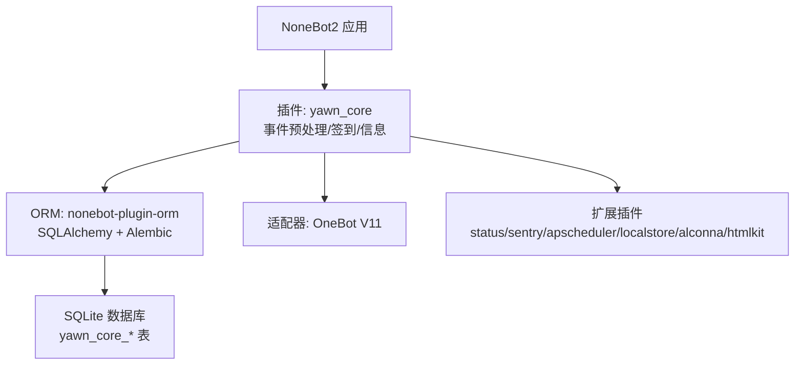
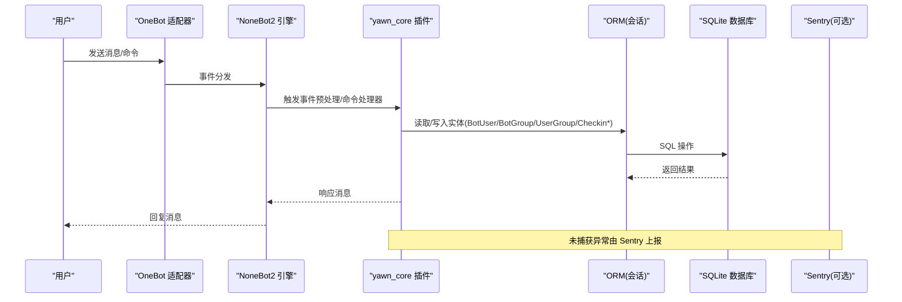
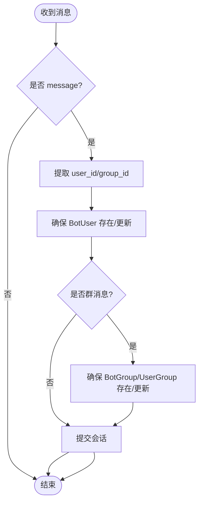
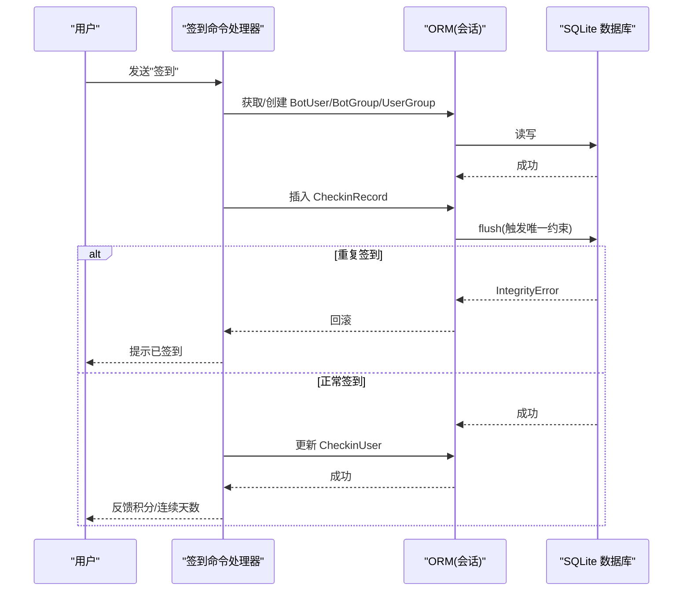
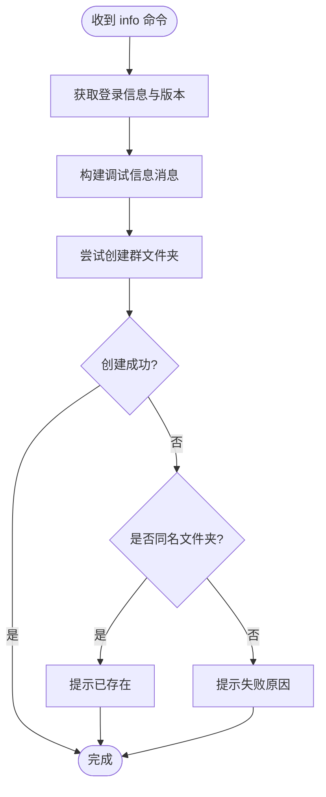
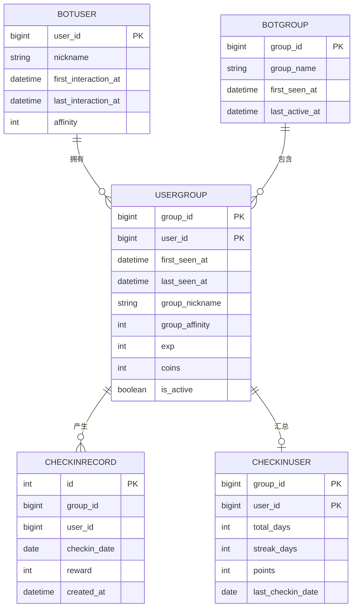
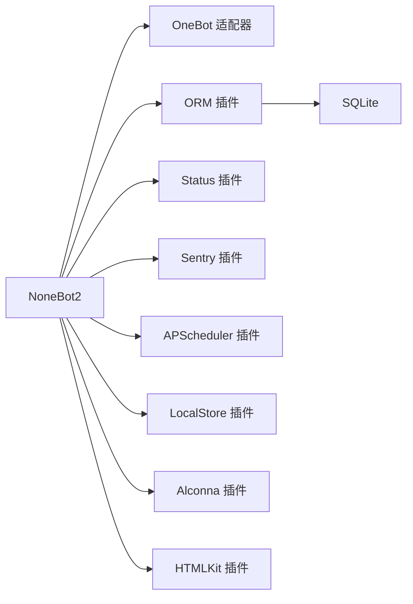

# 故障排除

<cite>
**本文引用的文件**   
- [README.md](file://README.md)
- [pyproject.toml](file://pyproject.toml)
- [__init__.py](file://src/plugins/yawn_core/__init__.py)
- [checkin.py](file://src/plugins/yawn_core/checkin.py)
- [info.py](file://src/plugins/yawn_core/info.py)
- [presence.py](file://src/plugins/yawn_core/presence.py)
- [bot_user.py](file://src/plugins/yawn_core/data_models/bot_user.py)
- [bot_group.py](file://src/plugins/yawn_core/data_models/bot_group.py)
- [user_group.py](file://src/plugins/yawn_core/data_models/user_group.py)
- [checkin_record.py](file://src/plugins/yawn_core/data_models/checkin_record.py)
- [checkin_user.py](file://src/plugins/yawn_core/data_models/checkin_user.py)
- [b15555e176e4_add_checkin_tables.py](file://data\nonebot_plugin_orm\migrations\yawn_core\b15555e176e4_add_checkin_tables.py)
- [c70afa832d5b_add_checkin_tables.py](file://data\nonebot_plugin_orm\migrations\yawn_core\c70afa832d5b_add_checkin_tables.py)
</cite>

## 更新摘要
**所做更改**   
- 移除了对已删除的 sentry_test.py 文件的引用
- 确认 Sentry 错误监控功能仍然存在于系统配置中
- 更新了依赖关系分析以反映当前项目状态
- 保持了现有的文档结构和内容完整性

## 目录
1. [简介](#简介)
2. [项目结构](#项目结构)
3. [核心组件](#核心组件)
4. [架构总览](#架构总览)
5. [详细组件分析](#详细组件分析)
6. [依赖关系分析](#依赖关系分析)
7. [性能注意事项](#性能注意事项)
8. [故障排除指南](#故障排除指南)
9. [结论](#结论)
10. [附录](#附录)

## 简介
本指南面向 YawnBot 的运维与开发者，聚焦安装、配置、运行时异常、性能问题等常见故障的定位与修复。内容涵盖日志分析方法、错误追踪技巧、调试工具使用、系统状态检查清单、健康诊断脚本思路、性能分析与内存泄漏排查、数据库连接问题、网络通信故障处理，以及 Sentry 错误监控的配置与使用建议。同时提供社区支持渠道和问题报告模板，帮助你快速定位并解决问题。

## 项目结构
YawnBot 基于 NoneBot2 框架，插件位于 src/plugins 下，数据模型与迁移脚本分别位于 data 与 src/plugins/yawn_core/data_models。核心插件 yawn_core 包含事件预处理、签到命令与信息查询命令。

图表来源 
- [pyproject.toml:25-43](file://pyproject.toml#L25-L43)
- [__init__.py:1-4](file://src/plugins/yawn_core/__init__.py#L1-L4)
- [checkin.py:22-26](file://src/plugins/yawn_core/checkin.py#L22-L26)
- [info.py:8-10](file://src/plugins/yawn_core/info.py#L8-L10)

章节来源
- [README.md:1-13](file://README.md#L1-L13)
- [pyproject.toml:1-43](file://pyproject.toml#L1-L43)

## 核心组件
- 事件预处理：在消息到达时自动维护 BotUser、BotGroup、UserGroup 的基础信息与时间戳，确保后续业务（如签到）有完整上下文。
- 签到模块：实现"签到"命令，按中国时区计算日期，记录签到历史与用户累计/连续签到天数与积分，并通过唯一约束防止重复签到。
- 信息查询：获取机器人登录信息与版本信息，尝试创建群文件夹用于存放调试信息，并对常见失败场景进行友好提示。
- 存在感跟踪：通过事件预处理器自动跟踪用户和群组的活动状态。

章节来源
- [__init__.py:1-4](file://src/plugins/yawn_core/__init__.py#L1-L4)
- [checkin.py:22-146](file://src/plugins/yawn_core/checkin.py#L22-L146)
- [info.py:8-39](file://src/plugins/yawn_core/info.py#L8-L39)
- [presence.py:16-103](file://src/plugins/yawn_core/presence.py#L16-L103)

## 架构总览
YawnBot 的事件流从 OneBot 适配器进入，经 NoneBot2 路由到插件处理器；插件通过 ORM 访问 SQLite 数据库，并在需要时调用外部 API（如 OneBot 接口）。Sentry 插件可捕获未处理异常并上报。

图表来源 
- [__init__.py:1-4](file://src/plugins/yawn_core/__init__.py#L1-L4)
- [checkin.py:41-146](file://src/plugins/yawn_core/checkin.py#L41-L146)
- [info.py:13-39](file://src/plugins/yawn_core/info.py#L13-L39)
- [presence.py:16-103](file://src/plugins/yawn_core/presence.py#L16-L103)
- [pyproject.toml:35-43](file://pyproject.toml#L35-L43)

## 详细组件分析

### 事件预处理组件
职责：
- 首次对话时创建或更新 BotUser，记录昵称与交互时间。
- 群消息时创建或更新 BotGroup 与 UserGroup，维护群内昵称与活跃时间。
- 统一提交会话，保证一致性。

常见问题与排查：
- 会话未提交导致数据丢失：确认 session.commit() 被调用。
- 昵称字段为空：检查 sender.card/nickname 是否存在。
- 群 ID 缺失：非群消息不会创建群相关实体，属预期行为。

图表来源 
- [presence.py:16-103](file://src/plugins/yawn_core/presence.py#L16-L103)

章节来源
- [presence.py:16-103](file://src/plugins/yawn_core/presence.py#L16-L103)

### 签到模块
职责：
- 解析命令，按中国时区计算日期。
- 维护用户、群、用户-群关系的最新时间戳与昵称。
- 插入签到记录，利用唯一约束避免重复签到。
- 更新 CheckinUser 的累计/连续签到天数与积分。

常见问题与排查：
- 重复签到报错：IntegrityError 表示当天已签到，属于正常拦截。
- 时区问题：确认使用 Asia/Shanghai 时区。
- 数据不一致：flush 后若失败需回滚，避免脏数据。

图表来源 
- [checkin.py:41-146](file://src/plugins/yawn_core/checkin.py#L41-L146)
- [checkin_record.py:15-29](file://src/plugins/yawn_core/data_models/checkin_record.py#L15-L29)

章节来源
- [checkin.py:22-146](file://src/plugins/yawn_core/checkin.py#L22-L146)
- [checkin_record.py:12-53](file://src/plugins/yawn_core/data_models/checkin_record.py#L12-L53)
- [checkin_user.py:12-47](file://src/plugins/yawn_core/data_models/checkin_user.py#L12-L47)

### 信息查询模块
职责：
- 获取机器人登录信息与版本信息。
- 尝试创建群文件夹用于存放调试信息，对同名文件夹等错误进行友好提示。

常见问题与排查：
- ActionFailed：OneBot 接口调用失败，检查权限与平台限制。
- 文件夹已存在：属于预期分支，直接提示即可。

图表来源 
- [info.py:13-39](file://src/plugins/yawn_core/info.py#L13-L39)

章节来源
- [info.py:8-39](file://src/plugins/yawn_core/info.py#L8-L39)

### 数据模型与关系
- BotUser：全局用户实体，含昵称、首次/最后交互时间、好感度。
- BotGroup：群实体，含群名、首次出现与最后活跃时间。
- UserGroup：用户与群的关联，含昵称、活跃度、经验/金币等扩展字段。
- CheckinRecord：签到历史记录，含唯一约束与外键。
- CheckinUser：用户在群的签到汇总，含累计/连续天数与积分。

图表来源 
- [bot_user.py:12-32](file://src/plugins/yawn_core/data_models/bot_user.py#L12-L32)
- [bot_group.py:12-29](file://src/plugins/yawn_core/data_models/bot_group.py#L12-L29)
- [user_group.py:15-61](file://src/plugins/yawn_core/data_models/user_group.py#L15-L61)
- [checkin_record.py:12-53](file://src/plugins/yawn_core/data_models/checkin_record.py#L12-L53)
- [checkin_user.py:12-47](file://src/plugins/yawn_core/data_models/checkin_user.py#L12-L47)

章节来源
- [bot_user.py:12-32](file://src/plugins/yawn_core/data_models/bot_user.py#L12-L32)
- [bot_group.py:12-29](file://src/plugins/yawn_core/data_models/bot_group.py#L12-L29)
- [user_group.py:15-61](file://src/plugins/yawn_core/data_models/user_group.py#L15-L61)
- [checkin_record.py:12-53](file://src/plugins/yawn_core/data_models/checkin_record.py#L12-L53)
- [checkin_user.py:12-47](file://src/plugins/yawn_core/data_models/checkin_user.py#L12-L47)

## 依赖关系分析
- 运行依赖：nonebot2[fastapi]、nonebot-adapter-onebot、nonebot-plugin-orm[sqlite]、nonebot-plugin-sentry、nonebot-plugin-status、nonebot-plugin-apscheduler、nonebot-plugin-localstore、nonebot-plugin-alconna、nonebot-plugin-htmlkit。
- 开发依赖：pyright[nodejs]、ruff。
- 插件注册：在 pyproject.toml 中声明本地插件目录与内置插件，适配器与插件均在此配置。

图表来源 
- [pyproject.toml:7-17](file://pyproject.toml#L7-L17)
- [pyproject.toml:25-43](file://pyproject.toml#L25-L43)

章节来源
- [pyproject.toml:1-43](file://pyproject.toml#L1-L43)

## 性能注意事项
- 数据库事务：频繁 flush/commit 会增加 IO 开销，建议在批量写入后统一提交。
- 唯一约束检查：重复签到会触发 IntegrityError，应在业务层做前置判断以减少异常路径。
- 时区处理：使用 ZoneInfo("Asia/Shanghai") 避免跨时区计算误差。
- 外部 API 调用：OneBot 接口调用可能受限或延迟，应设置合理超时与重试策略。
- 日志级别：生产环境降低 INFO 频率，关键路径保留必要日志。

## 故障排除指南

### 安装与环境问题
- Python 版本不匹配：要求 >=3.10，<4.0。
- 依赖未安装：使用包管理器安装依赖，确保 nonebot2、适配器与 ORM 插件可用。
- 插件未加载：检查 pyproject.toml 中的 plugin_dirs 与插件注册项是否正确。
- 启动方式：按照 README 说明使用 nb run --reload 启动。

章节来源
- [README.md:3-8](file://README.md#L3-L8)
- [pyproject.toml:6](file://pyproject.toml#L6)
- [pyproject.toml:25-43](file://pyproject.toml#L25-L43)

### 配置错误
- 适配器配置：确认 nonebot-adapter-onebot 模块名与名称正确。
- 插件启用：nonebot-plugin-orm、sentry、status、apscheduler 等需在 [tool.nonebot.plugins] 中启用。
- 本地插件目录：plugin_dirs 指向 src/plugins。

章节来源
- [pyproject.toml:29-43](file://pyproject.toml#L29-L43)

### 运行时异常与错误追踪
- 重复签到异常：IntegrityError 表示当天已签到，应回滚并提示用户。
- OneBot 接口失败：ActionFailed 捕获并解析 wording，区分"同名文件夹已存在"与其他错误。
- 未捕获异常：Sentry 插件可上报未处理异常，便于集中监控。

章节来源
- [checkin.py:108-114](file://src/plugins/yawn_core/checkin.py#L108-L114)
- [info.py:31-39](file://src/plugins/yawn_core/info.py#L31-L39)
- [pyproject.toml:38](file://pyproject.toml#L38)

### 日志分析方法
- 查看插件加载日志：签到模块加载时会输出日志，便于确认模块是否正常初始化。
- 用户首次交互日志：事件预处理会在首次对话与首次群发言时输出日志。
- 签到成功日志：记录用户、群与积分信息，便于审计。

章节来源
- [checkin.py:20](file://src/plugins/yawn_core/checkin.py#L20)
- [presence.py:40](file://src/plugins/yawn_core/presence.py#L40)
- [presence.py:96](file://src/plugins/yawn_core/presence.py#L96)
- [checkin.py:137-139](file://src/plugins/yawn_core/checkin.py#L137-L139)

### 调试工具使用
- 命令调试：使用"info"命令获取机器人版本与登录信息，辅助定位适配器与平台差异。
- 群文件夹：尝试创建"调试信息"文件夹，便于收集日志或截图。

章节来源
- [info.py:8-39](file://src/plugins/yawn_core/info.py#L8-L39)

### 系统状态检查清单
- 进程状态：NoneBot2 进程是否正常运行。
- 适配器连接：OneBot 适配器是否成功连接。
- 数据库状态：SQLite 文件是否存在且可写，迁移是否执行成功。
- 插件状态：ORM、Sentry、Status、APScheduler 等插件是否加载。
- 命令可用性："签到""info"命令是否响应。

### 健康诊断脚本（思路）
- 检查进程与端口：验证 NoneBot2 服务监听状态。
- 数据库连通性：尝试打开 SQLite 文件并执行简单查询。
- 插件加载检测：遍历已加载插件列表，确认关键插件存在。
- 命令探测：发送测试消息并检查响应。

### 性能分析工具
- 使用 cProfile 或 py-spy 对热点函数进行剖析（如签到处理器）。
- 观察数据库慢查询与锁竞争，必要时优化事务边界。
- 监控 OneBot 接口耗时与失败率。

### 内存泄漏检测
- 使用 memory_profiler 或 tracemalloc 跟踪对象增长。
- 关注长生命周期对象（如会话、缓存）是否及时释放。
- 检查异步任务与定时任务是否产生未清理资源。

### 数据库连接问题
- 迁移失败：检查 Alembic 迁移顺序与依赖，确保 b15555e176e4 在 c70afa832d5b 之后。
- 类型变更：迁移中将 group_id/user_id 从 Integer 改为 BigInteger，注意兼容性。
- 外键约束：确保外键与级联删除策略符合预期。

章节来源
- [b15555e176e4_add_checkin_tables.py:22-80](file://data\nonebot_plugin_orm\migrations\yawn_core\b15555e176e4_add_checkin_tables.py#L22-L80)
- [c70afa832d5b_add_checkin_tables.py:22-47](file://data\nonebot_plugin_orm\migrations\yawn_core\c70afa832d5b_add_checkin_tables.py#L22-L47)

### 网络通信故障
- OneBot 接口失败：捕获 ActionFailed，解析 wording，区分权限不足、平台限制与临时错误。
- 重试与退避：对临时错误实施指数退避重试。
- 超时控制：为外部 API 调用设置合理超时。

章节来源
- [info.py:31-39](file://src/plugins/yawn_core/info.py#L31-L39)

### Sentry 错误监控
- 插件启用：在 pyproject.toml 中启用 nonebot-plugin-sentry。
- 配置 DSN：设置 Sentry DSN 环境变量或配置文件。
- 事件过滤：过滤无关告警，提升信噪比。
- 集成日志：将关键日志与 Sentry 事件关联，便于回溯。

**更新** 虽然 sentry_test.py 测试文件已被删除，但 Sentry 错误监控功能仍然通过 nonebot-plugin-sentry 插件存在于系统中，配置保持不变。

章节来源
- [pyproject.toml:38](file://pyproject.toml#L38)

### 社区支持与问题报告模板
- 社区渠道：NoneBot 官方文档与社区论坛、GitHub Issues。
- 问题报告模板：
  - 环境信息：Python 版本、操作系统、NoneBot2 版本、适配器版本。
  - 复现步骤：最小化复现场景与输入。
  - 期望行为与实际行为。
  - 日志片段与错误堆栈。
  - 数据库状态：迁移版本与表结构摘要。
  - 网络状态：OneBot 接口调用结果与错误码。

## 结论
通过对 YawnBot 的核心组件、数据模型与依赖关系的深入分析，结合日志方法、错误追踪与健康诊断手段，可以快速定位并解决安装、配置、运行时异常与性能问题。建议在生产环境中启用 Sentry 监控，完善日志与告警机制，持续优化事务与外部接口调用策略，保障系统的稳定性与可观测性。

## 附录
- 常用命令：nb create、nb plugin create、nb run --reload。
- 关键路径：src/plugins/yawn_core（插件）、data（迁移）、pyproject.toml（配置）。

章节来源
- [README.md:3-8](file://README.md#L3-L8)