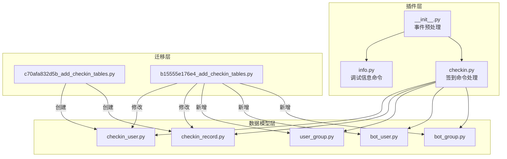
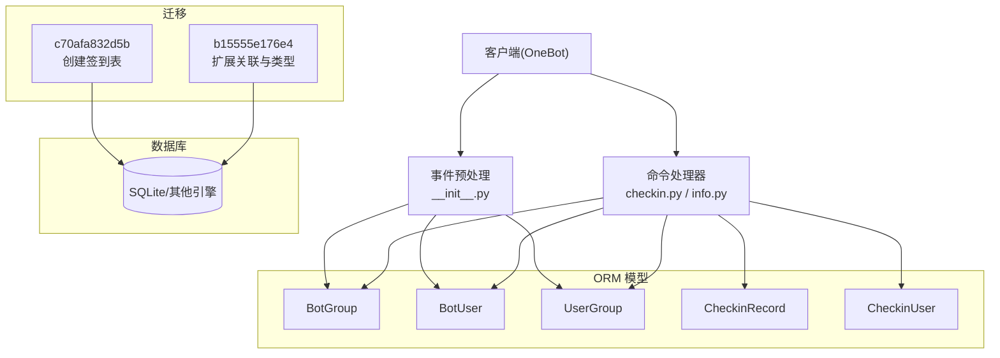
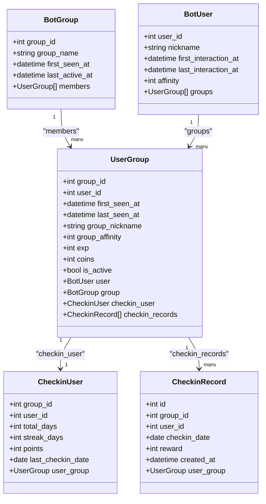
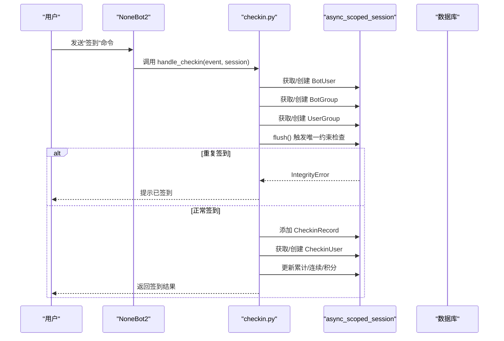
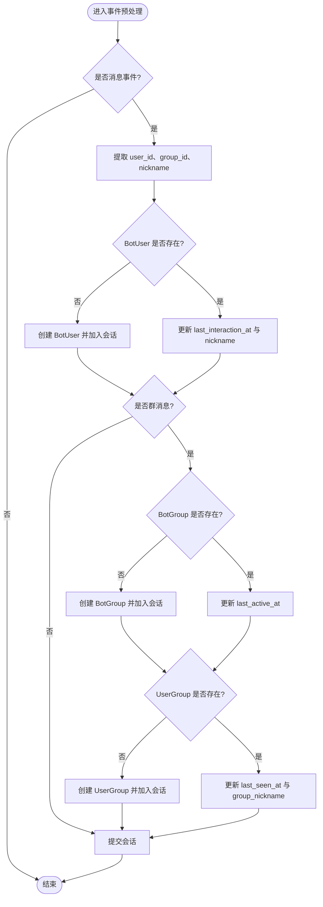
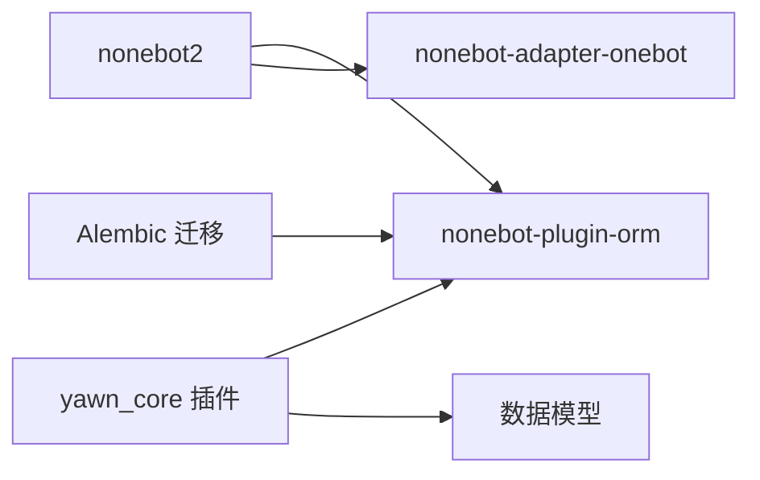
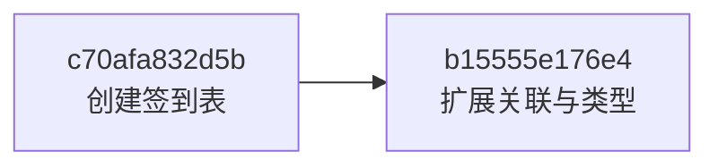

# 数据库管理

<cite>
**本文引用的文件**
- [README.md](file://README.md)
- [pyproject.toml](file://pyproject.toml)
- [src/plugins/yawn_core/__init__.py](file://src/plugins/yawn_core/__init__.py)
- [src/plugins/yawn_core/checkin.py](file://src/plugins/yawn_core/checkin.py)
- [src/plugins/yawn_core/info.py](file://src/plugins/yawn_core/info.py)
- [src/plugins/yawn_core/data_models/__init__.py](file://src/plugins/yawn_core/data_models/__init__.py)
- [src/plugins/yawn_core/data_models/bot_group.py](file://src/plugins/yawn_core/data_models/bot_group.py)
- [src/plugins/yawn_core/data_models/bot_user.py](file://src/plugins/yawn_core/data_models/bot_user.py)
- [src/plugins/yawn_core/data_models/user_group.py](file://src/plugins/yawn_core/data_models/user_group.py)
- [src/plugins/yawn_core/data_models/checkin_record.py](file://src/plugins/yawn_core/data_models/checkin_record.py)
- [src/plugins/yawn_core/data_models/checkin_user.py](file://src/plugins/yawn_core/data_models/checkin_user.py)
- [data/nonebot_plugin_orm/migrations/yawn_core/c70afa832d5b_add_checkin_tables.py](file://data/nonebot_plugin_orm/migrations/yawn_core/c70afa832d5b_add_checkin_tables.py)
- [data/nonebot_plugin_orm/migrations/yawn_core/b15555e176e4_add_checkin_tables.py](file://data/nonebot_plugin_orm/migrations/yawn_core/b15555e176e4_add_checkin_tables.py)
</cite>

## 目录
1. [简介](#简介)
2. [项目结构](#项目结构)
3. [核心组件](#核心组件)
4. [架构总览](#架构总览)
5. [详细组件分析](#详细组件分析)
6. [依赖分析](#依赖分析)
7. [性能考虑](#性能考虑)
8. [故障排除指南](#故障排除指南)
9. [结论](#结论)
10. [附录](#附录)

## 简介
本文件面向 YawnBot 的数据库管理，覆盖以下主题：
- 数据库初始化与 ORM 集成（基于 nonebot-plugin-orm）
- Alembic 迁移工具使用方法与版本管理策略
- 现有迁移文件结构与变更历史
- 数据库备份与恢复流程建议
- 性能优化建议（连接池、索引、事务）
- 数据库连接配置、连接池设置与事务管理最佳实践
- Schema 变更与数据迁移的处理方法

YawnBot 使用 NoneBot2 框架与 nonebot-plugin-orm 插件进行异步 ORM 操作，并使用 Alembic 进行数据库版本控制。当前 yawn_core 插件包含签到功能及用户/群组基础信息表。

**章节来源**
- [README.md:1-13](file://README.md#L1-L13)
- [pyproject.toml:1-123](file://pyproject.toml#L1-L123)

## 项目结构
YawnBot 的数据库相关代码主要位于 src/plugins/yawn_core 与 data/nonebot_plugin_orm/migrations/yawn_core 两个目录：
- src/plugins/yawn_core/data_models：定义 SQLAlchemy 模型（BotGroup、BotUser、UserGroup、CheckinRecord、CheckinUser）
- src/plugins/yawn_core：事件预处理与命令处理器（消息追踪、签到逻辑等）
- data/nonebot_plugin_orm/migrations/yawn_core：Alembic 迁移脚本（创建签到表、扩展关联关系等）

**图表来源**
- [src/plugins/yawn_core/__init__.py:16-74](file://src/plugins/yawn_core/__init__.py#L16-L74)
- [src/plugins/yawn_core/checkin.py:41-147](file://src/plugins/yawn_core/checkin.py#L41-L147)
- [src/plugins/yawn_core/info.py:10-39](file://src/plugins/yawn_core/info.py#L10-L39)
- [src/plugins/yawn_core/data_models/bot_group.py:12-29](file://src/plugins/yawn_core/data_models/bot_group.py#L12-L29)
- [src/plugins/yawn_core/data_models/bot_user.py:12-32](file://src/plugins/yawn_core/data_models/bot_user.py#L12-L32)
- [src/plugins/yawn_core/data_models/user_group.py:15-61](file://src/plugins/yawn_core/data_models/user_group.py#L15-L61)
- [src/plugins/yawn_core/data_models/checkin_record.py:12-53](file://src/plugins/yawn_core/data_models/checkin_record.py#L12-L53)
- [src/plugins/yawn_core/data_models/checkin_user.py:12-47](file://src/plugins/yawn_core/data_models/checkin_user.py#L12-L47)
- [data/nonebot_plugin_orm/migrations/yawn_core/c70afa832d5b_add_checkin_tables.py:22-47](file://data/nonebot_plugin_orm/migrations/yawn_core/c70afa832d5b_add_checkin_tables.py#L22-L47)
- [data/nonebot_plugin_orm/migrations/yawn_core/b15555e176e4_add_checkin_tables.py:22-79](file://data/nonebot_plugin_orm/migrations/yawn_core/b15555e176e4_add_checkin_tables.py#L22-L79)

**章节来源**
- [pyproject.toml:25-43](file://pyproject.toml#L25-L43)
- [src/plugins/yawn_core/data_models/__init__.py:1-14](file://src/plugins/yawn_core/data_models/__init__.py#L1-L14)

## 核心组件
- ORM 模型
  - BotGroup：记录 Bot 认识的群（group_id、group_name、首次出现时间、最后活跃时间）
  - BotUser：记录全局用户（user_id、昵称、首次交互时间、最后交互时间、全局好感度）
  - UserGroup：用户与群的关联（联合主键 group_id+user_id，群内昵称、经验、金币、活跃度等）
  - CheckinRecord：每次签到记录（唯一约束：同群同用户每天一次）
  - CheckinUser：群内用户签到汇总（累计天数、连续天数、积分、最后签到日期）
- 事件预处理
  - 在 __init__.py 中通过 event_preprocessor 自动维护 BotUser、BotGroup、UserGroup 的存在性与最新活动时间
- 命令处理器
  - checkin.py 实现“签到”命令，确保用户/群存在并写入签到记录与汇总统计
  - info.py 提供调试信息展示（非数据库核心，但体现插件运行环境）

**章节来源**
- [src/plugins/yawn_core/data_models/bot_group.py:12-29](file://src/plugins/yawn_core/data_models/bot_group.py#L12-L29)
- [src/plugins/yawn_core/data_models/bot_user.py:12-32](file://src/plugins/yawn_core/data_models/bot_user.py#L12-L32)
- [src/plugins/yawn_core/data_models/user_group.py:15-61](file://src/plugins/yawn_core/data_models/user_group.py#L15-L61)
- [src/plugins/yawn_core/data_models/checkin_record.py:12-53](file://src/plugins/yawn_core/data_models/checkin_record.py#L12-L53)
- [src/plugins/yawn_core/data_models/checkin_user.py:12-47](file://src/plugins/yawn_core/data_models/checkin_user.py#L12-L47)
- [src/plugins/yawn_core/__init__.py:16-74](file://src/plugins/yawn_core/__init__.py#L16-L74)
- [src/plugins/yawn_core/checkin.py:41-147](file://src/plugins/yawn_core/checkin.py#L41-L147)
- [src/plugins/yawn_core/info.py:10-39](file://src/plugins/yawn_core/info.py#L10-L39)

## 架构总览
YawnBot 的数据库架构由三层组成：
- 应用层：NoneBot2 事件与命令处理器（事件预处理、签到命令）
- ORM 层：SQLAlchemy 模型映射到数据库表
- 迁移层：Alembic 脚本管理 schema 演进

**图表来源**
- [src/plugins/yawn_core/__init__.py:16-74](file://src/plugins/yawn_core/__init__.py#L16-L74)
- [src/plugins/yawn_core/checkin.py:41-147](file://src/plugins/yawn_core/checkin.py#L41-L147)
- [data/nonebot_plugin_orm/migrations/yawn_core/c70afa832d5b_add_checkin_tables.py:22-47](file://data/nonebot_plugin_orm/migrations/yawn_core/c70afa832d5b_add_checkin_tables.py#L22-L47)
- [data/nonebot_plugin_orm/migrations/yawn_core/b15555e176e4_add_checkin_tables.py:22-79](file://data/nonebot_plugin_orm/migrations/yawn_core/b15555e176e4_add_checkin_tables.py#L22-L79)

## 详细组件分析

### 数据模型与关系图

**图表来源**
- [src/plugins/yawn_core/data_models/bot_group.py:12-29](file://src/plugins/yawn_core/data_models/bot_group.py#L12-L29)
- [src/plugins/yawn_core/data_models/bot_user.py:12-32](file://src/plugins/yawn_core/data_models/bot_user.py#L12-L32)
- [src/plugins/yawn_core/data_models/user_group.py:15-61](file://src/plugins/yawn_core/data_models/user_group.py#L15-L61)
- [src/plugins/yawn_core/data_models/checkin_record.py:12-53](file://src/plugins/yawn_core/data_models/checkin_record.py#L12-L53)
- [src/plugins/yawn_core/data_models/checkin_user.py:12-47](file://src/plugins/yawn_core/data_models/checkin_user.py#L12-L47)

**章节来源**
- [src/plugins/yawn_core/data_models/bot_group.py:12-29](file://src/plugins/yawn_core/data_models/bot_group.py#L12-L29)
- [src/plugins/yawn_core/data_models/bot_user.py:12-32](file://src/plugins/yawn_core/data_models/bot_user.py#L12-L32)
- [src/plugins/yawn_core/data_models/user_group.py:15-61](file://src/plugins/yawn_core/data_models/user_group.py#L15-L61)
- [src/plugins/yawn_core/data_models/checkin_record.py:12-53](file://src/plugins/yawn_core/data_models/checkin_record.py#L12-L53)
- [src/plugins/yawn_core/data_models/checkin_user.py:12-47](file://src/plugins/yawn_core/data_models/checkin_user.py#L12-L47)

### 签到流程时序图

**图表来源**
- [src/plugins/yawn_core/checkin.py:41-147](file://src/plugins/yawn_core/checkin.py#L41-L147)

**章节来源**
- [src/plugins/yawn_core/checkin.py:41-147](file://src/plugins/yawn_core/checkin.py#L41-L147)

### 事件预处理流程图

**图表来源**
- [src/plugins/yawn_core/__init__.py:16-74](file://src/plugins/yawn_core/__init__.py#L16-L74)

**章节来源**
- [src/plugins/yawn_core/__init__.py:16-74](file://src/plugins/yawn_core/__init__.py#L16-L74)

## 依赖分析
- 运行时依赖
  - nonebot2、nonebot-plugin-orm（含 sqlite 支持）、nonebot-adapter-onebot 等
- 模块依赖
  - 事件预处理与命令处理器依赖 ORM 模型
  - 迁移脚本依赖 Alembic 与 SQLAlchemy
- 外部集成
  - OneBot V11 适配器用于接收消息与执行 API 调用

**图表来源**
- [pyproject.toml:7-17](file://pyproject.toml#L7-L17)
- [pyproject.toml:25-43](file://pyproject.toml#L25-L43)

**章节来源**
- [pyproject.toml:7-17](file://pyproject.toml#L7-L17)
- [pyproject.toml:25-43](file://pyproject.toml#L25-L43)

## 性能考虑
- 连接与事务
  - 使用 async_scoped_session 保证每个请求/事件上下文内的会话隔离
  - 在高频写入路径（如签到）尽量合并 flush/commit，减少往返次数
- 索引与约束
  - 利用 UniqueConstraint 保证业务一致性（如每天一次签到）
  - 对频繁查询字段（如 group_id、user_id、checkin_date）建立合适索引（根据实际引擎决定）
- 批量操作
  - 批量插入或更新时优先使用 session.add_all 或 bulk 接口（视 ORM 能力而定）
- 读写分离与缓存
  - 热点读（如用户信息）可引入内存缓存降低数据库压力
- 监控与诊断
  - 开启 SQL 日志（开发环境）观察慢查询与锁等待

[本节为通用指导，不直接分析具体文件]

## 故障排除指南
- 重复签到异常
  - 现象：IntegrityError 触发回滚并提示已签到
  - 原因：数据库唯一约束 uq_checkin_record_once_per_day
  - 处理：捕获异常并给出友好提示；必要时清理脏数据后重试
- 外键约束失败
  - 现象：删除或更新关联记录时报外键错误
  - 原因：ondelete=CASCADE 未生效或顺序不当
  - 处理：按依赖顺序删除或启用级联删除
- 会话状态问题
  - 现象：flush/commit 报错或数据未持久化
  - 原因：会话未正确提交或事务冲突
  - 处理：确保每个事件/命令处理完成后 commit；必要时 rollback 并重试
- 迁移失败
  - 现象：alembic upgrade/downgrade 报错
  - 原因：迁移脚本与实际 schema 不一致
  - 处理：核对 revision 链与 down_revision；必要时生成新迁移

**章节来源**
- [src/plugins/yawn_core/checkin.py:109-114](file://src/plugins/yawn_core/checkin.py#L109-L114)
- [src/plugins/yawn_core/data_models/checkin_record.py:15-29](file://src/plugins/yawn_core/data_models/checkin_record.py#L15-L29)

## 结论
YawnBot 的数据库管理以 nonebot-plugin-orm 为核心，结合 Alembic 完成 schema 演进。yawn_core 插件通过事件预处理与命令处理器维护用户与群组的基础信息与签到统计。建议在后续迭代中完善连接池配置、索引设计与监控告警，以提升稳定性与性能。

[本节为总结性内容，不直接分析具体文件]

## 附录

### 数据库初始化与 ORM 集成
- 初始化方式
  - 通过 nonebot-plugin-orm 提供的 async_scoped_session 注入会话
  - 插件启动时加载数据模型，确保表结构与应用一致
- 最佳实践
  - 在事件预处理中确保实体存在后再写入业务数据
  - 将写操作集中在一个事务内，避免部分成功导致的数据不一致

**章节来源**
- [src/plugins/yawn_core/__init__.py:16-74](file://src/plugins/yawn_core/__init__.py#L16-L74)
- [pyproject.toml:15-16](file://pyproject.toml#L15-L16)

### Alembic 迁移工具使用方法与版本管理策略
- 常用命令
  - 生成迁移：alembic revision --autogenerate -m "描述"
  - 升级迁移：alembic upgrade head
  - 降级迁移：alembic downgrade -1
  - 查看历史：alembic history
- 版本管理策略
  - 每个迁移对应一个独立变更，保持幂等与可回滚
  - 分支标签（branch_labels）用于区分不同模块（如 yawn_core）
  - 严格维护 revision 与 down_revision 链，避免环路与断裂

**章节来源**
- [data/nonebot_plugin_orm/migrations/yawn_core/c70afa832d5b_add_checkin_tables.py:16-19](file://data/nonebot_plugin_orm/migrations/yawn_core/c70afa832d5b_add_checkin_tables.py#L16-L19)
- [data/nonebot_plugin_orm/migrations/yawn_core/b15555e176e4_add_checkin_tables.py:16-19](file://data/nonebot_plugin_orm/migrations/yawn_core/b15555e176e4_add_checkin_tables.py#L16-L19)

### 现有迁移文件结构与变更历史
- c70afa832d5b_add_checkin_tables.py
  - 创建签到相关表：yawn_core_checkinrecord、yawn_core_checkinuser
  - 定义唯一约束与主键
- b15555e176e4_add_checkin_tables.py
  - 新增 yawn_core_botgroup、yawn_core_botuser、yawn_core_usergroup 表
  - 将 checkinrecord 与 checkinuser 的 group_id/user_id 类型从 Integer 改为 BigInteger
  - 增加与 usergroup 的外键约束，实现级联删除

**图表来源**
- [data/nonebot_plugin_orm/migrations/yawn_core/c70afa832d5b_add_checkin_tables.py:22-47](file://data/nonebot_plugin_orm/migrations/yawn_core/c70afa832d5b_add_checkin_tables.py#L22-L47)
- [data/nonebot_plugin_orm/migrations/yawn_core/b15555e176e4_add_checkin_tables.py:22-79](file://data/nonebot_plugin_orm/migrations/yawn_core/b15555e176e4_add_checkin_tables.py#L22-L79)

**章节来源**
- [data/nonebot_plugin_orm/migrations/yawn_core/c70afa832d5b_add_checkin_tables.py:22-47](file://data/nonebot_plugin_orm/migrations/yawn_core/c70afa832d5b_add_checkin_tables.py#L22-L47)
- [data/nonebot_plugin_orm/migrations/yawn_core/b15555e176e4_add_checkin_tables.py:22-79](file://data/nonebot_plugin_orm/migrations/yawn_core/b15555e176e4_add_checkin_tables.py#L22-L79)

### 数据库备份与恢复流程建议
- 备份
  - SQLite：直接复制 .db 文件（需停止写入或加锁）
  - PostgreSQL/MySQL：使用 pg_dump 或 mysqldump 导出结构化备份
- 恢复
  - 先恢复数据文件，再执行 alembic upgrade head 确保 schema 一致
- 校验
  - 恢复后执行关键查询与迁移校验，确认数据完整性

[本节为通用指导，不直接分析具体文件]

### 数据库连接配置、连接池设置与事务管理最佳实践
- 连接配置
  - 通过 nonebot-plugin-orm 的配置项设置数据库 URL 与绑定键（bind_key）
  - 多引擎场景下使用不同的 bind_key 隔离连接
- 连接池
  - 合理设置 pool_size、max_overflow、pool_recycle 等参数
  - 在高并发场景下评估连接数与超时策略
- 事务管理
  - 使用 async_scoped_session 确保每个事件/命令的事务边界清晰
  - 在异常路径及时 rollback，避免脏数据累积

[本节为通用指导，不直接分析具体文件]

### Schema 变更与数据迁移处理方法
- 变更原则
  - 优先向后兼容（新增列默认值、允许空值）
  - 复杂变更拆分为多个小迁移，便于回滚与验证
- 数据迁移
  - 在 upgrade 中编写数据转换逻辑，downgrade 中提供反向操作
  - 对大表变更采用分批更新，避免长时间锁表

[本节为通用指导，不直接分析具体文件]