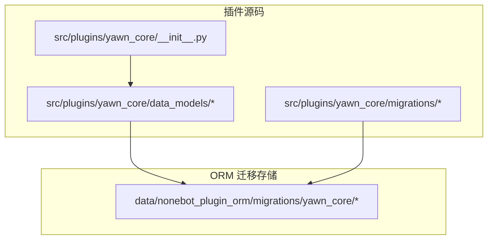
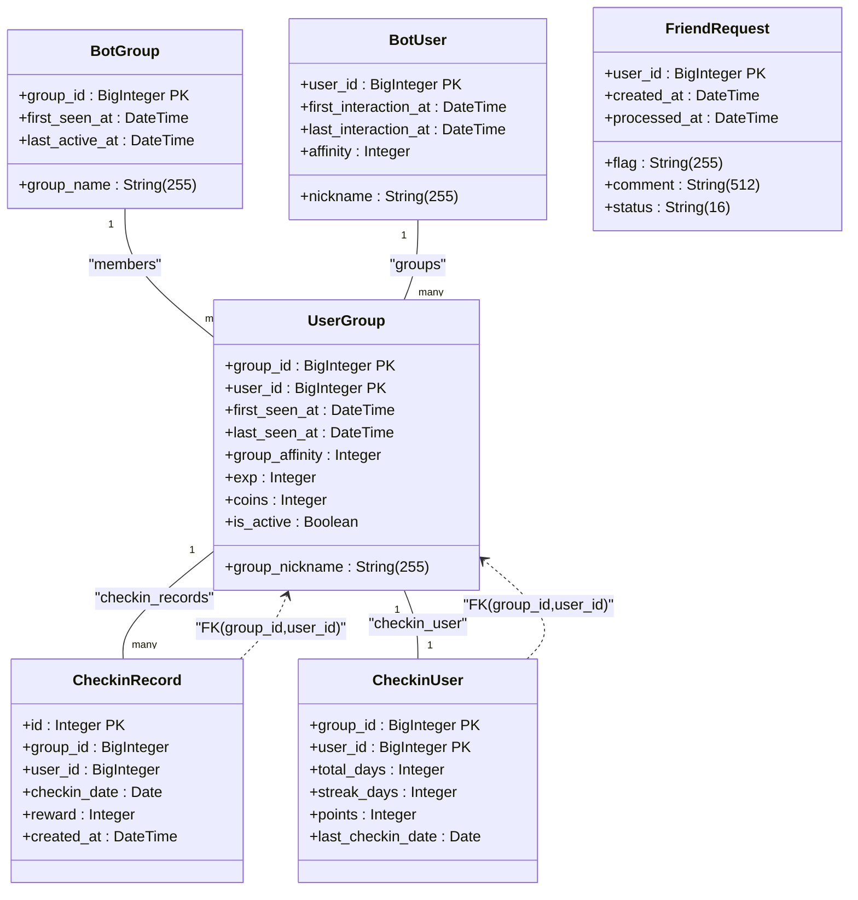
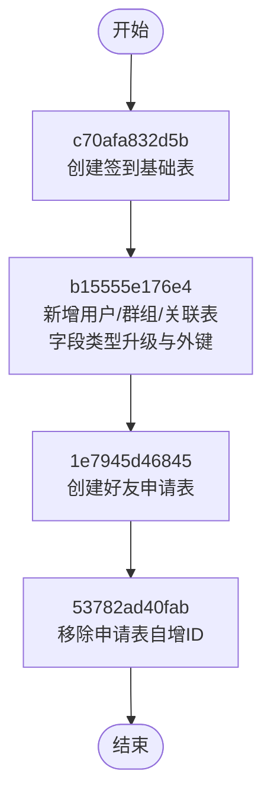
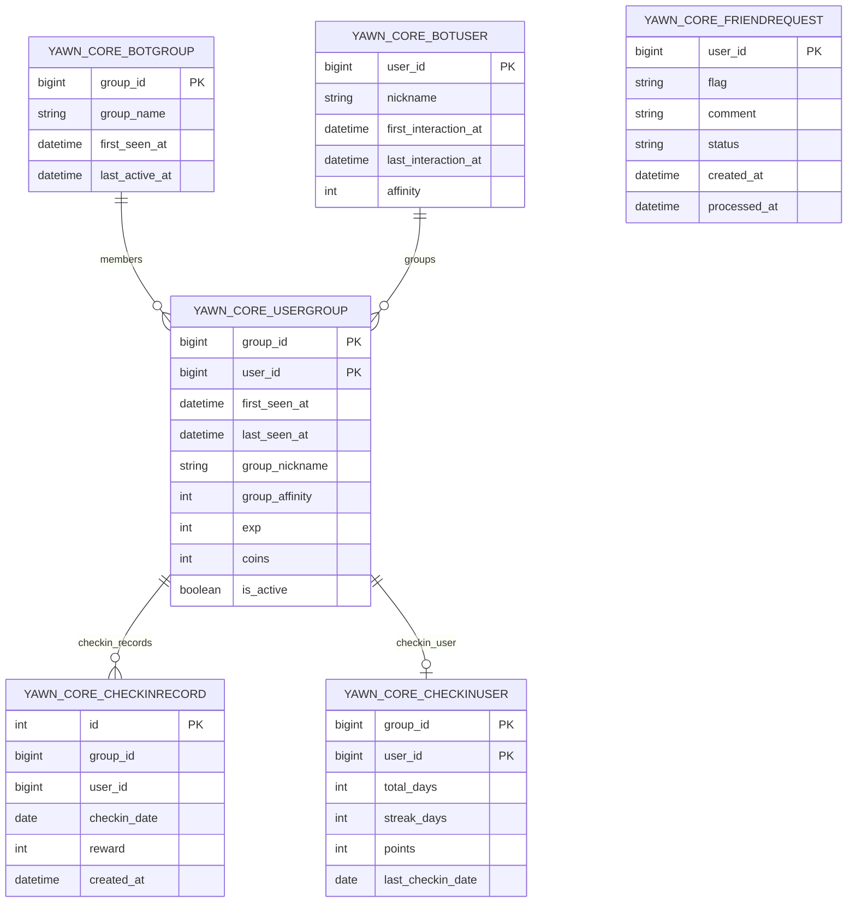
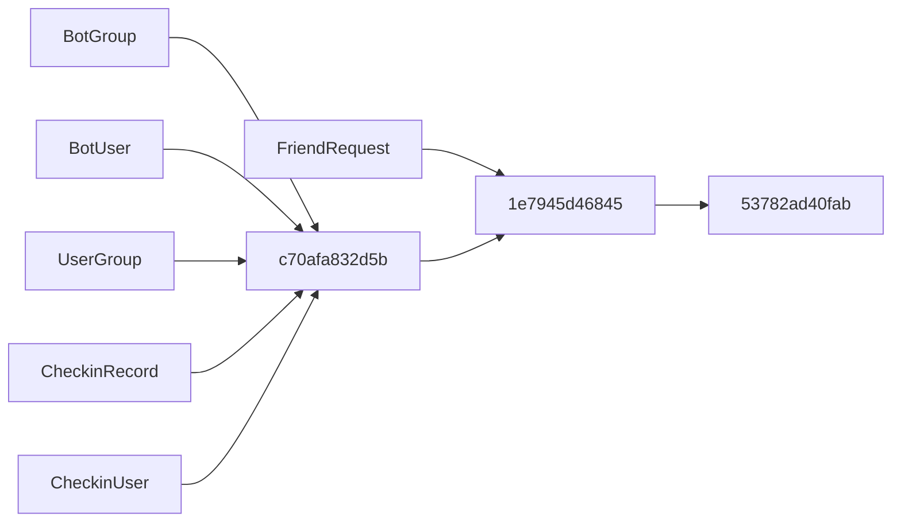

# 数据库迁移

<cite>
**本文引用的文件**   
- [README.md](file://README.md)
- [pyproject.toml](file://pyproject.toml)
- [__init__.py](file://src/plugins/yawn_core/__init__.py)
- [c70afa832d5b_add_checkin_tables.py](file://data/nonebot_plugin_orm/migrations/yawn_core/c70afa832d5b_add_checkin_tables.py)
- [b15555e176e4_add_checkin_tables.py](file://data/nonebot_plugin_orm/migrations/yawn_core/b15555e176e4_add_checkin_tables.py)
- [1e7945d46845_add_checkin_tables.py](file://data/nonebot_plugin_orm/migrations/yawn_core/1e7945d46845_add_checkin_tables.py)
- [53782ad40fab_add_checkin_tables.py](file://data/nonebot_plugin_orm/migrations/yawn_core/53782ad40fab_add_checkin_tables.py)
- [checkin_record.py](file://src/plugins/yawn_core/data_models/checkin_record.py)
- [checkin_user.py](file://src/plugins/yawn_core/data_models/checkin_user.py)
- [user_group.py](file://src/plugins/yawn_core/data_models/user_group.py)
- [bot_group.py](file://src/plugins/yawn_core/data_models/bot_group.py)
- [bot_user.py](file://src/plugins/yawn_core/data_models/bot_user.py)
- [friend_request.py](file://src/plugins/yawn_core/data_models/friend_request.py)
</cite>

## 目录
1. [简介](#简介)
2. [项目结构](#项目结构)
3. [核心组件](#核心组件)
4. [架构总览](#架构总览)
5. [详细组件分析](#详细组件分析)
6. [依赖关系分析](#依赖关系分析)
7. [性能考虑](#性能考虑)
8. [故障排除指南](#故障排除指南)
9. [结论](#结论)
10. [附录](#附录)

## 简介
本文件为 YawnBot 的数据库迁移系统提供完整文档，聚焦于 Alembic 迁移工具的使用与最佳实践。内容涵盖：
- 迁移文件的命名规范、结构与职责
- 现有迁移的执行顺序与变更说明
- 如何创建新迁移、回滚迁移与解决冲突
- 版本管理与升级策略
- 数据一致性与完整性保障
- 常见问题排查与解决方案

YawnBot 基于 NoneBot2 生态，使用 nonebot-plugin-orm（集成 Alembic）进行数据库迁移管理，当前插件域名为 yawn_core。

**章节来源**
- [README.md:1-13](file://README.md#L1-L13)
- [pyproject.toml:1-123](file://pyproject.toml#L1-L123)

## 项目结构
YawnBot 的 ORM 迁移位于 data/nonebot_plugin_orm/migrations/yawn_core 目录下，同时存在 src/plugins/yawn_core/migrations 的镜像副本。模型定义位于 src/plugins/yawn_core/data_models。

**图示来源**
- [__init__.py:1-5](file://src/plugins/yawn_core/__init__.py#L1-L5)
- [checkin_record.py:1-53](file://src/plugins/yawn_core/data_models/checkin_record.py#L1-L53)
- [checkin_user.py:1-47](file://src/plugins/yawn_core/data_models/checkin_user.py#L1-L47)
- [user_group.py:1-61](file://src/plugins/yawn_core/data_models/user_group.py#L1-L61)
- [bot_group.py:1-29](file://src/plugins/yawn_core/data_models/bot_group.py#L1-L29)
- [bot_user.py:1-32](file://src/plugins/yawn_core/data_models/bot_user.py#L1-L32)
- [friend_request.py:1-36](file://src/plugins/yawn_core/data_models/friend_request.py#L1-L36)

**章节来源**
- [pyproject.toml:25-43](file://pyproject.toml#L25-L43)

## 核心组件
- ORM 插件与 Alembic：nonebot-plugin-orm[sqlite] 提供 ORM 与迁移能力，绑定键为 yawn_core。
- 数据模型：BotGroup、BotUser、UserGroup、CheckinRecord、CheckinUser、FriendRequest 等，定义了表结构与关系约束。
- 迁移脚本：按时间顺序生成并维护数据库 schema 演进历史，包含 upgrade/downgrade 方法。

关键要点
- 每个迁移文件包含 revision、down_revision、branch_labels、depends_on 等元信息。
- 所有表均通过 info={'bind_key': 'yawn_core'} 指定绑定键，确保多库或多插件隔离。
- 外键与唯一约束用于保证数据一致性，如“每人每天仅一次签到”。

**章节来源**
- [pyproject.toml:15-16](file://pyproject.toml#L15-L16)
- [checkin_record.py:15-28](file://src/plugins/yawn_core/data_models/checkin_record.py#L15-L28)
- [user_group.py:18-27](file://src/plugins/yawn_core/data_models/user_group.py#L18-L27)
- [c70afa832d5b_add_checkin_tables.py:22-46](file://data/nonebot_plugin_orm/migrations/yawn_core/c70afa832d5b_add_checkin_tables.py#L22-L46)

## 架构总览
下图展示了 ORM 模型与迁移脚本之间的对应关系，以及迁移链的执行顺序。

**图示来源**
- [bot_group.py:12-29](file://src/plugins/yawn_core/data_models/bot_group.py#L12-L29)
- [bot_user.py:12-32](file://src/plugins/yawn_core/data_models/bot_user.py#L12-L32)
- [user_group.py:15-61](file://src/plugins/yawn_core/data_models/user_group.py#L15-L61)
- [checkin_record.py:12-53](file://src/plugins/yawn_core/data_models/checkin_record.py#L12-L53)
- [checkin_user.py:12-47](file://src/plugins/yawn_core/data_models/checkin_user.py#L12-L47)
- [friend_request.py:9-36](file://src/plugins/yawn_core/data_models/friend_request.py#L9-L36)

## 详细组件分析

### 迁移链与执行顺序
当前迁移链如下（按 down_revision 串联）：
- c70afa832d5b → b15555e176e4 → 1e7945d46845 → 53782ad40fab

各迁移的职责与变更概览：
- c70afa832d5b：创建签到相关基础表（yawn_core_checkinrecord、yawn_core_checkinuser），设置唯一约束与主键。
- b15555e176e4：新增 BotGroup、BotUser、UserGroup 三张表；将 checkinrecord/checkinuser 的 group_id/user_id 由 Integer 改为 BigInteger；建立到 UserGroup 的外键约束。
- 1e7945d46845：创建好友申请记录表 yawn_core_friendrequest（初始含自增 id）。
- 53782ad40fab：移除 yawn_core_friendrequest 的 id 列，使 user_id 成为唯一标识。

**图示来源**
- [c70afa832d5b_add_checkin_tables.py:16-19](file://data/nonebot_plugin_orm/migrations/yawn_core/c70afa832d5b_add_checkin_tables.py#L16-L19)
- [b15555e176e4_add_checkin_tables.py:16-19](file://data/nonebot_plugin_orm/migrations/yawn_core/b15555e176e4_add_checkin_tables.py#L16-L19)
- [1e7945d46845_add_checkin_tables.py:16-19](file://data/nonebot_plugin_orm/migrations/yawn_core/1e7945d46845_add_checkin_tables.py#L16-L19)
- [53782ad40fab_add_checkin_tables.py:16-19](file://data/nonebot_plugin_orm/migrations/yawn_core/53782ad40fab_add_checkin_tables.py#L16-L19)

**章节来源**
- [c70afa832d5b_add_checkin_tables.py:22-46](file://data/nonebot_plugin_orm/migrations/yawn_core/c70afa832d5b_add_checkin_tables.py#L22-L46)
- [b15555e176e4_add_checkin_tables.py:22-80](file://data/nonebot_plugin_orm/migrations/yawn_core/b15555e176e4_add_checkin_tables.py#L22-L80)
- [1e7945d46845_add_checkin_tables.py:22-37](file://data/nonebot_plugin_orm/migrations/yawn_core/1e7945d46845_add_checkin_tables.py#L22-L37)
- [53782ad40fab_add_checkin_tables.py:22-29](file://data/nonebot_plugin_orm/migrations/yawn_core/53782ad40fab_add_checkin_tables.py#L22-L29)

### 数据模型与约束
- CheckinRecord：通过 UniqueConstraint 保证“群+用户+日期”唯一，避免重复签到。
- CheckinUser：以 (group_id, user_id) 作为联合主键，统计累计与连续签到天数、积分等。
- UserGroup：连接 BotGroup 与 BotUser，承载群内扩展属性（经验、金币、活跃度等）。
- BotGroup/BotUser：分别记录群与全局用户的基础信息与交互时间。
- FriendRequest：记录好友申请状态与审批所需 flag，user_id 为主键。

**图示来源**
- [bot_group.py:12-29](file://src/plugins/yawn_core/data_models/bot_group.py#L12-L29)
- [bot_user.py:12-32](file://src/plugins/yawn_core/data_models/bot_user.py#L12-L32)
- [user_group.py:15-61](file://src/plugins/yawn_core/data_models/user_group.py#L15-L61)
- [checkin_record.py:12-53](file://src/plugins/yawn_core/data_models/checkin_record.py#L12-L53)
- [checkin_user.py:12-47](file://src/plugins/yawn_core/data_models/checkin_user.py#L12-L47)
- [friend_request.py:9-36](file://src/plugins/yawn_core/data_models/friend_request.py#L9-L36)

**章节来源**
- [checkin_record.py:15-28](file://src/plugins/yawn_core/data_models/checkin_record.py#L15-L28)
- [checkin_user.py:15-22](file://src/plugins/yawn_core/data_models/checkin_user.py#L15-L22)
- [user_group.py:18-27](file://src/plugins/yawn_core/data_models/user_group.py#L18-L27)

### 迁移文件命名规范与内容结构
- 命名规范：采用 Alembic 标准格式 <revision_hash>_<描述>.py，例如 c70afa832d5b_add_checkin_tables.py。
- 必要元数据：
  - revision：迁移唯一标识
  - down_revision：父迁移标识（形成迁移链）
  - branch_labels：分支标签（如 yawn_core）
  - depends_on：依赖声明（可选）
- 函数：
  - upgrade(name="")：正向变更
  - downgrade(name="")：反向回滚
- 表绑定：info={'bind_key': 'yawn_core'} 确保多库隔离。

**章节来源**
- [c70afa832d5b_add_checkin_tables.py:16-19](file://data/nonebot_plugin_orm/migrations/yawn_core/c70afa832d5b_add_checkin_tables.py#L16-L19)
- [b15555e176e4_add_checkin_tables.py:16-19](file://data/nonebot_plugin_orm/migrations/yawn_core/b15555e176e4_add_checkin_tables.py#L16-L19)
- [1e7945d46845_add_checkin_tables.py:16-19](file://data/nonebot_plugin_orm/migrations/yawn_core/1e7945d46845_add_checkin_tables.py#L16-L19)
- [53782ad40fab_add_checkin_tables.py:16-19](file://data/nonebot_plugin_orm/migrations/yawn_core/53782ad40fab_add_checkin_tables.py#L16-L19)

### 创建新迁移的最佳实践
- 先更新数据模型（data_models），再使用 Alembic 生成迁移脚本，随后人工校验与完善。
- 保持幂等性：在 upgrade 中增加条件判断或检查，避免重复操作导致异常。
- 谨慎修改已有列：优先新增列/索引，再逐步废弃旧列，分步迁移。
- 明确 down_revision：确保迁移链连续无断点。
- 使用 batch_alter_table：对不支持在线改表的数据库（如 SQLite）进行批量变更。
- 添加注释与变更记录：便于团队协作与审计。

**章节来源**
- [b15555e176e4_add_checkin_tables.py:58-78](file://data/nonebot_plugin_orm/migrations/yawn_core/b15555e176e4_add_checkin_tables.py#L58-L78)

### 回滚迁移与冲突解决
- 回滚单步：根据目标 revision 执行降级，确保 downgrade 实现正确。
- 回滚到指定版本：定位目标 revision，依次执行中间迁移的 downgrade。
- 冲突解决：
  - 若出现分支合并冲突，需统一 down_revision 指向，必要时引入新的合并迁移。
  - 对于不可逆变更，需在 downgrade 中记录警告或保留最小可恢复逻辑。
  - 数据不一致时，优先通过修复脚本修正数据，再重新应用迁移。

**章节来源**
- [53782ad40fab_add_checkin_tables.py:32-39](file://data/nonebot_plugin_orm/migrations/yawn_core/53782ad40fab_add_checkin_tables.py#L32-L39)

### 版本管理与升级策略
- 版本控制：每个迁移对应一个 revision，形成线性或分支化的版本树。
- 升级策略：
  - 灰度发布：先在测试环境验证迁移脚本，再在生产环境执行。
  - 分批升级：大表变更拆分为多个小迁移，降低锁表风险。
  - 回滚预案：每次升级前备份数据库或快照，确保可快速回退。
- 监控与审计：记录每次迁移的执行日志与耗时，便于问题定位。

**章节来源**
- [c70afa832d5b_add_checkin_tables.py:16-19](file://data/nonebot_plugin_orm/migrations/yawn_core/c70afa832d5b_add_checkin_tables.py#L16-L19)

## 依赖关系分析
迁移与模型之间的依赖关系如下：

**图示来源**
- [bot_group.py:12-29](file://src/plugins/yawn_core/data_models/bot_group.py#L12-L29)
- [bot_user.py:12-32](file://src/plugins/yawn_core/data_models/bot_user.py#L12-L32)
- [user_group.py:15-61](file://src/plugins/yawn_core/data_models/user_group.py#L15-L61)
- [checkin_record.py:12-53](file://src/plugins/yawn_core/data_models/checkin_record.py#L12-L53)
- [checkin_user.py:12-47](file://src/plugins/yawn_core/data_models/checkin_user.py#L12-L47)
- [friend_request.py:9-36](file://src/plugins/yawn_core/data_models/friend_request.py#L9-L36)
- [c70afa832d5b_add_checkin_tables.py:16-19](file://data/nonebot_plugin_orm/migrations/yawn_core/c70afa832d5b_add_checkin_tables.py#L16-L19)
- [1e7945d46845_add_checkin_tables.py:16-19](file://data/nonebot_plugin_orm/migrations/yawn_core/1e7945d46845_add_checkin_tables.py#L16-L19)
- [53782ad40fab_add_checkin_tables.py:16-19](file://data/nonebot_plugin_orm/migrations/yawn_core/53782ad40fab_add_checkin_tables.py#L16-L19)

**章节来源**
- [pyproject.toml:15-16](file://pyproject.toml#L15-L16)

## 性能考虑
- 批量变更：使用 batch_alter_table 减少多次 DDL 开销。
- 索引优化：为大查询字段添加合适索引，避免全表扫描。
- 事务边界：将相关变更放入同一事务，保证原子性。
- 锁表风险：大表结构变更尽量在低峰期执行，缩短锁持有时间。
- 数据迁移：增量更新与分批提交，避免一次性大批量写入造成阻塞。

[本节为通用指导，不直接分析具体文件]

## 故障排除指南
常见问题与处理建议：
- 迁移链断裂：检查 down_revision 是否正确指向父迁移，必要时创建合并迁移。
- 重复迁移：确认已执行的迁移未重复应用，清理 alembic_version 或重新初始化。
- 字段类型不匹配：确保模型与迁移脚本中的字段类型一致，必要时分步迁移。
- 外键约束失败：先删除或禁用约束，再执行变更，最后重建约束。
- SQLite 限制：使用 batch_alter_table，避免不支持的在线 DDL。
- 数据不一致：通过修复脚本修正数据后，重新运行迁移。

**章节来源**
- [b15555e176e4_add_checkin_tables.py:83-112](file://data/nonebot_plugin_orm/migrations/yawn_core/b15555e176e4_add_checkin_tables.py#L83-L112)
- [53782ad40fab_add_checkin_tables.py:32-39](file://data/nonebot_plugin_orm/migrations/yawn_core/53782ad40fab_add_checkin_tables.py#L32-L39)

## 结论
YawnBot 的数据库迁移系统基于 Alembic，结合 nonebot-plugin-orm 实现了清晰的版本管理与数据一致性保障。通过规范的迁移命名、明确的依赖链与完善的约束设计，确保了系统的可扩展性与稳定性。遵循本文的最佳实践与排障指南，可有效降低迁移风险，提升交付质量。

[本节为总结性内容，不直接分析具体文件]

## 附录
- 常用命令（参考 Alembic 官方文档）：
  - 生成迁移：alembic revision --autogenerate -m "描述"
  - 升级至最新：alembic upgrade head
  - 回滚一步：alembic downgrade -1
  - 回滚到指定版本：alembic downgrade <revision>
  - 查看迁移历史：alembic history
- 注意事项：
  - 始终在测试环境验证迁移脚本后再上线。
  - 对不可逆变更提供详细的 downgrade 逻辑或数据恢复方案。
  - 定期备份数据库，确保灾难恢复能力。

[本节为补充信息，不直接分析具体文件]