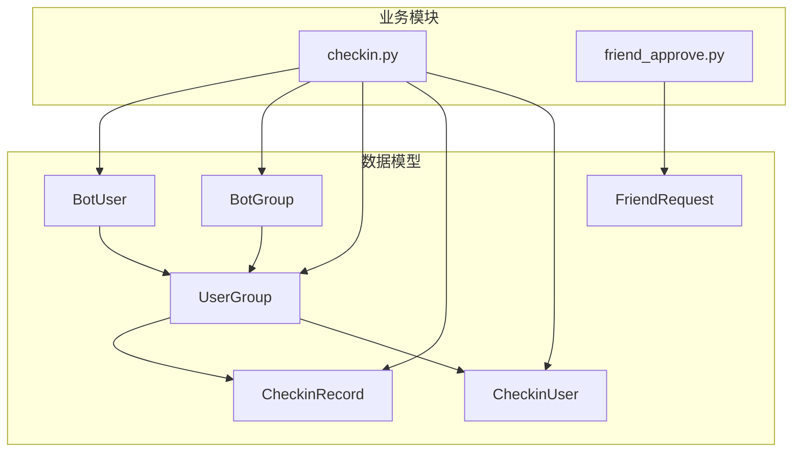
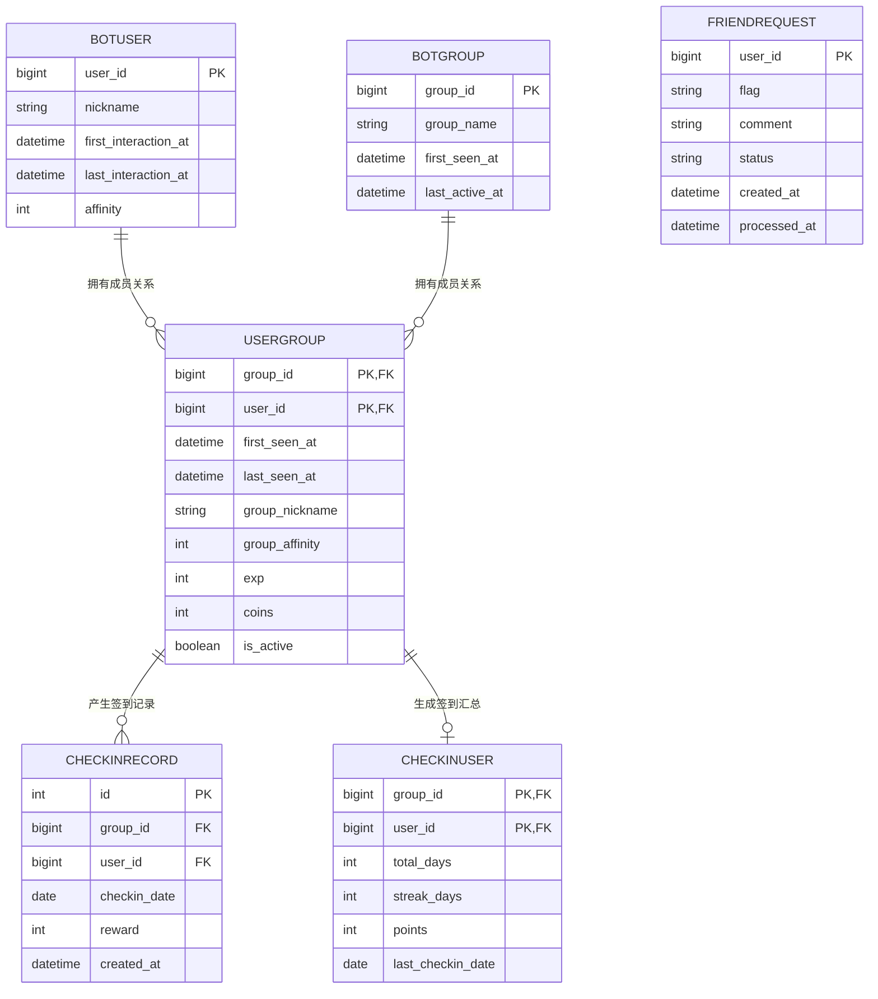
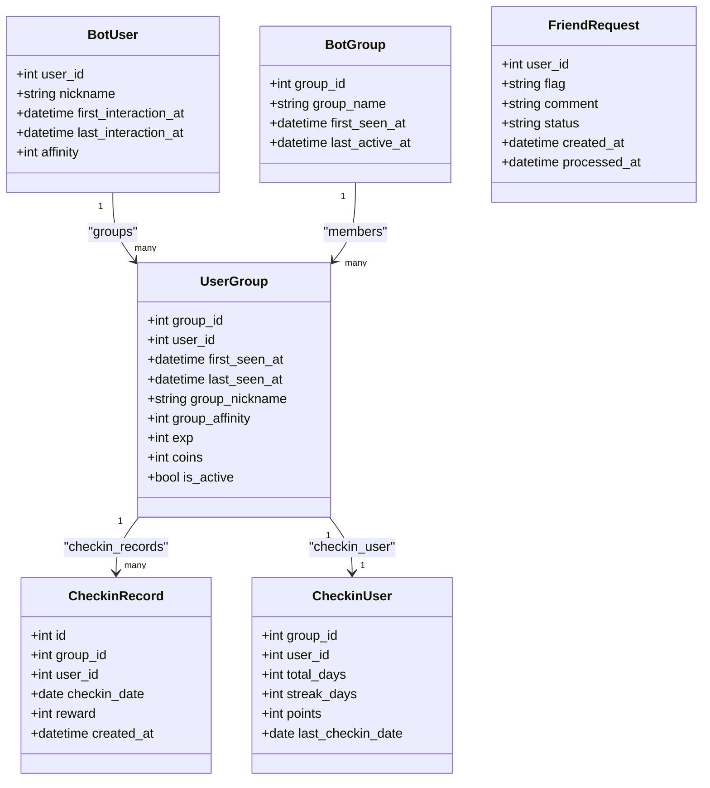
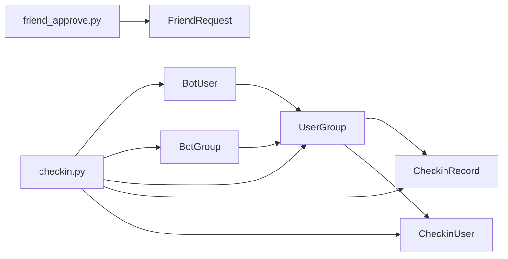
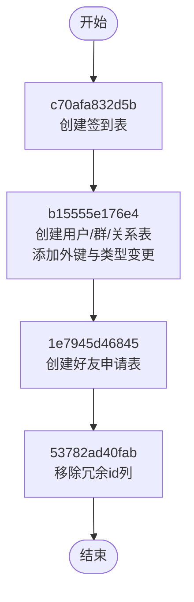
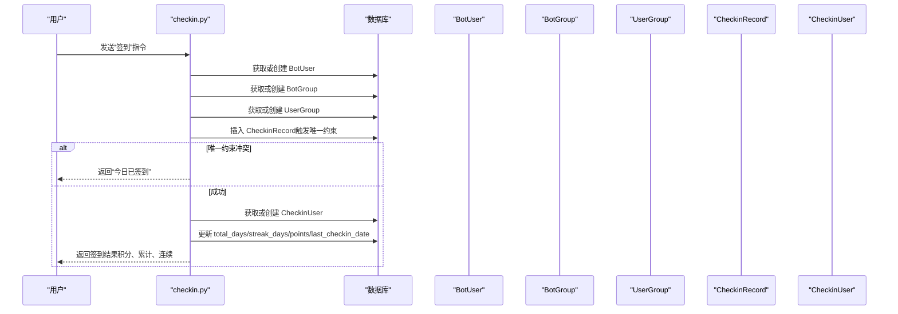
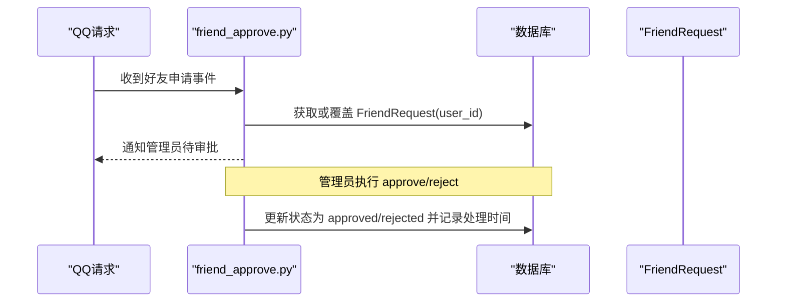

# 数据模型设计

<cite>
**本文引用的文件**   
- [src/plugins/yawn_core/data_models/__init__.py](file://src/plugins/yawn_core/data_models/__init__.py)
- [src/plugins/yawn_core/data_models/bot_user.py](file://src/plugins/yawn_core/data_models/bot_user.py)
- [src/plugins/yawn_core/data_models/bot_group.py](file://src/plugins/yawn_core/data_models/bot_group.py)
- [src/plugins/yawn_core/data_models/user_group.py](file://src/plugins/yawn_core/data_models/user_group.py)
- [src/plugins/yawn_core/data_models/checkin_record.py](file://src/plugins/yawn_core/data_models/checkin_record.py)
- [src/plugins/yawn_core/data_models/checkin_user.py](file://src/plugins/yawn_core/data_models/checkin_user.py)
- [src/plugins/yawn_core/data_models/friend_request.py](file://src/plugins/yawn_core/data_models/friend_request.py)
- [src/plugins/yawn_core/migrations/c70afa832d5b_add_checkin_tables.py](file://src/plugins/yawn_core/migrations/c70afa832d5b_add_checkin_tables.py)
- [src/plugins/yawn_core/migrations/b15555e176e4_add_checkin_tables.py](file://src/plugins/yawn_core/migrations/b15555e176e4_add_checkin_tables.py)
- [src/plugins/yawn_core/migrations/1e7945d46845_add_checkin_tables.py](file://src/plugins/yawn_core/migrations/1e7945d46845_add_checkin_tables.py)
- [src/plugins/yawn_core/migrations/53782ad40fab_add_checkin_tables.py](file://src/plugins/yawn_core/migrations/53782ad40fab_add_checkin_tables.py)
- [src/plugins/yawn_core/checkin.py](file://src/plugins/yawn_core/checkin.py)
- [src/plugins/yawn_core/friend_approve.py](file://src/plugins/yawn_core/friend_approve.py)
</cite>

## 目录
1. [简介](#简介)
2. [项目结构](#项目结构)
3. [核心数据模型](#核心数据模型)
4. [架构总览](#架构总览)
5. [详细组件分析](#详细组件分析)
6. [依赖关系分析](#依赖关系分析)
7. [性能与缓存策略](#性能与缓存策略)
8. [数据生命周期与归档](#数据生命周期与归档)
9. [数据安全、隐私与访问控制](#数据安全隐私与访问控制)
10. [故障排查指南](#故障排查指南)
11. [结论](#结论)
12. [附录：迁移路径与版本管理](#附录迁移路径与版本管理)

## 简介
本文件为 YawnBot 插件 yawn_core 的数据模型设计文档，覆盖实体关系、字段定义、数据类型、主键/外键、索引与约束、数据验证规则与业务规则、数据库模式图、示例数据、数据访问模式、缓存策略、性能考虑、数据生命周期与归档、迁移路径与版本管理，以及数据安全、隐私与访问控制。目标读者包括开发者、运维人员与产品相关人员。

## 项目结构
yawn_core 插件采用 ORM 模型（基于 nonebot_plugin_orm / SQLAlchemy）组织数据模型，并通过 Alembic 进行数据库迁移。核心数据模型位于 data_models 目录下，包含 BotUser、BotGroup、UserGroup、CheckinRecord、CheckinUser、FriendRequest 六个实体；业务逻辑在 checkin.py 与 friend_approve.py 中调用这些模型完成签到与好友申请审批流程。

图表来源
- [src/plugins/yawn_core/data_models/bot_user.py](file://src/plugins/yawn_core/data_models/bot_user.py)
- [src/plugins/yawn_core/data_models/bot_group.py](file://src/plugins/yawn_core/data_models/bot_group.py)
- [src/plugins/yawn_core/data_models/user_group.py](file://src/plugins/yawn_core/data_models/user_group.py)
- [src/plugins/yawn_core/data_models/checkin_record.py](file://src/plugins/yawn_core/data_models/checkin_record.py)
- [src/plugins/yawn_core/data_models/checkin_user.py](file://src/plugins/yawn_core/data_models/checkin_user.py)
- [src/plugins/yawn_core/data_models/friend_request.py](file://src/plugins/yawn_core/data_models/friend_request.py)
- [src/plugins/yawn_core/checkin.py](file://src/plugins/yawn_core/checkin.py)
- [src/plugins/yawn_core/friend_approve.py](file://src/plugins/yawn_core/friend_approve.py)

章节来源
- [src/plugins/yawn_core/data_models/__init__.py:1-22](file://src/plugins/yawn_core/data_models/__init__.py#L1-L22)

## 核心数据模型
本节概述各实体的职责与关键字段，后续章节将给出更详细的字段说明、约束与关联关系。

- BotUser：记录 Bot 认识的全局 QQ 用户，包含昵称、首次/最后交互时间、全局好感度等。
- BotGroup：记录 Bot 认识的 QQ 群，包含群名、首次出现时间、最后活跃时间等。
- UserGroup：用户与群的关联表，维护用户在群内的昵称、活跃度、经验值、金币、是否活跃等扩展信息，并作为签到相关表的父实体。
- CheckinRecord：每次签到的历史记录，保证每人在每个群每天只能签到一次。
- CheckinUser：群内用户的签到汇总数据，累计签到天数、连续签到天数、总积分、最后一次签到日期。
- FriendRequest：好友申请审批记录，按用户唯一保留一条，状态包括 pending/approved/rejected。

章节来源
- [src/plugins/yawn_core/data_models/bot_user.py:12-32](file://src/plugins/yawn_core/data_models/bot_user.py#L12-L32)
- [src/plugins/yawn_core/data_models/bot_group.py:12-29](file://src/plugins/yawn_core/data_models/bot_group.py#L12-L29)
- [src/plugins/yawn_core/data_models/user_group.py:15-61](file://src/plugins/yawn_core/data_models/user_group.py#L15-L61)
- [src/plugins/yawn_core/data_models/checkin_record.py:12-53](file://src/plugins/yawn_core/data_models/checkin_record.py#L12-L53)
- [src/plugins/yawn_core/data_models/checkin_user.py:12-47](file://src/plugins/yawn_core/data_models/checkin_user.py#L12-L47)
- [src/plugins/yawn_core/data_models/friend_request.py:9-36](file://src/plugins/yawn_core/data_models/friend_request.py#L9-L36)

## 架构总览
下图展示数据模型之间的实体关系（ER 图），体现主键/外键与一对一/一对多关系。

图表来源
- [src/plugins/yawn_core/data_models/bot_user.py:12-32](file://src/plugins/yawn_core/data_models/bot_user.py#L12-L32)
- [src/plugins/yawn_core/data_models/bot_group.py:12-29](file://src/plugins/yawn_core/data_models/bot_group.py#L12-L29)
- [src/plugins/yawn_core/data_models/user_group.py:15-61](file://src/plugins/yawn_core/data_models/user_group.py#L15-L61)
- [src/plugins/yawn_core/data_models/checkin_record.py:12-53](file://src/plugins/yawn_core/data_models/checkin_record.py#L12-L53)
- [src/plugins/yawn_core/data_models/checkin_user.py:12-47](file://src/plugins/yawn_core/data_models/checkin_user.py#L12-L47)
- [src/plugins/yawn_core/data_models/friend_request.py:9-36](file://src/plugins/yawn_core/data_models/friend_request.py#L9-L36)

## 详细组件分析

### BotUser（全局用户）
- 主键：user_id（BigInteger）
- 字段含义
  - nickname：用户昵称（可空）
  - first_interaction_at：首次交互时间（默认当前时间戳）
  - last_interaction_at：最后交互时间（可空）
  - affinity：全局好感度（默认 0）
- 关联关系
  - 与 UserGroup 一对多（一个用户可在多个群中存在成员关系）
- 使用场景
  - 记录用户基础信息与互动时间线，支撑个性化与统计

章节来源
- [src/plugins/yawn_core/data_models/bot_user.py:12-32](file://src/plugins/yawn_core/data_models/bot_user.py#L12-L32)

### BotGroup（群组）
- 主键：group_id（BigInteger）
- 字段含义
  - group_name：群名称（可空）
  - first_seen_at：首次出现时间（默认当前时间戳）
  - last_active_at：最后活跃时间（可空）
- 关联关系
  - 与 UserGroup 一对多（一个群有多个成员关系）

章节来源
- [src/plugins/yawn_core/data_models/bot_group.py:12-29](file://src/plugins/yawn_core/data_models/bot_group.py#L12-L29)

### UserGroup（用户-群关系）
- 联合主键：(group_id, user_id)
- 外键
  - group_id 引用 BotGroup.group_id，级联删除
  - user_id 引用 BotUser.user_id，级联删除
- 字段含义
  - first_seen_at：首次出现在该群的时间（默认当前时间戳）
  - last_seen_at：最后在该群出现的时间（可空）
  - group_nickname：群内昵称（可空）
  - group_affinity：群内好感度（默认 0）
  - exp：经验值（默认 0）
  - coins：金币（默认 0）
  - is_active：是否活跃（默认 True）
- 关联关系
  - 与 CheckinRecord 一对多
  - 与 CheckinUser 一对一（uselist=False）

章节来源
- [src/plugins/yawn_core/data_models/user_group.py:15-61](file://src/plugins/yawn_core/data_models/user_group.py#L15-L61)

### CheckinRecord（签到记录）
- 主键：id（自增整数）
- 唯一约束：(group_id, user_id, checkin_date) 保证每人每群每天仅一次签到
- 外键：(group_id, user_id) 引用 UserGroup(group_id, user_id)，级联删除
- 字段含义
  - checkin_date：签到日期
  - reward：本次签到获得的积分
  - created_at：记录创建时间（默认当前时间戳）
- 使用场景
  - 精确记录每一次签到行为，用于统计与审计

章节来源
- [src/plugins/yawn_core/data_models/checkin_record.py:12-53](file://src/plugins/yawn_core/data_models/checkin_record.py#L12-L53)

### CheckinUser（签到汇总）
- 联合主键：(group_id, user_id)
- 外键：(group_id, user_id) 引用 UserGroup(group_id, user_id)，级联删除
- 字段含义
  - total_days：累计签到天数（默认 0）
  - streak_days：当前连续签到天数（默认 0）
  - points：总积分（默认 0）
  - last_checkin_date：最后一次签到日期（可空）
- 使用场景
  - 聚合统计用户签到表现，便于快速查询与展示

章节来源
- [src/plugins/yawn_core/data_models/checkin_user.py:12-47](file://src/plugins/yawn_core/data_models/checkin_user.py#L12-L47)

### FriendRequest（好友申请）
- 主键：user_id（每个用户只保留一条记录）
- 字段含义
  - flag：OneBot 协议用于审批的标识（每次申请覆盖）
  - comment：申请验证信息（可空）
  - status：状态（pending/approved/rejected，默认 pending）
  - created_at：创建时间（默认当前时间戳）
  - processed_at：处理时间（可空）
- 使用场景
  - 集中管理好友申请，支持管理员审批与拒绝

章节来源
- [src/plugins/yawn_core/data_models/friend_request.py:9-36](file://src/plugins/yawn_core/data_models/friend_request.py#L9-L36)

### 类关系图（ORM 模型）

图表来源
- [src/plugins/yawn_core/data_models/bot_user.py:12-32](file://src/plugins/yawn_core/data_models/bot_user.py#L12-L32)
- [src/plugins/yawn_core/data_models/bot_group.py:12-29](file://src/plugins/yawn_core/data_models/bot_group.py#L12-L29)
- [src/plugins/yawn_core/data_models/user_group.py:15-61](file://src/plugins/yawn_core/data_models/user_group.py#L15-L61)
- [src/plugins/yawn_core/data_models/checkin_record.py:12-53](file://src/plugins/yawn_core/data_models/checkin_record.py#L12-L53)
- [src/plugins/yawn_core/data_models/checkin_user.py:12-47](file://src/plugins/yawn_core/data_models/checkin_user.py#L12-L47)
- [src/plugins/yawn_core/data_models/friend_request.py:9-36](file://src/plugins/yawn_core/data_models/friend_request.py#L9-L36)

## 依赖关系分析
- 直接依赖
  - UserGroup 依赖 BotUser、BotGroup（通过外键）
  - CheckinRecord、CheckinUser 依赖 UserGroup（通过复合外键）
- 间接依赖
  - 签到流程依赖 BotUser、BotGroup、UserGroup、CheckinRecord、CheckinUser
  - 好友申请流程依赖 FriendRequest
- 潜在循环依赖
  - 模型间通过 TYPE_CHECKING 引入避免运行时循环导入
- 外部依赖
  - nonebot_plugin_orm（ORM 基类）
  - SQLAlchemy（类型映射、约束、关系）
  - Alembic（迁移）

图表来源
- [src/plugins/yawn_core/data_models/bot_user.py:12-32](file://src/plugins/yawn_core/data_models/bot_user.py#L12-L32)
- [src/plugins/yawn_core/data_models/bot_group.py:12-29](file://src/plugins/yawn_core/data_models/bot_group.py#L12-L29)
- [src/plugins/yawn_core/data_models/user_group.py:15-61](file://src/plugins/yawn_core/data_models/user_group.py#L15-L61)
- [src/plugins/yawn_core/data_models/checkin_record.py:12-53](file://src/plugins/yawn_core/data_models/checkin_record.py#L12-L53)
- [src/plugins/yawn_core/data_models/checkin_user.py:12-47](file://src/plugins/yawn_core/data_models/checkin_user.py#L12-L47)
- [src/plugins/yawn_core/data_models/friend_request.py:9-36](file://src/plugins/yawn_core/data_models/friend_request.py#L9-L36)
- [src/plugins/yawn_core/checkin.py:1-147](file://src/plugins/yawn_core/checkin.py#L1-L147)
- [src/plugins/yawn_core/friend_approve.py:1-152](file://src/plugins/yawn_core/friend_approve.py#L1-L152)

## 性能与缓存策略
- 索引与约束
  - CheckinRecord 的唯一约束 (group_id, user_id, checkin_date) 防止重复签到，同时可作为高效查询条件
  - UserGroup 的联合主键 (group_id, user_id) 提供快速定位
  - CheckinUser 的联合主键 (group_id, user_id) 确保汇总数据的唯一性
- 事务与一致性
  - 签到流程先 flush 触发唯一约束检查，若失败则回滚并提示已签到
  - 汇总更新与记录写入在同一会话中，保证原子性
- 查询优化建议
  - 对常用查询条件建立索引：如 CheckinRecord.checkin_date、CheckinUser.points、UserGroup.is_active
  - 批量操作时减少往返次数，合并多次写入
- 缓存策略
  - 热点数据（如用户最近签到状态、连续签到天数）可在应用层做短时缓存（例如 Redis），注意失效策略与一致性
  - 统计报表可采用物化视图或定时任务预计算

[本节为通用指导，不直接分析具体文件]

## 数据生命周期与归档
- 生命周期
  - BotUser/BotGroup：随首次交互/出现而创建，last_interaction_at/last_active_at 持续更新
  - UserGroup：用户进入群时创建，is_active 标记活跃状态，last_seen_at 更新
  - CheckinRecord：每次签到生成一条记录，不可重复
  - CheckinUser：首次签到时创建，随后累计更新
  - FriendRequest：收到申请即创建或覆盖，处理后状态变为 approved/rejected
- 保留策略
  - 历史签到记录可按策略归档至冷存储（如按月分区）
  - 非活跃用户（UserGroup.is_active=False）可定期清理或归档
- 归档规则
  - 建议对 CheckinRecord 按 checkin_date 分区或分表，便于冷热分离
  - FriendRequest 处理后可归档，保留审计所需的最小字段

[本节为通用指导，不直接分析具体文件]

## 数据安全、隐私与访问控制
- 敏感字段
  - nickname、comment 可能包含个人信息，需限制日志输出与权限访问
- 访问控制
  - 好友申请审批命令（approve/reject/list）仅限超级用户执行
  - 建议在应用层增加角色校验与审计日志
- 数据最小化
  - 仅存储必要的用户与群信息，避免冗余
- 合规要求
  - 遵循平台隐私政策，对用户数据进行脱敏与加密存储（如必要）

章节来源
- [src/plugins/yawn_core/friend_approve.py:66-152](file://src/plugins/yawn_core/friend_approve.py#L66-L152)

## 故障排查指南
- 重复签到报错
  - 现象：提交签到后抛出完整性错误
  - 原因：UniqueConstraint(uq_checkin_record_once_per_day) 被触发
  - 处理：回滚事务并提示“今天已签到”
- 好友申请未生效
  - 现象：审批后无结果
  - 排查：确认 flag 是否正确传递，status 是否为 pending
- 汇总数据不一致
  - 现象：total_days/streak_days/points 异常
  - 排查：检查签到记录是否存在，连续签到逻辑是否按昨天判断

章节来源
- [src/plugins/yawn_core/checkin.py:109-114](file://src/plugins/yawn_core/checkin.py#L109-L114)
- [src/plugins/yawn_core/friend_approve.py:94-152](file://src/plugins/yawn_core/friend_approve.py#L94-L152)

## 结论
YawnBot 的 yawn_core 插件通过清晰的数据模型与严格的约束，实现了用户-群关系管理与签到系统，以及好友申请审批流程。模型设计兼顾了数据一致性与可扩展性，配合 Alembic 迁移可实现平滑演进。建议在后续迭代中完善索引策略、缓存机制与归档方案，以提升性能与可维护性。

[本节为总结，不直接分析具体文件]

## 附录：迁移路径与版本管理
- 初始迁移
  - c70afa832d5b：创建签到相关表（CheckinRecord、CheckinUser）
- 扩展迁移
  - b15555e176e4：创建 BotUser、BotGroup、UserGroup，并为签到表添加外键约束，调整字段类型
- 功能迁移
  - 1e7945d46845：创建 FriendRequest 表
  - 53782ad40fab：移除 FriendRequest 的冗余 id 列，以 user_id 为主键

图表来源
- [src/plugins/yawn_core/migrations/c70afa832d5b_add_checkin_tables.py:22-46](file://src/plugins/yawn_core/migrations/c70afa832d5b_add_checkin_tables.py#L22-L46)
- [src/plugins/yawn_core/migrations/b15555e176e4_add_checkin_tables.py:22-113](file://src/plugins/yawn_core/migrations/b15555e176e4_add_checkin_tables.py#L22-L113)
- [src/plugins/yawn_core/migrations/1e7945d46845_add_checkin_tables.py:22-46](file://src/plugins/yawn_core/migrations/1e7945d46845_add_checkin_tables.py#L22-L46)
- [src/plugins/yawn_core/migrations/53782ad40fab_add_checkin_tables.py:22-40](file://src/plugins/yawn_core/migrations/53782ad40fab_add_checkin_tables.py#L22-L40)

## 示例数据（示意）
以下为典型示例数据，帮助理解字段含义与关联关系（不展示代码内容，仅描述）：
- BotUser：user_id=123456，nickname="小明"，first_interaction_at="2026-01-01T10:00:00"，affinity=10
- BotGroup：group_id=789012，group_name="测试群"，first_seen_at="2026-01-01T10:00:00"
- UserGroup：group_id=789012，user_id=123456，group_nickname="群内昵称"，exp=100，coins=50，is_active=True
- CheckinRecord：id=1，group_id=789012，user_id=123456，checkin_date="2026-01-01"，reward=10
- CheckinUser：group_id=789012，user_id=123456，total_days=1，streak_days=1，points=10，last_checkin_date="2026-01-01"
- FriendRequest：user_id=654321，flag="abc123"，comment="你好"，status="pending"

[本节为概念性示例，不直接分析具体文件]

## 关键业务流程时序图

### 签到流程

图表来源
- [src/plugins/yawn_core/checkin.py:41-147](file://src/plugins/yawn_core/checkin.py#L41-L147)
- [src/plugins/yawn_core/data_models/checkin_record.py:12-53](file://src/plugins/yawn_core/data_models/checkin_record.py#L12-L53)
- [src/plugins/yawn_core/data_models/checkin_user.py:12-47](file://src/plugins/yawn_core/data_models/checkin_user.py#L12-L47)

### 好友申请审批流程

图表来源
- [src/plugins/yawn_core/friend_approve.py:31-152](file://src/plugins/yawn_core/friend_approve.py#L31-L152)
- [src/plugins/yawn_core/data_models/friend_request.py:9-36](file://src/plugins/yawn_core/data_models/friend_request.py#L9-L36)