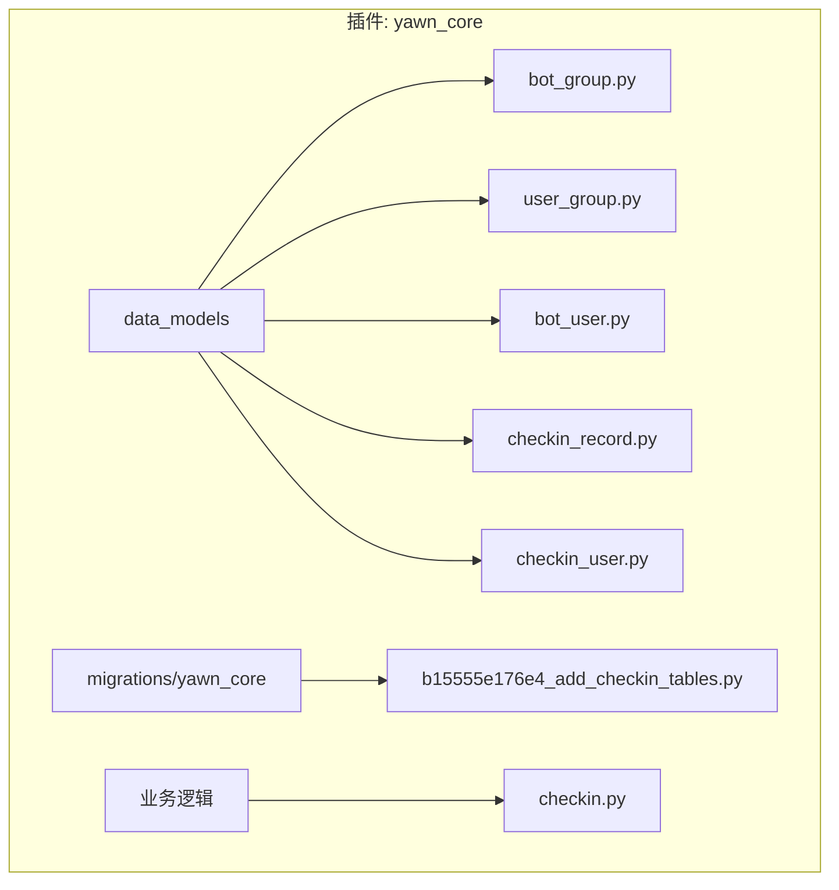
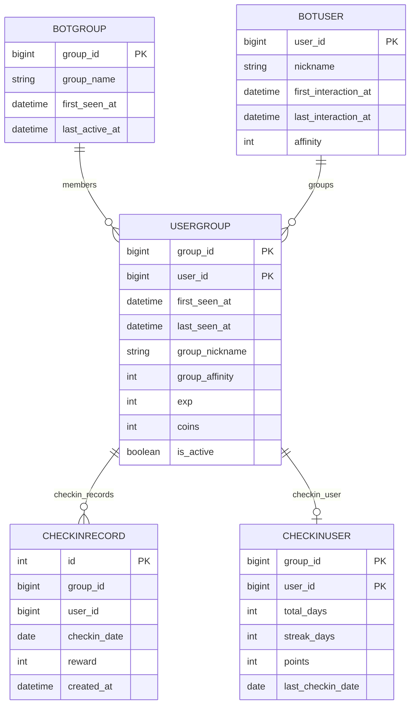
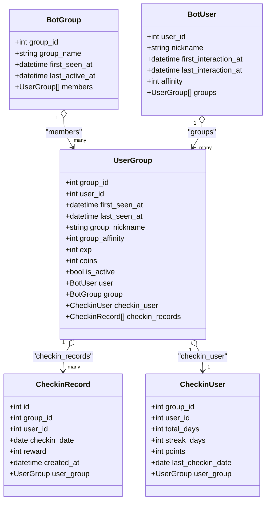
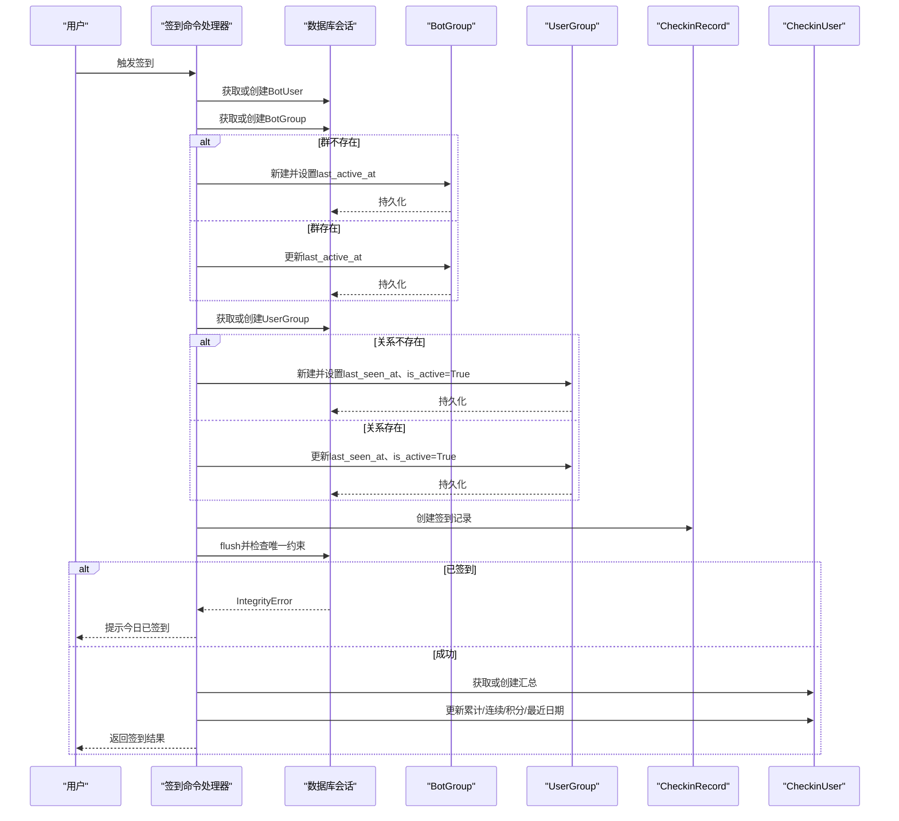
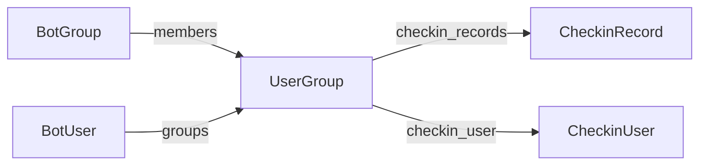

# BotGroup群组模型

<cite>
**本文引用的文件**   
- [bot_group.py](file://src/plugins/yawn_core/data_models/bot_group.py)
- [user_group.py](file://src/plugins/yawn_core/data_models/user_group.py)
- [bot_user.py](file://src/plugins/yawn_core/data_models/bot_user.py)
- [checkin_record.py](file://src/plugins/yawn_core/data_models/checkin_record.py)
- [checkin_user.py](file://src/plugins/yawn_core/data_models/checkin_user.py)
- [__init__.py](file://src/plugins/yawn_core/data_models/__init__.py)
- [b15555e176e4_add_checkin_tables.py](file://data/nonebot_plugin_orm/migrations/yawn_core/b15555e176e4_add_checkin_tables.py)
- [checkin.py](file://src/plugins/yawn_core/checkin.py)
</cite>

## 目录
1. [简介](#简介)
2. [项目结构](#项目结构)
3. [核心组件](#核心组件)
4. [架构总览](#架构总览)
5. [详细组件分析](#详细组件分析)
6. [依赖关系分析](#依赖关系分析)
7. [性能考量](#性能考量)
8. [故障排查指南](#故障排查指南)
9. [结论](#结论)
10. [附录：SQLAlchemy ORM使用示例与常见查询](#附录sqlalchemy-orm使用示例与常见查询)

## 简介
本文件为BotGroup群组模型的详细数据模型文档。BotGroup用于表示Bot所认识的QQ群实体，包含群组主键、名称、首次出现时间、最后活跃时间等字段，并通过UserGroup与用户建立多对多关系。文档涵盖字段定义、约束、业务语义、与UserGroup的关系映射、活跃度统计方式、以及基于SQLAlchemy ORM的创建/更新/查询示例和常见查询模式。

## 项目结构
YawnBot插件采用按功能模块组织的数据模型目录结构，核心数据模型位于data_models下，迁移脚本位于migrations目录，业务逻辑（如签到）位于插件根目录。

图表来源
- [bot_group.py:1-29](file://src/plugins/yawn_core/data_models/bot_group.py#L1-L29)
- [user_group.py:1-61](file://src/plugins/yawn_core/data_models/user_group.py#L1-L61)
- [bot_user.py:1-32](file://src/plugins/yawn_core/data_models/bot_user.py#L1-L32)
- [checkin_record.py:1-52](file://src/plugins/yawn_core/data_models/checkin_record.py#L1-L52)
- [checkin_user.py:1-47](file://src/plugins/yawn_core/data_models/checkin_user.py#L1-L47)
- [b15555e176e4_add_checkin_tables.py:22-57](file://data/nonebot_plugin_orm/migrations/yawn_core/b15555e176e4_add_checkin_tables.py#L22-L57)
- [checkin.py:41-147](file://src/plugins/yawn_core/checkin.py#L41-L147)

章节来源
- [bot_group.py:1-29](file://src/plugins/yawn_core/data_models/bot_group.py#L1-L29)
- [user_group.py:1-61](file://src/plugins/yawn_core/data_models/user_group.py#L1-L61)
- [b15555e176e4_add_checkin_tables.py:22-57](file://data/nonebot_plugin_orm/migrations/yawn_core/b15555e176e4_add_checkin_tables.py#L22-L57)

## 核心组件
- BotGroup：代表一个QQ群，主键为group_id，包含群组名称、首次出现时间、最后活跃时间，以及与成员UserGroup的一对多关系。
- UserGroup：用户与群的关联表，联合主键(group_id, user_id)，记录用户在群内的昵称、首次/最后出现时间、群内扩展属性（好感度、经验、金币、是否活跃），并关联到BotUser与CheckinUser/CheckinRecord。
- BotUser：全局用户实体，与UserGroup一对多。
- CheckinRecord：每次签到的明细记录，通过唯一约束保证“每人在每个群每天只能签到一次”。
- CheckinUser：用户在某群的签到汇总（累计天数、连续天数、积分、最近签到日期）。

章节来源
- [bot_group.py:12-29](file://src/plugins/yawn_core/data_models/bot_group.py#L12-L29)
- [user_group.py:15-61](file://src/plugins/yawn_core/data_models/user_group.py#L15-L61)
- [bot_user.py:12-32](file://src/plugins/yawn_core/data_models/bot_user.py#L12-L32)
- [checkin_record.py:12-52](file://src/plugins/yawn_core/data_models/checkin_record.py#L12-L52)
- [checkin_user.py:12-47](file://src/plugins/yawn_core/data_models/checkin_user.py#L12-L47)

## 架构总览
下图展示了BotGroup与UserGroup、BotUser、CheckinRecord、CheckinUser之间的实体关系及外键约束。

图表来源
- [bot_group.py:12-29](file://src/plugins/yawn_core/data_models/bot_group.py#L12-L29)
- [user_group.py:15-61](file://src/plugins/yawn_core/data_models/user_group.py#L15-L61)
- [bot_user.py:12-32](file://src/plugins/yawn_core/data_models/bot_user.py#L12-L32)
- [checkin_record.py:12-52](file://src/plugins/yawn_core/data_models/checkin_record.py#L12-L52)
- [checkin_user.py:12-47](file://src/plugins/yawn_core/data_models/checkin_user.py#L12-L47)
- [b15555e176e4_add_checkin_tables.py:22-57](file://data/nonebot_plugin_orm/migrations/yawn_core/b15555e176e4_add_checkin_tables.py#L22-L57)

## 详细组件分析

### BotGroup模型
- 设计目的：抽象Bot所认识的一个QQ群实体，作为群组维度数据的根节点。
- 字段与约束
  - group_id：BigInteger，主键，唯一标识一个QQ群。
  - group_name：String(255)，可空，群组名称。
  - first_seen_at：DateTime，默认当前时间戳，记录Bot首次发现该群的时间。
  - last_active_at：DateTime，可空，记录最后一次活跃时间（由业务逻辑更新）。
  - members：与UserGroup的一对多关系，级联删除孤儿记录。
- 业务语义
  - 首次出现时间由数据库层默认值提供；最后活跃时间在用户互动或签到时更新。
  - 群组名称可选，若未显式设置则保持为空。

章节来源
- [bot_group.py:12-29](file://src/plugins/yawn_core/data_models/bot_group.py#L12-L29)
- [b15555e176e4_add_checkin_tables.py:26-33](file://data/nonebot_plugin_orm/migrations/yawn_core/b15555e176e4_add_checkin_tables.py#L26-L33)

### UserGroup模型（与BotGroup的关系映射）
- 设计目的：记录用户与群之间的关系，承载群内维度的用户状态与扩展属性。
- 字段与约束
  - group_id、user_id：BigInteger，联合主键，分别外键引用BotGroup.group_id与BotUser.user_id，删除策略为CASCADE。
  - first_seen_at：DateTime，默认当前时间戳，记录用户首次出现在该群的时间。
  - last_seen_at：DateTime，可空，记录用户最后一次在该群出现的时间。
  - group_nickname：String(255)，可空，用户在群内的昵称。
  - group_affinity、exp、coins：整数，默认0，群内扩展属性（好感度、经验、金币）。
  - is_active：布尔，默认True，标记用户在该群是否活跃。
  - 关系：
    - user：指向BotUser。
    - group：指向BotGroup。
    - checkin_user：一对一（uselist=False），级联删除孤儿。
    - checkin_records：一对多，级联删除孤儿。
- 与BotGroup的关联
  - 通过外键group_id与BotGroup.group_id关联，支持级联删除。
  - BotGroup.members反向引用UserGroup列表。

章节来源
- [user_group.py:15-61](file://src/plugins/yawn_core/data_models/user_group.py#L15-L61)
- [b15555e176e4_add_checkin_tables.py:43-57](file://data/nonebot_plugin_orm/migrations/yawn_core/b15555e176e4_add_checkin_tables.py#L43-L57)

### 活跃度统计与业务逻辑
- 活跃度指标
  - BotGroup.last_active_at：在用户互动或签到时更新，反映群整体活跃度。
  - UserGroup.last_seen_at：记录用户在该群的最后出现时间。
  - UserGroup.is_active：布尔标志，表示用户在该群是否处于活跃状态。
- 签到流程中的更新
  - 签到时若BotGroup不存在则创建，并设置last_active_at；若存在则更新last_active_at。
  - 若UserGroup不存在则创建，并设置last_seen_at、is_active=True；若存在则更新last_seen_at与is_active。
  - 签到记录CheckinRecord受唯一约束保护，防止重复签到。
  - CheckinUser汇总累计天数、连续天数、积分与最近签到日期。

章节来源
- [checkin.py:41-147](file://src/plugins/yawn_core/checkin.py#L41-L147)
- [checkin_record.py:12-52](file://src/plugins/yawn_core/data_models/checkin_record.py#L12-L52)
- [checkin_user.py:12-47](file://src/plugins/yawn_core/data_models/checkin_user.py#L12-L47)

### 类图（代码级关系）

图表来源
- [bot_group.py:12-29](file://src/plugins/yawn_core/data_models/bot_group.py#L12-L29)
- [user_group.py:15-61](file://src/plugins/yawn_core/data_models/user_group.py#L15-L61)
- [bot_user.py:12-32](file://src/plugins/yawn_core/data_models/bot_user.py#L12-L32)
- [checkin_record.py:12-52](file://src/plugins/yawn_core/data_models/checkin_record.py#L12-L52)
- [checkin_user.py:12-47](file://src/plugins/yawn_core/data_models/checkin_user.py#L12-L47)

### 签到流程时序图（体现BotGroup与UserGroup的创建/更新）

图表来源
- [checkin.py:41-147](file://src/plugins/yawn_core/checkin.py#L41-L147)
- [checkin_record.py:12-52](file://src/plugins/yawn_core/data_models/checkin_record.py#L12-L52)
- [checkin_user.py:12-47](file://src/plugins/yawn_core/data_models/checkin_user.py#L12-L47)

## 依赖关系分析
- 直接依赖
  - BotGroup依赖UserGroup（通过relationship）。
  - UserGroup依赖BotGroup、BotUser、CheckinUser、CheckinRecord。
- 外键与级联
  - UserGroup.group_id外键引用BotGroup.group_id，ondelete=CASCADE。
  - UserGroup.user_id外键引用BotUser.user_id，ondelete=CASCADE。
  - CheckinRecord与CheckinUser通过联合外键引用UserGroup(group_id, user_id)，ondelete=CASCADE。
- 唯一约束
  - CheckinRecord具有(group_id, user_id, checkin_date)的唯一约束，确保每人每群每天仅一次签到。

图表来源
- [bot_group.py:12-29](file://src/plugins/yawn_core/data_models/bot_group.py#L12-L29)
- [user_group.py:15-61](file://src/plugins/yawn_core/data_models/user_group.py#L15-L61)
- [checkin_record.py:12-52](file://src/plugins/yawn_core/data_models/checkin_record.py#L12-L52)
- [checkin_user.py:12-47](file://src/plugins/yawn_core/data_models/checkin_user.py#L12-L47)

章节来源
- [b15555e176e4_add_checkin_tables.py:43-78](file://data/nonebot_plugin_orm/migrations/yawn_core/b15555e176e4_add_checkin_tables.py#L43-L78)

## 性能考量
- 主键与索引
  - BotGroup.group_id为主键，查询效率最优。
  - UserGroup以(group_id, user_id)为联合主键，适合按群查用户、按用户查群的高效检索。
- 外键与级联删除
  - 使用CASCADE可减少应用层清理成本，但需注意批量删除时的锁竞争。
- 唯一约束
  - CheckinRecord的唯一约束避免重复写入，减少脏数据；在高并发场景下建议配合事务与重试机制处理IntegrityError。
- 读写分离与缓存
  - 对于高频读的场景（如群信息展示），可考虑引入缓存层降低数据库压力。
- 连接与会话
  - 使用异步会话（async_scoped_session）提升并发处理能力，注意会话生命周期管理。

[本节为通用性能建议，不直接分析具体文件]

## 故障排查指南
- 常见问题
  - 重复签到：触发IntegrityError，需捕获并回滚会话，向用户反馈“今日已签到”。
  - 外键冲突：删除BotGroup或BotUser时，若UserGroup仍有记录且未正确级联，可能导致异常；确认ondelete=CASCADE生效。
  - 数据不一致：last_active_at或last_seen_at未更新，检查业务逻辑是否在每次交互或签到时更新这些字段。
- 定位方法
  - 查看日志输出（如签到成功日志），确认会话提交与flush顺序。
  - 检查迁移脚本是否正确执行，确保表结构与约束一致。
  - 使用ORM关系访问验证数据一致性（如group.members、user.groups）。

章节来源
- [checkin.py:109-114](file://src/plugins/yawn_core/checkin.py#L109-L114)
- [b15555e176e4_add_checkin_tables.py:58-78](file://data/nonebot_plugin_orm/migrations/yawn_core/b15555e176e4_add_checkin_tables.py#L58-L78)

## 结论
BotGroup作为QQ群的核心实体，通过简洁的字段设计与严格的外键约束，支撑了群组信息管理、成员关系维护与活跃度统计。结合UserGroup的多维扩展属性与签到体系，系统能够准确追踪群与用户的互动状态，并为后续数据分析与运营提供可靠基础。

[本节为总结性内容，不直接分析具体文件]

## 附录：SQLAlchemy ORM使用示例与常见查询
以下为基于现有模型与业务逻辑的常见操作模式说明（不直接粘贴代码，仅提供路径参考）：

- 创建或更新BotGroup
  - 根据group_id查找，不存在则新建并设置last_active_at；存在则更新last_active_at。
  - 参考路径：[checkin.py:67-76](file://src/plugins/yawn_core/checkin.py#L67-L76)

- 创建或更新UserGroup
  - 根据(group_id, user_id)查找，不存在则新建并设置last_seen_at、is_active=True；存在则更新last_seen_at与is_active。
  - 参考路径：[checkin.py:77-98](file://src/plugins/yawn_core/checkin.py#L77-L98)

- 创建CheckinRecord并处理唯一约束冲突
  - 插入签到记录后flush，捕获IntegrityError进行回滚与提示。
  - 参考路径：[checkin.py:101-114](file://src/plugins/yawn_core/checkin.py#L101-L114)

- 更新CheckinUser汇总
  - 获取或创建CheckinUser，更新total_days、streak_days、points与last_checkin_date。
  - 参考路径：[checkin.py:115-136](file://src/plugins/yawn_core/checkin.py#L115-L136)

- 常见查询模式
  - 查询某群的所有成员：通过BotGroup.members关系遍历UserGroup列表。
  - 查询某用户在某群的状态：通过UserGroup的group_nickname、is_active等字段读取。
  - 查询某群最近活跃时间：读取BotGroup.last_active_at。
  - 查询某用户在某群的签到历史：通过UserGroup.checkin_records关系获取CheckinRecord列表。
  - 查询某用户在某群的签到汇总：通过UserGroup.checkin_user读取CheckinUser汇总数据。

- 数据验证规则与业务约束
  - 唯一性：CheckinRecord在(group_id, user_id, checkin_date)上唯一，防止重复签到。
  - 外键约束：UserGroup与BotGroup、BotUser之间通过外键关联，删除时级联清理。
  - 非负约束：group_affinity、exp、coins、total_days、streak_days、points等整数字段默认0，业务上应保持非负。
  - 时间字段：first_seen_at、last_seen_at、last_active_at等时间字段用于活跃度统计，需在业务中及时更新。

章节来源
- [checkin.py:67-136](file://src/plugins/yawn_core/checkin.py#L67-L136)
- [checkin_record.py:15-29](file://src/plugins/yawn_core/data_models/checkin_record.py#L15-L29)
- [user_group.py:18-41](file://src/plugins/yawn_core/data_models/user_group.py#L18-L41)
- [bot_group.py:15-22](file://src/plugins/yawn_core/data_models/bot_group.py#L15-L22)