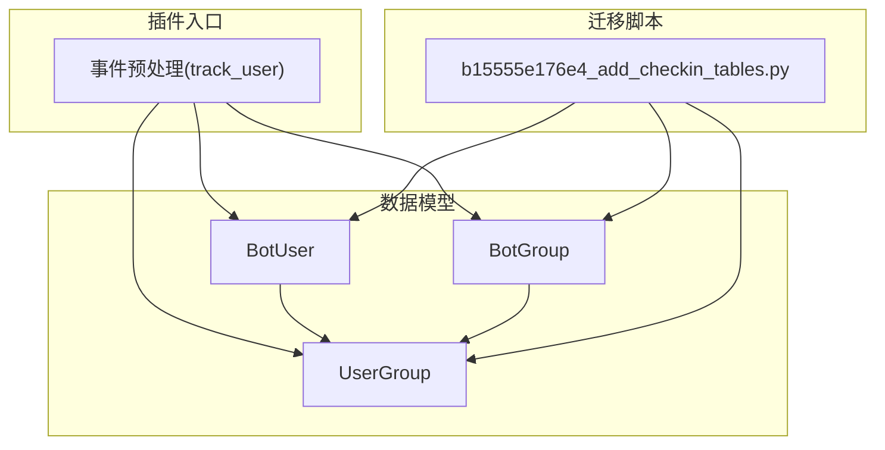
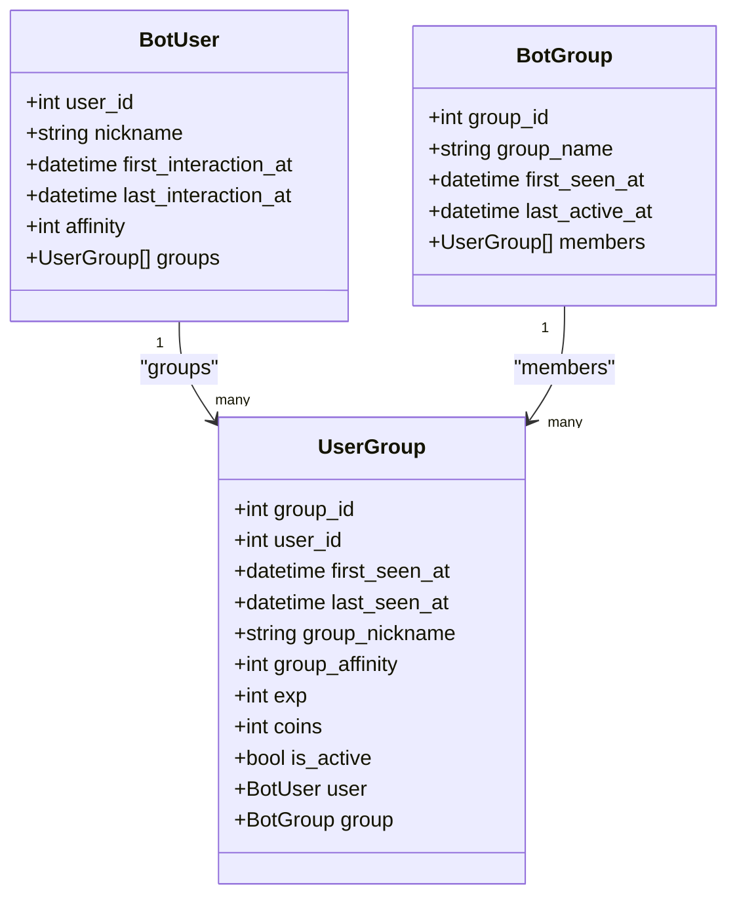
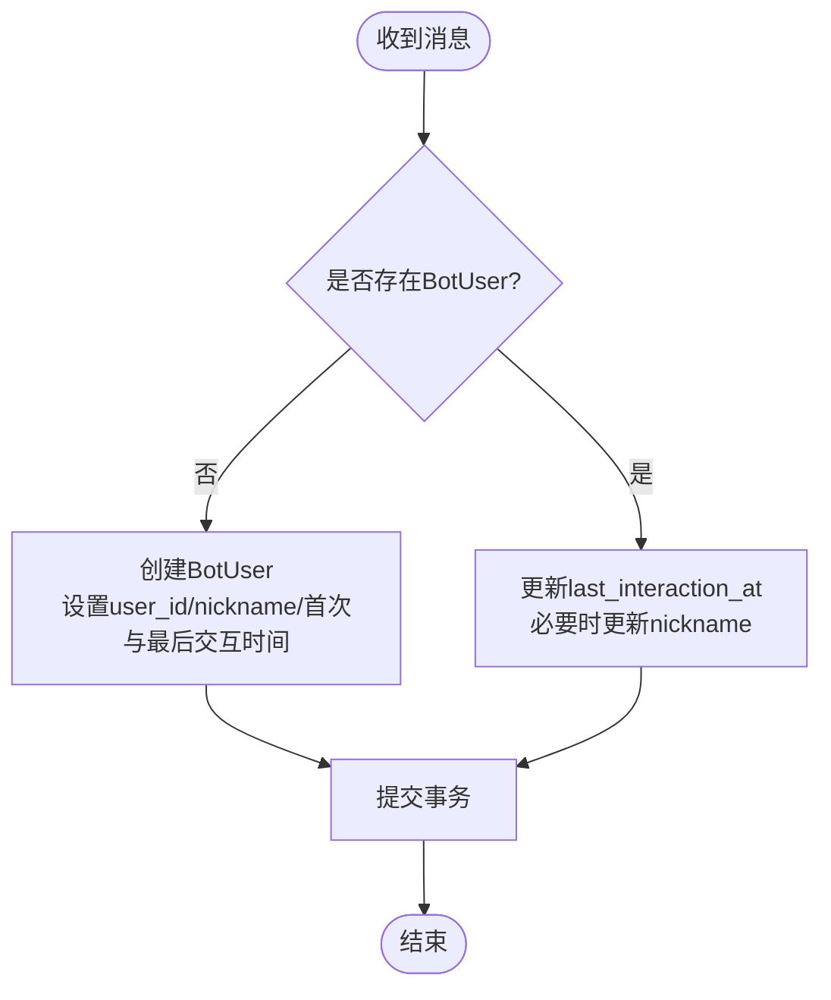
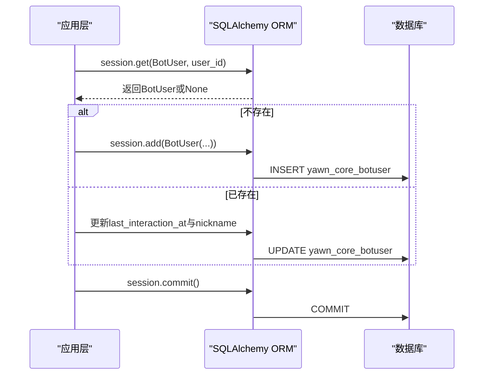
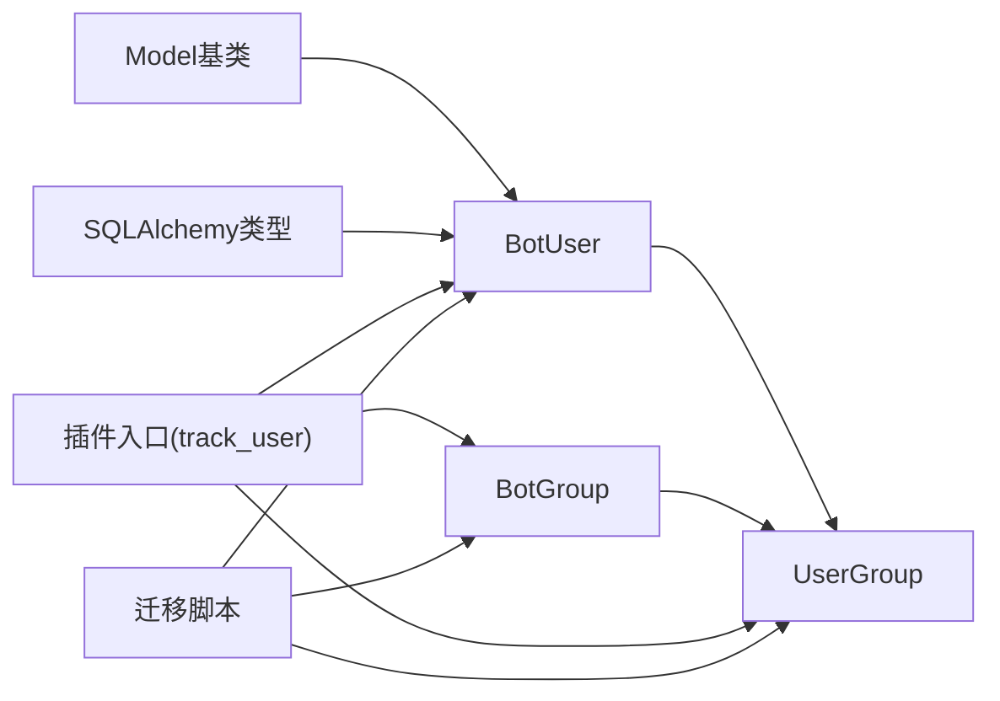

# BotUser用户模型

<cite>
**本文引用的文件**   
- [bot_user.py](file://src/plugins/yawn_core/data_models/bot_user.py)
- [user_group.py](file://src/plugins/yawn_core/data_models/user_group.py)
- [bot_group.py](file://src/plugins/yawn_core/data_models/bot_group.py)
- [__init__.py（插件入口）](file://src/plugins/yawn_core/__init__.py)
- [b15555e176e4_add_checkin_tables.py（数据库迁移）](file://data\nonebot_plugin_orm\migrations\yawn_core\b15555e176e4_add_checkin_tables.py)
</cite>

## 目录
1. [简介](#简介)
2. [项目结构](#项目结构)
3. [核心组件](#核心组件)
4. [架构总览](#架构总览)
5. [详细组件分析](#详细组件分析)
6. [依赖关系分析](#依赖关系分析)
7. [性能考虑](#性能考虑)
8. [故障排查指南](#故障排查指南)
9. [结论](#结论)
10. [附录：ORM使用示例与常见查询模式](#附录orm使用示例与常见查询模式)

## 简介
本文件为BotUser用户模型的详细数据模型文档。BotUser表示Bot认识的全局QQ用户实体，承载用户主键、昵称、首次交互时间、最后交互时间与全局好感度等关键信息，并与用户-群关系表UserGroup建立一对多关联，支持级联删除策略。本文档将系统阐述字段定义、约束、生命周期管理（新用户注册、交互时间追踪、好感度计算）、与UserGroup的关系映射及级联删除策略，并提供SQLAlchemy ORM使用示例与常见查询模式，以及数据验证规则与业务约束说明。

## 项目结构
YawnBot插件的数据模型位于src/plugins/yawn_core/data_models目录下，其中BotUser与UserGroup、BotGroup共同构成“用户-群”基础关系；插件入口在src/plugins/yawn_core/__init__.py中实现事件预处理，负责自动创建/更新BotUser、BotGroup与UserGroup记录；数据库迁移脚本位于data\nonebot_plugin_orm\migrations\yawn_core下，定义了yawn_core_botuser、yawn_core_usergroup、yawn_core_botgroup等表的DDL。

图表来源
- [bot_user.py:12-32](file://src/plugins/yawn_core/data_models/bot_user.py#L12-L32)
- [user_group.py:15-61](file://src/plugins/yawn_core/data_models/user_group.py#L15-L61)
- [bot_group.py:12-29](file://src/plugins/yawn_core/data_models/bot_group.py#L12-L29)
- [__init__.py（插件入口）:16-80](file://src/plugins/yawn_core/__init__.py#L16-L80)
- [b15555e176e4_add_checkin_tables.py:34-57](file://data\nonebot_plugin_orm\migrations\yawn_core\b15555e176e4_add_checkin_tables.py#L34-L57)

章节来源
- [bot_user.py:12-32](file://src/plugins/yawn_core/data_models/bot_user.py#L12-L32)
- [user_group.py:15-61](file://src/plugins/yawn_core/data_models/user_group.py#L15-L61)
- [bot_group.py:12-29](file://src/plugins/yawn_core/data_models/bot_group.py#L12-L29)
- [__init__.py（插件入口）:16-80](file://src/plugins/yawn_core/__init__.py#L16-L80)
- [b15555e176e4_add_checkin_tables.py:34-57](file://data\nonebot_plugin_orm\migrations\yawn_core\b15555e176e4_add_checkin_tables.py#L34-L57)

## 核心组件
- BotUser：全局用户实体，包含用户ID主键、昵称、首次交互时间、最后交互时间、全局好感度，以及与UserGroup的一对多关系。
- UserGroup：用户与群的关联实体，包含复合主键(group_id, user_id)、首次/最后出现时间、群内昵称、群内好感度、经验值、金币、活跃状态，并反向关联到BotUser与BotGroup。
- BotGroup：全局群实体，包含群ID主键、群名、首次出现时间、最后活跃时间，以及成员列表(UserGroup)。

章节来源
- [bot_user.py:12-32](file://src/plugins/yawn_core/data_models/bot_user.py#L12-L32)
- [user_group.py:15-61](file://src/plugins/yawn_core/data_models/user_group.py#L15-L61)
- [bot_group.py:12-29](file://src/plugins/yawn_core/data_models/bot_group.py#L12-L29)

## 架构总览
BotUser作为全局用户中心，通过UserGroup与BotGroup形成“用户-群”关系图。事件预处理在每次消息到达时自动维护三张表：若用户首次对话则创建BotUser并记录首次交互时间；否则仅更新最后交互时间和昵称；群聊场景下同时确保BotGroup与UserGroup存在并更新时间戳。

图表来源
- [bot_user.py:12-32](file://src/plugins/yawn_core/data_models/bot_user.py#L12-L32)
- [user_group.py:15-61](file://src/plugins/yawn_core/data_models/user_group.py#L15-L61)
- [bot_group.py:12-29](file://src/plugins/yawn_core/data_models/bot_group.py#L12-L29)

## 详细组件分析

### BotUser字段定义与约束
- user_id：BigInteger类型，主键，唯一标识全局用户。
- nickname：String(255)，可空，存储用户昵称或群名片。
- first_interaction_at：DateTime，服务器默认当前时间戳，不可为空，记录首次交互时间。
- last_interaction_at：DateTime，可空，记录最近一次交互时间。
- affinity：Integer，默认0，表示全局好感度。
- groups：与UserGroup的一对多关系，配置了cascade="all, delete-orphan"，当BotUser被删除时，其所有UserGroup记录将被级联删除。

章节来源
- [bot_user.py:12-32](file://src/plugins/yawn_core/data_models/bot_user.py#L12-L32)
- [b15555e176e4_add_checkin_tables.py:34-42](file://data\nonebot_plugin_orm\migrations\yawn_core\b15555e176e4_add_checkin_tables.py#L34-L42)

### 用户生命周期管理
- 新用户注册：当收到消息且会话中不存在该用户时，创建BotUser记录，设置user_id、nickname、first_interaction_at与last_interaction_at均为当前时间。
- 交互时间追踪：若用户已存在，则更新last_interaction_at为当前时间，并在有昵称时同步更新nickname。
- 好感度计算逻辑：当前代码未实现自动计算逻辑，affinity字段保留用于后续扩展（例如基于互动频率、活跃度、群内行为等加权计算）。

图表来源
- [__init__.py（插件入口）:16-80](file://src/plugins/yawn_core/__init__.py#L16-L80)

章节来源
- [__init__.py（插件入口）:16-80](file://src/plugins/yawn_core/__init__.py#L16-L80)

### 与UserGroup的关系映射与级联删除
- 关系方向：BotUser.groups指向UserGroup列表；UserGroup.user反向指向BotUser。
- 级联删除：BotUser的relationship配置了cascade="all, delete-orphan"，删除BotUser时会级联删除其所有UserGroup记录。
- 外键约束：UserGroup.user_id外键引用yawn_core_botuser.user_id，ondelete="CASCADE"，保证数据一致性。

图表来源
- [__init__.py（插件入口）:16-80](file://src/plugins/yawn_core/__init__.py#L16-L80)
- [user_group.py:15-61](file://src/plugins/yawn_core/data_models/user_group.py#L15-L61)
- [bot_user.py:12-32](file://src/plugins/yawn_core/data_models/bot_user.py#L12-L32)

章节来源
- [user_group.py:15-61](file://src/plugins/yawn_core/data_models/user_group.py#L15-L61)
- [bot_user.py:12-32](file://src/plugins/yawn_core/data_models/bot_user.py#L12-L32)
- [b15555e176e4_add_checkin_tables.py:53-55](file://data\nonebot_plugin_orm\migrations\yawn_core\b15555e176e4_add_checkin_tables.py#L53-L55)

## 依赖关系分析
- BotUser依赖nonebot_plugin_orm.Model基类与SQLAlchemy类型定义。
- UserGroup依赖BotUser与BotGroup的外键关系，并通过relationship进行双向导航。
- 插件入口track_user依赖BotUser、BotGroup、UserGroup三类模型，在消息事件中统一维护三者状态。
- 迁移脚本定义了yawn_core_botuser、yawn_core_usergroup、yawn_core_botgroup三张表的结构与外键约束。

图表来源
- [bot_user.py:12-32](file://src/plugins/yawn_core/data_models/bot_user.py#L12-L32)
- [user_group.py:15-61](file://src/plugins/yawn_core/data_models/user_group.py#L15-L61)
- [bot_group.py:12-29](file://src/plugins/yawn_core/data_models/bot_group.py#L12-L29)
- [__init__.py（插件入口）:16-80](file://src/plugins/yawn_core/__init__.py#L16-L80)
- [b15555e176e4_add_checkin_tables.py:34-57](file://data\nonebot_plugin_orm\migrations\yawn_core\b15555e176e4_add_checkin_tables.py#L34-L57)

章节来源
- [bot_user.py:12-32](file://src/plugins/yawn_core/data_models/bot_user.py#L12-L32)
- [user_group.py:15-61](file://src/plugins/yawn_core/data_models/user_group.py#L15-L61)
- [bot_group.py:12-29](file://src/plugins/yawn_core/data_models/bot_group.py#L12-L29)
- [__init__.py（插件入口）:16-80](file://src/plugins/yawn_core/__init__.py#L16-L80)
- [b15555e176e4_add_checkin_tables.py:34-57](file://data\nonebot_plugin_orm\migrations\yawn_core\b15555e176e4_add_checkin_tables.py#L34-L57)

## 性能考虑
- 主键与索引：user_id为主键，天然具备唯一性与快速查找能力；UserGroup的复合主键(group_id, user_id)确保用户-群关系的唯一性。
- 时间戳默认值：first_interaction_at与first_seen_at使用服务器默认时间戳，减少应用层写入开销。
- 批量操作：在高并发场景下，建议对频繁更新的last_interaction_at与last_seen_at采用批处理或异步队列，避免频繁提交事务。
- 关系加载：按需加载UserGroup列表，避免N+1查询问题；可使用joinedload或selectinload优化查询性能。

[本节为通用性能指导，不直接分析具体文件]

## 故障排查指南
- 新用户未创建：检查事件预处理是否执行，确认session.get(BotUser, user_id)返回None后是否正确创建并commit。
- 时间戳未更新：确认last_interaction_at与last_seen_at更新逻辑是否在else分支执行，并确保commit成功。
- 昵称不同步：检查sender.card与sender.nickname提取逻辑，确保nickname非空时更新。
- 级联删除异常：确认UserGroup.user_id外键ondelete="CASCADE"生效，删除BotUser时应自动清理相关UserGroup记录。

章节来源
- [__init__.py（插件入口）:16-80](file://src/plugins/yawn_core/__init__.py#L16-L80)
- [user_group.py:15-61](file://src/plugins/yawn_core/data_models/user_group.py#L15-L61)
- [b15555e176e4_add_checkin_tables.py:53-55](file://data\nonebot_plugin_orm\migrations\yawn_core\b15555e176e4_add_checkin_tables.py#L53-L55)

## 结论
BotUser作为全局用户实体，提供了简洁而强大的用户基础数据模型，配合UserGroup与BotGroup实现了“用户-群”关系管理与级联删除策略。事件预处理机制确保了用户生命周期的自动化维护，包括首次交互记录、交互时间追踪与昵称同步。未来可在affinity字段上扩展好感度计算逻辑，结合互动频率与行为特征提升用户体验。

[本节为总结性内容，不直接分析具体文件]

## 附录：ORM使用示例与常见查询模式
以下示例展示如何使用SQLAlchemy ORM进行常见的CRUD与查询操作（以路径引用代替具体代码）：

- 创建新用户（首次交互）
  - 参考路径：[__init__.py（插件入口）:30-40](file://src/plugins/yawn_core/__init__.py#L30-L40)
- 更新最后交互时间与昵称
  - 参考路径：[__init__.py（插件入口）:41-45](file://src/plugins/yawn_core/__init__.py#L41-L45)
- 查询用户及其群关系
  - 参考路径：[user_group.py:42-49](file://src/plugins/yawn_core/data_models/user_group.py#L42-L49)
- 级联删除用户（删除BotUser时清理UserGroup）
  - 参考路径：[bot_user.py:27-31](file://src/plugins/yawn_core/data_models/bot_user.py#L27-L31)
- 查询某用户在所有群中的活动记录
  - 参考路径：[user_group.py:15-61](file://src/plugins/yawn_core/data_models/user_group.py#L15-L61)
- 查询最近活跃的用户（按last_interaction_at排序）
  - 参考路径：[bot_user.py:19-22](file://src/plugins/yawn_core/data_models/bot_user.py#L19-L22)

[本节提供查询模式指引，不直接展示代码内容]