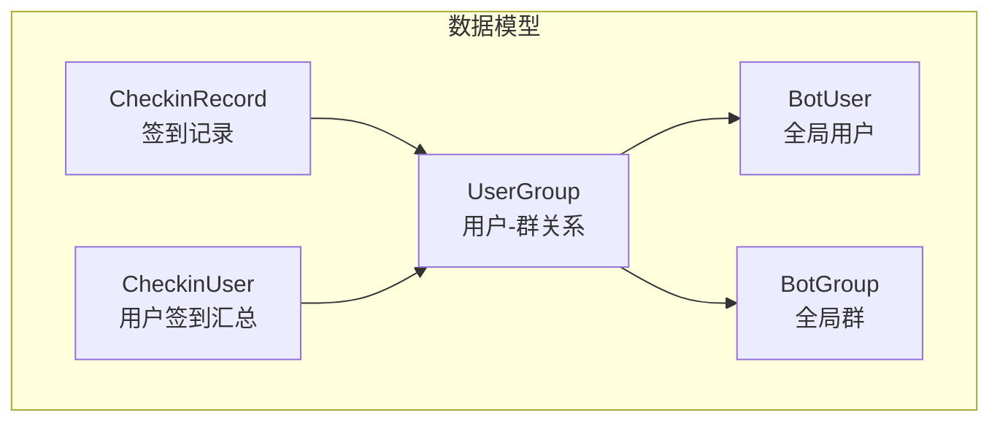
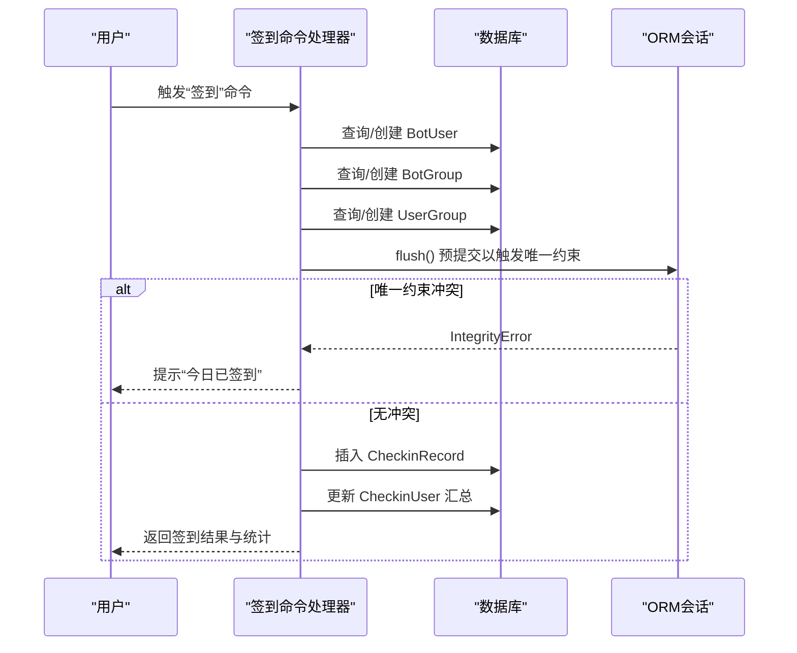
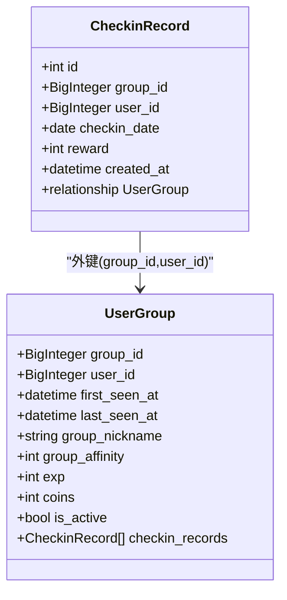
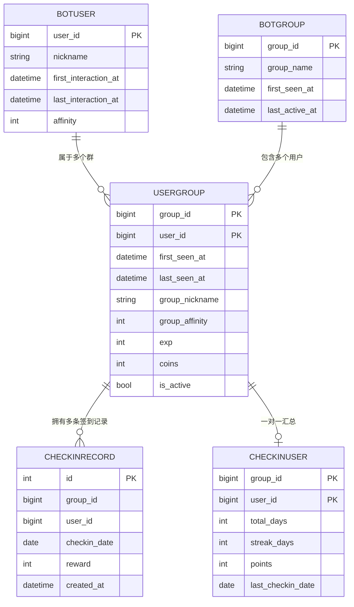
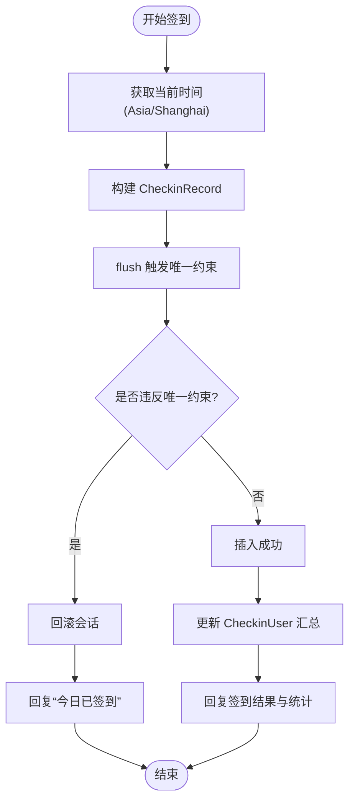
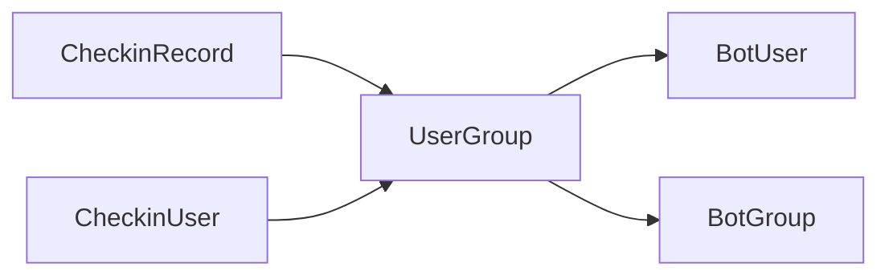

# CheckinRecord签到记录模型

<cite>
**本文引用的文件**   
- [checkin_record.py](file://src/plugins/yawn_core/data_models/checkin_record.py)
- [user_group.py](file://src/plugins/yawn_core/data_models/user_group.py)
- [bot_user.py](file://src/plugins/yawn_core/data_models/bot_user.py)
- [bot_group.py](file://src/plugins/yawn_core/data_models/bot_group.py)
- [checkin_user.py](file://src/plugins/yawn_core/data_models/checkin_user.py)
- [checkin.py](file://src/plugins/yawn_core/checkin.py)
- [c70afa832d5b_add_checkin_tables.py](file://data/nonebot_plugin_orm/migrations/yawn_core/c70afa832d5b_add_checkin_tables.py)
- [b15555e176e4_add_checkin_tables.py](file://data/nonebot_plugin_orm/migrations/yawn_core/b15555e176e4_add_checkin_tables.py)
</cite>

## 目录
1. [简介](#简介)
2. [项目结构](#项目结构)
3. [核心组件](#核心组件)
4. [架构总览](#架构总览)
5. [详细组件分析](#详细组件分析)
6. [依赖关系分析](#依赖关系分析)
7. [性能考虑](#性能考虑)
8. [故障排查指南](#故障排查指南)
9. [结论](#结论)
10. [附录：CRUD与统计查询示例](#附录crud与统计查询示例)

## 简介
本文件围绕 CheckinRecord 签到记录模型，系统性阐述其数据模型设计、字段类型与约束、防重复机制、与 BotUser/BotGroup/UserGroup 的外键关系，以及基于该模型的 CRUD 操作与统计分析方法。文档同时覆盖完整性约束与业务规则验证策略，帮助开发者在实现签到功能时保证数据一致性与可维护性。

## 项目结构
YawnBot 的签到相关代码位于插件 yawn_core 下，数据模型集中在 data_models 目录，迁移脚本位于 data/nonebot_plugin_orm/migrations/yawn_core。CheckinRecord 作为“每次签到的历史记录”实体，与用户-群关系（UserGroup）建立外键关联，并通过唯一约束确保“每人在每个群每天只能签到一次”。

图表来源
- [checkin_record.py:12-53](file://src/plugins/yawn_core/data_models/checkin_record.py#L12-L53)
- [user_group.py:15-61](file://src/plugins/yawn_core/data_models/user_group.py#L15-L61)
- [bot_user.py:12-32](file://src/plugins/yawn_core/data_models/bot_user.py#L12-L32)
- [bot_group.py:12-29](file://src/plugins/yawn_core/data_models/bot_group.py#L12-L29)
- [checkin_user.py:12-47](file://src/plugins/yawn_core/data_models/checkin_user.py#L12-L47)

章节来源
- [checkin_record.py:12-53](file://src/plugins/yawn_core/data_models/checkin_record.py#L12-L53)
- [c70afa832d5b_add_checkin_tables.py:22-46](file://data/nonebot_plugin_orm/migrations/yawn_core/c70afa832d5b_add_checkin_tables.py#L22-L46)
- [b15555e176e4_add_checkin_tables.py:58-78](file://data/nonebot_plugin_orm/migrations/yawn_core/b15555e176e4_add_checkin_tables.py#L58-L78)

## 核心组件
- CheckinRecord：单次签到历史，包含主键 id、group_id、user_id、checkin_date、reward、created_at，以及与 UserGroup 的关系。
- UserGroup：用户与群的关联表，作为 CheckinRecord 的外键目标，提供 group_id + user_id 联合主键。
- BotUser/BotGroup：全局用户与全局群的基础信息表，通过 UserGroup 间接被 CheckinRecord 引用。
- CheckinUser：用户在某群的签到汇总（累计天数、连续天数、积分等），与 UserGroup 一对一关联。

章节来源
- [checkin_record.py:12-53](file://src/plugins/yawn_core/data_models/checkin_record.py#L12-L53)
- [user_group.py:15-61](file://src/plugins/yawn_core/data_models/user_group.py#L15-L61)
- [bot_user.py:12-32](file://src/plugins/yawn_core/data_models/bot_user.py#L12-L32)
- [bot_group.py:12-29](file://src/plugins/yawn_core/data_models/bot_group.py#L12-L29)
- [checkin_user.py:12-47](file://src/plugins/yawn_core/data_models/checkin_user.py#L12-L47)

## 架构总览
CheckinRecord 的存储与访问路径如下：
- 写入路径：命令处理器创建或更新 BotUser/BotGroup/UserGroup，随后插入 CheckinRecord，并更新 CheckinUser 汇总。
- 读取路径：通过 UserGroup 聚合获取 CheckinRecord 列表；通过 CheckinUser 获取汇总指标。
- 约束与一致性：数据库层通过 UniqueConstraint 和 ForeignKeyConstraint 保障“每日一次签到”与“用户-群存在性”。

图表来源
- [checkin.py:41-147](file://src/plugins/yawn_core/checkin.py#L41-L147)
- [checkin_record.py:12-53](file://src/plugins/yawn_core/data_models/checkin_record.py#L12-L53)
- [user_group.py:15-61](file://src/plugins/yawn_core/data_models/user_group.py#L15-L61)
- [checkin_user.py:12-47](file://src/plugins/yawn_core/data_models/checkin_user.py#L12-L47)

## 详细组件分析

### CheckinRecord 实体设计
- 主键：id（自增整数）。
- 外键：group_id、user_id 共同指向 UserGroup(group_id, user_id)，级联删除。
- 唯一性：(group_id, user_id, checkin_date) 唯一约束，确保“每人在每个群每天仅一次签到”。
- 字段说明：
  - group_id：BigInteger，非空。
  - user_id：BigInteger，非空。
  - checkin_date：Date，非空，表示签到日期（按中国时区计算）。
  - reward：Integer，本次签到获得的积分。
  - created_at：DateTime，服务器默认当前时间戳，记录创建时间。
- 关系：与 UserGroup 一对多（一个用户-群组合有多条签到记录）。

图表来源
- [checkin_record.py:12-53](file://src/plugins/yawn_core/data_models/checkin_record.py#L12-L53)
- [user_group.py:15-61](file://src/plugins/yawn_core/data_models/user_group.py#L15-L61)

章节来源
- [checkin_record.py:12-53](file://src/plugins/yawn_core/data_models/checkin_record.py#L12-L53)
- [c70afa832d5b_add_checkin_tables.py:26-36](file://data/nonebot_plugin_orm/migrations/yawn_core/c70afa832d5b_add_checkin_tables.py#L26-L36)
- [b15555e176e4_add_checkin_tables.py:58-78](file://data/nonebot_plugin_orm/migrations/yawn_core/b15555e176e4_add_checkin_tables.py#L58-L78)

### 与 BotUser/BotGroup 的外键关系
- CheckinRecord 不直接外键到 BotUser/BotGroup，而是通过 UserGroup 间接引用，从而将“用户-群”维度作为最小粒度进行签到统计与约束。
- UserGroup 对 BotUser 与 BotGroup 分别建立外键，支持级联删除，保证数据一致性。

图表来源
- [bot_user.py:12-32](file://src/plugins/yawn_core/data_models/bot_user.py#L12-L32)
- [bot_group.py:12-29](file://src/plugins/yawn_core/data_models/bot_group.py#L12-L29)
- [user_group.py:15-61](file://src/plugins/yawn_core/data_models/user_group.py#L15-L61)
- [checkin_record.py:12-53](file://src/plugins/yawn_core/data_models/checkin_record.py#L12-L53)
- [checkin_user.py:12-47](file://src/plugins/yawn_core/data_models/checkin_user.py#L12-L47)

### 防重复机制与唯一性约束
- 数据库层唯一约束：(group_id, user_id, checkin_date) 唯一，防止同一用户在同一群同一天多次签到。
- 应用层处理：插入 CheckinRecord 前执行 flush 触发约束检查，捕获 IntegrityError 并回滚，返回友好提示。
- 时区策略：签到日期按 Asia/Shanghai 计算，避免跨时区导致的重复判定偏差。

图表来源
- [checkin.py:41-147](file://src/plugins/yawn_core/checkin.py#L41-L147)
- [checkin_record.py:15-29](file://src/plugins/yawn_core/data_models/checkin_record.py#L15-L29)

章节来源
- [checkin.py:41-147](file://src/plugins/yawn_core/checkin.py#L41-L147)
- [checkin_record.py:15-29](file://src/plugins/yawn_core/data_models/checkin_record.py#L15-L29)

### 业务规则与完整性约束
- 业务规则：
  - 每人每群每天仅能签到一次。
  - 签到奖励为随机值（例如 5~15 积分），由命令处理器生成。
  - 连续签到天数根据上次签到日期判断，断档则重置为 1。
- 完整性约束：
  - CheckinRecord 外键指向 UserGroup，确保 group_id/user_id 有效且存在。
  - CheckinUser 外键同样指向 UserGroup，保证汇总数据与关系表一致。
  - created_at 默认当前时间戳，便于审计与排序。

章节来源
- [checkin.py:41-147](file://src/plugins/yawn_core/checkin.py#L41-L147)
- [checkin_record.py:12-53](file://src/plugins/yawn_core/data_models/checkin_record.py#L12-L53)
- [checkin_user.py:12-47](file://src/plugins/yawn_core/data_models/checkin_user.py#L12-L47)

## 依赖关系分析
- CheckinRecord 依赖 UserGroup 的联合主键 (group_id, user_id)。
- UserGroup 依赖 BotUser 与 BotGroup 的主键，形成三层关联。
- CheckinUser 与 UserGroup 一对一关联，用于汇总统计。
- 迁移脚本确保表结构与约束随版本演进保持一致。

图表来源
- [checkin_record.py:12-53](file://src/plugins/yawn_core/data_models/checkin_record.py#L12-L53)
- [user_group.py:15-61](file://src/plugins/yawn_core/data_models/user_group.py#L15-L61)
- [bot_user.py:12-32](file://src/plugins/yawn_core/data_models/bot_user.py#L12-L32)
- [bot_group.py:12-29](file://src/plugins/yawn_core/data_models/bot_group.py#L12-L29)
- [checkin_user.py:12-47](file://src/plugins/yawn_core/data_models/checkin_user.py#L12-L47)

章节来源
- [c70afa832d5b_add_checkin_tables.py:22-46](file://data/nonebot_plugin_orm/migrations/yawn_core/c70afa832d5b_add_checkin_tables.py#L22-L46)
- [b15555e176e4_add_checkin_tables.py:58-78](file://data/nonebot_plugin_orm/migrations/yawn_core/b15555e176e4_add_checkin_tables.py#L58-L78)

## 性能考虑
- 索引建议：
  - 为 (group_id, user_id, checkin_date) 唯一约束通常会自动生成唯一索引，无需额外索引。
  - 若频繁按日期范围查询，可考虑在 checkin_date 上建立普通索引以提升范围扫描性能。
- 事务与刷新：
  - 使用 session.flush() 提前触发约束检查，减少无效写入。
  - 捕获 IntegrityError 后及时回滚，避免脏数据。
- 批量操作：
  - 统计类查询建议使用聚合函数（COUNT/SUM/AVG）以减少数据传输量。
- 时区一致性：
  - 统一使用 Asia/Shanghai 时区计算日期，避免跨时区导致的数据不一致。

[本节为通用指导，不直接分析具体文件]

## 故障排查指南
- 常见问题：
  - “今日已签到”：唯一约束冲突，检查是否重复提交或时区不一致。
  - 外键错误：UserGroup 不存在，需先创建用户-群关系再插入签到记录。
  - 汇总数据异常：CheckinUser 未正确更新，检查连续签到逻辑与 last_checkin_date 比较。
- 定位方法：
  - 查看日志输出（如签到成功/失败日志）。
  - 检查数据库约束与索引状态。
  - 复现流程并观察 flush 与异常捕获分支。

章节来源
- [checkin.py:109-147](file://src/plugins/yawn_core/checkin.py#L109-L147)
- [checkin_record.py:15-29](file://src/plugins/yawn_core/data_models/checkin_record.py#L15-L29)

## 结论
CheckinRecord 以“用户-群-日期”为核心维度，通过数据库唯一约束与应用层异常处理双重保障签到幂等性。借助 UserGroup 作为中间关系表，既保证了与 BotUser/BotGroup 的一致性，又为统计汇总提供了稳定基础。建议在查询与写入中遵循上述约束与最佳实践，以确保系统稳定性与数据准确性。

[本节为总结性内容，不直接分析具体文件]

## 附录：CRUD与统计查询示例
以下为基于 SQLAlchemy ORM 的常见操作思路（不展示具体代码内容，仅提供路径参考）：

- 创建签到记录（含防重复）
  - 参考：[checkin.py:41-147](file://src/plugins/yawn_core/checkin.py#L41-L147)
  - 步骤要点：
    - 确保 UserGroup 存在（必要时创建）。
    - 构造 CheckinRecord 并 flush，捕获 IntegrityError 处理重复。
    - 更新 CheckinUser 汇总（total_days、streak_days、points、last_checkin_date）。

- 查询签到记录
  - 单用户单群最近 N 天记录：按 group_id、user_id、checkin_date 范围过滤。
  - 用户所有签到记录：按 user_id 过滤，并按 checkin_date 降序。
  - 参考：[checkin_record.py:12-53](file://src/plugins/yawn_core/data_models/checkin_record.py#L12-L53)

- 更新签到记录
  - 一般不建议修改已存在的签到记录，如需修正应通过审计流程与补偿逻辑。
  - 参考：[checkin_record.py:12-53](file://src/plugins/yawn_core/data_models/checkin_record.py#L12-L53)

- 删除签到记录
  - 通常通过级联删除（UserGroup 删除时）清理关联记录。
  - 参考：[user_group.py:15-61](file://src/plugins/yawn_core/data_models/user_group.py#L15-L61)

- 统计分析查询
  - 每日签到人数：按 checkin_date 分组 COUNT(DISTINCT user_id)。
  - 用户连续签到天数：依据 CheckinUser.streak_days 或基于 CheckinRecord 序列计算。
  - 群内积分排行：按 group_id 分组 SUM(points) 或基于 CheckinUser.points 排序。
  - 参考：[checkin_user.py:12-47](file://src/plugins/yawn_core/data_models/checkin_user.py#L12-L47)

章节来源
- [checkin.py:41-147](file://src/plugins/yawn_core/checkin.py#L41-L147)
- [checkin_record.py:12-53](file://src/plugins/yawn_core/data_models/checkin_record.py#L12-L53)
- [checkin_user.py:12-47](file://src/plugins/yawn_core/data_models/checkin_user.py#L12-L47)