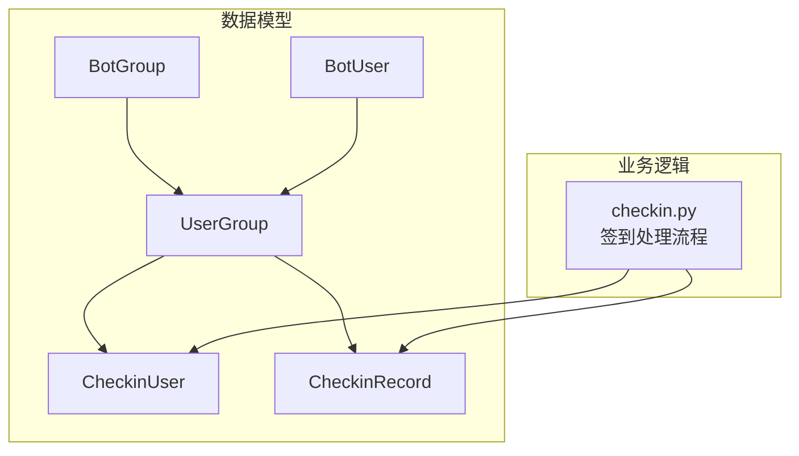
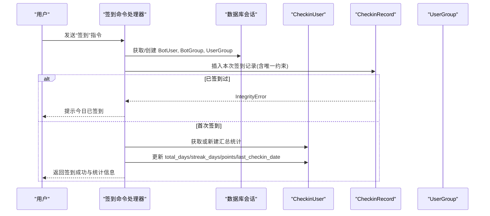
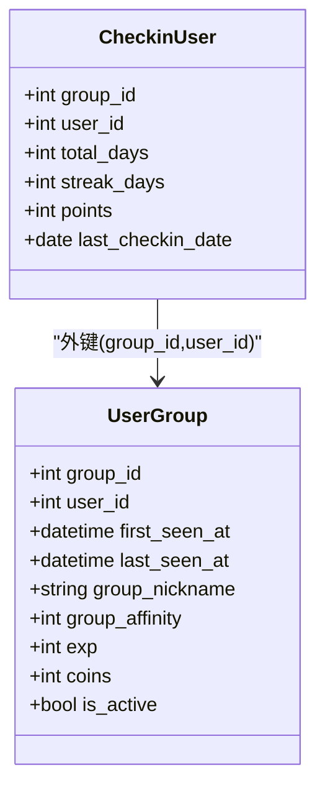
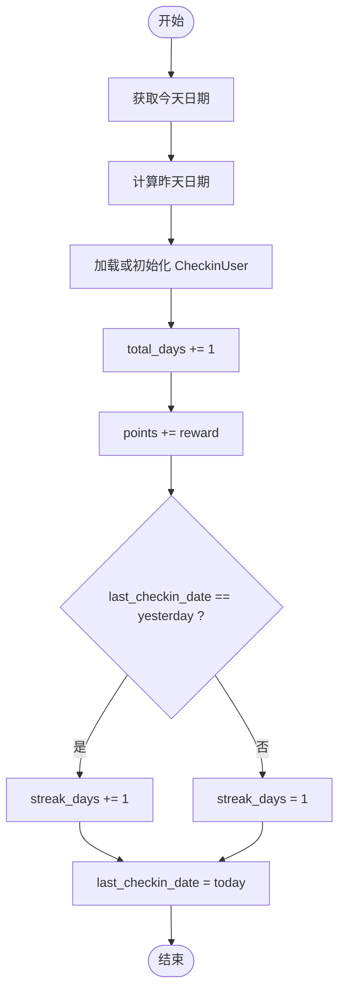
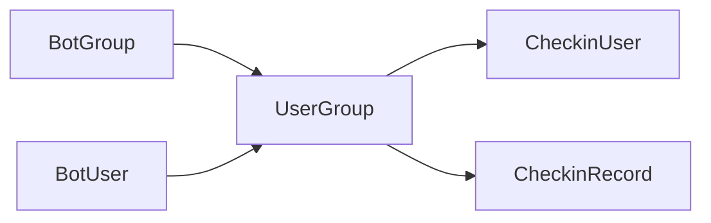

# CheckinUser用户签到统计模型

<cite>
**本文引用的文件**   
- [src/plugins/yawn_core/data_models/checkin_user.py](file://src/plugins/yawn_core/data_models/checkin_user.py)
- [src/plugins/yawn_core/data_models/bot_user.py](file://src/plugins/yawn_core/data_models/bot_user.py)
- [src/plugins/yawn_core/data_models/user_group.py](file://src/plugins/yawn_core/data_models/user_group.py)
- [src/plugins/yawn_core/data_models/bot_group.py](file://src/plugins/yawn_core/data_models/bot_group.py)
- [src/plugins/yawn_core/data_models/checkin_record.py](file://src/plugins/yawn_core/data_models/checkin_record.py)
- [src/plugins/yawn_core/checkin.py](file://src/plugins/yawn_core/checkin.py)
- [data/nonebot_plugin_orm/migrations/yawn_core/c70afa832d5b_add_checkin_tables.py](file://data/nonebot_plugin_orm/migrations/yawn_core/c70afa832d5b_add_checkin_tables.py)
- [data/nonebot_plugin_orm/migrations/yawn_core/b15555e176e4_add_checkin_tables.py](file://data/nonebot_plugin_orm/migrations/yawn_core/b15555e176e4_add_checkin_tables.py)
</cite>

## 目录
1. [简介](#简介)
2. [项目结构](#项目结构)
3. [核心组件](#核心组件)
4. [架构总览](#架构总览)
5. [详细组件分析](#详细组件分析)
6. [依赖关系分析](#依赖关系分析)
7. [性能与准确性保障](#性能与准确性保障)
8. [故障排查指南](#故障排查指南)
9. [结论](#结论)
10. [附录：ORM示例与查询更新策略](#附录orm示例与查询更新策略)

## 简介
本文件围绕 CheckinUser（用户签到统计）数据模型进行系统化说明，涵盖字段类型与约束、与 BotUser 的关系映射、连续签到计算逻辑、统计数据同步机制，以及基于 SQLAlchemy ORM 的查询与更新示例。同时给出数据一致性与性能优化建议，帮助开发者在群内签到场景中正确维护累计签到天数、连续签到天数与积分等统计指标。

## 项目结构
CheckinUser 属于 yawn_core 插件的数据模型层，配合签到业务逻辑模块 checkin.py 完成“记录级”与“汇总级”数据的协同更新。数据库迁移脚本定义了表结构与约束，确保唯一性与外键一致性。

图表来源
- [src/plugins/yawn_core/data_models/bot_group.py:12-29](file://src/plugins/yawn_core/data_models/bot_group.py#L12-L29)
- [src/plugins/yawn_core/data_models/bot_user.py:12-32](file://src/plugins/yawn_core/data_models/bot_user.py#L12-L32)
- [src/plugins/yawn_core/data_models/user_group.py:15-61](file://src/plugins/yawn_core/data_models/user_group.py#L15-L61)
- [src/plugins/yawn_core/data_models/checkin_user.py:12-47](file://src/plugins/yawn_core/data_models/checkin_user.py#L12-L47)
- [src/plugins/yawn_core/data_models/checkin_record.py:12-53](file://src/plugins/yawn_core/data_models/checkin_record.py#L12-L53)
- [src/plugins/yawn_core/checkin.py:41-147](file://src/plugins/yawn_core/checkin.py#L41-L147)

章节来源
- [src/plugins/yawn_core/data_models/checkin_user.py:12-47](file://src/plugins/yawn_core/data_models/checkin_user.py#L12-L47)
- [src/plugins/yawn_core/data_models/checkin_record.py:12-53](file://src/plugins/yawn_core/data_models/checkin_record.py#L12-L53)
- [src/plugins/yawn_core/checkin.py:41-147](file://src/plugins/yawn_core/checkin.py#L41-L147)
- [data/nonebot_plugin_orm/migrations/yawn_core/c70afa832d5b_add_checkin_tables.py:22-47](file://data/nonebot_plugin_orm/migrations/yawn_core/c70afa832d5b_add_checkin_tables.py#L22-L47)
- [data/nonebot_plugin_orm/migrations/yawn_core/b15555e176e4_add_checkin_tables.py:69-78](file://data/nonebot_plugin_orm/migrations/yawn_core/b15555e176e4_add_checkin_tables.py#L69-L78)

## 核心组件
- CheckinUser：用户在某群的签到汇总统计实体，使用 group_id + user_id 联合主键，记录 total_days（累计签到天数）、streak_days（连续签到天数）、points（总积分）、last_checkin_date（最后签到日期）。
- CheckinRecord：每次签到的明细记录，包含 group_id、user_id、checkin_date、reward、created_at，并通过唯一约束保证“每人在每群每天仅能签到一次”。
- UserGroup：用户与群的关系实体，作为 CheckinUser 与 CheckinRecord 的外键目标，提供一对一/一对多关联。
- BotUser/BotGroup：全局用户与全局群的基础信息实体，通过 UserGroup 建立跨域关联。

章节来源
- [src/plugins/yawn_core/data_models/checkin_user.py:12-47](file://src/plugins/yawn_core/data_models/checkin_user.py#L12-L47)
- [src/plugins/yawn_core/data_models/checkin_record.py:12-53](file://src/plugins/yawn_core/data_models/checkin_record.py#L12-L53)
- [src/plugins/yawn_core/data_models/user_group.py:15-61](file://src/plugins/yawn_core/data_models/user_group.py#L15-L61)
- [src/plugins/yawn_core/data_models/bot_user.py:12-32](file://src/plugins/yawn_core/data_models/bot_user.py#L12-L32)
- [src/plugins/yawn_core/data_models/bot_group.py:12-29](file://src/plugins/yawn_core/data_models/bot_group.py#L12-L29)

## 架构总览
CheckinUser 的统计更新由签到命令触发，流程包括：
- 获取当前时间并转换为中国时区日期；
- 创建或更新 BotUser、BotGroup、UserGroup；
- 插入 CheckinRecord 并借助数据库唯一约束防止重复签到；
- 查找或新建 CheckinUser，按规则更新 total_days、streak_days、points、last_checkin_date；
- 返回结果消息。

图表来源
- [src/plugins/yawn_core/checkin.py:41-147](file://src/plugins/yawn_core/checkin.py#L41-L147)
- [src/plugins/yawn_core/data_models/checkin_record.py:12-53](file://src/plugins/yawn_core/data_models/checkin_record.py#L12-L53)
- [src/plugins/yawn_core/data_models/checkin_user.py:12-47](file://src/plugins/yawn_core/data_models/checkin_user.py#L12-L47)
- [src/plugins/yawn_core/data_models/user_group.py:15-61](file://src/plugins/yawn_core/data_models/user_group.py#L15-L61)

## 详细组件分析

### CheckinUser 数据模型
- 主键：group_id + user_id（联合主键），保证同一用户在每个群独立统计。
- 字段与约束：
  - total_days：累计签到天数，整型，默认 0。
  - streak_days：连续签到天数，整型，默认 0。
  - points：总积分，整型，默认 0。
  - last_checkin_date：最后签到日期，可为空。
- 外键约束：对 UserGroup(group_id, user_id) 的外键约束，删除级联。
- 关系：与 UserGroup 一对一（通过 back_populates 配置）。

图表来源
- [src/plugins/yawn_core/data_models/checkin_user.py:12-47](file://src/plugins/yawn_core/data_models/checkin_user.py#L12-L47)
- [src/plugins/yawn_core/data_models/user_group.py:15-61](file://src/plugins/yawn_core/data_models/user_group.py#L15-L61)

章节来源
- [src/plugins/yawn_core/data_models/checkin_user.py:12-47](file://src/plugins/yawn_core/data_models/checkin_user.py#L12-L47)
- [data/nonebot_plugin_orm/migrations/yawn_core/c70afa832d5b_add_checkin_tables.py:37-46](file://data/nonebot_plugin_orm/migrations/yawn_core/c70afa832d5b_add_checkin_tables.py#L37-L46)
- [data/nonebot_plugin_orm/migrations/yawn_core/b15555e176e4_add_checkin_tables.py:69-78](file://data/nonebot_plugin_orm/migrations/yawn_core/b15555e176e4_add_checkin_tables.py#L69-L78)

### CheckinRecord 数据模型
- 主键：自增 id。
- 唯一约束：group_id + user_id + checkin_date，确保“每人每群每天仅签到一次”。
- 字段：group_id、user_id、checkin_date、reward、created_at。
- 外键：对 UserGroup(group_id, user_id) 的外键约束，删除级联。

章节来源
- [src/plugins/yawn_core/data_models/checkin_record.py:12-53](file://src/plugins/yawn_core/data_models/checkin_record.py#L12-L53)
- [data/nonebot_plugin_orm/migrations/yawn_core/c70afa832d5b_add_checkin_tables.py:26-36](file://data/nonebot_plugin_orm/migrations/yawn_core/c70afa832d5b_add_checkin_tables.py#L26-L36)

### 与 BotUser 的关系映射
- CheckinUser 并不直接与 BotUser 建立外键，而是通过 UserGroup 间接关联：
  - CheckinUser → UserGroup（外键 group_id, user_id）
  - UserGroup → BotUser（外键 user_id）
- 因此，CheckinUser 与 BotUser 是“通过 UserGroup 的一对一”关系（在同一 group_id+user_id 维度下）。

章节来源
- [src/plugins/yawn_core/data_models/user_group.py:15-61](file://src/plugins/yawn_core/data_models/user_group.py#L15-L61)
- [src/plugins/yawn_core/data_models/bot_user.py:12-32](file://src/plugins/yawn_core/data_models/bot_user.py#L12-L32)
- [src/plugins/yawn_core/data_models/checkin_user.py:12-47](file://src/plugins/yawn_core/data_models/checkin_user.py#L12-L47)

### 连续签到计算与统计更新策略
- 连续签到判断：若 last_checkin_date 等于昨天，则 streak_days 加 1；否则重置为 1。
- 累计签到：total_days 每次签到加 1。
- 积分累计：points 累加本次 reward（随机 5~15）。
- 最后签到日期：更新为今天。
- 幂等性：通过 CheckinRecord 的唯一约束与异常捕获，避免重复签到导致统计重复。

图表来源
- [src/plugins/yawn_core/checkin.py:115-136](file://src/plugins/yawn_core/checkin.py#L115-L136)

章节来源
- [src/plugins/yawn_core/checkin.py:115-136](file://src/plugins/yawn_core/checkin.py#L115-L136)

## 依赖关系分析
- CheckinUser 依赖 UserGroup 的外键约束，确保统计只存在于有效的用户-群关系中。
- CheckinRecord 同样依赖 UserGroup，且通过唯一约束保证数据一致性。
- UserGroup 作为中心枢纽，连接 BotUser、BotGroup、CheckinUser、CheckinRecord。

图表来源
- [src/plugins/yawn_core/data_models/bot_group.py:12-29](file://src/plugins/yawn_core/data_models/bot_group.py#L12-L29)
- [src/plugins/yawn_core/data_models/bot_user.py:12-32](file://src/plugins/yawn_core/data_models/bot_user.py#L12-L32)
- [src/plugins/yawn_core/data_models/user_group.py:15-61](file://src/plugins/yawn_core/data_models/user_group.py#L15-L61)
- [src/plugins/yawn_core/data_models/checkin_user.py:12-47](file://src/plugins/yawn_core/data_models/checkin_user.py#L12-L47)
- [src/plugins/yawn_core/data_models/checkin_record.py:12-53](file://src/plugins/yawn_core/data_models/checkin_record.py#L12-L53)

章节来源
- [src/plugins/yawn_core/data_models/user_group.py:15-61](file://src/plugins/yawn_core/data_models/user_group.py#L15-L61)
- [src/plugins/yawn_core/data_models/checkin_user.py:12-47](file://src/plugins/yawn_core/data_models/checkin_user.py#L12-L47)
- [src/plugins/yawn_core/data_models/checkin_record.py:12-53](file://src/plugins/yawn_core/data_models/checkin_record.py#L12-L53)

## 性能与准确性保障
- 幂等性与一致性
  - 使用 CheckinRecord 的唯一约束（group_id, user_id, checkin_date）防止重复签到；捕获 IntegrityError 并回滚事务，保证统计不重复。
  - 先 flush 再检查，尽早触发数据库约束校验，减少无效计算。
- 事务与锁
  - 建议在并发场景下对 CheckinUser 的行级更新使用数据库行锁（例如 SELECT ... FOR UPDATE）以避免竞态条件导致的 streak_days 计算错误。
- 索引优化
  - 为 CheckinRecord(group_id, user_id, checkin_date) 建立唯一索引（已由唯一约束实现）。
  - 为 CheckinUser(group_id, user_id) 建立主键索引（已由联合主键实现）。
  - 可按查询热点增加 last_checkin_date 的索引以加速最近签到相关查询。
- 批量与异步
  - 使用 async_scoped_session 提升并发处理能力；必要时将多次写入合并为批量操作。
- 时区与时点
  - 统一使用 Asia/Shanghai 时区计算日期，避免跨时区导致的“昨天/今天”判定偏差。

[本节为通用指导，不直接分析具体文件]

## 故障排查指南
- 重复签到报错
  - 现象：提交 CheckinRecord 时抛出 IntegrityError。
  - 处理：捕获异常后回滚会话并返回“今日已签到”提示。
- 统计不一致
  - 可能原因：并发更新 CheckinUser 未加锁，导致 streak_days 覆盖。
  - 处理：引入行级锁或采用原子更新（如基于 last_checkin_date 的条件更新）。
- 外键约束失败
  - 现象：插入 CheckinUser/CheckinRecord 时报外键错误。
  - 处理：确保 UserGroup 记录存在后再插入统计与记录。

章节来源
- [src/plugins/yawn_core/checkin.py:109-114](file://src/plugins/yawn_core/checkin.py#L109-L114)
- [src/plugins/yawn_core/data_models/checkin_record.py:15-29](file://src/plugins/yawn_core/data_models/checkin_record.py#L15-L29)
- [src/plugins/yawn_core/data_models/checkin_user.py:15-22](file://src/plugins/yawn_core/data_models/checkin_user.py#L15-L22)

## 结论
CheckinUser 通过联合主键与外键约束，结合 CheckinRecord 的唯一约束，构建了稳定可靠的签到统计体系。连续签到逻辑简单明确，易于维护；通过事务、锁与索引等手段可进一步提升准确性与性能。建议在并发环境下完善行级锁与原子更新策略，确保统计数据的强一致性。

[本节为总结性内容，不直接分析具体文件]

## 附录：ORM示例与查询更新策略
以下示例展示如何使用 SQLAlchemy ORM 进行签到统计的查询与更新。为避免泄露实现细节，仅提供路径引用与步骤说明。

- 查询某用户在某群的签到统计
  - 参考路径：[src/plugins/yawn_core/checkin.py:115-121](file://src/plugins/yawn_core/checkin.py#L115-L121)
  - 步骤：根据 group_id 与 user_id 查询 CheckinUser；若不存在则新建并加入会话。
- 插入签到记录并防重
  - 参考路径：[src/plugins/yawn_core/checkin.py:101-114](file://src/plugins/yawn_core/checkin.py#L101-L114)
  - 步骤：构造 CheckinRecord 并 flush；捕获 IntegrityError 表示重复签到。
- 更新连续签到与累计统计
  - 参考路径：[src/plugins/yawn_core/checkin.py:129-136](file://src/plugins/yawn_core/checkin.py#L129-L136)
  - 步骤：比较 last_checkin_date 与 yesterday，决定 streak_days 递增或重置；累计 total_days 与 points，更新 last_checkin_date。
- 事务与回滚
  - 参考路径：[src/plugins/yawn_core/checkin.py:109-114](file://src/plugins/yawn_core/checkin.py#L109-L114)
  - 步骤：发生异常时调用 session.rollback() 恢复状态。

章节来源
- [src/plugins/yawn_core/checkin.py:101-136](file://src/plugins/yawn_core/checkin.py#L101-L136)