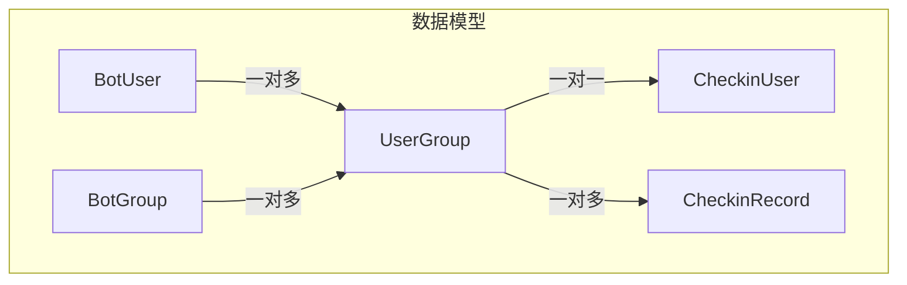
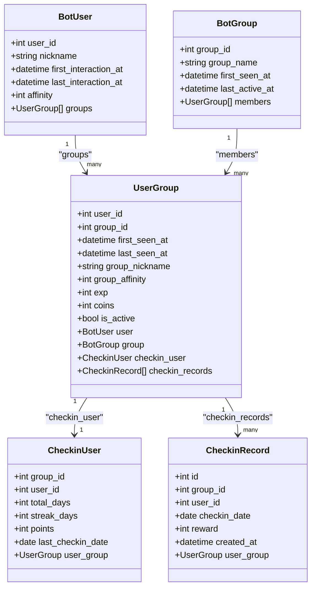
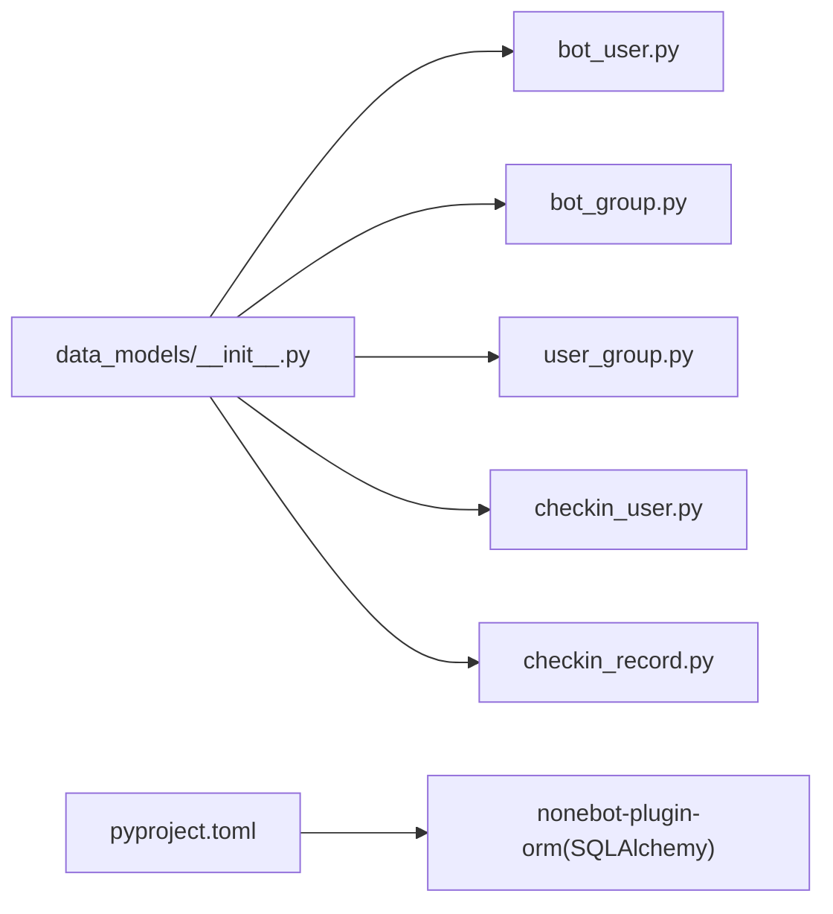
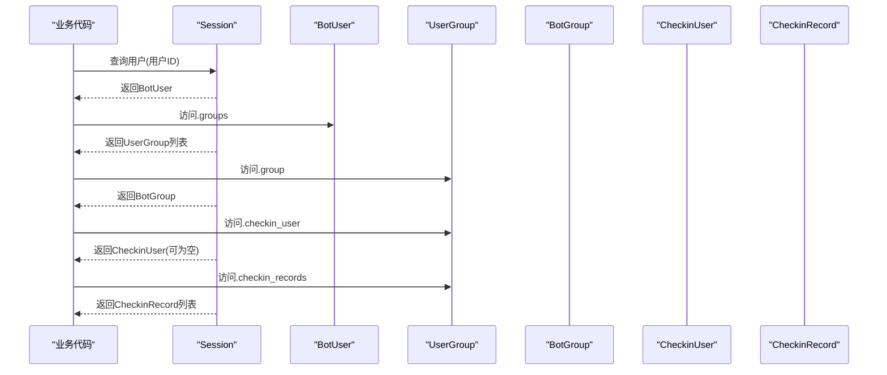

# UserGroup用户群组关系模型

<cite>
**本文引用的文件**   
- [user_group.py](file://src/plugins/yawn_core/data_models/user_group.py)
- [bot_user.py](file://src/plugins/yawn_core/data_models/bot_user.py)
- [bot_group.py](file://src/plugins/yawn_core/data_models/bot_group.py)
- [checkin_user.py](file://src/plugins/yawn_core/data_models/checkin_user.py)
- [checkin_record.py](file://src/plugins/yawn_core/data_models/checkin_record.py)
- [__init__.py](file://src/plugins/yawn_core/data_models/__init__.py)
- [pyproject.toml](file://pyproject.toml)
</cite>

## 目录
1. [简介](#简介)
2. [项目结构](#项目结构)
3. [核心组件](#核心组件)
4. [架构总览](#架构总览)
5. [详细组件分析](#详细组件分析)
6. [依赖分析](#依赖分析)
7. [性能考虑](#性能考虑)
8. [故障排查指南](#故障排查指南)
9. [结论](#结论)
10. [附录：ORM查询示例与业务规则](#附录orm查询示例与业务规则)

## 简介
本文件围绕 UserGroup 用户-群组关联实体，系统性阐述其数据模型设计、多对多关系的实现方式、与 BotUser/BotGroup 的双向映射、以及签到相关扩展关系。文档同时给出基于 SQLAlchemy ORM 的常见查询示例与维护策略，帮助开发者在 YawnBot 插件中高效、正确地使用 user_group 表进行用户与群组的关联管理。

## 项目结构
YawnBot 采用 nonebot2 + nonebot-plugin-orm（SQLAlchemy）的插件化架构。数据模型集中在 src/plugins/yawn_core/data_models 目录下，按实体分文件组织，并通过 __init__.py 统一导出。UserGroup 作为 join 表，连接 BotUser 与 BotGroup，并承载群内用户维度的扩展属性与签到聚合/明细关系。

图表来源
- [bot_user.py:12-32](file://src/plugins/yawn_core/data_models/bot_user.py#L12-L32)
- [bot_group.py:12-29](file://src/plugins/yawn_core/data_models/bot_group.py#L12-L29)
- [user_group.py:15-61](file://src/plugins/yawn_core/data_models/user_group.py#L15-L61)
- [checkin_user.py:12-47](file://src/plugins/yawn_core/data_models/checkin_user.py#L12-L47)
- [checkin_record.py:12-53](file://src/plugins/yawn_core/data_models/checkin_record.py#L12-L53)

章节来源
- [__init__.py:1-14](file://src/plugins/yawn_core/data_models/__init__.py#L1-L14)
- [pyproject.toml:15-16](file://pyproject.toml#L15-L16)

## 核心组件
- BotUser：全局 QQ 用户主实体，包含用户标识、昵称、交互时间戳与全局好感度等字段。
- BotGroup：QQ 群主实体，包含群标识、群名、首次出现时间与最后活跃时间等字段。
- UserGroup：用户与群组的关联实体（join 表），以复合主键 (user_id, group_id) 唯一约束，记录首次/最近出现时间、群内昵称、群内好感度、经验值、金币、是否活跃等扩展属性，并双向关联 BotUser 与 BotGroup。
- CheckinUser：群内用户的签到汇总（聚合）表，与 UserGroup 一对一，记录累计天数、连续天数、积分、最后一次签到日期。
- CheckinRecord：每次签到的明细记录，与 UserGroup 一对多，通过唯一约束保证“同一用户在群内每天仅能签到一次”。

章节来源
- [bot_user.py:12-32](file://src/plugins/yawn_core/data_models/bot_user.py#L12-L32)
- [bot_group.py:12-29](file://src/plugins/yawn_core/data_models/bot_group.py#L12-L29)
- [user_group.py:15-61](file://src/plugins/yawn_core/data_models/user_group.py#L15-L61)
- [checkin_user.py:12-47](file://src/plugins/yawn_core/data_models/checkin_user.py#L12-L47)
- [checkin_record.py:12-53](file://src/plugins/yawn_core/data_models/checkin_record.py#L12-L53)

## 架构总览
UserGroup 作为多对多关系的中间表，承担以下职责：
- 唯一性：通过复合主键 (user_id, group_id) 确保每个用户在每个群只存在一条关联记录。
- 扩展属性：存储群内维度上的用户状态与数值型指标（如 group_affinity、exp、coins、is_active）。
- 审计追踪：记录 first_seen_at、last_seen_at，便于统计用户入群时长与活跃度。
- 级联删除：对外键配置 ondelete="CASCADE"，当用户或群组被删除时，自动清理关联记录，保持数据一致性。
- 关系导航：通过 SQLAlchemy relationship 提供双向导航，简化查询与更新。

图表来源
- [bot_user.py:12-32](file://src/plugins/yawn_core/data_models/bot_user.py#L12-L32)
- [bot_group.py:12-29](file://src/plugins/yawn_core/data_models/bot_group.py#L12-L29)
- [user_group.py:15-61](file://src/plugins/yawn_core/data_models/user_group.py#L15-L61)
- [checkin_user.py:12-47](file://src/plugins/yawn_core/data_models/checkin_user.py#L12-L47)
- [checkin_record.py:12-53](file://src/plugins/yawn_core/data_models/checkin_record.py#L12-L53)

## 详细组件分析

### UserGroup：用户-群组关联实体
- 设计目的
  - 作为 join 表实现 BotUser 与 BotGroup 的多对多关系。
  - 承载群内用户维度的扩展属性与行为统计。
- 复合主键 (user_id, group_id)
  - 保证每个用户在每个群仅有一条关联记录，避免重复。
  - 天然支持按用户或按群的索引优化，提升查询效率。
- 外键与级联
  - 对 yawn_core_botuser.user_id 与 yawn_core_botgroup.group_id 建立外键，ondelete="CASCADE" 保障数据一致性。
- 关系映射
  - 与 BotUser、BotGroup 双向 one-to-many；与 CheckinUser 一对一；与 CheckinRecord 一对多。
- 字段语义
  - first_seen_at/last_seen_at：记录用户在该群的首次与最近出现时间。
  - group_nickname：群内显示的昵称。
  - group_affinity/exp/coins/is_active：群内好感度、经验值、金币、是否活跃等扩展指标。

章节来源
- [user_group.py:15-61](file://src/plugins/yawn_core/data_models/user_group.py#L15-L61)

### BotUser：全局用户实体
- 主键 user_id 为 BigInteger，兼容 QQ 用户 ID。
- 维护首次/最后交互时间、昵称与全局好感度。
- 通过 relationships 指向 UserGroup 列表，形成“一个用户对应多个群”的关系。

章节来源
- [bot_user.py:12-32](file://src/plugins/yawn_core/data_models/bot_user.py#L12-L32)

### BotGroup：群组实体
- 主键 group_id 为 BigInteger，兼容 QQ 群号。
- 维护群名、首次出现时间与最后活跃时间。
- 通过 relationships 指向 UserGroup 列表，形成“一个群拥有多个成员”的关系。

章节来源
- [bot_group.py:12-29](file://src/plugins/yawn_core/data_models/bot_group.py#L12-L29)

### CheckinUser：群内用户签到汇总
- 联合主键 (group_id, user_id) 与 UserGroup 保持一致，确保“同一用户在群内一份汇总”。
- 通过 ForeignKeyConstraint 与 UserGroup 建立强一致的外键约束，ondelete="CASCADE"。
- 字段包括累计天数、连续天数、积分、最后一次签到日期。

章节来源
- [checkin_user.py:12-47](file://src/plugins/yawn_core/data_models/checkin_user.py#L12-L47)

### CheckinRecord：签到明细记录
- 通过 UniqueConstraint 保证“同一用户在群内每天仅签到一次”。
- 通过 ForeignKeyConstraint 与 UserGroup 建立外键约束，ondelete="CASCADE"。
- 字段包括签到日期、本次奖励积分、创建时间。

章节来源
- [checkin_record.py:12-53](file://src/plugins/yawn_core/data_models/checkin_record.py#L12-L53)

## 依赖分析
- 模块内依赖
  - data_models/__init__.py 统一导入 bot_group、bot_user、checkin_record、checkin_user、user_group，供上层按需引用。
- ORM 框架依赖
  - 使用 nonebot-plugin-orm（基于 SQLAlchemy），数据库驱动支持 SQLite（开发默认），生产可切换其他引擎。
- 运行时依赖
  - pyproject.toml 声明 nonebot-plugin-orm[sqlite] 等依赖，确保 ORM 功能可用。

图表来源
- [__init__.py:1-14](file://src/plugins/yawn_core/data_models/__init__.py#L1-L14)
- [pyproject.toml:15-16](file://pyproject.toml#L15-L16)

章节来源
- [__init__.py:1-14](file://src/plugins/yawn_core/data_models/__init__.py#L1-L14)
- [pyproject.toml:15-16](file://pyproject.toml#L15-L16)

## 性能考虑
- 复合主键索引
  - (user_id, group_id) 复合主键天然具备索引能力，适合按用户查群、按群查成员的快速定位。
- 外键与级联
  - ondelete="CASCADE" 减少应用层清理逻辑，但需注意批量删除时的锁竞争与事务开销。
- 查询优化建议
  - 常用查询应优先使用 ORM 的 joinedload/subqueryload 预加载，避免 N+1 问题。
  - 针对高频筛选字段（如 is_active、streak_days）可考虑添加数据库索引（由迁移脚本控制）。
- 写入优化
  - 批量插入 UserGroup/CheckinRecord 时使用 session.bulk_save_objects 或原生 SQL 批量语句，降低往返次数。
- 事务边界
  - 涉及多表写入（如新增用户-群关联并初始化签到汇总）应置于同一事务，保证一致性。

## 故障排查指南
- 外键冲突
  - 删除用户或群组时报外键约束错误：检查是否存在未清理的 UserGroup/CheckinRecord 记录。
- 重复签到
  - 插入 CheckinRecord 失败：确认 UniqueConstraint 是否触发，避免同一天重复签到。
- 空指针/None 访问
  - CheckinUser 可能为空（新用户尚未生成汇总），访问前需判空或使用 backref 安全访问。
- 会话状态异常
  - 长时间运行的任务中注意 session 刷新与关闭，避免 stale state 导致的数据不一致。

章节来源
- [checkin_record.py:15-29](file://src/plugins/yawn_core/data_models/checkin_record.py#L15-L29)
- [checkin_user.py:15-22](file://src/plugins/yawn_core/data_models/checkin_user.py#L15-L22)
- [user_group.py:18-27](file://src/plugins/yawn_core/data_models/user_group.py#L18-L27)

## 结论
UserGroup 作为用户与群组的核心关联实体，通过复合主键与外键约束确保了数据的一致性与完整性，并通过关系映射提供了便捷的 ORM 操作入口。配合 CheckinUser/CheckinRecord 的聚合与明细设计，能够支撑丰富的群内用户行为分析与运营策略。建议在业务侧遵循事务边界、批量写入与预加载等最佳实践，以获得稳定且高效的运行表现。

## 附录：ORM查询示例与业务规则

### 常见查询场景（SQLAlchemy ORM 思路）
- 获取用户所在群组列表
  - 从 BotUser 实例出发，遍历 .groups 获取所有 UserGroup，再关联 .group 得到 BotGroup 详情。
- 获取群组内成员列表
  - 从 BotGroup 实例出发，遍历 .members 获取所有 UserGroup，再关联 .user 得到 BotUser 详情。
- 获取用户在某群的签到汇总
  - 先定位 UserGroup，再读取 .checkin_user（若不存在则按需创建）。
- 获取用户在某群的签到历史
  - 从 UserGroup 读取 .checkin_records，按 checkin_date 排序。

图表来源
- [bot_user.py:27-31](file://src/plugins/yawn_core/data_models/bot_user.py#L27-L31)
- [user_group.py:42-60](file://src/plugins/yawn_core/data_models/user_group.py#L42-L60)
- [checkin_user.py:43-46](file://src/plugins/yawn_core/data_models/checkin_user.py#L43-L46)
- [checkin_record.py:49-52](file://src/plugins/yawn_core/data_models/checkin_record.py#L49-L52)

### 关系数据的维护策略
- 新增用户-群关联
  - 若 UserGroup 不存在则创建，并设置 first_seen_at 为当前时间；更新 last_seen_at。
  - 可选：初始化 CheckinUser 汇总记录（total_days=0, streak_days=0, points=0）。
- 移除用户-群关联
  - 删除 UserGroup 记录，级联删除 CheckinUser 与 CheckinRecord。
- 签到流程
  - 校验当天是否已签到（UniqueConstraint）；成功后插入 CheckinRecord，并更新 CheckinUser 的累计/连续天数与积分。
- 活跃状态维护
  - 根据 last_seen_at 与阈值判断 is_active，定期批处理更新。

### 业务规则
- 唯一性
  - 同一用户在同一群仅允许一条 UserGroup 记录。
  - 同一用户在同一群每天仅允许一条 CheckinRecord。
- 一致性
  - 删除用户或群组时，级联清理关联数据。
  - 签到汇总与明细必须与 UserGroup 保持一致。
- 可扩展性
  - UserGroup 的扩展字段（如 group_affinity、exp、coins）可按业务需要增长，避免频繁变更表结构。