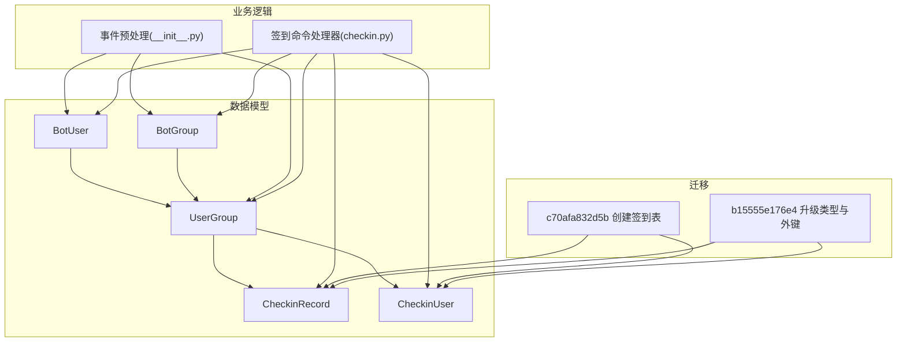
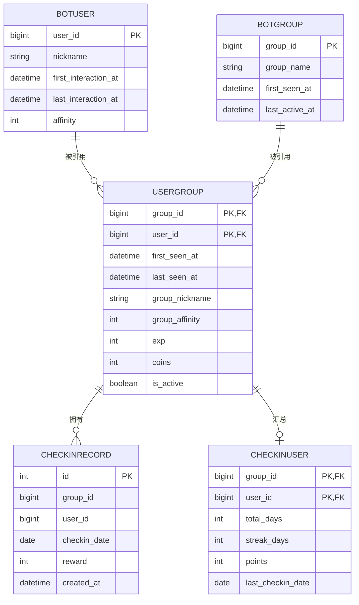
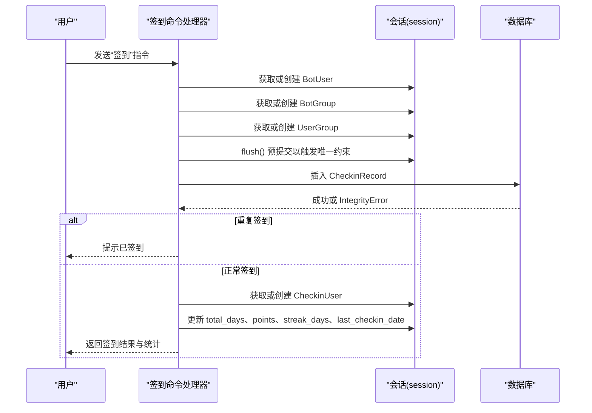
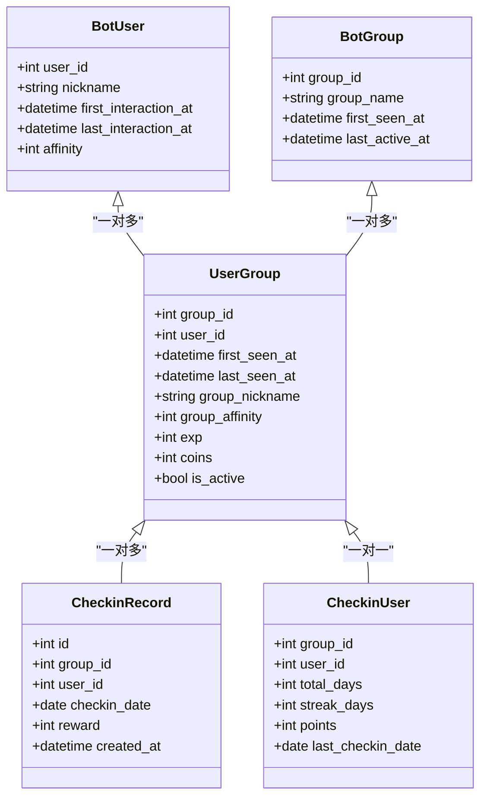

# 数据模型设计

<cite>
**本文引用的文件**   
- [bot_user.py](file://src/plugins/yawn_core/data_models/bot_user.py)
- [bot_group.py](file://src/plugins/yawn_core/data_models/bot_group.py)
- [user_group.py](file://src/plugins/yawn_core/data_models/user_group.py)
- [checkin_record.py](file://src/plugins/yawn_core/data_models/checkin_record.py)
- [checkin_user.py](file://src/plugins/yawn_core/data_models/checkin_user.py)
- [b15555e176e4_add_checkin_tables.py](file://src/plugins/yawn_core/migrations/b15555e176e4_add_checkin_tables.py)
- [c70afa832d5b_add_checkin_tables.py](file://src/plugins/yawn_core/migrations/c70afa832d5b_add_checkin_tables.py)
- [checkin.py](file://src/plugins/yawn_core/checkin.py)
- [__init__.py](file://src/plugins/yawn_core/__init__.py)
</cite>

## 目录
1. [简介](#简介)
2. [项目结构](#项目结构)
3. [核心组件](#核心组件)
4. [架构总览](#架构总览)
5. [详细组件分析](#详细组件分析)
6. [依赖关系分析](#依赖关系分析)
7. [性能考虑](#性能考虑)
8. [故障排查指南](#故障排查指南)
9. [结论](#结论)
10. [附录](#附录)

## 简介
本文件为 YawnBot 的“yawn_core”插件数据模型文档，聚焦以下核心实体：BotUser、BotGroup、UserGroup、CheckinRecord、CheckinUser。内容涵盖实体关系、字段定义与数据类型、主键/外键与约束、数据验证与业务规则、数据库模式图与示例数据、数据访问模式、缓存策略与性能优化、数据生命周期与归档策略、迁移路径与版本管理、数据安全与隐私要求、访问控制等。

## 项目结构
yawn_core 的数据模型位于 data_models 目录下，使用 SQLAlchemy ORM 建模；迁移脚本位于 migrations 目录，采用 Alembic 管理数据库版本演进。签到业务逻辑在 checkin.py 中实现，事件预处理在 __init__.py 中完成用户与群关系的自动初始化。

图表来源
- [bot_user.py:12-32](file://src/plugins/yawn_core/data_models/bot_user.py#L12-L32)
- [bot_group.py:12-29](file://src/plugins/yawn_core/data_models/bot_group.py#L12-L29)
- [user_group.py:15-61](file://src/plugins/yawn_core/data_models/user_group.py#L15-L61)
- [checkin_record.py:12-53](file://src/plugins/yawn_core/data_models/checkin_record.py#L12-L53)
- [checkin_user.py:12-47](file://src/plugins/yawn_core/data_models/checkin_user.py#L12-L47)
- [checkin.py:41-147](file://src/plugins/yawn_core/checkin.py#L41-L147)
- [__init__.py:16-74](file://src/plugins/yawn_core/__init__.py#L16-L74)
- [c70afa832d5b_add_checkin_tables.py:22-47](file://src/plugins/yawn_core/migrations/c70afa832d5b_add_checkin_tables.py#L22-L47)
- [b15555e176e4_add_checkin_tables.py:22-79](file://src/plugins/yawn_core/migrations/b15555e176e4_add_checkin_tables.py#L22-L79)

章节来源
- [bot_user.py:12-32](file://src/plugins/yawn_core/data_models/bot_user.py#L12-L32)
- [bot_group.py:12-29](file://src/plugins/yawn_core/data_models/bot_group.py#L12-L29)
- [user_group.py:15-61](file://src/plugins/yawn_core/data_models/user_group.py#L15-L61)
- [checkin_record.py:12-53](file://src/plugins/yawn_core/data_models/checkin_record.py#L12-L53)
- [checkin_user.py:12-47](file://src/plugins/yawn_core/data_models/checkin_user.py#L12-L47)
- [checkin.py:41-147](file://src/plugins/yawn_core/checkin.py#L41-L147)
- [__init__.py:16-74](file://src/plugins/yawn_core/__init__.py#L16-L74)
- [c70afa832d5b_add_checkin_tables.py:22-47](file://src/plugins/yawn_core/migrations/c70afa832d5b_add_checkin_tables.py#L22-L47)
- [b15555e176e4_add_checkin_tables.py:22-79](file://src/plugins/yawn_core/migrations/b15555e176e4_add_checkin_tables.py#L22-L79)

## 核心组件
- BotUser：记录 Bot 认识的全局 QQ 用户，包含昵称、首次/最后交互时间、全局好感度。
- BotGroup：记录 Bot 认识的 QQ 群，包含群名、首次出现时间、最后活跃时间。
- UserGroup：用户与群的关联关系，包含首次/最后出现时间、群内昵称、群内好感度、经验值、金币、是否活跃等扩展字段。
- CheckinRecord：每次签到的历史记录，包含签到日期、本次奖励积分、创建时间，并通过唯一约束保证每人每天每群仅一次签到。
- CheckinUser：群内用户的签到汇总数据，包含累计天数、连续天数、总积分、最后一次签到日期。

章节来源
- [bot_user.py:12-32](file://src/plugins/yawn_core/data_models/bot_user.py#L12-L32)
- [bot_group.py:12-29](file://src/plugins/yawn_core/data_models/bot_group.py#L12-L29)
- [user_group.py:15-61](file://src/plugins/yawn_core/data_models/user_group.py#L15-L61)
- [checkin_record.py:12-53](file://src/plugins/yawn_core/data_models/checkin_record.py#L12-L53)
- [checkin_user.py:12-47](file://src/plugins/yawn_core/data_models/checkin_user.py#L12-L47)

## 架构总览
下图展示数据模型之间的实体关系（ER）以及关键约束。

图表来源
- [bot_user.py:12-32](file://src/plugins/yawn_core/data_models/bot_user.py#L12-L32)
- [bot_group.py:12-29](file://src/plugins/yawn_core/data_models/bot_group.py#L12-L29)
- [user_group.py:15-61](file://src/plugins/yawn_core/data_models/user_group.py#L15-L61)
- [checkin_record.py:12-53](file://src/plugins/yawn_core/data_models/checkin_record.py#L12-L53)
- [checkin_user.py:12-47](file://src/plugins/yawn_core/data_models/checkin_user.py#L12-L47)

## 详细组件分析

### BotUser
- 主键：user_id（BigInteger）
- 字段说明：
  - nickname：可选字符串，最大长度 255
  - first_interaction_at：首次交互时间，默认当前时间戳
  - last_interaction_at：最后交互时间，可为空
  - affinity：全局好感度，整数，默认 0
- 关系：
  - 与 UserGroup 一对多（级联删除孤儿）
- 业务规则：
  - 首次交互时创建记录并设置首次交互时间
  - 后续交互更新最后交互时间与昵称（若存在）
- 索引与约束：
  - 主键索引 on user_id
- 复杂度与性能：
  - 单表查询 O(1)，按 user_id 检索高效
- 安全与隐私：
  - nickname 属于用户可显示信息，建议脱敏后对外暴露

章节来源
- [bot_user.py:12-32](file://src/plugins/yawn_core/data_models/bot_user.py#L12-L32)
- [__init__.py:16-74](file://src/plugins/yawn_core/__init__.py#L16-L74)

### BotGroup
- 主键：group_id（BigInteger）
- 字段说明：
  - group_name：可选字符串，最大长度 255
  - first_seen_at：首次出现时间，默认当前时间戳
  - last_active_at：最后活跃时间，可为空
- 关系：
  - 与 UserGroup 一对多（级联删除孤儿）
- 业务规则：
  - 首次出现在群中时创建记录
  - 后续活动更新最后活跃时间
- 索引与约束：
  - 主键索引 on group_id
- 复杂度与性能：
  - 单表查询 O(1)，按 group_id 检索高效

章节来源
- [bot_group.py:12-29](file://src/plugins/yawn_core/data_models/bot_group.py#L12-L29)
- [__init__.py:16-74](file://src/plugins/yawn_core/__init__.py#L16-L74)

### UserGroup
- 联合主键：(group_id, user_id)
- 外键：
  - group_id 引用 yawn_core_botgroup.group_id，ondelete=CASCADE
  - user_id 引用 yawn_core_botuser.user_id，ondelete=CASCADE
- 字段说明：
  - first_seen_at：首次出现时间，默认当前时间戳
  - last_seen_at：最后出现时间，可为空
  - group_nickname：群内昵称，可选字符串，最大长度 255
  - group_affinity：群内好感度，整数，默认 0
  - exp：经验值，整数，默认 0
  - coins：金币，整数，默认 0
  - is_active：是否活跃，布尔，默认 True
- 关系：
  - 与 BotUser、BotGroup 双向关联
  - 与 CheckinUser 一对一（级联删除孤儿）
  - 与 CheckinRecord 一对多（级联删除孤儿）
- 业务规则：
  - 首次发言时创建记录并设置首次/最后出现时间
  - 后续发言更新最后出现时间与群内昵称
  - 签到流程中将 is_active 置为 True
- 索引与约束：
  - 联合主键索引 on (group_id, user_id)
  - 外键约束保证参照完整性
- 复杂度与性能：
  - 复合主键查询 O(1)，适合按群+用户维度统计

章节来源
- [user_group.py:15-61](file://src/plugins/yawn_core/data_models/user_group.py#L15-L61)
- [__init__.py:16-74](file://src/plugins/yawn_core/__init__.py#L16-L74)

### CheckinRecord
- 主键：id（自增整数）
- 字段说明：
  - group_id、user_id：BigInteger，用于关联 UserGroup
  - checkin_date：Date，签到日期
  - reward：本次签到获得的积分，整数
  - created_at：记录创建时间，默认当前时间戳
- 约束：
  - 唯一约束 uq_checkin_record_once_per_day：(group_id, user_id, checkin_date) 确保每人每天每群仅一次签到
  - 外键 fk_checkin_record_user_group：(group_id, user_id) 引用 yawn_core_usergroup(group_id, user_id)，ondelete=CASCADE
- 关系：
  - 与 UserGroup 多对一
- 业务规则：
  - 签到时插入一条记录，若重复则触发唯一约束异常
- 索引与约束：
  - 主键索引 on id
  - 唯一索引 on (group_id, user_id, checkin_date)
  - 外键索引 on (group_id, user_id)
- 复杂度与性能：
  - 插入 O(log N) 受唯一约束影响；查询可按日期范围聚合

章节来源
- [checkin_record.py:12-53](file://src/plugins/yawn_core/data_models/checkin_record.py#L12-L53)
- [checkin.py:101-114](file://src/plugins/yawn_core/checkin.py#L101-L114)

### CheckinUser
- 联合主键：(group_id, user_id)
- 外键：
  - (group_id, user_id) 引用 yawn_core_usergroup(group_id, user_id)，ondelete=CASCADE
- 字段说明：
  - total_days：累计签到天数，整数，默认 0
  - streak_days：当前连续签到天数，整数，默认 0
  - points：总积分，整数，默认 0
  - last_checkin_date：最后一次签到日期，可为空
- 关系：
  - 与 UserGroup 一对一
- 业务规则：
  - 每次签到更新 total_days、points、streak_days、last_checkin_date
  - 若上次签到日期为昨天则连续天数加一，否则重置为 1
- 索引与约束：
  - 联合主键索引 on (group_id, user_id)
  - 外键约束保证参照完整性
- 复杂度与性能：
  - 更新 O(1)，适合高频签到场景

章节来源
- [checkin_user.py:12-47](file://src/plugins/yawn_core/data_models/checkin_user.py#L12-L47)
- [checkin.py:115-136](file://src/plugins/yawn_core/checkin.py#L115-L136)

### 签到业务流程时序

图表来源
- [checkin.py:41-147](file://src/plugins/yawn_core/checkin.py#L41-L147)

## 依赖关系分析
- 模型间耦合：
  - UserGroup 同时依赖 BotUser 与 BotGroup，作为中间关联表
  - CheckinRecord 与 CheckinUser 均通过联合外键依赖 UserGroup
- 直接依赖：
  - checkin.py 依赖所有五个模型进行读写
  - __init__.py 的事件预处理依赖 BotUser、BotGroup、UserGroup 进行自动初始化
- 潜在循环依赖：
  - 模型之间通过 TYPE_CHECKING 引入避免运行时循环导入
- 外部依赖：
  - nonebot_plugin_orm.Model 提供基础 ORM 能力
  - SQLAlchemy 负责映射与约束

图表来源
- [bot_user.py:12-32](file://src/plugins/yawn_core/data_models/bot_user.py#L12-L32)
- [bot_group.py:12-29](file://src/plugins/yawn_core/data_models/bot_group.py#L12-L29)
- [user_group.py:15-61](file://src/plugins/yawn_core/data_models/user_group.py#L15-L61)
- [checkin_record.py:12-53](file://src/plugins/yawn_core/data_models/checkin_record.py#L12-L53)
- [checkin_user.py:12-47](file://src/plugins/yawn_core/data_models/checkin_user.py#L12-L47)

章节来源
- [checkin.py:41-147](file://src/plugins/yawn_core/checkin.py#L41-L147)
- [__init__.py:16-74](file://src/plugins/yawn_core/__init__.py#L16-L74)

## 性能考虑
- 索引策略：
  - 主键索引：user_id、group_id、(group_id,user_id)、id
  - 唯一索引：(group_id,user_id,checkin_date) 防止重复签到
  - 外键索引：(group_id,user_id) 提升关联查询与级联删除效率
- 查询模式：
  - 按主键查找 O(1)，适合高频点查
  - 签到统计聚合建议使用分区或物化视图（未来可扩展）
- 写入优化：
  - 使用 session.flush() 提前触发唯一约束检查，减少无效事务
  - 批量操作时可合并多次写入以降低锁竞争
- 缓存策略：
  - 热点数据（如用户/群基本信息）可在应用层做短时内存缓存（TTL），注意一致性
  - 签到汇总（CheckinUser）可结合 Redis 做计数缓存，异步落库
- 并发控制：
  - 唯一约束保证幂等性，避免重复签到
  - 高并发下建议增加重试与退避机制处理短暂冲突

[本节为通用性能指导，不直接分析具体文件]

## 故障排查指南
- 重复签到错误：
  - 现象：插入 CheckinRecord 时抛出 IntegrityError
  - 原因：同一用户在同一群同一天已签到
  - 处理：捕获异常并回滚事务，返回友好提示
- 外键约束失败：
  - 现象：插入或更新涉及 UserGroup 的外键时报错
  - 原因：对应的 BotUser/BotGroup 不存在
  - 处理：先确保基础实体存在或使用 ON DELETE CASCADE 清理
- 会话状态问题：
  - 现象：flush/commit 失败
  - 原因：事务未正确关闭或对象状态不一致
  - 处理：确保每个请求使用独立会话并在结束时提交或回滚

章节来源
- [checkin.py:109-114](file://src/plugins/yawn_core/checkin.py#L109-L114)

## 结论
YawnBot 的 yawn_core 数据模型围绕用户、群与签到功能构建，采用清晰的实体关系与严格的约束保障数据一致性与业务正确性。通过 Alembic 迁移管理版本演进，配合 ORM 与事件预处理实现自动化数据初始化。建议在后续迭代中引入缓存与统计优化，进一步提升高并发下的性能与用户体验。

[本节为总结性内容，不直接分析具体文件]

## 附录

### 数据库模式图（ER）

图表来源
- [bot_user.py:12-32](file://src/plugins/yawn_core/data_models/bot_user.py#L12-L32)
- [bot_group.py:12-29](file://src/plugins/yawn_core/data_models/bot_group.py#L12-L29)
- [user_group.py:15-61](file://src/plugins/yawn_core/data_models/user_group.py#L15-L61)
- [checkin_record.py:12-53](file://src/plugins/yawn_core/data_models/checkin_record.py#L12-L53)
- [checkin_user.py:12-47](file://src/plugins/yawn_core/data_models/checkin_user.py#L12-L47)

### 字段定义与数据类型
- BotUser
  - user_id：BigInteger，主键
  - nickname：String(255)，可选
  - first_interaction_at：DateTime，默认当前时间戳
  - last_interaction_at：DateTime，可选
  - affinity：Integer，默认 0
- BotGroup
  - group_id：BigInteger，主键
  - group_name：String(255)，可选
  - first_seen_at：DateTime，默认当前时间戳
  - last_active_at：DateTime，可选
- UserGroup
  - group_id、user_id：BigInteger，联合主键，外键
  - first_seen_at：DateTime，默认当前时间戳
  - last_seen_at：DateTime，可选
  - group_nickname：String(255)，可选
  - group_affinity：Integer，默认 0
  - exp：Integer，默认 0
  - coins：Integer，默认 0
  - is_active：Boolean，默认 True
- CheckinRecord
  - id：Integer，自增主键
  - group_id、user_id：BigInteger，外键
  - checkin_date：Date
  - reward：Integer
  - created_at：DateTime，默认当前时间戳
- CheckinUser
  - group_id、user_id：BigInteger，联合主键，外键
  - total_days：Integer，默认 0
  - streak_days：Integer，默认 0
  - points：Integer，默认 0
  - last_checkin_date：Date，可选

章节来源
- [bot_user.py:12-32](file://src/plugins/yawn_core/data_models/bot_user.py#L12-L32)
- [bot_group.py:12-29](file://src/plugins/yawn_core/data_models/bot_group.py#L12-L29)
- [user_group.py:15-61](file://src/plugins/yawn_core/data_models/user_group.py#L15-L61)
- [checkin_record.py:12-53](file://src/plugins/yawn_core/data_models/checkin_record.py#L12-L53)
- [checkin_user.py:12-47](file://src/plugins/yawn_core/data_models/checkin_user.py#L12-L47)

### 主键/外键与约束
- 主键
  - BotUser.user_id
  - BotGroup.group_id
  - UserGroup.(group_id, user_id)
  - CheckinRecord.id
  - CheckinUser.(group_id, user_id)
- 外键
  - UserGroup.group_id → BotGroup.group_id，ondelete=CASCADE
  - UserGroup.user_id → BotUser.user_id，ondelete=CASCADE
  - CheckinRecord.(group_id, user_id) → UserGroup.(group_id, user_id)，ondelete=CASCADE
  - CheckinUser.(group_id, user_id) → UserGroup.(group_id, user_id)，ondelete=CASCADE
- 唯一约束
  - CheckinRecord.uq_checkin_record_once_per_day：(group_id, user_id, checkin_date)

章节来源
- [user_group.py:15-61](file://src/plugins/yawn_core/data_models/user_group.py#L15-L61)
- [checkin_record.py:12-53](file://src/plugins/yawn_core/data_models/checkin_record.py#L12-L53)
- [checkin_user.py:12-47](file://src/plugins/yawn_core/data_models/checkin_user.py#L12-L47)

### 数据验证规则与业务规则
- 签到幂等：每人每天每群仅允许一次签到，由唯一约束保障
- 签到统计更新：total_days、points、streak_days、last_checkin_date 随签到更新
- 用户与群初始化：事件预处理自动创建 BotUser、BotGroup、UserGroup，并更新时间戳与昵称
- 活跃度标记：签到时将 UserGroup.is_active 置为 True

章节来源
- [checkin.py:41-147](file://src/plugins/yawn_core/checkin.py#L41-L147)
- [__init__.py:16-74](file://src/plugins/yawn_core/__init__.py#L16-L74)

### 示例数据（示意）
- BotUser：user_id=123456，nickname="测试用户"，affinity=10
- BotGroup：group_id=789012，group_name="测试群"
- UserGroup：group_id=789012，user_id=123456，group_nickname="群名片"，exp=100，coins=50，is_active=True
- CheckinRecord：id=1，group_id=789012，user_id=123456，checkin_date=2026-07-29，reward=12
- CheckinUser：group_id=789012，user_id=123456，total_days=10，streak_days=3，points=120，last_checkin_date=2026-07-29

[本节为概念性示例，不直接分析具体文件]

### 数据访问模式与缓存策略
- 访问模式：
  - 事件预处理：读/写 BotUser、BotGroup、UserGroup
  - 签到命令：读/写全部五张表，优先通过主键与联合主键定位
- 缓存策略：
  - 热点实体（BotUser、BotGroup、UserGroup）可短期缓存
  - CheckinUser 统计可结合 Redis 计数器，定时同步至数据库
- 事务边界：
  - 签到流程在一个会话内完成，flush 前校验唯一约束，成功后 commit

章节来源
- [checkin.py:41-147](file://src/plugins/yawn_core/checkin.py#L41-L147)
- [__init__.py:16-74](file://src/plugins/yawn_core/__init__.py#L16-L74)

### 数据生命周期、保留策略与归档规则
- 生命周期：
  - BotUser/BotGroup/UserGroup：长期保留，随用户/群活跃更新
  - CheckinRecord：历史签到记录，可定期归档到冷存储
  - CheckinUser：持续更新的汇总数据，需保持最新
- 保留策略：
  - 建议对 CheckinRecord 按日期分区，超过一定期限的数据归档
- 归档规则：
  - 按月/季度导出历史签到记录，压缩存储于对象存储

[本节为通用策略，不直接分析具体文件]

### 数据迁移路径与版本管理
- 迁移序列：
  - c70afa832d5b：创建 CheckinRecord 与 CheckinUser 表（初始 INTEGER 类型）
  - b15555e176e4：将 CheckinRecord/CheckinUser 的 group_id/user_id 升级为 BigInteger，并添加外键约束
- 分支标签：
  - c70afa832d5b 标注为 yawn_core 分支起点
- 回滚支持：
  - 两个迁移均提供 downgrade 方法，支持降级

章节来源
- [c70afa832d5b_add_checkin_tables.py:22-47](file://src/plugins/yawn_core/migrations/c70afa832d5b_add_checkin_tables.py#L22-L47)
- [b15555e176e4_add_checkin_tables.py:22-79](file://src/plugins/yawn_core/migrations/b15555e176e4_add_checkin_tables.py#L22-L79)

### 数据安全、隐私要求与访问控制
- 数据安全：
  - 敏感字段（如昵称）仅在必要范围内展示，避免泄露
  - 数据库连接建议使用最小权限账户
- 隐私要求：
  - 遵循平台隐私政策，对用户数据进行最小化处理
  - 日志中避免输出完整用户标识或敏感信息
- 访问控制：
  - ORM 会话基于插件上下文隔离，避免跨请求污染
  - 对外 API 应进行鉴权与限流

[本节为通用安全指导，不直接分析具体文件]