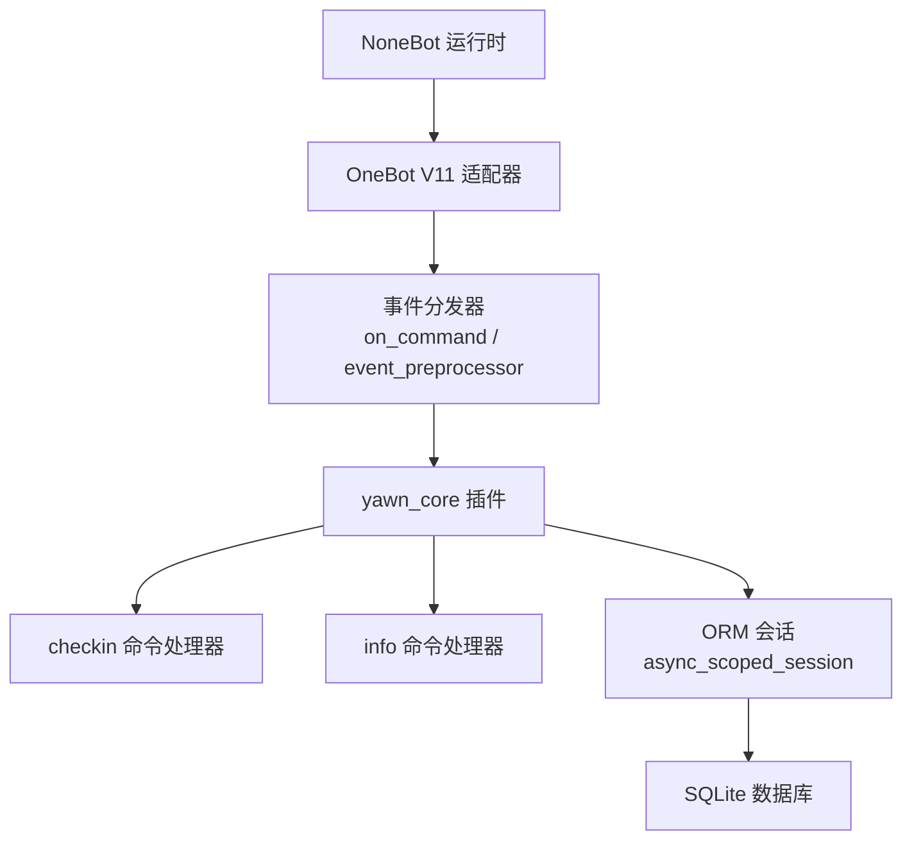
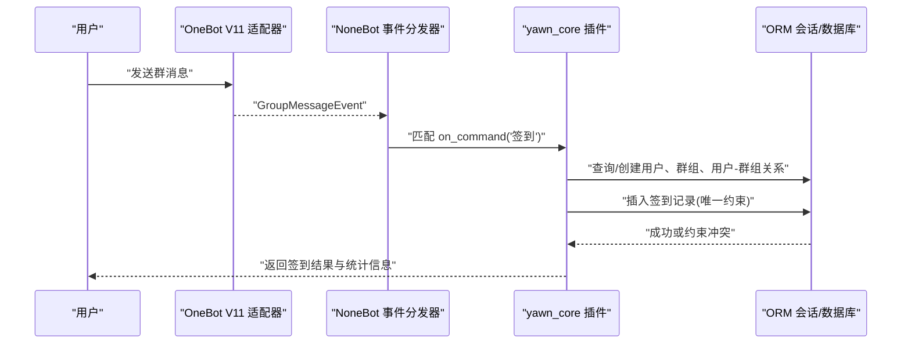
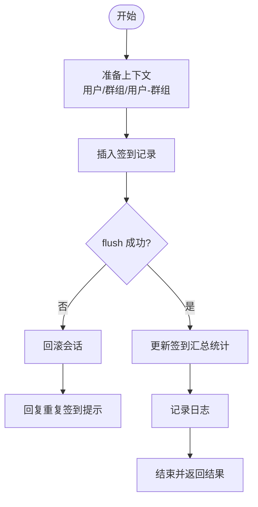
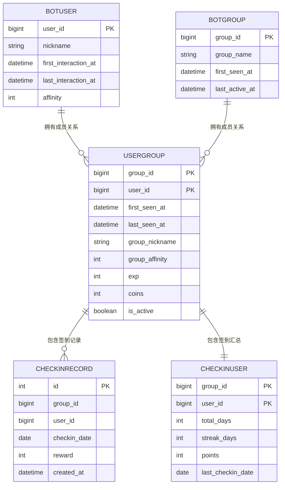

# 事件驱动架构

<cite>
**本文引用的文件**   
- [README.md](file://README.md)
- [pyproject.toml](file://pyproject.toml)
- [__init__.py](file://src/plugins/yawn_core/__init__.py)
- [checkin.py](file://src/plugins/yawn_core/checkin.py)
- [info.py](file://src/plugins/yawn_core/info.py)
- [bot_user.py](file://src/plugins/yawn_core/data_models/bot_user.py)
- [bot_group.py](file://src/plugins/yawn_core/data_models/bot_group.py)
- [user_group.py](file://src/plugins/yawn_core/data_models/user_group.py)
- [checkin_record.py](file://src/plugins/yawn_core/data_models/checkin_record.py)
- [checkin_user.py](file://src/plugins/yawn_core/data_models/checkin_user.py)
- [c70afa832d5b_add_checkin_tables.py](file://data/nonebot_plugin_orm/migrations/yawn_core/c70afa832d5b_add_checkin_tables.py)
</cite>

## 目录
1. [简介](#简介)
2. [项目结构](#项目结构)
3. [核心组件](#核心组件)
4. [架构总览](#架构总览)
5. [详细组件分析](#详细组件分析)
6. [依赖关系分析](#依赖关系分析)
7. [性能考量](#性能考量)
8. [故障排查指南](#故障排查指南)
9. [结论](#结论)
10. [附录：扩展与自定义事件处理器开发指南](#附录扩展与自定义事件处理器开发指南)

## 简介
本技术文档围绕 YawnBot 的事件驱动架构展开，重点说明基于消息事件的异步处理模式、事件预处理器的使用方式、OneBot V11 协议的消息解析与路由机制、用户身份与群组上下文获取、事件处理生命周期、错误处理与日志策略，以及 async/await 并发模型。同时提供事件扩展与自定义事件处理器的开发指南，帮助开发者快速扩展功能并保持系统稳定与可维护性。

## 项目结构
YawnBot 基于 NoneBot2 插件化架构，插件位于 src/plugins 目录下。yawn_core 插件包含签到与信息两个命令处理器，以及一组数据模型用于持久化用户、群组与签到记录。配置文件 pyproject.toml 声明了 OneBot V11 适配器与 ORM 插件等依赖。

图表来源
- [pyproject.toml:25-43](file://pyproject.toml#L25-L43)
- [__init__.py:1-16](file://src/plugins/yawn_core/__init__.py#L1-L16)
- [checkin.py:1-147](file://src/plugins/yawn_core/checkin.py#L1-L147)
- [info.py:1-39](file://src/plugins/yawn_core/info.py#L1-L39)

章节来源
- [README.md:1-13](file://README.md#L1-L13)
- [pyproject.toml:1-123](file://pyproject.toml#L1-L123)

## 核心组件
- 事件与命令处理器
  - on_command：注册命令处理器，匹配消息文本并触发异步处理函数。
  - event_preprocessor：事件预处理器，在事件进入业务逻辑前进行统一处理（如会话注入、权限校验、上下文准备）。
- OneBot V11 适配层
  - GroupMessageEvent：群消息事件对象，包含发送者、群组、消息段等信息。
  - MessageSegment：消息片段，支持文本、@、图片等类型。
- ORM 与数据模型
  - BotUser/BotGroup/UserGroup/CheckinRecord/CheckinUser：定义用户、群组、用户-群组关系、签到记录与汇总的表结构与关系映射。
  - async_scoped_session：线程/协程安全的数据库会话，自动管理事务边界。
- 日志与异常
  - logger：结构化日志输出。
  - IntegrityError/ActionFailed：数据库约束冲突与 OneBot API 调用失败的异常处理。

章节来源
- [__init__.py:1-16](file://src/plugins/yawn_core/__init__.py#L1-L16)
- [checkin.py:1-147](file://src/plugins/yawn_core/checkin.py#L1-L147)
- [info.py:1-39](file://src/plugins/yawn_core/info.py#L1-L39)
- [bot_user.py:1-32](file://src/plugins/yawn_core/data_models/bot_user.py#L1-L32)
- [bot_group.py:1-29](file://src/plugins/yawn_core/data_models/bot_group.py#L1-L29)
- [user_group.py:1-61](file://src/plugins/yawn_core/data_models/user_group.py#L1-L61)
- [checkin_record.py:1-53](file://src/plugins/yawn_core/data_models/checkin_record.py#L1-L53)
- [checkin_user.py:1-47](file://src/plugins/yawn_core/data_models/checkin_user.py#L1-L47)

## 架构总览
YawnBot 的事件流从 OneBot V11 适配器进入 NoneBot 事件分发器，按命令或事件规则路由到 yawn_core 插件的命令处理器。处理器通过 ORM 会话访问数据库，完成用户与群组上下文的初始化、签到记录的写入与统计更新，最终通过 MessageSegment 组装响应消息返回给用户。

图表来源
- [checkin.py:22-26](file://src/plugins/yawn_core/checkin.py#L22-L26)
- [checkin.py:41-147](file://src/plugins/yawn_core/checkin.py#L41-L147)
- [pyproject.toml:29-32](file://pyproject.toml#L29-L32)

## 详细组件分析

### 事件预处理与上下文注入
- 事件预处理器入口：通过 event_preprocessor 装饰器注册，可在事件进入业务逻辑前执行通用逻辑（例如注入数据库会话、校验权限、记录审计日志）。
- 当前插件中已引入 event_preprocessor，可用于后续扩展（如统一鉴权、限流、请求追踪）。

章节来源
- [__init__.py:1-16](file://src/plugins/yawn_core/__init__.py#L1-L16)

### OneBot V11 消息格式解析与路由
- 消息类型识别：GroupMessageEvent 表示群消息，包含 sender.user_id、sender.nickname/card、group_id 等字段。
- 路由机制：on_command("签到") 精确匹配命令文本；info 命令还支持别名集合，提升易用性。
- 消息构建：使用 MessageSegment.text 与 MessageSegment.at 组合富文本回复。

章节来源
- [checkin.py:7-10](file://src/plugins/yawn_core/checkin.py#L7-L10)
- [checkin.py:22-26](file://src/plugins/yawn_core/checkin.py#L22-L26)
- [info.py:1-6](file://src/plugins/yawn_core/info.py#L1-L6)

### 用户身份验证与群组上下文获取
- 用户身份：event.user_id 作为全局用户标识；BotUser 表维护昵称、首次与最后交互时间、好感度等。
- 群组上下文：event.group_id 作为群组标识；BotGroup 表维护群组名称与活跃时间；UserGroup 表维护用户与群组的关系、群内昵称、活跃度与扩展属性。
- 上下文初始化：若用户或群组不存在则自动创建，确保后续操作具备完整上下文。

章节来源
- [checkin.py:54-98](file://src/plugins/yawn_core/checkin.py#L54-L98)
- [bot_user.py:12-32](file://src/plugins/yawn_core/data_models/bot_user.py#L12-L32)
- [bot_group.py:12-29](file://src/plugins/yawn_core/data_models/bot_group.py#L12-L29)
- [user_group.py:15-61](file://src/plugins/yawn_core/data_models/user_group.py#L15-L61)

### 事件处理生命周期与数据库事务
- 生命周期阶段：
  1) 事件到达与命令匹配
  2) 上下文准备（用户/群组/用户-群组）
  3) 业务逻辑执行（签到记录写入、统计更新）
  4) 响应生成与返回
- 事务与一致性：
  - 使用 session.flush() 提前触发唯一约束检查，捕获 IntegrityError 后回滚并友好提示。
  - CheckinRecord 表通过联合唯一约束保证“每群每人每天仅一次签到”。

图表来源
- [checkin.py:99-147](file://src/plugins/yawn_core/checkin.py#L99-L147)
- [checkin_record.py:15-29](file://src/plugins/yawn_core/data_models/checkin_record.py#L15-L29)

章节来源
- [checkin.py:41-147](file://src/plugins/yawn_core/checkin.py#L41-L147)
- [checkin_record.py:1-53](file://src/plugins/yawn_core/data_models/checkin_record.py#L1-53)

### 错误处理与日志策略
- 数据库异常：捕获 IntegrityError，执行回滚并返回“今日已签到”提示，避免脏数据与重复记录。
- OneBot API 异常：捕获 ActionFailed，根据 wording 判断是否文件夹已存在，给出明确反馈。
- 日志记录：关键路径使用 logger.info 输出用户ID、群组ID、积分奖励等关键信息，便于问题定位与审计。

章节来源
- [checkin.py:109-147](file://src/plugins/yawn_core/checkin.py#L109-L147)
- [info.py:31-39](file://src/plugins/yawn_core/info.py#L31-L39)

### 异步编程模型与并发处理
- async/await：所有处理器均为异步函数，配合 NoneBot 的事件循环实现高并发。
- 会话隔离：async_scoped_session 为每个协程提供独立会话，避免跨请求共享状态导致的数据竞争。
- 外部调用：bot.call_api 与 ORM 查询均使用 await，确保非阻塞 I/O。

章节来源
- [checkin.py:41-45](file://src/plugins/yawn_core/checkin.py#L41-L45)
- [info.py:11-19](file://src/plugins/yawn_core/info.py#L11-L19)

## 依赖关系分析
- 运行时依赖：NoneBot2、OneBot V11 适配器、ORM 插件、APScheduler、Sentry、Alconna、HTMLKit 等。
- 插件配置：plugin_dirs 指向 src/plugins，内置 echo 插件；adapters 指定 OneBot V11 模块名。
- 数据模型关系：
  - BotUser 与 UserGroup 一对多
  - BotGroup 与 UserGroup 一对多
  - UserGroup 与 CheckinRecord 一对多
  - UserGroup 与 CheckinUser 一对一

图表来源
- [bot_user.py:12-32](file://src/plugins/yawn_core/data_models/bot_user.py#L12-L32)
- [bot_group.py:12-29](file://src/plugins/yawn_core/data_models/bot_group.py#L12-L29)
- [user_group.py:15-61](file://src/plugins/yawn_core/data_models/user_group.py#L15-L61)
- [checkin_record.py:12-53](file://src/plugins/yawn_core/data_models/checkin_record.py#L12-L53)
- [checkin_user.py:12-47](file://src/plugins/yawn_core/data_models/checkin_user.py#L12-L47)

章节来源
- [pyproject.toml:1-43](file://pyproject.toml#L1-L43)

## 性能考量
- 数据库访问最小化：仅在必要时创建用户/群组/用户-群组关系，减少写放大。
- 唯一约束前置校验：通过 flush 提前触发约束检查，避免无效写入。
- 异步 I/O：全部采用 await 非阻塞调用，提高吞吐。
- 日志粒度控制：关键路径记录必要信息，避免过多 IO 影响性能。
- 连接与会话复用：ORM 插件提供的 scoped_session 自动管理连接池与会话生命周期。

## 故障排查指南
- 重复签到提示：当数据库唯一约束触发时，捕获 IntegrityError 并回滚，返回友好提示。
- OneBot API 失败：捕获 ActionFailed，解析 wording 字段区分“同名文件夹已存在”等场景，给出针对性回复。
- 日志定位：查看 logger.info 输出，确认用户ID、群组ID、奖励值与统计更新是否正确。
- 迁移问题：核对 Alembic 迁移脚本是否执行成功，确保表结构与约束一致。

章节来源
- [checkin.py:109-147](file://src/plugins/yawn_core/checkin.py#L109-L147)
- [info.py:31-39](file://src/plugins/yawn_core/info.py#L31-L39)
- [c70afa832d5b_add_checkin_tables.py:22-56](file://data/nonebot_plugin_orm/migrations/yawn_core/c70afa832d5b_add_checkin_tables.py#L22-L56)

## 结论
YawnBot 的事件驱动架构以 NoneBot2 为核心，结合 OneBot V11 适配器与 ORM 插件，实现了高并发、可扩展的消息事件处理。通过事件预处理器、命令路由、上下文初始化与严格的事务控制，保证了系统的稳定性与数据一致性。开发者可基于现有模式快速扩展新事件与处理器，保持代码清晰与可维护性。

## 附录：扩展与自定义事件处理器开发指南
- 新建命令处理器
  - 使用 on_command 注册命令与别名，设置优先级与阻塞行为。
  - 在 handle 装饰器中编写异步处理函数，接收 GroupMessageEvent 与 async_scoped_session。
- 事件预处理器扩展
  - 在插件 __init__.py 中使用 event_preprocessor 装饰器，实现统一的鉴权、限流、审计与上下文准备。
- 数据模型扩展
  - 新增 Model 类，定义字段、索引与关系映射；通过 Alembic 生成迁移脚本。
- 错误处理与日志
  - 针对数据库与 OneBot API 异常分别捕获，提供清晰的错误提示。
  - 在关键路径记录结构化日志，便于问题定位。
- 并发与性能
  - 使用 async/await 与非阻塞 I/O，避免阻塞事件循环。
  - 合理设计数据库查询与写入，减少锁竞争与长事务。

章节来源
- [checkin.py:22-26](file://src/plugins/yawn_core/checkin.py#L22-L26)
- [checkin.py:41-45](file://src/plugins/yawn_core/checkin.py#L41-L45)
- [__init__.py:1-16](file://src/plugins/yawn_core/__init__.py#L1-L16)
- [c70afa832d5b_add_checkin_tables.py:22-56](file://data/nonebot_plugin_orm/migrations/yawn_core/c70afa832d5b_add_checkin_tables.py#L22-L56)