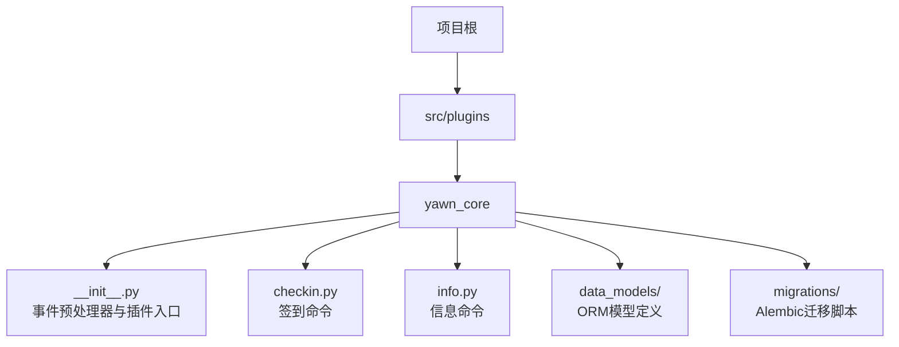
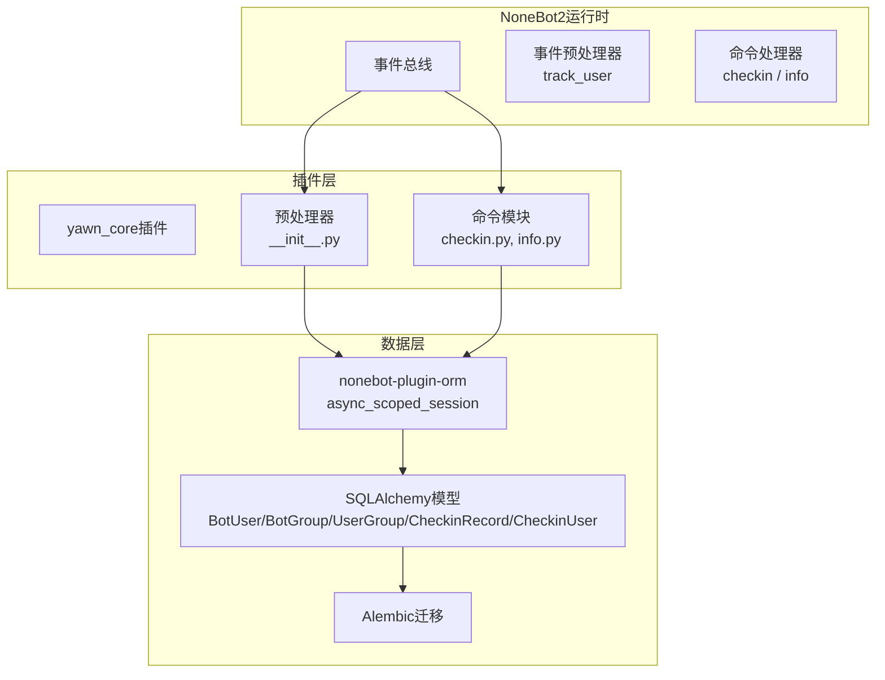
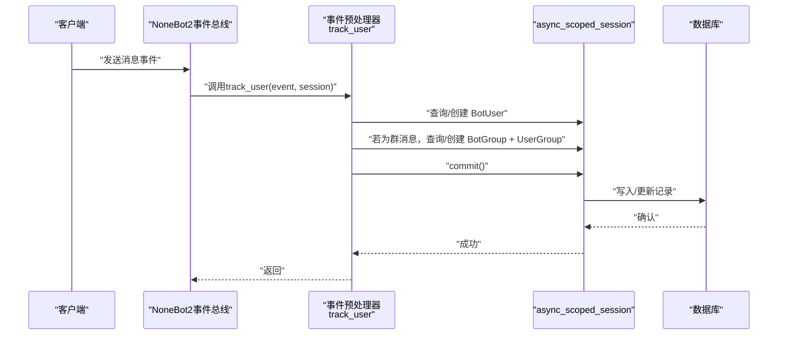
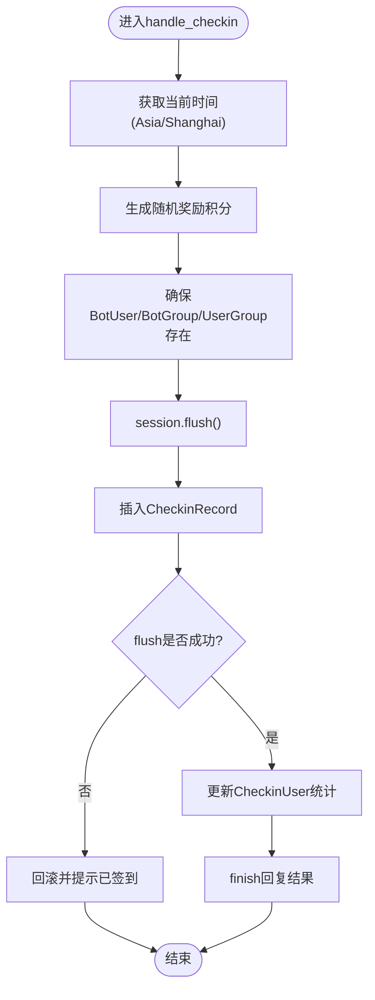
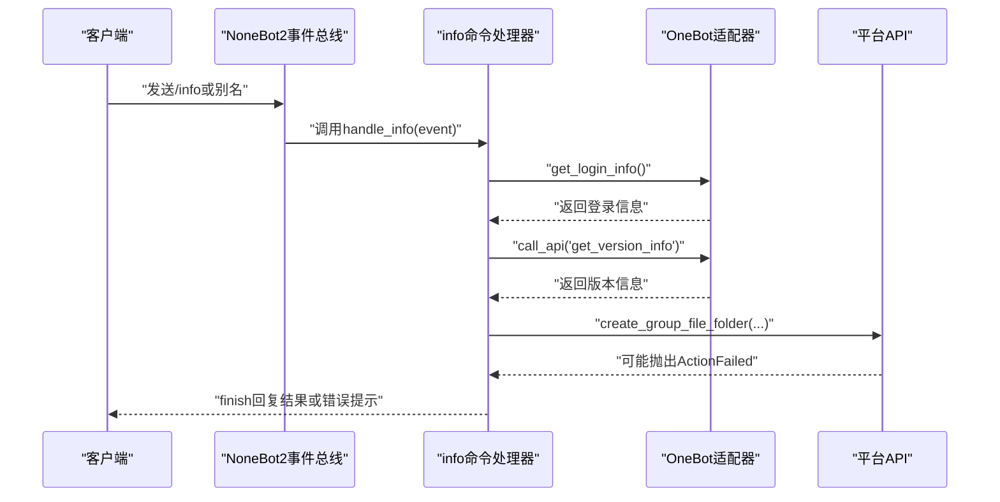
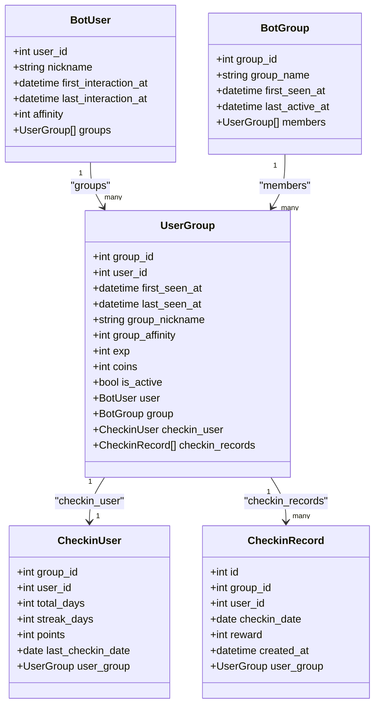
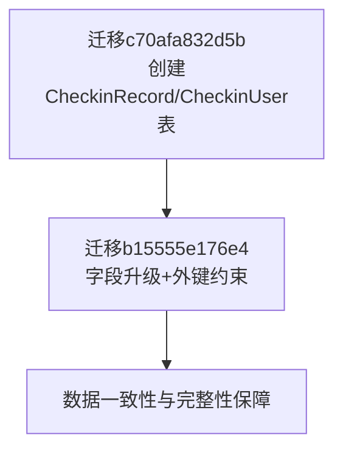
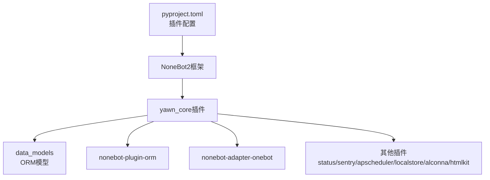

# 插件架构设计

<cite>
**本文引用的文件**   
- [README.md](file://README.md)
- [pyproject.toml](file://pyproject.toml)
- [src/plugins/yawn_core/__init__.py](file://src/plugins/yawn_core/__init__.py)
- [src/plugins/yawn_core/checkin.py](file://src/plugins/yawn_core/checkin.py)
- [src/plugins/yawn_core/info.py](file://src/plugins/yawn_core/info.py)
- [src/plugins/yawn_core/data_models/__init__.py](file://src/plugins/yawn_core/data_models/__init__.py)
- [src/plugins/yawn_core/data_models/bot_user.py](file://src/plugins/yawn_core/data_models/bot_user.py)
- [src/plugins/yawn_core/data_models/bot_group.py](file://src/plugins/yawn_core/data_models/bot_group.py)
- [src/plugins/yawn_core/data_models/user_group.py](file://src/plugins/yawn_core/data_models/user_group.py)
- [src/plugins/yawn_core/data_models/checkin_record.py](file://src/plugins/yawn_core/data_models/checkin_record.py)
- [src/plugins/yawn_core/data_models/checkin_user.py](file://src/plugins/yawn_core/data_models/checkin_user.py)
- [src/plugins/yawn_core/migrations/c70afa832d5b_add_checkin_tables.py](file://src/plugins/yawn_core/migrations/c70afa832d5b_add_checkin_tables.py)
- [src/plugins/yawn_core/migrations/b15555e176e4_add_checkin_tables.py](file://src/plugins/yawn_core/migrations/b15555e176e4_add_checkin_tables.py)
</cite>

## 目录
1. [简介](#简介)
2. [项目结构](#项目结构)
3. [核心组件](#核心组件)
4. [架构总览](#架构总览)
5. [详细组件分析](#详细组件分析)
6. [依赖关系分析](#依赖关系分析)
7. [性能考量](#性能考量)
8. [故障排查指南](#故障排查指南)
9. [结论](#结论)
10. [附录：开发最佳实践与示例](#附录开发最佳实践与示例)

## 简介
本文件面向YawnBot的NoneBot2插件架构，系统性阐述基于NoneBot2的插件化设计模式、插件入口点、模块组织与依赖管理；重点解析事件预处理器的实现原理（track_user的执行流程、会话管理与数据持久化）；记录插件生命周期、配置加载机制与扩展点设计；并提供插件开发最佳实践、性能优化建议以及创建新功能模块和集成第三方服务的具体示例路径。

## 项目结构
YawnBot采用NoneBot2标准插件目录结构，插件位于src/plugins下，每个插件为一个独立子包。yawn_core插件包含：
- 插件入口与事件预处理器：__init__.py
- 功能命令模块：checkin.py、info.py
- ORM数据模型：data_models/
- 数据库迁移：migrations/

**图表来源** 
- [pyproject.toml:25-43](file://pyproject.toml#L25-L43)
- [src/plugins/yawn_core/__init__.py:1-80](file://src/plugins/yawn_core/__init__.py#L1-L80)

**章节来源**
- [README.md:1-13](file://README.md#L1-L13)
- [pyproject.toml:1-43](file://pyproject.toml#L1-L43)

## 核心组件
- 插件入口与事件预处理器：在yawn_core/__init__.py中通过event_preprocessor注册track_user，负责消息事件的统一处理与会话初始化。
- 命令处理器：checkin.py实现“签到”命令；info.py实现“信息”命令。
- ORM数据模型：bot_user、bot_group、user_group、checkin_record、checkin_user等模型定义了用户、群组及签到相关的数据结构与关系。
- 数据库迁移：使用Alembic脚本维护表结构与约束。

**章节来源**
- [src/plugins/yawn_core/__init__.py:16-80](file://src/plugins/yawn_core/__init__.py#L16-L80)
- [src/plugins/yawn_core/checkin.py:22-26](file://src/plugins/yawn_core/checkin.py#L22-L26)
- [src/plugins/yawn_core/info.py:6](file://src/plugins/yawn_core/info.py#L6)
- [src/plugins/yawn_core/data_models/__init__.py:1-9](file://src/plugins/yawn_core/data_models/__init__.py#L1-L9)

## 架构总览
YawnBot基于NoneBot2的事件驱动架构，插件通过on_command注册命令处理器，通过event_preprocessor注册事件预处理器。数据层通过nonebot-plugin-orm提供的async_scoped_session进行异步事务操作，结合SQLAlchemy模型与Alembic迁移完成持久化。

**图表来源** 
- [src/plugins/yawn_core/__init__.py:16-80](file://src/plugins/yawn_core/__init__.py#L16-L80)
- [src/plugins/yawn_core/checkin.py:22-26](file://src/plugins/yawn_core/checkin.py#L22-L26)
- [src/plugins/yawn_core/info.py:6](file://src/plugins/yawn_core/info.py#L6)
- [pyproject.toml:25-43](file://pyproject.toml#L25-L43)

## 详细组件分析

### 事件预处理器 track_user 的实现与执行流程
- 触发条件：仅处理message类型事件。
- 会话管理：通过async_scoped_session注入，保证每次请求的事务隔离。
- 数据持久化：
  - 首次对话用户：创建BotUser并记录首次交互时间。
  - 群聊消息：确保BotGroup与UserGroup存在，更新活跃时间与昵称。
  - 提交事务：session.commit()确保变更落库。

**图表来源** 
- [src/plugins/yawn_core/__init__.py:16-80](file://src/plugins/yawn_core/__init__.py#L16-L80)

**章节来源**
- [src/plugins/yawn_core/__init__.py:16-80](file://src/plugins/yawn_core/__init__.py#L16-L80)

### 签到命令 checkin 的处理流程
- 命令注册：on_command("签到", priority=5, block=True)。
- 时区处理：使用Asia/Shanghai时区计算日期。
- 业务逻辑：
  - 随机奖励积分（5~15）。
  - 确保BotUser、BotGroup、UserGroup存在并更新活跃时间。
  - 插入CheckinRecord，并通过flush触发唯一约束检查，避免重复签到。
  - 更新CheckinUser累计天数、连续天数与积分。
- 响应输出：构造MessageSegment.at与统计信息。

**图表来源** 
- [src/plugins/yawn_core/checkin.py:22-26](file://src/plugins/yawn_core/checkin.py#L22-L26)
- [src/plugins/yawn_core/checkin.py:41-147](file://src/plugins/yawn_core/checkin.py#L41-L147)

**章节来源**
- [src/plugins/yawn_core/checkin.py:22-26](file://src/plugins/yawn_core/checkin.py#L22-L26)
- [src/plugins/yawn_core/checkin.py:41-147](file://src/plugins/yawn_core/checkin.py#L41-L147)

### 信息命令 info 的处理流程
- 命令注册：on_command("info", aliases={"个人信息","我的信息","用户信息"}, priority=5, block=True)。
- 功能要点：
  - 获取机器人登录信息与版本信息。
  - 尝试创建群文件夹“调试信息”，处理同名冲突异常。
- 错误处理：捕获ActionFailed并根据wording字段给出友好提示。

**图表来源** 
- [src/plugins/yawn_core/info.py:6](file://src/plugins/yawn_core/info.py#L6)
- [src/plugins/yawn_core/info.py:10-39](file://src/plugins/yawn_core/info.py#L10-L39)

**章节来源**
- [src/plugins/yawn_core/info.py:6](file://src/plugins/yawn_core/info.py#L6)
- [src/plugins/yawn_core/info.py:10-39](file://src/plugins/yawn_core/info.py#L10-L39)

### ORM数据模型与关系
- BotUser：全局用户实体，包含昵称、首次/最后交互时间、好感度，关联UserGroup列表。
- BotGroup：群组实体，包含群名、首次出现时间、最后活跃时间，关联UserGroup列表。
- UserGroup：用户与群组的关系实体，包含群内昵称、活跃度、经验值、金币、状态，关联CheckinUser与CheckinRecord。
- CheckinRecord：签到历史记录，具有唯一约束（group_id,user_id,checkin_date），外键关联UserGroup。
- CheckinUser：群内用户签到汇总，联合主键(group_id,user_id)，累计天数、连续天数、积分、最后签到日期。

**图表来源** 
- [src/plugins/yawn_core/data_models/bot_user.py:12-32](file://src/plugins/yawn_core/data_models/bot_user.py#L12-L32)
- [src/plugins/yawn_core/data_models/bot_group.py:12-29](file://src/plugins/yawn_core/data_models/bot_group.py#L12-L29)
- [src/plugins/yawn_core/data_models/user_group.py:15-61](file://src/plugins/yawn_core/data_models/user_group.py#L15-L61)
- [src/plugins/yawn_core/data_models/checkin_record.py:12-53](file://src/plugins/yawn_core/data_models/checkin_record.py#L12-L53)
- [src/plugins/yawn_core/data_models/checkin_user.py:12-47](file://src/plugins/yawn_core/data_models/checkin_user.py#L12-L47)

**章节来源**
- [src/plugins/yawn_core/data_models/bot_user.py:12-32](file://src/plugins/yawn_core/data_models/bot_user.py#L12-L32)
- [src/plugins/yawn_core/data_models/bot_group.py:12-29](file://src/plugins/yawn_core/data_models/bot_group.py#L12-L29)
- [src/plugins/yawn_core/data_models/user_group.py:15-61](file://src/plugins/yawn_core/data_models/user_group.py#L15-L61)
- [src/plugins/yawn_core/data_models/checkin_record.py:12-53](file://src/plugins/yawn_core/data_models/checkin_record.py#L12-L53)
- [src/plugins/yawn_core/data_models/checkin_user.py:12-47](file://src/plugins/yawn_core/data_models/checkin_user.py#L12-L47)

### 数据库迁移与约束
- c70afa832d5b：创建CheckinRecord与CheckinUser表，设置唯一约束与主键。
- b15555e176e4：升级字段类型为BigInteger，添加外键约束到UserGroup，确保数据一致性。

**图表来源** 
- [src/plugins/yawn_core/migrations/c70afa832d5b_add_checkin_tables.py:22-46](file://src/plugins/yawn_core/migrations/c70afa832d5b_add_checkin_tables.py#L22-L46)
- [src/plugins/yawn_core/migrations/b15555e176e4_add_checkin_tables.py:22-78](file://src/plugins/yawn_core/migrations/b15555e176e4_add_checkin_tables.py#L22-L78)

**章节来源**
- [src/plugins/yawn_core/migrations/c70afa832d5b_add_checkin_tables.py:22-46](file://src/plugins/yawn_core/migrations/c70afa832d5b_add_checkin_tables.py#L22-L46)
- [src/plugins/yawn_core/migrations/b15555e176e4_add_checkin_tables.py:22-78](file://src/plugins/yawn_core/migrations/b15555e176e4_add_checkin_tables.py#L22-L78)

## 依赖关系分析
- 插件发现与加载：pyproject.toml中配置plugin_dirs为src/plugins，nonebot自动扫描并加载插件。
- 插件依赖：nonebot-plugin-orm提供ORM能力；nonebot-adapter-onebot提供OneBot V11适配；其他插件如status、sentry、apscheduler、localstore、alconna、htmlkit按需启用。
- 内部依赖：checkin.py与info.py依赖data_models中的ORM模型；__init__.py作为插件入口导入各模块。

**图表来源** 
- [pyproject.toml:25-43](file://pyproject.toml#L25-L43)
- [src/plugins/yawn_core/__init__.py:1-13](file://src/plugins/yawn_core/__init__.py#L1-L13)

**章节来源**
- [pyproject.toml:25-43](file://pyproject.toml#L25-L43)
- [src/plugins/yawn_core/__init__.py:1-13](file://src/plugins/yawn_core/__init__.py#L1-L13)

## 性能考量
- 事件预处理器最小化IO：track_user仅在必要时创建或更新记录，减少不必要的数据库写入。
- 事务边界清晰：checkin中使用flush提前触发唯一约束检查，失败则快速回滚，避免长事务。
- 时区与随机数：使用ZoneInfo与randint控制时间与奖励范围，避免复杂计算。
- 连接复用：async_scoped_session由框架管理，避免频繁建立连接。
- 日志级别合理：关键路径记录INFO日志，便于监控与排错。

[本节为通用指导，不直接分析具体文件]

## 故障排查指南
- 重复签到问题：
  - 现象：IntegrityError异常。
  - 处理：捕获后回滚并提示用户已签到。
  - 参考路径：[src/plugins/yawn_core/checkin.py:109-114](file://src/plugins/yawn_core/checkin.py#L109-L114)
- 群文件夹创建失败：
  - 现象：ActionFailed异常，wording包含“同名文件夹已存在”。
  - 处理：判断wording并返回友好提示。
  - 参考路径：[src/plugins/yawn_core/info.py:32-39](file://src/plugins/yawn_core/info.py#L32-L39)
- 新用户首次对话未记录：
  - 检查track_user是否正确拦截message事件并创建BotUser。
  - 参考路径：[src/plugins/yawn_core/__init__.py:18-45](file://src/plugins/yawn_core/__init__.py#L18-L45)

**章节来源**
- [src/plugins/yawn_core/checkin.py:109-114](file://src/plugins/yawn_core/checkin.py#L109-L114)
- [src/plugins/yawn_core/info.py:32-39](file://src/plugins/yawn_core/info.py#L32-L39)
- [src/plugins/yawn_core/__init__.py:18-45](file://src/plugins/yawn_core/__init__.py#L18-L45)

## 结论
YawnBot的yawn_core插件遵循NoneBot2的插件化设计，通过事件预处理器与命令处理器解耦业务逻辑，借助ORM与迁移脚本实现稳健的数据持久化。track_user确保了用户与群组数据的及时维护，checkin与info展示了典型命令处理与第三方API集成的方式。整体架构清晰、可扩展性强，适合进一步扩展更多功能模块。

[本节为总结性内容，不直接分析具体文件]

## 附录：开发最佳实践与示例

### 插件生命周期与配置加载
- 插件发现：在pyproject.toml中配置plugin_dirs与plugins映射，NoneBot启动时自动加载。
- 插件入口：在每个插件的__init__.py中注册事件预处理器与命令处理器。
- 依赖注入：通过async_scoped_session注入数据库会话，避免手动管理连接。

**章节来源**
- [pyproject.toml:25-43](file://pyproject.toml#L25-L43)
- [src/plugins/yawn_core/__init__.py:16-80](file://src/plugins/yawn_core/__init__.py#L16-L80)

### 创建新功能的步骤
- 新建命令模块：在插件目录下新增xxx.py，使用on_command注册命令处理器。
- 定义数据模型：在data_models/中新增Model类，描述数据结构与关系。
- 编写迁移脚本：使用Alembic生成迁移，确保表结构与约束正确。
- 集成第三方服务：通过bot.call_api调用平台API，注意异常处理与重试策略。

**章节来源**
- [src/plugins/yawn_core/checkin.py:22-26](file://src/plugins/yawn_core/checkin.py#L22-L26)
- [src/plugins/yawn_core/data_models/checkin_record.py:12-53](file://src/plugins/yawn_core/data_models/checkin_record.py#L12-L53)
- [src/plugins/yawn_core/migrations/c70afa832d5b_add_checkin_tables.py:22-46](file://src/plugins/yawn_core/migrations/c70afa832d5b_add_checkin_tables.py#L22-L46)

### 集成第三方服务的示例
- OneBot V11 API调用：在info.py中演示了get_login_info与get_version_info的使用。
- 异常处理：捕获ActionFailed并解析wording字段，提供用户友好的反馈。

**章节来源**
- [src/plugins/yawn_core/info.py:10-39](file://src/plugins/yawn_core/info.py#L10-L39)

### 性能优化建议
- 批量操作：对大量写入场景考虑批量insert/update，减少往返次数。
- 索引优化：为高频查询字段添加索引（如user_id、group_id、checkin_date）。
- 缓存热点数据：对不常变化的配置或统计结果使用本地缓存。
- 日志采样：在高并发场景下降低日志级别或采样率。

[本节为通用指导，不直接分析具体文件]