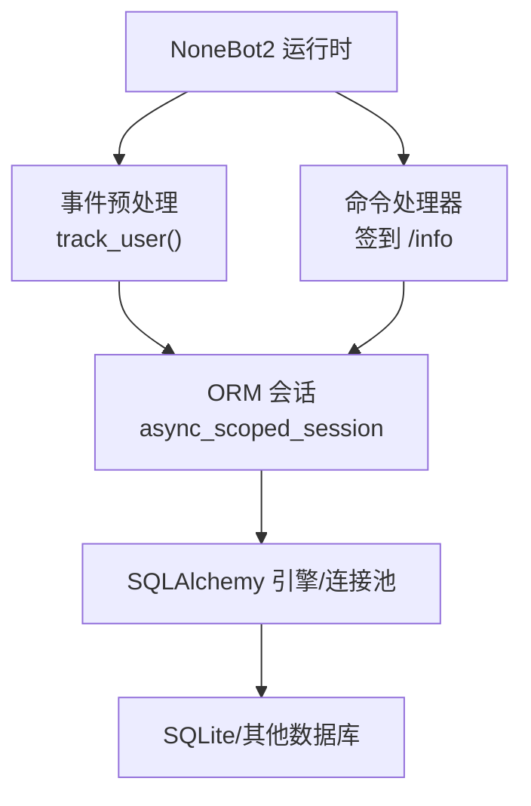
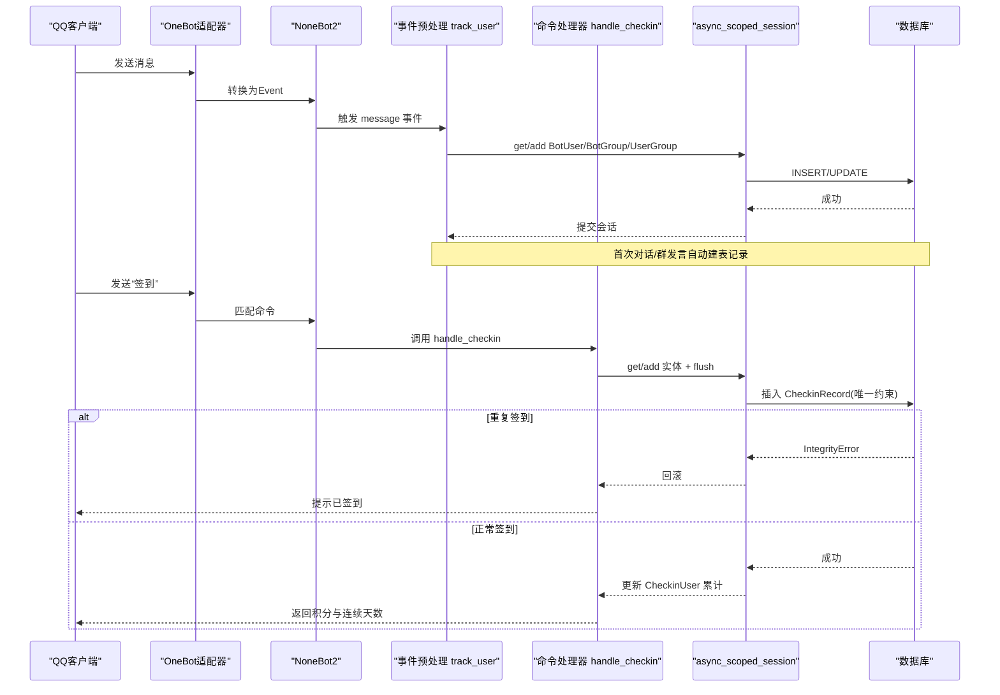
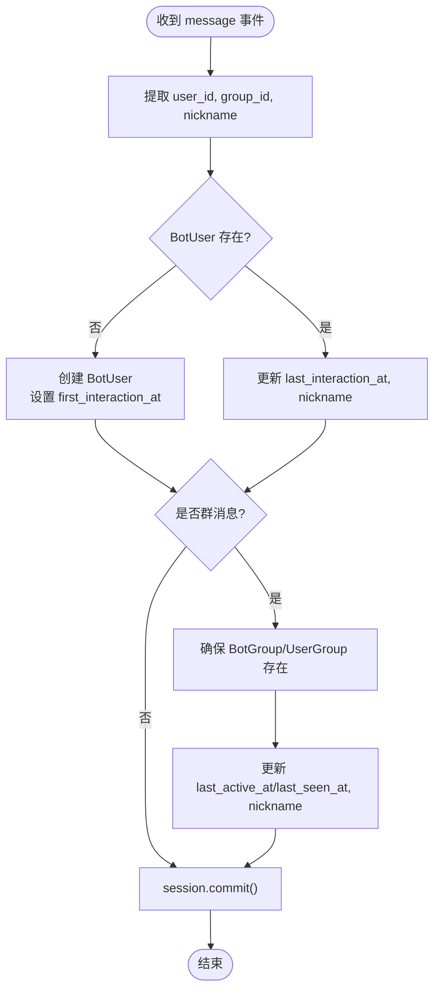
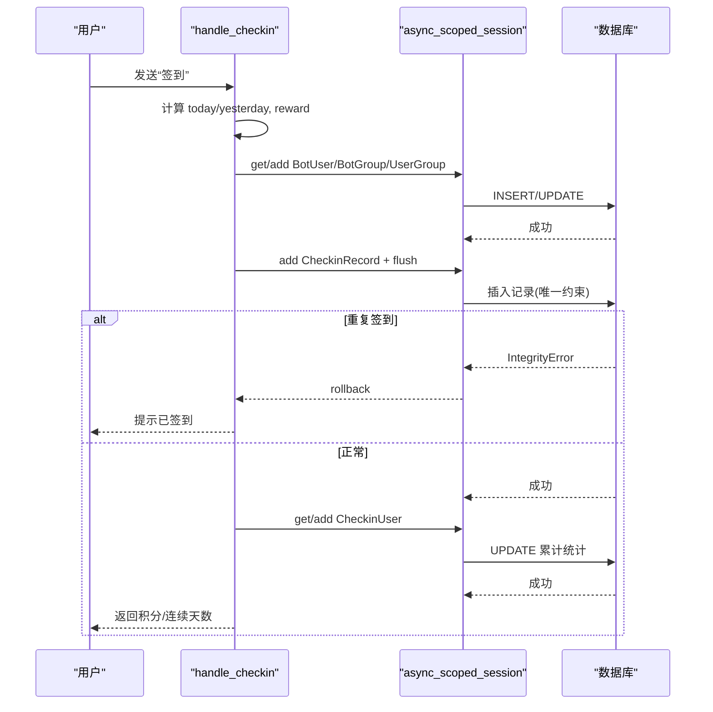
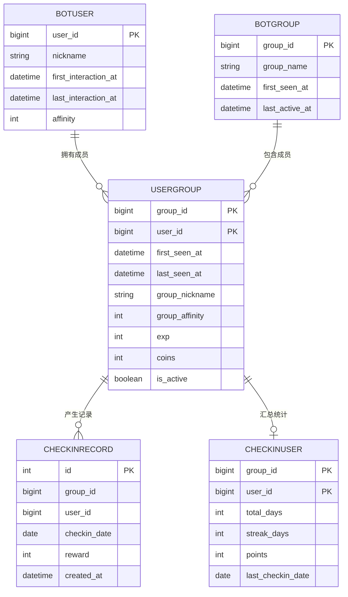
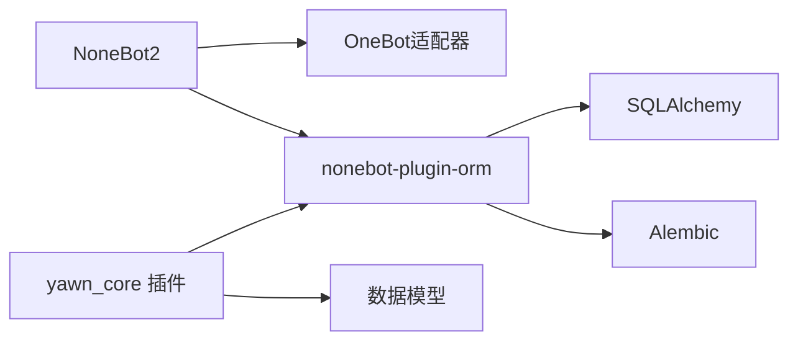

# 数据流设计

<cite>
**本文引用的文件**   
- [README.md](file://README.md)
- [pyproject.toml](file://pyproject.toml)
- [yawn_core/__init__.py](file://src/plugins/yawn_core/__init__.py)
- [yawn_core/checkin.py](file://src/plugins/yawn_core/checkin.py)
- [yawn_core/info.py](file://src/plugins/yawn_core/info.py)
- [data_models/bot_user.py](file://src/plugins/yawn_core/data_models/bot_user.py)
- [data_models/bot_group.py](file://src/plugins/yawn_core/data_models/bot_group.py)
- [data_models/user_group.py](file://src/plugins/yawn_core/data_models/user_group.py)
- [data_models/checkin_record.py](file://src/plugins/yawn_core/data_models/checkin_record.py)
- [data_models/checkin_user.py](file://src/plugins/yawn_core/data_models/checkin_user.py)
- [migrations/c70afa832d5b_add_checkin_tables.py](file://data/nonebot_plugin_orm/migrations/yawn_core/c70afa832d5b_add_checkin_tables.py)
- [migrations/b15555e176e4_add_checkin_tables.py](file://data/nonebot_plugin_orm/migrations/yawn_core/b15555e176e4_add_checkin_tables.py)
</cite>

## 目录
1. [简介](#简介)
2. [项目结构](#项目结构)
3. [核心组件](#核心组件)
4. [架构总览](#架构总览)
5. [详细组件分析](#详细组件分析)
6. [依赖关系分析](#依赖关系分析)
7. [性能与优化](#性能与优化)
8. [故障排查指南](#故障排查指南)
9. [结论](#结论)
10. [附录：数据模型与约束](#附录数据模型与约束)

## 简介
本文件面向YawnBot的数据流设计，系统性描述从QQ消息接收到数据库存储的完整数据流向，覆盖消息解析、业务逻辑处理、ORM映射与数据持久化各阶段；并解释异步会话管理、事务处理与连接池配置（基于nonebot-plugin-orm）、数据验证规则、约束检查与异常处理机制；同时给出缓存策略、查询优化与性能监控方案建议，以及数据一致性保证与错误恢复的实现细节。文档包含数据流图与数据转换过程的可视化说明，便于非技术读者理解。

## 项目结构
YawnBot基于NoneBot2框架，插件位于src/plugins/yawn_core下，使用nonebot-plugin-orm进行SQLAlchemy ORM与Alembic迁移管理。核心入口通过事件预处理与命令处理器组织数据流。

**图表来源** 
- [pyproject.toml:25-43](file://pyproject.toml#L25-L43)
- [yawn_core/__init__.py:16-79](file://src/plugins/yawn_core/__init__.py#L16-L79)
- [yawn_core/checkin.py:22-26](file://src/plugins/yawn_core/checkin.py#L22-L26)

**章节来源**
- [README.md:1-13](file://README.md#L1-L13)
- [pyproject.toml:1-43](file://pyproject.toml#L1-L43)

## 核心组件
- 事件预处理 track_user：在每条message事件进入时，自动创建或更新用户、群组及用户-群组关系记录，确保后续业务逻辑有基础数据。
- 签到命令 handle_checkin：实现“每日一次”的签到流程，包括奖励计算、唯一性校验、累计统计更新与结果返回。
- 信息命令 handle_info：获取机器人登录信息与版本信息，演示对外部API调用的异常处理。
- ORM数据模型：BotUser、BotGroup、UserGroup、CheckinRecord、CheckinUser，定义表结构、关系与约束。

**章节来源**
- [yawn_core/__init__.py:16-79](file://src/plugins/yawn_core/__init__.py#L16-L79)
- [yawn_core/checkin.py:22-147](file://src/plugins/yawn_core/checkin.py#L22-L147)
- [yawn_core/info.py:6-39](file://src/plugins/yawn_core/info.py#L6-L39)
- [data_models/bot_user.py:12-32](file://src/plugins/yawn_core/data_models/bot_user.py#L12-L32)
- [data_models/bot_group.py:12-29](file://src/plugins/yawn_core/data_models/bot_group.py#L12-L29)
- [data_models/user_group.py:15-61](file://src/plugins/yawn_core/data_models/user_group.py#L15-L61)
- [data_models/checkin_record.py:12-53](file://src/plugins/yawn_core/data_models/checkin_record.py#L12-L53)
- [data_models/checkin_user.py:12-47](file://src/plugins/yawn_core/data_models/checkin_user.py#L12-L47)

## 架构总览
下图展示从OneBot V11消息到数据库写入的端到端数据流，涵盖事件预处理与签到命令两条路径。

**图表来源** 
- [yawn_core/__init__.py:16-79](file://src/plugins/yawn_core/__init__.py#L16-L79)
- [yawn_core/checkin.py:41-147](file://src/plugins/yawn_core/checkin.py#L41-L147)
- [data_models/checkin_record.py:15-29](file://src/plugins/yawn_core/data_models/checkin_record.py#L15-L29)

## 详细组件分析

### 事件预处理：track_user
- 功能：对每条message事件，确保BotUser存在（首次记录first_interaction_at），更新last_interaction_at与昵称；若为群消息，确保BotGroup与UserGroup存在，并维护首次/最后出现时间与群内昵称。
- 数据流：事件提取user_id/group_id -> 查询/创建实体 -> session.add -> commit。
- 事务与并发：使用async_scoped_session，每个请求独立会话，避免跨请求共享状态。
- 异常处理：未显式捕获异常，依赖上层框架回滚与日志。

**图表来源** 
- [yawn_core/__init__.py:16-79](file://src/plugins/yawn_core/__init__.py#L16-L79)

**章节来源**
- [yawn_core/__init__.py:16-79](file://src/plugins/yawn_core/__init__.py#L16-L79)

### 签到命令：handle_checkin
- 功能：按中国时区计算日期，随机生成奖励，确保用户/群组/用户-群组记录存在，插入CheckinRecord并触发唯一约束检查，更新CheckinUser累计统计。
- 数据流：参数校验与时区处理 -> 实体获取/创建 -> flush触发唯一约束 -> 异常分支处理 -> 累计统计更新 -> 返回结果。
- 事务与并发：flush用于提前触发数据库唯一约束；IntegrityError捕获后rollback，防止脏会话继续。
- 性能：先flush再查询CheckinUser，减少不必要的往返；批量字段更新在内存完成后再提交。

**图表来源** 
- [yawn_core/checkin.py:41-147](file://src/plugins/yawn_core/checkin.py#L41-L147)
- [data_models/checkin_record.py:15-29](file://src/plugins/yawn_core/data_models/checkin_record.py#L15-L29)

**章节来源**
- [yawn_core/checkin.py:22-147](file://src/plugins/yawn_core/checkin.py#L22-L147)

### 信息命令：handle_info
- 功能：获取机器人登录信息与版本信息，尝试创建群文件夹，捕获ActionFailed异常并友好提示。
- 数据流：获取bot实例 -> 调用API -> 构造消息 -> 异常处理。
- 异常处理：针对同名文件夹等错误进行分支处理，提升用户体验。

**章节来源**
- [yawn_core/info.py:6-39](file://src/plugins/yawn_core/info.py#L6-L39)

### 数据模型与关系
- BotUser：全局用户，主键user_id，关联UserGroup列表。
- BotGroup：全局群组，主键group_id，关联UserGroup列表。
- UserGroup：用户-群组关系，联合主键(group_id,user_id)，外键级联删除，扩展字段含经验、金币、活跃度等。
- CheckinRecord：签到历史，唯一约束(group_id,user_id,checkin_date)，外键指向UserGroup。
- CheckinUser：签到汇总，联合主键(group_id,user_id)，累计天数、连续天数、积分、最后签到日期。

**图表来源** 
- [data_models/bot_user.py:12-32](file://src/plugins/yawn_core/data_models/bot_user.py#L12-L32)
- [data_models/bot_group.py:12-29](file://src/plugins/yawn_core/data_models/bot_group.py#L12-L29)
- [data_models/user_group.py:15-61](file://src/plugins/yawn_core/data_models/user_group.py#L15-L61)
- [data_models/checkin_record.py:12-53](file://src/plugins/yawn_core/data_models/checkin_record.py#L12-L53)
- [data_models/checkin_user.py:12-47](file://src/plugins/yawn_core/data_models/checkin_user.py#L12-L47)

**章节来源**
- [data_models/bot_user.py:12-32](file://src/plugins/yawn_core/data_models/bot_user.py#L12-L32)
- [data_models/bot_group.py:12-29](file://src/plugins/yawn_core/data_models/bot_group.py#L12-L29)
- [data_models/user_group.py:15-61](file://src/plugins/yawn_core/data_models/user_group.py#L15-L61)
- [data_models/checkin_record.py:12-53](file://src/plugins/yawn_core/data_models/checkin_record.py#L12-L53)
- [data_models/checkin_user.py:12-47](file://src/plugins/yawn_core/data_models/checkin_user.py#L12-L47)

## 依赖关系分析
- NoneBot2与OneBot适配器：提供事件与消息对象。
- nonebot-plugin-orm：提供async_scoped_session与Model基类，集成SQLAlchemy与Alembic。
- Alembic迁移：定义表结构与约束演进。

**图表来源** 
- [pyproject.toml:25-43](file://pyproject.toml#L25-L43)
- [yawn_core/__init__.py:6-11](file://src/plugins/yawn_core/__init__.py#L6-L11)

**章节来源**
- [pyproject.toml:25-43](file://pyproject.toml#L25-L43)

## 性能与优化
- 异步会话管理：使用async_scoped_session确保每个请求独立会话，避免锁竞争与状态污染。
- 事务与刷新：在签到流程中先flush以触发唯一约束，减少无效写入；仅在必要时commit。
- 连接池配置：nonebot-plugin-orm默认基于SQLAlchemy Engine，可通过其配置调整pool_size、max_overflow、pool_recycle等；建议在高频场景下适当增大pool_size并启用连接复用。
- 查询优化：
  - 优先使用主键/联合主键查找（如UserGroup、CheckinUser）。
  - 为频繁过滤字段添加索引（如checkin_date、last_seen_at）以提升查询性能。
  - 批量操作合并多次INSERT/UPDATE，减少往返。
- 缓存策略：
  - 热点数据（如用户/群组基本信息）可引入本地缓存（TTL短），降低读放大。
  - 签到统计（CheckinUser）可在内存中短期缓存，定期落库，减轻写压力。
- 性能监控：
  - 使用nonebot-plugin-status监控插件运行状态。
  - 结合Sentry进行异常上报与追踪。
  - 记录关键指标：QPS、平均延迟、错误率、数据库连接池使用率。

[本节为通用指导，不直接分析具体文件]

## 故障排查指南
- 重复签到异常：
  - 现象：IntegrityError触发，会话回滚，返回“今天已签到”。
  - 排查：确认唯一约束uq_checkin_record_once_per_day生效；检查时间计算与时区设置。
  - 参考：[yawn_core/checkin.py:109-114](file://src/plugins/yawn_core/checkin.py#L109-L114)
- 群文件夹创建失败：
  - 现象：ActionFailed抛出，可能因同名文件夹。
  - 排查：捕获异常并判断wording，给出友好提示。
  - 参考：[yawn_core/info.py:32-39](file://src/plugins/yawn_core/info.py#L32-L39)
- 数据不一致：
  - 现象：用户/群组记录缺失或更新时间不正确。
  - 排查：检查事件预处理track_user是否正确执行；确认session.commit被调用。
  - 参考：[yawn_core/__init__.py:30-79](file://src/plugins/yawn_core/__init__.py#L30-L79)

**章节来源**
- [yawn_core/checkin.py:109-114](file://src/plugins/yawn_core/checkin.py#L109-L114)
- [yawn_core/info.py:32-39](file://src/plugins/yawn_core/info.py#L32-L39)
- [yawn_core/__init__.py:30-79](file://src/plugins/yawn_core/__init__.py#L30-L79)

## 结论
YawnBot的数据流设计清晰分层：事件预处理保障基础数据完备，命令处理器执行业务逻辑并通过ORM与数据库交互。通过唯一约束与事务控制保证数据一致性，结合异步会话与连接池优化性能。建议在生产环境完善缓存与监控，进一步提升稳定性与可观测性。

[本节为总结，不直接分析具体文件]

## 附录：数据模型与约束
- 唯一约束：
  - CheckinRecord：uq_checkin_record_once_per_day(group_id,user_id,checkin_date)。
- 外键约束：
  - CheckinRecord与CheckinUser均外键指向UserGroup(group_id,user_id)，ondelete=CASCADE。
- 默认值与时间戳：
  - 首次时间字段使用server_default=func.current_timestamp()。
- 迁移演进：
  - c70afa832d5b：创建CheckinRecord与CheckinUser表。
  - b15555e176e4：新增BotUser/BotGroup/UserGroup表，并对CheckinRecord/CheckinUser字段类型升级与外键约束。

**章节来源**
- [data_models/checkin_record.py:15-29](file://src/plugins/yawn_core/data_models/checkin_record.py#L15-L29)
- [data_models/checkin_user.py:15-22](file://src/plugins/yawn_core/data_models/checkin_user.py#L15-L22)
- [migrations/c70afa832d5b_add_checkin_tables.py:22-46](file://data/nonebot_plugin_orm/migrations/yawn_core/c70afa832d5b_add_checkin_tables.py#L22-L46)
- [migrations/b15555e176e4_add_checkin_tables.py:22-78](file://data/nonebot_plugin_orm/migrations/yawn_core/b15555e176e4_add_checkin_tables.py#L22-L78)