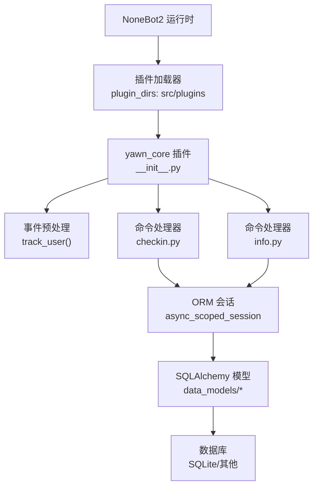
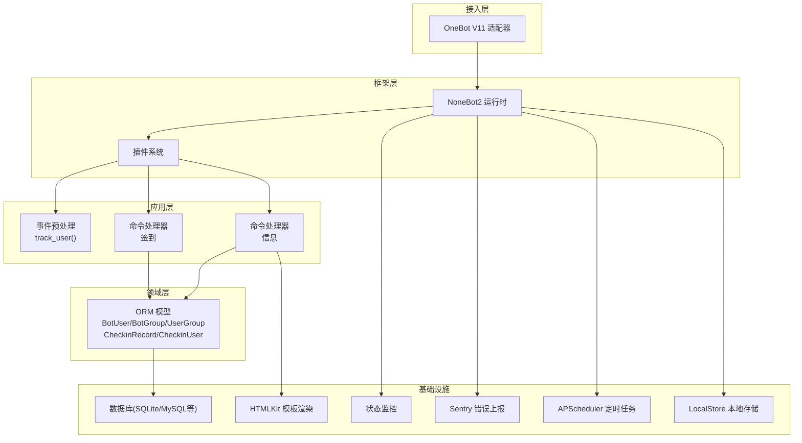
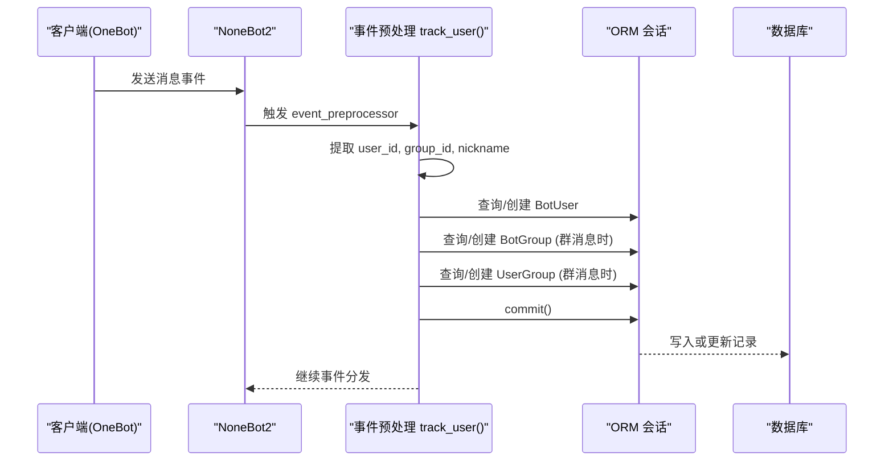
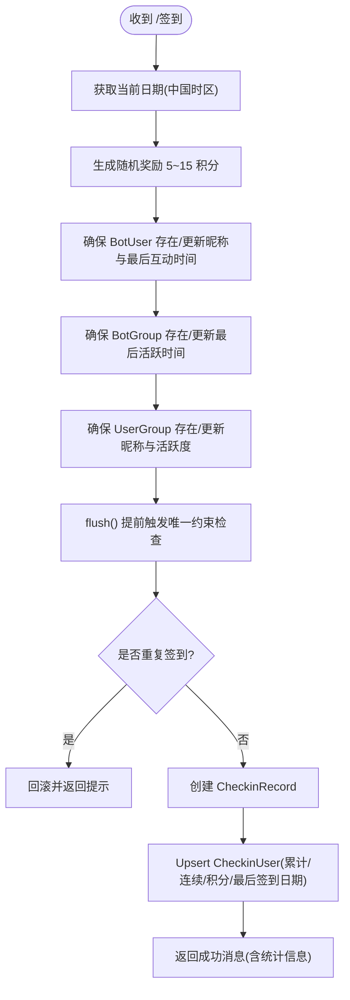
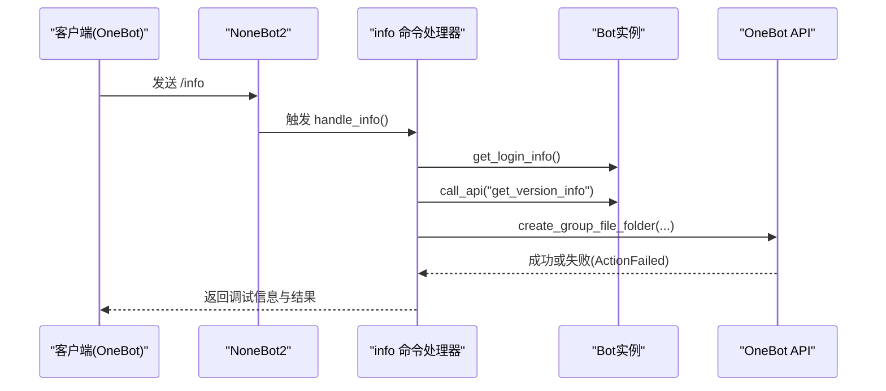
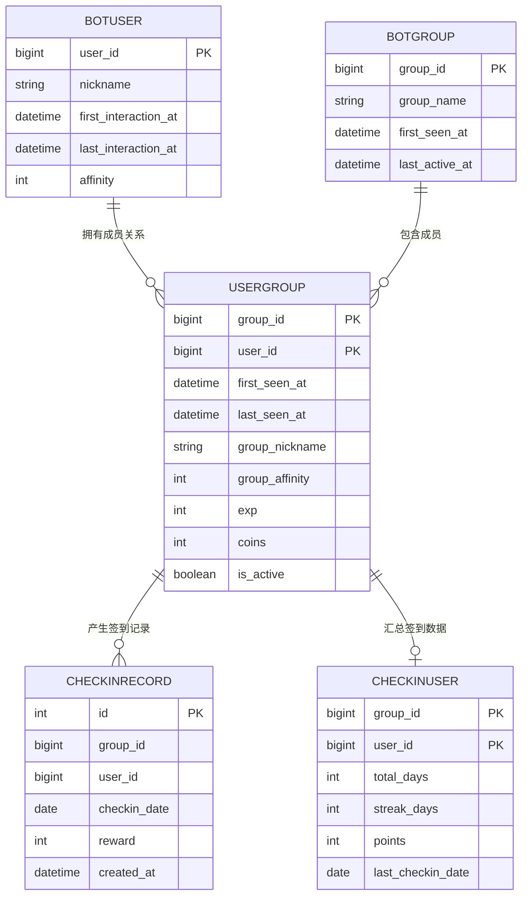
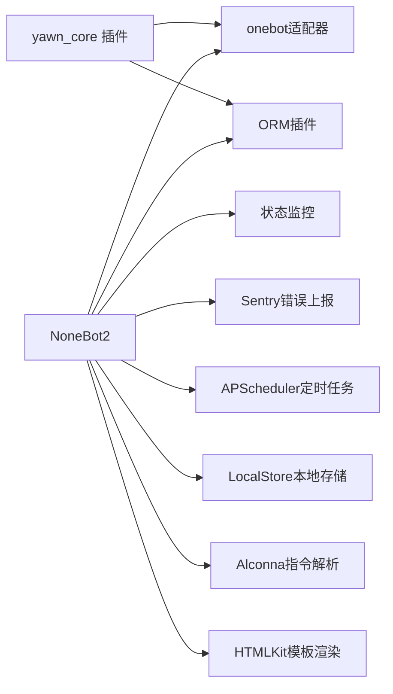
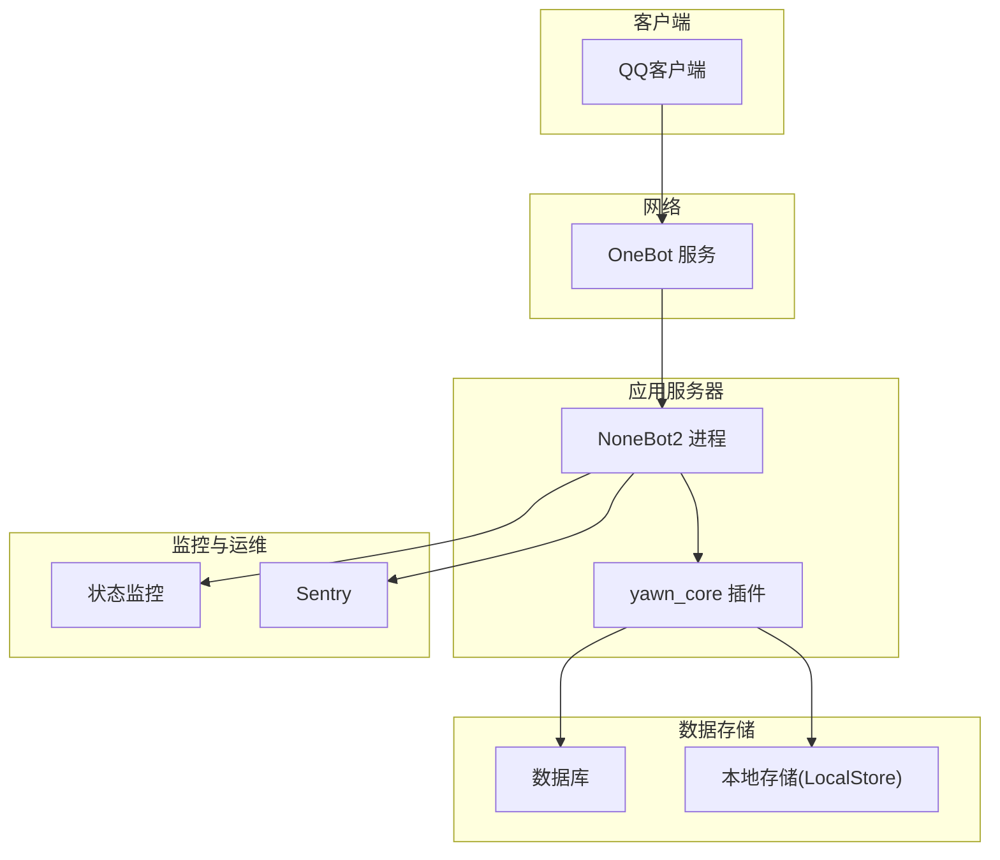

# 架构设计

<cite>
**本文引用的文件**   
- [README.md](file://README.md)
- [pyproject.toml](file://pyproject.toml)
- [src/plugins/yawn_core/__init__.py](file://src/plugins/yawn_core/__init__.py)
- [src/plugins/yawn_core/checkin.py](file://src/plugins/yawn_core/checkin.py)
- [src/plugins/yawn_core/info.py](file://src/plugins/yawn_core/info.py)
- [src/plugins/yawn_core/data_models/bot_user.py](file://src/plugins/yawn_core/data_models/bot_user.py)
- [src/plugins/yawn_core/data_models/bot_group.py](file://src/plugins/yawn_core/data_models/bot_group.py)
- [src/plugins/yawn_core/data_models/user_group.py](file://src/plugins/yawn_core/data_models/user_group.py)
- [src/plugins/yawn_core/data_models/checkin_record.py](file://src/plugins/yawn_core/data_models/checkin_record.py)
- [src/plugins/yawn_core/data_models/checkin_user.py](file://src/plugins/yawn_core/data_models/checkin_user.py)
- [data/nonebot_plugin_orm/migrations/yawn_core/b15555e176e4_add_checkin_tables.py](file://data/nonebot_plugin_orm/migrations/yawn_core/b15555e176e4_add_checkin_tables.py)
</cite>

## 目录
1. [简介](#简介)
2. [项目结构](#项目结构)
3. [核心组件](#核心组件)
4. [架构总览](#架构总览)
5. [详细组件分析](#详细组件分析)
6. [依赖关系分析](#依赖关系分析)
7. [性能考量](#性能考量)
8. [故障排查指南](#故障排查指南)
9. [结论](#结论)
10. [附录](#附录)

## 简介
本架构文档面向YawnBot核心插件（yawn_core），基于NoneBot2的插件化与事件驱动机制，采用分层架构组织代码：事件预处理层、命令处理层、领域模型与数据访问层。系统通过OneBot适配器接入QQ生态，使用ORM插件进行持久化，并集成状态监控、错误上报、定时任务、本地存储、模板渲染等能力。本文档将详细说明组件交互、数据流向、集成模式、技术决策与权衡、约束条件、基础设施需求、可扩展性、部署拓扑，以及安全性、监控与灾难恢复等横切关注点。

## 项目结构
YawnBot遵循NoneBot2的标准插件目录约定，核心功能位于src/plugins/yawn_core下，包含：
- 插件入口与事件预处理逻辑
- 命令处理器（签到、信息）
- 领域数据模型（用户、群组、签到记录与汇总）
- Alembic迁移脚本（数据库版本管理）

图表来源
- [pyproject.toml:25-43](file://pyproject.toml#L25-L43)
- [src/plugins/yawn_core/__init__.py:16-74](file://src/plugins/yawn_core/__init__.py#L16-L74)
- [src/plugins/yawn_core/checkin.py:22-26](file://src/plugins/yawn_core/checkin.py#L22-L26)
- [src/plugins/yawn_core/info.py:6](file://src/plugins/yawn_core/info.py#L6)

章节来源
- [README.md:1-13](file://README.md#L1-L13)
- [pyproject.toml:1-43](file://pyproject.toml#L1-L43)

## 核心组件
- 事件预处理层：统一拦截消息事件，维护用户与群组的“首次出现”和“最近活跃”时间戳，确保后续业务逻辑有完整上下文。
- 命令处理层：实现具体业务命令（如签到、信息查询），封装OneBot API调用与ORM事务操作。
- 领域模型层：定义用户、群组、用户-群组关系、签到记录与汇总等实体，并通过ORM建立外键与唯一约束，保证数据一致性。
- 基础设施层：通过NoneBot2插件体系集成状态监控、Sentry错误上报、APScheduler定时任务、本地存储、Alconna指令解析、ORM与HTMLKit模板渲染等。

章节来源
- [src/plugins/yawn_core/__init__.py:16-74](file://src/plugins/yawn_core/__init__.py#L16-L74)
- [src/plugins/yawn_core/checkin.py:22-26](file://src/plugins/yawn_core/checkin.py#L22-L26)
- [src/plugins/yawn_core/info.py:6](file://src/plugins/yawn_core/info.py#L6)
- [pyproject.toml:35-43](file://pyproject.toml#L35-L43)

## 架构总览
YawnBot采用“事件驱动 + 插件化 + 分层架构”的设计：
- 事件驱动：通过event_preprocessor捕获消息事件，在命令处理前完成用户与群组上下文的初始化与更新。
- 插件化：每个业务模块以插件形式存在，便于独立开发、测试与扩展。
- 分层架构：事件预处理 → 命令处理 → ORM数据访问 → 数据库，层次清晰，职责单一。

图表来源
- [pyproject.toml:25-43](file://pyproject.toml#L25-L43)
- [src/plugins/yawn_core/__init__.py:16-74](file://src/plugins/yawn_core/__init__.py#L16-L74)
- [src/plugins/yawn_core/checkin.py:22-26](file://src/plugins/yawn_core/checkin.py#L22-L26)
- [src/plugins/yawn_core/info.py:6](file://src/plugins/yawn_core/info.py#L6)

## 详细组件分析

### 事件预处理组件（用户与群组上下文维护）
该组件负责在所有消息事件进入业务逻辑之前，确保用户与群组实体存在并更新其最近活动时间戳。对于群消息，还会维护用户-群组关系及昵称同步。

图表来源
- [src/plugins/yawn_core/__init__.py:16-74](file://src/plugins/yawn_core/__init__.py#L16-L74)
- [src/plugins/yawn_core/data_models/bot_user.py:12-32](file://src/plugins/yawn_core/data_models/bot_user.py#L12-L32)
- [src/plugins/yawn_core/data_models/bot_group.py:12-29](file://src/plugins/yawn_core/data_models/bot_group.py#L12-L29)
- [src/plugins/yawn_core/data_models/user_group.py:15-61](file://src/plugins/yawn_core/data_models/user_group.py#L15-L61)

章节来源
- [src/plugins/yawn_core/__init__.py:16-74](file://src/plugins/yawn_core/__init__.py#L16-L74)

### 签到命令处理器（业务逻辑与数据一致性）
签到命令在群聊中执行，随机奖励积分，确保每天一次签到约束，并维护连续签到天数与累计积分。

图表来源
- [src/plugins/yawn_core/checkin.py:22-26](file://src/plugins/yawn_core/checkin.py#L22-L26)
- [src/plugins/yawn_core/checkin.py:41-147](file://src/plugins/yawn_core/checkin.py#L41-L147)
- [src/plugins/yawn_core/data_models/checkin_record.py:12-53](file://src/plugins/yawn_core/data_models/checkin_record.py#L12-L53)
- [src/plugins/yawn_core/data_models/checkin_user.py:12-47](file://src/plugins/yawn_core/data_models/checkin_user.py#L12-L47)

章节来源
- [src/plugins/yawn_core/checkin.py:22-26](file://src/plugins/yawn_core/checkin.py#L22-L26)
- [src/plugins/yawn_core/checkin.py:41-147](file://src/plugins/yawn_core/checkin.py#L41-L147)

### 信息命令处理器（调试与外部API调用）
信息命令用于输出机器人基本信息，并尝试创建群文件夹用于调试。该命令展示了如何调用OneBot API与异常处理。

图表来源
- [src/plugins/yawn_core/info.py:6](file://src/plugins/yawn_core/info.py#L6)
- [src/plugins/yawn_core/info.py:10-39](file://src/plugins/yawn_core/info.py#L10-L39)

章节来源
- [src/plugins/yawn_core/info.py:6](file://src/plugins/yawn_core/info.py#L6)
- [src/plugins/yawn_core/info.py:10-39](file://src/plugins/yawn_core/info.py#L10-L39)

### 领域模型与数据流
数据模型定义了用户、群组、用户-群组关系、签到记录与汇总，并通过外键与唯一约束保障数据一致性。

图表来源
- [src/plugins/yawn_core/data_models/bot_user.py:12-32](file://src/plugins/yawn_core/data_models/bot_user.py#L12-L32)
- [src/plugins/yawn_core/data_models/bot_group.py:12-29](file://src/plugins/yawn_core/data_models/bot_group.py#L12-L29)
- [src/plugins/yawn_core/data_models/user_group.py:15-61](file://src/plugins/yawn_core/data_models/user_group.py#L15-L61)
- [src/plugins/yawn_core/data_models/checkin_record.py:12-53](file://src/plugins/yawn_core/data_models/checkin_record.py#L12-L53)
- [src/plugins/yawn_core/data_models/checkin_user.py:12-47](file://src/plugins/yawn_core/data_models/checkin_user.py#L12-L47)

章节来源
- [src/plugins/yawn_core/data_models/bot_user.py:12-32](file://src/plugins/yawn_core/data_models/bot_user.py#L12-L32)
- [src/plugins/yawn_core/data_models/bot_group.py:12-29](file://src/plugins/yawn_core/data_models/bot_group.py#L12-L29)
- [src/plugins/yawn_core/data_models/user_group.py:15-61](file://src/plugins/yawn_core/data_models/user_group.py#L15-L61)
- [src/plugins/yawn_core/data_models/checkin_record.py:12-53](file://src/plugins/yawn_core/data_models/checkin_record.py#L12-L53)
- [src/plugins/yawn_core/data_models/checkin_user.py:12-47](file://src/plugins/yawn_core/data_models/checkin_user.py#L12-L47)

## 依赖关系分析
YawnBot依赖NoneBot2及其生态插件，形成清晰的依赖边界：
- NoneBot2运行时提供事件总线与插件加载机制
- OneBot适配器对接QQ平台
- ORM插件提供异步会话与模型映射
- 状态监控、Sentry、APScheduler、LocalStore、Alconna、HTMLKit等增强能力

图表来源
- [pyproject.toml:7-17](file://pyproject.toml#L7-L17)
- [pyproject.toml:35-43](file://pyproject.toml#L35-L43)

章节来源
- [pyproject.toml:7-17](file://pyproject.toml#L7-L17)
- [pyproject.toml:35-43](file://pyproject.toml#L35-L43)

## 性能考量
- 事件预处理仅在message类型事件中执行，避免不必要的开销
- 签到流程使用session.flush()提前触发唯一约束检查，减少无效写入
- 数据库层面通过UniqueConstraint保证“每人每天一次签到”，降低应用层校验成本
- 使用异步会话(async_scoped_session)提升并发处理能力
- 建议对高频查询字段添加索引（如user_id、group_id、checkin_date）以提升查询性能

[本节为通用指导，不直接分析具体文件]

## 故障排查指南
- 重复签到问题：若出现IntegrityError，说明已签到过，应回滚并返回友好提示
- 群文件夹创建失败：捕获ActionFailed异常，区分“同名文件夹已存在”与其他错误，给出相应提示
- 新用户首次对话未记录：检查event_preprocessor是否正确注入session并提交
- 数据不一致：确认外键约束与级联删除策略是否符合预期

章节来源
- [src/plugins/yawn_core/checkin.py:109-114](file://src/plugins/yawn_core/checkin.py#L109-L114)
- [src/plugins/yawn_core/info.py:32-39](file://src/plugins/yawn_core/info.py#L32-L39)

## 结论
YawnBot核心插件采用NoneBot2的事件驱动与插件化架构，结合分层设计与ORM数据模型，实现了清晰、可维护、可扩展的机器人功能。通过严格的数据约束与异常处理，保障了业务逻辑的正确性与用户体验。未来可在现有基础上扩展更多命令与业务模块，同时利用监控与错误上报提升系统稳定性。

[本节为总结性内容，不直接分析具体文件]

## 附录

### 技术栈与第三方依赖
- 运行时：Python >=3.10,<4.0
- 框架：NoneBot2（FastAPI后端）
- 适配器：OneBot V11
- ORM：nonebot-plugin-orm（支持SQLite）
- 其他插件：status、sentry、apscheduler、localstore、alconna、htmlkit

章节来源
- [pyproject.toml:1-17](file://pyproject.toml#L1-L17)
- [pyproject.toml:35-43](file://pyproject.toml#L35-L43)

### 基础设施需求
- Python环境（>=3.10）
- 数据库（SQLite默认，可通过ORM配置切换至MySQL/PostgreSQL）
- OneBot服务（用于对接QQ平台）
- 可选：Sentry账号（错误上报）、APScheduler（定时任务）

章节来源
- [pyproject.toml:6](file://pyproject.toml#L6)
- [pyproject.toml:15](file://pyproject.toml#L15)

### 部署拓扑

[本节为概念性架构图，不直接映射到具体文件]

### 安全性考虑
- 输入验证：事件预处理中仅信任来自OneBot适配器的结构化事件
- 权限控制：命令处理器应在更高层根据用户角色进行鉴权（当前未实现）
- 敏感信息：避免在日志中输出用户隐私信息（如昵称、ID需谨慎处理）
- 依赖安全：定期更新依赖包，扫描漏洞

[本节为通用指导，不直接分析具体文件]

### 监控与灾难恢复
- 监控：通过nonebot-plugin-status暴露健康检查端点
- 错误上报：集成Sentry收集异常与堆栈信息
- 备份：定期备份数据库文件（SQLite）或数据库快照
- 回滚：使用Alembic迁移脚本进行版本回滚与升级

章节来源
- [pyproject.toml:37-42](file://pyproject.toml#L37-L42)
- [data/nonebot_plugin_orm/migrations/yawn_core/b15555e176e4_add_checkin_tables.py:83-113](file://data/nonebot_plugin_orm/migrations/yawn_core/b15555e176e4_add_checkin_tables.py#L83-L113)