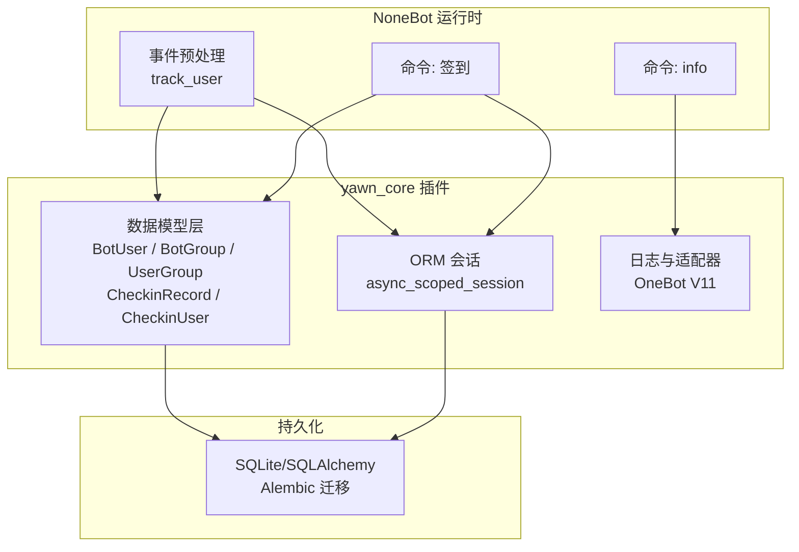
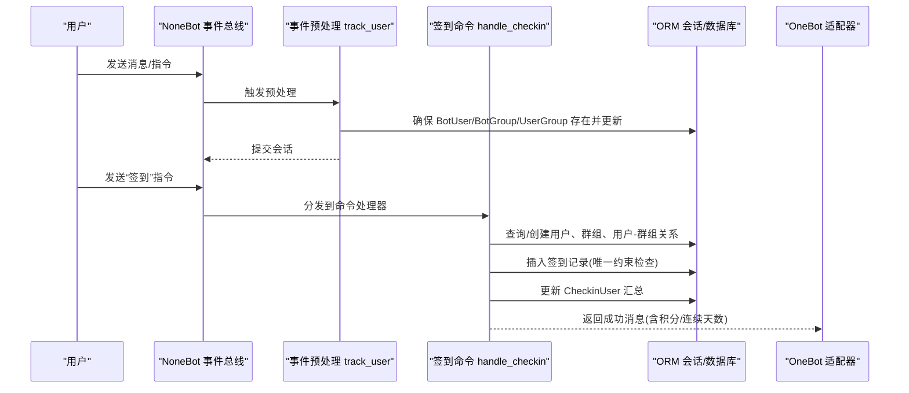
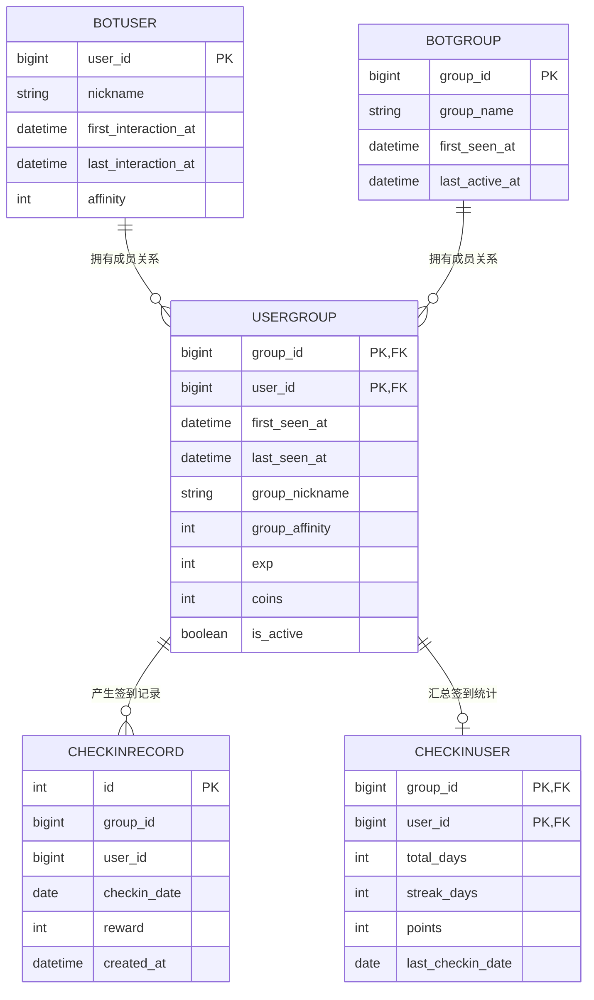
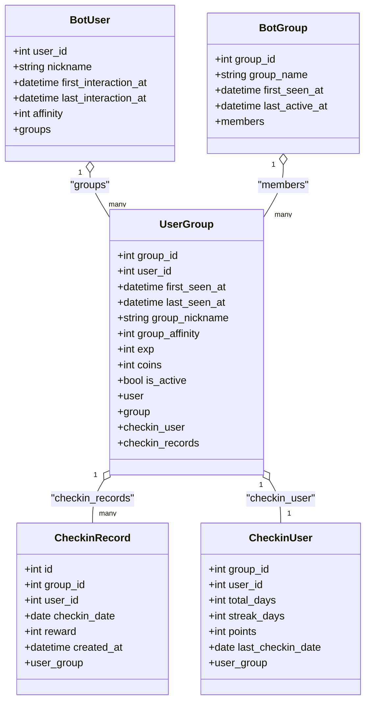
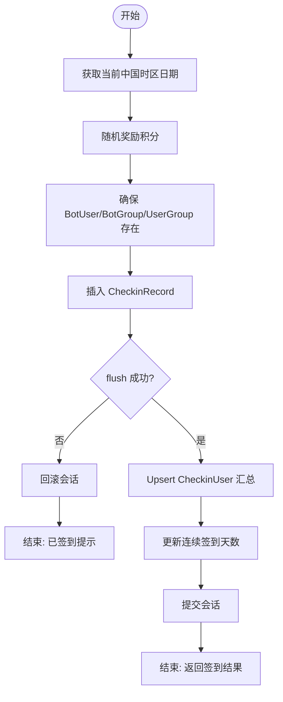
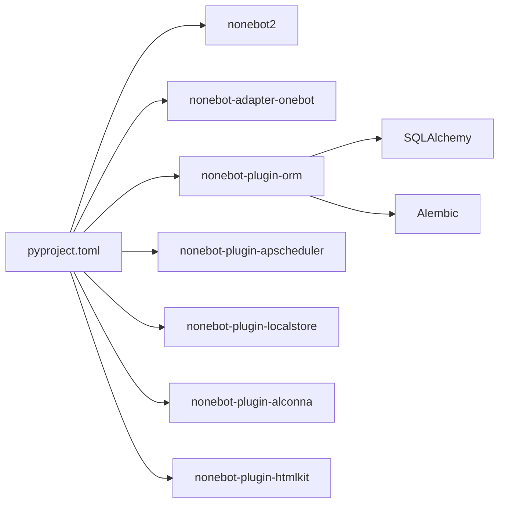

# 组件交互模式

<cite>
**本文引用的文件**   
- [src/plugins/yawn_core/__init__.py](file://src/plugins/yawn_core/__init__.py)
- [src/plugins/yawn_core/checkin.py](file://src/plugins/yawn_core/checkin.py)
- [src/plugins/yawn_core/info.py](file://src/plugins/yawn_core/info.py)
- [src/plugins/yawn_core/data_models/bot_group.py](file://src/plugins/yawn_core/data_models/bot_group.py)
- [src/plugins/yawn_core/data_models/bot_user.py](file://src/plugins/yawn_core/data_models/bot_user.py)
- [src/plugins/yawn_core/data_models/user_group.py](file://src/plugins/yawn_core/data_models/user_group.py)
- [src/plugins/yawn_core/data_models/checkin_record.py](file://src/plugins/yawn_core/data_models/checkin_record.py)
- [src/plugins/yawn_core/data_models/checkin_user.py](file://src/plugins/yawn_core/data_models/checkin_user.py)
- [data/nonebot_plugin_orm/migrations/yawn_core/c70afa832d5b_add_checkin_tables.py](file://data/nonebot_plugin_orm/migrations/yawn_core/c70afa832d5b_add_checkin_tables.py)
- [data/nonebot_plugin_orm/migrations/yawn_core/b15555e176e4_add_checkin_tables.py](file://data/nonebot_plugin_orm/migrations/yawn_core/b15555e176e4_add_checkin_tables.py)
- [pyproject.toml](file://pyproject.toml)
- [README.md](file://README.md)
</cite>

## 目录
1. [简介](#简介)
2. [项目结构](#项目结构)
3. [核心组件](#核心组件)
4. [架构总览](#架构总览)
5. [详细组件分析](#详细组件分析)
6. [依赖关系分析](#依赖关系分析)
7. [性能与一致性](#性能与一致性)
8. [故障排查指南](#故障排查指南)
9. [结论](#结论)
10. [附录](#附录)

## 简介
本文件为 YawnBot 的“yawn_core”插件提供组件交互模式的架构文档。重点覆盖：
- 数据模型间的关联、外键约束与级联操作
- 用户、群组、签到记录等实体的业务关系与数据同步机制
- 组件间依赖、接口定义与通信协议（基于 NoneBot OneBot V11）
- 状态管理模式、数据一致性与并发控制策略
- 组件解耦原则与模块化最佳实践
- 测试策略与模拟对象使用建议
- 系统边界、外部依赖集成与 API 版本兼容性考虑

## 项目结构
YawnBot 采用 NoneBot 插件化架构，yawn_core 插件位于 src/plugins/yawn_core，包含：
- 事件预处理与自动建表/会话管理入口
- 命令处理器：签到、信息查询
- 数据模型：BotUser、BotGroup、UserGroup、CheckinRecord、CheckinUser
- Alembic 迁移脚本用于数据库结构演进

图表来源
- [src/plugins/yawn_core/__init__.py:16-79](file://src/plugins/yawn_core/__init__.py#L16-L79)
- [src/plugins/yawn_core/checkin.py:22-147](file://src/plugins/yawn_core/checkin.py#L22-L147)
- [src/plugins/yawn_core/info.py:1-39](file://src/plugins/yawn_core/info.py#L1-L39)
- [pyproject.toml:25-43](file://pyproject.toml#L25-L43)

章节来源
- [README.md:1-13](file://README.md#L1-L13)
- [pyproject.toml:1-43](file://pyproject.toml#L1-L43)

## 核心组件
- 事件预处理 track_user：在每条消息进入时，确保 BotUser、BotGroup、UserGroup 存在并更新活跃时间戳。
- 签到命令 checkin：处理用户签到，生成签到记录，维护累计/连续签到天数与积分，保证每天一次签到的唯一性。
- 信息命令 info：获取机器人登录信息与版本信息，创建调试文件夹（容错同名文件夹）。
- 数据模型层：定义实体、关系、约束与级联删除。
- ORM 会话：通过 nonebot-plugin-orm 提供的 async_scoped_session 进行异步事务管理。

章节来源
- [src/plugins/yawn_core/__init__.py:16-79](file://src/plugins/yawn_core/__init__.py#L16-L79)
- [src/plugins/yawn_core/checkin.py:22-147](file://src/plugins/yawn_core/checkin.py#L22-L147)
- [src/plugins/yawn_core/info.py:1-39](file://src/plugins/yawn_core/info.py#L1-L39)

## 架构总览
整体采用“事件驱动 + 命令处理器 + ORM 模型”的分层设计：
- 事件层：拦截消息，统一维护用户与群组的“可见性”和活跃度。
- 业务层：签到逻辑封装在独立命令模块中，遵循幂等与一致性约束。
- 数据层：SQLAlchemy 模型定义强约束（唯一、外键、级联），配合 Alembic 管理迁移。
- 适配层：OneBot V11 适配器提供群消息事件与 API 调用能力。

图表来源
- [src/plugins/yawn_core/__init__.py:16-79](file://src/plugins/yawn_core/__init__.py#L16-L79)
- [src/plugins/yawn_core/checkin.py:41-147](file://src/plugins/yawn_core/checkin.py#L41-L147)
- [pyproject.toml:29-32](file://pyproject.toml#L29-L32)

## 详细组件分析

### 数据模型与关系图

图表来源
- [src/plugins/yawn_core/data_models/bot_user.py:12-32](file://src/plugins/yawn_core/data_models/bot_user.py#L12-L32)
- [src/plugins/yawn_core/data_models/bot_group.py:12-29](file://src/plugins/yawn_core/data_models/bot_group.py#L12-L29)
- [src/plugins/yawn_core/data_models/user_group.py:15-61](file://src/plugins/yawn_core/data_models/user_group.py#L15-L61)
- [src/plugins/yawn_core/data_models/checkin_record.py:12-53](file://src/plugins/yawn_core/data_models/checkin_record.py#L12-L53)
- [src/plugins/yawn_core/data_models/checkin_user.py:12-47](file://src/plugins/yawn_core/data_models/checkin_user.py#L12-L47)

#### 外键约束与级联
- UserGroup.group_id → BotGroup.group_id，ondelete=CASCADE
- UserGroup.user_id → BotUser.user_id，ondelete=CASCADE
- CheckinRecord(group_id,user_id) → UserGroup(group_id,user_id)，ondelete=CASCADE
- CheckinUser(group_id,user_id) → UserGroup(group_id,user_id)，ondelete=CASCADE
- CheckinRecord 具备唯一约束 (group_id,user_id,checkin_date) 保证每人每群每天仅一次签到

章节来源
- [src/plugins/yawn_core/data_models/user_group.py:18-27](file://src/plugins/yawn_core/data_models/user_group.py#L18-L27)
- [src/plugins/yawn_core/data_models/checkin_record.py:15-29](file://src/plugins/yawn_core/data_models/checkin_record.py#L15-L29)
- [src/plugins/yawn_core/data_models/checkin_user.py:15-22](file://src/plugins/yawn_core/data_models/checkin_user.py#L15-L22)
- [data/nonebot_plugin_orm/migrations/yawn_core/b15555e176e4_add_checkin_tables.py:58-78](file://data/nonebot_plugin_orm/migrations/yawn_core/b15555e176e4_add_checkin_tables.py#L58-L78)

#### 类关系图（代码级）

图表来源
- [src/plugins/yawn_core/data_models/bot_user.py:12-32](file://src/plugins/yawn_core/data_models/bot_user.py#L12-L32)
- [src/plugins/yawn_core/data_models/bot_group.py:12-29](file://src/plugins/yawn_core/data_models/bot_group.py#L12-L29)
- [src/plugins/yawn_core/data_models/user_group.py:15-61](file://src/plugins/yawn_core/data_models/user_group.py#L15-L61)
- [src/plugins/yawn_core/data_models/checkin_record.py:12-53](file://src/plugins/yawn_core/data_models/checkin_record.py#L12-L53)
- [src/plugins/yawn_core/data_models/checkin_user.py:12-47](file://src/plugins/yawn_core/data_models/checkin_user.py#L12-L47)

### 事件预处理 track_user
职责：
- 拦截所有 message 类型事件，提取 user_id、group_id、昵称
- 确保 BotUser、BotGroup、UserGroup 存在；首次出现记录初始时间戳
- 更新最近交互/活跃时间戳，必要时更新昵称
- 提交会话，保证数据落库

关键流程
- 获取事件上下文与会话
- 按主键或联合主键查询/创建实体
- 写入变更并提交

章节来源
- [src/plugins/yawn_core/__init__.py:16-79](file://src/plugins/yawn_core/__init__.py#L16-L79)

### 签到命令 handle_checkin
职责：
- 解析中国时区日期，计算昨天日期
- 随机奖励积分（5~15）
- 确保 BotUser、BotGroup、UserGroup 存在并更新活跃信息
- 插入 CheckinRecord，利用唯一约束防止重复签到
- 更新或初始化 CheckinUser 汇总（累计天数、连续天数、积分、最后签到日期）
- 返回结果消息

异常与一致性：
- 使用 IntegrityError 捕获重复签到，回滚并友好提示
- flush 提前触发唯一约束检查，避免后续无效写入

图表来源
- [src/plugins/yawn_core/checkin.py:41-147](file://src/plugins/yawn_core/checkin.py#L41-L147)

章节来源
- [src/plugins/yawn_core/checkin.py:22-147](file://src/plugins/yawn_core/checkin.py#L22-L147)

### 信息命令 info
职责：
- 获取机器人登录信息与版本信息
- 尝试创建“调试信息”文件夹，处理同名冲突

注意：
- 对 OneBot API 调用失败进行捕获与提示

章节来源
- [src/plugins/yawn_core/info.py:1-39](file://src/plugins/yawn_core/info.py#L1-L39)

## 依赖关系分析
- 运行时依赖：nonebot2、nonebot-adapter-onebot、nonebot-plugin-orm、nonebot-plugin-apscheduler 等
- 插件配置：plugin_dirs、adapters、plugins 均在 pyproject.toml 中声明
- 数据迁移：Alembic 迁移脚本定义表结构与约束演进

图表来源
- [pyproject.toml:1-43](file://pyproject.toml#L1-L43)

章节来源
- [pyproject.toml:25-43](file://pyproject.toml#L25-L43)

## 性能与一致性
- 会话与事务
  - 使用 async_scoped_session 提供线程/协程安全的会话隔离
  - 在预处理与命令处理器中分别 commit/rollback，避免跨请求污染
- 唯一性与幂等
  - CheckinRecord 的唯一约束保障“每人每群每天一次签到”，从数据库层面杜绝重复
  - 签到命令先 flush 再处理异常，确保快速失败
- 级联删除
  - 删除 BotUser/BotGroup 会级联删除 UserGroup，进而级联删除 CheckinRecord/CheckinUser
  - 建议在业务层谨慎处理“软删除”或归档策略，避免误删历史数据
- 索引与查询
  - 联合主键与外键天然支持高效 JOIN 与过滤
  - 可按需为常用查询字段添加索引（如 last_checkin_date、created_at）
- 时区与时间
  - 签到日期以 Asia/Shanghai 为准，避免跨时区歧义

[本节为通用指导，不直接分析具体文件]

## 故障排查指南
常见问题与定位：
- 重复签到报错
  - 现象：IntegrityError 被捕获，提示“今天已经签到过了”
  - 原因：UniqueConstraint(uq_checkin_record_once_per_day) 生效
  - 处理：确认客户端未重复提交；检查会话是否回滚
- 新用户/新群未出现
  - 现象：签到时报找不到用户或群组
  - 原因：事件预处理未触发或未提交
  - 处理：确认消息类型为 message；检查 session.commit() 执行路径
- 连续签到天数异常
  - 现象：streak_days 未按预期递增
  - 原因：last_checkin_date 与 yesterday 比较逻辑
  - 处理：核对时区设置与日期计算
- 文件夹创建失败
  - 现象：info 命令抛出 ActionFailed
  - 处理：区分“同名文件夹已存在”与其他错误，给出相应提示

章节来源
- [src/plugins/yawn_core/checkin.py:109-114](file://src/plugins/yawn_core/checkin.py#L109-L114)
- [src/plugins/yawn_core/info.py:32-39](file://src/plugins/yawn_core/info.py#L32-L39)

## 结论
yawn_core 插件通过清晰的数据模型与严格的约束，实现了稳健的用户-群组-签到体系。事件预处理保证了基础数据的及时建立与更新；签到命令在业务层与数据库层双重保障一致性。借助 Alembic 与 ORM，系统具备良好的可演进性与可维护性。建议在生产环境补充完善的测试与监控，并对敏感操作引入审计与限流。

[本节为总结性内容，不直接分析具体文件]

## 附录

### 组件解耦与模块化最佳实践
- 分层清晰：事件预处理、命令处理器、数据模型分离
- 单一职责：每个模块只做一件事（如 checkin 专注签到逻辑）
- 依赖注入：通过 NoneBot 的事件与会话参数传递，避免全局状态
- 对外接口稳定：命令名与消息格式保持稳定，便于扩展与兼容

[本节为通用指导，不直接分析具体文件]

### 组件测试策略与模拟对象
- 单元测试
  - 针对签到逻辑：构造 GroupMessageEvent，mock async_scoped_session，断言新增/更新记录
  - 针对唯一约束：模拟 IntegrityError，验证回滚与提示
- 集成测试
  - 使用内存 SQLite 或临时数据库，运行 Alembic 迁移后执行端到端用例
- 模拟对象
  - 模拟 OneBot 适配器 API 调用（get_login_info、call_api）
  - 模拟数据库会话（add/get/commit/rollback）

[本节为通用指导，不直接分析具体文件]

### 系统边界与外部依赖集成
- 外部依赖：OneBot V11 适配器、ORM 插件、Alembic
- 系统边界：插件内部负责数据建模与业务逻辑；与 OneBot 的交互通过适配器完成
- API 版本兼容：OneBot V11 的消息结构与 API 行为可能变化，需在 info 与 checkin 中做兼容处理与错误降级

章节来源
- [pyproject.toml:29-32](file://pyproject.toml#L29-L32)
- [src/plugins/yawn_core/info.py:12-39](file://src/plugins/yawn_core/info.py#L12-L39)

### 数据库迁移与版本管理
- 初始迁移：创建 CheckinRecord、CheckinUser 表
- 后续迁移：升级字段类型（Integer→BigInteger）、增加外键约束与唯一约束
- 回滚：downgrade 提供反向操作，便于本地开发与测试

章节来源
- [data/nonebot_plugin_orm/migrations/yawn_core/c70afa832d5b_add_checkin_tables.py:22-46](file://data/nonebot_plugin_orm/migrations/yawn_core/c70afa832d5b_add_checkin_tables.py#L22-L46)
- [data/nonebot_plugin_orm/migrations/yawn_core/b15555e176e4_add_checkin_tables.py:22-78](file://data/nonebot_plugin_orm/migrations/yawn_core/b15555e176e4_add_checkin_tables.py#L22-L78)