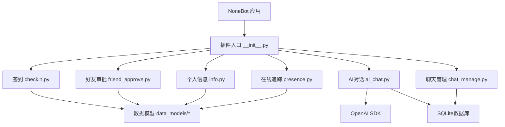
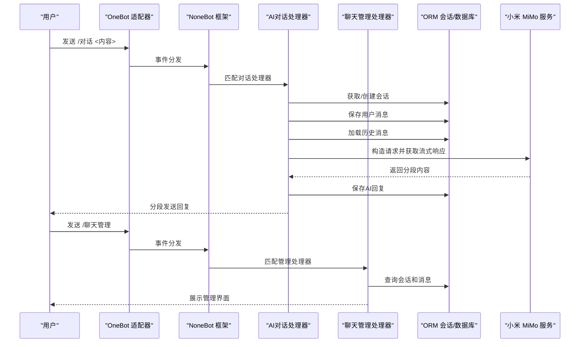
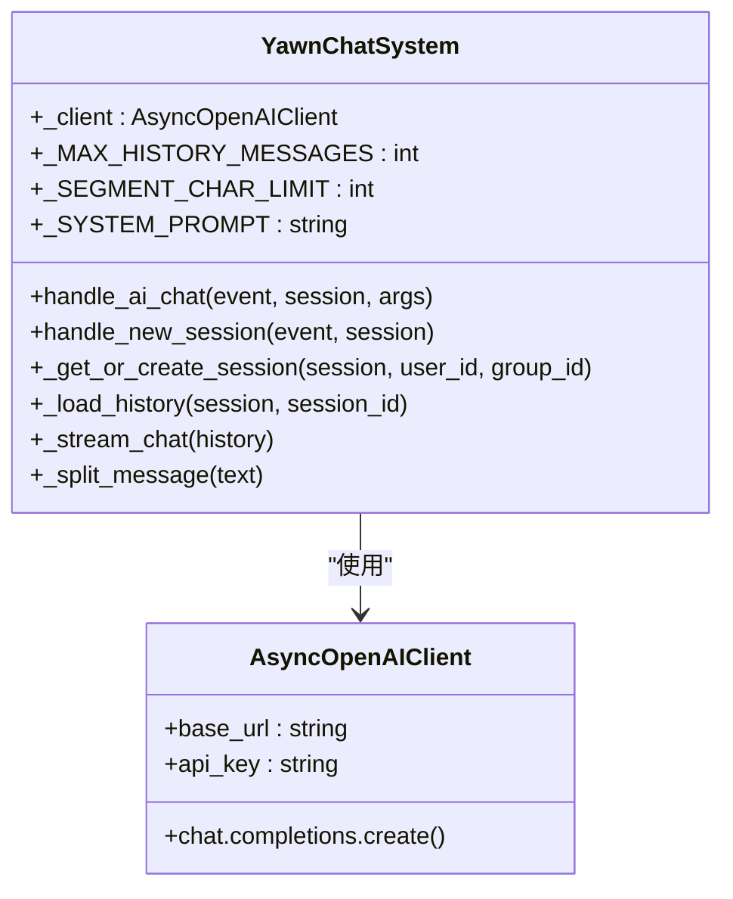
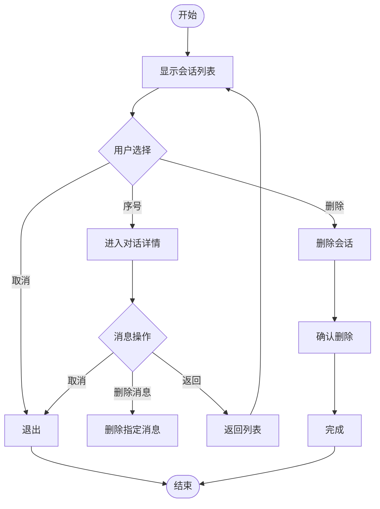
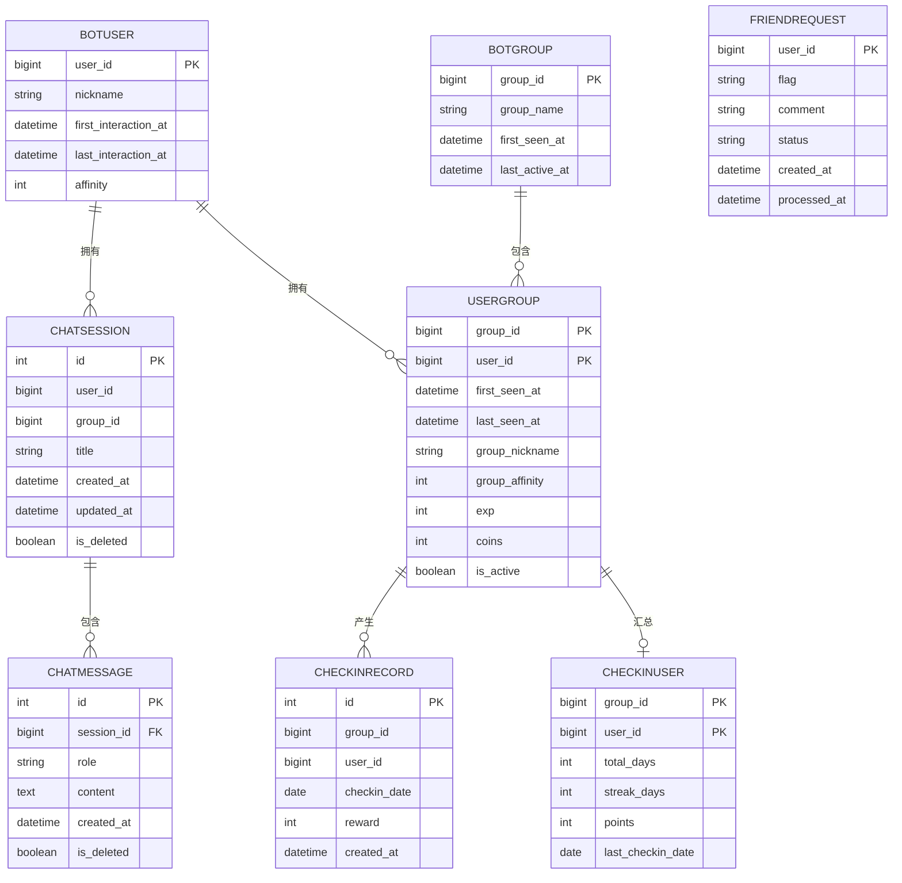
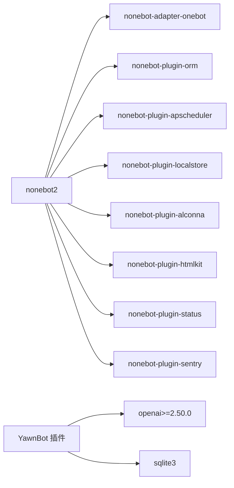

# AI功能集成

<cite>
**本文引用的文件**   
- [README.md](file://README.md)
- [pyproject.toml](file://pyproject.toml)
- [__init__.py](file://src/plugins/yawn_core/__init__.py)
- [ai_chat.py](file://src/plugins/yawn_core/ai_chat.py)
- [chat_manage.py](file://src/plugins/yawn_core/chat_manage.py)
- [permission.py](file://src/plugins/yawn_core/permission.py)
- [checkin.py](file://src/plugins/yawn_core/checkin.py)
- [friend_approve.py](file://src/plugins/yawn_core/friend_approve.py)
- [info.py](file://src/plugins/yawn_core/info.py)
- [presence.py](file://src/plugins/yawn_core/presence.py)
- [bot_user.py](file://src/plugins/yawn_core/data_models/bot_user.py)
- [bot_group.py](file://src/plugins/yawn_core/data_models/bot_group.py)
- [user_group.py](file://src/plugins/yawn_core/data_models/user_group.py)
- [checkin_record.py](file://src/plugins/yawn_core/data_models/checkin_record.py)
- [checkin_user.py](file://src/plugins/yawn_core/data_models/checkin_user.py)
- [friend_request.py](file://src/plugins/yawn_core/data_models/friend_request.py)
- [chat_message.py](file://src/plugins/yawn_core/data_models/chat_message.py)
- [chat_session.py](file://src/plugins/yawn_core/data_models/chat_session.py)
</cite>

## 更新摘要
**所做更改**   
- 将AI调用模块从简单的ai_call.py重构为完整的ai_chat.py系统
- 新增流式响应处理和多轮对话支持
- 新增会话管理和交互式聊天界面（chat_manage.py）
- 新增数据模型：ChatMessage和ChatSession
- 原ai_call.py已被删除，新功能提供更强大的AI对话能力

## 目录
1. [简介](#简介)
2. [项目结构](#项目结构)
3. [核心组件](#核心组件)
4. [架构总览](#架构总览)
5. [详细组件分析](#详细组件分析)
6. [依赖关系分析](#依赖关系分析)
7. [性能考虑](#性能考虑)
8. [故障排查指南](#故障排查指南)
9. [结论](#结论)
10. [附录](#附录)

## 简介
本项目是基于 NoneBot2 的机器人插件集合，围绕"签到、好友申请审批、用户信息展示、在线状态追踪"等能力构建。其中 AI 能力通过 OpenAI SDK 接入小米 MiMo 模型服务，提供完整的对话系统，包括流式响应处理、多轮对话支持、会话管理和交互式聊天界面。当前仓库已包含完整的 AI 对话系统与示例代码，同时具备完善的数据模型与 ORM 支持，便于后续扩展更多 AI 驱动的功能（如智能回复、自动摘要、意图识别等）。

## 项目结构
- 插件根目录：src/plugins/yawn_core
  - 模块入口：__init__.py 负责加载子模块
  - **AI对话系统**：ai_chat.py 封装完整的对话功能，支持流式响应和多轮对话
  - **聊天管理**：chat_manage.py 提供交互式对话管理界面
  - 业务模块：checkin.py、friend_approve.py、info.py、presence.py
  - 数据模型：data_models 下定义 ORM 实体与关系，新增 chat_message.py 和 chat_session.py
- 配置与依赖：pyproject.toml 声明 nonebot2 生态与 openai 依赖
- 运行说明：README.md 提供基础启动流程

**图表来源** 
- [__init__.py:1-25](file://src/plugins/yawn_core/__init__.py#L1-L25)
- [ai_chat.py:1-350](file://src/plugins/yawn_core/ai_chat.py#L1-L350)
- [chat_manage.py:1-535](file://src/plugins/yawn_core/chat_manage.py#L1-L535)

**章节来源**
- [README.md:1-13](file://README.md#L1-L13)
- [pyproject.toml:1-124](file://pyproject.toml#L1-L124)
- [__init__.py:1-25](file://src/plugins/yawn_core/__init__.py#L1-L25)

## 核心组件
- **AI对话模块（ai_chat.py）**
  - 基于小米 MiMo 模型的完整对话系统
  - 支持流式接收 AI 回复并分段发送
  - 多轮对话（自动加载历史上下文）
  - 对话记录持久化至 SQLite
  - 预留群聊接口（group_id 字段）
- **聊天管理模块（chat_manage.py）**
  - 交互式对话管理面板
  - 查看历史对话、删除对话/消息
  - 普通用户管理自己的对话记录
  - 超级管理员可查看、删除、修改任意用户的聊天记录
- **权限控制模块（permission.py）**
  - 功能注册表与权限解析链
  - 支持用户级、群组级和全局功能开关
- 签到模块（checkin.py）
  - 基于命令触发，记录用户签到历史、累计天数、连续天数与积分
  - 使用数据库唯一约束防止重复签到
- 好友审批模块（friend_approve.py）
  - 监听好友申请事件，持久化申请记录，并提供管理员审批命令
- 个人信息模块（info.py）
  - 查询并展示用户全局与群内信息（昵称、好感度、经验、金币、首次/最后活跃时间等）
- 在线追踪模块（presence.py）
  - 事件预处理，自动维护用户与群组的首次/最后交互时间，必要时拉取群名

**章节来源**
- [ai_chat.py:1-350](file://src/plugins/yawn_core/ai_chat.py#L1-L350)
- [chat_manage.py:1-535](file://src/plugins/yawn_core/chat_manage.py#L1-L535)
- [permission.py:1-226](file://src/plugins/yawn_core/permission.py#L1-L226)
- [checkin.py:1-147](file://src/plugins/yawn_core/checkin.py#L1-L147)
- [friend_approve.py:1-152](file://src/plugins/yawn_core/friend_approve.py#L1-L152)
- [info.py:1-40](file://src/plugins/yawn_core/info.py#L1-L40)
- [presence.py:1-103](file://src/plugins/yawn_core/presence.py#L1-L103)

## 架构总览
整体采用"事件驱动 + ORM 数据层 + 外部 AI 服务"的分层架构：
- 事件层：OneBot V11 消息与请求事件进入 NoneBot 路由
- 处理层：各模块 on_command/on_request/event_preprocessor 处理器执行业务逻辑
- 数据层：SQLAlchemy 模型与 nonebot-plugin-orm 会话管理
- 外部服务：小米 MiMo 兼容接口进行文本生成

**图表来源** 
- [ai_chat.py:217-296](file://src/plugins/yawn_core/ai_chat.py#L217-L296)
- [chat_manage.py:150-184](file://src/plugins/yawn_core/chat_manage.py#L150-L184)

## 详细组件分析

### AI对话模块（ai_chat.py）
- **设计要点**
  - 集中管理 AsyncOpenAI 客户端实例，指向小米 MiMo 服务地址
  - 实现流式响应处理，支持长文本分段发送
  - 多轮对话支持，自动加载最近20条消息作为历史上下文
  - 会话管理，支持私聊场景（群聊预留）
  - 软删除机制，支持重置对话
- **核心功能**
  - 流式接收 AI 回复并分段发送（每段不超过1500字符）
  - 自动会话创建和历史消息加载
  - 错误处理和重试机制
  - 权限控制集成

**图表来源** 
- [ai_chat.py:41-44](file://src/plugins/yawn_core/ai_chat.py#L41-L44)
- [ai_chat.py:217-296](file://src/plugins/yawn_core/ai_chat.py#L217-L296)

**章节来源**
- [ai_chat.py:1-350](file://src/plugins/yawn_core/ai_chat.py#L1-L350)

### 聊天管理模块（chat_manage.py）
- **功能特性**
  - 交互式管理面板，支持会话列表查看和消息详情浏览
  - 会话删除和单条消息删除功能
  - 权限分级：普通用户管理自己的记录，超管管理任意用户记录
  - 友好的命令行界面，支持序号操作和快捷指令
- **交互流程**
  - 主菜单显示所有会话列表
  - 输入序号进入对话详情视图
  - 支持删除指定消息或返回上级菜单
  - 超管命令支持查看和删除任意用户数据

**图表来源** 
- [chat_manage.py:150-184](file://src/plugins/yawn_core/chat_manage.py#L150-L184)
- [chat_manage.py:225-308](file://src/plugins/yawn_core/chat_manage.py#L225-L308)

**章节来源**
- [chat_manage.py:1-535](file://src/plugins/yawn_core/chat_manage.py#L1-L535)

### 权限控制模块（permission.py）
- **权限体系**
  - 功能注册表：统一管理所有可用功能及其显示名称
  - 三级权限检查：超级管理员 > 用户级覆盖 > 群组设置 > 默认开启
  - 支持私聊和群聊不同场景的权限控制
- **核心功能**
  - require_feature 装饰器用于权限验证
  - 动态功能开关，支持运行时配置
  - 权限状态查询和管理命令支持

**章节来源**
- [permission.py:1-226](file://src/plugins/yawn_core/permission.py#L1-L226)

### 数据模型（data_models/*）
- **新增对话相关模型**
  - ChatSession：对话会话实体，支持标题、时间戳和软删除
  - ChatMessage：对话消息实体，支持角色标记和内容存储
- **现有模型保持不变**
  - BotUser：全局用户
  - BotGroup：群组
  - UserGroup：用户与群组的关系（含群内属性）
  - CheckinRecord：签到历史记录（唯一约束：群+用户+日期）
  - CheckinUser：用户在群的签到汇总
  - FriendRequest：好友申请记录（按用户去重）

**图表来源** 
- [chat_session.py:18-58](file://src/plugins/yawn_core/data_models/chat_session.py#L18-L58)
- [chat_message.py:17-50](file://src/plugins/yawn_core/data_models/chat_message.py#L17-L50)
- [bot_user.py:12-32](file://src/plugins/yawn_core/data_models/bot_user.py#L12-L32)
- [bot_group.py:12-29](file://src/plugins/yawn_core/data_models/bot_group.py#L12-L29)
- [user_group.py:15-61](file://src/plugins/yawn_core/data_models/user_group.py#L15-L61)
- [checkin_record.py:12-53](file://src/plugins/yawn_core/data_models/checkin_record.py#L12-L53)
- [checkin_user.py:12-47](file://src/plugins/yawn_core/data_models/checkin_user.py#L12-L47)
- [friend_request.py:9-36](file://src/plugins/yawn_core/data_models/friend_request.py#L9-L36)

**章节来源**
- [chat_session.py:1-59](file://src/plugins/yawn_core/data_models/chat_session.py#L1-L59)
- [chat_message.py:1-51](file://src/plugins/yawn_core/data_models/chat_message.py#L1-L51)
- [bot_user.py:1-32](file://src/plugins/yawn_core/data_models/bot_user.py#L1-L32)
- [bot_group.py:1-29](file://src/plugins/yawn_core/data_models/bot_group.py#L1-L29)
- [user_group.py:1-61](file://src/plugins/yawn_core/data_models/user_group.py#L1-L61)
- [checkin_record.py:1-53](file://src/plugins/yawn_core/data_models/checkin_record.py#L1-L53)
- [checkin_user.py:1-47](file://src/plugins/yawn_core/data_models/checkin_user.py#L1-L47)
- [friend_request.py:1-36](file://src/plugins/yawn_core/data_models/friend_request.py#L1-L36)

## 依赖关系分析
- 运行时依赖
  - nonebot2 生态：onebot 适配器、ORM、APScheduler、LocalStore、Alconna、HTMLKit、Status、Sentry
  - openai>=2.50.0：用于调用小米 MiMo 兼容 v1 接口的 AI 服务
- 插件加载
  - pyproject.toml 中声明插件目录与内置插件
  - 插件入口 __init__.py 显式导入子模块以触发注册

**图表来源** 
- [pyproject.toml:7-18](file://pyproject.toml#L7-L18)

**章节来源**
- [pyproject.toml:1-124](file://pyproject.toml#L1-L124)
- [__init__.py:1-25](file://src/plugins/yawn_core/__init__.py#L1-L25)

## 性能考虑
- 数据库层面
  - 使用唯一约束与外键约束保障一致性与完整性
  - 签到记录按天唯一，避免重复写入
  - 对话消息使用索引优化查询性能
- 网络层面
  - AI 调用使用流式响应，减少内存占用
  - 长文本分段发送，避免消息过长
  - 增加超时与重试策略，避免阻塞事件处理
- 并发与异步
  - 所有处理器均为异步，注意避免在回调中进行同步阻塞操作
  - 对高频事件（如 presence）保持轻量逻辑，避免复杂计算
  - 会话管理采用懒加载，减少不必要的数据库查询

## 故障排查指南
- AI 调用失败
  - 检查 base_url 与 api_key 是否正确配置
  - 查看网络连通性与代理设置
  - 捕获异常并记录日志，定位错误码与消息
  - 确认小米 MiMo 服务可用性
- 对话功能异常
  - 检查会话创建和消息存储是否正常
  - 确认权限配置是否正确
  - 验证数据库连接与会话生命周期
- 聊天管理无效
  - 确认用户权限和操作范围
  - 检查会话ID和消息ID的有效性
  - 验证软删除标记的状态
- 签到重复
  - 确认数据库唯一约束生效
  - 检查事务提交与回滚路径
- 好友审批无效
  - 确认超级用户权限配置
  - 检查 flag 与状态流转是否符合预期
- 用户信息缺失
  - 确认 presence 预处理是否正常运行
  - 检查数据库连接与会话生命周期

**章节来源**
- [ai_chat.py:263-271](file://src/plugins/yawn_core/ai_chat.py#L263-L271)
- [chat_manage.py:243-266](file://src/plugins/yawn_core/chat_manage.py#L243-L266)
- [checkin.py:100-147](file://src/plugins/yawn_core/checkin.py#L100-L147)
- [friend_approve.py:66-152](file://src/plugins/yawn_core/friend_approve.py#L66-L152)
- [presence.py:16-103](file://src/plugins/yawn_core/presence.py#L16-L103)

## 结论
本仓库已具备完善的机器人插件骨架与数据模型，AI 能力通过 OpenAI SDK 接入小米 MiMo 服务，提供了完整的对话系统，包括流式响应、多轮对话、会话管理和交互式界面。建议在现有基础上：
- 将 ai_chat.py 抽象为统一的 AI 服务层，提供重试、缓存与限流
- 结合 presence 与 info 模块，实现个性化 AI 回复与上下文感知
- 引入定时任务（APScheduler）进行数据清理与报表生成
- 扩展群聊对话功能，支持多用户协作场景
- 增加对话质量评估和用户反馈机制

## 附录
- 启动与开发
  - 使用 nb create 生成项目，nb plugin create 创建插件
  - 在 src/plugins 下编写插件，nb run --reload 启动调试
- 文档参考
  - NoneBot 官方文档：https://nonebot.dev/
  - OpenAI SDK 文档：https://platform.openai.com/docs
  - 小米 MiMo API 文档：https://token-plan-cn.xiaomimimo.com/v1

**章节来源**
- [README.md:1-13](file://README.md#L1-L13)