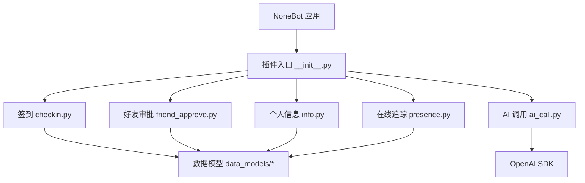
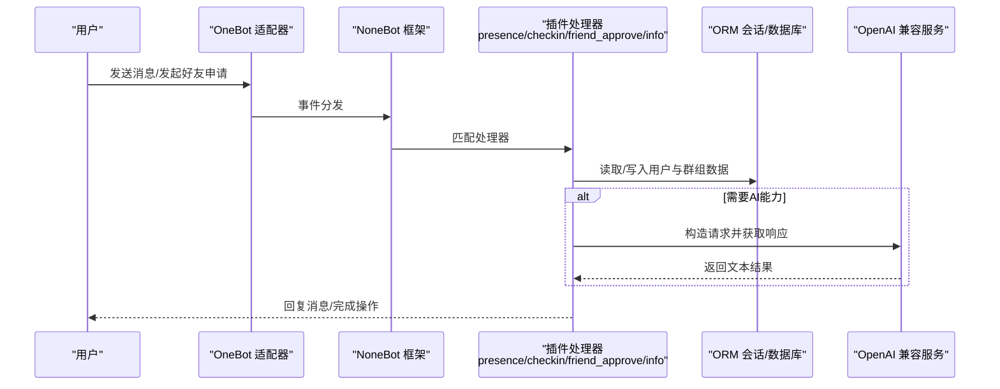
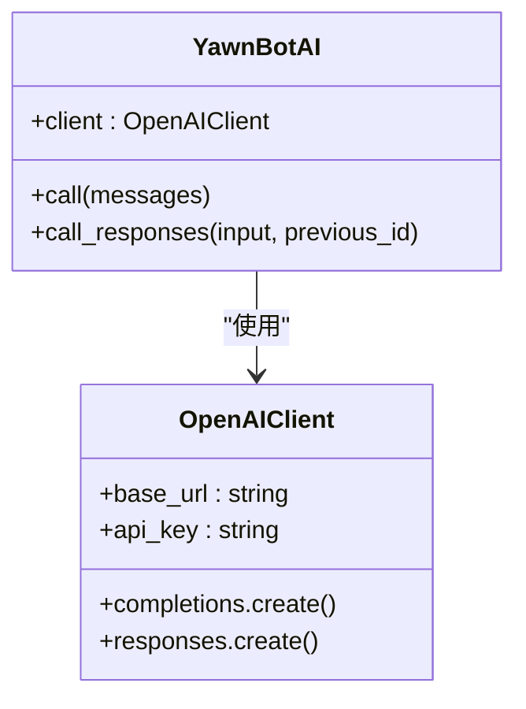
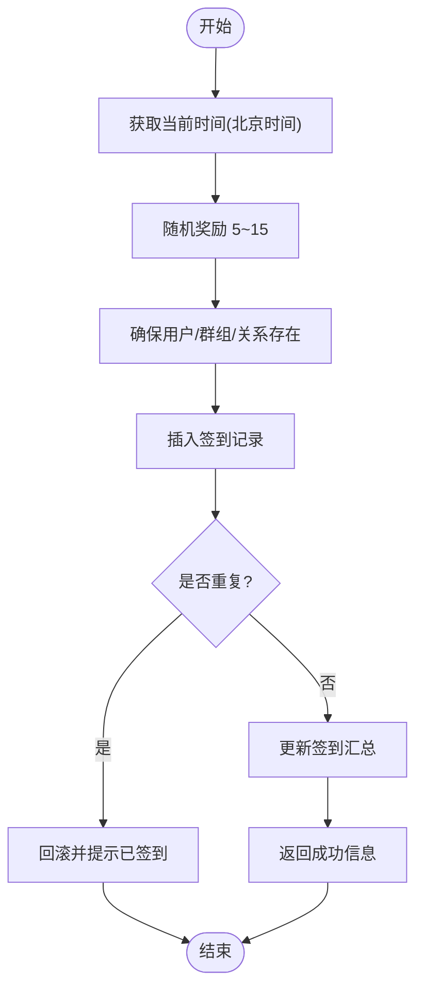
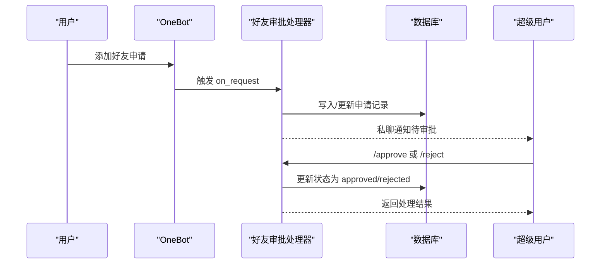
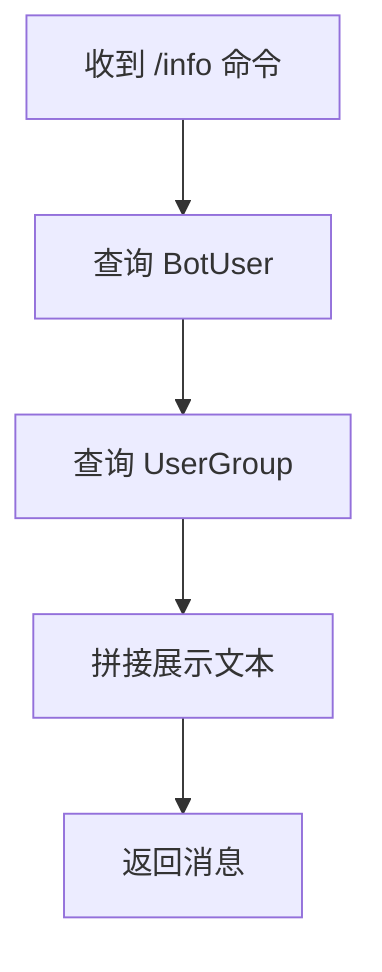
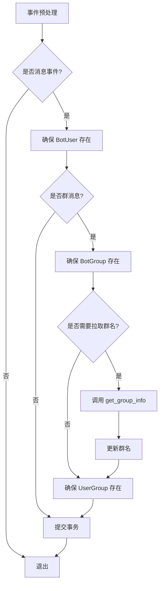
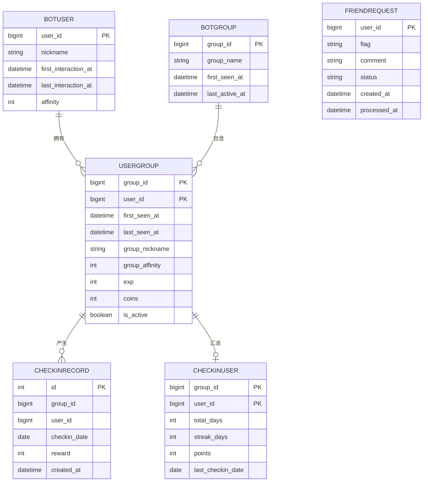
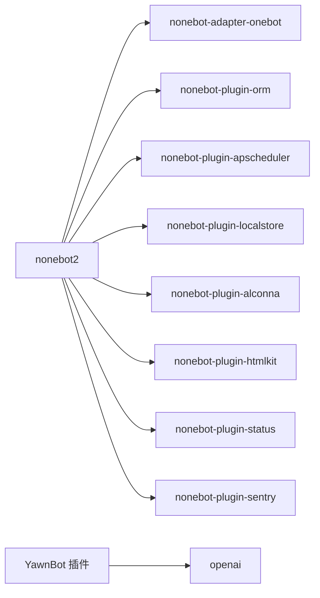

# AI功能集成

<cite>
**本文引用的文件**   
- [README.md](file://README.md)
- [pyproject.toml](file://pyproject.toml)
- [__init__.py](file://src/plugins/yawn_core/__init__.py)
- [ai_call.py](file://src/plugins/yawn_core/ai_call.py)
- [checkin.py](file://src/plugins/yawn_core/checkin.py)
- [friend_approve.py](file://src/plugins/yawn_core/friend_approve.py)
- [info.py](file://src/plugins/yawn_core/info.py)
- [presence.py](file://src/plugins/yawn_core/presence.py)
- [bot_user.py](file://src/plugins/yawn_core/data_models/bot_user.py)
- [bot_group.py](file://src/plugins/yawn_core/data_models/bot_group.py)
- [user_group.py](file://src/plugins/yawn_core/data_models/user_group.py)
- [checkin_record.py](file://src/plugins/yawn_core/data_models/checkin_record.py)
- [checkin_user.py](file://src/plugins/yawn_core/data_models/checkin_user.py)
- [friend_request.py](file://src/plugins/yawn_core/data_models/friend_request.py)
</cite>

## 目录
1. [简介](#简介)
2. [项目结构](#项目结构)
3. [核心组件](#核心组件)
4. [架构总览](#架构总览)
5. [详细组件分析](#详细组件分析)
6. [依赖关系分析](#依赖关系分析)
7. [性能考虑](#性能考虑)
8. [故障排查指南](#故障排查指南)
9. [结论](#结论)
10. [附录](#附录)

## 简介
本项目是基于 NoneBot2 的机器人插件集合，围绕“签到、好友申请审批、用户信息展示、在线状态追踪”等能力构建。其中 AI 能力通过 OpenAI SDK 接入第三方兼容接口，用于对话与响应生成。当前仓库已包含 AI 调用入口与示例代码，同时具备完善的数据模型与 ORM 支持，便于后续扩展更多 AI 驱动的功能（如智能回复、自动摘要、意图识别等）。

## 项目结构
- 插件根目录：src/plugins/yawn_core
  - 模块入口：__init__.py 负责加载子模块
  - AI 调用：ai_call.py 封装 OpenAI 客户端与示例调用
  - 业务模块：checkin.py、friend_approve.py、info.py、presence.py
  - 数据模型：data_models 下定义 ORM 实体与关系
- 配置与依赖：pyproject.toml 声明 nonebot2 生态与 openai 依赖
- 运行说明：README.md 提供基础启动流程

**图表来源** 
- [__init__.py:1-5](file://src/plugins/yawn_core/__init__.py#L1-L5)
- [checkin.py:1-147](file://src/plugins/yawn_core/checkin.py#L1-L147)
- [friend_approve.py:1-152](file://src/plugins/yawn_core/friend_approve.py#L1-L152)
- [info.py:1-40](file://src/plugins/yawn_core/info.py#L1-L40)
- [presence.py:1-103](file://src/plugins/yawn_core/presence.py#L1-L103)
- [ai_call.py:1-57](file://src/plugins/yawn_core/ai_call.py#L1-L57)

**章节来源**
- [README.md:1-13](file://README.md#L1-L13)
- [pyproject.toml:1-124](file://pyproject.toml#L1-L124)
- [__init__.py:1-5](file://src/plugins/yawn_core/__init__.py#L1-L5)

## 核心组件
- AI 调用模块（ai_call.py）
  - 使用 OpenAI SDK 初始化客户端，指向兼容 v1 接口的服务地址
  - 提供一次对话请求示例，并预留 responses API 的注释用法
  - 可作为后续业务模块的统一 AI 调用入口
- 签到模块（checkin.py）
  - 基于命令触发，记录用户签到历史、累计天数、连续天数与积分
  - 使用数据库唯一约束防止重复签到
- 好友审批模块（friend_approve.py）
  - 监听好友申请事件，持久化申请记录，并提供管理员审批命令
- 个人信息模块（info.py）
  - 查询并展示用户全局与群内信息（昵称、好感度、经验、金币、首次/最后活跃时间等）
- 在线追踪模块（presence.py）
  - 事件预处理，自动维护用户与群组的首次/最后交互时间，必要时拉取群名

**章节来源**
- [ai_call.py:1-57](file://src/plugins/yawn_core/ai_call.py#L1-L57)
- [checkin.py:1-147](file://src/plugins/yawn_core/checkin.py#L1-L147)
- [friend_approve.py:1-152](file://src/plugins/yawn_core/friend_approve.py#L1-L152)
- [info.py:1-40](file://src/plugins/yawn_core/info.py#L1-L40)
- [presence.py:1-103](file://src/plugins/yawn_core/presence.py#L1-L103)

## 架构总览
整体采用“事件驱动 + ORM 数据层 + 外部 AI 服务”的分层架构：
- 事件层：OneBot V11 消息与请求事件进入 NoneBot 路由
- 处理层：各模块 on_command/on_request/event_preprocessor 处理器执行业务逻辑
- 数据层：SQLAlchemy 模型与 nonebot-plugin-orm 会话管理
- 外部服务：OpenAI 兼容接口进行文本生成

**图表来源** 
- [presence.py:16-103](file://src/plugins/yawn_core/presence.py#L16-L103)
- [checkin.py:22-147](file://src/plugins/yawn_core/checkin.py#L22-L147)
- [friend_approve.py:23-152](file://src/plugins/yawn_core/friend_approve.py#L23-L152)
- [info.py:8-40](file://src/plugins/yawn_core/info.py#L8-L40)
- [ai_call.py:1-57](file://src/plugins/yawn_core/ai_call.py#L1-L57)

## 详细组件分析

### AI 调用模块（ai_call.py）
- 设计要点
  - 集中管理 OpenAI 客户端实例，统一 base_url 与 api_key
  - 提供一次对话的示例调用，便于快速验证连通性
  - 预留 responses API 的注释用法，为后续多轮记忆与结构化输出做准备
- 使用建议
  - 将 client 暴露为模块级单例，供其他模块复用
  - 对网络异常与超时进行捕获与重试
  - 根据业务需求选择 completions 或 responses 接口

**图表来源** 
- [ai_call.py:1-57](file://src/plugins/yawn_core/ai_call.py#L1-L57)

**章节来源**
- [ai_call.py:1-57](file://src/plugins/yawn_core/ai_call.py#L1-L57)

### 签到模块（checkin.py）
- 业务流程
  - 解析时间与随机奖励
  - 确保 BotUser/BotGroup/UserGroup 存在并更新活跃时间
  - 插入签到记录，利用唯一约束避免重复
  - 更新 CheckinUser 汇总（总天数、连续天数、积分）
- 关键特性
  - 时区：中国标准时间
  - 幂等：同一用户同群同日仅能签到一次
  - 反馈：返回成功信息与统计结果

**图表来源** 
- [checkin.py:22-147](file://src/plugins/yawn_core/checkin.py#L22-L147)

**章节来源**
- [checkin.py:1-147](file://src/plugins/yawn_core/checkin.py#L1-L147)

### 好友审批模块（friend_approve.py）
- 事件与命令
  - 监听好友申请事件，持久化 flag、comment、status
  - 提供 /approve、/reject、/pending 三个命令
- 权限控制
  - 仅超级用户可执行审批与列表命令
- 数据流
  - 申请记录覆盖更新，保证每个用户只有一条待处理记录

**图表来源** 
- [friend_approve.py:23-152](file://src/plugins/yawn_core/friend_approve.py#L23-L152)

**章节来源**
- [friend_approve.py:1-152](file://src/plugins/yawn_core/friend_approve.py#L1-L152)

### 个人信息模块（info.py）
- 功能
  - 聚合 BotUser 与 UserGroup 的信息，包括昵称、好感度、经验、金币、首次/最后活跃时间
- 数据来源
  - 直接查询 ORM 模型，无额外网络请求

**图表来源** 
- [info.py:8-40](file://src/plugins/yawn_core/info.py#L8-L40)

**章节来源**
- [info.py:1-40](file://src/plugins/yawn_core/info.py#L1-L40)

### 在线追踪模块（presence.py）
- 功能
  - 事件预处理，自动创建/更新用户与群组记录
  - 首次见到群组时尝试拉取群名
- 关键点
  - 区分私聊与群聊场景
  - 失败容错：拉取群名失败不影响主流程

**图表来源** 
- [presence.py:16-103](file://src/plugins/yawn_core/presence.py#L16-L103)

**章节来源**
- [presence.py:1-103](file://src/plugins/yawn_core/presence.py#L1-L103)

### 数据模型（data_models/*）
- 实体关系概览
  - BotUser：全局用户
  - BotGroup：群组
  - UserGroup：用户与群组的关系（含群内属性）
  - CheckinRecord：签到历史记录（唯一约束：群+用户+日期）
  - CheckinUser：用户在群的签到汇总
  - FriendRequest：好友申请记录（按用户去重）

**图表来源** 
- [bot_user.py:12-32](file://src/plugins/yawn_core/data_models/bot_user.py#L12-L32)
- [bot_group.py:12-29](file://src/plugins/yawn_core/data_models/bot_group.py#L12-L29)
- [user_group.py:15-61](file://src/plugins/yawn_core/data_models/user_group.py#L15-L61)
- [checkin_record.py:12-53](file://src/plugins/yawn_core/data_models/checkin_record.py#L12-L53)
- [checkin_user.py:12-47](file://src/plugins/yawn_core/data_models/checkin_user.py#L12-L47)
- [friend_request.py:9-36](file://src/plugins/yawn_core/data_models/friend_request.py#L9-L36)

**章节来源**
- [bot_user.py:1-32](file://src/plugins/yawn_core/data_models/bot_user.py#L1-L32)
- [bot_group.py:1-29](file://src/plugins/yawn_core/data_models/bot_group.py#L1-L29)
- [user_group.py:1-61](file://src/plugins/yawn_core/data_models/user_group.py#L1-L61)
- [checkin_record.py:1-53](file://src/plugins/yawn_core/data_models/checkin_record.py#L1-L53)
- [checkin_user.py:1-47](file://src/plugins/yawn_core/data_models/checkin_user.py#L1-L47)
- [friend_request.py:1-36](file://src/plugins/yawn_core/data_models/friend_request.py#L1-L36)

## 依赖关系分析
- 运行时依赖
  - nonebot2 生态：onebot 适配器、ORM、APScheduler、LocalStore、Alconna、HTMLKit、Status、Sentry
  - openai：用于调用兼容 v1 的 AI 服务
- 插件加载
  - pyproject.toml 中声明插件目录与内置插件
  - 插件入口 __init__.py 显式导入子模块以触发注册

**图表来源** 
- [pyproject.toml:1-124](file://pyproject.toml#L1-L124)

**章节来源**
- [pyproject.toml:1-124](file://pyproject.toml#L1-L124)
- [__init__.py:1-5](file://src/plugins/yawn_core/__init__.py#L1-L5)

## 性能考虑
- 数据库层面
  - 使用唯一约束与外键约束保障一致性与完整性
  - 签到记录按天唯一，避免重复写入
- 网络层面
  - AI 调用应增加超时与重试策略，避免阻塞事件处理
  - 批量操作尽量合并事务提交，减少 IO 次数
- 并发与异步
  - 所有处理器均为异步，注意避免在回调中进行同步阻塞操作
  - 对高频事件（如 presence）保持轻量逻辑，避免复杂计算

[本节为通用指导，不直接分析具体文件]

## 故障排查指南
- AI 调用失败
  - 检查 base_url 与 api_key 是否正确
  - 查看网络连通性与代理设置
  - 捕获异常并记录日志，定位错误码与消息
- 签到重复
  - 确认数据库唯一约束生效
  - 检查事务提交与回滚路径
- 好友审批无效
  - 确认超级用户权限配置
  - 检查 flag 与状态流转是否符合预期
- 用户信息缺失
  - 确认 presence 预处理是否正常运行
  - 检查数据库连接与会话生命周期

**章节来源**
- [ai_call.py:1-57](file://src/plugins/yawn_core/ai_call.py#L1-L57)
- [checkin.py:100-147](file://src/plugins/yawn_core/checkin.py#L100-L147)
- [friend_approve.py:66-152](file://src/plugins/yawn_core/friend_approve.py#L66-L152)
- [presence.py:16-103](file://src/plugins/yawn_core/presence.py#L16-L103)

## 结论
本仓库已具备完善的机器人插件骨架与数据模型，AI 能力通过 OpenAI SDK 接入，便于后续扩展智能对话、自动化任务与数据分析等功能。建议在现有基础上：
- 将 ai_call.py 抽象为统一的 AI 服务层，提供重试、缓存与限流
- 结合 presence 与 info 模块，实现个性化 AI 回复与上下文感知
- 引入定时任务（APScheduler）进行数据清理与报表生成

[本节为总结性内容，不直接分析具体文件]

## 附录
- 启动与开发
  - 使用 nb create 生成项目，nb plugin create 创建插件
  - 在 src/plugins 下编写插件，nb run --reload 启动调试
- 文档参考
  - NoneBot 官方文档：https://nonebot.dev/

**章节来源**
- [README.md:1-13](file://README.md#L1-L13)