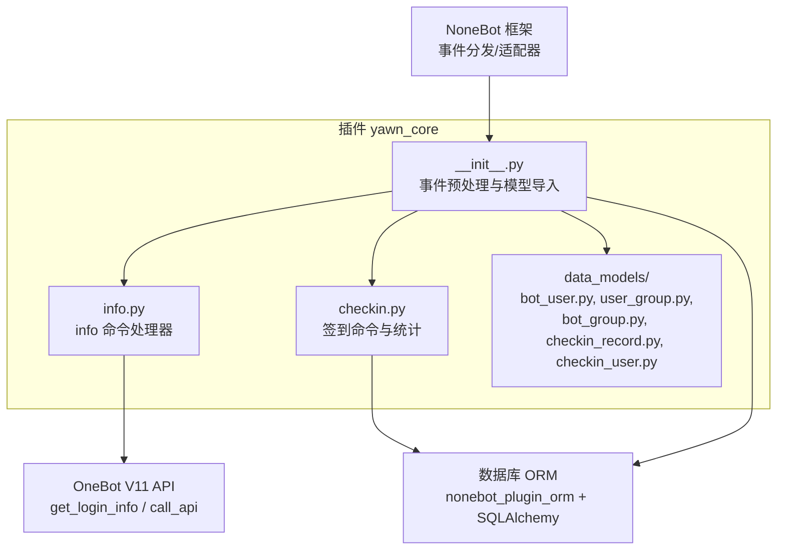
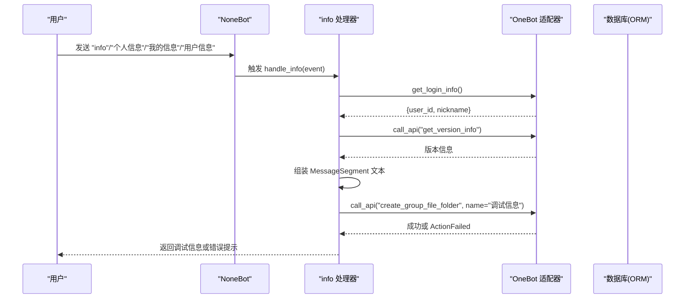
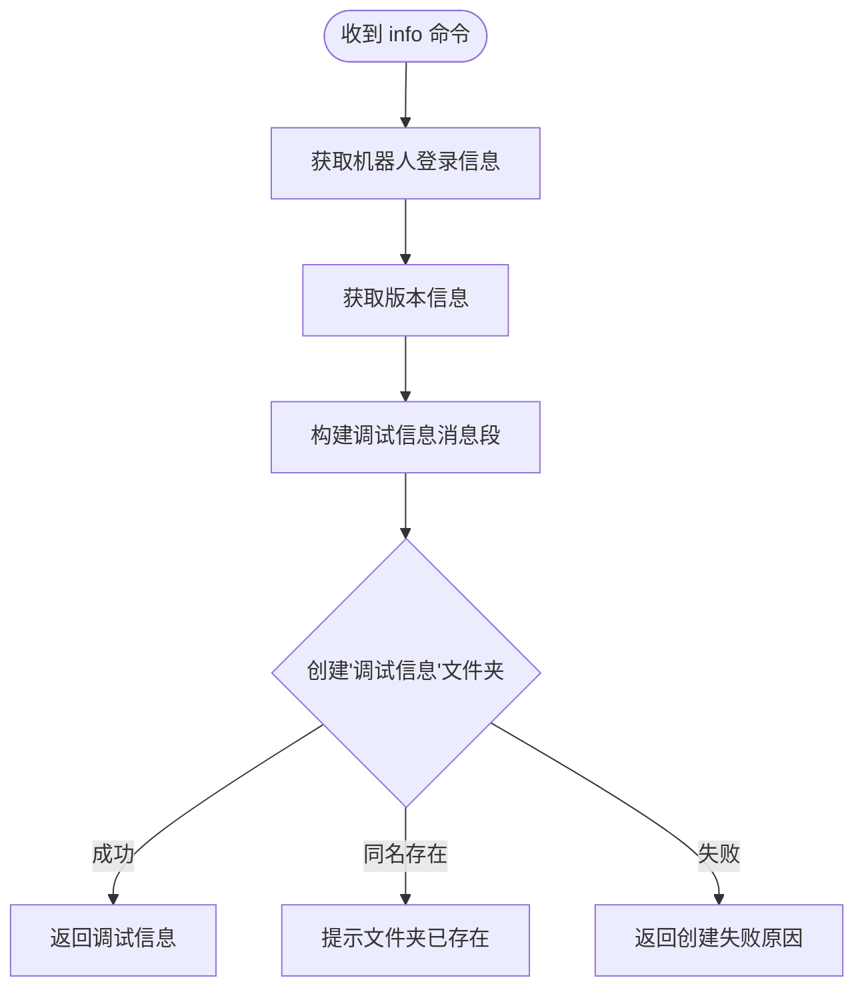
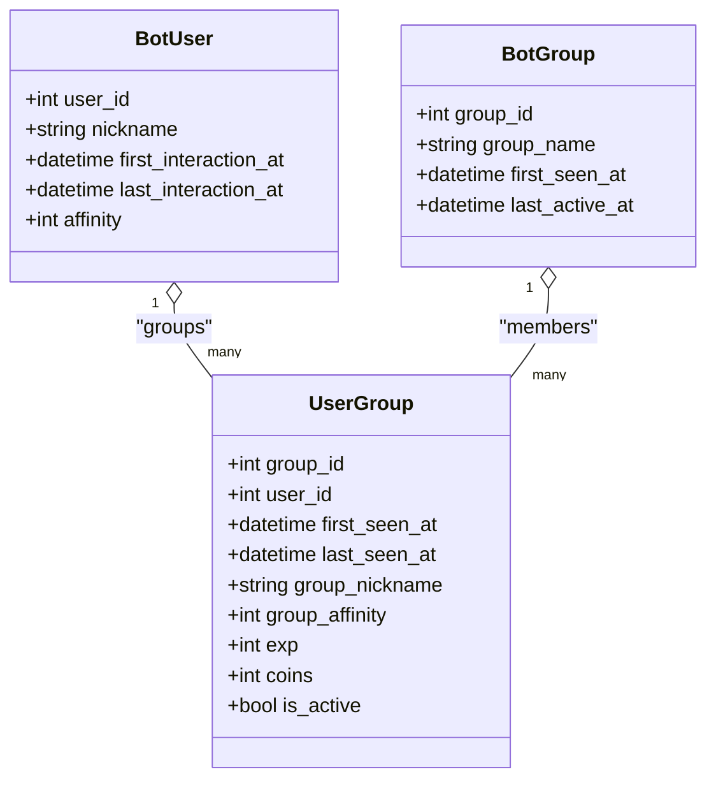
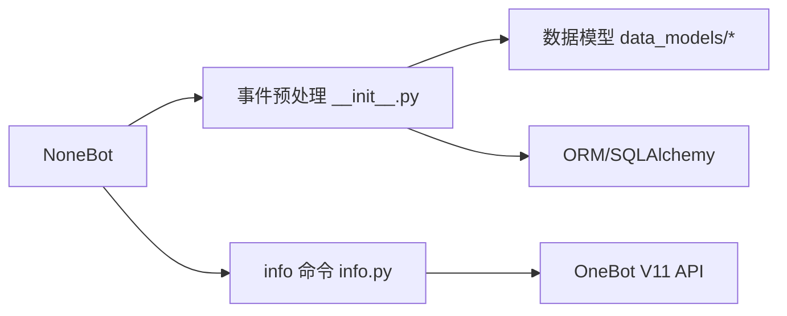

# 信息查询系统

<cite>
**本文引用的文件**   
- [info.py](file://src/plugins/yawn_core/info.py)
- [__init__.py](file://src/plugins/yawn_core/__init__.py)
- [bot_user.py](file://src/plugins/yawn_core/data_models/bot_user.py)
- [user_group.py](file://src/plugins/yawn_core/data_models/user_group.py)
- [bot_group.py](file://src/plugins/yawn_core/data_models/bot_group.py)
- [checkin_record.py](file://src/plugins/yawn_core/data_models/checkin_record.py)
- [checkin_user.py](file://src/plugins/yawn_core/data_models/checkin_user.py)
- [checkin.py](file://src/plugins/yawn_core/checkin.py)
- [README.md](file://README.md)
</cite>

## 目录
1. [简介](#简介)
2. [项目结构](#项目结构)
3. [核心组件](#核心组件)
4. [架构总览](#架构总览)
5. [详细组件分析](#详细组件分析)
6. [依赖关系分析](#依赖关系分析)
7. [性能与缓存策略](#性能与缓存策略)
8. [权限控制与扩展指南](#权限控制与扩展指南)
9. [故障排查](#故障排查)
10. [结论](#结论)

## 简介
本文件面向 YawnBot 的信息查询系统，重点说明 info 命令的实现逻辑、用户信息查询接口、调试信息输出功能，以及查询结果的格式化展示、数据统计计算、实时信息获取机制。同时给出消息段构建、异步数据处理、权限控制、结果缓存策略与性能优化建议，并提供自定义查询接口的扩展指南。

## 项目结构
YawnBot 采用插件化架构，yawn_core 插件负责基础的用户/群组追踪、签到统计与信息查询等能力。核心文件分布如下：
- 插件入口与事件预处理：src/plugins/yawn_core/__init__.py
- 信息查询命令：src/plugins/yawn_core/info.py
- 数据模型（ORM）：src/plugins/yawn_core/data_models/*
- 签到模块（用于数据统计参考）：src/plugins/yawn_core/checkin.py

图表来源
- [__init__.py:1-80](file://src/plugins/yawn_core/__init__.py#L1-L80)
- [info.py:1-39](file://src/plugins/yawn_core/info.py#L1-L39)
- [checkin.py:1-147](file://src/plugins/yawn_core/checkin.py#L1-L147)
- [bot_user.py:1-32](file://src/plugins/yawn_core/data_models/bot_user.py#L1-L32)
- [user_group.py:1-61](file://src/plugins/yawn_core/data_models/user_group.py#L1-L61)
- [bot_group.py:1-29](file://src/plugins/yawn_core/data_models/bot_group.py#L1-L29)
- [checkin_record.py:1-53](file://src/plugins/yawn_core/data_models/checkin_record.py#L1-L53)
- [checkin_user.py:1-47](file://src/plugins/yawn_core/data_models/checkin_user.py#L1-L47)

章节来源
- [README.md:1-13](file://README.md#L1-L13)

## 核心组件
- 事件预处理与用户/群组追踪：在插件初始化时注册事件预处理器，自动维护 BotUser、BotGroup、UserGroup 的“首次交互/首次发言”时间戳与昵称更新。
- 信息查询命令：通过 on_command 注册 info 命令及其别名，处理群消息事件，调用 OneBot API 获取机器人登录信息与版本信息，并构造消息返回。
- 数据模型：基于 SQLAlchemy 定义用户、群组、签到记录与汇总等实体，提供外键约束与级联删除，保证数据一致性。

章节来源
- [__init__.py:16-79](file://src/plugins/yawn_core/__init__.py#L16-L79)
- [info.py:6-39](file://src/plugins/yawn_core/info.py#L6-L39)
- [bot_user.py:12-32](file://src/plugins/yawn_core/data_models/bot_user.py#L12-L32)
- [user_group.py:15-61](file://src/plugins/yawn_core/data_models/user_group.py#L15-L61)
- [bot_group.py:12-29](file://src/plugins/yawn_core/data_models/bot_group.py#L12-L29)

## 架构总览
info 命令的执行流程如下：
- 接收群消息事件
- 获取机器人登录信息与版本信息
- 组装调试信息文本
- 尝试创建“调试信息”文件夹，捕获同名冲突异常并友好提示

图表来源
- [info.py:10-39](file://src/plugins/yawn_core/info.py#L10-L39)

章节来源
- [info.py:10-39](file://src/plugins/yawn_core/info.py#L10-L39)

## 详细组件分析

### 信息查询命令（info）
- 命令注册与别名：支持“info”“个人信息”“我的信息”“用户信息”。
- 实时信息获取：
  - 使用 get_login_info 获取机器人 ID 与昵称。
  - 使用 call_api("get_version_info") 获取版本信息。
- 消息段构建：使用 MessageSegment.text 拼接多行文本，包含调试信息、版本、昵称与 ID。
- 异步处理：所有 I/O 操作均为异步 await。
- 资源管理：尝试创建“调试信息”文件夹，若已存在则返回友好提示；其他失败情况返回错误信息。

图表来源
- [info.py:10-39](file://src/plugins/yawn_core/info.py#L10-L39)

章节来源
- [info.py:6-39](file://src/plugins/yawn_core/info.py#L6-L39)

### 用户与群组追踪（事件预处理）
- 新用户首次对话：创建 BotUser，记录首次交互时间与昵称。
- 群内首次发言：创建 BotGroup 与 UserGroup，记录首次出现时间与群昵称。
- 后续消息：更新 last_interaction_at/last_active_at/last_seen_at，并同步昵称。
- 事务提交：每次事件处理完成后统一 commit。

图表来源
- [bot_user.py:12-32](file://src/plugins/yawn_core/data_models/bot_user.py#L12-L32)
- [bot_group.py:12-29](file://src/plugins/yawn_core/data_models/bot_group.py#L12-L29)
- [user_group.py:15-61](file://src/plugins/yawn_core/data_models/user_group.py#L15-L61)

章节来源
- [__init__.py:16-79](file://src/plugins/yawn_core/__init__.py#L16-L79)

### 数据统计与签到（参考实现）
- 签到记录：CheckinRecord 保证每人每天每群仅一次签到（唯一约束）。
- 签到汇总：CheckinUser 累计 total_days、streak_days、points 与 last_checkin_date。
- 业务逻辑：随机奖励积分，更新连续签到天数，失败回滚并提示重复签到。

图表来源
- [checkin.py:41-146](file://src/plugins/yawn_core/checkin.py#L41-L146)
- [checkin_record.py:12-53](file://src/plugins/yawn_core/data_models/checkin_record.py#L12-L53)
- [checkin_user.py:12-47](file://src/plugins/yawn_core/data_models/checkin_user.py#L12-L47)

章节来源
- [checkin.py:41-146](file://src/plugins/yawn_core/checkin.py#L41-L146)

## 依赖关系分析
- NoneBot 框架：事件分发、适配器、命令注册。
- OneBot V11 适配器：提供 get_login_info、call_api 等接口。
- nonebot_plugin_orm：异步会话与 ORM 模型绑定。
- SQLAlchemy：表结构、关系映射、约束与级联删除。

图表来源
- [__init__.py:1-13](file://src/plugins/yawn_core/__init__.py#L1-L13)
- [info.py:1-6](file://src/plugins/yawn_core/info.py#L1-L6)

章节来源
- [__init__.py:1-13](file://src/plugins/yawn_core/__init__.py#L1-L13)
- [info.py:1-6](file://src/plugins/yawn_core/info.py#L1-L6)

## 性能与缓存策略
当前 info 命令未实现查询结果缓存，每次请求均直接调用 OneBot API 并构造消息。为提升性能与稳定性，建议：
- 结果缓存
  - 对 get_login_info 与 get_version_info 的结果进行短期缓存（如内存字典+过期时间），避免频繁网络调用。
  - 针对用户/群组统计查询（未来扩展）引入 Redis 或本地 LRU 缓存。
- 异步并发
  - 将独立 I/O 操作并行执行（例如先并行获取登录信息与版本信息），减少响应延迟。
- 限流与降级
  - 对高频命令设置速率限制，防止滥用。
  - 当 OneBot API 不可用时，返回离线模式或默认值，保障可用性。
- 数据库优化
  - 对常用查询字段建立索引（如 user_id、group_id、日期字段）。
  - 批量写入时使用 flush/commit 合理拆分，降低锁竞争。

[本节为通用性能建议，不直接分析具体文件]

## 权限控制与扩展指南

### 权限控制
- 当前 info 命令未实现权限校验，任何用户均可触发。建议在命令处理器中增加权限判断：
  - 白名单：仅允许管理员或特定角色执行。
  - 黑名单：禁止被封禁用户执行。
  - 群级别：根据群配置决定是否启用该命令。
- 实现方式：在 handle_info 入口处读取事件上下文中的权限信息，结合数据库或配置文件进行判定。

### 扩展自定义查询接口
- 新增查询命令
  - 使用 on_command 注册新命令，并在处理器中注入 async_scoped_session 以访问数据库。
  - 复用事件预处理中维护的 BotUser/UserGroup/BotGroup 模型进行查询。
- 数据聚合示例
  - 统计某用户在某群的活跃天数、最近发言时间、经验/金币等，可通过 UserGroup 字段与 CheckinRecord 关联查询。
- 消息格式
  - 使用 MessageSegment 组合文本、图片、@提及等，保持可读性与美观。
- 错误处理
  - 捕获 OneBot API 异常（ActionFailed）与数据库异常（IntegrityError），返回友好提示。
- 缓存与监控
  - 为热点查询添加缓存层，并记录关键指标（QPS、延迟、错误率）。

章节来源
- [info.py:6-39](file://src/plugins/yawn_core/info.py#L6-L39)
- [__init__.py:16-79](file://src/plugins/yawn_core/__init__.py#L16-L79)
- [checkin.py:109-114](file://src/plugins/yawn_core/checkin.py#L109-L114)

## 故障排查
- 常见问题
  - 同名文件夹已存在：info 命令会捕获 ActionFailed 并提示“文件夹已经存在，不需要重复创建”。
  - 创建文件夹失败：返回具体 wording 错误信息，便于定位权限或参数问题。
  - 重复签到：通过 IntegrityError 捕获并回滚，提示“今天已经签到过了哦~”。
- 排查步骤
  - 查看日志输出（logger.info）确认事件预处理是否成功创建/更新记录。
  - 检查 OneBot 适配器状态与 API 返回值。
  - 核对数据库约束与外键关系是否正确迁移。

章节来源
- [info.py:32-39](file://src/plugins/yawn_core/info.py#L32-L39)
- [checkin.py:109-114](file://src/plugins/yawn_core/checkin.py#L109-L114)

## 结论
YawnBot 的 yawn_core 插件通过事件预处理实现了用户与群组的基础追踪，info 命令提供了简洁的调试信息输出与文件夹管理能力。结合签到模块的数据统计实践，可进一步扩展丰富的信息查询与统计功能。建议引入缓存、并发与权限控制以提升性能与安全性，并通过统一的 ORM 模型与消息段构建规范，保持代码的可维护性与可扩展性。