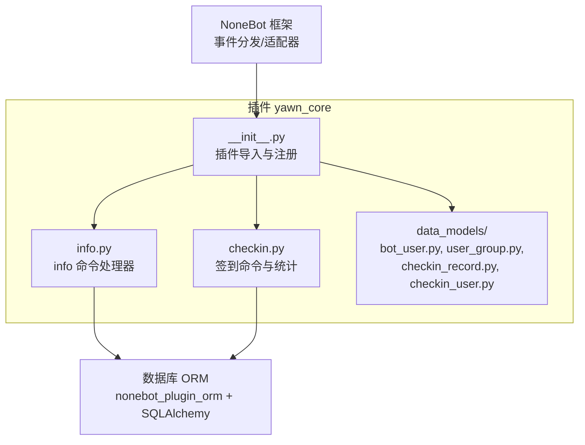
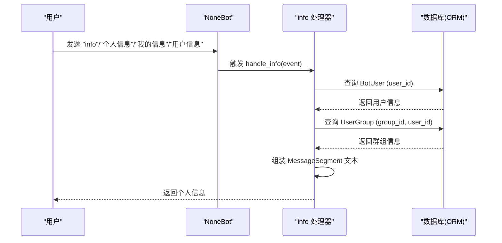
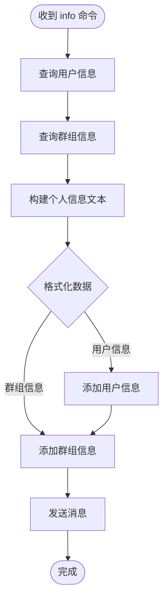
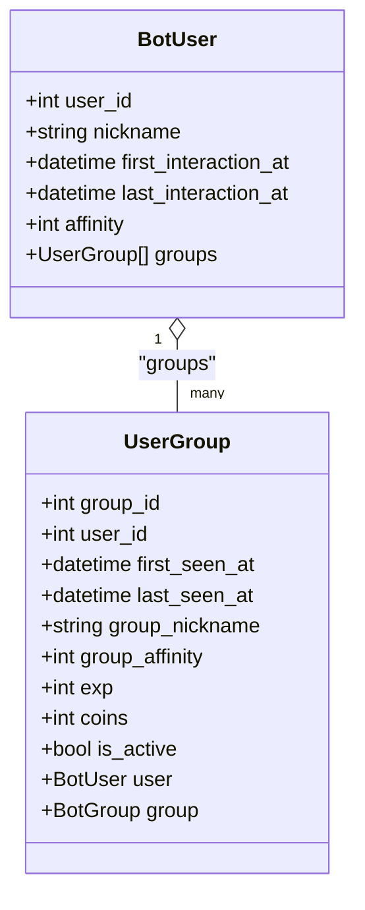
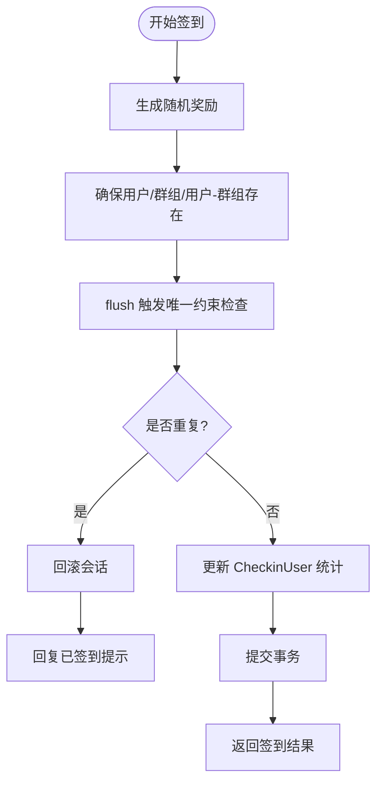
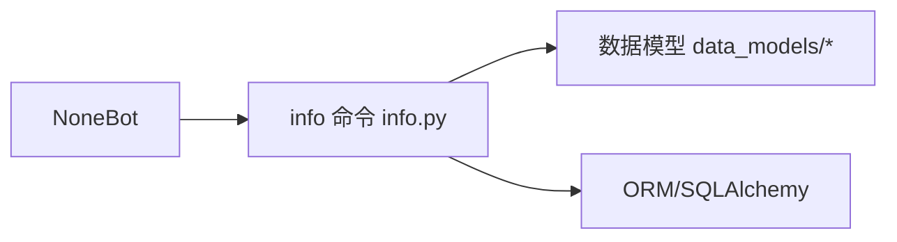

# 信息查询系统

<cite>
**本文引用的文件**   
- [info.py](file://src/plugins/yawn_core/info.py)
- [__init__.py](file://src/plugins/yawn_core/__init__.py)
- [bot_user.py](file://src/plugins/yawn_core/data_models/bot_user.py)
- [user_group.py](file://src/plugins/yawn_core/data_models/user_group.py)
- [checkin_record.py](file://src/plugins/yawn_core/data_models/checkin_record.py)
- [checkin_user.py](file://src/plugins/yawn_core/data_models/checkin_user.py)
- [checkin.py](file://src/plugins/yawn_core/checkin.py)
- [README.md](file://README.md)
</cite>

## 更新摘要
**变更内容**   
- 更新了info命令的实际实现逻辑，从OneBot API调用改为数据库查询
- 修正了用户信息获取方式，现在直接从数据库读取用户和群组信息
- 简化了消息构建逻辑，直接输出格式化的个人信息
- 移除了文件夹创建功能，专注于用户信息查询

## 目录
1. [简介](#简介)
2. [项目结构](#项目结构)
3. [核心组件](#核心组件)
4. [架构总览](#架构总览)
5. [详细组件分析](#详细组件分析)
6. [依赖关系分析](#依赖关系分析)
7. [性能与缓存策略](#性能与缓存策略)
8. [权限控制与扩展指南](#权限控制与扩展指南)
9. [故障排查](#故障排查)
10. [结论](#结论)

## 简介
本文件面向 YawnBot 的信息查询系统，重点说明 info 命令的实现逻辑、用户信息查询接口、调试信息输出功能，以及查询结果的格式化展示、数据统计计算、实时信息获取机制。同时给出消息段构建、异步数据处理、权限控制、结果缓存策略与性能优化建议，并提供自定义查询接口的扩展指南。

## 项目结构
YawnBot 采用插件化架构，yawn_core 插件负责基础的用户/群组追踪、签到统计与信息查询等能力。核心文件分布如下：
- 插件入口与事件预处理：src/plugins/yawn_core/__init__.py
- 信息查询命令：src/plugins/yawn_core/info.py
- 数据模型（ORM）：src/plugins/yawn_core/data_models/*
- 签到模块（用于数据统计参考）：src/plugins/yawn_core/checkin.py

图表来源
- [__init__.py:1-4](file://src/plugins/yawn_core/__init__.py#L1-L4)
- [info.py:1-40](file://src/plugins/yawn_core/info.py#L1-L40)
- [checkin.py:1-147](file://src/plugins/yawn_core/checkin.py#L1-L147)
- [bot_user.py:1-32](file://src/plugins/yawn_core/data_models/bot_user.py#L1-L32)
- [user_group.py:1-61](file://src/plugins/yawn_core/data_models/user_group.py#L1-L61)
- [checkin_record.py:1-53](file://src/plugins/yawn_core/data_models/checkin_record.py#L1-L53)
- [checkin_user.py:1-47](file://src/plugins/yawn_core/data_models/checkin_user.py#L1-L47)

章节来源
- [README.md:1-13](file://README.md#L1-L13)

## 核心组件
- 信息查询命令：通过 on_command 注册 info 命令及其别名（个人信息、我的信息、用户信息），处理群消息事件，从数据库读取用户信息和群组信息，并构造格式化的消息返回。
- 数据模型：基于 SQLAlchemy 定义用户、群组、签到记录与汇总等实体，提供外键约束与级联删除，保证数据一致性。
- 异步会话管理：使用 async_scoped_session 进行数据库操作，确保线程安全。

章节来源
- [info.py:8-10](file://src/plugins/yawn_core/info.py#L8-L10)
- [bot_user.py:12-32](file://src/plugins/yawn_core/data_models/bot_user.py#L12-L32)
- [user_group.py:15-61](file://src/plugins/yawn_core/data_models/user_group.py#L15-L61)

## 架构总览
info 命令的执行流程如下：
- 接收群消息事件
- 从数据库读取用户信息和群组信息
- 组装格式化的个人信息文本
- 返回消息给用户

图表来源
- [info.py:13-39](file://src/plugins/yawn_core/info.py#L13-L39)

章节来源
- [info.py:13-39](file://src/plugins/yawn_core/info.py#L13-L39)

## 详细组件分析

### 信息查询命令（info）
- 命令注册与别名：支持"info""个人信息""我的信息""用户信息"四个别名。
- 数据库查询：
  - 使用 session.get(BotUser, user_id) 获取用户基本信息。
  - 使用 session.get(UserGroup, (group_id, user_id)) 获取用户在特定群组中的信息。
- 消息构建：使用 MessageSegment.text 拼接多行文本，包含昵称、好感度、时间戳、群名片、经验值等信息。
- 异步处理：所有 I/O 操作均为异步 await。
- 空值处理：对可能为空的字段提供默认值显示（如"未知"、"未设置"）。

图表来源
- [info.py:13-39](file://src/plugins/yawn_core/info.py#L13-L39)

章节来源
- [info.py:8-39](file://src/plugins/yawn_core/info.py#L8-L39)

### 用户与群组数据模型
- BotUser：存储全局用户信息，包括昵称、首次交互时间、最后活跃时间、全局好感度。
- UserGroup：存储用户与群组的关系信息，包括群名片、群内好感度、经验值、金币、活跃度等。
- 关系映射：BotUser 与 UserGroup 是一对多关系，UserGroup 与 BotGroup 是多对一关系。

图表来源
- [bot_user.py:12-32](file://src/plugins/yawn_core/data_models/bot_user.py#L12-L32)
- [user_group.py:15-61](file://src/plugins/yawn_core/data_models/user_group.py#L15-L61)

章节来源
- [bot_user.py:12-32](file://src/plugins/yawn_core/data_models/bot_user.py#L12-L32)
- [user_group.py:15-61](file://src/plugins/yawn_core/data_models/user_group.py#L15-L61)

### 数据统计与签到（参考实现）
- 签到记录：CheckinRecord 保证每人每天每群仅一次签到（唯一约束）。
- 签到汇总：CheckinUser 累计 total_days、streak_days、points 与 last_checkin_date。
- 业务逻辑：随机奖励积分，更新连续签到天数，失败回滚并提示重复签到。

图表来源
- [checkin.py:41-146](file://src/plugins/yawn_core/checkin.py#L41-L146)
- [checkin_record.py:12-53](file://src/plugins/yawn_core/data_models/checkin_record.py#L12-L53)
- [checkin_user.py:12-47](file://src/plugins/yawn_core/data_models/checkin_user.py#L12-L47)

章节来源
- [checkin.py:41-146](file://src/plugins/yawn_core/checkin.py#L41-L146)

## 依赖关系分析
- NoneBot 框架：事件分发、适配器、命令注册。
- nonebot_plugin_orm：异步会话与 ORM 模型绑定。
- SQLAlchemy：表结构、关系映射、约束与级联删除。

图表来源
- [info.py:1-6](file://src/plugins/yawn_core/info.py#L1-L6)

章节来源
- [info.py:1-6](file://src/plugins/yawn_core/info.py#L1-L6)

## 性能与缓存策略
当前 info 命令每次请求都执行数据库查询，为提升性能与稳定性，建议：
- 结果缓存
  - 对用户信息查询结果进行短期缓存（如内存字典+过期时间），避免频繁数据库查询。
  - 针对热点用户信息可考虑 Redis 缓存。
- 异步并发
  - 将独立的数据查询并行执行（例如同时查询用户信息和群组信息），减少响应延迟。
- 数据库优化
  - 对常用查询字段建立索引（如 user_id、group_id、日期字段）。
  - 批量写入时使用 flush/commit 合理拆分，降低锁竞争。
- 错误处理
  - 当数据库不可用时，返回友好的错误提示或默认值。

[本节为通用性能建议，不直接分析具体文件]

## 权限控制与扩展指南

### 权限控制
- 当前 info 命令未实现权限校验，任何用户均可触发。建议在命令处理器中增加权限判断：
  - 白名单：仅允许管理员或特定角色执行。
  - 黑名单：禁止被封禁用户执行。
  - 群级别：根据群配置决定是否启用该命令。
- 实现方式：在 handle_info 入口处读取事件上下文中的权限信息，结合数据库或配置文件进行判定。

### 扩展自定义查询接口
- 新增查询命令
  - 使用 on_command 注册新命令，并在处理器中注入 async_scoped_session 以访问数据库。
  - 复用事件预处理中维护的 BotUser/UserGroup/BotGroup 模型进行查询。
- 数据聚合示例
  - 统计某用户在某群的活跃天数、最近发言时间、经验/金币等，可通过 UserGroup 字段与 CheckinRecord 关联查询。
- 消息格式
  - 使用 MessageSegment 组合文本、图片、@提及等，保持可读性与美观。
- 错误处理
  - 捕获数据库异常（如 IntegrityError），返回友好提示。
- 缓存与监控
  - 为热点查询添加缓存层，并记录关键指标（QPS、延迟、错误率）。

章节来源
- [info.py:8-39](file://src/plugins/yawn_core/info.py#L8-L39)

## 故障排查
- 常见问题
  - 用户信息不存在：当用户从未与机器人交互时，bot_user 可能为空，需要处理空值情况。
  - 群组信息缺失：用户可能在其他群组但未在当前群组发言，user_group 可能为空。
  - 数据库连接问题：检查数据库连接状态和权限配置。
- 排查步骤
  - 查看日志输出确认数据库查询是否成功。
  - 检查数据库表中是否有对应的用户和群组记录。
  - 验证用户ID和群组ID是否正确传递。

章节来源
- [info.py:18-38](file://src/plugins/yawn_core/info.py#L18-L38)

## 结论
YawnBot 的 yawn_core 插件通过 info 命令提供了简洁的用户信息查询功能，支持多个命令别名，直接从数据库读取用户和群组信息并格式化输出。结合数据模型的完善设计，可以进一步扩展丰富的信息查询与统计功能。建议引入缓存、并发查询与权限控制以提升性能与安全性，并通过统一的 ORM 模型与消息段构建规范，保持代码的可维护性与可扩展性。