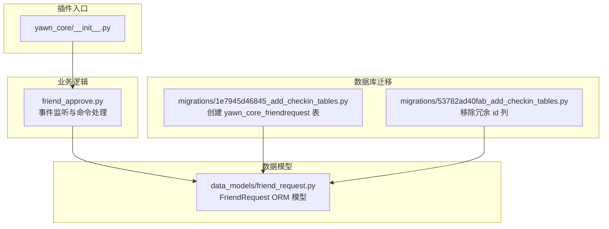
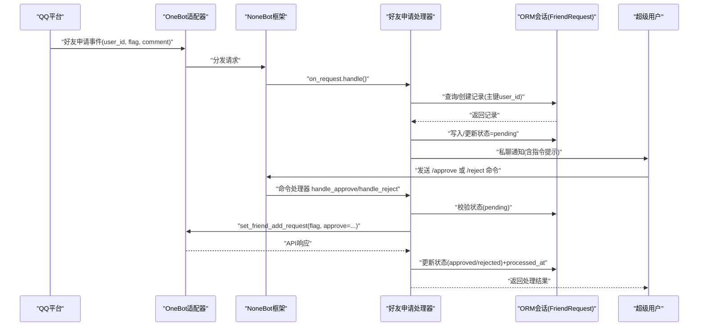
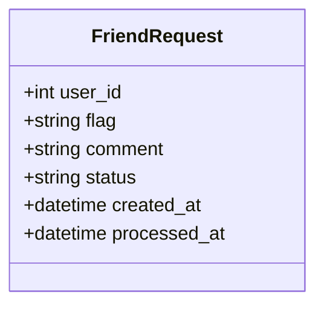
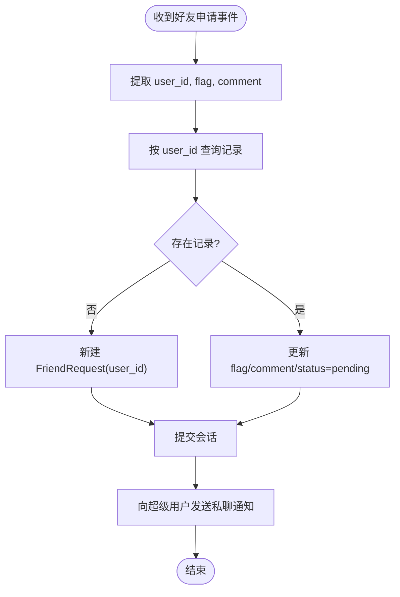
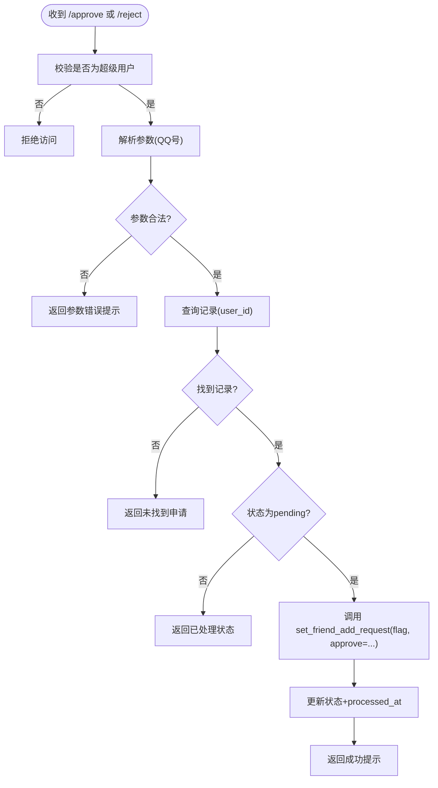
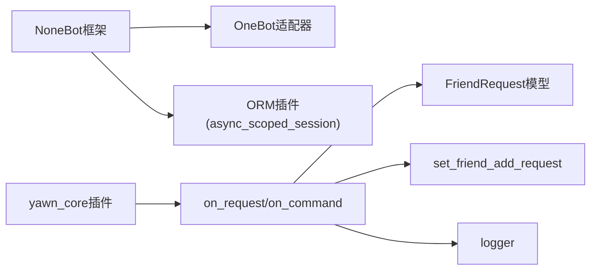

# 好友申请管理

<cite>
**本文引用的文件**   
- [friend_request.py](file://src/plugins/yawn_core/data_models/friend_request.py)
- [friend_approve.py](file://src/plugins/yawn_core/friend_approve.py)
- [__init__.py](file://src/plugins/yawn_core/__init__.py)
- [README.md](file://README.md)
- [pyproject.toml](file://pyproject.toml)
- [1e7945d46845_add_checkin_tables.py](file://src/plugins/yawn_core/migrations/1e7945d46845_add_checkin_tables.py)
- [53782ad40fab_add_checkin_tables.py](file://src/plugins/yawn_core/migrations/53782ad40fab_add_checkin_tables.py)
</cite>

## 目录
1. [简介](#简介)
2. [项目结构](#项目结构)
3. [核心组件](#核心组件)
4. [架构总览](#架构总览)
5. [详细组件分析](#详细组件分析)
6. [依赖关系分析](#依赖关系分析)
7. [性能考量](#性能考量)
8. [故障排除指南](#故障排除指南)
9. [结论](#结论)
10. [附录：管理员使用指南](#附录管理员使用指南)

## 简介
本文件为 YawnBot 的“好友申请管理”功能提供完整技术文档。内容涵盖：
- OneBot 事件捕获与处理机制（好友申请事件）
- 数据模型设计（FriendRequest），包括字段、状态机与时间戳
- 超级用户权限控制与命令接口（批准、拒绝、待审批列表）
- 与 QQ 平台的交互流程（set_friend_add_request）
- 错误处理与日志记录最佳实践
- 管理员操作指南与常见问题排查

该功能通过 NoneBot2 + OneBot V11 适配器实现，使用 nonebot-plugin-orm 进行持久化存储，确保每个用户的申请记录唯一且可追踪。

## 项目结构
YawnBot 插件位于 src/plugins/yawn_core，其中好友申请相关代码集中在 data_models 与 friend_approve.py。数据库迁移脚本位于 migrations 目录，用于创建和更新 yawn_core_friendrequest 表。

图表来源
- [__init__.py:1-5](file://src/plugins/yawn_core/__init__.py#L1-L5)
- [friend_approve.py:1-152](file://src/plugins/yawn_core/friend_approve.py#L1-L152)
- [friend_request.py:1-36](file://src/plugins/yawn_core/data_models/friend_request.py#L1-L36)
- [1e7945d46845_add_checkin_tables.py:22-36](file://src/plugins/yawn_core/migrations/1e7945d46845_add_checkin_tables.py#L22-L36)
- [53782ad40fab_add_checkin_tables.py:22-29](file://src/plugins/yawn_core/migrations/53782ad40fab_add_checkin_tables.py#L22-L29)

章节来源
- [README.md:1-13](file://README.md#L1-L13)
- [pyproject.toml:25-43](file://pyproject.toml#L25-L43)

## 核心组件
- 事件处理器：监听 OneBot 的“好友申请”事件，提取 user_id、flag、comment，并写入 FriendRequest 表，状态设为 pending，同时向超级用户发送通知消息。
- 命令处理器：
  - /approve <QQ号>：批准指定用户的申请，调用 set_friend_add_request(flag, approve=True)，更新状态为 approved 并记录 processed_at。
  - /reject <QQ号>：拒绝指定用户的申请，调用 set_friend_add_request(flag, approve=False)，更新状态为 rejected 并记录 processed_at。
  - /pending：列出所有 pending 状态的申请，供超级用户查看。
- 数据模型：FriendRequest 以 user_id 为主键，保证同一用户仅保留一条申请记录；包含 flag、comment、status、created_at、processed_at 等字段。

章节来源
- [friend_approve.py:31-63](file://src/plugins/yawn_core/friend_approve.py#L31-L63)
- [friend_approve.py:66-91](file://src/plugins/yawn_core/friend_approve.py#L66-L91)
- [friend_approve.py:94-121](file://src/plugins/yawn_core/friend_approve.py#L94-L121)
- [friend_approve.py:124-151](file://src/plugins/yawn_core/friend_approve.py#L124-L151)
- [friend_request.py:9-35](file://src/plugins/yawn_core/data_models/friend_request.py#L9-L35)

## 架构总览
整体流程如下：OneBot 平台触发好友申请事件 → NoneBot 路由到 on_request 处理器 → 写入 FriendRequest 表 → 通知超级用户 → 超级用户使用命令执行批准或拒绝 → 调用 OneBot API 完成与 QQ 平台的交互 → 更新数据库状态。

图表来源
- [friend_approve.py:31-63](file://src/plugins/yawn_core/friend_approve.py#L31-L63)
- [friend_approve.py:94-121](file://src/plugins/yawn_core/friend_approve.py#L94-L121)
- [friend_approve.py:124-151](file://src/plugins/yawn_core/friend_approve.py#L124-L151)

## 详细组件分析

### 数据模型：FriendRequest
- 主键：user_id（BigInteger），确保每个用户只有一条申请记录
- 字段：
  - flag：OneBot 协议用于审批的唯一标识，每次新申请覆盖旧值
  - comment：申请验证信息（可选）
  - status：状态枚举（pending/approved/rejected），默认 pending
  - created_at：创建时间（服务器默认当前时间）
  - processed_at：处理时间（批准或拒绝时写入）

图表来源
- [friend_request.py:9-35](file://src/plugins/yawn_core/data_models/friend_request.py#L9-L35)

章节来源
- [friend_request.py:1-36](file://src/plugins/yawn_core/data_models/friend_request.py#L1-L36)

### 事件处理：好友申请捕获与入库
- 监听 on_request()，获取 event.user_id、event.flag、event.comment
- 根据 user_id 查询记录，不存在则新建；更新 flag、comment、status=pending、清空 processed_at
- 提交事务后，向超级用户发送私聊消息，包含申请信息与操作指令提示

图表来源
- [friend_approve.py:31-63](file://src/plugins/yawn_core/friend_approve.py#L31-L63)

章节来源
- [friend_approve.py:31-63](file://src/plugins/yawn_core/friend_approve.py#L31-L63)

### 命令处理：批准与拒绝
- 权限控制：仅 superusers 可执行
- 参数校验：必须为数字（QQ号）
- 状态检查：仅允许对 pending 状态的记录进行操作
- 调用 OneBot API：set_friend_add_request(flag, approve=True/False)
- 更新数据库：设置 status=approved/rejected，写入 processed_at（CST 时区）

图表来源
- [friend_approve.py:94-121](file://src/plugins/yawn_core/friend_approve.py#L94-L121)
- [friend_approve.py:124-151](file://src/plugins/yawn_core/friend_approve.py#L124-L151)

章节来源
- [friend_approve.py:94-121](file://src/plugins/yawn_core/friend_approve.py#L94-L121)
- [friend_approve.py:124-151](file://src/plugins/yawn_core/friend_approve.py#L124-L151)

### 待审批列表查询
- 权限控制：仅 superusers 可执行
- 查询条件：status = "pending"
- 输出格式：逐行显示 user_id 与 comment，附带操作指令说明

章节来源
- [friend_approve.py:66-91](file://src/plugins/yawn_core/friend_approve.py#L66-L91)

### 数据库迁移与表结构演进
- 初始迁移（1e7945d46845）：创建 yawn_core_friendrequest 表，包含 id、user_id、flag、comment、status、created_at、processed_at
- 后续迁移（53782ad40fab）：移除冗余 id 列，使 user_id 成为主键，符合 ORM 模型定义

章节来源
- [1e7945d46845_add_checkin_tables.py:22-36](file://src/plugins/yawn_core/migrations/1e7945d46845_add_checkin_tables.py#L22-L36)
- [53782ad40fab_add_checkin_tables.py:22-29](file://src/plugins/yawn_core/migrations/53782ad40fab_add_checkin_tables.py#L22-L29)

## 依赖关系分析
- 运行时依赖：nonebot2、nonebot-adapter-onebot、nonebot-plugin-orm
- 插件加载：yawn_core/__init__.py 显式导入 friend_approve 模块，确保事件监听器注册
- ORM 会话：使用 async_scoped_session 提供异步数据库会话
- 日志：使用 nonebot.log.logger 记录关键操作

图表来源
- [pyproject.toml:25-43](file://pyproject.toml#L25-L43)
- [__init__.py:1-5](file://src/plugins/yawn_core/__init__.py#L1-L5)
- [friend_approve.py:1-18](file://src/plugins/yawn_core/friend_approve.py#L1-L18)

章节来源
- [pyproject.toml:25-43](file://pyproject.toml#L25-L43)
- [__init__.py:1-5](file://src/plugins/yawn_core/__init__.py#L1-L5)

## 性能考量
- 单用户单记录：以 user_id 为主键，避免重复插入，减少锁竞争
- 异步会话：async_scoped_session 提升并发处理能力
- 最小化 I/O：仅在必要时查询和更新数据库，命令处理中先校验权限再查库
- 日志级别：使用 logger.info/logger.debug 区分关键操作与调试信息，避免过度打印影响性能

[本节为通用指导，不直接分析具体文件]

## 故障排除指南
- 无法接收好友申请事件
  - 确认 OneBot 适配器已正确配置并连接 QQ 平台
  - 检查 yawn_core/__init__.py 是否导入了 friend_approve 模块
- 命令无响应或权限不足
  - 确认调用者 user_id 在 superusers 列表中
  - 检查命令语法是否正确（如 /approve 123456）
- 申请状态异常
  - 检查数据库中 status 字段是否为 pending
  - 确认 processed_at 是否在批准后正确写入
- 数据库迁移问题
  - 若表结构与模型不一致，重新运行迁移脚本
  - 注意 53782ad40fab 移除了 id 列，需确保数据库已升级

章节来源
- [friend_approve.py:31-63](file://src/plugins/yawn_core/friend_approve.py#L31-L63)
- [friend_approve.py:94-121](file://src/plugins/yawn_core/friend_approve.py#L94-L121)
- [friend_approve.py:124-151](file://src/plugins/yawn_core/friend_approve.py#L124-L151)
- [1e7945d46845_add_checkin_tables.py:22-36](file://src/plugins/yawn_core/migrations/1e7945d46845_add_checkin_tables.py#L22-L36)
- [53782ad40fab_add_checkin_tables.py:22-29](file://src/plugins/yawn_core/migrations/53782ad40fab_add_checkin_tables.py#L22-L29)

## 结论
YawnBot 的好友申请管理功能基于 NoneBot2 与 OneBot V11 适配器，实现了从事件捕获、状态管理到平台交互的完整闭环。通过严格的权限控制、清晰的命令接口与可靠的 ORM 持久化，确保了申请处理的准确性与可追溯性。建议在生产环境中启用完善的日志监控与错误告警，以提升运维效率。

[本节为总结性内容，不直接分析具体文件]

## 附录：管理员使用指南
- 启动与部署
  - 使用 nb create 生成项目，nb plugin create 创建插件，将代码置于 src/plugins 目录
  - 运行 nb run --reload 启动机器人
- 超级用户配置
  - 在 NoneBot 配置文件中添加 superusers 列表，包含管理员 QQ 号
- 常用命令
  - /pending：查看所有待审批申请
  - /approve <QQ号>：批准指定申请
  - /reject <QQ号>：拒绝指定申请
- 注意事项
  - 仅支持对 pending 状态的申请进行操作
  - 同一用户的多次申请会覆盖之前的记录，确保最新 flag 有效
  - 处理完成后 processed_at 会记录处理时间（CST 时区）

章节来源
- [README.md:3-8](file://README.md#L3-L8)
- [friend_approve.py:66-91](file://src/plugins/yawn_core/friend_approve.py#L66-L91)
- [friend_approve.py:94-121](file://src/plugins/yawn_core/friend_approve.py#L94-L121)
- [friend_approve.py:124-151](file://src/plugins/yawn_core/friend_approve.py#L124-L151)