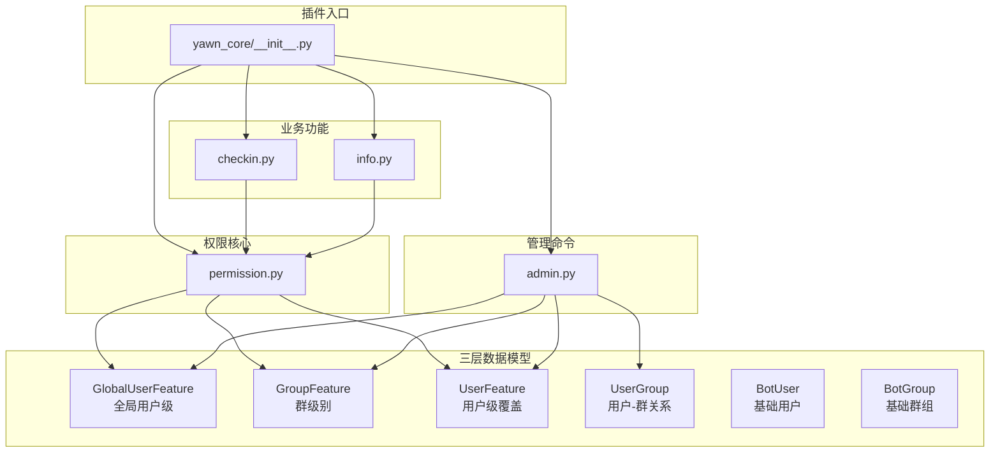
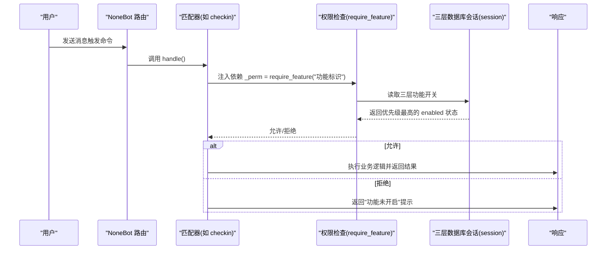
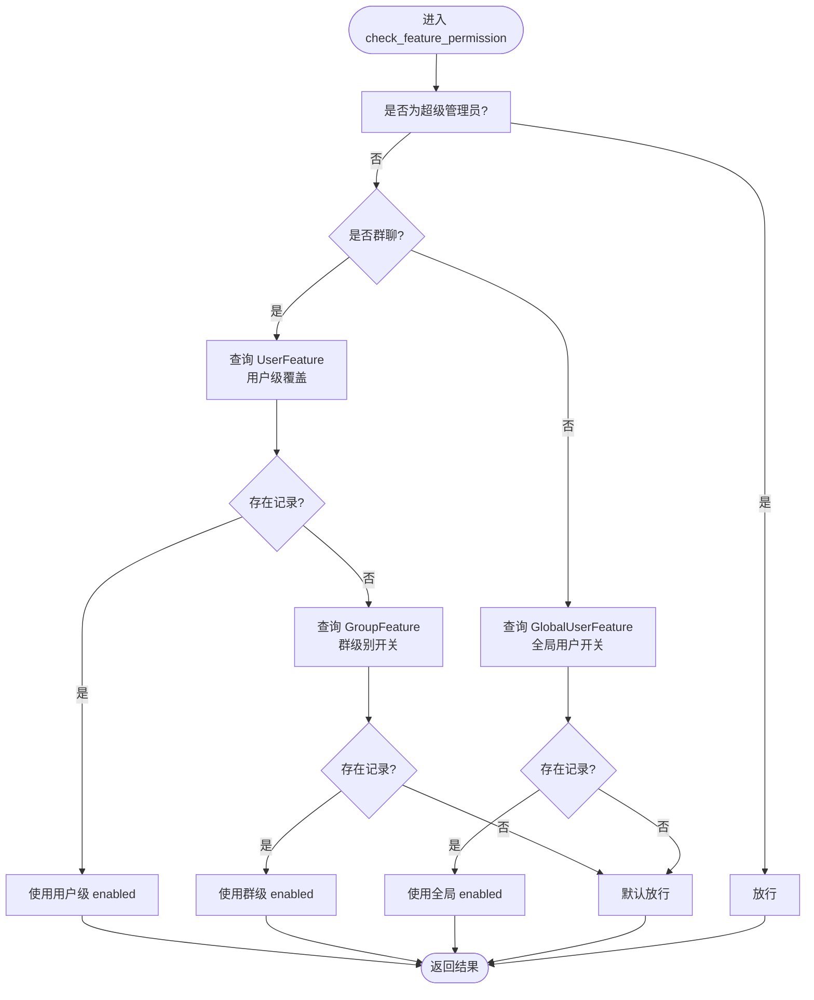
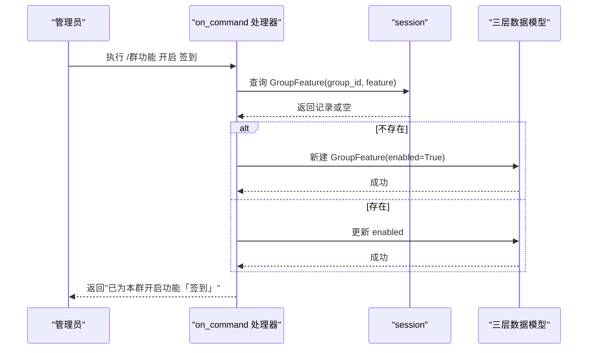
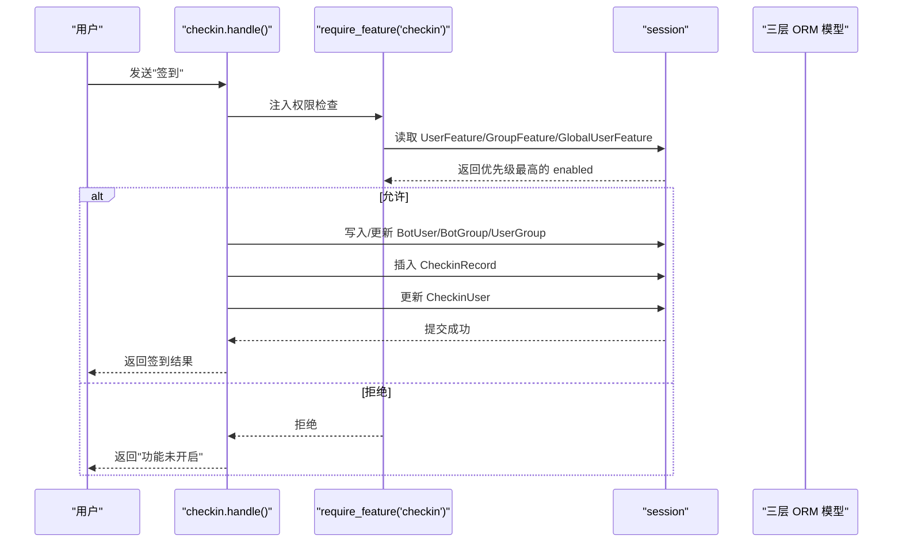
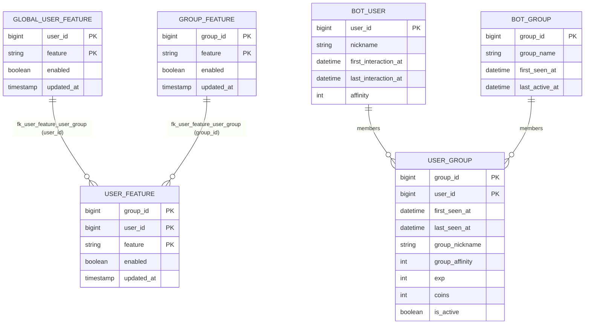
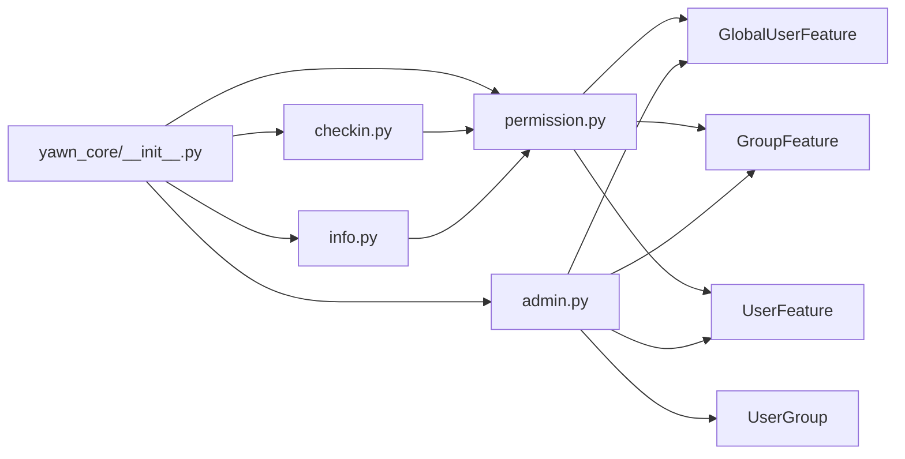

# 权限控制系统

<cite>
**本文引用的文件**   
- [__init__.py](file://src/plugins/yawn_core/__init__.py)
- [permission.py](file://src/plugins/yawn_core/permission.py)
- [admin.py](file://src/plugins/yawn_core/admin.py)
- [checkin.py](file://src/plugins/yawn_core/checkin.py)
- [info.py](file://src/plugins/yawn_core/info.py)
- [global_user_feature.py](file://src/plugins/yawn_core/data_models/global_user_feature.py)
- [group_feature.py](file://src/plugins/yawn_core/data_models/group_feature.py)
- [user_feature.py](file://src/plugins/yawn_core/data_models/user_feature.py)
- [user_group.py](file://src/plugins/yawn_core/data_models/user_group.py)
- [bot_user.py](file://src/plugins/yawn_core/data_models/bot_user.py)
- [bot_group.py](file://src/plugins/yawn_core/data_models/bot_group.py)
- [pyproject.toml](file://pyproject.toml)
- [README.md](file://README.md)
</cite>

## 更新摘要
**所做更改**   
- 更新了三层架构数据库模式的详细说明
- 增强了权限解析链的优先级说明
- 完善了管理命令的三层控制功能
- 更新了数据模型关系图和架构图
- 增加了三层权限控制的详细分析

## 目录
1. [简介](#简介)
2. [项目结构](#项目结构)
3. [核心组件](#核心组件)
4. [架构总览](#架构总览)
5. [详细组件分析](#详细组件分析)
6. [依赖关系分析](#依赖关系分析)
7. [性能考虑](#性能考虑)
8. [故障排查指南](#故障排查指南)
9. [结论](#结论)
10. [附录](#附录)

## 简介
本权限控制系统为 YawnBot 的 nonebot2 插件模块，提供"功能开关"维度的细粒度权限控制。系统通过三层架构数据库模式（GlobalUserFeature、GroupFeature、UserFeature）实现全面的用户级、群级和组合权限管理能力。系统采用"功能注册表 + 解析链 + Depends 依赖工厂"的组合，实现对群内用户、群级别以及全局用户的差异化授权；同时提供面向普通用户、群主/管理员与超级管理员的多层级管理命令，便于灵活开启或关闭某项功能。

## 项目结构
- 插件入口：yawn_core 插件在 __init__.py 中集中导入各子模块，完成命令与依赖的自动注册。
- 权限核心：permission.py 定义功能注册表、权限解析链与 require_feature 依赖注入器。
- 管理命令：admin.py 实现普通用户、群管与超管的三类命令，覆盖查看、开启/关闭、跨群/跨用户的全局管理。
- 业务集成：checkin.py、info.py 等具体功能通过 require_feature("功能标识") 接入权限检查。
- 数据模型：data_models 下定义了用户、群、用户-群关系及各类功能开关（全局用户、群级、用户级）的 ORM 模型。

**图表来源**
- [__init__.py:1-21](file://src/plugins/yawn_core/__init__.py#L1-L21)
- [permission.py:1-225](file://src/plugins/yawn_core/permission.py#L1-L225)
- [admin.py:1-515](file://src/plugins/yawn_core/admin.py#L1-L515)
- [checkin.py:1-150](file://src/plugins/yawn_core/checkin.py#L1-L150)
- [info.py:1-46](file://src/plugins/yawn_core/info.py#L1-L46)
- [global_user_feature.py:1-29](file://src/plugins/yawn_core/data_models/global_user_feature.py#L1-L29)
- [group_feature.py:1-29](file://src/plugins/yawn_core/data_models/group_feature.py#L1-L29)
- [user_feature.py:1-30](file://src/plugins/yawn_core/data_models/user_feature.py#L1-L30)
- [user_group.py:1-61](file://src/plugins/yawn_core/data_models/user_group.py#L1-L61)
- [bot_user.py:1-32](file://src/plugins/yawn_core/data_models/bot_user.py#L1-L32)
- [bot_group.py:1-29](file://src/plugins/yawn_core/data_models/bot_group.py#L1-L29)

**章节来源**
- [__init__.py:1-21](file://src/plugins/yawn_core/__init__.py#L1-L21)
- [pyproject.toml:26-44](file://pyproject.toml#L26-L44)
- [README.md:1-13](file://README.md#L1-L13)

## 核心组件
- **三层架构数据模型**
  - GlobalUserFeature：全局用户级功能开关，适用于私聊及跨群全局控制
  - GroupFeature：群级别功能开关，控制整个群组的功能访问
  - UserFeature：群内特定用户的功能覆盖，优先级高于群级别开关
- **功能注册表与工具函数**
  - 功能标识与显示名映射、有效性校验、反查显示名、列出已注册功能。
- **权限解析链**
  - 群聊场景：超级管理员 → 用户级覆盖(UserFeature) → 群级开关(GroupFeature) → 默认放行。
  - 私聊场景：超级管理员 → 全局用户开关(GlobalUserFeature) → 默认放行。
- **Depends 依赖工厂**
  - require_feature(feature) 返回 Dependent，用于 handler 参数注入，未通过则中断并提示。
- **管理命令**
  - 普通用户：功能列表、开启/关闭个人功能。
  - 群主/管理员：查看/修改群功能、针对特定用户设置功能。
  - 超级管理员：跨群/跨用户的全局功能管理与权限查询。

**章节来源**
- [permission.py:29-61](file://src/plugins/yawn_core/permission.py#L29-L61)
- [permission.py:71-127](file://src/plugins/yawn_core/permission.py#L71-L127)
- [permission.py:132-163](file://src/plugins/yawn_core/permission.py#L132-L163)
- [admin.py:40-59](file://src/plugins/yawn_core/admin.py#L40-L59)
- [admin.py:108-181](file://src/plugins/yawn_core/admin.py#L108-L181)
- [admin.py:186-314](file://src/plugins/yawn_core/admin.py#L186-L314)
- [admin.py:319-428](file://src/plugins/yawn_core/admin.py#L319-L428)
- [admin.py:488-515](file://src/plugins/yawn_core/admin.py#L488-L515)

## 架构总览
权限控制采用"声明式注册 + 运行时解析 + 依赖注入"的架构模式：
- **声明层**：FEATURE_REGISTRY 声明可用功能及其显示名。
- **解析层**：check_feature_permission 根据事件上下文（是否群聊、用户角色）按优先级判定。
- **注入层**：require_feature 将解析逻辑以 Dependent 形式注入到任意 handler。
- **管理层**：admin.py 暴露多类命令，读写数据模型中的开关记录。

**图表来源**
- [permission.py:132-163](file://src/plugins/yawn_core/permission.py#L132-L163)
- [permission.py:71-127](file://src/plugins/yawn_core/permission.py#L71-L127)
- [checkin.py:43-48](file://src/plugins/yawn_core/checkin.py#L43-L48)
- [info.py:15-20](file://src/plugins/yawn_core/info.py#L15-L20)

## 详细组件分析

### 三层架构数据模型

#### GlobalUserFeature（全局用户级）
- **用途**：适用于私聊及跨群全局控制的用户级功能开关
- **字段**：user_id（用户ID）、feature（功能标识）、enabled（启用状态）、updated_at（更新时间）
- **外键约束**：关联 yawn_core_botuser.user_id，支持级联删除

#### GroupFeature（群级别）
- **用途**：控制整个群组的功能访问权限
- **字段**：group_id（群组ID）、feature（功能标识）、enabled（启用状态）、updated_at（更新时间）
- **外键约束**：关联 yawn_core_botgroup.group_id，支持级联删除

#### UserFeature（用户级覆盖）
- **用途**：群内特定用户的功能覆盖，优先级高于群级别开关
- **字段**：group_id（群组ID）、user_id（用户ID）、feature（功能标识）、enabled（启用状态）、updated_at（更新时间）
- **外键约束**：复合外键关联 yawn_core_usergroup(group_id, user_id)，确保用户-群组关系存在

**图表来源**
- [permission.py:71-127](file://src/plugins/yawn_core/permission.py#L71-L127)

**章节来源**
- [global_user_feature.py:8-29](file://src/plugins/yawn_core/data_models/global_user_feature.py#L8-L29)
- [group_feature.py:8-29](file://src/plugins/yawn_core/data_models/group_feature.py#L8-L29)
- [user_feature.py:8-30](file://src/plugins/yawn_core/data_models/user_feature.py#L8-L30)
- [permission.py:71-127](file://src/plugins/yawn_core/permission.py#L71-L127)

### 权限核心模块(permission.py)
- **功能注册表**
  - 维护 feature_key 与中文显示名的映射，提供 is_valid_feature、get_feature_display、list_features、resolve_feature_key 等工具。
- **权限解析链**
  - check_feature_permission：依据事件类型与用户身份，依次判断超级管理员、用户级覆盖、群级开关、全局用户开关，最终决定放行与否。
- **依赖注入**
  - require_feature：封装权限检查为 Dependent，失败时记录日志并终止处理。
- **状态查询**
  - get_user_feature_status：汇总所有功能的 enabled 与来源（用户覆盖/群设置/默认开启/全局设置），供管理命令展示。

**章节来源**
- [permission.py:29-61](file://src/plugins/yawn_core/permission.py#L29-L61)
- [permission.py:71-127](file://src/plugins/yawn_core/permission.py#L71-L127)
- [permission.py:132-163](file://src/plugins/yawn_core/permission.py#L132-L163)
- [permission.py:168-225](file://src/plugins/yawn_core/permission.py#L168-L225)

### 管理命令模块(admin.py)
- **普通用户命令**
  - 功能列表：展示当前用户在群内的功能开关状态与来源。
  - 开启/关闭：写入 UserFeature（不存在则创建），支持中文显示名与英文 key 的反查。
- **群主/管理员命令**
  - 群功能：无参列出本群功能状态；有参修改 GroupFeature。
  - 群用户功能：指定目标用户（@提及或 QQ 号），写入 UserFeature，并保证 UserGroup 存在。
- **超级管理员命令**
  - 全局群功能：对任意群设置 GroupFeature。
  - 全局用户功能：对任意用户设置 GlobalUserFeature 或群内 UserFeature（可选群号）。
  - 权限查询：输出指定用户在全局或指定群的完整权限状态。

**图表来源**
- [admin.py:186-238](file://src/plugins/yawn_core/admin.py#L186-L238)
- [admin.py:241-314](file://src/plugins/yawn_core/admin.py#L241-L314)
- [admin.py:319-362](file://src/plugins/yawn_core/admin.py#L319-L362)
- [admin.py:365-428](file://src/plugins/yawn_core/admin.py#L365-L428)
- [admin.py:488-515](file://src/plugins/yawn_core/admin.py#L488-L515)

**章节来源**
- [admin.py:40-59](file://src/plugins/yawn_core/admin.py#L40-L59)
- [admin.py:108-181](file://src/plugins/yawn_core/admin.py#L108-L181)
- [admin.py:186-314](file://src/plugins/yawn_core/admin.py#L186-L314)
- [admin.py:319-428](file://src/plugins/yawn_core/admin.py#L319-L428)
- [admin.py:488-515](file://src/plugins/yawn_core/admin.py#L488-L515)

### 业务功能集成(checkin.py、info.py)
- **签到功能**
  - 通过 require_feature("checkin") 进行权限检查；成功后更新 BotUser、BotGroup、UserGroup，并写入 CheckinRecord 与 CheckinUser。
- **个人信息**
  - 通过 require_feature("info") 进行权限检查；成功后从 BotUser、UserGroup 读取信息并格式化输出。

**图表来源**
- [checkin.py:43-48](file://src/plugins/yawn_core/checkin.py#L43-L48)
- [checkin.py:49-149](file://src/plugins/yawn_core/checkin.py#L49-L149)
- [info.py:15-20](file://src/plugins/yawn_core/info.py#L15-L20)

**章节来源**
- [checkin.py:22-149](file://src/plugins/yawn_core/checkin.py#L22-L149)
- [info.py:10-46](file://src/plugins/yawn_core/info.py#L10-L46)

### 数据模型与关系图
- **全局用户功能开关**：GlobalUserFeature(user_id, feature, enabled)
- **群级功能开关**：GroupFeature(group_id, feature, enabled)
- **用户级功能覆盖**：UserFeature(group_id, user_id, feature, enabled)
- **用户-群关系**：UserGroup(group_id, user_id, ...扩展字段)
- **基础实体**：BotUser、BotGroup

**图表来源**
- [global_user_feature.py:8-29](file://src/plugins/yawn_core/data_models/global_user_feature.py#L8-L29)
- [group_feature.py:8-29](file://src/plugins/yawn_core/data_models/group_feature.py#L8-L29)
- [user_feature.py:8-30](file://src/plugins/yawn_core/data_models/user_feature.py#L8-L30)
- [user_group.py:15-61](file://src/plugins/yawn_core/data_models/user_group.py#L15-L61)
- [bot_user.py:12-32](file://src/plugins/yawn_core/data_models/bot_user.py#L12-L32)
- [bot_group.py:12-29](file://src/plugins/yawn_core/data_models/bot_group.py#L12-L29)

## 依赖关系分析
- **插件加载**
  - yawn_core/__init__.py 导入 admin、checkin、friend_approve、info、permission、presence，使命令与依赖在启动时注册。
- **权限与业务耦合**
  - checkin.py、info.py 通过 require_feature 依赖注入，与 permission.py 松耦合。
- **数据访问**
  - admin.py 与 permission.py 直接操作 data_models 下的 ORM 模型，通过 async_scoped_session 进行异步事务。

**图表来源**
- [__init__.py:1-21](file://src/plugins/yawn_core/__init__.py#L1-L21)
- [permission.py:13-16](file://src/plugins/yawn_core/permission.py#L13-L16)
- [admin.py:22-32](file://src/plugins/yawn_core/admin.py#L22-L32)
- [checkin.py:20](file://src/plugins/yawn_core/checkin.py#L20)
- [info.py:8](file://src/plugins/yawn_core/info.py#L8)

**章节来源**
- [__init__.py:1-21](file://src/plugins/yawn_core/__init__.py#L1-L21)
- [permission.py:13-16](file://src/plugins/yawn_core/permission.py#L13-L16)
- [admin.py:22-32](file://src/plugins/yawn_core/admin.py#L22-L32)
- [checkin.py:20](file://src/plugins/yawn_core/checkin.py#L20)
- [info.py:8](file://src/plugins/yawn_core/info.py#L8)

## 性能考虑
- **解析链查询次数**
  - 每次权限检查最多进行 2~3 次数据库查询（用户级、群级、全局），建议在热点路径上考虑缓存常用配置（如群级开关）以降低 IO 压力。
- **批量状态查询**
  - get_user_feature_status 会遍历 FEATURE_REGISTRY 并对每个功能进行查询，若功能数量增长较多，可考虑一次性聚合查询后内存分组。
- **事务与锁**
  - 签到流程涉及多次 flush/commit，注意避免重复提交导致的唯一约束冲突（代码已通过异常捕获回滚处理）。
- **三层架构优化**
  - 用户级覆盖(UserFeature)具有最高优先级，应优先查询以减少不必要的数据库访问。

## 故障排查指南
- **功能未生效**
  - 确认功能已在 FEATURE_REGISTRY 中注册。
  - 检查是否存在更高优先级的覆盖（用户级覆盖 > 群级开关 > 默认）。
  - 查看日志中是否有"权限不足"的提示。
- **管理命令无效**
  - 确认命令格式正确（如 /群功能 开启/关闭 <功能名>）。
  - 群管命令需具备群主或管理员身份。
  - 超管命令需满足 SUPERUSER 权限。
- **数据一致性**
  - 群用户功能设置前确保 UserGroup 存在（代码会自动创建）。
  - 签到重复提交会被拦截并回滚，避免重复积分。
- **三层架构问题**
  - 检查 GlobalUserFeature、GroupFeature、UserFeature 的优先级是否正确应用。
  - 验证外键约束是否正常工作，特别是 UserFeature 对 UserGroup 的依赖。

**章节来源**
- [permission.py:146-162](file://src/plugins/yawn_core/permission.py#L146-L162)
- [admin.py:64-92](file://src/plugins/yawn_core/admin.py#L64-L92)
- [admin.py:186-238](file://src/plugins/yawn_core/admin.py#L186-L238)
- [checkin.py:112-117](file://src/plugins/yawn_core/checkin.py#L112-117)

## 结论
该权限控制系统以简洁清晰的"注册表 + 解析链 + 依赖注入"模式，配合完善的三层架构数据库设计（GlobalUserFeature、GroupFeature、UserFeature），实现了多维度、可插拔的功能开关管理。系统提供了从全局用户级到群级再到用户级覆盖的完整权限控制层次，既能满足日常运营需求，也具备良好的扩展性。建议后续引入配置缓存与批量查询优化，进一步提升高并发场景下的性能表现。

## 附录
- **运行与开发**
  - 使用 nb create/nb plugin create 生成项目与插件，编写于 src/plugins 目录，通过 nb run --reload 启动。
- **依赖与环境**
  - nonebot2、onebot v11 适配器、nonebot-plugin-orm 等为核心依赖。

**章节来源**
- [README.md:1-13](file://README.md#L1-L13)
- [pyproject.toml:1-18](file://pyproject.toml#L1-L18)
- [pyproject.toml:26-44](file://pyproject.toml#L26-L44)