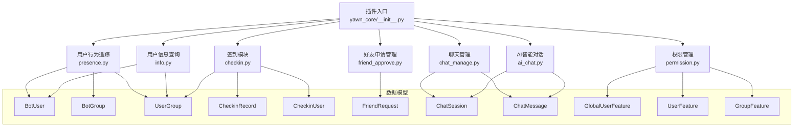
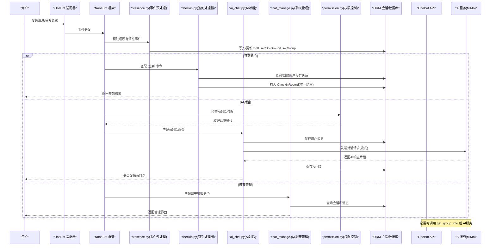
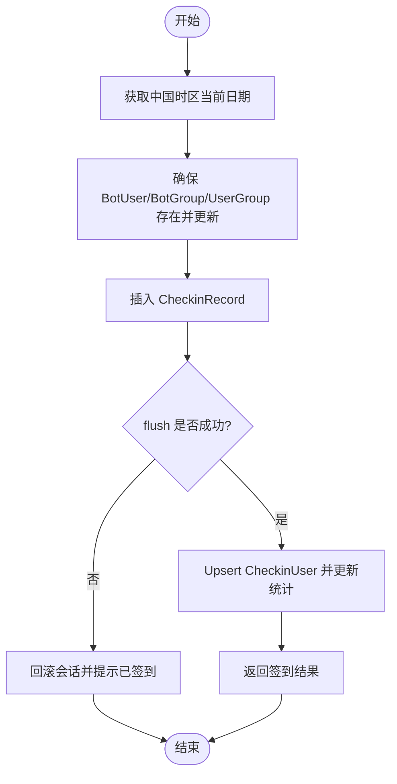
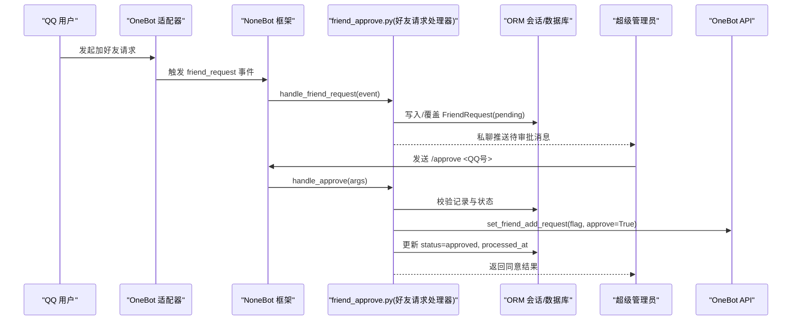
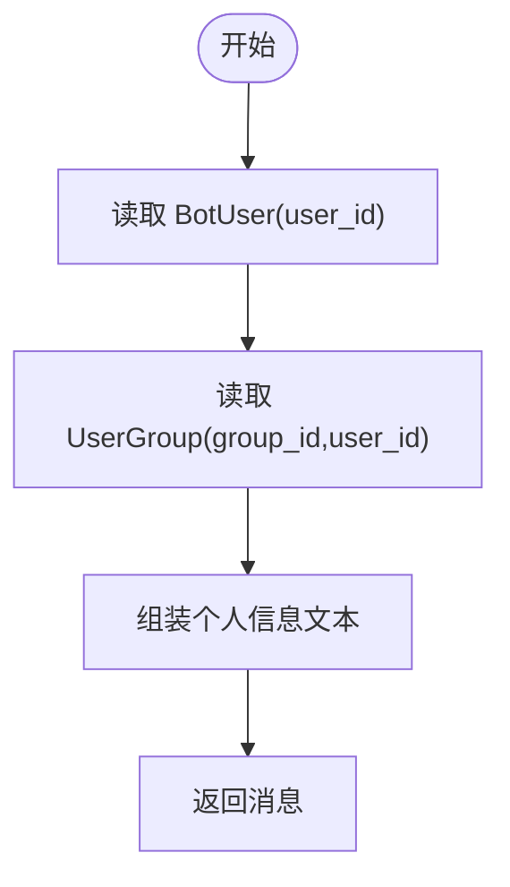
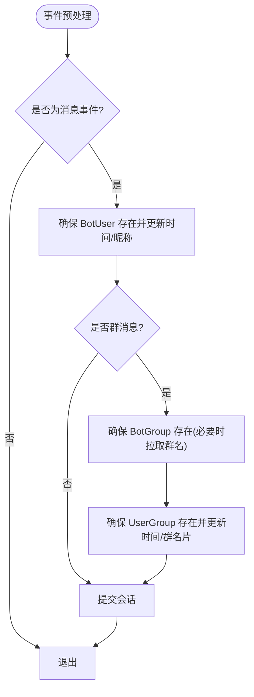
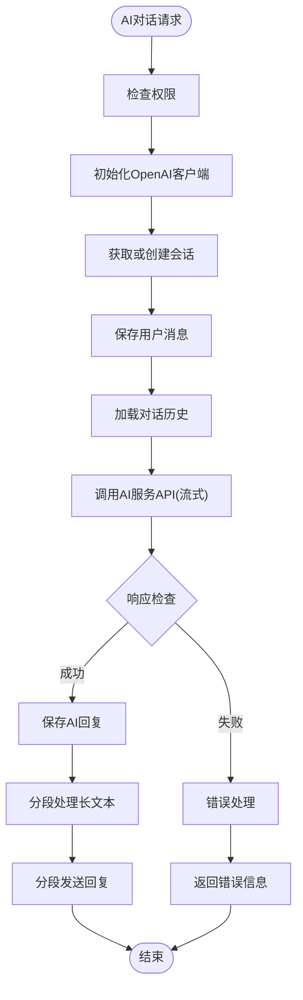
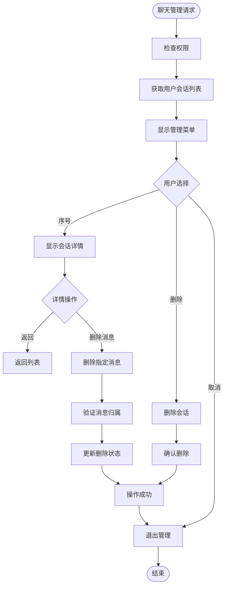
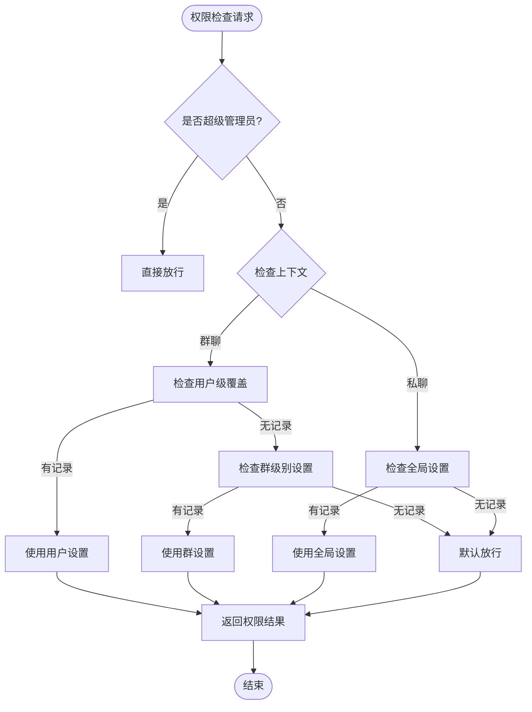
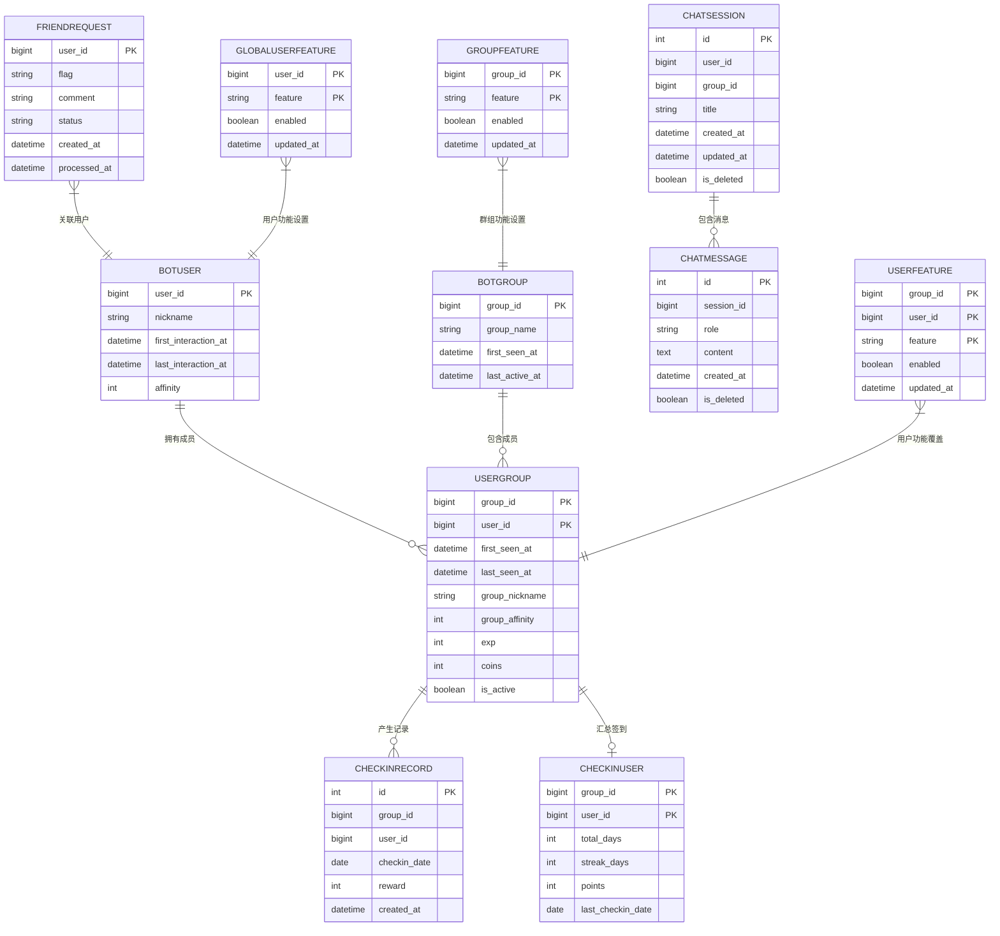

# 核心功能模块

<cite>
**本文引用的文件**   
- [README.md](file://README.md)
- [pyproject.toml](file://pyproject.toml)
- [__init__.py](file://src/plugins/yawn_core/__init__.py)
- [ai_chat.py](file://src/plugins/yawn_core/ai_chat.py)
- [chat_manage.py](file://src/plugins/yawn_core/chat_manage.py)
- [checkin.py](file://src/plugins/yawn_core/checkin.py)
- [friend_approve.py](file://src/plugins/yawn_core/friend_approve.py)
- [info.py](file://src/plugins/yawn_core/info.py)
- [presence.py](file://src/plugins/yawn_core/presence.py)
- [permission.py](file://src/plugins/yawn_core/permission.py)
- [bot_user.py](file://src/plugins/yawn_core/data_models/bot_user.py)
- [bot_group.py](file://src/plugins/yawn_core/data_models/bot_group.py)
- [user_group.py](file://src/plugins/yawn_core/data_models/user_group.py)
- [checkin_record.py](file://src/plugins/yawn_core/data_models/checkin_record.py)
- [checkin_user.py](file://src/plugins/yawn_core/data_models/checkin_user.py)
- [friend_request.py](file://src/plugins/yawn_core/data_models/friend_request.py)
- [chat_message.py](file://src/plugins/yawn_core/data_models/chat_message.py)
- [chat_session.py](file://src/plugins/yawn_core/data_models/chat_session.py)
- [global_user_feature.py](file://src/plugins/yawn_core/data_models/global_user_feature.py)
- [user_feature.py](file://src/plugins/yawn_core/data_models/user_feature.py)
- [group_feature.py](file://src/plugins/yawn_core/data_models/group_feature.py)
- [data_models/__init__.py](file://src/plugins/yawn_core/data_models/__init__.py)
- [1e7945d46845_add_checkin_tables.py](file://data/nonebot_plugin_orm/migrations/yawn_core/1e7945d46845_add_checkin_tables.py)
- [b15555e176e4_add_checkin_tables.py](file://data/nonebot_plugin_orm/migrations/yawn_core/b15555e176e4_add_checkin_tables.py)
</cite>

## 更新摘要
**所做更改**   
- 新增AI对话管理核心功能的完整文档说明，包括交互式聊天管理界面、会话浏览、消息查看、选择性删除等功能
- 更新项目结构图以包含完整的AI对话管理系统
- 扩展核心组件章节，添加AI对话管理和聊天管理功能
- 更新架构总览，展示AI对话管理的完整流程
- 新增AI对话管理流程图和权限控制分析
- 更新配置与环境部分，包含OpenAI SDK依赖和AI服务配置

## 目录
1. [简介](#简介)
2. [项目结构](#项目结构)
3. [核心组件](#核心组件)
4. [架构总览](#架构总览)
5. [详细组件分析](#详细组件分析)
6. [依赖关系分析](#依赖关系分析)
7. [性能考量](#性能考量)
8. [故障排查指南](#故障排查指南)
9. [结论](#结论)
10. [附录](#附录)

## 简介
本文件为 YawnBot 的核心功能模块文档，聚焦以下六大能力：签到系统、好友申请管理、用户信息查询、用户行为追踪、**新增的AI智能对话管理**以及**交互式聊天管理**。文档从业务逻辑、数据模型、调用流程、接口设计、错误处理与性能优化等维度进行系统化说明，并提供可视化图示与常见问题解决方案，帮助初学者快速上手，同时为有经验的开发者提供深入的技术细节。

**最新更新**：YawnBot现已集成完整的AI对话管理系统，支持基于小米MiMo模型的智能对话、流式响应处理、多轮对话上下文记忆、交互式聊天管理界面、会话浏览、消息查看和选择性删除等功能，大幅增强了YawnBot的AI交互能力。

## 项目结构
YawnBot 基于 NoneBot2 插件体系，核心代码位于 src/plugins/yawn_core 下，包含六个主要功能模块与一组数据模型。插件通过 pyproject.toml 注册到 nonebot 的 plugin_dirs，并在运行时自动加载。



**图表来源**
- [__init__.py:1-11](file://src/plugins/yawn_core/__init__.py#L1-L11)
- [ai_chat.py:1-350](file://src/plugins/yawn_core/ai_chat.py#L1-L350)
- [chat_manage.py:1-535](file://src/plugins/yawn_core/chat_manage.py#L1-L535)
- [checkin.py:1-147](file://src/plugins/yawn_core/checkin.py#L1-L147)
- [friend_approve.py:1-152](file://src/plugins/yawn_core/friend_approve.py#L1-L152)
- [info.py:1-40](file://src/plugins/yawn_core/info.py#L1-L40)
- [presence.py:1-103](file://src/plugins/yawn_core/presence.py#L1-L103)
- [permission.py:1-226](file://src/plugins/yawn_core/permission.py#L1-L226)

**章节来源**
- [README.md:1-13](file://README.md#L1-L13)
- [pyproject.toml:25-43](file://pyproject.toml#L25-L43)
- [__init__.py:1-11](file://src/plugins/yawn_core/__init__.py#L1-L11)

## 核心组件
- **签到系统（checkin）**：群内命令触发，记录每日签到、累计天数、连续签到与积分，并保证"每人每天一次"的唯一性约束。
- **好友申请管理（friend_approve）**：监听 OneBot 好友请求事件，持久化待审批记录，支持管理员指令同意/拒绝/查看待办。
- **用户信息查询（info）**：聚合 BotUser 与 UserGroup 信息，返回昵称、好感度、首次/最后交互时间、群名片、经验金币等。
- **用户行为追踪（presence）**：全局事件预处理，自动维护用户与群的活跃时间、首次对话/发言时间、群名片更新等。
- **AI智能对话（ai_chat）**：**新增**基于小米MiMo模型的智能对话管理，支持流式响应、多轮对话上下文记忆、会话管理和权限控制。
- **聊天管理（chat_manage）**：**新增**交互式聊天管理界面，支持会话浏览、消息查看、选择性删除和管理员权限控制。
- **权限管理（permission）**：**新增**统一的功能权限控制系统，支持用户级、群级和全局级的功能开关管理。

**章节来源**
- [checkin.py:22-147](file://src/plugins/yawn_core/checkin.py#L22-L147)
- [friend_approve.py:23-152](file://src/plugins/yawn_core/friend_approve.py#L23-L152)
- [info.py:8-40](file://src/plugins/yawn_core/info.py#L8-L40)
- [presence.py:16-103](file://src/plugins/yawn_core/presence.py#L16-L103)
- [ai_chat.py:1-350](file://src/plugins/yawn_core/ai_chat.py#L1-L350)
- [chat_manage.py:1-535](file://src/plugins/yawn_core/chat_manage.py#L1-L535)
- [permission.py:1-226](file://src/plugins/yawn_core/permission.py#L1-L226)

## 架构总览
整体采用"事件驱动 + ORM 数据层 + AI服务集成 + 权限控制"的架构：
- **事件层**：OneBot V11 消息与好友请求事件进入 NoneBot 框架。
- **处理器层**：各模块通过 on_command/on_request/event_preprocessor 注册处理器。
- **数据层**：使用 nonebot-plugin-orm 提供的异步会话与 SQLAlchemy 模型进行读写。
- **AI服务层**：通过AsyncOpenAI SDK与小米MiMo AI服务通信，支持流式响应和多轮对话。
- **权限层**：统一的权限控制系统，支持多级权限管理和功能开关。
- **外部集成**：必要时调用 OneBot API（如获取群信息）。



**图表来源**
- [presence.py:16-103](file://src/plugins/yawn_core/presence.py#L16-L103)
- [checkin.py:41-147](file://src/plugins/yawn_core/checkin.py#L41-L147)
- [friend_approve.py:31-64](file://src/plugins/yawn_core/friend_approve.py#L31-64)
- [ai_chat.py:217-296](file://src/plugins/yawn_core/ai_chat.py#L217-L296)
- [chat_manage.py:150-184](file://src/plugins/yawn_core/chat_manage.py#L150-L184)
- [permission.py:133-163](file://src/plugins/yawn_core/permission.py#L133-L163)

## 详细组件分析

### 签到系统（checkin）
- **触发方式**：群消息命令"签到"。
- **核心逻辑**：
  - 获取当前中国时区日期，随机奖励 5~15 积分。
  - 确保 BotUser、BotGroup、UserGroup 存在并更新时间戳与昵称。
  - 插入 CheckinRecord，利用数据库唯一约束防止同一天重复签到。
  - 若不存在 CheckinUser 则创建；更新 total_days、points、streak_days、last_checkin_date。
- **返回值**：以 MessageSegment.at 提及用户并返回累计/连续/积分等信息。
- **错误处理**：捕获 IntegrityError 回滚会话并提示"今天已签到"。



**图表来源**
- [checkin.py:41-147](file://src/plugins/yawn_core/checkin.py#L41-L147)
- [checkin_record.py:12-53](file://src/plugins/yawn_core/data_models/checkin_record.py#L12-L53)
- [checkin_user.py:12-47](file://src/plugins/yawn_core/data_models/checkin_user.py#L12-L47)

**章节来源**
- [checkin.py:22-147](file://src/plugins/yawn_core/checkin.py#L22-L147)
- [checkin_record.py:12-53](file://src/plugins/yawn_core/data_models/checkin_record.py#L12-L53)
- [checkin_user.py:12-47](file://src/plugins/yawn_core/data_models/checkin_user.py#L12-L47)

### 好友申请管理（friend_approve）
- **触发方式**：
  - 监听好友请求事件，持久化申请记录（覆盖旧记录），通知超级管理员。
  - 管理员私聊命令：/pending（或别名"待审批"）列出待审批列表。
  - /approve（或"同意"）与 /reject（或"拒绝"）执行审批操作。
- **权限控制**：仅允许配置中的 superusers 执行审批相关命令。
- **数据流**：
  - 收到好友请求 → 写入 FriendRequest(user_id, flag, comment, status=pending)。
  - 管理员执行 approve/reject → 调用 bot.set_friend_add_request(flag, approve=...) → 更新状态与处理时间。
- **错误处理**：参数校验（必须为数字 QQ）、状态检查（仅 pending 可处理）、未找到记录提示。



**图表来源**
- [friend_approve.py:31-64](file://src/plugins/yawn_core/friend_approve.py#L31-64)
- [friend_approve.py:94-122](file://src/plugins/yawn_core/friend_approve.py#L94-L122)
- [friend_approve.py:124-152](file://src/plugins/yawn_core/friend_approve.py#L124-L152)
- [friend_request.py:9-36](file://src/plugins/yawn_core/data_models/friend_request.py#L9-L36)

**章节来源**
- [friend_approve.py:23-152](file://src/plugins/yawn_core/friend_approve.py#L23-L152)
- [friend_request.py:9-36](file://src/plugins/yawn_core/data_models/friend_request.py#L9-L36)

### 用户信息查询（info）
- **触发方式**：群消息命令"info"及多个别名。
- **数据来源**：
  - BotUser：昵称、全局好感度、首次/最后交互时间。
  - UserGroup：群名片、群好感度、经验、金币、首次/最后发言时间。
- **输出格式**：拼接多行文本并通过 Message 返回。
- **边界情况**：字段可能为空时显示默认值（如"未知"、"未设置"）。



**图表来源**
- [info.py:13-40](file://src/plugins/yawn_core/info.py#L13-L40)
- [bot_user.py:12-32](file://src/plugins/yawn_core/data_models/bot_user.py#L12-L32)
- [user_group.py:15-61](file://src/plugins/yawn_core/data_models/user_group.py#L15-L61)

**章节来源**
- [info.py:8-40](file://src/plugins/yawn_core/info.py#L8-L40)
- [bot_user.py:12-32](file://src/plugins/yawn_core/data_models/bot_user.py#L12-L32)
- [user_group.py:15-61](file://src/plugins/yawn_core/data_models/user_group.py#L15-L61)

### 用户行为追踪（presence）
- **触发方式**：全局事件预处理，拦截所有 message 类型事件。
- **核心逻辑**：
  - 确保 BotUser 存在，记录首次对话时间与最后活跃时间，更新昵称。
  - 若是群消息，确保 BotGroup 与 UserGroup 存在，记录首次发言与最后发言时间，更新群名片。
  - 首次见到群时调用 OneBot API 获取 group_name，并对历史缺失数据进行补填。
- **事务提交**：每次处理完成后 commit 会话。



**图表来源**
- [presence.py:16-103](file://src/plugins/yawn_core/presence.py#L16-L103)
- [bot_user.py:12-32](file://src/plugins/yawn_core/data_models/bot_user.py#L12-L32)
- [bot_group.py:12-29](file://src/plugins/yawn_core/data_models/bot_group.py#L12-L29)
- [user_group.py:15-61](file://src/plugins/yawn_core/data_models/user_group.py#L15-L61)

**章节来源**
- [presence.py:16-103](file://src/plugins/yawn_core/presence.py#L16-L103)
- [bot_user.py:12-32](file://src/plugins/yawn_core/data_models/bot_user.py#L12-L32)
- [bot_group.py:12-29](file://src/plugins/yawn_core/data_models/bot_group.py#L12-L29)
- [user_group.py:15-61](file://src/plugins/yawn_core/data_models/user_group.py#L15-L61)

### AI智能对话（ai_chat）**新增**
- **技术基础**：基于小米MiMo模型和AsyncOpenAI SDK，支持多种大语言模型。
- **核心功能**：
  - OpenAI客户端初始化，支持自定义base_url和api_key配置。
  - 流式响应处理，支持长文本分段发送。
  - 多轮对话上下文记忆，自动加载最近20条消息作为历史。
  - 会话管理，支持私聊和预留的群聊场景。
  - 权限控制，通过require_feature("ai_chat")进行访问控制。
- **配置选项**：
  - base_url：AI服务端点地址（https://token-plan-cn.xiaomimimo.com/v1）。
  - api_key：API密钥认证。
  - model：选择的AI模型名称（mimo-v2.5-pro）。
  - 系统提示词：定义AI角色和行为。
- **错误处理**：网络异常、API限流、模型不可用等情况的处理机制。



**图表来源**
- [ai_chat.py:217-296](file://src/plugins/yawn_core/ai_chat.py#L217-L296)
- [ai_chat.py:122-156](file://src/plugins/yawn_core/ai_chat.py#L122-L156)
- [ai_chat.py:159-188](file://src/plugins/yawn_core/ai_chat.py#L159-L188)
- [ai_chat.py:191-211](file://src/plugins/yawn_core/ai_chat.py#L191-L211)

**章节来源**
- [ai_chat.py:1-350](file://src/plugins/yawn_core/ai_chat.py#L1-L350)

### 聊天管理（chat_manage）**新增**
- **功能特性**：
  - 交互式聊天管理界面，支持会话浏览和消息查看。
  - 选择性删除功能，支持删除整个对话或单条消息。
  - 权限控制，普通用户只能管理自己的对话，超级管理员可以管理任意用户的对话。
  - 会话状态管理，支持软删除和状态恢复。
- **用户界面**：
  - 主菜单：显示所有会话列表，支持序号选择、删除操作。
  - 详情视图：显示会话中的所有消息，支持消息ID删除。
  - 导航功能：支持返回、取消等操作。
- **管理员功能**：
  - 查看指定用户的对话记录：/查看用户对话 <QQ号> [会话ID]
  - 删除指定用户的对话或消息：/删除用户对话 <QQ号> 会话/消息 <ID>
- **数据管理**：
  - 会话列表格式化，显示标题、时间和消息数量。
  - 消息预览功能，限制显示长度避免信息过载。
  - 软删除机制，标记is_deleted=true而非物理删除。



**图表来源**
- [chat_manage.py:150-184](file://src/plugins/yawn_core/chat_manage.py#L150-L184)
- [chat_manage.py:225-308](file://src/plugins/yawn_core/chat_manage.py#L225-L308)
- [chat_manage.py:311-383](file://src/plugins/yawn_core/chat_manage.py#L311-L383)

**章节来源**
- [chat_manage.py:1-535](file://src/plugins/yawn_core/chat_manage.py#L1-L535)

### 权限管理（permission）**新增**
- **权限模型**：
  - 超级管理员：始终拥有所有功能权限。
  - 用户级覆盖：针对特定用户在特定群的权限设置。
  - 群级别开关：针对整个群的权限设置。
  - 全局用户设置：针对用户的全局权限设置。
- **权限解析链**：
  - 群聊：超级管理员 → 用户级覆盖 → 群级别开关 → 默认放行
  - 私聊：超级管理员 → 全局用户设置 → 默认放行
- **功能注册表**：统一管理所有可用功能的标识和显示名称。
- **Depends依赖工厂**：提供简洁的权限检查装饰器。



**图表来源**
- [permission.py:72-127](file://src/plugins/yawn_core/permission.py#L72-L127)
- [permission.py:133-163](file://src/plugins/yawn_core/permission.py#L133-L163)

**章节来源**
- [permission.py:1-226](file://src/plugins/yawn_core/permission.py#L1-L226)

## 依赖关系分析
- **模块间依赖**：
  - checkin 依赖 BotUser、BotGroup、UserGroup、CheckinRecord、CheckinUser。
  - friend_approve 依赖 FriendRequest 与 OneBot Bot API。
  - info 依赖 BotUser、UserGroup。
  - presence 依赖 BotUser、BotGroup、UserGroup，并可选调用 OneBot API。
  - ai_chat 依赖 ChatSession、ChatMessage、OpenAI SDK 与外部AI服务。
  - chat_manage 依赖 ChatSession、ChatMessage 与权限系统。
  - permission 依赖 GlobalUserFeature、UserFeature、GroupFeature。
- **数据模型关系**：
  - BotUser 与 UserGroup 一对多（一个用户可在多个群）。
  - BotGroup 与 UserGroup 一对多（一个群有多个成员）。
  - UserGroup 与 CheckinRecord 一对多（签到记录）。
  - UserGroup 与 CheckinUser 一对一（签到汇总）。
  - FriendRequest 独立表，按 user_id 主键唯一。
  - ChatSession 与 ChatMessage 一对多（会话包含多条消息）。
  - GlobalUserFeature、UserFeature、GroupFeature 与功能开关关联。



**图表来源**
- [bot_user.py:12-32](file://src/plugins/yawn_core/data_models/bot_user.py#L12-L32)
- [bot_group.py:12-29](file://src/plugins/yawn_core/data_models/bot_group.py#L12-L29)
- [user_group.py:15-61](file://src/plugins/yawn_core/data_models/user_group.py#L15-L61)
- [checkin_record.py:12-53](file://src/plugins/yawn_core/data_models/checkin_record.py#L12-L53)
- [checkin_user.py:12-47](file://src/plugins/yawn_core/data_models/checkin_user.py#L12-L47)
- [friend_request.py:9-36](file://src/plugins/yawn_core/data_models/friend_request.py#L9-L36)
- [chat_session.py:18-59](file://src/plugins/yawn_core/data_models/chat_session.py#L18-L59)
- [chat_message.py:17-51](file://src/plugins/yawn_core/data_models/chat_message.py#L17-L51)
- [global_user_feature.py:8-29](file://src/plugins/yawn_core/data_models/global_user_feature.py#L8-L29)
- [user_feature.py:8-30](file://src/plugins/yawn_core/data_models/user_feature.py#L8-L30)
- [group_feature.py:8-29](file://src/plugins/yawn_core/data_models/group_feature.py#L8-L29)

**章节来源**
- [bot_user.py:12-32](file://src/plugins/yawn_core/data_models/bot_user.py#L12-L32)
- [bot_group.py:12-29](file://src/plugins/yawn_core/data_models/bot_group.py#L12-L29)
- [user_group.py:15-61](file://src/plugins/yawn_core/data_models/user_group.py#L15-L61)
- [checkin_record.py:12-53](file://src/plugins/yawn_core/data_models/checkin_record.py#L12-L53)
- [checkin_user.py:12-47](file://src/plugins/yawn_core/data_models/checkin_user.py#L12-L47)
- [friend_request.py:9-36](file://src/plugins/yawn_core/data_models/friend_request.py#L9-L36)
- [chat_session.py:18-59](file://src/plugins/yawn_core/data_models/chat_session.py#L18-L59)
- [chat_message.py:17-51](file://src/plugins/yawn_core/data_models/chat_message.py#L17-L51)
- [global_user_feature.py:8-29](file://src/plugins/yawn_core/data_models/global_user_feature.py#L8-L29)
- [user_feature.py:8-30](file://src/plugins/yawn_core/data_models/user_feature.py#L8-L30)
- [group_feature.py:8-29](file://src/plugins/yawn_core/data_models/group_feature.py#L8-L29)

## 性能考量
- **签到唯一性约束**在数据库层实现，避免应用层重复判断带来的竞争条件。
- **presence 预处理**对每条消息进行轻量读写，建议配合连接池与批量提交策略（当前逐条 commit，适合中小规模场景）。
- **群名获取**为可选 API 调用，失败时降级记录空名称，避免阻塞主流程。
- **AI对话性能优化**：
  - 流式响应处理减少内存占用，避免一次性加载大量数据。
  - 对话历史限制为最近20条消息，防止上下文过大影响性能。
  - 长文本分段发送，每段不超过1500字符，提升用户体验。
  - 会话缓存机制，避免重复查询相同会话。
- **聊天管理性能**：
  - 消息预览限制显示长度，避免大量数据传输。
  - 软删除机制，避免频繁的物理删除操作。
  - 分页查询支持，避免一次性加载过多数据。
- **权限检查优化**：
  - 权限检查结果可缓存，减少重复查询。
  - 分层权限检查，优先检查高级别权限。
- **高频签到场景**下，可考虑将 flush/commit 合并或使用事务批处理以降低 I/O 次数。

## 故障排查指南
- **签到重复提示**：
  - 现象：提示"你今天已经签到过了哦~"。
  - 原因：数据库唯一约束 uq_checkin_record_once_per_day 触发。
  - 解决：确认同一用户在同一群同一天仅一次签到；检查并发写入是否导致异常。
- **好友申请无响应**：
  - 现象：管理员未收到待审批消息或无法审批。
  - 原因：superusers 配置不正确或未正确解析；flag 过期或被覆盖。
  - 解决：检查配置文件中的 superusers；重新发起好友请求获取新 flag。
- **用户信息不完整**：
  - 现象：昵称或时间显示"未知"或为空。
  - 原因：首次交互未建立记录或字段未填充。
  - 解决：触发 presence 预处理后重试；检查数据库记录是否存在。
- **群名缺失**：
  - 现象：BotGroup.group_name 为空。
  - 原因：get_group_info 调用失败或权限不足。
  - 解决：检查 OneBot 适配器权限与网络连通性；必要时手动补填。
- **AI对话失败**：
  - 现象：AI响应超时、网络连接错误或API密钥无效。
  - 原因：OpenAI SDK配置错误、网络问题或服务端限制。
  - 解决：检查base_url和api_key配置；验证网络连接；确认API配额充足。
- **聊天管理权限问题**：
  - 现象：用户无法访问聊天管理功能。
  - 原因：权限配置错误或功能被禁用。
  - 解决：检查permission.py中的FEATURE_REGISTRY配置；确认用户权限设置。
- **会话数据丢失**：
  - 现象：对话记录消失或无法查看。
  - 原因：会话被软删除或数据库连接问题。
  - 解决：检查is_deleted字段；确认数据库连接正常；必要时恢复备份数据。

**章节来源**
- [checkin.py:109-114](file://src/plugins/yawn_core/checkin.py#L109-L114)
- [friend_approve.py:21-29](file://src/plugins/yawn_core/friend_approve.py#L21-L29)
- [presence.py:54-84](file://src/plugins/yawn_core/presence.py#L54-L84)
- [ai_chat.py:265-271](file://src/plugins/yawn_core/ai_chat.py#L265-L271)
- [chat_manage.py:159-162](file://src/plugins/yawn_core/chat_manage.py#L159-L162)
- [permission.py:158-162](file://src/plugins/yawn_core/permission.py#L158-L162)

## 结论
YawnBot 核心模块围绕 NoneBot 事件机制与 ORM 数据层构建，具备清晰的职责划分与稳健的错误处理。**最新版本的AI对话管理系统**进一步增强了系统的智能化水平，提供了完整的对话管理、会话浏览、消息管理和权限控制功能。签到系统通过数据库约束保障一致性；好友申请管理提供完整的审批闭环；用户信息查询聚合多维度数据；用户行为追踪实现自动化活跃度维护；AI对话模块提供智能化的用户交互体验；聊天管理模块提供完善的对话数据管理能力；权限管理系统确保功能的安全性和可控性。建议在大规模部署时进一步优化事务批处理与 API 调用频率，以提升整体吞吐与稳定性。

## 附录

### 配置与环境
- **插件目录**：src/plugins
- **内置插件与适配器**：nonebot-adapter-onebot、nonebot-plugin-orm、nonebot-plugin-alconna 等
- **运行方式**：nb run --reload
- **AI服务配置**：
  - OpenAI SDK版本：>=2.50.0
  - 支持的模型：mimo-v2.5-pro（小米MiMo模型）
  - 自定义端点：https://token-plan-cn.xiaomimimo.com/v1
  - API密钥：tp-cnvbscmew57f45m23dmnuet028kppbp4g1vxurun9jsdv9qs
- **权限配置**：
  - FEATURE_REGISTRY：功能注册表，定义可用功能和显示名称
  - SUPERUSER：超级管理员列表，拥有最高权限
  - 功能开关：支持用户级、群级和全局级权限控制

**章节来源**
- [pyproject.toml:25-43](file://pyproject.toml#L25-L43)
- [README.md:3-8](file://README.md#L3-L8)
- [ai_chat.py:35-44](file://src/plugins/yawn_core/ai_chat.py#L35-L44)
- [permission.py:32-36](file://src/plugins/yawn_core/permission.py#L32-L36)

### 数据迁移概览
- **关键迁移**：
  - 创建 yawn_core_friendrequest 表并调整主键与字段。
  - 调整 CheckinUser 与 CheckinRecord 的外键与数据类型。
  - 新增 yawn_core_chatsession 和 yawn_core_chatmessage 表用于AI对话存储。
  - 新增功能开关表：yawn_core_globaluserfeature、yawn_core_userfeature、yawn_core_groupfeature。
- **作用**：确保表结构与模型定义一致，支撑外键约束与级联删除。

**章节来源**
- [1e7945d46845_add_checkin_tables.py:22-36](file://data/nonebot_plugin_orm/migrations/yawn_core/1e7945d46845_add_checkin_tables.py#L22-L36)
- [b15555e176e4_add_checkin_tables.py:69-112](file://data/nonebot_plugin_orm/migrations/yawn_core/b15555e176e4_add_checkin_tables.py#L69-L112)

### AI集成配置示例
```python
# OpenAI客户端配置示例
client = AsyncOpenAI(
    api_key="tp-cnvbscmew57f45m23dmnuet028kppbp4g1vxurun9jsdv9qs",
    base_url="https://token-plan-cn.xiaomimimo.com/v1",
)

# 简单的对话请求
response = await client.chat.completions.create(
    model="mimo-v2.5-pro",
    messages=[
        {"role": "system", "content": "你是 YawnBot，一个友好、有趣的 QQ 聊天机器人。"},
        {"role": "user", "content": "你好，请介绍一下自己"}
    ],
    stream=True
)

# 流式响应处理
async for chunk in response:
    if chunk.choices and chunk.choices[0].delta.content:
        print(chunk.choices[0].delta.content, end="")
```

**章节来源**
- [ai_chat.py:41-44](file://src/plugins/yawn_core/ai_chat.py#L41-L44)
- [ai_chat.py:197-211](file://src/plugins/yawn_core/ai_chat.py#L197-L211)

### 聊天管理API示例
```python
# 普通用户聊天管理
# 查看对话列表
await chat_manage_cmd.send("═══ 对话管理 ═══\n1. [1] 日常聊天 (01-15 14:30)\n2. [2] 工作讨论 (01-15 15:45)\n\n操作说明：\n  发送序号 → 查看对话详情\n  发送「删除 <序号>」→ 删除该对话\n  发送「取消」→ 退出")

# 查看对话详情
await chat_manage_cmd.send("═══ 对话 #1：日常聊天 ═══\n消息数：5\n\n  [1] 我 (01-15 14:30): 今天天气怎么样？\n  [2] AI (01-15 14:31): 今天天气晴朗，温度适宜...\n  [3] 我 (01-15 14:32): 太好了！\n\n操作：\n  删除消息 <ID> → 删除指定消息\n  返回 → 回到列表\n  取消 → 退出管理")

# 管理员查看用户对话
await admin_chat_view_cmd.finish("═══ 用户 123456 的对话列表 ═══\n1. [10] 测试对话 (01-15 16:00)\n\n使用 /查看用户对话 123456 <会话ID> 查看详情")
```

**章节来源**
- [chat_manage.py:173-184](file://src/plugins/yawn_core/chat_manage.py#L173-L184)
- [chat_manage.py:282-300](file://src/plugins/yawn_core/chat_manage.py#L282-L300)
- [chat_manage.py:439-446](file://src/plugins/yawn_core/chat_manage.py#L439-L446)