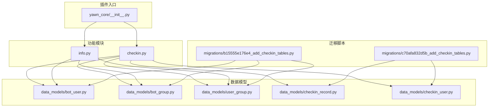
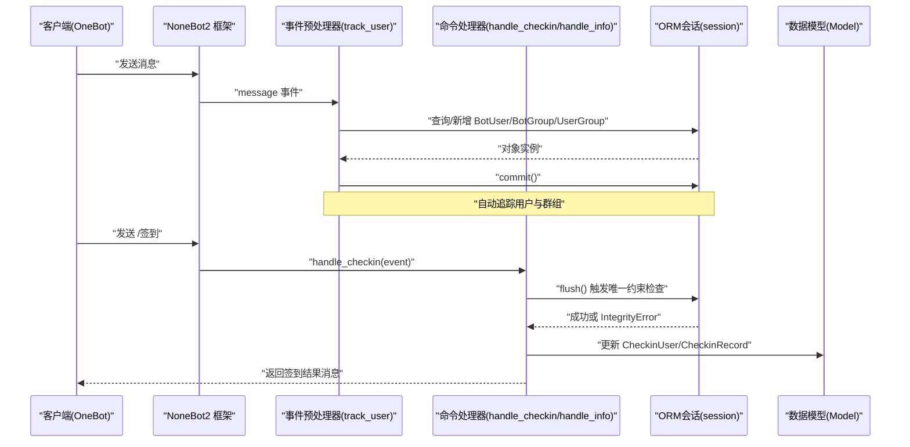
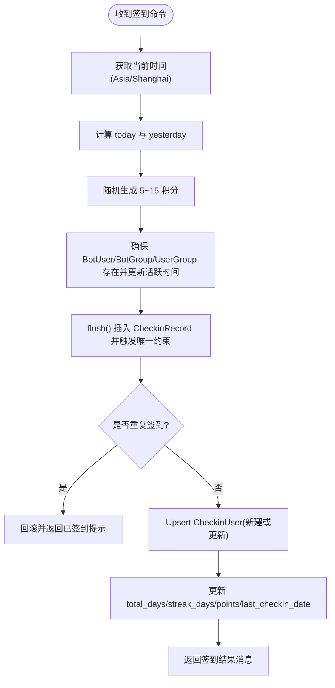
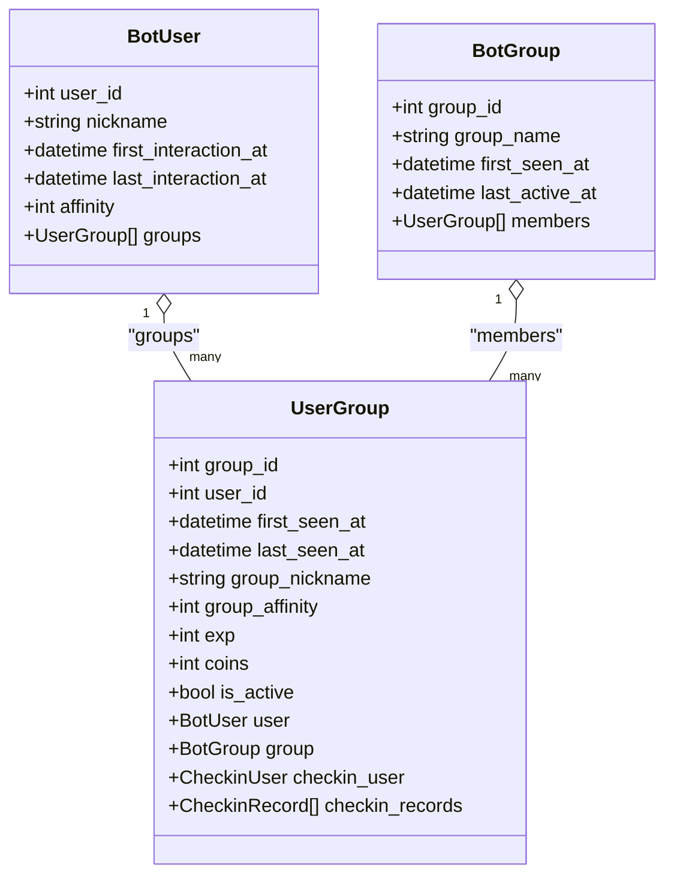
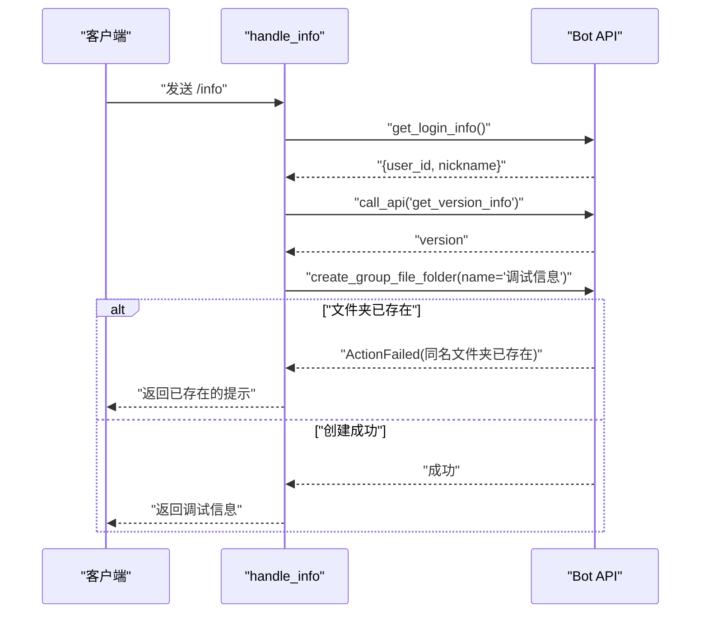
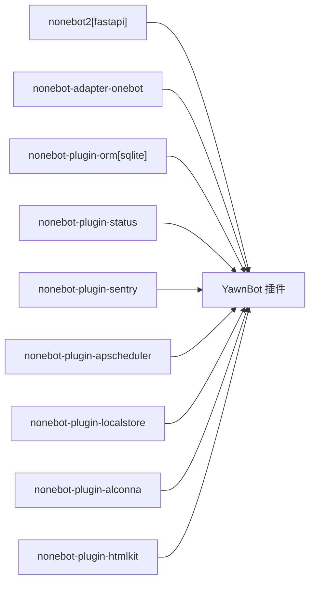

# 核心功能模块

<cite>
**本文引用的文件**   
- [README.md](file://README.md)
- [pyproject.toml](file://pyproject.toml)
- [__init__.py](file://src/plugins/yawn_core/__init__.py)
- [checkin.py](file://src/plugins/yawn_core/checkin.py)
- [info.py](file://src/plugins/yawn_core/info.py)
- [bot_user.py](file://src/plugins/yawn_core/data_models/bot_user.py)
- [bot_group.py](file://src/plugins/yawn_core/data_models/bot_group.py)
- [user_group.py](file://src/plugins/yawn_core/data_models/user_group.py)
- [checkin_record.py](file://src/plugins/yawn_core/data_models/checkin_record.py)
- [checkin_user.py](file://src/plugins/yawn_core/data_models/checkin_user.py)
- [b15555e176e4_add_checkin_tables.py](file://data/nonebot_plugin_orm/migrations/yawn_core/b15555e176e4_add_checkin_tables.py)
- [c70afa832d5b_add_checkin_tables.py](file://data/nonebot_plugin_orm/migrations/yawn_core/c70afa832d5b_add_checkin_tables.py)
</cite>

## 目录
1. [简介](#简介)
2. [项目结构](#项目结构)
3. [核心组件](#核心组件)
4. [架构总览](#架构总览)
5. [详细组件分析](#详细组件分析)
6. [依赖关系分析](#依赖关系分析)
7. [性能考量](#性能考量)
8. [故障排查指南](#故障排查指南)
9. [结论](#结论)
10. [附录](#附录)

## 简介
本模块为 YawnBot 的“核心功能”，围绕以下能力构建：
- 签到系统：支持群内每日签到、随机积分奖励、连续签到统计与累计天数统计。
- 用户管理事件预处理器：自动追踪用户首次对话、昵称更新、群组内发言记录，维护 BotUser、BotGroup、UserGroup 等基础数据。
- 信息查询接口：提供调试信息输出（Bot 版本、昵称、ID）以及创建群文件夹等辅助操作。

该模块基于 NoneBot2 + OneBot V11 适配器，使用 nonebot-plugin-orm 进行异步 ORM 访问，数据库迁移由 Alembic 管理。

## 项目结构
YawnBot 插件位于 src/plugins/yawn_core，包含：
- __init__.py：注册事件预处理器，导入子模块。
- checkin.py：实现“签到”命令处理逻辑。
- info.py：实现“info/个人信息/我的信息/用户信息”命令处理逻辑。
- data_models：定义 ORM 模型（BotUser、BotGroup、UserGroup、CheckinRecord、CheckinUser）。
- migrations：数据库迁移脚本，确保表结构与约束一致。



图表来源
- [__init__.py:1-74](file://src/plugins/yawn_core/__init__.py#L1-L74)
- [checkin.py:1-147](file://src/plugins/yawn_core/checkin.py#L1-L147)
- [info.py:1-39](file://src/plugins/yawn_core/info.py#L1-L39)
- [bot_user.py:1-32](file://src/plugins/yawn_core/data_models/bot_user.py#L1-L32)
- [bot_group.py:1-29](file://src/plugins/yawn_core/data_models/bot_group.py#L1-L29)
- [user_group.py:1-61](file://src/plugins/yawn_core/data_models/user_group.py#L1-L61)
- [checkin_record.py:1-53](file://src/plugins/yawn_core/data_models/checkin_record.py#L1-L53)
- [checkin_user.py:1-47](file://src/plugins/yawn_core/data_models/checkin_user.py#L1-L47)
- [c70afa832d5b_add_checkin_tables.py:1-57](file://data/nonebot_plugin_orm/migrations/yawn_core/c70afa832d5b_add_checkin_tables.py#L1-L57)
- [b15555e176e4_add_checkin_tables.py:1-113](file://data/nonebot_plugin_orm/migrations/yawn_core/b15555e176e4_add_checkin_tables.py#L1-L113)

章节来源
- [README.md:1-13](file://README.md#L1-L13)
- [pyproject.toml:1-44](file://pyproject.toml#L1-L44)

## 核心组件
- 事件预处理器 track_user：拦截所有 message 类型事件，自动维护 BotUser、BotGroup、UserGroup，并记录首次交互时间、最后活跃时间、群昵称等。
- 签到命令 handle_checkin：处理“签到”指令，生成随机积分，写入签到记录，更新累计天数、连续签到天数与总积分，返回结果消息。
- 信息查询 handle_info：获取 Bot 登录信息与版本信息，构造调试消息，尝试创建群文件夹并处理重复创建异常。

章节来源
- [__init__.py:16-74](file://src/plugins/yawn_core/__init__.py#L16-L74)
- [checkin.py:22-147](file://src/plugins/yawn_core/checkin.py#L22-L147)
- [info.py:6-39](file://src/plugins/yawn_core/info.py#L6-L39)

## 架构总览
整体流程分为三层：
- 事件接入层：NoneBot2 接收 OneBot V11 消息，触发事件预处理器与命令处理器。
- 业务逻辑层：track_user 负责用户与群组数据的自动维护；handle_checkin 负责签到计算与统计；handle_info 负责信息查询与辅助操作。
- 数据持久化层：通过 nonebot-plugin-orm 的 async_scoped_session 对 SQLAlchemy 模型进行读写，迁移脚本保证表结构与约束一致性。



图表来源
- [__init__.py:16-74](file://src/plugins/yawn_core/__init__.py#L16-L74)
- [checkin.py:41-147](file://src/plugins/yawn_core/checkin.py#L41-L147)
- [info.py:10-39](file://src/plugins/yawn_core/info.py#L10-L39)

## 详细组件分析

### 签到系统业务流程与积分计算
- 触发条件：用户在群内发送“签到”指令。
- 时间基准：采用 Asia/Shanghai 时区，按日期判断是否重复签到。
- 积分规则：每次签到随机获得 5~15 积分。
- 去重机制：数据库层通过 UniqueConstraint(group_id, user_id, checkin_date) 保证每人每天仅一次签到；代码层在 flush 前捕获 IntegrityError 并回滚，返回提示。
- 统计更新：
  - total_days：累计签到天数，每次签到 +1。
  - streak_days：连续签到天数，若 last_checkin_date 等于昨天则 +1，否则重置为 1。
  - points：总积分累加本次 reward。
  - last_checkin_date：更新为今天。
- 响应消息：@用户 + 本次积分、累计天数、连续天数、当前积分。



图表来源
- [checkin.py:22-147](file://src/plugins/yawn_core/checkin.py#L22-L147)
- [checkin_record.py:12-53](file://src/plugins/yawn_core/data_models/checkin_record.py#L12-L53)
- [checkin_user.py:12-47](file://src/plugins/yawn_core/data_models/checkin_user.py#L12-L47)

章节来源
- [checkin.py:22-147](file://src/plugins/yawn_core/checkin.py#L22-L147)
- [checkin_record.py:12-53](file://src/plugins/yawn_core/data_models/checkin_record.py#L12-L53)
- [checkin_user.py:12-47](file://src/plugins/yawn_core/data_models/checkin_user.py#L12-L47)

### 用户管理系统的事件预处理器与自动追踪
- 触发时机：所有 message 类型事件进入时。
- 行为：
  - 提取 user_id 与 sender.card/nickname，作为群昵称或全局昵称。
  - 首次对话：创建 BotUser，记录 first_interaction_at 与 last_interaction_at。
  - 后续对话：更新 last_interaction_at，必要时更新 nickname。
  - 群聊场景：确保 BotGroup 存在（记录 first_seen_at），创建或更新 UserGroup（first_seen_at、last_seen_at、group_nickname）。
  - 提交事务：commit 保存变更。
- 日志：新用户首次对话、用户首次在群内发言均会记录日志。



图表来源
- [bot_user.py:12-32](file://src/plugins/yawn_core/data_models/bot_user.py#L12-L32)
- [bot_group.py:12-29](file://src/plugins/yawn_core/data_models/bot_group.py#L12-L29)
- [user_group.py:15-61](file://src/plugins/yawn_core/data_models/user_group.py#L15-L61)

章节来源
- [__init__.py:16-74](file://src/plugins/yawn_core/__init__.py#L16-L74)
- [bot_user.py:12-32](file://src/plugins/yawn_core/data_models/bot_user.py#L12-L32)
- [bot_group.py:12-29](file://src/plugins/yawn_core/data_models/bot_group.py#L12-L29)
- [user_group.py:15-61](file://src/plugins/yawn_core/data_models/user_group.py#L15-L61)

### 群组管理与信息查询接口
- 命令别名：info、个人信息、我的信息、用户信息。
- 功能：
  - 获取 Bot 登录信息（user_id、nickname）。
  - 调用 get_version_info 获取版本信息。
  - 构造调试消息文本。
  - 尝试创建名为“调试信息”的群文件夹，如已存在则返回友好提示，其他失败返回错误信息。
- 异常处理：捕获 ActionFailed，根据 wording 区分“同名文件夹已存在”与其他错误。



图表来源
- [info.py:6-39](file://src/plugins/yawn_core/info.py#L6-L39)

章节来源
- [info.py:6-39](file://src/plugins/yawn_core/info.py#L6-L39)

### 数据模型与约束
- BotUser：全局用户主键 user_id，昵称、首次/最后交互时间、好感度，关联 UserGroup。
- BotGroup：群组主键 group_id，名称、首次出现时间、最后活跃时间，关联 UserGroup。
- UserGroup：联合主键 (group_id, user_id)，记录首次/最后出现时间、群昵称、扩展字段（group_affinity、exp、coins、is_active），双向关联 BotUser 与 BotGroup，并关联 CheckinUser 与 CheckinRecord。
- CheckinRecord：自增 id，联合唯一约束 (group_id, user_id, checkin_date) 防止重复签到，外键指向 UserGroup，记录 reward 与 created_at。
- CheckinUser：联合主键 (group_id, user_id)，统计 total_days、streak_days、points、last_checkin_date。

```mermaid
erDiagram
BOTUSER {
bigint user_id PK
string nickname
datetime first_interaction_at
datetime last_interaction_at
int affinity
}
BOTGROUP {
bigint group_id PK
string group_name
datetime first_seen_at
datetime last_active_at
}
USERGROUP {
bigint group_id PK
bigint user_id PK
datetime first_seen_at
datetime last_seen_at
string group_nickname
int group_affinity
int exp
int coins
boolean is_active
}
CHECKINRECORD {
int id PK
bigint group_id
bigint user_id
date checkin_date
int reward
datetime created_at
}
CHECKINUSER {
bigint group_id PK
bigint user_id PK
int total_days
int streak_days
int points
date last_checkin_date
}
BOTUSER ||--o{ USERGROUP : "groups"
BOTGROUP ||--o{ USERGROUP : "members"
USERGROUP ||--o{ CHECKINRECORD : "checkin_records"
USERGROUP ||--o|| CHECKINUSER : "checkin_user"
```

图表来源
- [bot_user.py:12-32](file://src/plugins/yawn_core/data_models/bot_user.py#L12-L32)
- [bot_group.py:12-29](file://src/plugins/yawn_core/data_models/bot_group.py#L12-L29)
- [user_group.py:15-61](file://src/plugins/yawn_core/data_models/user_group.py#L15-L61)
- [checkin_record.py:12-53](file://src/plugins/yawn_core/data_models/checkin_record.py#L12-L53)
- [checkin_user.py:12-47](file://src/plugins/yawn_core/data_models/checkin_user.py#L12-L47)

章节来源
- [bot_user.py:12-32](file://src/plugins/yawn_core/data_models/bot_user.py#L12-L32)
- [bot_group.py:12-29](file://src/plugins/yawn_core/data_models/bot_group.py#L12-L29)
- [user_group.py:15-61](file://src/plugins/yawn_core/data_models/user_group.py#L15-L61)
- [checkin_record.py:12-53](file://src/plugins/yawn_core/data_models/checkin_record.py#L12-L53)
- [checkin_user.py:12-47](file://src/plugins/yawn_core/data_models/checkin_user.py#L12-L47)

## 依赖关系分析
- 运行时依赖：
  - nonebot2[fastapi]：核心框架。
  - nonebot-adapter-onebot：OneBot V11 适配器。
  - nonebot-plugin-orm[sqlite]：异步 ORM 与数据库绑定。
  - 其他插件：status、sentry、apscheduler、localstore、alconna、htmlkit。
- 插件配置：
  - plugin_dirs 指向 src/plugins。
  - adapters 声明 OneBot V11。
  - plugins 启用 orm 等内置插件。



图表来源
- [pyproject.toml:1-44](file://pyproject.toml#L1-L44)

章节来源
- [pyproject.toml:1-44](file://pyproject.toml#L1-L44)

## 性能考量
- 数据库写入优化：
  - 签到流程中先 flush 以尽早触发唯一约束检查，避免不必要的后续写入。
  - 使用 session.get 按需加载实体，减少不必要的全表扫描。
- 并发与事务：
  - 每个请求使用独立的 async_scoped_session，保证事务隔离。
  - IntegrityError 发生时立即 rollback，避免脏数据。
- 时区与时间计算：
  - 统一使用 Asia/Shanghai 时区，避免跨时区导致的重复签到误判。
- 可扩展性：
  - 签到积分范围可配置化（当前硬编码 5~15）。
  - 连续签到逻辑可按需求引入阶梯奖励或保底机制。

## 故障排查指南
- 重复签到提示：
  - 现象：用户同一天多次签到，返回“你今天已经签到过了哦~”。
  - 原因：数据库唯一约束阻止重复插入 CheckinRecord。
  - 解决：无需额外处理，属于预期行为；如需允许补签，需调整约束或增加补偿逻辑。
- 创建群文件夹失败：
  - 现象：抛出 ActionFailed，可能提示“同名文件夹已存在”或其他错误。
  - 原因：文件夹已存在或权限不足。
  - 解决：捕获并提示“文件夹已经存在，不需要重复创建”；其他错误返回具体 wording。
- 用户/群组未初始化：
  - 现象：首次对话或首次群内发言后，相关实体被创建。
  - 排查：确认 event_preprocessor 已生效，session.commit 正常执行。
- 时间不一致导致统计异常：
  - 现象：连续签到天数未按预期递增。
  - 原因：时区设置不正确或服务器时间与 Asia/Shanghai 不一致。
  - 解决：确保 CHECKIN_TIMEZONE 设置为 Asia/Shanghai，并校验系统时区。

章节来源
- [checkin.py:109-114](file://src/plugins/yawn_core/checkin.py#L109-L114)
- [info.py:32-39](file://src/plugins/yawn_core/info.py#L32-L39)
- [__init__.py:16-74](file://src/plugins/yawn_core/__init__.py#L16-L74)

## 结论
YawnBot 的核心功能模块以清晰的数据模型与严格的数据库约束为基础，实现了健壮的签到系统与自动化的用户追踪。通过事件预处理器与命令处理器解耦，既保证了用户体验的一致性，也为后续扩展（如积分商城、排行榜、任务系统）提供了良好基础。建议在后续迭代中引入配置化参数（签到积分范围、奖励策略）、完善错误码与监控上报，进一步提升系统的可维护性与可观测性。

## 附录
- 启动与开发：
  - 使用 nb create 生成项目，nb plugin create 创建插件，编写于 src/plugins 下，运行 nb run --reload。
- 关键配置项：
  - plugin_dirs：src/plugins
  - adapters：nonebot-adapter-onebot
  - plugins：orm、status、sentry、apscheduler、localstore、alconna、htmlkit

章节来源
- [README.md:3-8](file://README.md#L3-L8)
- [pyproject.toml:25-44](file://pyproject.toml#L25-L44)