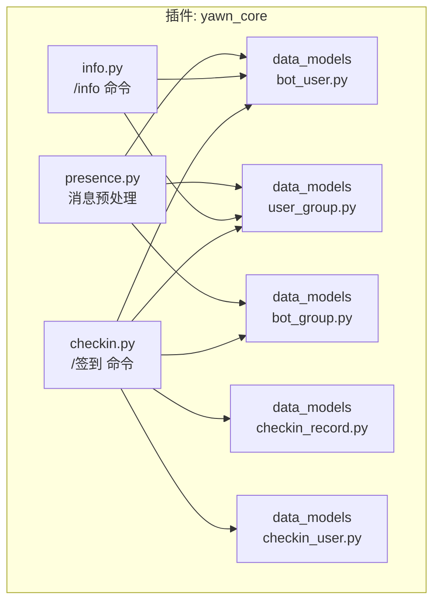
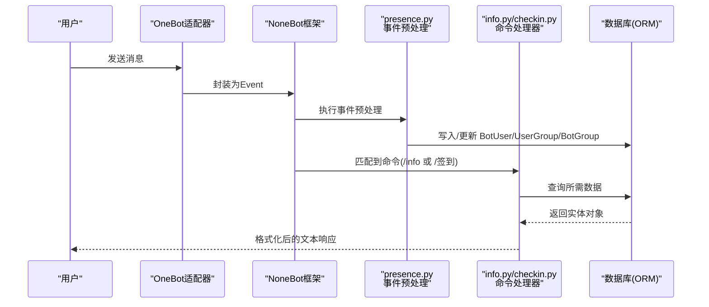
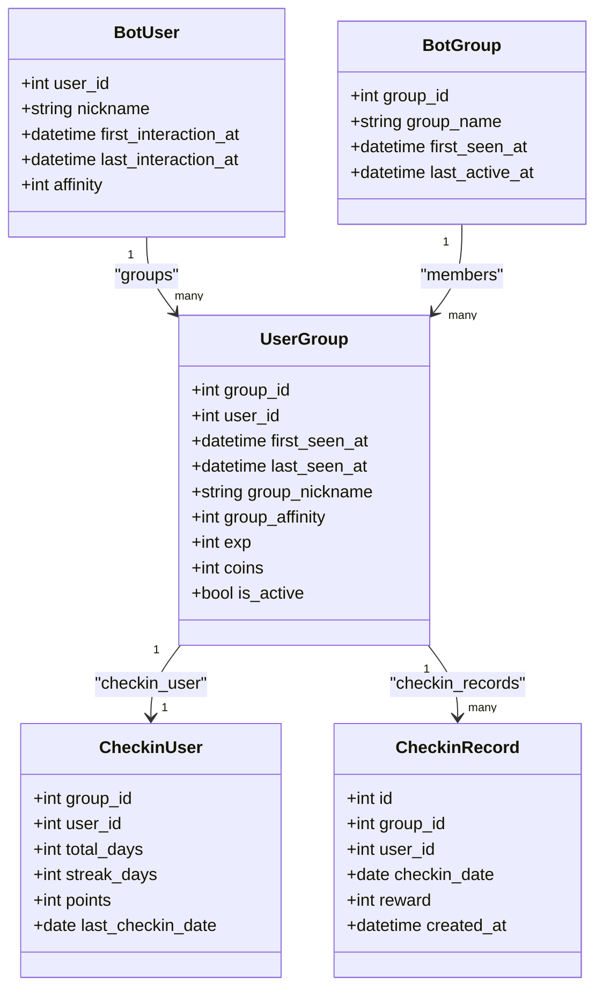
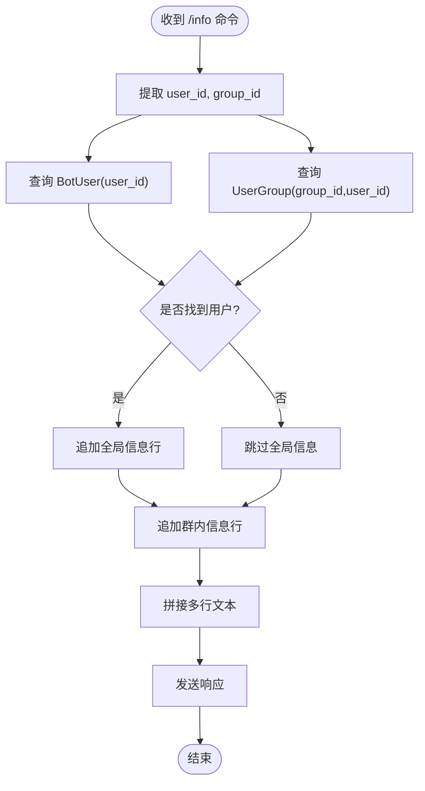
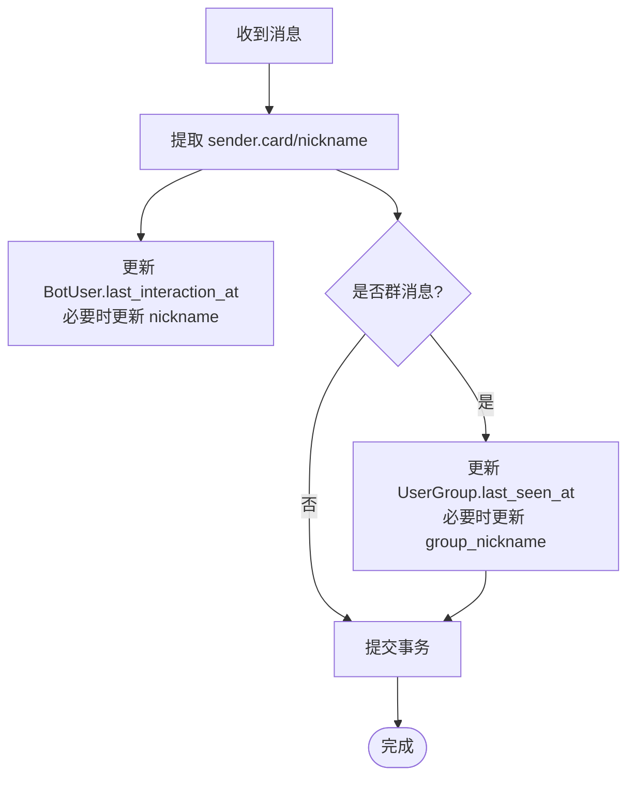
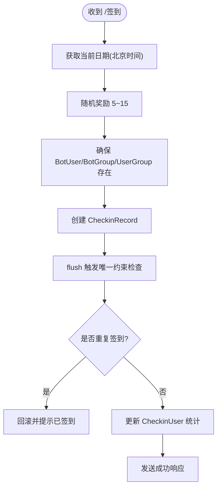
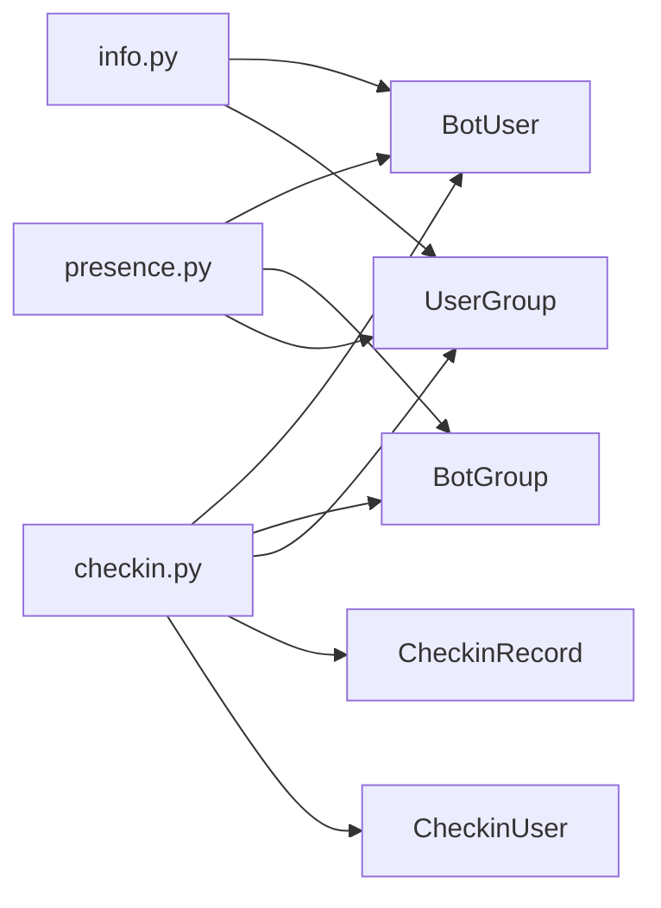

# 用户信息查询

<cite>
**本文引用的文件**   
- [src/plugins/yawn_core/data_models/bot_user.py](file://src/plugins/yawn_core/data_models/bot_user.py)
- [src/plugins/yawn_core/data_models/user_group.py](file://src/plugins/yawn_core/data_models/user_group.py)
- [src/plugins/yawn_core/data_models/bot_group.py](file://src/plugins/yawn_core/data_models/bot_group.py)
- [src/plugins/yawn_core/data_models/checkin_record.py](file://src/plugins/yawn_core/data_models/checkin_record.py)
- [src/plugins/yawn_core/data_models/checkin_user.py](file://src/plugins/yawn_core/data_models/checkin_user.py)
- [src/plugins/yawn_core/info.py](file://src/plugins/yawn_core/info.py)
- [src/plugins/yawn_core/checkin.py](file://src/plugins/yawn_core/checkin.py)
- [src/plugins/yawn_core/presence.py](file://src/plugins/yawn_core/presence.py)
- [README.md](file://README.md)
</cite>

## 目录
1. [简介](#简介)
2. [项目结构](#项目结构)
3. [核心组件](#核心组件)
4. [架构总览](#架构总览)
5. [详细组件分析](#详细组件分析)
6. [依赖关系分析](#依赖关系分析)
7. [性能与缓存策略](#性能与缓存策略)
8. [故障排查指南](#故障排查指南)
9. [结论](#结论)
10. [附录：API接口与使用示例](#附录api接口与使用示例)

## 简介
本文件面向YawnBot的“用户信息查询”能力，系统性说明以下方面：
- 用户信息聚合：全局用户（BotUser）与群内用户（UserGroup）的数据模型及关联关系
- 查询接口设计：命令触发、参数解析、数据检索、结果组装与响应生成
- 数据格式化逻辑：时间格式、活跃状态判断、昵称动态更新
- 业务逻辑：签到统计、活跃度指标、交互时间统计
- 扩展建议：如何基于现有模型与命令模式扩展更多查询功能

该文档既适合开发者快速理解实现细节，也便于非技术读者把握整体流程。

## 项目结构
YawnBot的用户信息查询相关代码集中在插件 yawn_core 中，采用“数据模型 + 命令处理器 + 事件预处理”的分层组织方式：
- 数据模型层：定义用户、群组、签到等实体及其关系
- 命令处理层：提供 /info、/签到 等命令入口
- 事件预处理层：在消息到达时自动追踪用户与群组活动，维护基础数据

**图表来源** 
- [src/plugins/yawn_core/data_models/bot_user.py:1-32](file://src/plugins/yawn_core/data_models/bot_user.py#L1-L32)
- [src/plugins/yawn_core/data_models/user_group.py:1-61](file://src/plugins/yawn_core/data_models/user_group.py#L1-L61)
- [src/plugins/yawn_core/data_models/bot_group.py:1-29](file://src/plugins/yawn_core/data_models/bot_group.py#L1-L29)
- [src/plugins/yawn_core/data_models/checkin_record.py:1-53](file://src/plugins/yawn_core/data_models/checkin_record.py#L1-L53)
- [src/plugins/yawn_core/data_models/checkin_user.py:1-47](file://src/plugins/yawn_core/data_models/checkin_user.py#L1-L47)
- [src/plugins/yawn_core/info.py:1-40](file://src/plugins/yawn_core/info.py#L1-L40)
- [src/plugins/yawn_core/checkin.py:1-147](file://src/plugins/yawn_core/checkin.py#L1-L147)
- [src/plugins/yawn_core/presence.py:1-103](file://src/plugins/yawn_core/presence.py#L1-L103)

**章节来源**
- [README.md:1-13](file://README.md#L1-L13)

## 核心组件
- BotUser：记录全局QQ用户的基本信息与首次/最后交互时间、全局好感度
- UserGroup：记录用户在特定群的昵称、经验、金币、活跃状态以及首次/最后发言时间
- BotGroup：记录Bot认识的群名、首次出现时间与最后活跃时间
- CheckinRecord：每次签到的明细记录，包含日期与奖励积分
- CheckinUser：按“群+用户”维度的签到汇总（累计天数、连续天数、总积分、最近签到日期）

这些模型通过SQLAlchemy ORM建立双向关系，支撑信息查询与统计。

**章节来源**
- [src/plugins/yawn_core/data_models/bot_user.py:12-32](file://src/plugins/yawn_core/data_models/bot_user.py#L12-L32)
- [src/plugins/yawn_core/data_models/user_group.py:15-61](file://src/plugins/yawn_core/data_models/user_group.py#L15-L61)
- [src/plugins/yawn_core/data_models/bot_group.py:12-29](file://src/plugins/yawn_core/data_models/bot_group.py#L12-L29)
- [src/plugins/yawn_core/data_models/checkin_record.py:12-53](file://src/plugins/yawn_core/data_models/checkin_record.py#L12-L53)
- [src/plugins/yawn_core/data_models/checkin_user.py:12-47](file://src/plugins/yawn_core/data_models/checkin_user.py#L12-L47)

## 架构总览
下图展示了用户信息查询的整体调用链：消息进入后由事件预处理模块自动维护用户与群组数据；命令处理器根据命令类型读取并组装响应。

**图表来源** 
- [src/plugins/yawn_core/presence.py:16-103](file://src/plugins/yawn_core/presence.py#L16-L103)
- [src/plugins/yawn_core/info.py:8-40](file://src/plugins/yawn_core/info.py#L8-L40)
- [src/plugins/yawn_core/checkin.py:22-147](file://src/plugins/yawn_core/checkin.py#L22-L147)

## 详细组件分析

### 数据模型与关联关系
- BotUser 与 UserGroup：一对多关系（一个全局用户可在多个群中存在成员记录）
- UserGroup 与 BotGroup：多对一关系（每个成员记录属于一个群）
- UserGroup 与 CheckinUser：一对一汇总（同一群+用户维度）
- UserGroup 与 CheckinRecord：一对多明细（同一成员有多条签到记录）

**图表来源** 
- [src/plugins/yawn_core/data_models/bot_user.py:12-32](file://src/plugins/yawn_core/data_models/bot_user.py#L12-L32)
- [src/plugins/yawn_core/data_models/user_group.py:15-61](file://src/plugins/yawn_core/data_models/user_group.py#L15-L61)
- [src/plugins/yawn_core/data_models/bot_group.py:12-29](file://src/plugins/yawn_core/data_models/bot_group.py#L12-L29)
- [src/plugins/yawn_core/data_models/checkin_user.py:12-47](file://src/plugins/yawn_core/data_models/checkin_user.py#L12-L47)
- [src/plugins/yawn_core/data_models/checkin_record.py:12-53](file://src/plugins/yawn_core/data_models/checkin_record.py#L12-L53)

**章节来源**
- [src/plugins/yawn_core/data_models/bot_user.py:12-32](file://src/plugins/yawn_core/data_models/bot_user.py#L12-L32)
- [src/plugins/yawn_core/data_models/user_group.py:15-61](file://src/plugins/yawn_core/data_models/user_group.py#L15-L61)
- [src/plugins/yawn_core/data_models/bot_group.py:12-29](file://src/plugins/yawn_core/data_models/bot_group.py#L12-L29)
- [src/plugins/yawn_core/data_models/checkin_user.py:12-47](file://src/plugins/yawn_core/data_models/checkin_user.py#L12-L47)
- [src/plugins/yawn_core/data_models/checkin_record.py:12-53](file://src/plugins/yawn_core/data_models/checkin_record.py#L12-L53)

### 用户信息聚合与查询接口设计
- 命令入口：/info（别名：个人信息、我的信息、用户信息）
- 参数解析：从事件中提取 user_id 与 group_id
- 数据检索：分别查询 BotUser 与 UserGroup
- 结果组装：将昵称、好感度、首次/最后交互时间、群名片、经验金币、首次/最后发言时间等拼接成文本
- 响应生成：通过 MessageSegment 输出格式化文本

**图表来源** 
- [src/plugins/yawn_core/info.py:8-40](file://src/plugins/yawn_core/info.py#L8-L40)

**章节来源**
- [src/plugins/yawn_core/info.py:8-40](file://src/plugins/yawn_core/info.py#L8-L40)

### 用户活跃状态判断与交互时间统计
- 活跃状态：UserGroup.is_active 在签到时被置为True；日常消息预处理会更新 last_seen_at
- 交互时间统计：
  - 全局：BotUser.first_interaction_at 与 last_interaction_at
  - 群内：UserGroup.first_seen_at 与 last_seen_at
- 昵称动态更新：
  - 全局昵称：presence 预处理中根据 sender.card/nickname 更新 BotUser.nickname
  - 群名片：presence 与签到逻辑中更新 UserGroup.group_nickname

**图表来源** 
- [src/plugins/yawn_core/presence.py:16-103](file://src/plugins/yawn_core/presence.py#L16-L103)

**章节来源**
- [src/plugins/yawn_core/presence.py:16-103](file://src/plugins/yawn_core/presence.py#L16-L103)

### 签到统计与活跃度指标
- 签到奖励：随机获得5~15积分
- 去重约束：同一用户在同一群每天只能签到一次（数据库唯一约束）
- 统计更新：
  - CheckinUser.total_days 累计
  - CheckinUser.streak_days 连续签到天数（若昨天签到则+1，否则重置为1）
  - CheckinUser.points 累加本次奖励
  - CheckinUser.last_checkin_date 更新为今天
- 响应内容：提示本次奖励、累计天数、连续天数、当前积分

**图表来源** 
- [src/plugins/yawn_core/checkin.py:22-147](file://src/plugins/yawn_core/checkin.py#L22-L147)
- [src/plugins/yawn_core/data_models/checkin_record.py:15-29](file://src/plugins/yawn_core/data_models/checkin_record.py#L15-L29)

**章节来源**
- [src/plugins/yawn_core/checkin.py:22-147](file://src/plugins/yawn_core/checkin.py#L22-L147)
- [src/plugins/yawn_core/data_models/checkin_record.py:15-29](file://src/plugins/yawn_core/data_models/checkin_record.py#L15-L29)

### 数据格式化与响应生成
- 时间格式：统一使用“年-月-日 时:分”显示
- 空值处理：昵称缺失显示“未知”，群名片缺失显示“未设置”
- 多行文本：使用换行符拼接各字段，提升可读性

**章节来源**
- [src/plugins/yawn_core/info.py:22-39](file://src/plugins/yawn_core/info.py#L22-L39)

## 依赖关系分析
- 命令模块依赖数据模型：info.py 依赖 BotUser、UserGroup；checkin.py 依赖 BotUser、BotGroup、UserGroup、CheckinRecord、CheckinUser
- 事件预处理依赖数据模型：presence.py 依赖 BotUser、BotGroup、UserGroup
- ORM会话：所有读写均通过 async_scoped_session 进行异步操作

**图表来源** 
- [src/plugins/yawn_core/info.py:1-40](file://src/plugins/yawn_core/info.py#L1-L40)
- [src/plugins/yawn_core/checkin.py:1-147](file://src/plugins/yawn_core/checkin.py#L1-L147)
- [src/plugins/yawn_core/presence.py:1-103](file://src/plugins/yawn_core/presence.py#L1-L103)

**章节来源**
- [src/plugins/yawn_core/info.py:1-40](file://src/plugins/yawn_core/info.py#L1-L40)
- [src/plugins/yawn_core/checkin.py:1-147](file://src/plugins/yawn_core/checkin.py#L1-L147)
- [src/plugins/yawn_core/presence.py:1-103](file://src/plugins/yawn_core/presence.py#L1-L103)

## 性能与缓存策略
- 会话与会话隔离：使用 nonebot_plugin_orm 的 async_scoped_session，保证请求级会话隔离与自动提交
- 预取与批量：当前查询为单条 get() 操作，适合低并发场景；高并发时可考虑批量查询与连接池优化
- 数据库约束：通过唯一约束避免重复签到，减少应用层校验开销
- 外部API调用：presence 中首次获取群名时会调用 OneBot API，应结合网络超时与重试策略，必要时引入本地缓存（如Redis）降低调用频率
- 日志与可观测性：关键路径记录日志，便于定位性能瓶颈

[本节为通用指导，不直接分析具体文件]

## 故障排查指南
- 重复签到错误：当用户同一天多次签到时，数据库唯一约束触发 IntegrityError，需回滚并提示“已签到”
- 群名缺失：旧记录可能缺少 group_name，presence 会在首次见到群或发现为空时尝试补填
- 会话异常：确保 session.flush()/commit() 正确调用，避免数据不一致
- 权限问题：部分命令（如好友审批）仅超级用户可用，需确认事件发起者身份

**章节来源**
- [src/plugins/yawn_core/checkin.py:109-114](file://src/plugins/yawn_core/checkin.py#L109-L114)
- [src/plugins/yawn_core/presence.py:54-84](file://src/plugins/yawn_core/presence.py#L54-L84)
- [src/plugins/yawn_core/friend_approve.py:71-72](file://src/plugins/yawn_core/friend_approve.py#L71-L72)

## 结论
YawnBot的用户信息查询以清晰的数据模型为基础，通过事件预处理与命令处理器协同工作，实现了用户基本信息聚合、群内状态展示与签到统计等功能。其设计具备良好的可扩展性，开发者可在此基础上增加更多查询维度与统计指标。

[本节为总结性内容，不直接分析具体文件]

## 附录：API接口与使用示例

### 命令接口
- 命令名称：/info
- 别名：个人信息、我的信息、用户信息
- 触发条件：任意群消息
- 输入参数：无（自动从事件上下文获取 user_id、group_id）
- 输出内容：
  - 全局信息：昵称、好感度、首次对话时间、最后活跃时间
  - 群内信息：群名片、群好感度、经验、金币、首次发言时间、最后发言时间

使用示例：
- 在群内发送“/info”或“个人信息”，即可看到自己的基本信息与群内状态

**章节来源**
- [src/plugins/yawn_core/info.py:8-40](file://src/plugins/yawn_core/info.py#L8-L40)

### 签到接口
- 命令名称：/签到
- 触发条件：任意群消息
- 输入参数：无
- 输出内容：本次奖励积分、累计签到天数、连续签到天数、当前积分

使用示例：
- 在群内发送“/签到”，即可获得随机积分并更新统计

**章节来源**
- [src/plugins/yawn_core/checkin.py:22-147](file://src/plugins/yawn_core/checkin.py#L22-L147)

### 数据模型参考
- BotUser：全局用户实体
- UserGroup：群内用户实体
- BotGroup：群实体
- CheckinRecord：签到明细
- CheckinUser：签到汇总

使用示例：
- 查询用户基本信息：通过 BotUser.user_id 获取
- 查询群成员状态：通过 UserGroup(group_id, user_id) 获取
- 查询签到统计数据：通过 CheckinUser(group_id, user_id) 获取
- 查询签到明细：通过 CheckinRecord 列表过滤 group_id、user_id、checkin_date

**章节来源**
- [src/plugins/yawn_core/data_models/bot_user.py:12-32](file://src/plugins/yawn_core/data_models/bot_user.py#L12-L32)
- [src/plugins/yawn_core/data_models/user_group.py:15-61](file://src/plugins/yawn_core/data_models/user_group.py#L15-L61)
- [src/plugins/yawn_core/data_models/bot_group.py:12-29](file://src/plugins/yawn_core/data_models/bot_group.py#L12-L29)
- [src/plugins/yawn_core/data_models/checkin_record.py:12-53](file://src/plugins/yawn_core/data_models/checkin_record.py#L12-L53)
- [src/plugins/yawn_core/data_models/checkin_user.py:12-47](file://src/plugins/yawn_core/data_models/checkin_user.py#L12-L47)