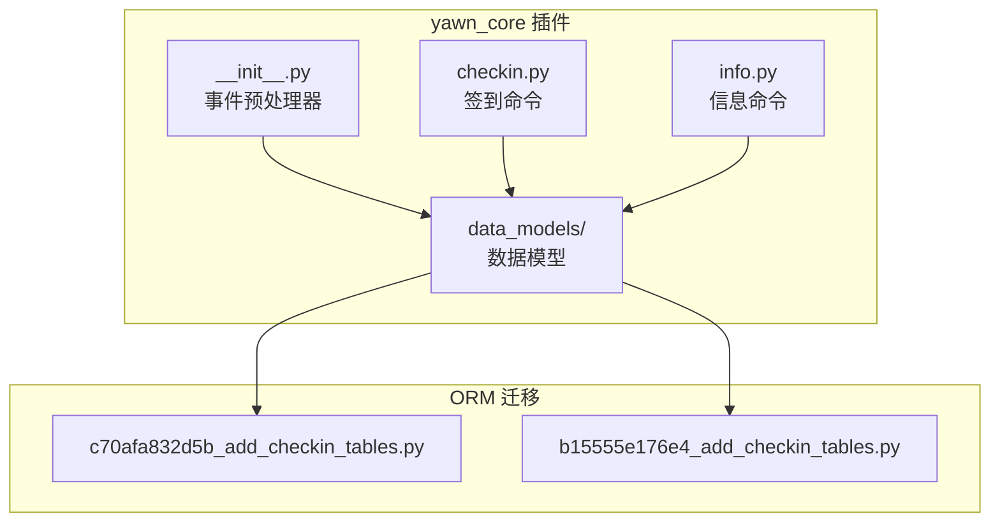
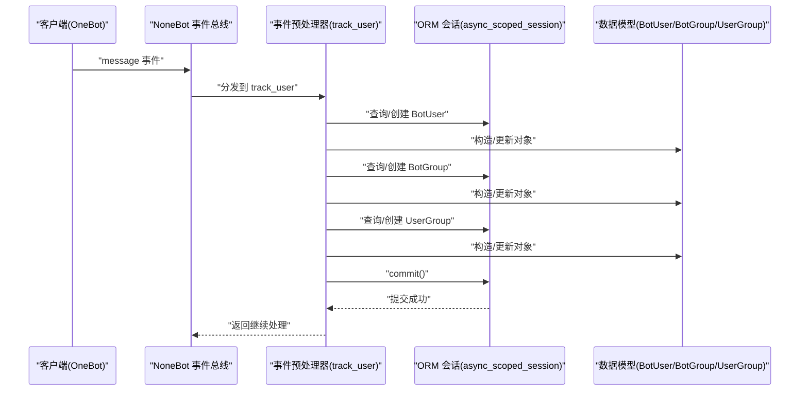
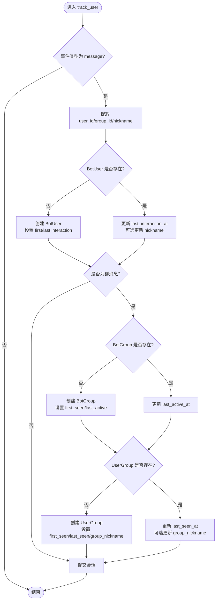
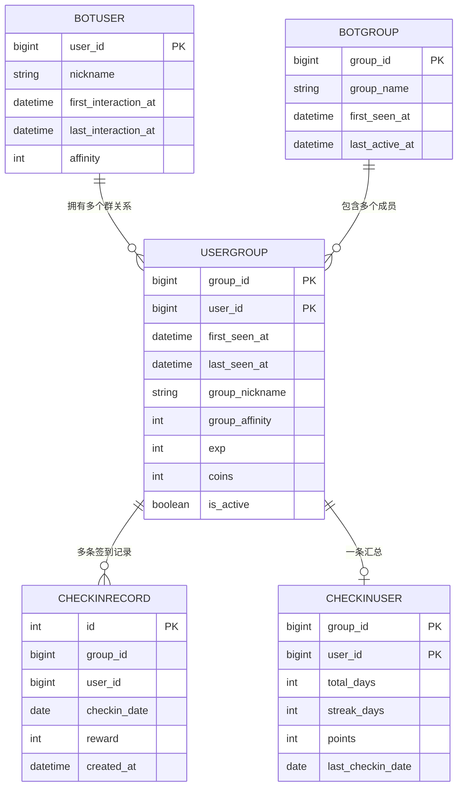
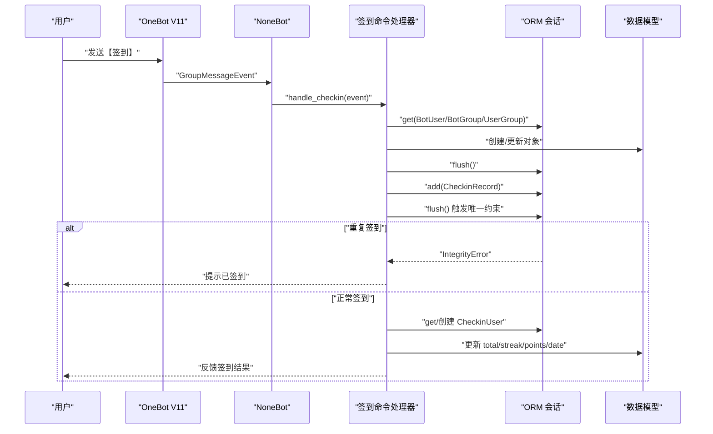
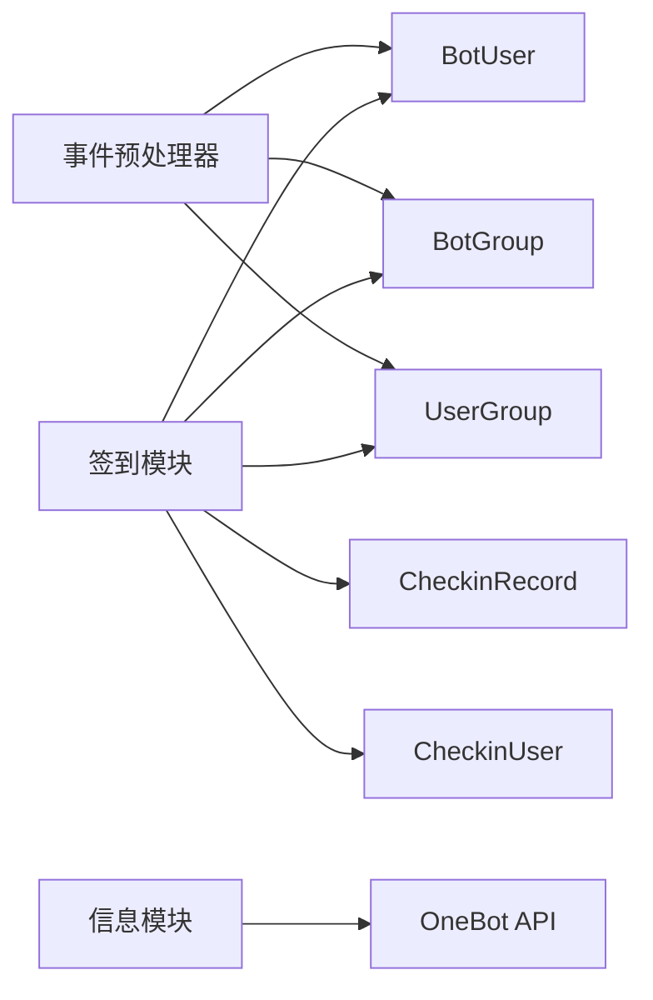

# 用户管理系统

<cite>
**本文引用的文件**   
- [src/plugins/yawn_core/__init__.py](file://src/plugins/yawn_core/__init__.py)
- [src/plugins/yawn_core/data_models/bot_user.py](file://src/plugins/yawn_core/data_models/bot_user.py)
- [src/plugins/yawn_core/data_models/bot_group.py](file://src/plugins/yawn_core/data_models/bot_group.py)
- [src/plugins/yawn_core/data_models/user_group.py](file://src/plugins/yawn_core/data_models/user_group.py)
- [src/plugins/yawn_core/checkin.py](file://src/plugins/yawn_core/checkin.py)
- [src/plugins/yawn_core/info.py](file://src/plugins/yawn_core/info.py)
- [data/nonebot_plugin_orm/migrations/yawn_core/c70afa832d5b_add_checkin_tables.py](file://data/nonebot_plugin_orm/migrations/yawn_core/c70afa832d5b_add_checkin_tables.py)
- [data/nonebot_plugin_orm/migrations/yawn_core/b15555e176e4_add_checkin_tables.py](file://data/nonebot_plugin_orm/migrations/yawn_core/b15555e176e4_add_checkin_tables.py)
- [README.md](file://README.md)
- [pyproject.toml](file://pyproject.toml)
</cite>

## 目录
1. [简介](#简介)
2. [项目结构](#项目结构)
3. [核心组件](#核心组件)
4. [架构总览](#架构总览)
5. [详细组件分析](#详细组件分析)
6. [依赖关系分析](#依赖关系分析)
7. [性能考量](#性能考量)
8. [故障排查指南](#故障排查指南)
9. [结论](#结论)
10. [附录](#附录)

## 简介
本文件面向 YawnBot 的用户管理系统，聚焦事件预处理器与签到模块的协同实现。内容涵盖：
- 事件预处理器的机制：首次交互检测、自动用户注册、用户信息更新
- 用户状态追踪：最后活跃时间记录、群昵称同步
- 用户-群组关系维护：活跃度标记、经验值与积分扩展字段
- 数据模型关联关系与异步会话管理
- 与其他模块的集成方式与可扩展点

该文档旨在帮助开发者快速理解并扩展用户管理相关能力。

## 项目结构
YawnBot 采用插件化架构，用户管理逻辑位于 yawn_core 插件中，包含：
- 事件预处理器：在消息到达时统一处理用户与群组数据的初始化与更新
- 数据模型：定义 BotUser、BotGroup、UserGroup 以及签到相关的 CheckinRecord、CheckinUser
- 功能模块：签到命令与信息展示命令

图表来源
- [src/plugins/yawn_core/__init__.py:16-80](file://src/plugins/yawn_core/__init__.py#L16-L80)
- [src/plugins/yawn_core/checkin.py:22-147](file://src/plugins/yawn_core/checkin.py#L22-L147)
- [src/plugins/yawn_core/info.py:6-39](file://src/plugins/yawn_core/info.py#L6-L39)
- [data/nonebot_plugin_orm/migrations/yawn_core/c70afa832d5b_add_checkin_tables.py:22-57](file://data/nonebot_plugin_orm/migrations/yawn_core/c70afa832d5b_add_checkin_tables.py#L22-L57)
- [data/nonebot_plugin_orm/migrations/yawn_core/b15555e176e4_add_checkin_tables.py:22-113](file://data/nonebot_plugin_orm/migrations/yawn_core/b15555e176e4_add_checkin_tables.py#L22-L113)

章节来源
- [README.md:1-13](file://README.md#L1-L13)
- [pyproject.toml:25-43](file://pyproject.toml#L25-L43)

## 核心组件
- 事件预处理器（track_user）
  - 拦截所有 message 类型事件
  - 提取用户 ID、群 ID、群名片/昵称
  - 确保 BotUser、BotGroup、UserGroup 存在；不存在则创建并记录首次交互/首次群内发言时间
  - 更新 last_interaction_at、last_active_at、last_seen_at，并同步群昵称
  - 使用 async_scoped_session 提交事务

- 数据模型
  - BotUser：全局用户，含昵称、首次/最后交互时间、全局好感度
  - BotGroup：全局群组，含群名、首次出现/最后活跃时间
  - UserGroup：用户-群组关系，含首次/最后出现时间、群昵称、群内好感度、经验值、金币、是否活跃
  - CheckinRecord：签到记录，唯一约束保证“每群每人每天一次”
  - CheckinUser：群内用户签到汇总，累计天数、连续天数、积分、最后签到日期

- 签到模块（checkin）
  - 基于 OneBot V11 群消息触发
  - 自动补齐用户、群组、用户-群组关系
  - 生成签到记录并更新汇总统计
  - 通过 IntegrityError 防止重复签到

- 信息模块（info）
  - 获取机器人登录信息与版本信息
  - 尝试创建调试文件夹（容错同名已存在）

章节来源
- [src/plugins/yawn_core/__init__.py:16-80](file://src/plugins/yawn_core/__init__.py#L16-L80)
- [src/plugins/yawn_core/data_models/bot_user.py:12-32](file://src/plugins/yawn_core/data_models/bot_user.py#L12-L32)
- [src/plugins/yawn_core/data_models/bot_group.py:12-29](file://src/plugins/yawn_core/data_models/bot_group.py#L12-L29)
- [src/plugins/yawn_core/data_models/user_group.py:15-61](file://src/plugins/yawn_core/data_models/user_group.py#L15-L61)
- [src/plugins/yawn_core/checkin.py:22-147](file://src/plugins/yawn_core/checkin.py#L22-L147)
- [src/plugins/yawn_core/info.py:6-39](file://src/plugins/yawn_core/info.py#L6-L39)

## 架构总览
系统以 NoneBot2 的事件驱动为核心，结合 nonebot-plugin-orm 提供异步 ORM 会话。事件预处理器在消息进入时即完成用户与群组数据的“懒加载”与更新，后续业务模块（如签到）复用这些数据。

图表来源
- [src/plugins/yawn_core/__init__.py:16-80](file://src/plugins/yawn_core/__init__.py#L16-L80)
- [src/plugins/yawn_core/data_models/bot_user.py:12-32](file://src/plugins/yawn_core/data_models/bot_user.py#L12-L32)
- [src/plugins/yawn_core/data_models/bot_group.py:12-29](file://src/plugins/yawn_core/data_models/bot_group.py#L12-L29)
- [src/plugins/yawn_core/data_models/user_group.py:15-61](file://src/plugins/yawn_core/data_models/user_group.py#L15-L61)

## 详细组件分析

### 事件预处理器（track_user）
- 首次交互检测
  - 若 BotUser 不存在，则新建并设置 first_interaction_at 与 last_interaction_at
  - 若为群消息且 UserGroup 不存在，则新建并设置 first_seen_at、last_seen_at、group_nickname
- 自动用户注册流程
  - 在消息到达时即时完成用户与群组关系的“懒注册”，无需显式调用注册接口
- 用户信息更新逻辑
  - 每次消息都会更新 last_interaction_at（全局）、last_active_at（群组）、last_seen_at（用户-群组）
  - 若 sender.card 或 nickname 存在，则同步更新 BotUser.nickname 与 UserGroup.group_nickname
- 异步会话管理
  - 使用 async_scoped_session 进行数据库操作，最终 commit() 提交事务

图表来源
- [src/plugins/yawn_core/__init__.py:16-80](file://src/plugins/yawn_core/__init__.py#L16-L80)

章节来源
- [src/plugins/yawn_core/__init__.py:16-80](file://src/plugins/yawn_core/__init__.py#L16-L80)

### 数据模型与关系
- BotUser
  - 主键：user_id
  - 字段：nickname、first_interaction_at、last_interaction_at、affinity
  - 关系：与 UserGroup 一对多（cascade delete-orphan）
- BotGroup
  - 主键：group_id
  - 字段：group_name、first_seen_at、last_active_at
  - 关系：与 UserGroup 一对多（cascade delete-orphan）
- UserGroup
  - 联合主键：group_id + user_id
  - 字段：first_seen_at、last_seen_at、group_nickname、group_affinity、exp、coins、is_active
  - 关系：双向关联 BotUser 与 BotGroup；与 CheckinUser、CheckinRecord 关联
- CheckinRecord
  - 唯一约束：group_id + user_id + checkin_date（每群每人每天一次）
  - 外键：指向 UserGroup(group_id, user_id)
- CheckinUser
  - 联合主键：group_id + user_id
  - 字段：total_days、streak_days、points、last_checkin_date

图表来源
- [src/plugins/yawn_core/data_models/bot_user.py:12-32](file://src/plugins/yawn_core/data_models/bot_user.py#L12-L32)
- [src/plugins/yawn_core/data_models/bot_group.py:12-29](file://src/plugins/yawn_core/data_models/bot_group.py#L12-L29)
- [src/plugins/yawn_core/data_models/user_group.py:15-61](file://src/plugins/yawn_core/data_models/user_group.py#L15-L61)
- [src/plugins/yawn_core/data_models/checkin_record.py:12-53](file://src/plugins/yawn_core/data_models/checkin_record.py#L12-L53)
- [src/plugins/yawn_core/data_models/checkin_user.py:12-47](file://src/plugins/yawn_core/data_models/checkin_user.py#L12-L47)

章节来源
- [src/plugins/yawn_core/data_models/bot_user.py:12-32](file://src/plugins/yawn_core/data_models/bot_user.py#L12-L32)
- [src/plugins/yawn_core/data_models/bot_group.py:12-29](file://src/plugins/yawn_core/data_models/bot_group.py#L12-L29)
- [src/plugins/yawn_core/data_models/user_group.py:15-61](file://src/plugins/yawn_core/data_models/user_group.py#L15-L61)
- [src/plugins/yawn_core/data_models/checkin_record.py:12-53](file://src/plugins/yawn_core/data_models/checkin_record.py#L12-L53)
- [src/plugins/yawn_core/data_models/checkin_user.py:12-47](file://src/plugins/yawn_core/data_models/checkin_user.py#L12-L47)

### 签到模块（checkin）
- 触发条件：群消息执行“签到”命令
- 核心流程
  - 获取当前中国时区时间，计算今天与昨天
  - 随机奖励 5~15 积分
  - 确保 BotUser、BotGroup、UserGroup 存在并更新活跃时间与昵称
  - 写入 CheckinRecord，利用 flush 触发唯一约束检查，捕获 IntegrityError 防止重复签到
  - 更新或创建 CheckinUser，累计 total_days、streak_days、points，并记录 last_checkin_date
- 输出反馈：@用户并显示本次奖励、累计天数、连续天数、当前积分

图表来源
- [src/plugins/yawn_core/checkin.py:22-147](file://src/plugins/yawn_core/checkin.py#L22-L147)
- [src/plugins/yawn_core/data_models/checkin_record.py:12-53](file://src/plugins/yawn_core/data_models/checkin_record.py#L12-L53)
- [src/plugins/yawn_core/data_models/checkin_user.py:12-47](file://src/plugins/yawn_core/data_models/checkin_user.py#L12-L47)

章节来源
- [src/plugins/yawn_core/checkin.py:22-147](file://src/plugins/yawn_core/checkin.py#L22-L147)

### 信息模块（info）
- 获取机器人登录信息与版本信息
- 尝试创建名为“调试信息”的群文件夹，若失败因同名已存在则友好提示
- 用于调试与运维辅助

章节来源
- [src/plugins/yawn_core/info.py:6-39](file://src/plugins/yawn_core/info.py#L6-L39)

## 依赖关系分析
- 运行时依赖
  - nonebot2、nonebot-adapter-onebot、nonebot-plugin-orm 等由 pyproject.toml 声明
  - ORM 使用 SQLAlchemy 映射，迁移脚本由 Alembic 管理
- 模块耦合
  - 事件预处理器与数据模型强耦合（读写 BotUser/BotGroup/UserGroup）
  - 签到模块依赖数据模型与 ORM 会话，并通过唯一约束保障一致性
- 外部集成
  - OneBot V11 适配器提供事件与 API 调用能力
  - 可通过 nonebot-plugin-apscheduler 扩展定时任务（例如活跃度清理）

图表来源
- [src/plugins/yawn_core/__init__.py:16-80](file://src/plugins/yawn_core/__init__.py#L16-L80)
- [src/plugins/yawn_core/checkin.py:22-147](file://src/plugins/yawn_core/checkin.py#L22-L147)
- [src/plugins/yawn_core/info.py:6-39](file://src/plugins/yawn_core/info.py#L6-L39)
- [pyproject.toml:7-17](file://pyproject.toml#L7-L17)

章节来源
- [pyproject.toml:25-43](file://pyproject.toml#L25-L43)

## 性能考量
- 事件预处理器在每条消息上执行多次查询与可能的插入，建议：
  - 批量提交：已在预处理器末尾 commit()，避免频繁 IO
  - 索引优化：对频繁查询的主键与联合主键（UserGroup 的 group_id+user_id）应确保有合适索引
  - 缓存热点：对于高频访问的昵称与活跃时间，可考虑应用层缓存（需与 ORM 保持一致性）
- 签到模块的唯一约束检查通过 flush() 提前触发，减少无效写入
- 时区处理使用 Asia/Shanghai，避免跨时区歧义

[本节为通用指导，不直接分析具体文件]

## 故障排查指南
- 重复签到问题
  - 现象：同一用户在同一群同一天多次签到
  - 原因：未触发唯一约束或异常未捕获
  - 解决：确认 session.flush() 被调用并在 IntegrityError 分支回滚与提示
  - 参考路径：[src/plugins/yawn_core/checkin.py:109-114](file://src/plugins/yawn_core/checkin.py#L109-L114)
- 用户昵称不同步
  - 现象：BotUser.nickname 或 UserGroup.group_nickname 未更新
  - 原因：sender.card/nickname 为空或未进入更新分支
  - 解决：检查事件 sender 字段与更新逻辑
  - 参考路径：[src/plugins/yawn_core/__init__.py:24-45](file://src/plugins/yawn_core/__init__.py#L24-L45), [src/plugins/yawn_core/__init__.py:74-78](file://src/plugins/yawn_core/__init__.py#L74-L78)
- 数据库迁移不一致
  - 现象：表结构变更导致运行时报错
  - 解决：按顺序执行迁移脚本，确保 c70afa832d5b 先于 b15555e176e4
  - 参考路径：[data/nonebot_plugin_orm/migrations/yawn_core/c70afa832d5b_add_checkin_tables.py:22-57](file://data/nonebot_plugin_orm/migrations/yawn_core/c70afa832d5b_add_checkin_tables.py#L22-L57), [data/nonebot_plugin_orm/migrations/yawn_core/b15555e176e4_add_checkin_tables.py:22-113](file://data/nonebot_plugin_orm/migrations/yawn_core/b15555e176e4_add_checkin_tables.py#L22-L113)
- 信息模块创建文件夹失败
  - 现象：ActionFailed 异常抛出
  - 解决：捕获异常并根据 wording 判断“同名文件夹已存在”等场景
  - 参考路径：[src/plugins/yawn_core/info.py:32-39](file://src/plugins/yawn_core/info.py#L32-L39)

章节来源
- [src/plugins/yawn_core/checkin.py:109-114](file://src/plugins/yawn_core/checkin.py#L109-L114)
- [src/plugins/yawn_core/__init__.py:24-45](file://src/plugins/yawn_core/__init__.py#L24-L45)
- [src/plugins/yawn_core/__init__.py:74-78](file://src/plugins/yawn_core/__init__.py#L74-L78)
- [data/nonebot_plugin_orm/migrations/yawn_core/c70afa832d5b_add_checkin_tables.py:22-57](file://data/nonebot_plugin_orm/migrations/yawn_core/c70afa832d5b_add_checkin_tables.py#L22-L57)
- [data/nonebot_plugin_orm/migrations/yawn_core/b15555e176e4_add_checkin_tables.py:22-113](file://data/nonebot_plugin_orm/migrations/yawn_core/b15555e176e4_add_checkin_tables.py#L22-L113)
- [src/plugins/yawn_core/info.py:32-39](file://src/plugins/yawn_core/info.py#L32-L39)

## 结论
YawnBot 的用户管理系统通过事件预处理器实现了“无感”的用户与群组数据初始化与更新，配合签到模块形成完整的用户活跃度与激励体系。数据模型清晰、约束严谨，借助 ORM 异步会话保证了高并发下的稳定性。未来可在以下方向扩展：
- 活跃度阈值与自动标记（如长时间未发言标记为非活跃）
- 积分兑换与等级体系
- 定时任务驱动的活跃度清理与报表生成
- 更丰富的用户画像字段（地区、性别等，需合规采集）

[本节为总结，不直接分析具体文件]

## 附录
- 启动与开发
  - 使用 nb create 生成项目，nb plugin create 创建插件，编写于 src/plugins
  - 运行 nb run --reload 热重载开发
- 依赖清单
  - nonebot2、onebot 适配器、orm 插件、apscheduler、localstore、alconna、htmlkit 等

章节来源
- [README.md:1-13](file://README.md#L1-L13)
- [pyproject.toml:7-17](file://pyproject.toml#L7-L17)