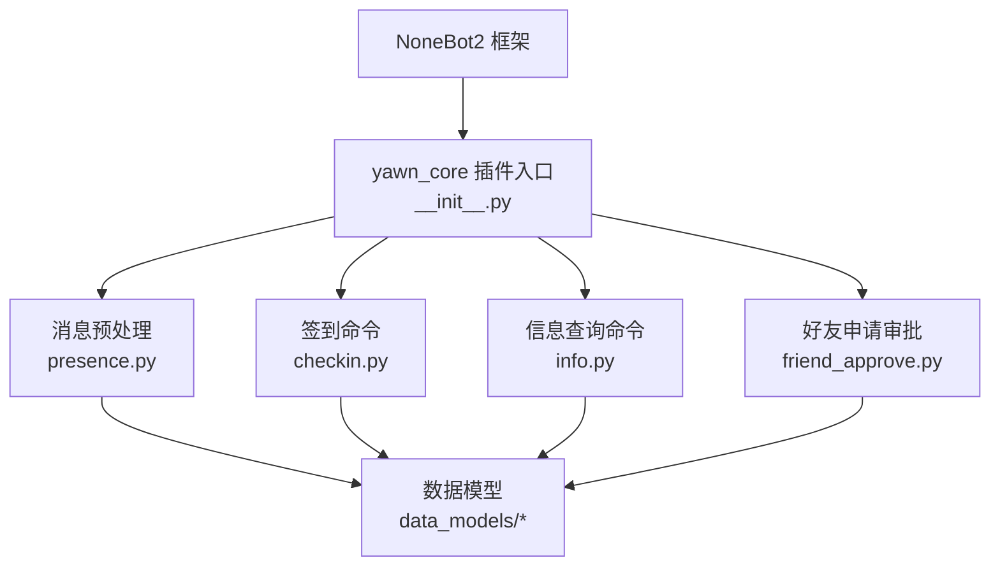
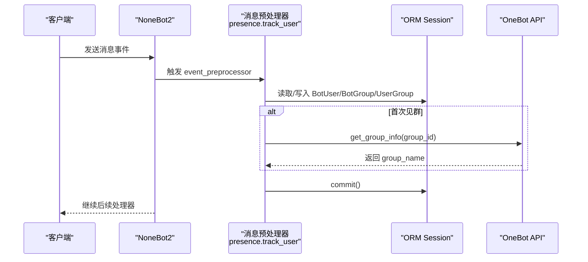
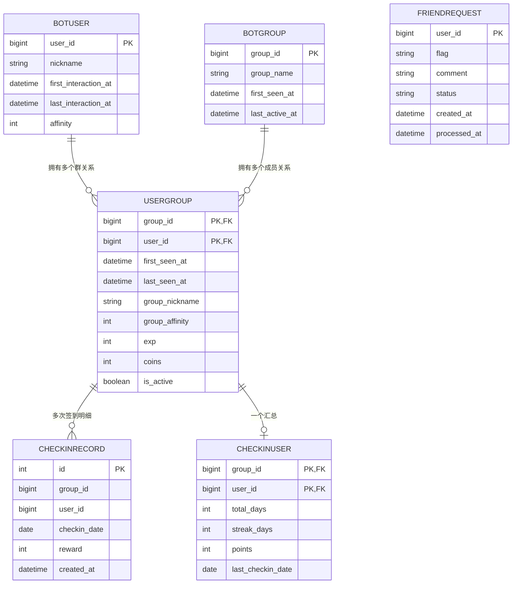
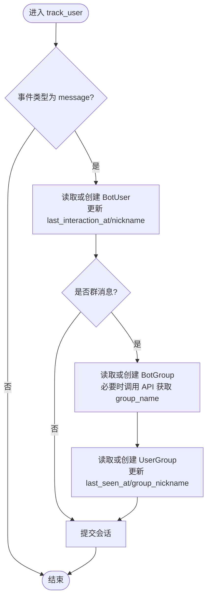
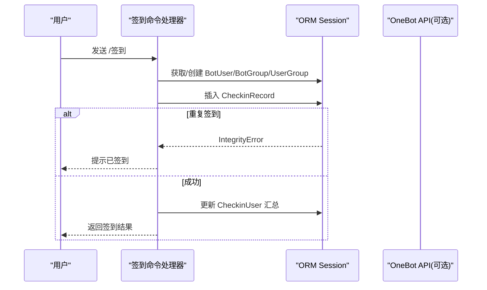
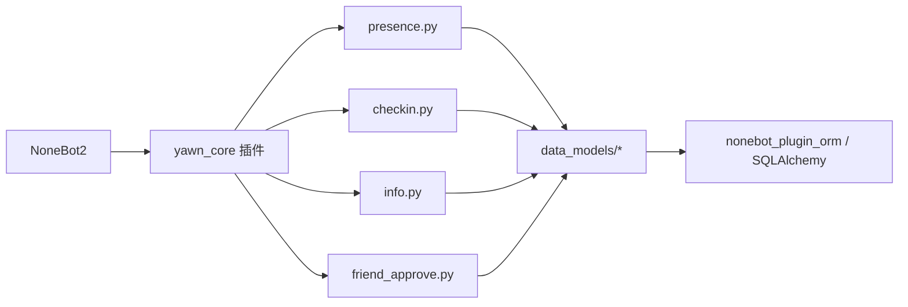

# 用户行为追踪

<cite>
**本文引用的文件**   
- [README.md](file://README.md)
- [pyproject.toml](file://pyproject.toml)
- [__init__.py](file://src/plugins/yawn_core/__init__.py)
- [presence.py](file://src/plugins/yawn_core/presence.py)
- [checkin.py](file://src/plugins/yawn_core/checkin.py)
- [info.py](file://src/plugins/yawn_core/info.py)
- [friend_approve.py](file://src/plugins/yawn_core/friend_approve.py)
- [bot_user.py](file://src/plugins/yawn_core/data_models/bot_user.py)
- [bot_group.py](file://src/plugins/yawn_core/data_models/bot_group.py)
- [user_group.py](file://src/plugins/yawn_core/data_models/user_group.py)
- [checkin_record.py](file://src/plugins/yawn_core/data_models/checkin_record.py)
- [checkin_user.py](file://src/plugins/yawn_core/data_models/checkin_user.py)
- [friend_request.py](file://src/plugins/yawn_core/data_models/friend_request.py)
</cite>

## 目录
1. [简介](#简介)
2. [项目结构](#项目结构)
3. [核心组件](#核心组件)
4. [架构总览](#架构总览)
5. [详细组件分析](#详细组件分析)
6. [依赖关系分析](#依赖关系分析)
7. [性能与一致性](#性能与一致性)
8. [故障排查指南](#故障排查指南)
9. [结论](#结论)
10. [附录：行为分析与监控告警配置建议](#附录行为分析与监控告警配置建议)

## 简介
本文件面向 YawnBot 的“用户行为追踪”能力，系统性说明以下机制：
- 首次对话检测、群成员跟踪与活跃度统计的实现原理
- 消息预处理器的事件拦截、数据同步与用户状态更新逻辑
- BotUser、BotGroup、UserGroup 数据模型在行为追踪中的作用及关键字段维护（如 last_seen_at、is_active）
- 新用户注册流程、群成员变更检测思路与活跃度计算方法
- 事件处理示例、状态更新与群组信息同步实践
- 数据一致性保证、性能优化策略与内存管理
- 行为分析接口与监控告警的配置建议，帮助管理员掌握用户活动模式

## 项目结构
YawnBot 基于 NoneBot2 插件体系，yawn_core 插件提供签到、好友申请审批、个人信息查询以及用户行为追踪等能力。核心目录如下：
- src/plugins/yawn_core：插件主入口与各功能模块
- src/plugins/yawn_core/data_models：SQLAlchemy ORM 数据模型定义
- data/nonebot_plugin_orm/migrations：数据库迁移脚本（签到相关）

图表来源
- [__init__.py:1-5](file://src/plugins/yawn_core/__init__.py#L1-L5)
- [presence.py:1-103](file://src/plugins/yawn_core/presence.py#L1-L103)
- [checkin.py:1-147](file://src/plugins/yawn_core/checkin.py#L1-L147)
- [info.py:1-40](file://src/plugins/yawn_core/info.py#L1-L40)
- [friend_approve.py:1-152](file://src/plugins/yawn_core/friend_approve.py#L1-L152)

章节来源
- [README.md:1-13](file://README.md#L1-L13)
- [pyproject.toml:1-44](file://pyproject.toml#L1-L44)
- [__init__.py:1-5](file://src/plugins/yawn_core/__init__.py#L1-L5)

## 核心组件
- 消息预处理器 presence.track_user：拦截 message 类型事件，完成用户与群的基础信息初始化与活跃时间更新
- 签到模块 checkin.handle_checkin：实现每日签到、积分累计、连续签到天数计算与去重
- 信息查询 info.handle_info：聚合展示用户全局与群内关键状态字段
- 好友申请 friend_approve：记录并审批好友请求，辅助新用户的准入流程

章节来源
- [presence.py:16-103](file://src/plugins/yawn_core/presence.py#L16-L103)
- [checkin.py:22-147](file://src/plugins/yawn_core/checkin.py#L22-L147)
- [info.py:8-40](file://src/plugins/yawn_core/info.py#L8-L40)
- [friend_approve.py:23-152](file://src/plugins/yawn_core/friend_approve.py#L23-L152)

## 架构总览
整体采用“事件驱动 + ORM 持久化”的架构：
- NoneBot2 通过 event_preprocessor 注入消息预处理逻辑
- 所有读写通过 nonebot_plugin_orm 提供的 async_scoped_session 进行异步事务操作
- 数据模型使用 SQLAlchemy ORM 定义，确保表间关系与约束

图表来源
- [presence.py:16-103](file://src/plugins/yawn_core/presence.py#L16-L103)

章节来源
- [pyproject.toml:25-44](file://pyproject.toml#L25-L44)

## 详细组件分析

### 数据模型与关系
- BotUser：全局用户维度，记录昵称、首次交互时间、最后交互时间、全局好感度，以及与 UserGroup 的一对多关系
- BotGroup：全局群维度，记录群名、首次出现时间、最后活跃时间，以及与 UserGroup 的一对多关系
- UserGroup：用户与群的关联维度，记录首次/最后发言时间、群名片、群内好感度、经验、金币、是否活跃等，并与签到汇总与明细建立关系
- CheckinRecord：每次签到的明细记录，包含日期、奖励积分，并通过唯一约束保证每人每群每天仅一次签到
- CheckinUser：用户在某群的签到汇总，包括累计天数、连续天数、总积分、最近签到日期
- FriendRequest：好友申请审批记录，按用户保留一条，支持 pending/approved/rejected 状态流转

图表来源
- [bot_user.py:12-32](file://src/plugins/yawn_core/data_models/bot_user.py#L12-L32)
- [bot_group.py:12-29](file://src/plugins/yawn_core/data_models/bot_group.py#L12-L29)
- [user_group.py:15-61](file://src/plugins/yawn_core/data_models/user_group.py#L15-L61)
- [checkin_record.py:12-53](file://src/plugins/yawn_core/data_models/checkin_record.py#L12-L53)
- [checkin_user.py:12-47](file://src/plugins/yawn_core/data_models/checkin_user.py#L12-L47)
- [friend_request.py:9-36](file://src/plugins/yawn_core/data_models/friend_request.py#L9-L36)

章节来源
- [bot_user.py:12-32](file://src/plugins/yawn_core/data_models/bot_user.py#L12-L32)
- [bot_group.py:12-29](file://src/plugins/yawn_core/data_models/bot_group.py#L12-L29)
- [user_group.py:15-61](file://src/plugins/yawn_core/data_models/user_group.py#L15-L61)
- [checkin_record.py:12-53](file://src/plugins/yawn_core/data_models/checkin_record.py#L12-L53)
- [checkin_user.py:12-47](file://src/plugins/yawn_core/data_models/checkin_user.py#L12-L47)
- [friend_request.py:9-36](file://src/plugins/yawn_core/data_models/friend_request.py#L9-L36)

### 消息预处理器：事件拦截、数据同步与状态更新
- 事件过滤：仅处理 message 类型事件
- 用户维度：
  - 若不存在则创建 BotUser，记录首次交互时间与昵称；否则更新 last_interaction_at 与昵称
- 群维度：
  - 若是群消息，确保 BotGroup 存在；首次见群时调用 OneBot API 获取 group_name，并记录 first_seen_at 与 last_active_at
  - 确保 UserGroup 存在；首次见群发言时记录 first_seen_at、last_seen_at 与群名片；否则更新 last_seen_at 与群名片
- 事务提交：统一在末尾 commit，保证原子性

图表来源
- [presence.py:16-103](file://src/plugins/yawn_core/presence.py#L16-L103)

章节来源
- [presence.py:16-103](file://src/plugins/yawn_core/presence.py#L16-L103)

### 签到模块：活跃度与积分统计
- 触发方式：命令 /签到
- 核心逻辑：
  - 随机奖励 5~15 积分
  - 确保 BotUser、BotGroup、UserGroup 存在并更新 last_interaction_at/last_active_at/last_seen_at/is_active
  - 插入 CheckinRecord，利用数据库唯一约束避免重复签到
  - 更新 CheckinUser 汇总：total_days、points、streak_days、last_checkin_date
- 去重策略：先 flush 触发唯一约束检查，捕获 IntegrityError 回滚并提示已签到

图表来源
- [checkin.py:22-147](file://src/plugins/yawn_core/checkin.py#L22-L147)
- [checkin_record.py:12-53](file://src/plugins/yawn_core/data_models/checkin_record.py#L12-L53)
- [checkin_user.py:12-47](file://src/plugins/yawn_core/data_models/checkin_user.py#L12-L47)

章节来源
- [checkin.py:22-147](file://src/plugins/yawn_core/checkin.py#L22-L147)
- [checkin_record.py:12-53](file://src/plugins/yawn_core/data_models/checkin_record.py#L12-L53)
- [checkin_user.py:12-47](file://src/plugins/yawn_core/data_models/checkin_user.py#L12-L47)

### 信息查询：行为指标聚合展示
- 命令：/info 及其别名
- 输出内容：
  - 全局：昵称、好感度、首次对话时间、最后活跃时间
  - 群内：群名片、群好感度、经验、金币、首次发言时间、最后发言时间

章节来源
- [info.py:8-40](file://src/plugins/yawn_core/info.py#L8-L40)

### 好友申请审批：新用户准入流程
- 监听好友请求事件，记录 flag、comment、status 为 pending，并通知超级管理员
- 管理员可通过 /approve /reject 列表查看并处理待审批申请
- 该流程为“新用户注册”的前置环节，便于控制机器人添加好友的范围

章节来源
- [friend_approve.py:23-152](file://src/plugins/yawn_core/friend_approve.py#L23-L152)
- [friend_request.py:9-36](file://src/plugins/yawn_core/data_models/friend_request.py#L9-L36)

## 依赖关系分析
- 运行时依赖：
  - nonebot2、onebot v11 适配器、apscheduler、sentry、localstore、orm、htmlkit 等
- 插件加载：
  - yawn_core 插件在启动时导入 checkin、friend_approve、info、presence 子模块，完成命令与预处理器的注册
- 数据层依赖：
  - nonebot_plugin_orm 提供 Model、async_scoped_session
  - SQLAlchemy 负责表结构与关系映射、约束与级联删除

图表来源
- [__init__.py:1-5](file://src/plugins/yawn_core/__init__.py#L1-L5)
- [pyproject.toml:25-44](file://pyproject.toml#L25-L44)

章节来源
- [__init__.py:1-5](file://src/plugins/yawn_core/__init__.py#L1-L5)
- [pyproject.toml:25-44](file://pyproject.toml#L25-L44)

## 性能与一致性
- 事务与提交
  - 消息预处理器在单个事件处理中集中 commit，减少频繁提交开销
  - 签到模块通过 session.flush() 提前触发唯一约束检查，失败时 rollback，避免脏写
- 索引与约束
  - CheckinRecord 使用联合唯一约束保证“每人每群每天仅一次签到”，由数据库层面保障一致性
  - UserGroup 使用复合主键 (group_id, user_id)，天然高效定位用户-群关系
- 外部 API 调用
  - 首次见群时调用 get_group_info，异常被捕获并降级处理，不影响主流程
- 内存与对象生命周期
  - 使用 async_scoped_session 确保每个事件上下文独立，避免跨请求共享状态
  - 关系属性按需访问，避免不必要的 eager loading
- 可扩展优化建议
  - 对高频查询字段（如 last_seen_at、is_active）增加合适索引
  - 批量写入场景可考虑合并多次写入后一次性提交
  - 对外部 API 调用增加缓存与重试策略

章节来源
- [presence.py:16-103](file://src/plugins/yawn_core/presence.py#L16-L103)
- [checkin.py:99-114](file://src/plugins/yawn_core/checkin.py#L99-L114)
- [checkin_record.py:15-29](file://src/plugins/yawn_core/data_models/checkin_record.py#L15-L29)
- [user_group.py:18-27](file://src/plugins/yawn_core/data_models/user_group.py#L18-L27)

## 故障排查指南
- 重复签到报错
  - 现象：抛出 IntegrityError
  - 原因：同一用户在同一群同一天重复签到
  - 处理：代码已捕获并回滚，向用户提示“今天已经签到过了”
  - 参考路径：[checkin.py:109-114](file://src/plugins/yawn_core/checkin.py#L109-L114)
- 群名缺失或为空
  - 现象：BotGroup.group_name 为空
  - 处理：首次见群时尝试调用 get_group_info 补填；旧记录可在后续事件中再次尝试补填
  - 参考路径：[presence.py:54-84](file://src/plugins/yawn_core/presence.py#L54-L84)
- 用户未初始化
  - 现象：首次消息到达时 BotUser/UserGroup 不存在
  - 处理：预处理器自动创建并填充必要字段
  - 参考路径：[presence.py:31-45](file://src/plugins/yawn_core/presence.py#L31-L45), [presence.py:86-101](file://src/plugins/yawn_core/presence.py#L86-L101)
- 好友申请未收到通知
  - 现象：管理员未收到审批消息
  - 排查：确认 superusers 配置正确，且 bot 能发送私聊消息
  - 参考路径：[friend_approve.py:21-63](file://src/plugins/yawn_core/friend_approve.py#L21-L63)

章节来源
- [checkin.py:109-114](file://src/plugins/yawn_core/checkin.py#L109-L114)
- [presence.py:54-84](file://src/plugins/yawn_core/presence.py#L54-L84)
- [presence.py:31-45](file://src/plugins/yawn_core/presence.py#L31-L45)
- [presence.py:86-101](file://src/plugins/yawn_core/presence.py#L86-L101)
- [friend_approve.py:21-63](file://src/plugins/yawn_core/friend_approve.py#L21-L63)

## 结论
YawnBot 的用户行为追踪以轻量、可靠为核心设计目标：
- 通过消息预处理器实现无侵入式的全量消息采集与基础状态维护
- 借助 ORM 模型与数据库约束保证数据一致性与完整性
- 签到模块提供活跃度与激励闭环，信息查询命令便于快速诊断
- 好友申请审批为新用户准入提供可控入口
未来可在不改动现有稳定链路的前提下，扩展更多行为指标与分析能力。

## 附录：行为分析与监控告警配置建议
- 行为分析接口建议
  - 新增 REST/命令接口用于导出：
    - 用户活跃度：last_seen_at、is_active、exp、coins、affinity
    - 群活跃度：last_active_at、成员数、发言频次
    - 签到统计：total_days、streak_days、points、checkin_date 分布
  - 结合 APScheduler 定时生成报表，推送至管理端
- 监控与告警
  - 接入 sentry 插件收集异常与慢查询日志
  - 针对关键路径（get_group_info、session.commit、UniqueConstraint 冲突）设置告警阈值
  - 对长时间未活跃用户（如 last_seen_at 超过阈值）与低活跃群进行预警
- 配置要点
  - 在 pyproject.toml 中启用 nonebot-plugin-sentry、nonebot-plugin-apscheduler 等插件
  - 合理设置数据库连接池大小与超时，避免高并发下阻塞
  - 对热点表（UserGroup、CheckinRecord）评估索引覆盖情况

章节来源
- [pyproject.toml:35-44](file://pyproject.toml#L35-L44)