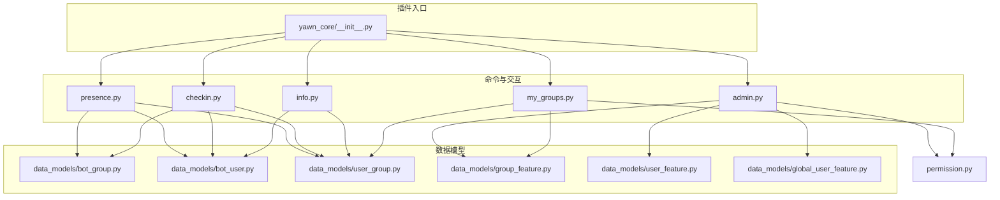
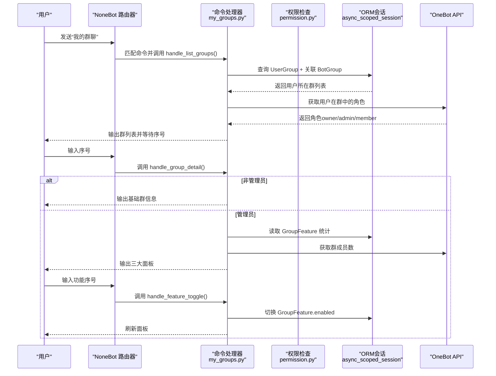
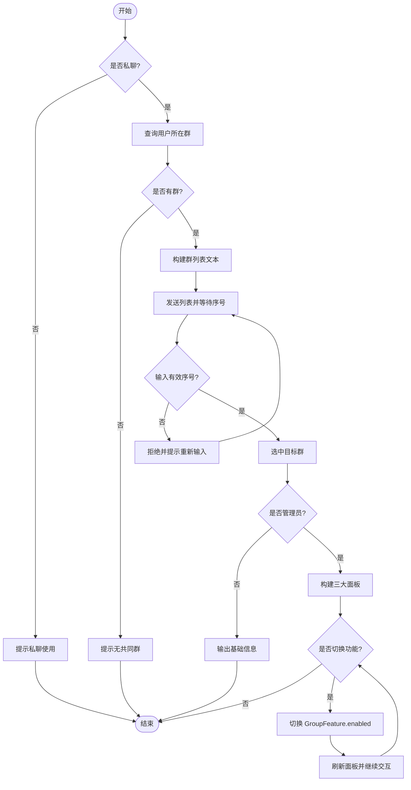
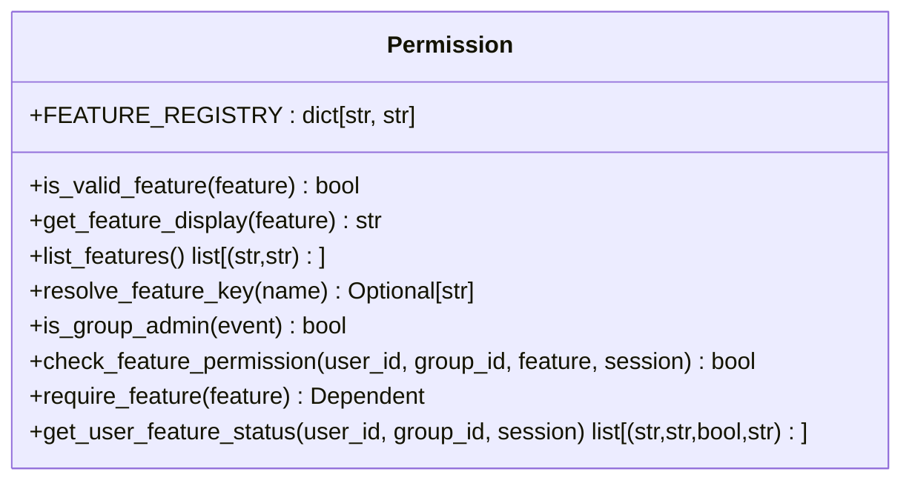
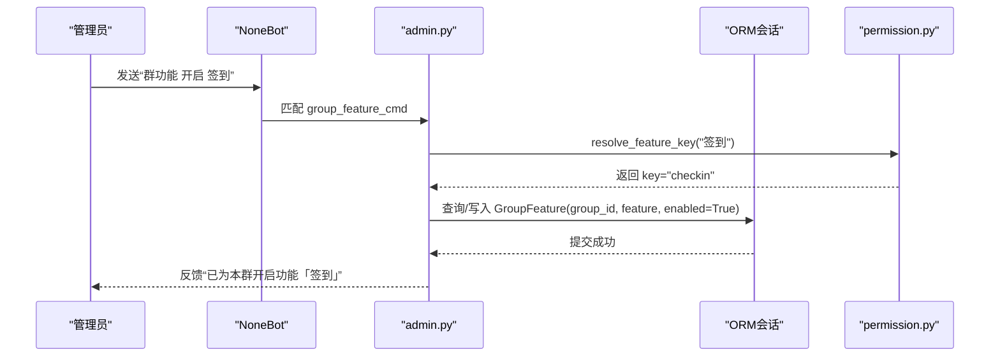
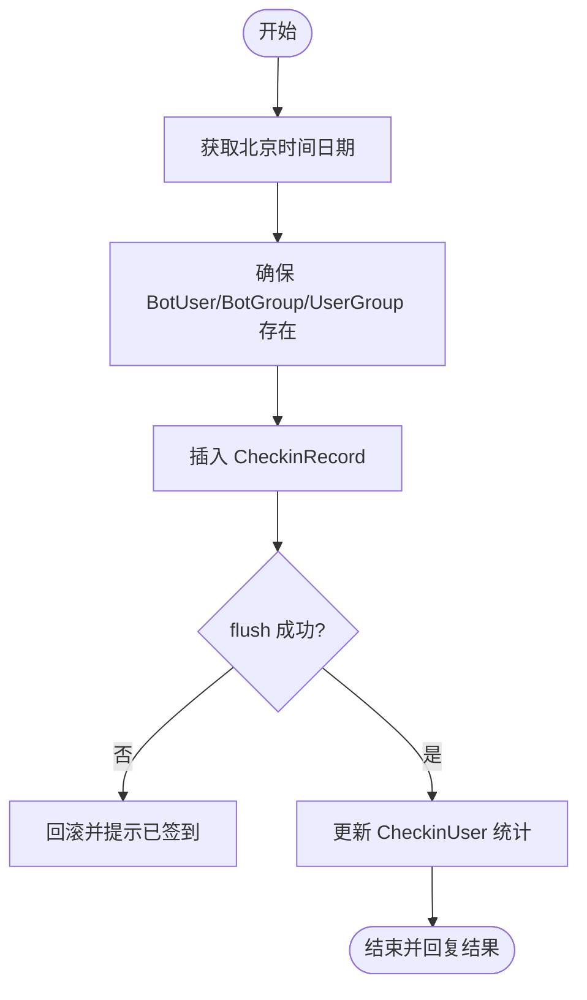
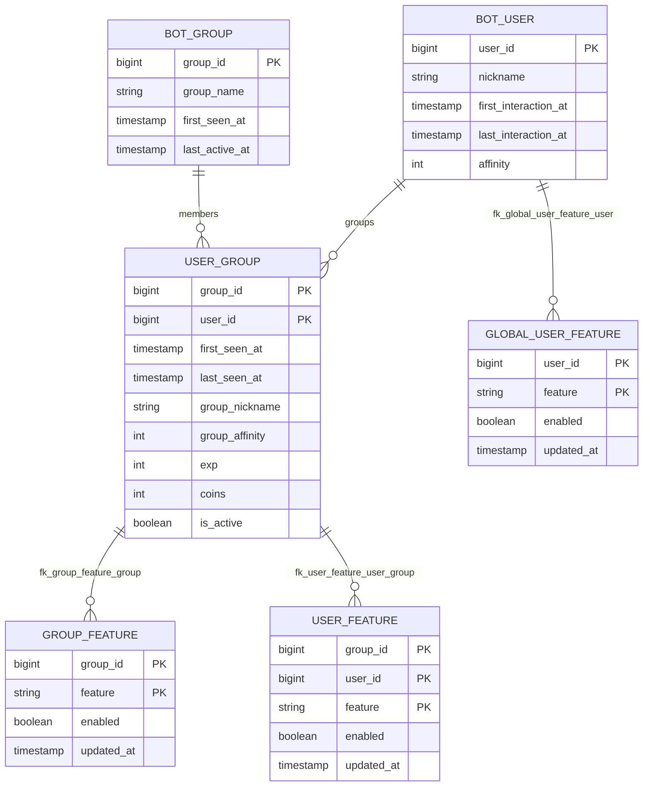
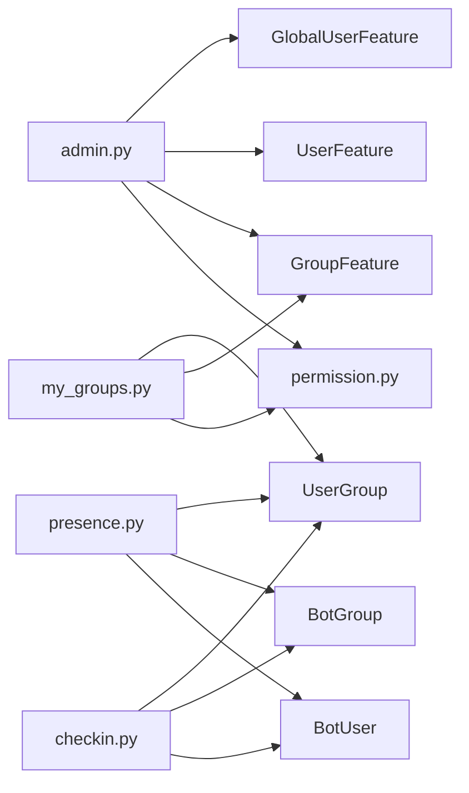

# 私聊群面板模块

<cite>
**本文引用的文件**   
- [README.md](file://README.md)
- [pyproject.toml](file://pyproject.toml)
- [__init__.py](file://src/plugins/yawn_core/__init__.py)
- [my_groups.py](file://src/plugins/yawn_core/my_groups.py)
- [info.py](file://src/plugins/yawn_core/info.py)
- [permission.py](file://src/plugins/yawn_core/permission.py)
- [admin.py](file://src/plugins/yawn_core/admin.py)
- [checkin.py](file://src/plugins/yawn_core/checkin.py)
- [presence.py](file://src/plugins/yawn_core/presence.py)
- [bot_group.py](file://src/plugins/yawn_core/data_models/bot_group.py)
- [bot_user.py](file://src/plugins/yawn_core/data_models/bot_user.py)
- [user_group.py](file://src/plugins/yawn_core/data_models/user_group.py)
- [group_feature.py](file://src/plugins/yawn_core/data_models/group_feature.py)
- [user_feature.py](file://src/plugins/yawn_core/data_models/user_feature.py)
- [global_user_feature.py](file://src/plugins/yawn_core/data_models/global_user_feature.py)
</cite>

## 目录
1. [简介](#简介)
2. [项目结构](#项目结构)
3. [核心组件](#核心组件)
4. [架构总览](#架构总览)
5. [详细组件分析](#详细组件分析)
6. [依赖关系分析](#依赖关系分析)
7. [性能考量](#性能考量)
8. [故障排查指南](#故障排查指南)
9. [结论](#结论)
10. [附录](#附录)

## 简介
本模块为“私聊群面板”能力，提供用户在私聊中查看与机器人共同存在的群列表、选择群查看基础信息；管理员可进入“功能面板/管理面板/监测面板”，并交互式切换群内功能开关。同时配套权限系统（用户级、群级、全局级）与签到、个人信息等辅助功能，形成完整的私聊交互入口与管理闭环。

## 项目结构
- 插件根入口：yawn_core 插件通过 __init__.py 统一加载各子模块。
- 命令与交互：my_groups.py 实现“我的群聊”主流程；info.py 提供“个人信息”查询；admin.py 提供各类权限管理命令；checkin.py 提供签到功能；presence.py 作为事件预处理自动维护用户与群数据。
- 数据模型：data_models 下定义 BotGroup、BotUser、UserGroup、GroupFeature、UserFeature、GlobalUserFeature 等 ORM 模型。
- 运行环境：基于 NoneBot2 + OneBot V11 适配器，使用 nonebot-plugin-orm 进行数据库操作。

图表来源
- [__init__.py:1-21](file://src/plugins/yawn_core/__init__.py#L1-L21)
- [my_groups.py:1-331](file://src/plugins/yawn_core/my_groups.py#L1-L331)
- [info.py:1-46](file://src/plugins/yawn_core/info.py#L1-L46)
- [admin.py:1-515](file://src/plugins/yawn_core/admin.py#L1-L515)
- [checkin.py:1-150](file://src/plugins/yawn_core/checkin.py#L1-L150)
- [presence.py:1-103](file://src/plugins/yawn_core/presence.py#L1-L103)
- [bot_group.py:1-29](file://src/plugins/yawn_core/data_models/bot_group.py#L1-L29)
- [bot_user.py:1-32](file://src/plugins/yawn_core/data_models/bot_user.py#L1-L32)
- [user_group.py:1-61](file://src/plugins/yawn_core/data_models/user_group.py#L1-L61)
- [group_feature.py:1-29](file://src/plugins/yawn_core/data_models/group_feature.py#L1-L29)
- [user_feature.py:1-30](file://src/plugins/yawn_core/data_models/user_feature.py#L1-L30)
- [global_user_feature.py:1-29](file://src/plugins/yawn_core/data_models/global_user_feature.py#L1-L29)

章节来源
- [README.md:1-13](file://README.md#L1-L13)
- [pyproject.toml:1-124](file://pyproject.toml#L1-L124)
- [__init__.py:1-21](file://src/plugins/yawn_core/__init__.py#L1-L21)

## 核心组件
- 权限系统（permission.py）
  - 功能注册表 FEATURE_REGISTRY，支持新增功能即插即用。
  - 解析链 check_feature_permission：超级管理员优先，随后按场景（群内 UserFeature > GroupFeature；私聊 GlobalUserFeature）判定，默认放行。
  - 依赖工厂 require_feature，用于在 handler 中注入权限检查。
  - 状态查询 get_user_feature_status，供管理界面展示。
- 私聊群面板（my_groups.py）
  - 命令“我的群聊”列出用户与机器人共同存在的群，支持序号选择。
  - 非管理员显示基础信息；管理员展示三大面板（功能/管理/监测），并可循环切换功能开关。
- 权限管理（admin.py）
  - 普通用户：功能列表、开启/关闭个人功能。
  - 群主/群管：查看/修改本群功能、管理特定用户功能。
  - 超级管理员：跨群/跨用户的全局功能控制与权限查询。
- 签到（checkin.py）
  - 基于中国时区计算，记录签到次数、连续天数、积分，并更新用户与群活跃度。
- 个人信息（info.py）
  - 展示用户昵称、好感度、首次/最后活跃时间，以及群名片、群好感度、经验金币、发言时间等。
- 存在追踪（presence.py）
  - 事件预处理自动维护 BotUser/BotGroup/UserGroup，首次出现时补全群名与时间戳。

章节来源
- [permission.py:1-225](file://src/plugins/yawn_core/permission.py#L1-L225)
- [my_groups.py:1-331](file://src/plugins/yawn_core/my_groups.py#L1-L331)
- [admin.py:1-515](file://src/plugins/yawn_core/admin.py#L1-L515)
- [checkin.py:1-150](file://src/plugins/yawn_core/checkin.py#L1-L150)
- [info.py:1-46](file://src/plugins/yawn_core/info.py#L1-L46)
- [presence.py:1-103](file://src/plugins/yawn_core/presence.py#L1-L103)

## 架构总览
整体采用“命令处理器 + 权限中间件 + ORM 数据层”的分层设计。消息进入后由 NoneBot 路由到对应 on_command 处理器，处理器通过 async_scoped_session 访问数据库，结合 permission 模块的依赖注入完成权限校验，最终返回文本或触发下一轮交互。

图表来源
- [my_groups.py:152-331](file://src/plugins/yawn_core/my_groups.py#L152-L331)
- [permission.py:71-162](file://src/plugins/yawn_core/permission.py#L71-L162)

## 详细组件分析

### 私聊群面板（my_groups.py）
- 命令入口：on_command("我的群聊")，别名“群列表”“我的群”。
- 处理流程：
  - 仅允许私聊，否则提示私聊使用。
  - 查询用户与机器人共同存在的群，附带群名、首次/最后活跃时间。
  - 通过 OneBot API 获取用户在群中的角色，决定后续面板。
  - 非管理员：输出基础信息。
  - 管理员：构建“功能面板/管理面板/监测面板”，支持循环切换功能开关。
- 交互设计：使用 matcher.state 传递上下文（groups、selected_group、is_admin），got 钩子收集用户输入并校验。

图表来源
- [my_groups.py:152-331](file://src/plugins/yawn_core/my_groups.py#L152-L331)

章节来源
- [my_groups.py:1-331](file://src/plugins/yawn_core/my_groups.py#L1-L331)

### 权限系统（permission.py）
- 功能注册表：FEATURE_REGISTRY 集中管理功能标识与中文显示名。
- 权限解析链：
  - 超级管理员始终放行。
  - 群聊：UserFeature（用户覆盖）> GroupFeature（群设置）> 默认开启。
  - 私聊：GlobalUserFeature（全局用户开关）> 默认开启。
- 依赖注入：require_feature(feature) 返回 Dependent，在 handler 参数中注入，未授权时直接 finish 提示。
- 状态查询：get_user_feature_status 返回每个功能的 enabled 值及来源（用户覆盖/群设置/默认开启/全局设置）。

图表来源
- [permission.py:1-225](file://src/plugins/yawn_core/permission.py#L1-L225)

章节来源
- [permission.py:1-225](file://src/plugins/yawn_core/permission.py#L1-L225)

### 权限管理（admin.py）
- 普通用户：
  - “功能列表”：展示当前群的功能状态。
  - “开启/关闭”：设置 UserFeature 覆盖。
- 群主/群管：
  - “群功能”：查看/修改 GroupFeature。
  - “群用户功能”：为指定用户设置 UserFeature（自动创建 UserGroup 若不存在）。
- 超级管理员：
  - “全局群功能”：跨群设置 GroupFeature。
  - “全局用户功能”：跨用户设置 UserFeature 或 GlobalUserFeature。
  - “权限查询”：查询某用户完整权限状态。

图表来源
- [admin.py:186-238](file://src/plugins/yawn_core/admin.py#L186-L238)
- [permission.py:53-61](file://src/plugins/yawn_core/permission.py#L53-L61)

章节来源
- [admin.py:1-515](file://src/plugins/yawn_core/admin.py#L1-L515)

### 签到（checkin.py）
- 时区：使用 Asia/Shanghai 计算日期。
- 逻辑：
  - 随机奖励 5~15 积分。
  - 确保 BotUser、BotGroup、UserGroup 存在并更新时间。
  - 插入 CheckinRecord，唯一约束冲突则提示重复签到。
  - 更新 CheckinUser 累计天数、连续天数、积分。
- 权限：通过 require_feature("checkin") 控制。

图表来源
- [checkin.py:44-150](file://src/plugins/yawn_core/checkin.py#L44-L150)

章节来源
- [checkin.py:1-150](file://src/plugins/yawn_core/checkin.py#L1-L150)

### 个人信息（info.py）
- 展示 BotUser 与 UserGroup 的关键字段：昵称、好感度、首次/最后活跃、群名片、群好感度、经验、金币、发言时间等。
- 权限：通过 require_feature("info") 控制。

章节来源
- [info.py:1-46](file://src/plugins/yawn_core/info.py#L1-L46)

### 存在追踪（presence.py）
- 事件预处理：对每条 message 类型事件进行追踪。
- 行为：
  - 首次对话：创建 BotUser，记录 first_interaction_at。
  - 群消息：确保 BotGroup 存在，必要时调用 OneBot API 获取群名；创建/更新 UserGroup 并更新时间与名片。
  - 每次事件后 commit 持久化。

章节来源
- [presence.py:1-103](file://src/plugins/yawn_core/presence.py#L1-L103)

### 数据模型（data_models）
- BotGroup：群 ID、名称、首次/最后活跃时间，与 UserGroup 一对多。
- BotUser：用户 ID、昵称、首次/最后互动时间，与 UserGroup 一对多。
- UserGroup：用户-群关系，包含群名片、群好感度、经验、金币、活跃标记，以及与签到相关的一对一/一对多关系。
- GroupFeature：群级别功能开关（enabled 默认 True）。
- UserFeature：群内用户级功能覆盖（优先级高于群设置）。
- GlobalUserFeature：全局用户级功能开关（适用于私聊/跨群）。

图表来源
- [bot_group.py:1-29](file://src/plugins/yawn_core/data_models/bot_group.py#L1-L29)
- [bot_user.py:1-32](file://src/plugins/yawn_core/data_models/bot_user.py#L1-L32)
- [user_group.py:1-61](file://src/plugins/yawn_core/data_models/user_group.py#L1-L61)
- [group_feature.py:1-29](file://src/plugins/yawn_core/data_models/group_feature.py#L1-L29)
- [user_feature.py:1-30](file://src/plugins/yawn_core/data_models/user_feature.py#L1-L30)
- [global_user_feature.py:1-29](file://src/plugins/yawn_core/data_models/global_user_feature.py#L1-L29)

## 依赖关系分析
- 模块耦合
  - my_groups.py 依赖 permission.list_features 与 ORM 模型 GroupFeature、UserGroup。
  - admin.py 依赖 permission 提供的工具函数与 ORM 模型 GroupFeature、UserFeature、GlobalUserFeature。
  - checkin.py 依赖 ORM 模型 BotUser、BotGroup、UserGroup、CheckinRecord、CheckinUser。
  - presence.py 依赖 ORM 模型 BotUser、BotGroup、UserGroup。
- 外部依赖
  - NoneBot2、OneBot V11 适配器、nonebot-plugin-orm、SQLAlchemy。
- 潜在循环依赖
  - 模块间通过相对导入组织，未见明显循环引用；数据模型之间通过外键约束建立关系。

图表来源
- [my_groups.py:1-331](file://src/plugins/yawn_core/my_groups.py#L1-L331)
- [admin.py:1-515](file://src/plugins/yawn_core/admin.py#L1-L515)
- [checkin.py:1-150](file://src/plugins/yawn_core/checkin.py#L1-L150)
- [presence.py:1-103](file://src/plugins/yawn_core/presence.py#L1-L103)
- [group_feature.py:1-29](file://src/plugins/yawn_core/data_models/group_feature.py#L1-L29)
- [user_feature.py:1-30](file://src/plugins/yawn_core/data_models/user_feature.py#L1-L30)
- [global_user_feature.py:1-29](file://src/plugins/yawn_core/data_models/global_user_feature.py#L1-L29)
- [bot_user.py:1-32](file://src/plugins/yawn_core/data_models/bot_user.py#L1-L32)
- [bot_group.py:1-29](file://src/plugins/yawn_core/data_models/bot_group.py#L1-L29)
- [user_group.py:1-61](file://src/plugins/yawn_core/data_models/user_group.py#L1-L61)

章节来源
- [pyproject.toml:1-124](file://pyproject.toml#L1-L124)

## 性能考量
- 数据库查询
  - 使用 selectinload 预加载关联对象，减少 N+1 查询问题。
  - 计数查询使用 func.count 直接在 SQL 层聚合，避免拉取全量数据。
- I/O 优化
  - OneBot API 调用（如 get_group_info、get_group_member_info）可能失败，需做好异常捕获与降级。
  - presence 预处理在事件路径上执行，应避免阻塞；commit 频率适中，保证一致性。
- 事务与锁
  - 签到使用 flush 提前触发唯一约束检查，遇到 IntegrityError 及时回滚，避免脏写。
- 可扩展性
  - 权限系统通过 FEATURE_REGISTRY 扩展新功能的成本极低，无需改动核心逻辑。

[本节为通用指导，不直接分析具体文件]

## 故障排查指南
- 常见错误
  - 重复签到：IntegrityError 表示当日已签到，应提示用户并重试。
  - 权限不足：require_feature 拦截后直接 finish，检查 FEATURE_REGISTRY 与用户/群/全局设置。
  - API 调用失败：get_group_info/get_group_member_info 异常时记录日志并降级返回默认值。
- 定位方法
  - 查看日志输出（logger.info/warning）确认关键节点。
  - 使用“权限查询”命令核对用户在各范围的权限来源与状态。
  - 检查数据库记录是否存在（UserGroup、GroupFeature、UserFeature、GlobalUserFeature）。

章节来源
- [checkin.py:112-117](file://src/plugins/yawn_core/checkin.py#L112-L117)
- [permission.py:146-162](file://src/plugins/yawn_core/permission.py#L146-L162)
- [presence.py:56-84](file://src/plugins/yawn_core/presence.py#L56-L84)

## 结论
私聊群面板模块以清晰的命令流与权限体系为核心，配合自动化存在追踪与签到机制，提供了完善的用户管理与群管理能力。通过模块化设计与可扩展的权限注册表，新增功能与维护成本低，适合持续迭代与扩展。

[本节为总结，不直接分析具体文件]

## 附录
- 启动说明：参考 README 与 pyproject.toml 配置 NoneBot 插件目录与依赖。
- 命令速查
  - 私聊：“我的群聊”“个人信息”
  - 群聊：“功能列表”“开启/关闭 <功能名>”“群功能”“群用户功能”“签到”
  - 超管：“全局群功能”“全局用户功能”“权限查询”

章节来源
- [README.md:1-13](file://README.md#L1-L13)
- [pyproject.toml:26-44](file://pyproject.toml#L26-L44)