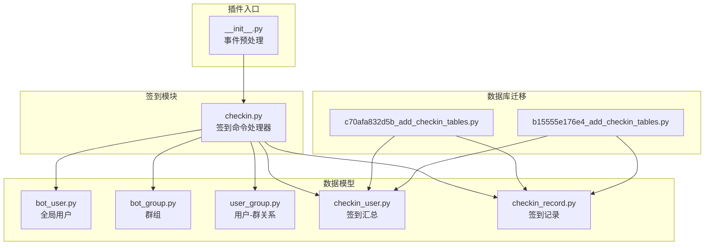
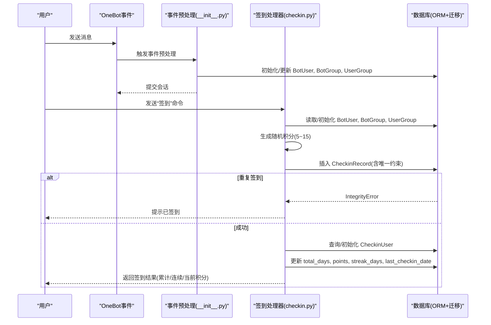
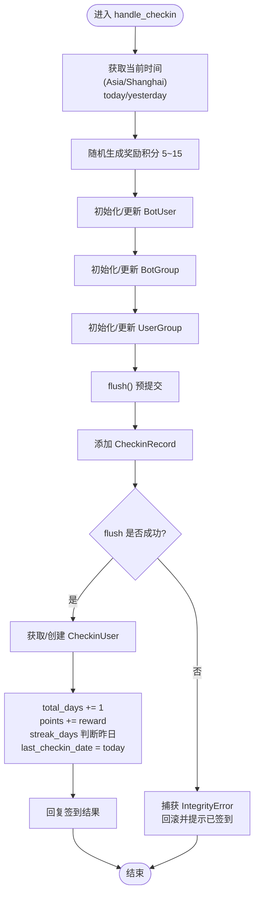
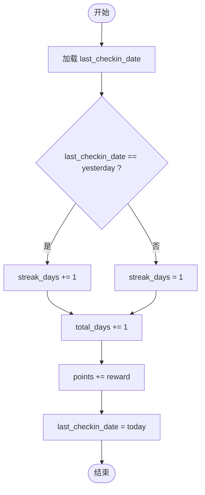
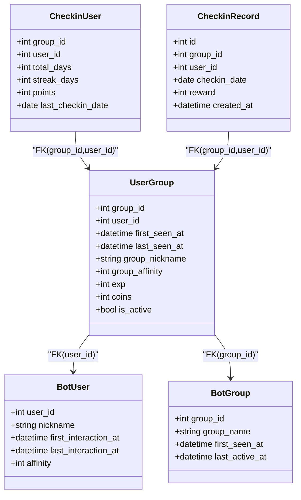
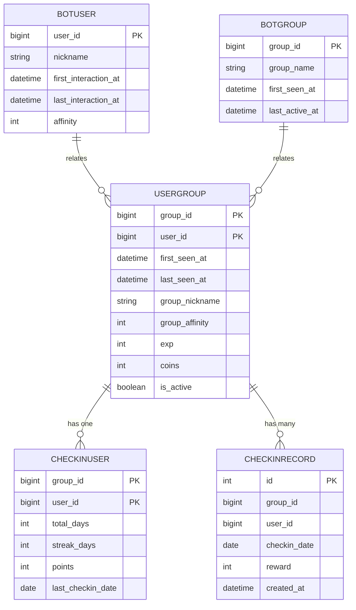

# 签到系统

<cite>
**本文引用的文件**   
- [checkin.py](file://src/plugins/yawn_core/checkin.py)
- [__init__.py](file://src/plugins/yawn_core/__init__.py)
- [checkin_record.py](file://src/plugins/yawn_core/data_models/checkin_record.py)
- [checkin_user.py](file://src/plugins/yawn_core/data_models/checkin_user.py)
- [user_group.py](file://src/plugins/yawn_core/data_models/user_group.py)
- [bot_user.py](file://src/plugins/yawn_core/data_models/bot_user.py)
- [bot_group.py](file://src/plugins/yawn_core/data_models/bot_group.py)
- [b15555e176e4_add_checkin_tables.py](file://data/nonebot_plugin_orm/migrations/yawn_core/b15555e176e4_add_checkin_tables.py)
- [c70afa832d5b_add_checkin_tables.py](file://data/nonebot_plugin_orm/migrations/yawn_core/c70afa832d5b_add_checkin_tables.py)
</cite>

## 目录
1. [简介](#简介)
2. [项目结构](#项目结构)
3. [核心组件](#核心组件)
4. [架构总览](#架构总览)
5. [详细组件分析](#详细组件分析)
6. [依赖关系分析](#依赖关系分析)
7. [性能考量](#性能考量)
8. [故障排查指南](#故障排查指南)
9. [结论](#结论)
10. [附录](#附录)

## 简介
本文件为 YawnBot 的“签到”功能提供深入的技术文档。内容覆盖：
- 签到命令处理器的实现逻辑与调用流程
- 随机积分获取机制（5~15分）
- 防重复签到检查与数据库唯一约束
- 用户、群组数据的自动初始化策略
- 连续签到统计算法与积分累计逻辑
- 时间处理（中国时区 Asia/Shanghai）
- 错误处理策略
- 与用户管理、群组管理的集成关系
- 常见问题解决方案与性能优化建议

## 项目结构
YawnBot 插件采用按功能模块组织的方式，签到系统位于 yawn_core 插件下，包含命令处理器与数据模型定义，并通过迁移脚本维护数据库结构。

图表来源
- [__init__.py:16-79](file://src/plugins/yawn_core/__init__.py#L16-L79)
- [checkin.py:22-146](file://src/plugins/yawn_core/checkin.py#L22-L146)
- [bot_user.py:12-32](file://src/plugins/yawn_core/data_models/bot_user.py#L12-L32)
- [bot_group.py:12-29](file://src/plugins/yawn_core/data_models/bot_group.py#L12-L29)
- [user_group.py:15-61](file://src/plugins/yawn_core/data_models/user_group.py#L15-L61)
- [checkin_user.py:12-47](file://src/plugins/yawn_core/data_models/checkin_user.py#L12-L47)
- [checkin_record.py:12-53](file://src/plugins/yawn_core/data_models/checkin_record.py#L12-L53)
- [c70afa832d5b_add_checkin_tables.py:22-46](file://data/nonebot_plugin_orm/migrations/yawn_core/c70afa832d5b_add_checkin_tables.py#L22-L46)
- [b15555e176e4_add_checkin_tables.py:22-78](file://data/nonebot_plugin_orm/migrations/yawn_core/b15555e176e4_add_checkin_tables.py#L22-L78)

章节来源
- [__init__.py:16-79](file://src/plugins/yawn_core/__init__.py#L16-L79)
- [checkin.py:22-146](file://src/plugins/yawn_core/checkin.py#L22-L146)

## 核心组件
- 签到命令处理器：注册“签到”命令，处理消息事件，完成用户/群组数据初始化、签到记录写入、重复签到检测、连续签到与积分统计更新。
- 数据模型：
  - BotUser：全局用户信息（昵称、首次/最后交互时间、好感度等）
  - BotGroup：群组信息（名称、首次出现/最后活跃时间）
  - UserGroup：用户与群的关联（首次/最后出现时间、群名片、活跃度、经验、金币等）
  - CheckinUser：用户在某群的签到汇总（累计天数、连续天数、总积分、最后签到日期）
  - CheckinRecord：每次签到的明细记录（日期、本次奖励积分、创建时间），并具备唯一约束防止同一天重复签到
- 事件预处理：在任意消息事件前自动初始化 BotUser/BotGroup/UserGroup，确保后续业务无需关心实体是否存在。

章节来源
- [checkin.py:22-146](file://src/plugins/yawn_core/checkin.py#L22-L146)
- [__init__.py:16-79](file://src/plugins/yawn_core/__init__.py#L16-L79)
- [bot_user.py:12-32](file://src/plugins/yawn_core/data_models/bot_user.py#L12-L32)
- [bot_group.py:12-29](file://src/plugins/yawn_core/data_models/bot_group.py#L12-L29)
- [user_group.py:15-61](file://src/plugins/yawn_core/data_models/user_group.py#L15-L61)
- [checkin_user.py:12-47](file://src/plugins/yawn_core/data_models/checkin_user.py#L12-L47)
- [checkin_record.py:12-53](file://src/plugins/yawn_core/data_models/checkin_record.py#L12-L53)

## 架构总览
签到系统的整体流程如下：
- 事件预处理层：拦截消息事件，自动初始化用户、群组及用户-群关系，保证后续操作有数据基础。
- 命令处理器层：响应“签到”命令，执行签到逻辑，包括随机积分、去重、统计更新与结果回复。
- 数据持久化层：通过 SQLAlchemy ORM 与 Alembic 迁移脚本维护表结构与约束。

图表来源
- [__init__.py:16-79](file://src/plugins/yawn_core/__init__.py#L16-L79)
- [checkin.py:41-146](file://src/plugins/yawn_core/checkin.py#L41-L146)
- [checkin_record.py:12-53](file://src/plugins/yawn_core/data_models/checkin_record.py#L12-L53)
- [checkin_user.py:12-47](file://src/plugins/yawn_core/data_models/checkin_user.py#L12-L47)
- [c70afa832d5b_add_checkin_tables.py:22-46](file://data/nonebot_plugin_orm/migrations/yawn_core/c70afa832d5b_add_checkin_tables.py#L22-L46)
- [b15555e176e4_add_checkin_tables.py:22-78](file://data/nonebot_plugin_orm/migrations/yawn_core/b15555e176e4_add_checkin_tables.py#L22-L78)

## 详细组件分析

### 签到命令处理器（checkin.py）
- 命令注册：优先级与阻塞行为配置，确保命令稳定执行。
- 时区处理：使用 Asia/Shanghai 作为统一时区，避免跨时区导致的日期边界问题。
- 随机积分：每次签到从 5~15 中随机抽取，作为本次奖励积分。
- 数据初始化：
  - BotUser：若不存在则创建，记录首次/最后交互时间与昵称；存在则更新时间与昵称。
  - BotGroup：若不存在则创建，记录首次出现与最后活跃时间；存在则更新时间。
  - UserGroup：若不存在则创建，记录首次/最后出现时间、群名片、活跃度；存在则更新时间与昵称，并标记活跃。
- 签到记录写入：
  - 构造 CheckinRecord（group_id, user_id, checkin_date, reward）。
  - 提前 flush 以触发数据库唯一约束，捕获 IntegrityError 表示重复签到，回滚并友好提示。
- 连续签到与积分累计：
  - 获取或创建 CheckinUser（group_id, user_id 联合主键）。
  - total_days 自增 1。
  - points 累加本次 reward。
  - streak_days 判断 last_checkin_date 是否为昨天，若是则 +1，否则重置为 1。
  - 更新 last_checkin_date 为今天。
- 结果回复：拼接 @用户、本次奖励、累计天数、连续天数、当前积分等信息。

图表来源
- [checkin.py:41-146](file://src/plugins/yawn_core/checkin.py#L41-L146)

章节来源
- [checkin.py:22-146](file://src/plugins/yawn_core/checkin.py#L22-L146)

### 数据模型与约束

#### CheckinRecord（签到记录）
- 字段：id（自增主键）、group_id、user_id、checkin_date、reward、created_at。
- 约束：
  - 唯一约束：(group_id, user_id, checkin_date)，确保每人每天每群仅能签到一次。
  - 外键约束：指向 UserGroup(group_id, user_id)，级联删除。
- 作用：记录每次签到明细，支撑去重与审计。

章节来源
- [checkin_record.py:12-53](file://src/plugins/yawn_core/data_models/checkin_record.py#L12-L53)
- [c70afa832d5b_add_checkin_tables.py:26-36](file://data/nonebot_plugin_orm/migrations/yawn_core/c70afa832d5b_add_checkin_tables.py#L26-L36)
- [b15555e176e4_add_checkin_tables.py:58-67](file://data/nonebot_plugin_orm/migrations/yawn_core/b15555e176e4_add_checkin_tables.py#L58-L67)

#### CheckinUser（签到汇总）
- 字段：group_id、user_id（联合主键）、total_days、streak_days、points、last_checkin_date。
- 外键约束：指向 UserGroup(group_id, user_id)，级联删除。
- 作用：聚合统计用户的签到表现，用于展示与激励。

章节来源
- [checkin_user.py:12-47](file://src/plugins/yawn_core/data_models/checkin_user.py#L12-L47)
- [c70afa832d5b_add_checkin_tables.py:37-46](file://data/nonebot_plugin_orm/migrations/yawn_core/c70afa832d5b_add_checkin_tables.py#L37-L46)
- [b15555e176e4_add_checkin_tables.py:69-78](file://data/nonebot_plugin_orm/migrations/yawn_core/b15555e176e4_add_checkin_tables.py#L69-L78)

#### UserGroup（用户-群关系）
- 字段：group_id、user_id（联合主键）、first_seen_at、last_seen_at、group_nickname、group_affinity、exp、coins、is_active。
- 外键约束：分别指向 BotGroup.group_id 与 BotUser.user_id，级联删除。
- 作用：承载用户与群的基础关系与扩展属性，被签到系统与事件预处理共同使用。

章节来源
- [user_group.py:15-61](file://src/plugins/yawn_core/data_models/user_group.py#L15-L61)
- [b15555e176e4_add_checkin_tables.py:43-57](file://data/nonebot_plugin_orm/migrations/yawn_core/b15555e176e4_add_checkin_tables.py#L43-L57)

#### BotUser（全局用户）与 BotGroup（群组）
- BotUser：user_id（主键）、nickname、first_interaction_at、last_interaction_at、affinity。
- BotGroup：group_id（主键）、group_name、first_seen_at、last_active_at。
- 作用：为插件提供全局用户与群组维度的基础数据。

章节来源
- [bot_user.py:12-32](file://src/plugins/yawn_core/data_models/bot_user.py#L12-L32)
- [bot_group.py:12-29](file://src/plugins/yawn_core/data_models/bot_group.py#L12-L29)
- [b15555e176e4_add_checkin_tables.py:26-42](file://data/nonebot_plugin_orm/migrations/yawn_core/b15555e176e4_add_checkin_tables.py#L26-L42)

### 事件预处理与自动初始化（__init__.py）
- 拦截所有 message 类型事件，提取 user_id、group_id（如有）与昵称。
- 确保 BotUser 存在：首次对话记录 first_interaction_at，并更新 last_interaction_at 与 nickname。
- 如果是群消息：
  - 确保 BotGroup 存在：记录 first_seen_at，更新 last_active_at。
  - 确保 UserGroup 存在：记录 first_seen_at、last_seen_at、group_nickname；存在则更新 last_seen_at 与 group_nickname。
- 提交会话，保证后续命令处理器可直接使用这些实体。

章节来源
- [__init__.py:16-79](file://src/plugins/yawn_core/__init__.py#L16-L79)

### 连续签到统计算法
- 输入：last_checkin_date（上次签到日期）、today（今日日期）。
- 规则：
  - 如果 last_checkin_date == yesterday，则 streak_days += 1。
  - 否则 streak_days = 1（中断后重新计数）。
  - total_days 始终 +1。
  - points 累加本次 reward。
  - last_checkin_date 更新为 today。
- 复杂度：O(1) 时间，O(1) 空间。

图表来源
- [checkin.py:129-135](file://src/plugins/yawn_core/checkin.py#L129-L135)

章节来源
- [checkin.py:129-135](file://src/plugins/yawn_core/checkin.py#L129-L135)

### 时间处理（中国时区）
- 使用 Asia/Shanghai 时区计算 today/yesterday，避免跨时区边界导致连续签到误判。
- 所有时间相关字段（created_at、last_interaction_at、last_active_at、last_seen_at、last_checkin_date）均基于该时区进行一致性处理。

章节来源
- [checkin.py:28-30](file://src/plugins/yawn_core/checkin.py#L28-L30)
- [checkin.py:46-48](file://src/plugins/yawn_core/checkin.py#L46-L48)

### 错误处理策略
- 重复签到：通过数据库唯一约束触发 IntegrityError，捕获后回滚会话并返回友好提示。
- 会话一致性：在插入记录后立即 flush，尽早暴露约束冲突；异常分支确保状态一致。
- 日志记录：关键路径输出日志便于定位问题。

章节来源
- [checkin.py:109-114](file://src/plugins/yawn_core/checkin.py#L109-L114)
- [checkin.py:137-139](file://src/plugins/yawn_core/checkin.py#L137-L139)

## 依赖关系分析
- 命令处理器依赖数据模型：BotUser、BotGroup、UserGroup、CheckinUser、CheckinRecord。
- 数据模型间通过外键与关系映射形成完整的数据图，确保引用完整性与级联删除。
- 迁移脚本定义了表结构与约束，保障数据库层面的正确性。

图表来源
- [bot_user.py:12-32](file://src/plugins/yawn_core/data_models/bot_user.py#L12-L32)
- [bot_group.py:12-29](file://src/plugins/yawn_core/data_models/bot_group.py#L12-L29)
- [user_group.py:15-61](file://src/plugins/yawn_core/data_models/user_group.py#L15-L61)
- [checkin_user.py:12-47](file://src/plugins/yawn_core/data_models/checkin_user.py#L12-L47)
- [checkin_record.py:12-53](file://src/plugins/yawn_core/data_models/checkin_record.py#L12-L53)

章节来源
- [user_group.py:15-61](file://src/plugins/yawn_core/data_models/user_group.py#L15-L61)
- [checkin_record.py:12-53](file://src/plugins/yawn_core/data_models/checkin_record.py#L12-L53)
- [checkin_user.py:12-47](file://src/plugins/yawn_core/data_models/checkin_user.py#L12-L47)

## 性能考量
- 事务与刷新：
  - 在插入 CheckinRecord 后立即 flush，尽早触发唯一约束检查，减少无效写入。
  - 异常分支及时回滚，避免脏数据。
- 索引与约束：
  - 唯一约束 (group_id, user_id, checkin_date) 有效防止重复签到，同时提升查询效率。
  - 外键约束保证数据一致性，配合级联删除简化清理逻辑。
- 读写分离建议：
  - 高频签到场景可考虑将统计更新与明细记录拆分到不同库或缓存层（如 Redis），降低主库压力。
- 批量初始化：
  - 事件预处理仅在必要时创建/更新实体，避免全量扫描；对热点群可考虑预热常用实体。
- 时区一致性：
  - 统一使用 Asia/Shanghai，避免跨时区比较带来的额外计算与错误。

[本节为通用性能建议，不直接分析具体文件]

## 故障排查指南
- 重复签到提示：
  - 现象：用户当天再次签到收到“已签到”提示。
  - 原因：数据库唯一约束生效，IntegrityError 被捕获。
  - 解决：确认用户未在同一日多次触发签到；检查时区设置是否正确。
- 连续签到未累计：
  - 现象：streak_days 未递增。
  - 原因：last_checkin_date 不是昨天（可能跨时区或上次签到失败）。
  - 解决：核对时间处理逻辑与时区配置；检查是否有并发写入导致状态不一致。
- 积分未增加：
  - 现象：points 未变化。
  - 原因：CheckinUser 未正确初始化或更新。
  - 解决：确认 CheckinUser 查询/创建逻辑；检查事务提交是否成功。
- 新用户/新群无数据：
  - 现象：签到时报错或数据缺失。
  - 原因：事件预处理未触发或未提交。
  - 解决：检查 __init__.py 的事件预处理是否启用；确认会话提交。

章节来源
- [checkin.py:109-114](file://src/plugins/yawn_core/checkin.py#L109-L114)
- [checkin.py:129-135](file://src/plugins/yawn_core/checkin.py#L129-L135)
- [__init__.py:16-79](file://src/plugins/yawn_core/__init__.py#L16-L79)

## 结论
YawnBot 的签到系统通过清晰的分层设计与严格的数据库约束，实现了稳健的签到流程：
- 随机积分与连续签到统计算法简单高效。
- 事件预处理确保数据初始化自动化，降低业务复杂度。
- 唯一约束与异常处理保证了数据一致性与用户体验。
- 时区统一避免了边界问题。
建议在大规模部署时结合缓存与读写分离进一步优化性能，并完善监控与告警机制。

[本节为总结性内容，不直接分析具体文件]

## 附录

### 数据库表结构概览

图表来源
- [bot_user.py:12-32](file://src/plugins/yawn_core/data_models/bot_user.py#L12-L32)
- [bot_group.py:12-29](file://src/plugins/yawn_core/data_models/bot_group.py#L12-L29)
- [user_group.py:15-61](file://src/plugins/yawn_core/data_models/user_group.py#L15-L61)
- [checkin_user.py:12-47](file://src/plugins/yawn_core/data_models/checkin_user.py#L12-L47)
- [checkin_record.py:12-53](file://src/plugins/yawn_core/data_models/checkin_record.py#L12-L53)
- [c70afa832d5b_add_checkin_tables.py:26-46](file://data/nonebot_plugin_orm/migrations/yawn_core/c70afa832d5b_add_checkin_tables.py#L26-L46)
- [b15555e176e4_add_checkin_tables.py:26-78](file://data/nonebot_plugin_orm/migrations/yawn_core/b15555e176e4_add_checkin_tables.py#L26-L78)