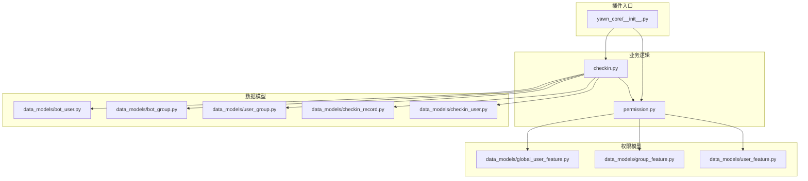
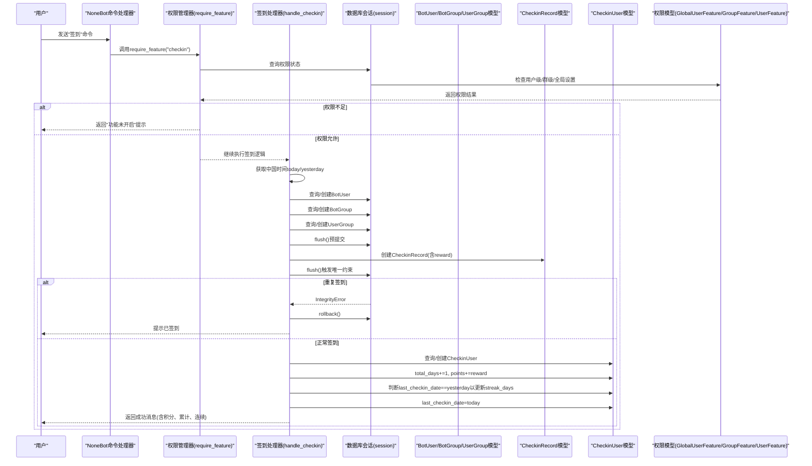
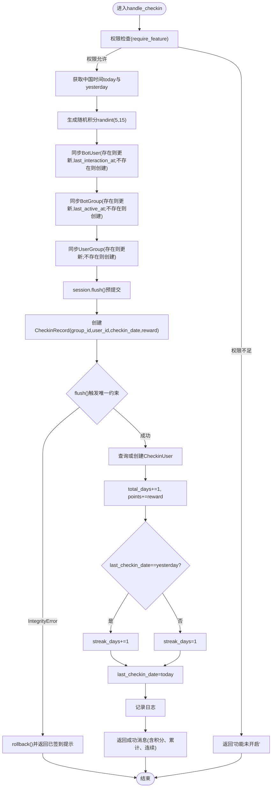
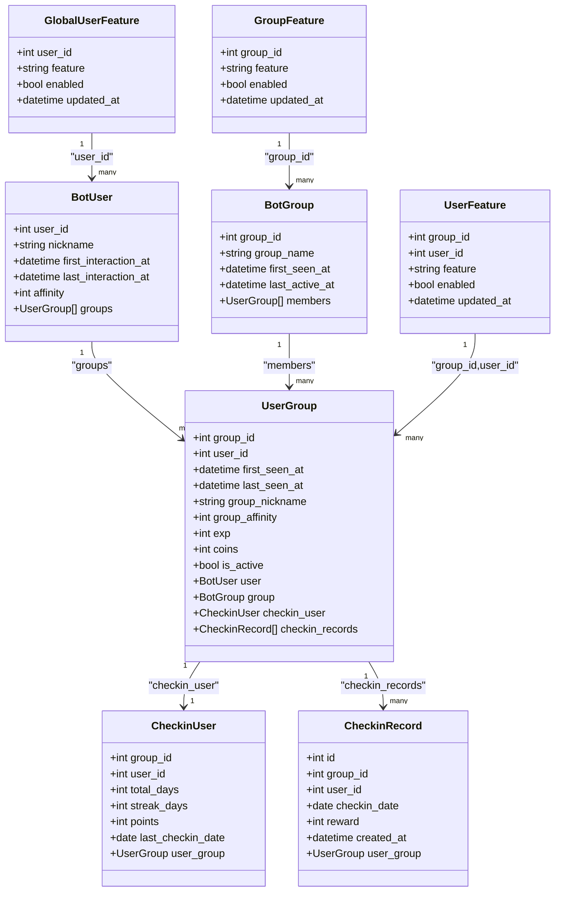
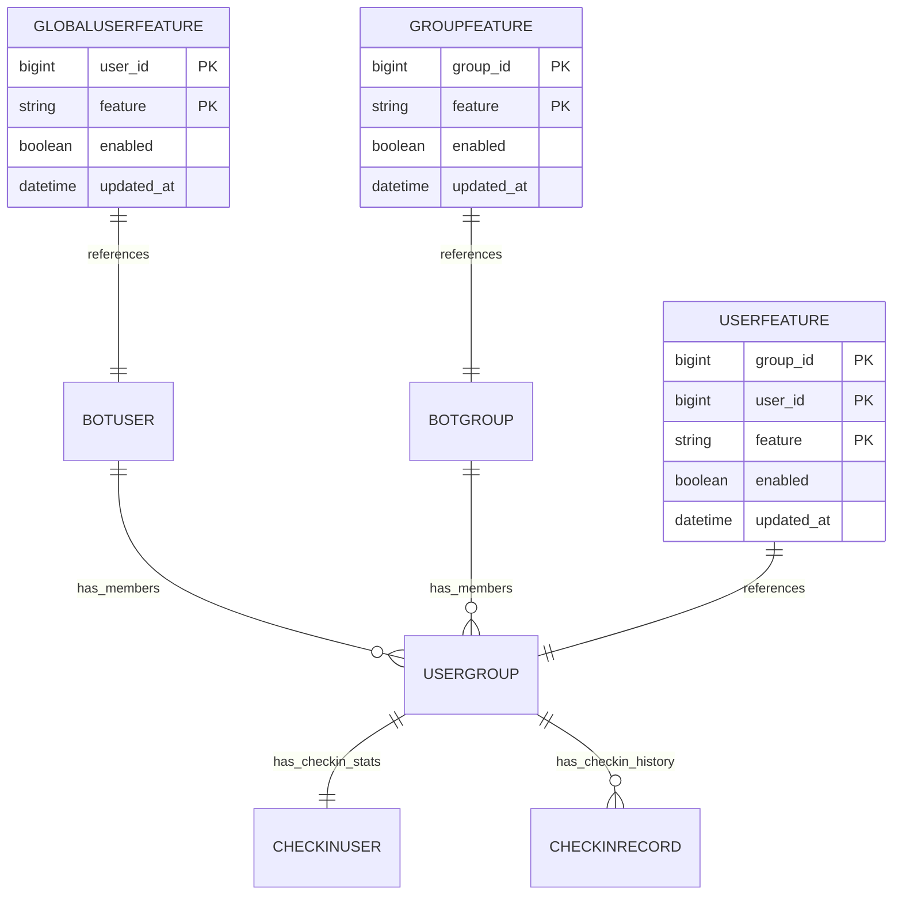
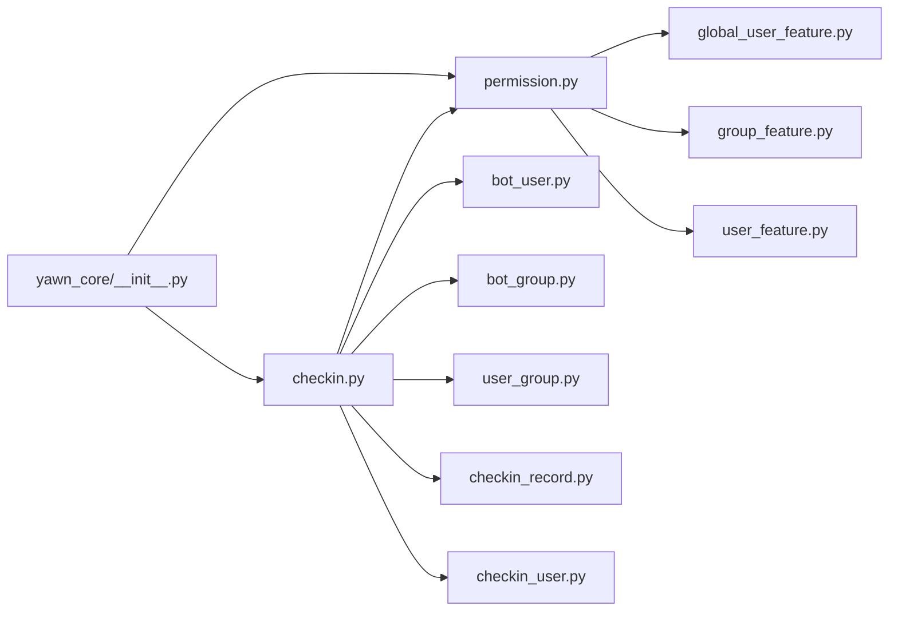

# 签到系统

<cite>
**本文引用的文件**   
- [checkin.py](file://src/plugins/yawn_core/checkin.py)
- [permission.py](file://src/plugins/yawn_core/permission.py)
- [global_user_feature.py](file://src/plugins/yawn_core/data_models/global_user_feature.py)
- [group_feature.py](file://src/plugins/yawn_core/data_models/group_feature.py)
- [user_feature.py](file://src/plugins/yawn_core/data_models/user_feature.py)
- [bot_user.py](file://src/plugins/yawn_core/data_models/bot_user.py)
- [bot_group.py](file://src/plugins/yawn_core/data_models/bot_group.py)
- [user_group.py](file://src/plugins/yawn_core/data_models/user_group.py)
- [checkin_record.py](file://src/plugins/yawn_core/data_models/checkin_record.py)
- [checkin_user.py](file://src/plugins/yawn_core/data_models/checkin_user.py)
- [__init__.py](file://src/plugins/yawn_core/__init__.py)
</cite>

## 更新摘要
**所做更改**   
- 新增权限控制章节，详细说明 require_feature 装饰器的集成
- 更新核心组件部分，添加权限管理系统说明
- 修改架构总览，包含权限检查流程
- 新增权限模型与关系分析
- 更新依赖关系分析，包含权限相关模块
- 扩展故障排查指南，包含权限相关问题解决方案

## 目录
1. [简介](#简介)
2. [项目结构](#项目结构)
3. [核心组件](#核心组件)
4. [架构总览](#架构总览)
5. [详细组件分析](#详细组件分析)
6. [权限控制系统](#权限控制系统)
7. [依赖关系分析](#依赖关系分析)
8. [性能考量](#性能考量)
9. [故障排查指南](#故障排查指南)
10. [结论](#结论)
11. [附录](#附录)

## 简介
本文件为 YawnBot 签到系统的技术文档，聚焦于"签到"命令的完整实现与业务逻辑。内容涵盖：
- 每日签到检查、防重复提交机制
- 随机积分生成算法（5-15分）
- 连续签到天数计算逻辑
- 时区处理（中国时间 Asia/Shanghai）
- 用户数据同步、群组信息管理、数据库操作
- **新增：细粒度权限控制系统，支持用户级、群级和全局功能开关**
- 数据模型关系：BotUser、BotGroup、UserGroup、CheckinRecord、CheckinUser
- IntegrityError 异常处理与回滚策略
- 常见问题解决方案与性能优化建议

该模块基于 NoneBot 插件框架与 SQLAlchemy ORM，通过 Alembic 迁移管理数据库结构，并集成了全新的权限管理系统。

## 项目结构
YawnBot 的签到功能位于 yawn_core 插件中，核心代码集中在 checkin.py 与 data_models 下的若干数据模型文件。权限控制系统独立封装在 permission.py 中，提供统一的权限管理接口。

**图表来源**
- [__init__.py:1-5](file://src/plugins/yawn_core/__init__.py#L1-L5)
- [checkin.py:1-150](file://src/plugins/yawn_core/checkin.py#L1-L150)
- [permission.py:1-225](file://src/plugins/yawn_core/permission.py#L1-L225)

**章节来源**
- [__init__.py:1-5](file://src/plugins/yawn_core/__init__.py#L1-L5)
- [checkin.py:1-150](file://src/plugins/yawn_core/checkin.py#L1-L150)

## 核心组件
- **签到命令处理器**：注册"签到"命令，处理群消息事件，完成用户与群组信息同步、签到记录写入、积分更新与连续签到统计。
- **权限控制系统**：基于 require_feature 装饰器的细粒度权限管理，支持用户级、群级和全局功能开关。
- **数据模型**：
  - BotUser：全局用户信息（昵称、首次/最后交互时间、好感度等）。
  - BotGroup：群组信息（名称、首次出现时间、最后活跃时间等）。
  - UserGroup：用户与群的关联关系（群内昵称、活跃度、经验值、金币、是否活跃等），并持有签到汇总与签到记录的关联。
  - CheckinRecord：每次签到的历史记录，包含日期与奖励积分，并通过唯一约束保证每天每人每群仅一次签到。
  - CheckinUser：群内用户的签到汇总（累计天数、连续天数、总积分、最后一次签到日期）。
  - **GlobalUserFeature**：全局用户级别的功能开关（适用于私聊及跨群全局控制）。
  - **GroupFeature**：群级别的功能开关。
  - **UserFeature**：群内特定用户的功能覆盖（优先级高于群级别开关）。

**章节来源**
- [checkin.py:24-28](file://src/plugins/yawn_core/checkin.py#L24-L28)
- [permission.py:32-35](file://src/plugins/yawn_core/permission.py#L32-L35)
- [global_user_feature.py:8-29](file://src/plugins/yawn_core/data_models/global_user_feature.py#L8-L29)
- [group_feature.py:8-29](file://src/plugins/yawn_core/data_models/group_feature.py#L8-L29)
- [user_feature.py:8-30](file://src/plugins/yawn_core/data_models/user_feature.py#L8-L30)

## 架构总览
签到流程从 NoneBot 命令触发开始，依次进行权限检查、时区处理、用户与群组信息同步、签到记录写入等操作：

**图表来源**
- [checkin.py:43-150](file://src/plugins/yawn_core/checkin.py#L43-L150)
- [permission.py:132-162](file://src/plugins/yawn_core/permission.py#L132-L162)

## 详细组件分析

### 签到命令处理流程（handle_checkin）
- **权限检查**：通过 `_perm: Dependent = require_feature("checkin")` 参数注入权限检查，自动验证用户是否有权限使用签到功能。
- **时区处理**：使用 ZoneInfo("Asia/Shanghai") 获取当前时间与日期，确保按中国时间计算签到日。
- **随机积分**：使用 randint(5, 15) 生成本次签到奖励积分。
- **用户与群组同步**：
  - 若用户不存在则创建 BotUser，并设置昵称与最后交互时间；否则更新最后交互时间与昵称。
  - 若群组不存在则创建 BotGroup，并设置最后活跃时间；否则更新最后活跃时间。
  - 若用户-群组关系不存在则创建 UserGroup，并设置群内昵称、最后看到时间、活跃度；否则更新相关字段。
- **签到记录写入**：
  - 创建 CheckinRecord，包含 group_id、user_id、checkin_date、reward。
  - 先执行 flush() 提前触发数据库唯一约束检查，避免后续事务不一致。
- **防重复提交**：
  - 捕获 IntegrityError 异常，执行 rollback() 并返回"今天已经签到过了"的消息。
- **签到汇总更新**：
  - 查询或创建 CheckinUser（按 group_id + user_id 联合主键）。
  - 累计 total_days += 1，points += reward。
  - 若 last_checkin_date == yesterday，则 streak_days += 1；否则重置为 1。
  - 更新 last_checkin_date = today。
- **日志与响应**：
  - 记录成功日志，返回包含被 @ 的用户、本次积分、累计天数、连续天数与当前积分的消息。

**章节来源**
- [checkin.py:47](file://src/plugins/yawn_core/checkin.py#L47)
- [checkin.py:49-51](file://src/plugins/yawn_core/checkin.py#L49-L51)
- [checkin.py:54-55](file://src/plugins/yawn_core/checkin.py#L54-L55)
- [checkin.py:57-101](file://src/plugins/yawn_core/checkin.py#L57-L101)
- [checkin.py:102-116](file://src/plugins/yawn_core/checkin.py#L102-L116)
- [checkin.py:118-149](file://src/plugins/yawn_core/checkin.py#L118-L149)

#### 流程图：签到核心逻辑

**图表来源**
- [checkin.py:43-150](file://src/plugins/yawn_core/checkin.py#L43-L150)

### 数据模型与关系
- **BotUser**：全局用户实体，主键 user_id，包含昵称、首次/最后交互时间、全局好感度，并与 UserGroup 一对多关联。
- **BotGroup**：群组实体，主键 group_id，包含名称、首次出现时间、最后活跃时间，并与 UserGroup 一对多关联。
- **UserGroup**：用户与群的关联实体，联合主键 (group_id, user_id)，包含群内昵称、活跃度、经验值、金币、是否活跃，并关联 CheckinUser 与 CheckinRecord。
- **CheckinRecord**：签到历史，主键 id，包含 group_id、user_id、checkin_date、reward、created_at，并通过 UniqueConstraint 保证"每人在每个群每天只能签到一次"。
- **CheckinUser**：签到汇总，联合主键 (group_id, user_id)，包含 total_days、streak_days、points、last_checkin_date。
- **GlobalUserFeature**：全局用户功能开关，主键 (user_id, feature)，控制用户在所有场景下的功能权限。
- **GroupFeature**：群级别功能开关，主键 (group_id, feature)，控制特定群组的功能权限。
- **UserFeature**：用户级功能覆盖，主键 (group_id, user_id, feature)，优先级最高的权限控制。

**图表来源**
- [bot_user.py:12-32](file://src/plugins/yawn_core/data_models/bot_user.py#L12-L32)
- [bot_group.py:12-29](file://src/plugins/yawn_core/data_models/bot_group.py#L12-L29)
- [user_group.py:15-61](file://src/plugins/yawn_core/data_models/user_group.py#L15-L61)
- [checkin_record.py:12-53](file://src/plugins/yawn_core/data_models/checkin_record.py#L12-L53)
- [checkin_user.py:12-47](file://src/plugins/yawn_core/data_models/checkin_user.py#L12-L47)
- [global_user_feature.py:8-29](file://src/plugins/yawn_core/data_models/global_user_feature.py#L8-L29)
- [group_feature.py:8-29](file://src/plugins/yawn_core/data_models/group_feature.py#L8-L29)
- [user_feature.py:8-30](file://src/plugins/yawn_core/data_models/user_feature.py#L8-L30)

## 权限控制系统

### 权限检查机制
签到系统集成了全新的权限控制系统，通过 `require_feature` 装饰器实现细粒度的功能权限管理。权限检查遵循以下优先级规则：

**群聊权限解析链（优先级从高到低）**：
1. **超级管理员** → 始终放行
2. **UserFeature（群内用户级覆盖）** → 有记录则按其 enabled 值
3. **GroupFeature（群级别开关）** → 有记录则按其 enabled 值  
4. **无记录** → 默认放行

**私聊权限解析链**：
1. **超级管理员** → 始终放行
2. **GlobalUserFeature（全局用户开关）** → 有记录则按其 enabled 值
3. **无记录** → 默认放行

### 权限模型设计
- **FEATURE_REGISTRY**：功能注册表，定义可用的功能标识和显示名称
- **check_feature_permission**：核心权限检查函数，实现上述解析链逻辑
- **require_feature**：Depends 依赖工厂，用于 handler 参数注入
- **get_user_feature_status**：权限状态查询函数，供管理命令使用

### 权限控制流程
当用户尝试使用签到功能时，系统会：
1. 调用 `require_feature("checkin")` 进行权限检查
2. 根据用户ID、群组ID和功能标识查询权限状态
3. 按照优先级规则确定最终权限结果
4. 权限不足时返回友好提示信息

**章节来源**
- [permission.py:32-35](file://src/plugins/yawn_core/permission.py#L32-L35)
- [permission.py:71-126](file://src/plugins/yawn_core/permission.py#L71-L126)
- [permission.py:132-162](file://src/plugins/yawn_core/permission.py#L132-L162)
- [permission.py:168-224](file://src/plugins/yawn_core/permission.py#L168-L224)

### 权限模型关系图

**图表来源**
- [global_user_feature.py:8-29](file://src/plugins/yawn_core/data_models/global_user_feature.py#L8-L29)
- [group_feature.py:8-29](file://src/plugins/yawn_core/data_models/group_feature.py#L8-L29)
- [user_feature.py:8-30](file://src/plugins/yawn_core/data_models/user_feature.py#L8-L30)

## 依赖关系分析
- **插件入口** __init__.py 导入 checkin、permission 等模块，使 NoneBot 在启动时加载所有功能。
- **checkin.py** 依赖以下数据模型：
  - BotUser、BotGroup、UserGroup：用于用户与群组信息的同步与维护。
  - CheckinRecord：用于记录每次签到详情。
  - CheckinUser：用于聚合统计与连续签到天数计算。
  - **permission.require_feature**：用于权限检查。
- **permission.py** 依赖权限相关数据模型：
  - GlobalUserFeature：全局用户功能开关。
  - GroupFeature：群级别功能开关。
  - UserFeature：用户级功能覆盖。
- **数据库层**通过 SQLAlchemy 外键与唯一约束保障数据一致性，防止重复签到与引用不一致。

**图表来源**
- [__init__.py:1-5](file://src/plugins/yawn_core/__init__.py#L1-L5)
- [checkin.py:15-20](file://src/plugins/yawn_core/checkin.py#L15-L20)
- [permission.py:13-15](file://src/plugins/yawn_core/permission.py#L13-L15)

**章节来源**
- [__init__.py:1-5](file://src/plugins/yawn_core/__init__.py#L1-L5)
- [checkin.py:15-20](file://src/plugins/yawn_core/checkin.py#L15-L20)
- [permission.py:13-15](file://src/plugins/yawn_core/permission.py#L13-L15)

## 性能考量
- **减少不必要的查询**：
  - 在 handle_checkin 中，先通过 session.get 查询用户、群组、用户-群组关系，仅在缺失时创建，避免多余插入。
- **提前 flush 与唯一约束**：
  - 在写入 CheckinRecord 后立即 flush，利用数据库唯一约束快速检测重复签到，避免后续事务回滚成本。
- **批量更新与事务边界**：
  - 将用户、群组、用户-群组关系的更新与签到记录写入放在同一会话中，减少多次持久化开销。
- **索引建议**：
  - 对 CheckinRecord 的 (group_id, user_id, checkin_date) 组合索引可提升重复签到检测效率（由唯一约束自动创建）。
  - 对 CheckinUser 的 (group_id, user_id) 联合主键已具备高效查找能力。
  - 对权限模型的复合主键 (user_id, feature)、(group_id, feature)、(group_id, user_id, feature) 已具备高效查找能力。
- **时区处理**：
  - 使用 ZoneInfo("Asia/Shanghai") 保证日期计算一致，避免因服务器时区差异导致签到日错乱。
- **权限检查优化**：
  - 权限检查在命令入口处进行，避免重复查询。
  - 超级管理员直接放行，减少数据库查询。

## 故障排查指南
- **权限不足问题**：
  - 现象：用户输入"签到"后收到"功能「签到」当前未开启哦~"。
  - 原因：用户级、群级或全局功能开关被关闭。
  - 处理：检查 GlobalUserFeature、GroupFeature、UserFeature 表中对应功能的 enabled 字段。
  - 参考路径：[permission.py:157-161](file://src/plugins/yawn_core/permission.py#L157-L161)
- **重复签到提示**：
  - 现象：用户再次输入"签到"后收到"你今天已经签到过了哦~"。
  - 原因：数据库唯一约束 uq_checkin_record_once_per_day 阻止重复插入。
  - 处理：代码捕获 IntegrityError 并回滚，返回友好提示。
  - 参考路径：[checkin.py:114-116](file://src/plugins/yawn_core/checkin.py#L114-L116)
- **新用户首次签到**：
  - 现象：首次签到会创建 BotUser、BotGroup、UserGroup 与 CheckinUser，并写入 CheckinRecord。
  - 验证：确认各模型字段是否正确初始化（如 last_interaction_at、last_active_at、last_seen_at）。
  - 参考路径：[checkin.py:57-101](file://src/plugins/yawn_core/checkin.py#L57-L101)
- **连续签到天数异常**：
  - 现象：连续天数未正确递增或重置。
  - 原因：last_checkin_date 与 yesterday 比较逻辑不正确或时区问题。
  - 处理：确保 CHECKIN_TIMEZONE 设置为 Asia/Shanghai，且 yesterday 计算正确。
  - 参考路径：[checkin.py:49-51](file://src/plugins/yawn_core/checkin.py#L49-L51), [checkin.py:134-138](file://src/plugins/yawn_core/checkin.py#L134-L138)
- **积分更新异常**：
  - 现象：points 未按预期增加。
  - 原因：reward 生成或累加逻辑错误。
  - 处理：检查 randint(5, 15) 与 points += reward 的执行顺序。
  - 参考路径：[checkin.py:54-55](file://src/plugins/yawn_core/checkin.py#L54-L55), [checkin.py:132-133](file://src/plugins/yawn_core/checkin.py#L132-L133)
- **权限解析链问题**：
  - 现象：权限设置不生效或优先级混乱。
  - 原因：权限模型数据错误或解析链逻辑问题。
  - 处理：检查 UserFeature > GroupFeature > GlobalUserFeature 的优先级是否正确。
  - 参考路径：[permission.py:79-126](file://src/plugins/yawn_core/permission.py#L79-L126)

**章节来源**
- [permission.py:157-161](file://src/plugins/yawn_core/permission.py#L157-L161)
- [checkin.py:114-116](file://src/plugins/yawn_core/checkin.py#L114-L116)
- [checkin.py:57-101](file://src/plugins/yawn_core/checkin.py#L57-L101)
- [checkin.py:49-51](file://src/plugins/yawn_core/checkin.py#L49-L51)
- [checkin.py:134-138](file://src/plugins/yawn_core/checkin.py#L134-L138)
- [checkin.py:54-55](file://src/plugins/yawn_core/checkin.py#L54-L55)
- [checkin.py:132-133](file://src/plugins/yawn_core/checkin.py#L132-L133)
- [permission.py:79-126](file://src/plugins/yawn_core/permission.py#L79-L126)

## 结论
YawnBot 签到系统通过清晰的命令处理流程、严谨的数据模型设计与数据库约束，以及全新的权限控制系统，实现了可靠的每日签到、积分奖励与连续签到统计。其关键特性包括：
- **中国时区日期计算**，确保签到日一致性
- **随机积分生成（5-15分）**与累计更新
- **防重复提交机制**（数据库唯一约束 + IntegrityError 处理）
- **用户与群组信息自动同步与维护**
- **连续签到天数的准确计算**
- **细粒度权限控制系统**，支持用户级、群级和全局功能开关
- **灵活的权限解析链**，确保权限控制的优先级正确性

整体架构简洁、职责清晰，具备良好的可扩展性与维护性。新增的权限控制系统使得系统能够适应不同场景下的功能管控需求，提升了系统的灵活性和可控性。

## 附录

### 常见业务规则速查
- **每日签到检查**：基于中国时间日期，同一天同一用户在同一群仅允许一次签到。
- **积分奖励**：每次签到随机获得 5-15 积分，累加至 CheckinUser.points。
- **连续签到**：若上次签到日期为昨天，则连续天数+1；否则重置为1。
- **新用户注册**：首次签到时自动创建 BotUser、BotGroup、UserGroup 与 CheckinUser。
- **防重复提交**：通过数据库唯一约束与 IntegrityError 捕获实现。
- **权限控制**：通过 require_feature 装饰器和三级权限解析链实现细粒度管控。

### 权限配置示例
- **关闭全局限用**：在 GlobalUserFeature 表中设置 enabled=False
- **群级禁用**：在 GroupFeature 表中设置 enabled=False
- **用户级覆盖**：在 UserFeature 表中设置特定用户的 enabled 值
- **超级管理员**：始终拥有所有功能权限

**章节来源**
- [checkin.py:49-51](file://src/plugins/yawn_core/checkin.py#L49-L51)
- [checkin.py:54-55](file://src/plugins/yawn_core/checkin.py#L54-L55)
- [checkin.py:134-138](file://src/plugins/yawn_core/checkin.py#L134-L138)
- [checkin.py:57-101](file://src/plugins/yawn_core/checkin.py#L57-L101)
- [checkin.py:114-116](file://src/plugins/yawn_core/checkin.py#L114-L116)
- [permission.py:132-162](file://src/plugins/yawn_core/permission.py#L132-L162)