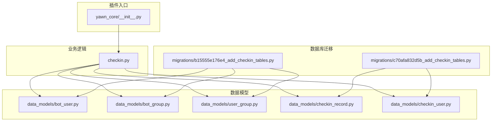
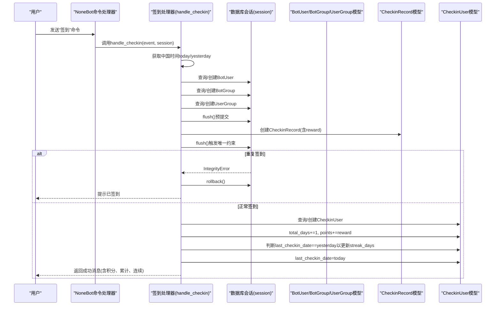
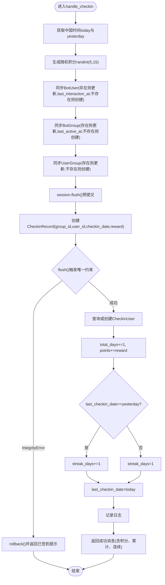
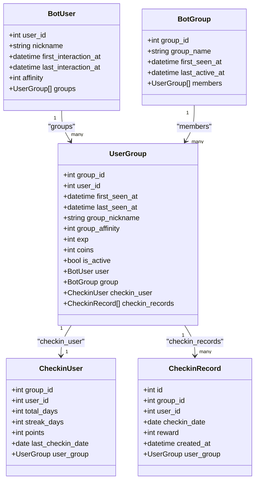
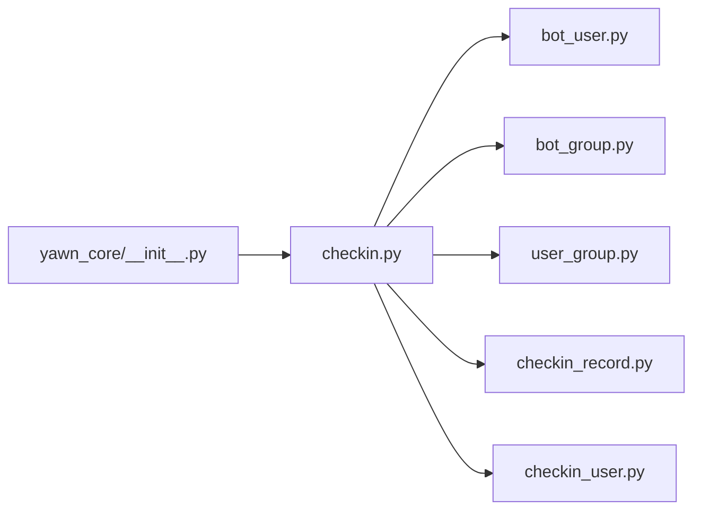

# 签到系统

<cite>
**本文引用的文件**   
- [checkin.py](file://src/plugins/yawn_core/checkin.py)
- [bot_user.py](file://src/plugins/yawn_core/data_models/bot_user.py)
- [bot_group.py](file://src/plugins/yawn_core/data_models/bot_group.py)
- [user_group.py](file://src/plugins/yawn_core/data_models/user_group.py)
- [checkin_record.py](file://src/plugins/yawn_core/data_models/checkin_record.py)
- [checkin_user.py](file://src/plugins/yawn_core/data_models/checkin_user.py)
- [__init__.py](file://src/plugins/yawn_core/__init__.py)
- [c70afa832d5b_add_checkin_tables.py](file://data/nonebot_plugin_orm/migrations/yawn_core/c70afa832d5b_add_checkin_tables.py)
- [b15555e176e4_add_checkin_tables.py](file://data/nonebot_plugin_orm/migrations/yawn_core/b15555e176e4_add_checkin_tables.py)
</cite>

## 目录
1. [简介](#简介)
2. [项目结构](#项目结构)
3. [核心组件](#核心组件)
4. [架构总览](#架构总览)
5. [详细组件分析](#详细组件分析)
6. [依赖关系分析](#依赖关系分析)
7. [性能考量](#性能考量)
8. [故障排查指南](#故障排查指南)
9. [结论](#结论)
10. [附录](#附录)

## 简介
本文件为 YawnBot 签到系统的技术文档，聚焦于“签到”命令的完整实现与业务逻辑。内容涵盖：
- 每日签到检查、防重复提交机制
- 随机积分生成算法（5-15分）
- 连续签到天数计算逻辑
- 时区处理（中国时间 Asia/Shanghai）
- 用户数据同步、群组信息管理、数据库操作
- 数据模型关系：BotUser、BotGroup、UserGroup、CheckinRecord、CheckinUser
- IntegrityError 异常处理与回滚策略
- 常见问题解决方案与性能优化建议

该模块基于 NoneBot 插件框架与 SQLAlchemy ORM，通过 Alembic 迁移管理数据库结构。

## 项目结构
YawnBot 的签到功能位于 yawn_core 插件中，核心代码集中在 checkin.py 与 data_models 下的若干数据模型文件。迁移脚本位于 data/nonebot_plugin_orm/migrations/yawn_core 下，用于创建和维护表结构。

图表来源
- [__init__.py:1-5](file://src/plugins/yawn_core/__init__.py#L1-L5)
- [checkin.py:1-147](file://src/plugins/yawn_core/checkin.py#L1-L147)
- [bot_user.py:1-32](file://src/plugins/yawn_core/data_models/bot_user.py#L1-L32)
- [bot_group.py:1-29](file://src/plugins/yawn_core/data_models/bot_group.py#L1-L29)
- [user_group.py:1-61](file://src/plugins/yawn_core/data_models/user_group.py#L1-L61)
- [checkin_record.py:1-53](file://src/plugins/yawn_core/data_models/checkin_record.py#L1-L53)
- [checkin_user.py:1-47](file://src/plugins/yawn_core/data_models/checkin_user.py#L1-L47)
- [c70afa832d5b_add_checkin_tables.py:1-57](file://data/nonebot_plugin_orm/migrations/yawn_core/c70afa832d5b_add_checkin_tables.py#L1-L57)
- [b15555e176e4_add_checkin_tables.py:1-113](file://data/nonebot_plugin_orm/migrations/yawn_core/b15555e176e4_add_checkin_tables.py#L1-L113)

章节来源
- [__init__.py:1-5](file://src/plugins/yawn_core/__init__.py#L1-L5)
- [checkin.py:1-147](file://src/plugins/yawn_core/checkin.py#L1-L147)

## 核心组件
- 签到命令处理器：注册“签到”命令，处理群消息事件，完成用户与群组信息同步、签到记录写入、积分更新与连续签到统计。
- 数据模型：
  - BotUser：全局用户信息（昵称、首次/最后交互时间、好感度等）。
  - BotGroup：群组信息（名称、首次出现时间、最后活跃时间等）。
  - UserGroup：用户与群的关联关系（群内昵称、活跃度、经验值、金币、是否活跃等），并持有签到汇总与签到记录的关联。
  - CheckinRecord：每次签到的历史记录，包含日期与奖励积分，并通过唯一约束保证每天每人每群仅一次签到。
  - CheckinUser：群内用户的签到汇总（累计天数、连续天数、总积分、最后一次签到日期）。

章节来源
- [checkin.py:22-26](file://src/plugins/yawn_core/checkin.py#L22-L26)
- [bot_user.py:12-32](file://src/plugins/yawn_core/data_models/bot_user.py#L12-L32)
- [bot_group.py:12-29](file://src/plugins/yawn_core/data_models/bot_group.py#L12-L29)
- [user_group.py:15-61](file://src/plugins/yawn_core/data_models/user_group.py#L15-L61)
- [checkin_record.py:12-53](file://src/plugins/yawn_core/data_models/checkin_record.py#L12-L53)
- [checkin_user.py:12-47](file://src/plugins/yawn_core/data_models/checkin_user.py#L12-L47)

## 架构总览
签到流程从 NoneBot 命令触发开始，依次进行：
- 获取当前中国时间日期
- 确保用户、群组、用户-群组关系存在（不存在则创建）
- 生成随机积分（5-15）
- 写入签到记录（受唯一约束保护）
- 更新或创建签到汇总（CheckinUser），维护累计天数、连续天数与总积分
- 返回结果消息

图表来源
- [checkin.py:41-147](file://src/plugins/yawn_core/checkin.py#L41-L147)
- [checkin_record.py:12-53](file://src/plugins/yawn_core/data_models/checkin_record.py#L12-L53)
- [checkin_user.py:12-47](file://src/plugins/yawn_core/data_models/checkin_user.py#L12-L47)

## 详细组件分析

### 签到命令处理流程（handle_checkin）
- 时区处理：使用 ZoneInfo("Asia/Shanghai") 获取当前时间与日期，确保按中国时间计算签到日。
- 随机积分：使用 randint(5, 15) 生成本次签到奖励积分。
- 用户与群组同步：
  - 若用户不存在则创建 BotUser，并设置昵称与最后交互时间；否则更新最后交互时间与昵称。
  - 若群组不存在则创建 BotGroup，并设置最后活跃时间；否则更新最后活跃时间。
  - 若用户-群组关系不存在则创建 UserGroup，并设置群内昵称、最后看到时间、活跃度；否则更新相关字段。
- 签到记录写入：
  - 创建 CheckinRecord，包含 group_id、user_id、checkin_date、reward。
  - 先执行 flush() 提前触发数据库唯一约束检查，避免后续事务不一致。
- 防重复提交：
  - 捕获 IntegrityError 异常，执行 rollback() 并返回“今天已经签到过了”的消息。
- 签到汇总更新：
  - 查询或创建 CheckinUser（按 group_id + user_id 联合主键）。
  - 累计 total_days += 1，points += reward。
  - 若 last_checkin_date == yesterday，则 streak_days += 1；否则重置为 1。
  - 更新 last_checkin_date = today。
- 日志与响应：
  - 记录成功日志，返回包含被 @ 的用户、本次积分、累计天数、连续天数与当前积分的消息。

章节来源
- [checkin.py:28-30](file://src/plugins/yawn_core/checkin.py#L28-L30)
- [checkin.py:51-53](file://src/plugins/yawn_core/checkin.py#L51-L53)
- [checkin.py:54-98](file://src/plugins/yawn_core/checkin.py#L54-L98)
- [checkin.py:99-114](file://src/plugins/yawn_core/checkin.py#L99-L114)
- [checkin.py:115-146](file://src/plugins/yawn_core/checkin.py#L115-L146)

#### 流程图：签到核心逻辑

图表来源
- [checkin.py:41-147](file://src/plugins/yawn_core/checkin.py#L41-L147)

### 数据模型与关系
- BotUser：全局用户实体，主键 user_id，包含昵称、首次/最后交互时间、全局好感度，并与 UserGroup 一对多关联。
- BotGroup：群组实体，主键 group_id，包含名称、首次出现时间、最后活跃时间，并与 UserGroup 一对多关联。
- UserGroup：用户与群的关联实体，联合主键 (group_id, user_id)，包含群内昵称、活跃度、经验值、金币、是否活跃，并关联 CheckinUser 与 CheckinRecord。
- CheckinRecord：签到历史，主键 id，包含 group_id、user_id、checkin_date、reward、created_at，并通过 UniqueConstraint 保证“每人在每个群每天只能签到一次”。
- CheckinUser：签到汇总，联合主键 (group_id, user_id)，包含 total_days、streak_days、points、last_checkin_date。

图表来源
- [bot_user.py:12-32](file://src/plugins/yawn_core/data_models/bot_user.py#L12-L32)
- [bot_group.py:12-29](file://src/plugins/yawn_core/data_models/bot_group.py#L12-L29)
- [user_group.py:15-61](file://src/plugins/yawn_core/data_models/user_group.py#L15-L61)
- [checkin_record.py:12-53](file://src/plugins/yawn_core/data_models/checkin_record.py#L12-L53)
- [checkin_user.py:12-47](file://src/plugins/yawn_core/data_models/checkin_user.py#L12-L47)

### 数据库迁移与约束
- 初始迁移（c70afa832d5b）：创建 yawn_core_checkinrecord 与 yawn_core_checkinuser 表，定义唯一约束 uq_checkin_record_once_per_day。
- 后续迁移（b15555e176e4）：创建 yawn_core_botgroup、yawn_core_botuser、yawn_core_usergroup 表，并将 CheckinRecord 与 CheckinUser 的外键指向 UserGroup 的联合主键，同时调整字段类型为 BigInteger。

章节来源
- [c70afa832d5b_add_checkin_tables.py:22-46](file://data/nonebot_plugin_orm/migrations/yawn_core/c70afa832d5b_add_checkin_tables.py#L22-L46)
- [b15555e176e4_add_checkin_tables.py:22-79](file://data/nonebot_plugin_orm/migrations/yawn_core/b15555e176e4_add_checkin_tables.py#L22-L79)

## 依赖关系分析
- 插件入口 __init__.py 导入 checkin 模块，使 NoneBot 在启动时加载签到命令。
- checkin.py 依赖以下数据模型：
  - BotUser、BotGroup、UserGroup：用于用户与群组信息的同步与维护。
  - CheckinRecord：用于记录每次签到详情。
  - CheckinUser：用于聚合统计与连续签到天数计算。
- 数据库层通过 SQLAlchemy 外键与唯一约束保障数据一致性，防止重复签到与引用不一致。

图表来源
- [__init__.py:1-5](file://src/plugins/yawn_core/__init__.py#L1-L5)
- [checkin.py:14-18](file://src/plugins/yawn_core/checkin.py#L14-L18)

章节来源
- [__init__.py:1-5](file://src/plugins/yawn_core/__init__.py#L1-L5)
- [checkin.py:14-18](file://src/plugins/yawn_core/checkin.py#L14-L18)

## 性能考量
- 减少不必要的查询：
  - 在 handle_checkin 中，先通过 session.get 查询用户、群组、用户-群组关系，仅在缺失时创建，避免多余插入。
- 提前 flush 与唯一约束：
  - 在写入 CheckinRecord 后立即 flush，利用数据库唯一约束快速检测重复签到，避免后续事务回滚成本。
- 批量更新与事务边界：
  - 将用户、群组、用户-群组关系的更新与签到记录写入放在同一会话中，减少多次持久化开销。
- 索引建议：
  - 对 CheckinRecord 的 (group_id, user_id, checkin_date) 组合索引可提升重复签到检测效率（由唯一约束自动创建）。
  - 对 CheckinUser 的 (group_id, user_id) 联合主键已具备高效查找能力。
- 时区处理：
  - 使用 ZoneInfo("Asia/Shanghai") 保证日期计算一致，避免因服务器时区差异导致签到日错乱。

[本节为通用性能指导，不直接分析具体文件]

## 故障排查指南
- 重复签到提示：
  - 现象：用户再次输入“签到”后收到“你今天已经签到过了哦~”。
  - 原因：数据库唯一约束 uq_checkin_record_once_per_day 阻止重复插入。
  - 处理：代码捕获 IntegrityError 并回滚，返回友好提示。
  - 参考路径：[checkin.py:109-114](file://src/plugins/yawn_core/checkin.py#L109-L114)
- 新用户首次签到：
  - 现象：首次签到会创建 BotUser、BotGroup、UserGroup 与 CheckinUser，并写入 CheckinRecord。
  - 验证：确认各模型字段是否正确初始化（如 last_interaction_at、last_active_at、last_seen_at）。
  - 参考路径：[checkin.py:54-98](file://src/plugins/yawn_core/checkin.py#L54-L98)
- 连续签到天数异常：
  - 现象：连续天数未正确递增或重置。
  - 原因：last_checkin_date 与 yesterday 比较逻辑不正确或时区问题。
  - 处理：确保 CHECKIN_TIMEZONE 设置为 Asia/Shanghai，且 yesterday 计算正确。
  - 参考路径：[checkin.py:28-30](file://src/plugins/yawn_core/checkin.py#L28-L30), [checkin.py:131-135](file://src/plugins/yawn_core/checkin.py#L131-L135)
- 积分更新异常：
  - 现象：points 未按预期增加。
  - 原因：reward 生成或累加逻辑错误。
  - 处理：检查 randint(5, 15) 与 points += reward 的执行顺序。
  - 参考路径：[checkin.py:51-53](file://src/plugins/yawn_core/checkin.py#L51-L53), [checkin.py:129-130](file://src/plugins/yawn_core/checkin.py#L129-L130)

章节来源
- [checkin.py:109-114](file://src/plugins/yawn_core/checkin.py#L109-L114)
- [checkin.py:54-98](file://src/plugins/yawn_core/checkin.py#L54-L98)
- [checkin.py:28-30](file://src/plugins/yawn_core/checkin.py#L28-L30)
- [checkin.py:131-135](file://src/plugins/yawn_core/checkin.py#L131-L135)
- [checkin.py:51-53](file://src/plugins/yawn_core/checkin.py#L51-L53)
- [checkin.py:129-130](file://src/plugins/yawn_core/checkin.py#L129-L130)

## 结论
YawnBot 签到系统通过清晰的命令处理流程、严谨的数据模型设计与数据库约束，实现了可靠的每日签到、积分奖励与连续签到统计。其关键特性包括：
- 中国时区日期计算，确保签到日一致性
- 随机积分生成（5-15分）与累计更新
- 防重复提交机制（数据库唯一约束 + IntegrityError 处理）
- 用户与群组信息自动同步与维护
- 连续签到天数的准确计算

整体架构简洁、职责清晰，具备良好的可扩展性与维护性。

[本节为总结性内容，不直接分析具体文件]

## 附录

### 常见业务规则速查
- 每日签到检查：基于中国时间日期，同一天同一用户在同一群仅允许一次签到。
- 积分奖励：每次签到随机获得 5-15 积分，累加至 CheckinUser.points。
- 连续签到：若上次签到日期为昨天，则连续天数+1；否则重置为1。
- 新用户注册：首次签到时自动创建 BotUser、BotGroup、UserGroup 与 CheckinUser。
- 防重复提交：通过数据库唯一约束与 IntegrityError 捕获实现。

章节来源
- [checkin.py:28-30](file://src/plugins/yawn_core/checkin.py#L28-L30)
- [checkin.py:51-53](file://src/plugins/yawn_core/checkin.py#L51-L53)
- [checkin.py:131-135](file://src/plugins/yawn_core/checkin.py#L131-L135)
- [checkin.py:54-98](file://src/plugins/yawn_core/checkin.py#L54-L98)
- [checkin.py:109-114](file://src/plugins/yawn_core/checkin.py#L109-L114)