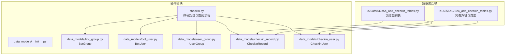
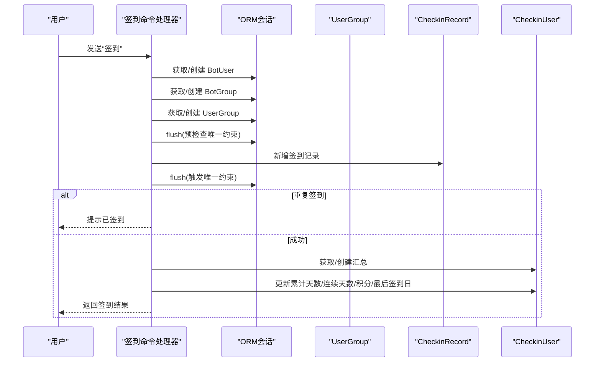
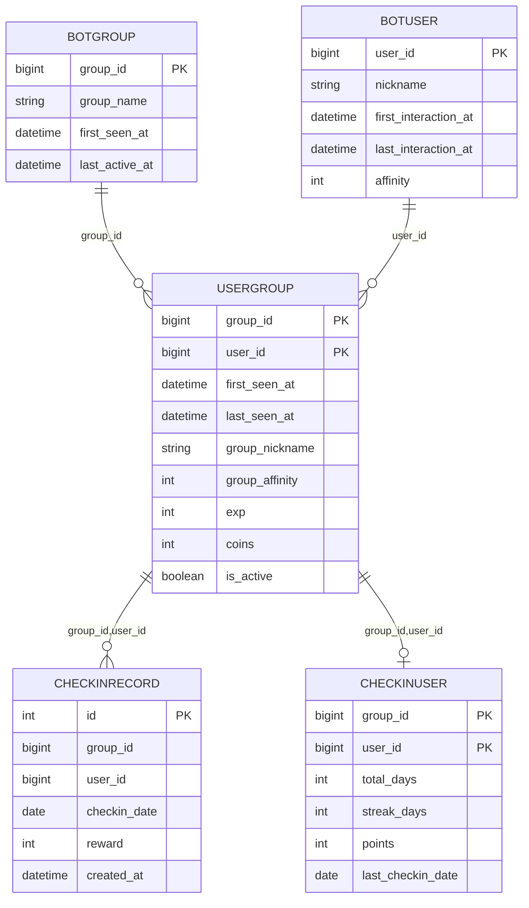
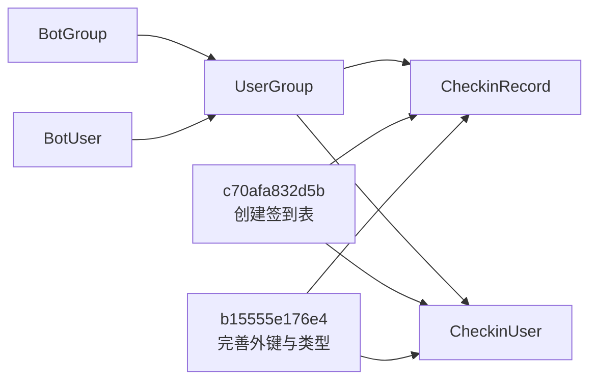

# 群组管理系统

<cite>
**本文引用的文件**   
- [bot_group.py](file://src/plugins/yawn_core/data_models/bot_group.py)
- [user_group.py](file://src/plugins/yawn_core/data_models/user_group.py)
- [bot_user.py](file://src/plugins/yawn_core/data_models/bot_user.py)
- [checkin_record.py](file://src/plugins/yawn_core/data_models/checkin_record.py)
- [checkin_user.py](file://src/plugins/yawn_core/data_models/checkin_user.py)
- [checkin.py](file://src/plugins/yawn_core/checkin.py)
- [b15555e176e4_add_checkin_tables.py](file://data/nonebot_plugin_orm/migrations/yawn_core/b15555e176e4_add_checkin_tables.py)
- [c70afa832d5b_add_checkin_tables.py](file://data/nonebot_plugin_orm/migrations/yawn_core/c70afa832d5b_add_checkin_tables.py)
</cite>

## 目录
1. [简介](#简介)
2. [项目结构](#项目结构)
3. [核心组件](#核心组件)
4. [架构总览](#架构总览)
5. [详细组件分析](#详细组件分析)
6. [依赖关系分析](#依赖关系分析)
7. [性能与查询优化](#性能与查询优化)
8. [故障排查指南](#故障排查指南)
9. [结论](#结论)

## 简介
本文件面向 YawnBot 的“群组管理系统”，聚焦以下目标：
- 群组数据模型字段定义与外键设计
- 群组活跃状态跟踪机制
- 用户与群组的关联关系维护
- 群组信息的自动创建与更新
- 群组级别的签到统计与成员活跃度分析
- 与签到系统和用户管理的协作方式
- 具体代码示例路径、外键关系设计与查询优化策略

该系统基于 NoneBot2 + SQLAlchemy ORM，使用 Alembic 管理数据库迁移，围绕 BotGroup（群）、BotUser（用户）、UserGroup（用户-群关系）以及 CheckinRecord（签到记录）、CheckinUser（签到汇总）五类实体构建。

## 项目结构
YawnBot 插件位于 src/plugins/yawn_core，数据模型集中在 data_models 子包中；业务逻辑在 checkin.py 中实现；数据库迁移脚本位于 data/nonebot_plugin_orm/migrations/yawn_core。

图表来源
- [checkin.py:1-147](file://src/plugins/yawn_core/checkin.py#L1-L147)
- [bot_group.py:1-29](file://src/plugins/yawn_core/data_models/bot_group.py#L1-L29)
- [bot_user.py:1-32](file://src/plugins/yawn_core/data_models/bot_user.py#L1-L32)
- [user_group.py:1-61](file://src/plugins/yawn_core/data_models/user_group.py#L1-L61)
- [checkin_record.py:1-53](file://src/plugins/yawn_core/data_models/checkin_record.py#L1-L53)
- [checkin_user.py:1-47](file://src/plugins/yawn_core/data_models/checkin_user.py#L1-L47)
- [c70afa832d5b_add_checkin_tables.py:22-46](file://data/nonebot_plugin_orm/migrations/yawn_core/c70afa832d5b_add_checkin_tables.py#L22-L46)
- [b15555e176e4_add_checkin_tables.py:22-78](file://data/nonebot_plugin_orm/migrations/yawn_core/b15555e176e4_add_checkin_tables.py#L22-L78)

章节来源
- [checkin.py:1-147](file://src/plugins/yawn_core/checkin.py#L1-L147)
- [bot_group.py:1-29](file://src/plugins/yawn_core/data_models/bot_group.py#L1-L29)
- [bot_user.py:1-32](file://src/plugins/yawn_core/data_models/bot_user.py#L1-L32)
- [user_group.py:1-61](file://src/plugins/yawn_core/data_models/user_group.py#L1-L61)
- [checkin_record.py:1-53](file://src/plugins/yawn_core/data_models/checkin_record.py#L1-L53)
- [checkin_user.py:1-47](file://src/plugins/yawn_core/data_models/checkin_user.py#L1-L47)
- [c70afa832d5b_add_checkin_tables.py:22-46](file://data/nonebot_plugin_orm/migrations/yawn_core/c70afa832d5b_add_checkin_tables.py#L22-L46)
- [b15555e176e4_add_checkin_tables.py:22-78](file://data/nonebot_plugin_orm/migrations/yawn_core/b15555e176e4_add_checkin_tables.py#L22-L78)

## 核心组件
- BotGroup：代表 Bot 认识的 QQ 群，包含群 ID、名称、首次出现时间、最后活跃时间，以及与成员的关联关系。
- BotUser：代表全局用户，包含用户 ID、昵称、首次交互时间、最后交互时间、全局好感度，以及与群关系的集合。
- UserGroup：用户与群的关联实体，包含首次/最后出现时间、群内昵称、群内扩展字段（好感度、经验、金币、是否活跃），并关联签到汇总与签到记录。
- CheckinRecord：每次签到的历史记录，保证同一用户在同一群每天仅一次签到，并关联到 UserGroup。
- CheckinUser：群内用户的签到汇总，累计签到天数、连续签到天数、总积分、最后一次签到日期，与 UserGroup 一对一。

章节来源
- [bot_group.py:12-29](file://src/plugins/yawn_core/data_models/bot_group.py#L12-L29)
- [bot_user.py:12-32](file://src/plugins/yawn_core/data_models/bot_user.py#L12-L32)
- [user_group.py:15-61](file://src/plugins/yawn_core/data_models/user_group.py#L15-L61)
- [checkin_record.py:12-53](file://src/plugins/yawn_core/data_models/checkin_record.py#L12-L53)
- [checkin_user.py:12-47](file://src/plugins/yawn_core/data_models/checkin_user.py#L12-L47)

## 架构总览
系统以“命令驱动”的方式运行：用户发送“签到”命令触发 handle_checkin，该函数负责：
- 自动创建或更新 BotUser、BotGroup、UserGroup
- 写入 CheckinRecord 并校验唯一约束
- 计算并更新 CheckinUser 的汇总指标
- 返回结果消息

图表来源
- [checkin.py:41-147](file://src/plugins/yawn_core/checkin.py#L41-L147)

章节来源
- [checkin.py:41-147](file://src/plugins/yawn_core/checkin.py#L41-L147)

## 详细组件分析

### 数据模型与外键关系
- BotGroup(group_id PK, group_name, first_seen_at, last_active_at)
- BotUser(user_id PK, nickname, first_interaction_at, last_interaction_at, affinity)
- UserGroup(group_id, user_id PK; FK to BotGroup.group_id, FK to BotUser.user_id; first_seen_at, last_seen_at, group_nickname, group_affinity, exp, coins, is_active)
- CheckinRecord(id PK, group_id, user_id, checkin_date, reward, created_at; UniqueConstraint(group_id,user_id,checkin_date); FK(group_id,user_id) -> UserGroup)
- CheckinUser(group_id, user_id PK; total_days, streak_days, points, last_checkin_date; FK(group_id,user_id) -> UserGroup)

图表来源
- [bot_group.py:12-29](file://src/plugins/yawn_core/data_models/bot_group.py#L12-L29)
- [bot_user.py:12-32](file://src/plugins/yawn_core/data_models/bot_user.py#L12-L32)
- [user_group.py:15-61](file://src/plugins/yawn_core/data_models/user_group.py#L15-L61)
- [checkin_record.py:12-53](file://src/plugins/yawn_core/data_models/checkin_record.py#L12-L53)
- [checkin_user.py:12-47](file://src/plugins/yawn_core/data_models/checkin_user.py#L12-L47)
- [b15555e176e4_add_checkin_tables.py:58-78](file://data/nonebot_plugin_orm/migrations/yawn_core/b15555e176e4_add_checkin_tables.py#L58-L78)

章节来源
- [bot_group.py:12-29](file://src/plugins/yawn_core/data_models/bot_group.py#L12-L29)
- [bot_user.py:12-32](file://src/plugins/yawn_core/data_models/bot_user.py#L12-L32)
- [user_group.py:15-61](file://src/plugins/yawn_core/data_models/user_group.py#L15-L61)
- [checkin_record.py:12-53](file://src/plugins/yawn_core/data_models/checkin_record.py#L12-L53)
- [checkin_user.py:12-47](file://src/plugins/yawn_core/data_models/checkin_user.py#L12-L47)
- [b15555e176e4_add_checkin_tables.py:58-78](file://data/nonebot_plugin_orm/migrations/yawn_core/b15555e176e4_add_checkin_tables.py#L58-L78)

### 群组活跃状态跟踪
- BotGroup.last_active_at：每次有用户在该群签到时更新为当前时间，用于衡量群活跃。
- UserGroup.last_seen_at：用户最近一次出现在该群的时间；is_active 标志位用于标记用户是否处于活跃状态。
- BotUser.last_interaction_at：用户最近一次与 Bot 交互的时间，用于全局活跃追踪。

这些字段在签到流程中被自动更新，确保无需额外定时任务即可反映最新活跃情况。

章节来源
- [checkin.py:67-98](file://src/plugins/yawn_core/checkin.py#L67-L98)
- [bot_group.py:19-22](file://src/plugins/yawn_core/data_models/bot_group.py#L19-L22)
- [user_group.py:29-40](file://src/plugins/yawn_core/data_models/user_group.py#L29-L40)
- [bot_user.py:19-22](file://src/plugins/yawn_core/data_models/bot_user.py#L19-L22)

### 成员关系管理与自动创建/更新
- 当用户首次在某群签到时，系统会：
  - 创建或更新 BotUser（昵称、最后交互时间）
  - 创建或更新 BotGroup（最后活跃时间）
  - 创建 UserGroup（首次/最后出现时间、群内昵称、is_active=True）
- 后续签到将更新上述实体的时间戳与昵称，保持信息一致性。

章节来源
- [checkin.py:54-98](file://src/plugins/yawn_core/checkin.py#L54-L98)

### 群组级别签到统计与活跃度分析
- CheckinRecord：记录每次签到详情（日期、奖励积分），通过唯一约束避免重复签到。
- CheckinUser：聚合统计（累计天数、连续天数、总积分、最后签到日期）。
- 活跃度分析可基于：
  - UserGroup.is_active 与 last_seen_at 判断成员是否活跃
  - CheckinUser.streak_days 与 last_checkin_date 评估连续签到行为
  - CheckinRecord 按群维度统计每日签到量、人均签到率等

章节来源
- [checkin_record.py:15-29](file://src/plugins/yawn_core/data_models/checkin_record.py#L15-L29)
- [checkin_user.py:15-41](file://src/plugins/yawn_core/data_models/checkin_user.py#L15-L41)
- [checkin.py:109-146](file://src/plugins/yawn_core/checkin.py#L109-L146)

### 与签到系统和用户管理的协作
- 签到系统：checkin.py 作为命令入口，协调各模型完成签到流程，包括异常处理（重复签到）与结果反馈。
- 用户管理：BotUser 提供全局用户信息，UserGroup 提供用户在特定群内的上下文信息；两者通过 UserGroup 建立多对多关系。
- 群组管理：BotGroup 作为群维度的根实体，UserGroup 作为中间表，形成“群-用户”关系。

章节来源
- [checkin.py:1-26](file://src/plugins/yawn_core/checkin.py#L1-L26)
- [bot_user.py:24-31](file://src/plugins/yawn_core/data_models/bot_user.py#L24-L31)
- [user_group.py:42-61](file://src/plugins/yawn_core/data_models/user_group.py#L42-L61)
- [bot_group.py:24-28](file://src/plugins/yawn_core/data_models/bot_group.py#L24-L28)

## 依赖关系分析
- 模型间依赖：
  - UserGroup 引用 BotGroup 与 BotUser（外键）
  - CheckinRecord 与 CheckinUser 均引用 UserGroup（联合外键）
- 业务依赖：
  - checkin.py 依赖所有模型，并在事务中顺序操作，确保一致性
- 迁移依赖：
  - c70afa832d5b 创建签到相关表
  - b15555e176e4 升级字段类型并添加外键约束

图表来源
- [user_group.py:18-27](file://src/plugins/yawn_core/data_models/user_group.py#L18-L27)
- [checkin_record.py:23-28](file://src/plugins/yawn_core/data_models/checkin_record.py#L23-L28)
- [checkin_user.py:15-22](file://src/plugins/yawn_core/data_models/checkin_user.py#L15-L22)
- [c70afa832d5b_add_checkin_tables.py:26-46](file://data/nonebot_plugin_orm/migrations/yawn_core/c70afa832d5b_add_checkin_tables.py#L26-L46)
- [b15555e176e4_add_checkin_tables.py:58-78](file://data/nonebot_plugin_orm/migrations/yawn_core/b15555e176e4_add_checkin_tables.py#L58-L78)

章节来源
- [user_group.py:18-27](file://src/plugins/yawn_core/data_models/user_group.py#L18-L27)
- [checkin_record.py:23-28](file://src/plugins/yawn_core/data_models/checkin_record.py#L23-L28)
- [checkin_user.py:15-22](file://src/plugins/yawn_core/data_models/checkin_user.py#L15-L22)
- [c70afa832d5b_add_checkin_tables.py:26-46](file://data/nonebot_plugin_orm/migrations/yawn_core/c70afa832d5b_add_checkin_tables.py#L26-L46)
- [b15555e176e4_add_checkin_tables.py:58-78](file://data/nonebot_plugin_orm/migrations/yawn_core/b15555e176e4_add_checkin_tables.py#L58-L78)

## 性能与查询优化
- 索引建议：
  - UserGroup(group_id, user_id) 已为主键，天然高效
  - CheckinRecord(group_id, user_id, checkin_date) 唯一约束已存在，适合按群+用户+日期查询
  - CheckinUser(group_id, user_id) 主键，适合按群+用户聚合查询
- 查询优化策略：
  - 按群维度统计签到人数：SELECT COUNT(DISTINCT user_id) FROM checkin_record WHERE group_id=?
  - 按群维度统计活跃成员：WHERE user_group.is_active=TRUE AND last_seen_at>=阈值
  - 连续签到分析：基于 CheckinUser.streak_days 与 last_checkin_date 快速筛选
- 事务与锁：
  - 使用 session.flush() 提前触发唯一约束，避免并发重复签到
  - IntegrityError 捕获后回滚并友好提示

章节来源
- [checkin_record.py:15-29](file://src/plugins/yawn_core/data_models/checkin_record.py#L15-L29)
- [checkin.py:109-114](file://src/plugins/yawn_core/checkin.py#L109-L114)

## 故障排查指南
- 重复签到问题：
  - 现象：用户同一天多次签到被拒绝
  - 原因：数据库唯一约束 uq_checkin_record_once_per_day
  - 处理：捕获 IntegrityError，回滚并返回提示信息
- 外键约束失败：
  - 现象：删除群或用户时报错
  - 原因：ondelete=CASCADE 配置下，需确保级联删除顺序正确
  - 处理：检查迁移脚本中的外键定义与 ondelete 策略
- 时间与时区：
  - 签到日期按中国时区计算，确保服务器时区设置一致

章节来源
- [checkin.py:109-114](file://src/plugins/yawn_core/checkin.py#L109-L114)
- [b15555e176e4_add_checkin_tables.py:58-78](file://data/nonebot_plugin_orm/migrations/yawn_core/b15555e176e4_add_checkin_tables.py#L58-L78)

## 结论
YawnBot 的群组管理系统通过清晰的数据模型与严谨的外键约束，实现了群组、用户与签到数据的统一建模。签到流程自动化程度高，能够自动创建与维护群组与成员信息，并提供可靠的活跃度跟踪与统计能力。结合合理的索引与事务控制，系统在并发场景下具备良好的一致性与性能表现。未来可扩展更多群内活动与激励策略，进一步提升用户参与度。