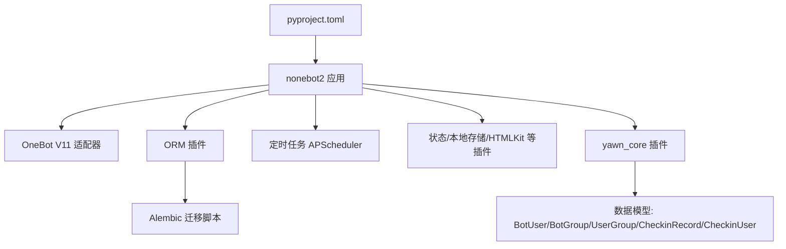
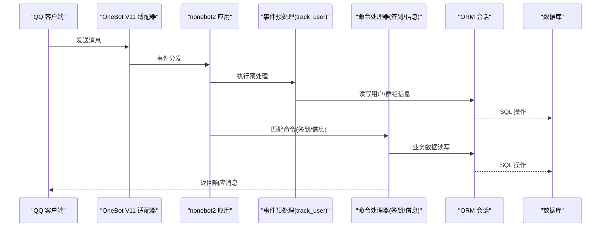
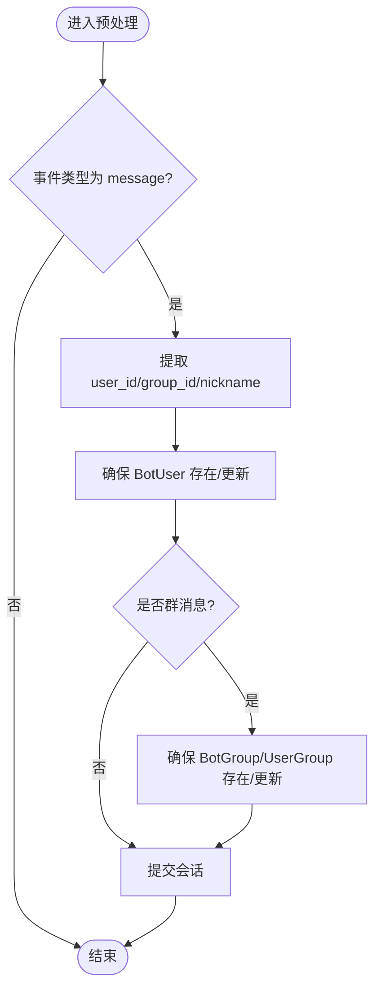
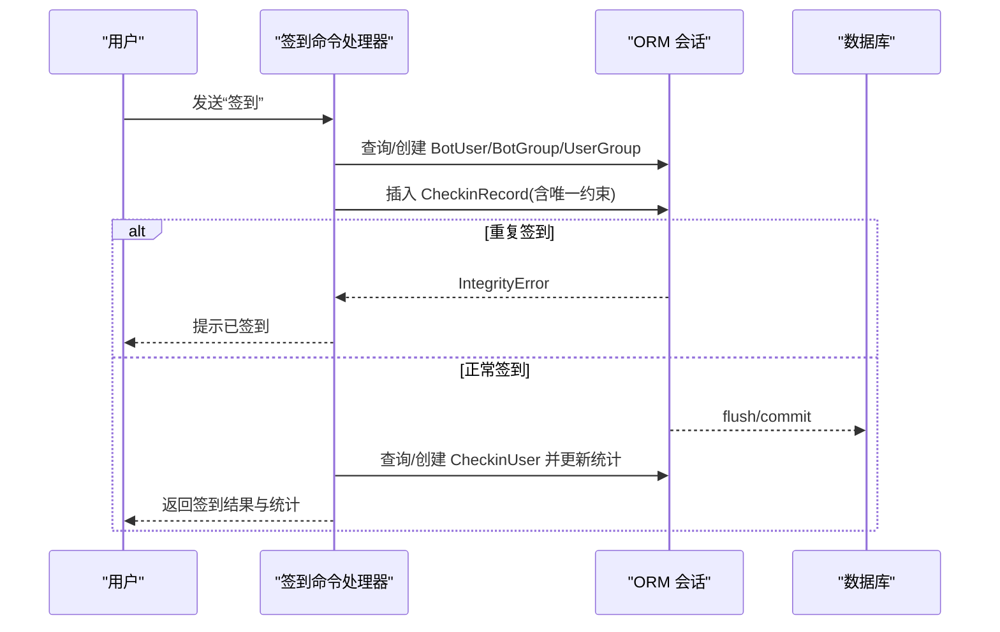
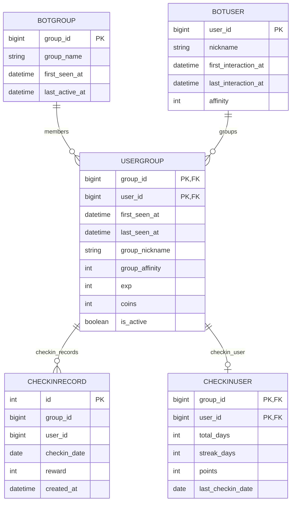
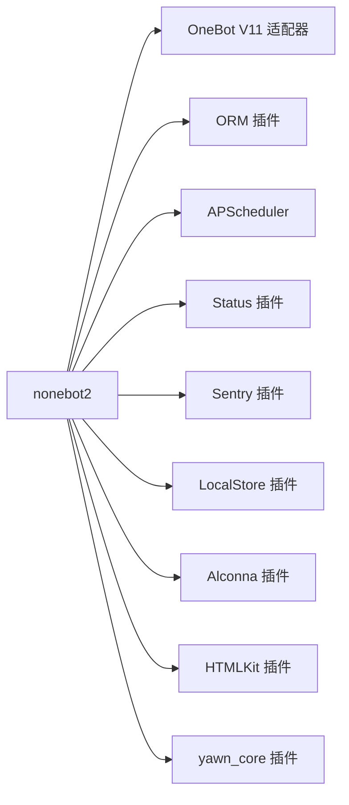

# 部署与配置

<cite>
**本文引用的文件**
- [README.md](file://README.md)
- [pyproject.toml](file://pyproject.toml)
- [src/plugins/yawn_core/__init__.py](file://src/plugins/yawn_core/__init__.py)
- [src/plugins/yawn_core/checkin.py](file://src/plugins/yawn_core/checkin.py)
- [src/plugins/yawn_core/info.py](file://src/plugins/yawn_core/info.py)
- [src/plugins/yawn_core/data_models/bot_user.py](file://src/plugins/yawn_core/data_models/bot_user.py)
- [src/plugins/yawn_core/data_models/bot_group.py](file://src/plugins/yawn_core/data_models/bot_group.py)
- [src/plugins/yawn_core/data_models/user_group.py](file://src/plugins/yawn_core/data_models/user_group.py)
- [src/plugins/yawn_core/data_models/checkin_record.py](file://src/plugins/yawn_core/data_models/checkin_record.py)
- [src/plugins/yawn_core/data_models/checkin_user.py](file://src/plugins/yawn_core/data_models/checkin_user.py)
- [data/nonebot_plugin_orm/migrations/yawn_core/b15555e176e4_add_checkin_tables.py](file://data/nonebot_plugin_orm/migrations/yawn_core/b15555e176e4_add_checkin_tables.py)
</cite>

## 目录
1. [简介](#简介)
2. [项目结构](#项目结构)
3. [核心组件](#核心组件)
4. [架构总览](#架构总览)
5. [详细组件分析](#详细组件分析)
6. [依赖关系分析](#依赖关系分析)
7. [性能考虑](#性能考虑)
8. [故障排查指南](#故障排查指南)
9. [结论](#结论)
10. [附录](#附录)

## 简介
本文件面向生产环境，提供 YawnBot 的部署与配置指南。内容涵盖：
- 运行环境与服务器要求
- 配置文件结构与环境变量（基于 nonebot2 约定）
- Docker 容器化部署、进程管理与日志配置
- 性能调优建议、监控指标与健康检查
- 安全加固、防火墙与 SSL 证书设置
- 部署自动化脚本与 CI/CD 流水线示例

YawnBot 基于 nonebot2 框架，使用 OneBot V11 适配器接入 QQ 生态，内置 ORM、定时任务、状态与本地存储等插件，数据模型通过 Alembic 迁移管理。

## 项目结构
- 插件目录：src/plugins/yawn_core，包含签到与信息展示等功能
- 数据模型：src/plugins/yawn_core/data_models，定义用户、群组、签到记录等实体
- 数据库迁移：data/nonebot_plugin_orm/migrations/yawn_core，维护表结构与版本
- 项目元数据与依赖：pyproject.toml，声明运行时依赖、nonebot2 插件与开发工具

图表来源
- [pyproject.toml:25-43](file://pyproject.toml#L25-L43)
- [src/plugins/yawn_core/__init__.py:1-13](file://src/plugins/yawn_core/__init__.py#L1-L13)
- [data/nonebot_plugin_orm/migrations/yawn_core/b15555e176e4_add_checkin_tables.py:22-80](file://data/nonebot_plugin_orm/migrations/yawn_core/b15555e176e4_add_checkin_tables.py#L22-L80)

章节来源
- [README.md:1-13](file://README.md#L1-L13)
- [pyproject.toml:1-43](file://pyproject.toml#L1-L43)

## 核心组件
- 事件预处理与用户/群组追踪：在消息进入时自动创建或更新用户与群组信息，保证后续业务数据的完整性
- 签到命令：支持每日签到、积分累计、连续签到统计，并通过数据库唯一约束防止重复签到
- 信息命令：获取机器人登录信息与版本信息，并尝试创建群文件夹用于调试输出

章节来源
- [src/plugins/yawn_core/__init__.py:16-79](file://src/plugins/yawn_core/__init__.py#L16-L79)
- [src/plugins/yawn_core/checkin.py:22-146](file://src/plugins/yawn_core/checkin.py#L22-L146)
- [src/plugins/yawn_core/info.py:6-39](file://src/plugins/yawn_core/info.py#L6-L39)

## 架构总览
YawnBot 采用 nonebot2 插件化架构，事件流从 OneBot 适配器进入，经事件预处理后路由到具体命令处理器；数据层通过 ORM 插件访问数据库，迁移由 Alembic 管理。

图表来源
- [src/plugins/yawn_core/__init__.py:16-79](file://src/plugins/yawn_core/__init__.py#L16-L79)
- [src/plugins/yawn_core/checkin.py:41-146](file://src/plugins/yawn_core/checkin.py#L41-L146)
- [src/plugins/yawn_core/info.py:10-39](file://src/plugins/yawn_core/info.py#L10-L39)

## 详细组件分析

### 事件预处理与用户/群组追踪
- 功能要点
  - 拦截 message 类型事件，提取 user_id、group_id、昵称等信息
  - 首次交互时创建 BotUser，并记录首次与最后交互时间
  - 群聊场景下确保 BotGroup 与 UserGroup 存在，更新活跃时间与昵称
  - 提交事务，保证一致性

图表来源
- [src/plugins/yawn_core/__init__.py:16-79](file://src/plugins/yawn_core/__init__.py#L16-L79)

章节来源
- [src/plugins/yawn_core/__init__.py:16-79](file://src/plugins/yawn_core/__init__.py#L16-L79)

### 签到命令处理
- 功能要点
  - 按中国时区计算日期，随机奖励积分
  - 确保用户、群组、用户-群组关系存在并更新活跃信息
  - 插入签到记录，利用唯一约束避免重复签到
  - 更新签到汇总（累计天数、连续天数、总积分）
  - 返回友好提示消息

图表来源
- [src/plugins/yawn_core/checkin.py:41-146](file://src/plugins/yawn_core/checkin.py#L41-L146)

章节来源
- [src/plugins/yawn_core/checkin.py:22-146](file://src/plugins/yawn_core/checkin.py#L22-L146)

### 信息命令处理
- 功能要点
  - 获取机器人登录信息与版本信息
  - 尝试创建名为“调试信息”的群文件夹，捕获同名错误并给出提示

章节来源
- [src/plugins/yawn_core/info.py:6-39](file://src/plugins/yawn_core/info.py#L6-L39)

### 数据模型与关系
- 实体说明
  - BotUser：全局用户，记录昵称、首次与最后交互时间、全局好感度
  - BotGroup：群组，记录名称、首次出现与最后活跃时间
  - UserGroup：用户与群组的关系，记录昵称、活跃度、经验值、金币、是否活跃
  - CheckinRecord：每次签到记录，含日期与奖励，受唯一约束保护
  - CheckinUser：用户在群内的签到汇总，含累计天数、连续天数、总积分、最后签到日期

图表来源
- [src/plugins/yawn_core/data_models/bot_user.py:12-32](file://src/plugins/yawn_core/data_models/bot_user.py#L12-L32)
- [src/plugins/yawn_core/data_models/bot_group.py:12-29](file://src/plugins/yawn_core/data_models/bot_group.py#L12-L29)
- [src/plugins/yawn_core/data_models/user_group.py:15-61](file://src/plugins/yawn_core/data_models/user_group.py#L15-L61)
- [src/plugins/yawn_core/data_models/checkin_record.py:12-52](file://src/plugins/yawn_core/data_models/checkin_record.py#L12-L52)
- [src/plugins/yawn_core/data_models/checkin_user.py:12-47](file://src/plugins/yawn_core/data_models/checkin_user.py#L12-L47)

章节来源
- [src/plugins/yawn_core/data_models/bot_user.py:12-32](file://src/plugins/yawn_core/data_models/bot_user.py#L12-L32)
- [src/plugins/yawn_core/data_models/bot_group.py:12-29](file://src/plugins/yawn_core/data_models/bot_group.py#L12-L29)
- [src/plugins/yawn_core/data_models/user_group.py:15-61](file://src/plugins/yawn_core/data_models/user_group.py#L15-L61)
- [src/plugins/yawn_core/data_models/checkin_record.py:12-52](file://src/plugins/yawn_core/data_models/checkin_record.py#L12-L52)
- [src/plugins/yawn_core/data_models/checkin_user.py:12-47](file://src/plugins/yawn_core/data_models/checkin_user.py#L12-L47)

## 依赖关系分析
- 运行时依赖
  - nonebot2[fastapi]：核心框架与 HTTP 能力
  - nonebot-adapter-onebot：OneBot V11 适配器
  - nonebot-plugin-status/sentry/apscheduler/localstore/alconna/orm/htmlkit：状态上报、错误追踪、定时任务、本地存储、命令解析、ORM、HTML 渲染等插件
- 开发依赖
  - pyright、ruff：类型检查与代码风格校验

图表来源
- [pyproject.toml:7-17](file://pyproject.toml#L7-L17)
- [pyproject.toml:25-43](file://pyproject.toml#L25-L43)

章节来源
- [pyproject.toml:7-17](file://pyproject.toml#L7-L17)
- [pyproject.toml:25-43](file://pyproject.toml#L25-L43)

## 性能考虑
- 数据库连接池
  - 使用 ORM 插件提供的连接池，合理设置最大连接数与超时，避免连接耗尽
  - 对高频写入（如签到）使用批量提交与最小化事务范围
- 索引与约束
  - 为频繁查询字段（user_id、group_id、checkin_date）建立索引
  - 利用唯一约束防止重复签到，减少应用层判断开销
- 异步与并发
  - 保持异步 IO 路径，避免阻塞调用
  - 控制事件预处理与命令处理的逻辑复杂度，必要时拆分任务
- 缓存策略
  - 对热点只读数据（如机器人信息）进行短期缓存，降低外部 API 调用频率
- 资源限制
  - 限制单次消息处理的最大负载，防止恶意刷屏导致内存/CPU 飙升

## 故障排查指南
- 常见错误
  - 重复签到触发 IntegrityError：检查唯一约束与事务回滚逻辑
  - 群文件夹创建失败：捕获 ActionFailed 异常并区分“同名文件夹已存在”与其他错误
  - 数据库迁移失败：核对迁移脚本顺序与依赖关系
- 定位方法
  - 启用 Sentry 上报异常，结合日志定位问题
  - 查看 ORM 会话提交与回滚点，确认事务边界
  - 检查 OneBot 适配器连接状态与事件流

章节来源
- [src/plugins/yawn_core/checkin.py:109-114](file://src/plugins/yawn_core/checkin.py#L109-L114)
- [src/plugins/yawn_core/info.py:32-39](file://src/plugins/yawn_core/info.py#L32-L39)
- [data/nonebot_plugin_orm/migrations/yawn_core/b15555e176e4_add_checkin_tables.py:22-80](file://data/nonebot_plugin_orm/migrations/yawn_core/b15555e176e4_add_checkin_tables.py#L22-L80)

## 结论
YawnBot 以 nonebot2 为核心，结合 OneBot V11 适配器与 ORM/Alembic 实现稳定的消息处理与数据持久化。通过合理的进程管理、日志与监控配置，可在生产环境中可靠运行。建议在部署时严格遵循安全加固与性能优化建议，并结合 CI/CD 实现自动化发布与回滚。

## 附录

### 生产环境部署要求
- 操作系统与 Python 版本
  - 推荐 Linux（Ubuntu/Debian/CentOS），Python 版本满足项目要求
- 硬件建议
  - CPU：双核及以上
  - 内存：2GB+（根据并发与数据库选择调整）
  - 磁盘：SSD 优先，预留足够空间给数据库与日志
- 网络要求
  - 开放 OneBot 适配器端口（HTTP/WebSocket，依适配器实现）
  - 数据库端口仅对内网开放或通过隧道访问
  - 如需反向代理，开放 80/443 并转发至应用端口

### 服务器配置与网络设置
- 反向代理（Nginx）
  - 将 / 请求转发至 nonebot2 FastAPI 服务
  - 启用 gzip/br 压缩与静态资源缓存
- 防火墙
  - 仅放行必要端口（如 80/443、数据库端口内网）
  - 使用白名单限制来源 IP
- SSL 证书
  - 使用 Let's Encrypt 或企业 CA 签发证书
  - 配置 Nginx 强制 HTTPS 与 HSTS

### 配置文件结构与环境变量
- nonebot2 配置
  - 通过环境变量或 .env 文件设置适配器、数据库连接、插件开关等
  - 常用变量包括：适配器地址、数据库 URL、Sentry DSN、日志级别等
- 敏感信息管理
  - 使用环境变量注入密钥与凭据，禁止硬编码
  - 在 CI/CD 中通过密钥管理服务（如 Vault、GitHub Secrets）注入

### Docker 容器化部署
- 镜像构建
  - 使用多阶段构建减小镜像体积
  - 安装系统依赖与 Python 依赖，复制源码与配置文件
- 容器编排
  - 使用 docker-compose 管理应用、数据库与反向代理
  - 挂载数据卷持久化数据库与日志
- 健康检查
  - 配置容器健康检查，基于 HTTP 端点或内部探针
- 进程管理
  - 使用 systemd 或容器编排平台（Kubernetes）管理生命周期

### 日志配置
- 日志级别
  - 生产环境建议 INFO/WARNING，关键模块可开启 DEBUG
- 日志格式
  - JSON 格式便于采集与分析
- 日志轮转
  - 使用 logrotate 或容器日志驱动进行轮转与清理

### 监控指标与健康检查
- 指标暴露
  - 启用 nonebot-plugin-status 暴露基础指标
  - 自定义业务指标（如签到成功率、平均延迟）
- 健康检查
  - 提供 /health 或 /ready 端点，检查数据库连接与外部依赖
- 告警规则
  - 基于错误率、延迟、资源使用阈值设置告警

### 安全加固措施
- 输入校验与权限控制
  - 对用户输入进行严格校验，限制命令权限
- 依赖安全
  - 定期扫描依赖漏洞，及时升级
- 最小权限原则
  - 容器与进程以非 root 用户运行
  - 数据库账户仅授予必要权限

### 部署自动化脚本与 CI/CD 流水线示例
- 脚本建议
  - 构建镜像、推送仓库、更新部署清单、滚动重启
- CI/CD 流程
  - 代码检查与测试 -> 构建镜像 -> 推送镜像 -> 部署到预发/生产
  - 失败回滚与通知机制

### 数据库迁移与初始化
- 迁移执行
  - 在启动前执行 Alembic 迁移，确保表结构一致
- 数据备份
  - 定期备份数据库，保留历史版本以便回滚

章节来源
- [README.md:1-13](file://README.md#L1-L13)
- [pyproject.toml:25-43](file://pyproject.toml#L25-L43)
- [data/nonebot_plugin_orm/migrations/yawn_core/b15555e176e4_add_checkin_tables.py:22-80](file://data/nonebot_plugin_orm/migrations/yawn_core/b15555e176e4_add_checkin_tables.py#L22-L80)