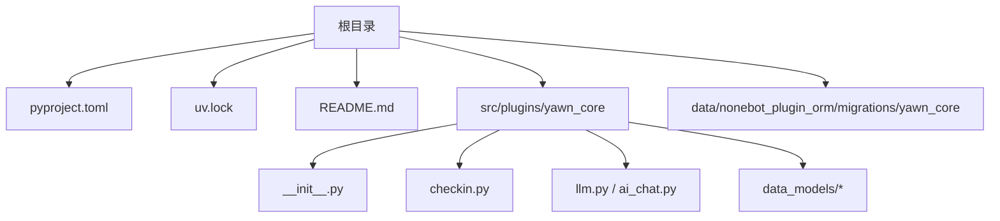
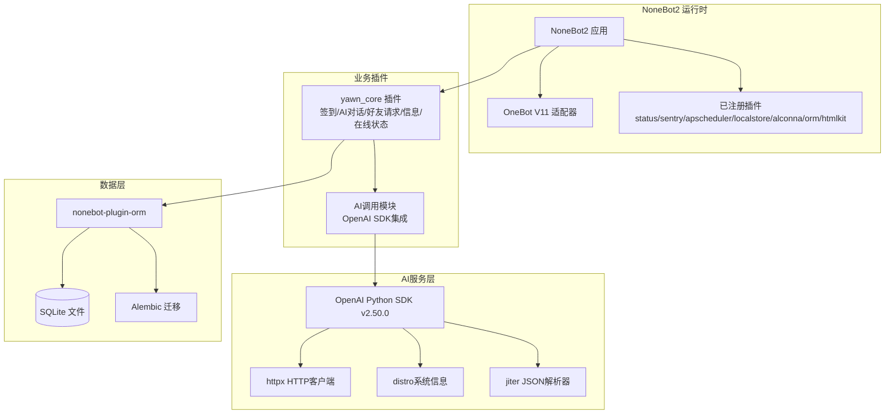
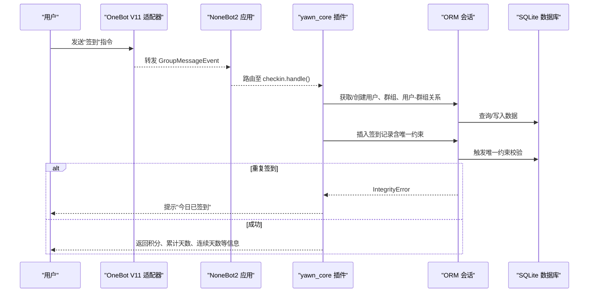
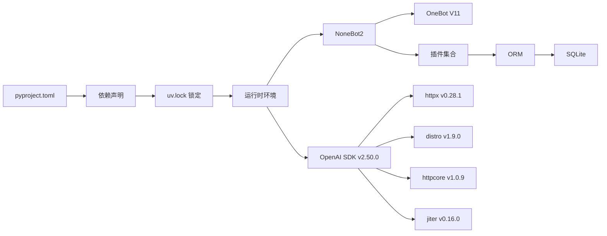

# 配置与部署

> 更新说明（2026-08-13）：本文为历史生成文档。当前 AI 入口为
> `src/plugins/yawn_core/llm.py` 与 `ai_chat.py`，不存在 `ai_call.py`；配置名是
> `AI_API_KEY`、`AI_BASE_URL`、`AI_MODEL`。`AI_API_KEY` 可选，无 key 时 Bot 仍可
> 启动，RPG 可设置 `RPG_AI_ENABLED=false` 使用确定性模式。canonical 迁移位于
> `data/nonebot_plugin_orm/migrations/`，部署应手动执行 `uv run nb orm upgrade heads`。
> 完整现行步骤以根目录 `README.md`、`.env.example` 和 `docs/deployment.md` 为准。

<cite>
**本文引用的文件**   
- [pyproject.toml](file://pyproject.toml)
- [uv.lock](file://uv.lock)
- [README.md](file://README.md)
- [src/plugins/yawn_core/__init__.py](file://src/plugins/yawn_core/__init__.py)
- [src/plugins/yawn_core/checkin.py](file://src/plugins/yawn_core/checkin.py)
- [src/plugins/yawn_core/llm.py](file://src/plugins/yawn_core/llm.py)
- [src/plugins/yawn_core/data_models/bot_user.py](file://src/plugins/yawn_core/data_models/bot_user.py)
- [src/plugins/yawn_core/data_models/checkin_record.py](file://src/plugins/yawn_core/data_models/checkin_record.py)
- [data/nonebot_plugin_orm/migrations/yawn_core/1e7945d46845_add_checkin_tables.py](file://data/nonebot_plugin_orm/migrations/yawn_core/1e7945d46845_add_checkin_tables.py)
- [data/nonebot_plugin_orm/migrations/yawn_core/b15555e176e4_add_checkin_tables.py](file://data/nonebot_plugin_orm/migrations/yawn_core/b15555e176e4_add_checkin_tables.py)
</cite>

## 更新摘要
**已进行的更改**   
- 添加了 OpenAI Python SDK (版本 2.50.0) 作为主要依赖
- 新增了 AI 功能支持，包括 httpx、distro、httpcore 和 jiter 等依赖
- 更新了依赖分析章节，包含新的 AI 相关依赖信息
- 增强了环境变量配置说明，涵盖 OpenAI API 密钥配置
- 更新了 Docker 部署方案，包含 AI 服务配置建议

## 目录
1. [简介](#简介)
2. [项目结构](#项目结构)
3. [核心组件](#核心组件)
4. [架构总览](#架构总览)
5. [详细组件分析](#详细组件分析)
6. [依赖分析](#依赖分析)
7. [性能考虑](#性能考虑)
8. [故障排查指南](#故障排查指南)
9. [结论](#结论)
10. [附录](#附录)

## 简介
本文件面向YawnBot的配置与部署，覆盖以下要点：
- pyproject.toml 的依赖管理、插件配置与环境变量相关设置
- uv.lock 的作用与依赖锁定机制
- 环境变量、数据库连接与插件参数配置说明
- **新增**：OpenAI Python SDK 集成与 AI 功能配置
- 完整部署流程（环境要求、安装、配置、运行与维护）
- Docker 部署方案与生产优化建议
- 常见问题与性能调优技巧

## 项目结构
YawnBot 基于 NoneBot2 框架，采用插件化架构。核心配置文件为 pyproject.toml，依赖锁定由 uv.lock 提供。插件位于 src/plugins；yawn_core 提供权限、管理、签到、提醒和 AI 对话，并动态加载 yawn_rpg 与 yawn_werewolf。数据模型位于 src 下，canonical 迁移统一位于 data/nonebot_plugin_orm/migrations。

**图表来源**
- [pyproject.toml:1-124](file://pyproject.toml#L1-L124)
- [uv.lock:1-2305](file://uv.lock#L1-L2305)
- [README.md:1-13](file://README.md#L1-L13)
- [src/plugins/yawn_core/__init__.py:1-5](file://src/plugins/yawn_core/__init__.py#L1-L5)

## 核心组件
- 项目元信息与依赖声明：在 pyproject.toml 中定义项目名称、版本、Python 版本约束与运行时依赖。
- **新增**：OpenAI Python SDK 集成，支持 AI 对话功能
- 插件系统：通过 tool.nonebot.plugins 注册 nonebot 官方插件；tool.nonebot.adapters 配置 OneBot V11 适配器；plugin_dirs 指定插件加载路径。
- ORM 与数据库：使用 nonebot-plugin-orm，默认启用 sqlite 后端；数据模型与 Alembic 迁移脚本用于表结构管理。
- 日志与监控：集成 sentry 插件用于错误上报；apscheduler 提供定时任务能力；htmlkit 提供 HTML 渲染能力。
- 开发工具链：ruff 代码检查与格式化；pyright 类型检查；dependency-groups.dev 提供开发依赖。

**章节来源**
- [pyproject.toml:1-124](file://pyproject.toml#L1-L124)
- [src/plugins/yawn_core/checkin.py:1-147](file://src/plugins/yawn_core/checkin.py#L1-L147)
- [src/plugins/yawn_core/llm.py](file://src/plugins/yawn_core/llm.py)
- [src/plugins/yawn_core/data_models/bot_user.py:1-32](file://src/plugins/yawn_core/data_models/bot_user.py#L1-L32)
- [src/plugins/yawn_core/data_models/checkin_record.py:1-53](file://src/plugins/yawn_core/data_models/checkin_record.py#L1-L53)

## 架构总览
YawnBot 以 NoneBot2 为核心，OneBot V11 作为消息适配器，ORM 插件负责持久化，apscheduler 驱动定时任务，sentry 负责异常上报，htmlkit 提供模板渲染。**新增**的 OpenAI Python SDK 提供 AI 对话能力，通过 httpx 进行网络请求。

**图表来源**
- [pyproject.toml:17](file://pyproject.toml#L17)
- [uv.lock:1069-1085](file://uv.lock#L1069-L1085)
- [src/plugins/yawn_core/llm.py](file://src/plugins/yawn_core/llm.py)
- [src/plugins/yawn_core/__init__.py:1-5](file://src/plugins/yawn_core/__init__.py#L1-L5)
- [data/nonebot_plugin_orm/migrations/yawn_core/b15555e176e4_add_checkin_tables.py:1-67](file://data/nonebot_plugin_orm/migrations/yawn_core/b15555e176e4_add_checkin_tables.py#L1-L67)

## 详细组件分析

### 依赖管理与插件配置（pyproject.toml）
- Python 版本约束：要求 >=3.10, <4.0。
- 运行时依赖：nonebot2[fastapi]、nonebot-adapter-onebot、nonebot-plugin-* 系列（status、sentry、apscheduler、localstore、alconna、orm[sqlite]、htmlkit）。
- **新增**：openai>=2.50.0 - OpenAI Python SDK，提供 AI 对话功能。
- 可选依赖 dev：pyright[nodejs]、ruff。
- NoneBot 配置：
  - plugin_dirs 指向 src/plugins
  - builtin_plugins 包含 echo
  - adapters 配置 OneBot V11
  - plugins 映射 nonebot-plugin-* 到对应模块名
- Ruff 与 Pyright：代码风格与类型检查配置。
- dependency-groups.dev：开发依赖组。

**章节来源**
- [pyproject.toml:1-124](file://pyproject.toml#L1-L124)

### 依赖锁定机制（uv.lock）
- uv.lock 是 uv 生成的锁定文件，记录所有依赖及其精确版本与哈希值，确保构建可重复性与一致性。
- **新增**：包含 OpenAI SDK 及其依赖的精确版本锁定，包括 httpx 0.28.1、distro 1.9.0、httpcore 1.0.9、jiter 0.16.0 等。
- 适用于 CI/CD 与生产环境，避免"在我机器上能跑"的问题。
- 当依赖变更时，需重新生成 uv.lock 并纳入版本控制。

**章节来源**
- [uv.lock:1-2305](file://uv.lock#L1-L2305)

### 环境变量与数据库连接
- 本项目未显式引入 python-dotenv 或自定义 .env 解析逻辑，因此不强制依赖 .env 文件。
- ORM 使用 sqlite 后端（nonebot-plugin-orm[sqlite]），默认将数据保存在本地 SQLite 文件中。
- **新增**：OpenAI API 配置，需要在环境变量中设置 API 密钥和基础 URL。
- 若需切换数据库或调整连接参数，应通过 nonebot-plugin-orm 的配置项进行设置（例如数据库 URL、引擎选项等），并在运行环境中注入相应配置。
- 当前仓库提供 `.env.example` 环境变量清单；复制为 `.env` 后填写真实值，切勿提交密钥。

**章节来源**
- [pyproject.toml:15-17](file://pyproject.toml#L15-L17)
- [src/plugins/yawn_core/checkin.py:11-12](file://src/plugins/yawn_core/checkin.py#L11-L12)
- [src/plugins/yawn_core/llm.py](file://src/plugins/yawn_core/llm.py)

### 插件参数配置
- OneBot V11 适配器：在 tool.nonebot.adapters 中声明适配器模块名。
- 插件注册：tool.nonebot.plugins 中将 nonebot-plugin-* 映射到具体模块名，便于 NoneBot2 自动发现与加载。
- 本地插件目录：plugin_dirs 指定 src/plugins，使 yawn_core 插件被自动加载。

**章节来源**
- [pyproject.toml:25-45](file://pyproject.toml#L25-L45)
- [src/plugins/yawn_core/__init__.py:1-5](file://src/plugins/yawn_core/__init__.py#L1-L5)

### AI 功能集成（新增）
- **OpenAI Python SDK**：版本 2.50.0，提供完整的 OpenAI API 支持。
- **依赖关系**：
  - httpx：异步 HTTP 客户端，用于网络请求
  - distro：系统信息获取，用于用户代理生成
  - httpcore：HTTP 传输层实现
  - jiter：高性能 JSON 解析器
- **配置方式**：通过 OpenAI 客户端初始化，支持自定义 base_url 和 api_key。
- **API 接口**：支持 completions.create 和 responses.create 两种调用方式。

**章节来源**
- [src/plugins/yawn_core/llm.py](file://src/plugins/yawn_core/llm.py)
- [uv.lock:1069-1085](file://uv.lock#L1069-L1085)

### 数据模型与迁移
- BotUser：全局用户模型，包含 user_id、昵称、首次/最后交互时间、全局好感度等字段。
- CheckinRecord：签到记录模型，包含 group_id、user_id、checkin_date、reward、created_at 等字段，并通过唯一约束保证每人每天仅一次签到。
- 迁移脚本：canonical Alembic 迁移位于 data/nonebot_plugin_orm/migrations（含根级迁移与 bind 子目录），用于创建/更新表结构与关系。

**章节来源**
- [src/plugins/yawn_core/data_models/bot_user.py:1-32](file://src/plugins/yawn_core/data_models/bot_user.py#L1-L32)
- [src/plugins/yawn_core/data_models/checkin_record.py:1-53](file://src/plugins/yawn_core/data_models/checkin_record.py#L1-L53)
- [data/nonebot_plugin_orm/migrations/yawn_core/b15555e176e4_add_checkin_tables.py:1-67](file://data/nonebot_plugin_orm/migrations/yawn_core/b15555e176e4_add_checkin_tables.py#L1-L67)
- [data/nonebot_plugin_orm/migrations/yawn_core/1e7945d46845_add_checkin_tables.py:1-45](file://data/nonebot_plugin_orm/migrations/yawn_core/1e7945d46845_add_checkin_tables.py#L1-L45)

### 签到命令处理流程

**图表来源**
- [src/plugins/yawn_core/checkin.py:22-147](file://src/plugins/yawn_core/checkin.py#L22-L147)
- [src/plugins/yawn_core/data_models/checkin_record.py:15-29](file://src/plugins/yawn_core/data_models/checkin_record.py#L15-L29)

## 依赖分析
- 运行时依赖包括 NoneBot2、OneBot V11 适配器、ORM、Sentry、APScheduler、LocalStore、Alconna、HTMLKit 等。
- **新增**：OpenAI Python SDK (v2.50.0) 及其依赖：
  - httpx (v0.28.1)：异步 HTTP 客户端
  - distro (v1.9.0)：系统信息检测
  - httpcore (v1.0.9)：HTTP 传输层
  - jiter (v0.16.0)：高性能 JSON 解析器
  - pydantic (v2.13.4)：数据验证
  - anyio、sniffio、tqdm、typing-extensions 等核心依赖
- 开发依赖包括 ruff、pyright（nodejs 可选）。
- uv.lock 锁定所有依赖的版本与哈希，确保构建一致性。

**图表来源**
- [pyproject.toml:1-18](file://pyproject.toml#L1-L18)
- [uv.lock:1069-1085](file://uv.lock#L1069-L1085)
- [uv.lock:334-347](file://uv.lock#L334-L347)
- [uv.lock:139-146](file://uv.lock#L139-L146)
- [uv.lock:271-280](file://uv.lock#L271-L280)
- [uv.lock:400-417](file://uv.lock#L400-L417)

**章节来源**
- [pyproject.toml:1-18](file://pyproject.toml#L1-L18)
- [uv.lock:1069-1085](file://uv.lock#L1069-L1085)

## 性能考虑
- 异步 I/O：NoneBot2 与 ORM 均基于异步，适合高并发场景。
- **新增**：OpenAI SDK 性能优化：
  - httpx 提供高效的异步 HTTP 客户端
  - jiter 提供比标准 json 模块更快的 JSON 解析
  - 支持连接池和请求重试机制
- 数据库选择：SQLite 适合轻量级部署；在高并发或大数据量场景下，建议切换到 PostgreSQL/MySQL，并通过 nonebot-plugin-orm 配置新的数据库 URL。
- 日志与监控：启用 Sentry 有助于快速定位线上问题；合理设置日志级别可减少 IO 开销。
- 定时任务：APScheduler 可用于周期性清理或统计任务，避免阻塞主循环。
- 资源限制：当前游戏房间是进程内状态，生产环境必须保持单进程；可限制内存和磁盘，但不得直接用多副本弹性伸缩同一 Bot。

## 故障排查指南
- 启动失败
  - 检查 Python 版本是否符合要求（>=3.10, <4.0）。
  - 确认依赖是否安装完成，必要时重新生成 uv.lock 并安装。
- 插件未加载
  - 核对 plugin_dirs 是否正确指向 src/plugins。
  - 检查 tool.nonebot.plugins 中的模块映射是否准确。
- 数据库异常
  - 确认 ORM 使用的数据库后端与连接参数正确。
  - 执行迁移脚本以确保表结构一致。
- 重复签到报错
  - 唯一约束会阻止重复签到，按提示信息处理即可。
- **新增**：AI 功能故障排查
  - 检查 OpenAI API 密钥配置是否正确
  - 验证网络连接是否正常，确保可以访问 OpenAI 服务
  - 查看 API 调用限流和配额限制
  - 检查模型名称和参数配置是否正确

**章节来源**
- [pyproject.toml:1-18](file://pyproject.toml#L1-L18)
- [src/plugins/yawn_core/checkin.py:109-114](file://src/plugins/yawn_core/checkin.py#L109-L114)
- [data/nonebot_plugin_orm/migrations/yawn_core/b15555e176e4_add_checkin_tables.py:1-67](file://data/nonebot_plugin_orm/migrations/yawn_core/b15555e176e4_add_checkin_tables.py#L1-L67)
- [src/plugins/yawn_core/llm.py](file://src/plugins/yawn_core/llm.py)

## 结论
YawnBot 基于 NoneBot2 的插件化架构，配合 uv 的依赖锁定与 ORM 的数据管理能力，提供了稳定可扩展的机器人平台。**新增**的 OpenAI Python SDK 集成进一步增强了 AI 对话能力，通过现代化的异步 HTTP 客户端和高性能 JSON 解析器，确保了良好的性能和用户体验。通过合理的配置与部署策略，可在开发与生产环境中保持一致性与高性能表现。

## 附录

### 环境要求
- Python 版本：>=3.10, <4.0
- 包管理器：建议使用 uv（与 uv.lock 配套）
- **新增**：网络连接，用于访问 OpenAI API 服务

### 安装步骤
- 初始化项目与插件
  - 使用 nb create 生成项目骨架
  - 使用 nb plugin create 创建新插件
- 安装依赖
  - 在项目根目录执行依赖安装（推荐使用 uv）
- 运行
  - 使用 nb run --reload 启动开发模式

**章节来源**
- [README.md:1-13](file://README.md#L1-L13)

### 配置设置
- 插件与适配器
  - 在 tool.nonebot.adapters 中配置 OneBot V11 适配器
  - 在 tool.nonebot.plugins 中注册所需插件
- 数据库
  - 使用 nonebot-plugin-orm 的 sqlite 后端（默认）
  - 如需切换数据库，通过 ORM 配置项设置数据库 URL 与引擎参数
- 环境变量
  - 当前仓库未强制依赖 .env，可按需注入环境变量（如 Sentry DSN、数据库连接串等）
- **新增**：OpenAI API 配置
  - 设置可选的 AI_API_KEY 环境变量存储 API 密钥
  - 配置 AI_BASE_URL 环境变量指定 API 端点
  - 支持自定义模型名称和请求参数

**章节来源**
- [pyproject.toml:25-45](file://pyproject.toml#L25-L45)
- [pyproject.toml:15-17](file://pyproject.toml#L15-L17)
- [src/plugins/yawn_core/llm.py](file://src/plugins/yawn_core/llm.py)

### 运行维护
- 启动
  - 开发模式：nb run --reload
  - 生产模式：使用合适的进程管理器（如 systemd、supervisor）或容器编排（Docker/Kubernetes）
- 迁移
  - 使用 Alembic 迁移脚本管理数据库结构变更
- 监控
  - 启用 Sentry 上报异常
  - 合理设置日志级别与轮转策略
- **新增**：AI 服务监控
  - 监控 OpenAI API 调用频率和响应时间
  - 设置 API 调用失败重试机制
  - 监控 API 配额使用情况

**章节来源**
- [data/nonebot_plugin_orm/migrations/yawn_core/b15555e176e4_add_checkin_tables.py:1-67](file://data/nonebot_plugin_orm/migrations/yawn_core/b15555e176e4_add_checkin_tables.py#L1-L67)
- [pyproject.toml:11-16](file://pyproject.toml#L11-L16)

### Docker 部署方案
- 基础镜像
  - 选择官方 Python 镜像（满足版本要求）
- 依赖安装
  - 复制 pyproject.toml 与 uv.lock，使用 uv 安装依赖
- 应用部署
  - 复制源码到容器内
  - 暴露端口（OneBot 适配器监听端口）
  - 挂载数据卷保存 SQLite 文件与日志
- 环境变量
  - 通过环境变量注入数据库连接、Sentry DSN 等敏感配置
  - 配置可选的 AI_API_KEY 和 AI_BASE_URL 环境变量
- 健康检查
  - 添加健康检查端点或命令，确保服务可用性
- **新增**：AI 服务优化
  - 配置 HTTP 连接池大小
  - 设置合理的超时和重试策略
  - 启用缓存减少 API 调用频率

### 生产环境优化建议
- 使用更快的 WSGI/ASGI 服务器（如 uvicorn 标准版）
- 当前仅支持单进程运行；在房间所有权与跨实例路由迁移到共享存储前，不得启用 Gunicorn/Uvicorn 多 worker
- 数据库连接池与慢查询优化
- 日志分级与集中收集（ELK/Loki）
- 资源限制与弹性伸缩（CPU/内存配额）
- 定期备份数据库与日志
- **新增**：AI 服务优化
  - 实现请求队列和负载均衡
  - 配置 API 调用限流和熔断机制
  - 使用 CDN 缓存静态内容
  - 监控和告警 API 调用异常

### 常见问题与性能调优技巧
- 依赖冲突
  - 使用 uv.lock 锁定版本，避免依赖漂移
- 启动缓慢
  - 减少不必要的插件与导入
  - 预热数据库连接与缓存
- 内存占用过高
  - 检查是否存在大对象常驻内存
  - 合理设置 GC 与日志缓冲
- 数据库瓶颈
  - 评估读写热点，考虑分库分表或读写分离
  - 增加索引与查询优化
- **新增**：AI 服务问题
  - API 调用超时：检查网络连接和超时配置
  - 内存溢出：优化请求大小和响应处理
  - 并发限制：实现请求队列和限流机制
  - 成本优化：合理使用缓存和批量请求
