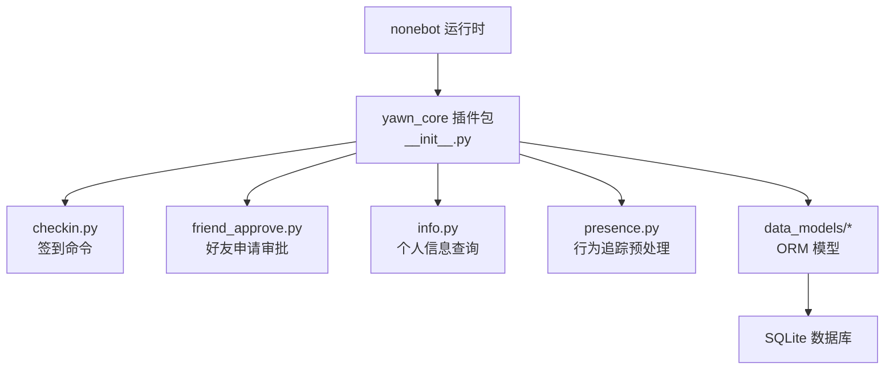
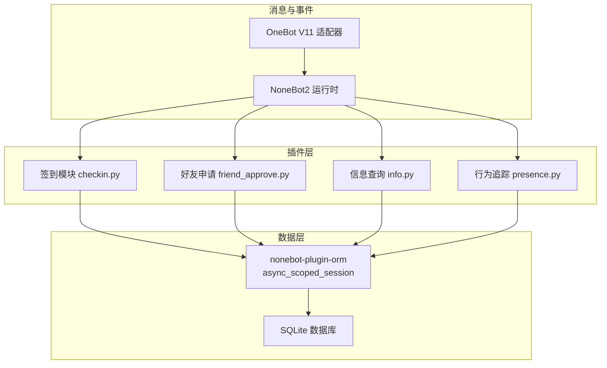
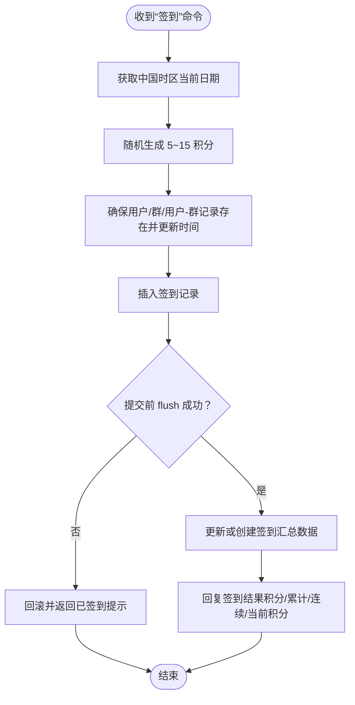
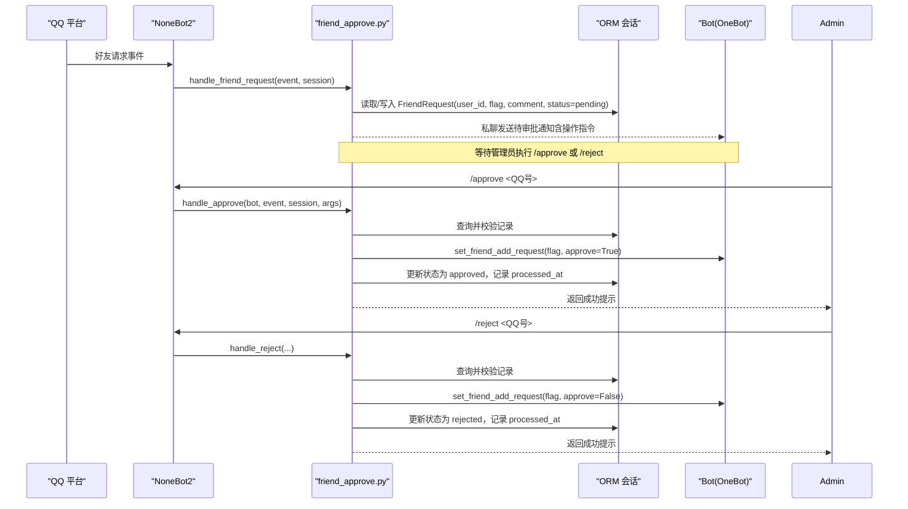
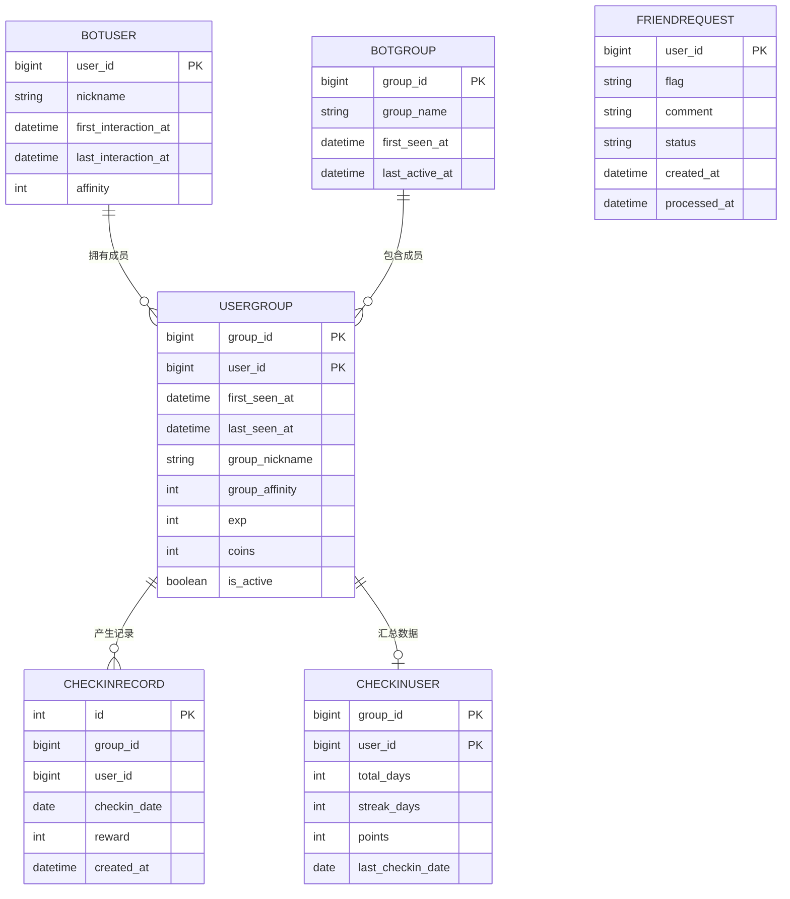
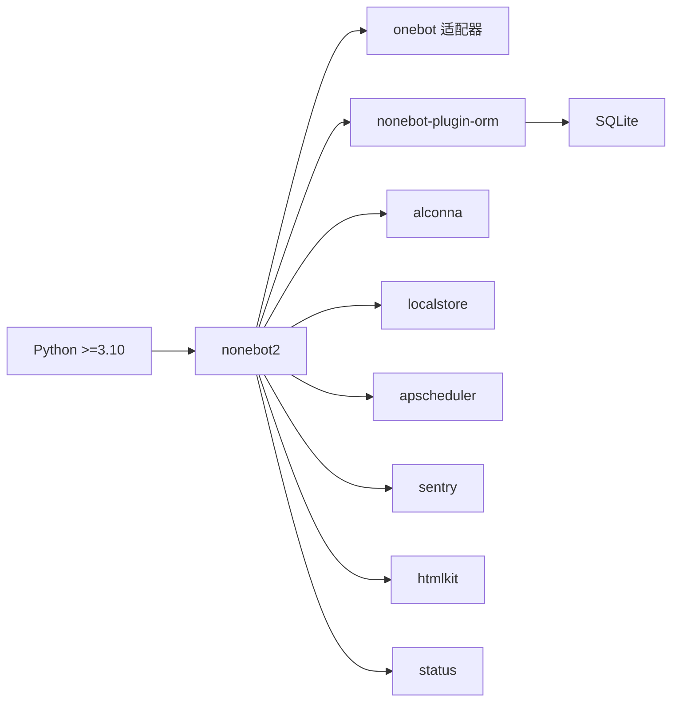

# 项目概述

<cite>
**本文引用的文件**   
- [README.md](file://README.md)
- [pyproject.toml](file://pyproject.toml)
- [src/plugins/yawn_core/__init__.py](file://src/plugins/yawn_core/__init__.py)
- [src/plugins/yawn_core/checkin.py](file://src/plugins/yawn_core/checkin.py)
- [src/plugins/yawn_core/friend_approve.py](file://src/plugins/yawn_core/friend_approve.py)
- [src/plugins/yawn_core/info.py](file://src/plugins/yawn_core/info.py)
- [src/plugins/yawn_core/presence.py](file://src/plugins/yawn_core/presence.py)
- [src/plugins/yawn_core/data_models/bot_user.py](file://src/plugins/yawn_core/data_models/bot_user.py)
- [src/plugins/yawn_core/data_models/bot_group.py](file://src/plugins/yawn_core/data_models/bot_group.py)
- [src/plugins/yawn_core/data_models/user_group.py](file://src/plugins/yawn_core/data_models/user_group.py)
- [src/plugins/yawn_core/data_models/checkin_record.py](file://src/plugins/yawn_core/data_models/checkin_record.py)
- [src/plugins/yawn_core/data_models/checkin_user.py](file://src/plugins/yawn_core/data_models/checkin_user.py)
- [src/plugins/yawn_core/data_models/friend_request.py](file://src/plugins/yawn_core/data_models/friend_request.py)
</cite>

## 目录
1. [简介](#简介)
2. [项目结构](#项目结构)
3. [核心组件](#核心组件)
4. [架构总览](#架构总览)
5. [详细组件分析](#详细组件分析)
6. [依赖关系分析](#依赖关系分析)
7. [性能考量](#性能考量)
8. [故障排查指南](#故障排查指南)
9. [结论](#结论)
10. [附录：快速开始](#附录快速开始)

## 简介
YawnBot 是基于 NoneBot2 框架开发的 QQ 机器人插件集合，提供签到系统、好友申请管理、用户信息查询与行为追踪等核心能力。项目采用 Python 3.10+、SQLAlchemy ORM 与 SQLite 数据库，通过 nonebot-plugin-orm 进行数据持久化，结合 OneBot V11 适配器接入 QQ 平台。整体采用“事件驱动 + 插件化”的架构模式，便于扩展与维护。

## 项目结构
- 插件入口位于 src/plugins/yawn_core，包含多个功能模块与数据模型定义。
- 配置与依赖由 pyproject.toml 管理，NoneBot2 插件目录指向 src/plugins。
- 数据库迁移脚本存放于 data/nonebot_plugin_orm/migrations/yawn_core 与 src/plugins/yawn_core/migrations（两者内容一致）。

图表来源
- [src/plugins/yawn_core/__init__.py:1-5](file://src/plugins/yawn_core/__init__.py#L1-L5)
- [pyproject.toml:25-43](file://pyproject.toml#L25-L43)

章节来源
- [README.md:1-13](file://README.md#L1-L13)
- [pyproject.toml:1-43](file://pyproject.toml#L1-L43)

## 核心组件
- 签到系统：支持每日签到、随机积分奖励、连续签到统计与重复签到防护。
- 好友申请管理：监听好友请求，维护待审批队列，支持管理员同意/拒绝与列表查看。
- 用户信息查询：展示用户全局信息与群内信息（昵称、好感度、经验、金币、首次/最后活跃时间等）。
- 行为追踪：基于事件预处理自动记录用户与群的交互历史，首次出现时初始化记录。

章节来源
- [src/plugins/yawn_core/checkin.py:1-147](file://src/plugins/yawn_core/checkin.py#L1-L147)
- [src/plugins/yawn_core/friend_approve.py:1-152](file://src/plugins/yawn_core/friend_approve.py#L1-L152)
- [src/plugins/yawn_core/info.py:1-40](file://src/plugins/yawn_core/info.py#L1-L40)
- [src/plugins/yawn_core/presence.py:1-103](file://src/plugins/yawn_core/presence.py#L1-L103)

## 架构总览
YawnBot 采用 NoneBot2 的事件驱动架构，插件以 on_command/on_request/event_preprocessor 等形式注册处理器；数据层使用 SQLAlchemy ORM 通过 nonebot-plugin-orm 提供的异步会话访问 SQLite。OneBot V11 适配器负责与 QQ 平台通信。

图表来源
- [pyproject.toml:25-43](file://pyproject.toml#L25-L43)
- [src/plugins/yawn_core/checkin.py:1-20](file://src/plugins/yawn_core/checkin.py#L1-L20)
- [src/plugins/yawn_core/friend_approve.py:1-20](file://src/plugins/yawn_core/friend_approve.py#L1-L20)
- [src/plugins/yawn_core/info.py:1-10](file://src/plugins/yawn_core/info.py#L1-L10)
- [src/plugins/yawn_core/presence.py:1-15](file://src/plugins/yawn_core/presence.py#L1-L15)

## 详细组件分析

### 签到系统（checkin）
- 触发方式：群组消息命令“签到”。
- 业务逻辑：
  - 获取当前中国时区日期，计算昨日日期用于连续签到判断。
  - 随机生成 5~15 积分作为本次奖励。
  - 确保 BotUser、BotGroup、UserGroup 存在并更新活跃时间。
  - 插入 CheckinRecord 并通过唯一约束防止同一天重复签到。
  - 更新或创建 CheckinUser 汇总数据（累计天数、连续天数、总积分、最近签到日期）。
- 错误处理：捕获 IntegrityError 回滚并提示已签到。

图表来源
- [src/plugins/yawn_core/checkin.py:22-147](file://src/plugins/yawn_core/checkin.py#L22-L147)
- [src/plugins/yawn_core/data_models/checkin_record.py:12-29](file://src/plugins/yawn_core/data_models/checkin_record.py#L12-L29)
- [src/plugins/yawn_core/data_models/checkin_user.py:12-47](file://src/plugins/yawn_core/data_models/checkin_user.py#L12-L47)

章节来源
- [src/plugins/yawn_core/checkin.py:1-147](file://src/plugins/yawn_core/checkin.py#L1-L147)

### 好友申请管理（friend_approve）
- 监听好友请求事件，将申请写入 FriendRequest 表（同一用户仅保留一行，新申请覆盖旧 flag/comment）。
- 向超级用户私聊发送待审批通知，并提供 /approve 与 /reject 命令及 /pending 列表命令。
- 批准/拒绝流程：校验参数、检查状态、调用 OneBot API 设置好友请求，更新记录状态与处理时间。

图表来源
- [src/plugins/yawn_core/friend_approve.py:31-152](file://src/plugins/yawn_core/friend_approve.py#L31-L152)
- [src/plugins/yawn_core/data_models/friend_request.py:9-36](file://src/plugins/yawn_core/data_models/friend_request.py#L9-L36)

章节来源
- [src/plugins/yawn_core/friend_approve.py:1-152](file://src/plugins/yawn_core/friend_approve.py#L1-L152)

### 用户信息查询（info）
- 触发方式：命令“info”及其别名。
- 数据来源：BotUser（全局信息）与 UserGroup（群内信息），包括昵称、好感度、经验、金币、首次/最后活跃时间等。
- 输出：拼接多行文本返回给用户。

章节来源
- [src/plugins/yawn_core/info.py:1-40](file://src/plugins/yawn_core/info.py#L1-L40)
- [src/plugins/yawn_core/data_models/bot_user.py:12-32](file://src/plugins/yawn_core/data_models/bot_user.py#L12-L32)
- [src/plugins/yawn_core/data_models/user_group.py:15-61](file://src/plugins/yawn_core/data_models/user_group.py#L15-L61)

### 行为追踪（presence）
- 基于 event_preprocessor 对所有 message 类型事件进行预处理。
- 自动确保 BotUser、BotGroup、UserGroup 存在，并更新 last_interaction_at/last_seen_at 等时间戳。
- 首次见到群时尝试调用 get_group_info 补全群名，失败则忽略并记录警告日志。
- 每次处理后提交事务，保证一致性。

章节来源
- [src/plugins/yawn_core/presence.py:1-103](file://src/plugins/yawn_core/presence.py#L1-L103)

### 数据模型概览
- BotUser：全局用户实体，包含昵称、首次/最后交互时间、全局好感度，与 UserGroup 一对多关系。
- BotGroup：群实体，包含群名、首次/最后活跃时间，与 UserGroup 一对多关系。
- UserGroup：用户与群的关联实体，包含群名片、群好感度、经验、金币、是否活跃等，并与 CheckinUser、CheckinRecord 关联。
- CheckinRecord：签到历史记录，具有 group_id/user_id/checkin_date 唯一约束，外键关联 UserGroup。
- CheckinUser：用户在某群的签到汇总，主键为 group_id/user_id，字段包括 total_days、streak_days、points、last_checkin_date。
- FriendRequest：好友申请记录，user_id 为主键，存储 flag、comment、status、created_at、processed_at。

图表来源
- [src/plugins/yawn_core/data_models/bot_user.py:12-32](file://src/plugins/yawn_core/data_models/bot_user.py#L12-L32)
- [src/plugins/yawn_core/data_models/bot_group.py:12-29](file://src/plugins/yawn_core/data_models/bot_group.py#L12-L29)
- [src/plugins/yawn_core/data_models/user_group.py:15-61](file://src/plugins/yawn_core/data_models/user_group.py#L15-L61)
- [src/plugins/yawn_core/data_models/checkin_record.py:12-53](file://src/plugins/yawn_core/data_models/checkin_record.py#L12-L53)
- [src/plugins/yawn_core/data_models/checkin_user.py:12-47](file://src/plugins/yawn_core/data_models/checkin_user.py#L12-L47)
- [src/plugins/yawn_core/data_models/friend_request.py:9-36](file://src/plugins/yawn_core/data_models/friend_request.py#L9-L36)

## 依赖关系分析
- 运行环境：Python 3.10+，NoneBot2 生态插件体系。
- 关键依赖：
  - nonebot2[fastapi]：核心框架与 Web 服务。
  - nonebot-adapter-onebot：OneBot V11 适配器，对接 QQ。
  - nonebot-plugin-orm[sqlite]：ORM 与 SQLite 后端。
  - nonebot-plugin-alconna：命令解析。
  - nonebot-plugin-localstore、apscheduler、sentry、htmlkit、status：辅助功能（本地存储、定时任务、错误上报、HTML 渲染、状态监控）。
- 插件目录：src/plugins，yawn_core 作为本地插件被加载。

图表来源
- [pyproject.toml:1-43](file://pyproject.toml#L1-L43)

章节来源
- [pyproject.toml:1-43](file://pyproject.toml#L1-L43)

## 性能考量
- 数据库层面：
  - 签到记录使用唯一约束避免重复插入，减少应用层冲突处理开销。
  - 使用外键与级联删除保持数据一致性，降低清理成本。
- 会话与事务：
  - 使用 async_scoped_session 在异步上下文中管理会话，合理 flush/commit 控制事务边界。
  - 签到流程先 flush 再捕获异常回滚，避免脏写。
- I/O 优化：
  - 行为追踪仅在 message 事件上执行，减少无关事件处理。
  - 首次获取群名失败时降级处理，避免阻塞主流程。
- 可扩展性：
  - 插件模块化设计，新增功能只需添加新模块并在 __init__.py 中引入即可。

## 故障排查指南
- 重复签到提示：
  - 现象：用户当天再次签到返回“今天已经签到过了”。
  - 原因：数据库唯一约束触发 IntegrityError，代码捕获后回滚并返回提示。
  - 处理：无需干预，属正常保护逻辑。
- 好友申请未生效：
  - 现象：执行 /approve 或 /reject 无效果。
  - 可能原因：参数非数字、记录不存在、状态非 pending、flag 过期或不匹配。
  - 处理：检查命令参数、确认记录状态、重新发起好友申请获取新 flag。
- 群名缺失：
  - 现象：BotGroup.group_name 为空。
  - 原因：get_group_info 调用失败或权限不足。
  - 处理：检查 Bot 权限与网络连通性，必要时手动补填。
- 日志定位：
  - 关注 logger.info/logger.warning 输出，定位新用户首次对话、群首次发言、签到成功、好友申请处理等关键节点。

章节来源
- [src/plugins/yawn_core/checkin.py:109-114](file://src/plugins/yawn_core/checkin.py#L109-L114)
- [src/plugins/yawn_core/friend_approve.py:104-121](file://src/plugins/yawn_core/friend_approve.py#L104-L121)
- [src/plugins/yawn_core/presence.py:56-84](file://src/plugins/yawn_core/presence.py#L56-L84)

## 结论
YawnBot 以 NoneBot2 为核心，结合 SQLAlchemy ORM 与 SQLite，构建了稳定可靠的 QQ 机器人插件体系。其签到系统、好友申请管理与用户行为追踪等功能覆盖了日常社群运营的核心场景。模块化设计与清晰的职责划分使得扩展与维护更加便捷，适合初学者入门与有经验开发者二次开发。

## 附录：快速开始
- 环境要求
  - Python 3.10+
  - Node.js（可选，用于部分工具链）
- 安装步骤
  - 使用 nb create 生成项目骨架。
  - 使用 nb plugin create 创建插件（本项目的 yawn_core 即为示例插件）。
  - 将插件代码放置在 src/plugins 目录下。
  - 运行 nb run --reload 启动机器人。
- 基本使用
  - 在群内发送“签到”完成签到。
  - 发送“info”或其别名查看个人信息。
  - 超级用户可通过 /approve、/reject、/pending 管理好友申请。

章节来源
- [README.md:3-8](file://README.md#L3-L8)
- [pyproject.toml:25-43](file://pyproject.toml#L25-L43)