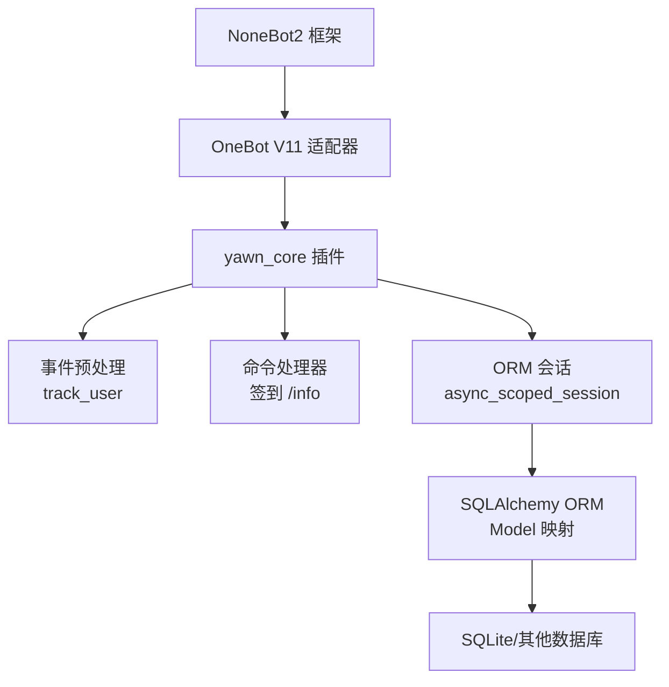
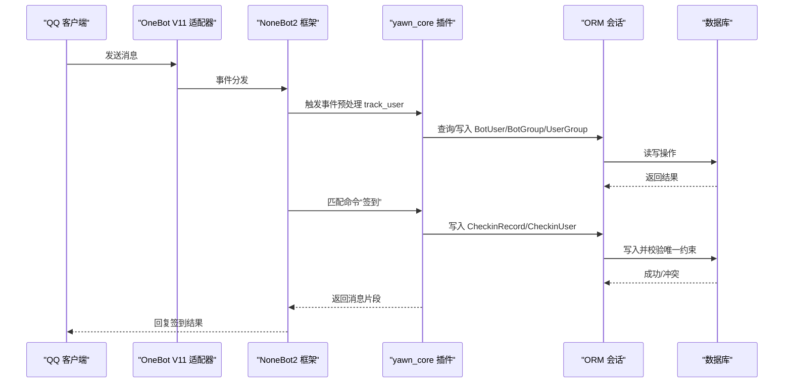
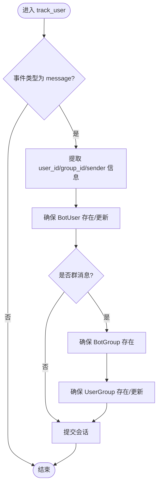
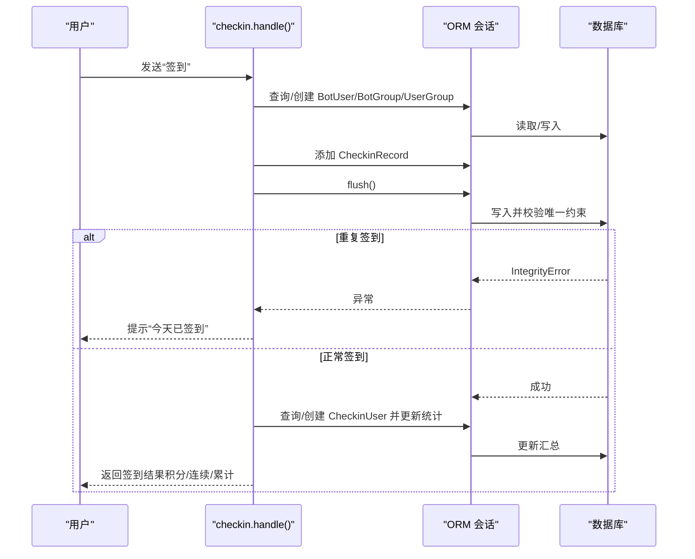
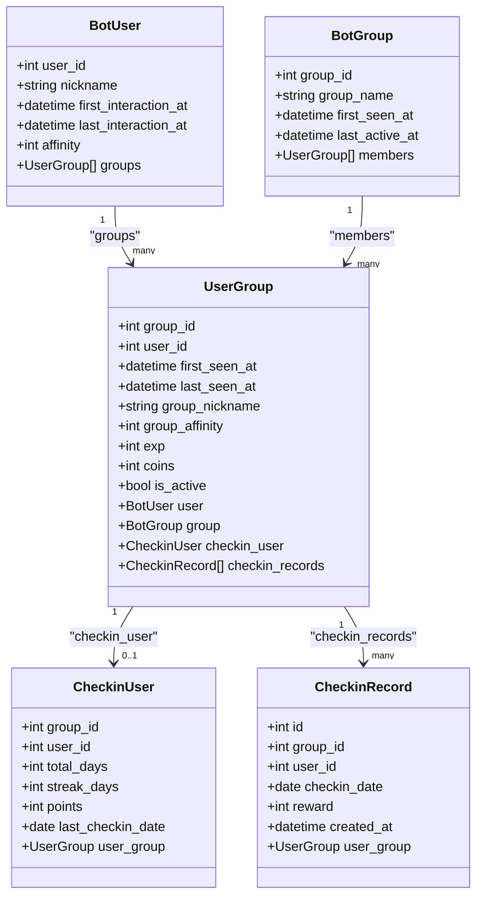
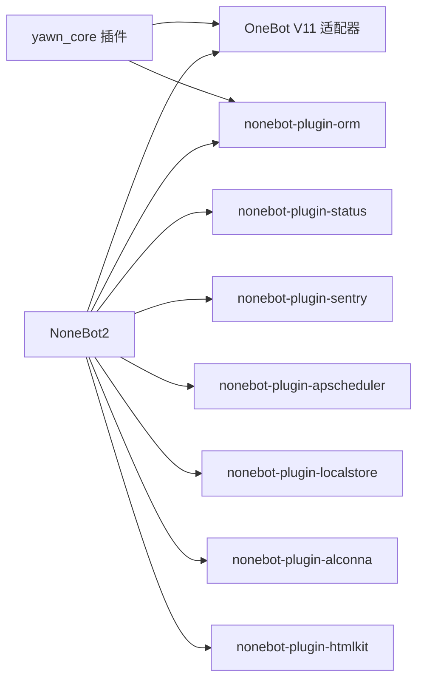

# 项目概述

<cite>
**本文引用的文件**   
- [README.md](file://README.md)
- [pyproject.toml](file://pyproject.toml)
- [src/plugins/yawn_core/__init__.py](file://src/plugins/yawn_core/__init__.py)
- [src/plugins/yawn_core/checkin.py](file://src/plugins/yawn_core/checkin.py)
- [src/plugins/yawn_core/info.py](file://src/plugins/yawn_core/info.py)
- [src/plugins/yawn_core/data_models/bot_user.py](file://src/plugins/yawn_core/data_models/bot_user.py)
- [src/plugins/yawn_core/data_models/bot_group.py](file://src/plugins/yawn_core/data_models/bot_group.py)
- [src/plugins/yawn_core/data_models/user_group.py](file://src/plugins/yawn_core/data_models/user_group.py)
- [src/plugins/yawn_core/data_models/checkin_record.py](file://src/plugins/yawn_core/data_models/checkin_record.py)
- [src/plugins/yawn_core/data_models/checkin_user.py](file://src/plugins/yawn_core/data_models/checkin_user.py)
- [data/nonebot_plugin_orm/migrations/yawn_core/b15555e176e4_add_checkin_tables.py](file://data/nonebot_plugin_orm/migrations/yawn_core/b15555e176e4_add_checkin_tables.py)
</cite>

## 目录
1. [简介](#简介)
2. [项目结构](#项目结构)
3. [核心组件](#核心组件)
4. [架构总览](#架构总览)
5. [详细组件分析](#详细组件分析)
6. [依赖关系分析](#依赖关系分析)
7. [性能与扩展性](#性能与扩展性)
8. [故障排查指南](#故障排查指南)
9. [结论](#结论)
10. [附录：常用命令与用例](#附录常用命令与用例)

## 简介
YawnBot 是基于 NoneBot2 的 QQ 机器人插件项目，采用插件化设计，提供签到系统、用户管理与群组管理三大核心能力。数据持久化通过 nonebot-plugin-orm（基于 SQLAlchemy ORM）实现，使用 Alembic 进行数据库迁移。项目遵循 OneBot V11 协议，适配 QQ 群消息场景，支持自动追踪用户首次对话、群内发言、签到统计等常见业务。

本概述既适合初学者快速理解项目目标与用法，也为有经验的开发者提供架构与实现细节。

## 项目结构
- 插件根目录位于 src/plugins/yawn_core，包含事件预处理、命令处理器和数据模型。
- 数据模型集中在 data_models 子模块，定义 BotUser、BotGroup、UserGroup、CheckinRecord、CheckinUser 五张表。
- 迁移脚本位于 data/nonebot_plugin_orm/migrations/yawn_core，用于创建/升级表结构与约束。
- 项目配置在 pyproject.toml，声明依赖、插件加载与运行参数。

图表来源
- [pyproject.toml:25-43](file://pyproject.toml#L25-L43)
- [src/plugins/yawn_core/__init__.py:16-74](file://src/plugins/yawn_core/__init__.py#L16-L74)
- [src/plugins/yawn_core/checkin.py:22-26](file://src/plugins/yawn_core/checkin.py#L22-L26)
- [src/plugins/yawn_core/info.py:6](file://src/plugins/yawn_core/info.py#L6)

章节来源
- [README.md:1-13](file://README.md#L1-L13)
- [pyproject.toml:1-43](file://pyproject.toml#L1-L43)

## 核心组件
- 事件预处理 track_user：拦截 message 类型事件，自动维护 BotUser、BotGroup、UserGroup 的存在性与基础时间戳、昵称信息。
- 签到命令 checkin：处理“签到”指令，随机奖励积分，记录签到历史，更新累计/连续签到天数与总积分，并保证每天每群每人仅能签到一次。
- 信息命令 info：获取并展示机器人登录信息与版本信息，尝试创建调试文件夹（失败时友好提示）。

章节来源
- [src/plugins/yawn_core/__init__.py:16-74](file://src/plugins/yawn_core/__init__.py#L16-L74)
- [src/plugins/yawn_core/checkin.py:22-147](file://src/plugins/yawn_core/checkin.py#L22-L147)
- [src/plugins/yawn_core/info.py:6-39](file://src/plugins/yawn_core/info.py#L6-L39)

## 架构总览
整体采用 NoneBot2 插件体系：
- 适配器层：OneBot V11 接收 QQ 消息事件。
- 插件层：yawn_core 插件注册事件预处理与命令处理器。
- 数据层：nonebot-plugin-orm 提供异步会话与 ORM 映射；SQLAlchemy 负责对象到表的映射与约束。
- 存储层：默认 SQLite（可通过配置切换），迁移由 Alembic 管理。

图表来源
- [src/plugins/yawn_core/__init__.py:16-74](file://src/plugins/yawn_core/__init__.py#L16-L74)
- [src/plugins/yawn_core/checkin.py:41-147](file://src/plugins/yawn_core/checkin.py#L41-L147)
- [pyproject.toml:25-43](file://pyproject.toml#L25-L43)

## 详细组件分析

### 事件预处理：用户与群组追踪
- 功能要点
  - 仅处理 message 类型事件。
  - 首次对话：创建 BotUser，记录首次交互时间与昵称。
  - 群聊消息：确保 BotGroup 存在；创建或更新 UserGroup，记录首次/最近发言时间、群昵称。
  - 统一提交事务。
- 关键流程
  - 解析 user_id、group_id、sender.card/nickname。
  - 按主键或联合主键查询并补全缺失实体。
  - 更新 last_interaction_at/last_seen_at 与昵称字段。
- 复杂度与影响
  - 每次消息至少 1~3 次查询与可能的插入，O(1) 级别。
  - 对高频消息场景，建议关注连接池与会话复用（由 nonebot-plugin-orm 管理）。

图表来源
- [src/plugins/yawn_core/__init__.py:16-74](file://src/plugins/yawn_core/__init__.py#L16-L74)

章节来源
- [src/plugins/yawn_core/__init__.py:16-74](file://src/plugins/yawn_core/__init__.py#L16-L74)

### 签到系统：checkin 命令
- 功能要点
  - 命令名：“签到”，优先级 5，阻塞处理。
  - 时区：Asia/Shanghai，按日期判断重复签到。
  - 奖励：随机 5~15 积分。
  - 数据一致性：通过 UniqueConstraint 与 IntegrityError 防止同一天同一群重复签到。
  - 统计：更新 CheckinUser 的 total_days、streak_days、points、last_checkin_date。
- 关键流程
  - 获取/创建 BotUser、BotGroup、UserGroup。
  - 写入 CheckinRecord 并 flush 以触发唯一约束检查。
  - 若冲突则回滚并提示已签到；否则更新汇总并返回结果。
- 复杂度与影响
  - 单次签到涉及多次查询与一次插入，O(1)。
  - 高并发下依赖数据库唯一约束保证幂等性。

图表来源
- [src/plugins/yawn_core/checkin.py:22-147](file://src/plugins/yawn_core/checkin.py#L22-L147)
- [src/plugins/yawn_core/data_models/checkin_record.py:12-53](file://src/plugins/yawn_core/data_models/checkin_record.py#L12-L53)

章节来源
- [src/plugins/yawn_core/checkin.py:22-147](file://src/plugins/yawn_core/checkin.py#L22-L147)
- [src/plugins/yawn_core/data_models/checkin_record.py:12-53](file://src/plugins/yawn_core/data_models/checkin_record.py#L12-L53)
- [src/plugins/yawn_core/data_models/checkin_user.py:12-47](file://src/plugins/yawn_core/data_models/checkin_user.py#L12-L47)

### 信息命令：info
- 功能要点
  - 命令名：“info”，别名包括“个人信息”“我的信息”“用户信息”。
  - 获取机器人登录信息与版本信息，组装消息片段返回。
  - 尝试创建名为“调试信息”的群文件夹，同名时友好提示。
- 错误处理
  - 捕获 ActionFailed，区分“同名文件夹已存在”与其他失败原因。

章节来源
- [src/plugins/yawn_core/info.py:6-39](file://src/plugins/yawn_core/info.py#L6-L39)

### 数据模型与关系图
- 实体说明
  - BotUser：全局用户，记录昵称、首次/最近交互时间、全局好感度。
  - BotGroup：全局群组，记录群名、首次出现时间、最近活跃时间。
  - UserGroup：用户与群的关联，记录首次/最近发言时间、群昵称、群内扩展属性（好感度、经验、金币、活跃度）。
  - CheckinRecord：签到历史记录，含 group_id、user_id、checkin_date、reward、created_at，并通过唯一约束保证“每群每人每天一次”。
  - CheckinUser：群内用户签到汇总，含 total_days、streak_days、points、last_checkin_date。
- 关系概览
  - BotUser 1 对多 UserGroup。
  - BotGroup 1 对多 UserGroup。
  - UserGroup 1 对 1 CheckinUser（可选）。
  - UserGroup 1 对多 CheckinRecord。

图表来源
- [src/plugins/yawn_core/data_models/bot_user.py:12-32](file://src/plugins/yawn_core/data_models/bot_user.py#L12-L32)
- [src/plugins/yawn_core/data_models/bot_group.py:12-29](file://src/plugins/yawn_core/data_models/bot_group.py#L12-L29)
- [src/plugins/yawn_core/data_models/user_group.py:15-61](file://src/plugins/yawn_core/data_models/user_group.py#L15-L61)
- [src/plugins/yawn_core/data_models/checkin_record.py:12-53](file://src/plugins/yawn_core/data_models/checkin_record.py#L12-L53)
- [src/plugins/yawn_core/data_models/checkin_user.py:12-47](file://src/plugins/yawn_core/data_models/checkin_user.py#L12-L47)

章节来源
- [src/plugins/yawn_core/data_models/bot_user.py:12-32](file://src/plugins/yawn_core/data_models/bot_user.py#L12-L32)
- [src/plugins/yawn_core/data_models/bot_group.py:12-29](file://src/plugins/yawn_core/data_models/bot_group.py#L12-L29)
- [src/plugins/yawn_core/data_models/user_group.py:15-61](file://src/plugins/yawn_core/data_models/user_group.py#L15-L61)
- [src/plugins/yawn_core/data_models/checkin_record.py:12-53](file://src/plugins/yawn_core/data_models/checkin_record.py#L12-L53)
- [src/plugins/yawn_core/data_models/checkin_user.py:12-47](file://src/plugins/yawn_core/data_models/checkin_user.py#L12-L47)

## 依赖关系分析
- 运行时依赖
  - nonebot2[fastapi]：核心框架与 Web 服务。
  - nonebot-adapter-onebot：OneBot V11 适配器。
  - nonebot-plugin-orm[sqlite]：ORM 插件，默认 SQLite 驱动。
  - 其他插件：status、sentry、apscheduler、localstore、alconna、htmlkit。
- 插件加载
  - plugin_dirs 指向 src/plugins，yawn_core 作为本地插件被加载。
  - 各插件通过 module_name 映射到具体模块。

图表来源
- [pyproject.toml:7-17](file://pyproject.toml#L7-L17)
- [pyproject.toml:25-43](file://pyproject.toml#L25-L43)

章节来源
- [pyproject.toml:7-17](file://pyproject.toml#L7-L17)
- [pyproject.toml:25-43](file://pyproject.toml#L25-L43)

## 性能与扩展性
- 事件预处理
  - 每条消息都会触发用户/群组追踪，建议在高频场景中关注数据库 I/O 与连接池配置。
  - 可考虑批量写入或延迟提交以降低锁竞争（当前为逐条 commit）。
- 签到逻辑
  - 通过数据库唯一约束保证幂等，避免应用层重复判断带来的竞态问题。
  - 随机奖励与统计更新均为 O(1)，适合高并发。
- 可扩展点
  - 在 UserGroup 中已有 exp、coins、group_affinity 等扩展字段，便于后续引入等级、货币、亲密度等玩法。
  - 可在 checkin 模块增加任务调度（apscheduler）进行每日重置或统计报表生成。

## 故障排查指南
- 重复签到提示
  - 现象：用户在同一天再次签到收到“今天已经签到过了哦~”。
  - 原因：数据库唯一约束 uq_checkin_record_once_per_day 生效。
  - 处理：无需干预，属预期行为。
- 创建群文件夹失败
  - 现象：info 命令执行后提示“文件夹已经存在，不需要重复创建”或“创建群文件夹失败: ...”。
  - 原因：OneBot API 返回 ActionFailed，可能因同名文件夹或权限不足。
  - 处理：根据 wording 内容判断，必要时手动清理或调整权限。
- 新用户未记录
  - 现象：首次对话后无用户记录。
  - 原因：事件非 message 类型或未触发预处理。
  - 处理：确认事件类型与插件加载状态。

章节来源
- [src/plugins/yawn_core/checkin.py:109-114](file://src/plugins/yawn_core/checkin.py#L109-L114)
- [src/plugins/yawn_core/info.py:32-39](file://src/plugins/yawn_core/info.py#L32-L39)
- [src/plugins/yawn_core/__init__.py:16-22](file://src/plugins/yawn_core/__init__.py#L16-L22)

## 结论
YawnBot 的 yawn_core 插件以 NoneBot2 为核心，结合 OneBot V11 与 SQLAlchemy ORM，实现了稳定的用户与群组追踪以及健壮的签到系统。其插件化设计与清晰的职责划分，使得功能扩展与维护成本较低。对于初学者，可从“签到”和“info”两个命令入手；对于资深开发者，可基于现有数据模型与事件预处理机制，进一步扩展等级、货币、活动等业务。

## 附录：常用命令与用例
- 启动与开发
  - 使用 nb create 生成项目，nb plugin create 创建插件，编写于 src/plugins 目录，nb run --reload 运行。
- 常用命令
  - “签到”：在群内发送“签到”，获得随机积分并更新累计/连续签到天数。
  - “info”/“个人信息”/“我的信息”/“用户信息”：查看机器人登录信息与版本信息，尝试创建调试文件夹。
- 典型用例
  - 新用户首次对话：自动创建 BotUser 并记录首次交互时间。
  - 群内首次发言：自动创建 BotGroup 与 UserGroup，记录首次/最近发言时间与群昵称。
  - 每日签到：限制每天一次，失败时给出友好提示。

章节来源
- [README.md:3-8](file://README.md#L3-L8)
- [src/plugins/yawn_core/checkin.py:22-26](file://src/plugins/yawn_core/checkin.py#L22-L26)
- [src/plugins/yawn_core/info.py:6](file://src/plugins/yawn_core/info.py#L6)